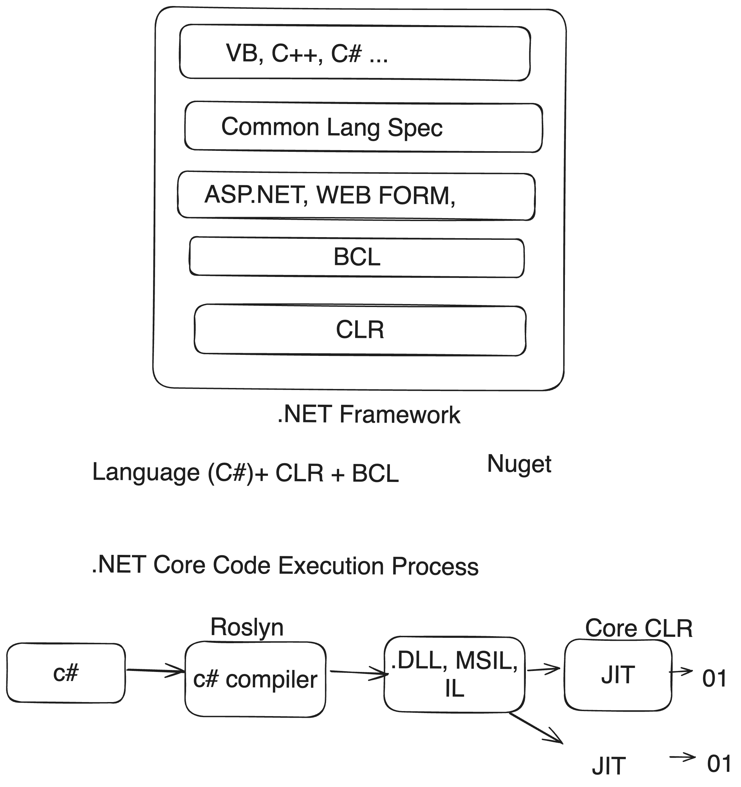
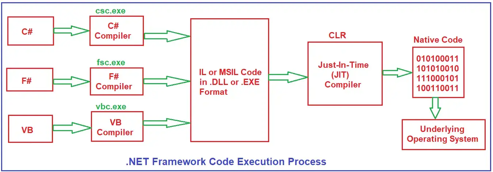
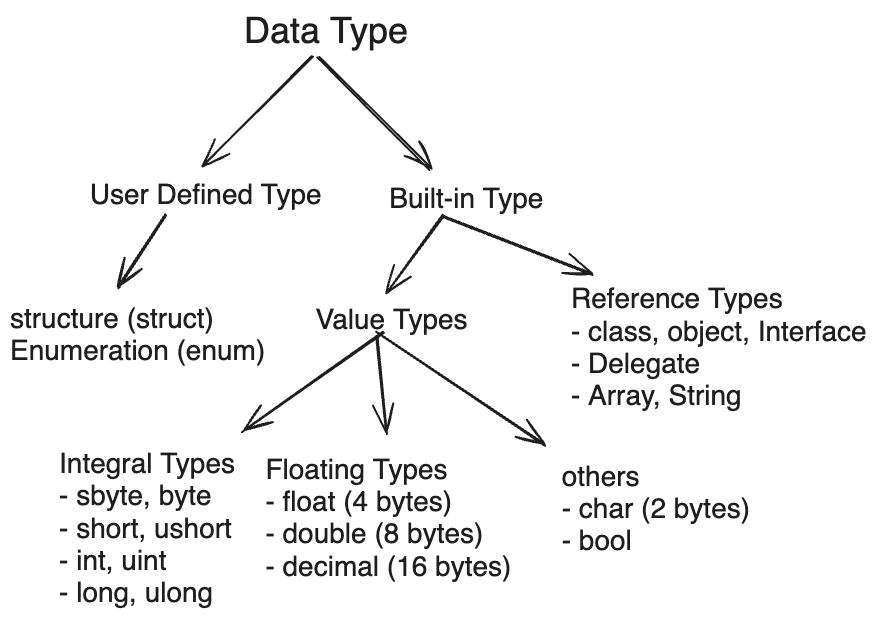
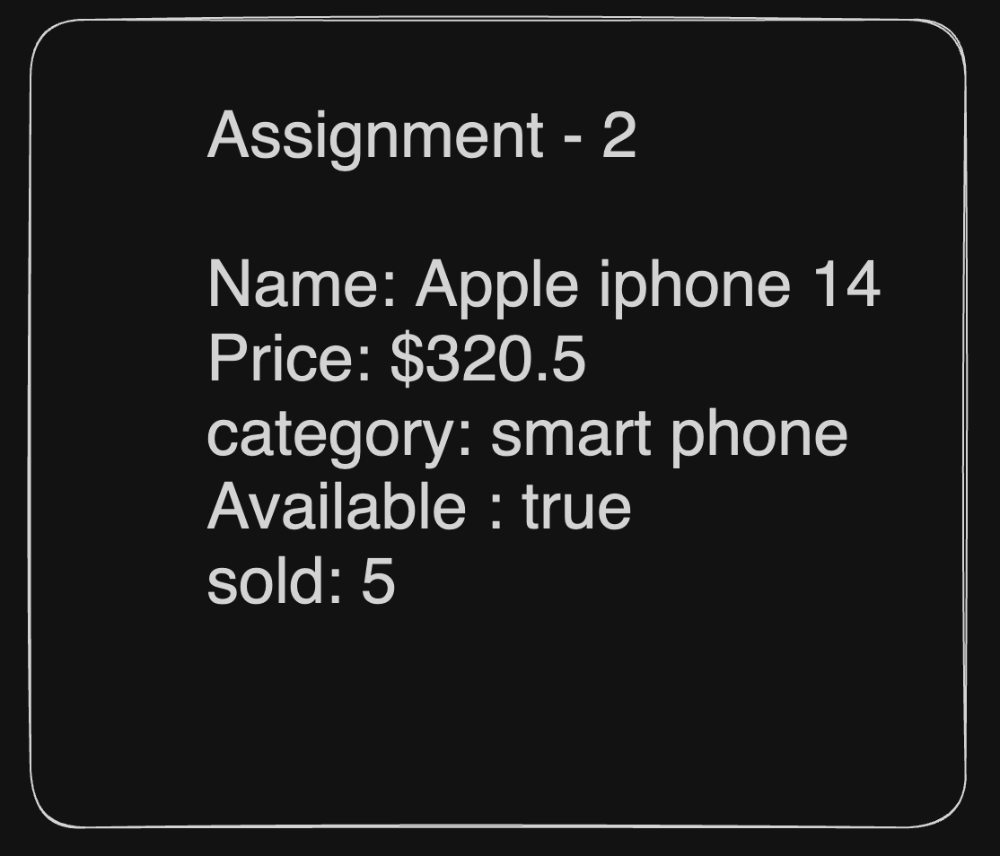

# C# Documentation

## Table of Contents

1. [Basic C#]
   - [1. Intro to C#](#basic-1-introduction)
      - [Intro to C# language](#11-intro-to-c-sharp-language)  
      - [Setting up the environment](#12-setting-up-the-environment)  
      - [First C# Program](#13-create-first-console-application)  
      - [Comments and escape sequences](#14-comments-and-escape-sequences)  
      - [Variables and data types](#15-variables-and-data-types)  
      - [User Input](#16-user-input)  
      - [Math operatoions & Precedence](#17-math-operatoions--precedence)  
      - [Formatting output](#18-formatting-output---string-concatenation--interpolation)  
   - [2. Operators](#basic-2-operators)  
   - [3. Control Statement](#basic-3-control-statement)  
      - [Conditional Control Statement](#31-conditional-control-statement)  
      - [Loop Control Statement](#32-loop-control-statement)  
   - [4. Methods](#basic-4-methods--function)  


2. [Intermediate C]()
   - [Intermediate 1. OOP](#intermediate-1-oop)
      - [Class and Object](#classes-and-objects)
   - [Intermediate 1. OOP](#intermediate-1-oop)
3. [3. Advanced C](#basic-c)
   - []()

## Basic 1. Introduction

### 1.1 Intro to C-sharp language

#### 1.1.1 Programming language

A language that Humans use to communicate with machines. Without computer programs, we wouldn't have smartphones, websites, or even exploration in outer space. Low-level, mid-level and high level language.

#### 1.1.2 What is C#? Why C#?

C# (pronounced "C sharp") is a modern, object-oriented programming language developed by Microsoft. It is designed for building a variety of applications on the Microsoft .NET platform. C# is widely used for developing desktop applications, web applications, mobile apps, cloud-based services, and game development.

Key features and aspects of C# include:

1. **Object-Oriented:** C# is an object-oriented programming (OOP) language, supporting concepts such as classes, objects, encapsulation, inheritance, and polymorphism.

2. **Managed Code:** C# code is typically compiled into an intermediate language called Common Intermediate Language (CIL), and it runs on the Common Language Runtime (CLR), which provides features like memory management (garbage collection), exception handling, and security.

3. **Type-Safe:** C# is statically typed, which means that the type of a variable must be declared before it can be used. This helps catch type-related errors at compile time.

4. **Syntax:** C# syntax is influenced by languages like C, C++, and Java. If you are familiar with these languages, you'll find many similarities in C# syntax. C++ and Visual Basics = C#

5. **Rich Standard Library:** C# comes with a comprehensive standard library, part of the .NET Framework or .NET Core, which provides functionality for tasks such as file I/O, networking, database access, and more.

6. **Integrated Development Environment (IDE):** Microsoft provides Visual Studio, a powerful IDE for C# development. Visual Studio offers features like code completion, debugging tools, and project management, making it a popular choice among C# developers.

7. **Cross-Platform Development:** With the introduction of .NET Core, C# is no longer limited to Windows development. .NET Core is a cross-platform, open-source framework that allows C# developers to build applications for Windows, Linux, and macOS.

8. **Language Features:** C# includes modern language features such as LINQ (Language-Integrated Query), async/await for asynchronous programming, properties, events, delegates, and more.

9. **Web Development:** C# is commonly used for web development, particularly in combination with ASP.NET, a framework for building web applications.

10. **Game Development:** C# is a primary language for game development using the Unity game engine. Unity enables developers to create games for various platforms, including desktop, mobile, and consoles.

- Summary
  - C# is a powerful OOP language developed by Micorsoft.
  - General Purpose: We can create Console Application, windows form application, mobile application, web application, desktop and game application (2D/3D).
  - we can built application on the Microsoft .NET platform.
  - Cross Platform Independent: Micorsoft .NET Core made sure C# is not more only for windows but for linux and MacOS well.
  - typed safe / statically typed language

#### 1.1.3 [.NET Framework & .NET Core](https://www.javatpoint.com/vb-net-dot-net-framework-introduction)


[!dot net framework](images/NET.png)


- The .NET Framework is not only a language, but it is also a software and language neutral platform.
- 2 main components: CLR (Common Language Runtime) take care of execution our app or running apps; .NET Framework class Library provides reusable code
- NET Framework is a mature framework primarily used for Windows-based applications, while .NET Core is a modern, cross-platform framework optimized for cloud-native and containerized applications. With the release of .NET 5 (and later .NET 6), Microsoft unified the .NET platform, merging .NET Core and .NET Framework into a single, unified platform called .NET. This unified platform provides a consistent development experience across different platforms and environments.

- .NET Ecosystem = Language (c#, f#, VB) + Runtime (CLR/ CORE CLR), Librariers (BCL Functions Base Class Libraries: System is an example)
  - CLR = JVM
  - Nuget package manager = npm

### 1.2 Setting up the environment

- step 1: install .NET Core; for mac using homebrew. `brew install --cask dotnet-sdk` and check the version `dotnet --version` `dotnet --help` for any command use `dotnet command --help`

- step 2: install IDE: Visual Studio is the popular one.

Visual Studio Code (VS Code) and Visual Studio (VS) are both popular Integrated Development Environments (IDEs) used for software development, but they have some key differences:

  1. **VS Code (Visual Studio Code)**:
    - VS Code is a lightweight, open-source code editor developed by Microsoft.
    - It provides extensive support for various programming languages through extensions.
    - VS Code is highly customizable and has a vast ecosystem of extensions for additional features and functionalities.
    - VS Code is suitable for a wide range of development tasks, including web development, cloud development, and scripting.

  2. **Visual Studio (VS)**:
    - Visual Studio is a full-featured Integrated Development Environment (IDE) developed by Microsoft.
    - All the tools are already installed for development purpose. It provides comprehensive tools and features for various types of software development, including desktop applications, web applications, mobile applications, and cloud services.
    - Visual Studio includes powerful debugging tools, code analysis, and testing capabilities.
    - Visual Studio has built-in support for multiple programming languages and platforms, including C#, C++, .NET, and more.  
    - It offers extensive project and solution management features, making it suitable for large-scale enterprise development.

- step 3: some useful for .NET and c# extension

  When working with C# and .NET in Visual Studio Code on macOS, you'll want to install some extensions to enhance your development experience. Here are some essential extensions:

    1. **C# for Visual Studio Code**: This official extension provides support for C# syntax highlighting, debugging, and IntelliSense. It's essential for C# development in Visual Studio Code.
      - [C# for Visual Studio Code](https://marketplace.visualstudio.com/items?itemName=ms-dotnettools.csharp)

    2. **.NET Core Test Explorer**: If you're writing unit tests with .NET Core, this extension allows you to run and debug your tests directly within Visual Studio Code.
      - [.NET Core Test Explorer](https://marketplace.visualstudio.com/items?itemName=formulahendry.dotnet-test-explorer)

    3. **NuGet Package Manager**: This extension allows you to manage NuGet packages directly within Visual Studio Code, making it easier to install, update, and remove packages.
      - [NuGet Package Manager](https://marketplace.visualstudio.com/items?itemName=jmrog.vscode-nuget-package-manager)

    4. **C# XML Documentation Comments**: This extension provides IntelliSense for XML documentation comments in C#, helping you write better-documented code.
      - [C# XML Documentation Comments](https://marketplace.visualstudio.com/items?itemName=k--kato.docomment)

    5. **C# Extensions**: This extension provides additional C# code snippets and tools to improve your productivity.
      - [C# Extensions](https://marketplace.visualstudio.com/items?itemName=jchannon.csharpextensions)

    6. **C# FixFormat**: This extension automatically formats your C# code according to configurable rules, ensuring consistent code style.
      - [C# FixFormat](https://marketplace.visualstudio.com/items?itemName=Leopotam.csharpfixformat)

    7. **Debugger for Unity**: If you're developing Unity games using C#, this extension allows you to debug Unity applications directly from Visual Studio Code.
      - [Debugger for Unity](https://marketplace.visualstudio.com/items?itemName=Unity.unity-debug)

    8. **Unity Code Snippets**: Another useful extension for Unity development, providing code snippets for common Unity-related tasks.
      - [Unity Code Snippets](https://marketplace.visualstudio.com/items?itemName=kleber-swf.unity-code-snippets)
    
    9. C# Dev kit - C# Dev Kit extension enhances VS Code's existing Workspaces with a new Solution Explorer view, providing a curated and structured view of your application for effortless, central project management. This lets you quickly add new projects or files to your solutions and easily build all or part of your solution.

    To install these extensions, you can open Visual Studio Code, navigate to the Extensions view by clicking on the square icon on the sidebar or by pressing `Cmd + Shift + X`, and search for each extension by name. Then, click on the extension and select "Install". Alternatively, you can install them from the links provided above.

- step 4: important commands: run `dotnet new list`
Here are some important .NET CLI (Command Line Interface) commands used in .NET development:

1. **dotnet new**: Creates a new project or file based on the specified template.
   - Example: `dotnet new console` creates a new console application.

2. **dotnet restore**: Restores the dependencies and tools of a project.
   - Example: `dotnet restore` restores the NuGet packages for a project.

3. **dotnet build**: Builds the project and its dependencies.
   - Example: `dotnet build` compiles the project into executable output.

4. **dotnet run**: Builds and runs the project.
   - Example: `dotnet run` compiles and executes the project's entry point.

5. **dotnet test**: Executes the tests in the project.
   - Example: `dotnet test` runs the unit tests in the project.

6. **dotnet publish**: Publishes the application for deployment.
   - Example: `dotnet publish -c Release -o ./publish` publishes the application to the specified output directory in Release mode.

7. **dotnet clean**: Cleans the output directory and intermediate build files.
   - Example: `dotnet clean` removes the build artifacts from the project directory.

8. **dotnet add reference**: Adds a project-to-project (P2P) reference to the project file.
   - Example: `dotnet add reference ../path/to/project.csproj` adds a reference to another project.

9. **dotnet ef**: Entity Framework Core command-line tools for database migrations and scaffolding.
   - Example: `dotnet ef migrations add InitialCreate` creates a new migration for the database.

10. **dotnet tool install**: Installs the specified .NET Core CLI tool.
    - Example: `dotnet tool install --global dotnet-ef` installs the Entity Framework Core CLI tool globally.

### 1.3 Create First Console Application

- run `dotnet new list` and explain all the templates
- then create a basic console application with `dotnet new console` or `dotnet new console -o FirstConsoleApp`
- discuss folder structure:
  - .csproj (configuraion of the project = kind of same as package.json; later on if we add any package it will keep the information of the packages that we install)
  - entry point is the .cs file
    - run the project: dotnet run (run once)
    - watch the output: dotnet watch (run after every changes you made)
    - test the project: dotnet test
    - add package to the project: dotnet add packageName
    - add library from [nuget.org](https://www.nuget.org/) - search http
  - When you build a .NET project, the compiler generates intermediate language (IL) code, which is then translated into native machine code by the Just-In-Time (JIT) compiler when the application runs. **The compiled binary files,** along with any necessary resource files, configuration files, and dependencies, are stored in the bin directory.
  - create a .gitignore file `bin/ obj/` push the code and get again after cloning by `dotnet run`
- **.NET Framework code execution process** 
  - .dll is the byte code or intermediate language
  - you wont see the binary code as the JIT (Just In Time) do not expose cause durinf the running process it will keep the binary code in the memory. JIT can create the binary code based the OS and it made the platform independent.

- output: a message on screen/terminal. `Console.WriteLine("Welcome to C#!");`

  ```c#
  using System;

  public class Program
  {
      public static void Main(string[] args)
      {
          Console.Write("Welcome to the Code Playground");
          Console.WriteLine("Welcome to the Code Playground");
          Console.ReadKey();
      }
  }
  ```

- break down basic structure

- Namespaces / Class: helps to separate code. `using System;` allows you to use Console.WriteLine method and other methods. Namespaces are optional. Instead of System.Console.WriteLine use Console.WriteLine method by use System. Use . operator to access the class or namespace members.

- In C#, creating a class is mandatory for the program’s execution. Main method is the entry point or starting point of the program.

To run the first C# program in Visual Studio Code (VSCode), follow these steps:

#### Step 1: Install Required Software

1. **Install Visual Studio Code:**
   If you don't have Visual Studio Code installed, you can download and install it from the official website: [Visual Studio Code](https://code.visualstudio.com/).

2. **Install .NET SDK:**
   Ensure you have the .NET SDK installed on your machine. You can follow the previous instructions to install it using Homebrew on macOS.

#### Step 2: Set Up a C# Project

1. **Create a Folder:**
   Open your terminal and create a new folder for your C# project:

   ```bash
   mkdir HelloWorld
   cd HelloWorld
   ```

2. **Initialize a C# Project:**
   Run the following command to initialize a new C# console application:

   ```bash
   dotnet new console
   ```

   This command creates a simple "Hello World" C# console application.

#### Step 3: Open Project in Visual Studio Code

1. **Open VSCode:**
   Open Visual Studio Code and navigate to the folder you created for your C# project:

   ```bash
   code .
   ```

   This command opens the current folder in VSCode.

#### Step 4: Run the Program

1. **Open Terminal in VSCode:**
   In VSCode, open a new terminal by clicking on "View" in the top menu and selecting "Terminal."

2. **Build and Run:**
   In the terminal, run the following commands to build and run your C# program:

   ```bash
   dotnet build
   dotnet run
   ```

   This will build and execute your C# program. You should see the "Hello World" output in the terminal.

Congratulations! You've successfully run your first C# program in Visual Studio Code. You can now start exploring and writing C# code in your VSCode environment.

#### Statements

- A statement (a line of code) performs a specific task. Each Statement ends with a semicolon.
- In case of multiple statements top to bottom is the apporach of executing statements.

```c#
public class Program{
  public static void Main(string[] args)
  {
    Console.WriteLine("My name is Anisul Islam.");
    Console.WriteLine(143);
  }
}
```

#### Assignment 1: Print your bio

```csharp
class Test
{
  public static void Main(string[] args)
  {
    Console.WriteLine("Name: Anisul Islam");
    Console.WriteLine("Age: 32");
    Console.WriteLine("Profession: Software developer");
  }
}
```

#### Naming conventions in Micorsoft ecosystem

Sure, here's a breakdown of which naming convention is commonly used for what purpose in the Microsoft ecosystem:

1. **PascalCase**:
   - Class names: Used for naming classes and types. Example: `CustomerService`, `HttpRequest`.
   - Method names: Used for naming methods and functions. Example: `CalculateTotal`, `SendEmail`.
   - Property names: Used for naming properties of classes and objects. Example: `FirstName`, `TotalAmount`.

2. **camelCase**:
   - Variable names: Used for naming variables, parameters, and local variables. Example: `totalAmount`, `numberOfItems`.
   - Method parameter names: Used for naming parameters of methods and functions. Example: `firstName`, `orderId`.
   - undesrcore followed by camelCase for private instance.

3. **snake_case**:
   - File names: Used for naming files in some cases, particularly in web development. Example: `index.html`, `user_profile.css`.
   - Database identifiers: Used for naming database tables, columns, and stored procedures in some cases. Example: `user_profile`, `order_details`.

4. **Hungarian notation**:
   - Less commonly used in modern development but may still be found in legacy codebases. Example: `strFirstName` for a string variable holding a first name, `intAge` for an integer variable holding an age.

5. **Abbreviations**:
   - Used for common terms and concepts, especially in APIs and libraries. Example: `IO` for Input/Output, `HTTP` for Hypertext Transfer Protocol.

6. **Acronyms**:
   - Used for abbreviations and initialisms. Example: `HTML` for Hypertext Markup Language, `JSON` for JavaScript Object Notation.

7. **Namespaces and Assemblies**:
   - Namespaces and assemblies generally follow PascalCase and may include a reverse domain name. Example: `System.Collections`, `Microsoft.AspNetCore.Mvc`.

8. **Constants**:
   - Constants are typically named using PascalCase with all uppercase letters. Example: `MAX_VALUE`, `DEFAULT_TIMEOUT`.

These conventions help maintain consistency and readability across codebases, making it easier for developers to understand and maintain the code. However, it's essential to follow the specific naming guidelines of the project or organization you're working on.

### 1.4 comments and escape sequences

- what is comment and why do you need comment?
      - to explain your code
      - to avoid running some part of your code for debugging
- single line comment -> `// this is a single line comment`
- multi-line comments -> `/*   */`
- escape sequences: \n, \t, \r, \\, \", \'

```csharp
   string fullName = "Aniul\nIslam\nRubel";
   Console.WriteLine(fullName);
   Console.ReadKey();
```

- verbatim string: it allows linebreaks in strings. use @ symbol before double quotes.

```csharp
Console.WriteLine(@"Hello!
Welcome to the verbatim string");
```

### 1.5 Variables and data types

- variable declaration and initialization

#### Data type



- 2 main type: Built-in: Value Types, Reference Type, User Defined
- example
  - string; example of string: "this is a string" `string name; name="Anisul Islam";`
  - char; char bloodGroup = 'A'
  - int; int age = 32
  - double; double age = 95.4
  - float height = 1.82f;
  - decimal weight = 92.8m;
  - bool isRegistered = true;
  - DateTime (8 bytes) - value range from 0:00:00 on 1/1/2001 to 23:59:59 on 12/31/9999

C# provides several built-in data types, which can be categorized into the following groups:

1. **Value Types**:
   - **Integral Types**: Represent whole numbers without a fractional component.
     - `sbyte`: 8-bit signed integer (-128 to 127)
     - `byte`: 8-bit unsigned integer (0 to 255)
     - `short`: 16-bit signed integer (-32,768 to 32,767)
     - `ushort`: 16-bit unsigned integer (0 to 65,535)
     - `int`: 32-bit signed integer (-2,147,483,648 to 2,147,483,647)
     - `uint`: 32-bit unsigned integer (0 to 4,294,967,295)
     - `long`: 64-bit signed integer (-9,223,372,036,854,775,808 to 9,223,372,036,854,775,807)
     - `ulong`: 64-bit unsigned integer (0 to 18,446,744,073,709,551,615)
   - **Floating-Point Types**: Represent numbers with fractional parts.
     - `float`: 32-bit single-precision floating-point type
     - `double`: 64-bit double-precision floating-point type
     - `decimal`: 128-bit decimal type for financial and monetary calculations
   - **Other Value Types**:
     - `char`: 16-bit Unicode character
     - `bool`: Represents Boolean values (true or false)
     - struct : for small amount of data instead of class
     - enum
     - tuple : for stroing different realted data types in a single object
     - Nullable

2. **Reference Types**:
   - **Class**: Defines a reference type.
   - **Interface**: Defines a contract for classes to implement.
   - **Delegate**: Defines a reference to a method.
   - **Array**: Represents a collection of elements.
   - **String**: Represents a sequence of characters.
   - **Object**: The base class for all other types.

3. **Pointer Types** (Unsafe Code):
   - Allow direct memory manipulation and are rarely used in typical C# programming.

4. **DateTime**
   - DateTime (8 bytes) - value range from 0:00:00 on 1/1/2001 to 23:59:59 on 12/31/9999

C# also allows user-defined data types through the use of structures (`struct`) and enumerations (`enum`).

Here's an example demonstrating the declaration of variables with different data types:

```csharp
using System;

class Program
{
    static void Main()
    {
        // Integral Types
        sbyte sb = -100;
        byte b = 200;
        short sh = -30000;
        ushort ush = 60000;
        int i = -2000000000;
        uint ui = 4000000000;
        long l = -9000000000000000000;
        ulong ul = 18000000000000000000;

        // Floating-Point Types
        float f = 3.14f;
        double d = 3.14159265359;
        decimal dec = 123.45m;

        // Other Value Types
        char ch = 'A';
        bool flag = true;

        // Reference Types
        string str = "Hello, world!";
        object obj = 123;

        Console.WriteLine("Variables declared with different data types:");
        Console.WriteLine($"sbyte: {sb}");
        Console.WriteLine($"byte: {b}");
        Console.WriteLine($"short: {sh}");
        Console.WriteLine($"ushort: {ush}");
        Console.WriteLine($"int: {i}");
        Console.WriteLine($"uint: {ui}");
        Console.WriteLine($"long: {l}");
        Console.WriteLine($"ulong: {ul}");
        Console.WriteLine($"float: {f}");
        Console.WriteLine($"double: {d}");
        Console.WriteLine($"decimal: {dec}");
        Console.WriteLine($"char: {ch}");
        Console.WriteLine($"bool: {flag}");
        Console.WriteLine($"string: {str}");
        Console.WriteLine($"object: {obj}");
    }
}
```

- **structure type**

    for simple data structure such as storing colors, pints, coordinates. similar to classes but they have differences in many aspectes.

    In C#, a structure (struct) is a value type data type that allows you to encapsulate related data members and behaviors. Similar to classes, structures can have fields, properties, methods, and constructors. However, there are some key differences between classes and structures:

    1. **Memory Allocation**:
      - Objects of classes are allocated memory on the heap, while instances of structures are allocated memory on the stack.
      - This difference in memory allocation can lead to performance benefits for structures, especially for small, frequently used data types.

    2. **Inheritance**:
      - Structures cannot inherit from other structures or classes.
      - They cannot serve as base types for other structures or classes.

    3. **Default Constructor**:
      - Structures always have an implicit default parameterless constructor, which initializes all fields to their default values.

    4. **Copy Semantics**:
      - When you pass a structure to a method or assign it to another variable, the entire structure is copied. This contrasts with classes, where only a reference to the object is copied.

    5. **Boxing and Unboxing**:
      - Structures are value types, and they do not require boxing and unboxing when used in certain contexts. This can improve performance in scenarios where boxing and unboxing are frequent.

    Here's a basic example of a structure in C#:

    ```csharp
    using System;

    public struct Point
    {
        // Fields
        public int X;
        public int Y;

        // Constructor
        public Point(int x, int y)
        {
            X = x;
            Y = y;
        }

        // Method
        public void Display()
        {
            Console.WriteLine($"Point coordinates: ({X}, {Y})");
        }
    }

    class Program
    {
        static void Main()
        {
            // Creating an instance of the Point structure
            Point point = new Point(10, 20);

            // Accessing fields and calling method
            Console.WriteLine($"X coordinate: {point.X}");
            Console.WriteLine($"Y coordinate: {point.Y}");
            point.Display();
        }
    }
    ```

    In this example, `Point` is a structure that represents a point in 2D space. It has two fields `X` and `Y`, a constructor to initialize these fields, and a method `Display()` to print the coordinates of the point.

- enum type

  - In C#, an enumeration (enum) is a distinct type consisting of a set of named constants called the enumerator list.
  - Enums are used to define a group of named integral constants.
  - Enums are commonly used in scenarios where you have a fixed set of related values that represent different states or options, such as days of the week, months, status codes, etc.
  - They help make code more readable and maintainable by giving meaningful names to constant values.
  
  Here's how you define and use enums in C#:

    ```csharp
    // Syntax
    enum TypeName
    {
        Constant1,
        Constant2,
        // Add more constants as needed
    }
    ```

    ```csharp
    // Example
    using System;

    public class Program
    {
        // Define an enum for days of the week
        enum Days
        {
            Sunday,
            Monday,
            Tuesday,
            Wednesday,
            Thursday,
            Friday,
            Saturday
        }

        public static void Main(string[] args)
        {
            // Assign a value from the enum
            Days today = Days.Friday;

            // Output the value of today
            Console.WriteLine("Today is: " + today);
            
            // Convert enum value to int
            int dayNumber = (int)today;
            Console.WriteLine("Day number: " + dayNumber);
            
            // Convert int to enum value
            Days anotherDay = (Days)2;
            Console.WriteLine("Another day is: " + anotherDay);
        }
    }
    ```

    ```text
    // Output
    Today is: Friday
    Day number: 5
    Another day is: Tuesday
    ```

  - Enums provide a way to define a set of named integral constants that can be assigned to variables.
  - In the example, we define an enum `Days` with constants for each day of the week.
  - We assign the `Friday` constant to a variable `today`, and then output its value.
  - Enums are strongly typed, and you can convert between enum values and their underlying integral types (usually `int`).
  - You can also convert integral values to enum values using type casting.

- **tuple type**

  A tuple in C# is a data structure that allows you to store a fixed-size collection of heterogeneous elements (i.e., elements of different data types) in a single object. Tuples provide a convenient way to group together related data without the need to define a custom class or structure explicitly.

  Here's a basic example of how to use tuples in C#:

  ```csharp
  using System;

  class Program
  {
      static void Main()
      {
          // Creating a tuple
          var person = Tuple.Create("John", 30, true);

          // Accessing tuple elements
          Console.WriteLine($"Name: {person.Item1}");
          Console.WriteLine($"Age: {person.Item2}");
          Console.WriteLine($"IsEmployed: {person.Item3}");

          // Updating tuple elements (not allowed, tuples are immutable)
          // person.Item1 = "Alice"; // This will result in a compile-time error

          // Deconstructing a tuple
          (string name, int age, bool isEmployed) = person;
          Console.WriteLine($"Name: {name}, Age: {age}, IsEmployed: {isEmployed}");
      }
  }
  ```

  In this example:

  - We create a tuple `person` containing three elements: a string representing the person's name, an integer representing their age, and a boolean indicating whether they are employed.
  - We access tuple elements using the `Item1`, `Item2`, and `Item3` properties of the tuple object.
  - We demonstrate how to deconstruct a tuple into individual variables using the C# deconstruction syntax `(string name, int age, bool isEmployed) = person`.

  Starting from C# 7.0, you can also use named tuples, which provide more expressive code by giving names to the elements of the tuple. Here's how you can use named tuples:

  ```csharp
  using System;

  class Program
  {
      static void Main()
      {
          // Creating a named tuple
          var person = (Name: "John", Age: 30, IsEmployed: true);

          // Accessing named tuple elements
          Console.WriteLine($"Name: {person.Name}");
          Console.WriteLine($"Age: {person.Age}");
          Console.WriteLine($"IsEmployed: {person.IsEmployed}");

          // Deconstructing a named tuple
          (string name, int age, bool isEmployed) = person;
          Console.WriteLine($"Name: {name}, Age: {age}, IsEmployed: {isEmployed}");
      }
  }
  ```

  In this example, we define a tuple with named elements `Name`, `Age`, and `IsEmployed`, making the code more readable and self-explanatory. We then access these named elements directly using their names.

- dynamic and object type
    In C#, both `dynamic` and `object` are used to handle situations where the type of an object is not known at compile time. However, they have different behaviors and use cases:

    1. **`dynamic`**:
      - The `dynamic` keyword is used to declare a type that can hold any type of value at runtime.
      - It defers type checking until runtime rather than compile time.
      - It allows you to perform operations on objects without explicit type casting.
      - It provides late binding, meaning method calls and property accesses are resolved at runtime.
      - Example:

        ```csharp
          using System;

          class Program
          {
              static void Main(string[] args)
              {
                  // Example using object type
                  object obj = 10;
                  Console.WriteLine($"Object value: {obj}"); // Output: Object value: 10

                  int intValue = (int)obj; // Explicit casting
                  Console.WriteLine($"Int value: {intValue}"); // Output: Int value: 10

                  // Example using dynamic type
                  dynamic dynamicVariable = 10;
                  Console.WriteLine($"Dynamic variable: {dynamicVariable}"); // Output: Dynamic variable: 10

                  dynamicVariable = "Hello";
                  Console.WriteLine($"Dynamic variable: {dynamicVariable}"); // Output: Dynamic variable: Hello

                  dynamicVariable = DateTime.Now;
                  Console.WriteLine($"Dynamic variable: {dynamicVariable}"); // Output: Dynamic variable: [current datetime]
              }
          }

        ```

    2. **`object`**:
      - The `object` type is a reference type that represents the base type of all other types in C#.
      - It can hold any type of value but requires explicit casting to access its members or convert it to another type.
      - It is a compile-time construct and doesn't provide late binding like `dynamic`.
      - It is typically used when you need to work with values of different types in a homogeneous collection or when the specific type is not known at compile time.
  
    In summary, `dynamic` is used for late binding and dynamic behavior at runtime, while `object` is used for static typing and type safety at compile time. Choose between them based on your specific requirements and whether you need dynamic or static typing in your code.

- record and a delegate type:

    1. **Record**: (use record / struct / class based on your need)
      Records are a feature introduced in C# 9.0 that provide a concise syntax for creating immutable data types. Records are primarily used for modeling data and are especially useful for DTOs (Data Transfer Objects), entities, and other types where immutability and equality are important.

    ```csharp
    using System;

    // Example of a record
    public record Person(string FirstName, string LastName, int Age);

    class Program
    {
        static void Main()
        {
            // Creating an instance of the record
            var person = new Person("John", "Doe", 30);

            // Accessing properties
            Console.WriteLine($"Name: {person.FirstName} {person.LastName}, Age: {person.Age}");
        }
    }
    ```

    In the above example:

  - We define a `Person` record with properties `FirstName`, `LastName`, and `Age`.
  - Records automatically generate a constructor, properties, `Equals()` method, `GetHashCode()` method, and `ToString()` method based on their members.
  - We create an instance of the `Person` record and access its properties.

    2. **Delegate**:
      Delegates are used to define references to methods. They are similar to function pointers in C++ or function types in other languages. Delegates are especially useful for implementing events, callbacks, and LINQ queries.

        ```csharp
        using System;

        // Example of a delegate
        public delegate void MyDelegate(string message);

        class Program
        {
            static void Main()
            {
                // Creating an instance of the delegate
                MyDelegate myDelegate = DisplayMessage;

                // Invoking the delegate
                myDelegate("Hello, delegates!");

                // Multicast delegate
                myDelegate += DisplayAnotherMessage;
                myDelegate("Hello again!");
            }

            static void DisplayMessage(string message)
            {
                Console.WriteLine($"Message: {message}");
            }

            static void DisplayAnotherMessage(string message)
            {
                Console.WriteLine($"Another message: {message}");
            }
        }
        ```

        In the above example:

        - We define a delegate `MyDelegate` that points to methods accepting a `string` parameter and returning `void`.
        - We create an instance of the delegate and assign it to a method `DisplayMessage`.
        - We invoke the delegate, which in turn invokes the `DisplayMessage` method.
        - We demonstrate a multicast delegate by adding another method to the delegate invocation list using `+=`. When the delegate is invoked, both methods are called in the order they were added.

        These examples showcase the usage of records for immutable data types and delegates for method references and event handling in C#.

#### Class vs Struct vs Record

Key Differences:

- Classes are reference types with full support for inheritance and customization, while structs and records are value types with limited or no inheritance capabilities.
- Structs are primarily used for small, single-value data types and are passed by value, while records provide a concise syntax for defining immutable data types with value semantics.
- Records automatically generate boilerplate code for immutability and value equality, reducing developer overhead and potential sources of errors.
In summary, choose the appropriate type (class, struct, or record) based on the specific requirements of your application, considering factors such as mutability, inheritance, memory usage, and performance.

Sure, let's create an example to demonstrate the differences between classes, structs, and records.

**Example**:

Suppose we want to define a data type to represent a 2D point with X and Y coordinates. We'll create implementations using a class, a struct, and a record to showcase their differences.

1. **Class Implementation**:

   ```csharp
   public class PointClass
   {
       public int X { get; set; }
       public int Y { get; set; }

       public PointClass(int x, int y)
       {
           X = x;
           Y = y;
       }
   }
   ```

2. **Struct Implementation**:

   ```csharp
   public struct PointStruct
   {
       public int X { get; }
       public int Y { get; }

       public PointStruct(int x, int y)
       {
           X = x;
           Y = y;
       }
   }
   ```

3. **Record Implementation**:

   ```csharp
   public record PointRecord(int X, int Y);
   ```

Now, let's demonstrate the differences by creating instances of each type and modifying them:

```csharp
class Program
{
    static void Main(string[] args)
    {
        // Creating instances
        var classPoint = new PointClass(10, 20);
        var structPoint = new PointStruct(30, 40);
        var recordPoint = new PointRecord(50, 60);

        // Modifying values
        classPoint.X = 100; // Allowed because classes are mutable
        // structPoint.X = 200; // Error: Cannot modify readonly members in structs
        // recordPoint.X = 300; // Error: Records are immutable

        // Displaying values
        Console.WriteLine($"Class Point: ({classPoint.X}, {classPoint.Y})");
        Console.WriteLine($"Struct Point: ({structPoint.X}, {structPoint.Y})");
        Console.WriteLine($"Record Point: ({recordPoint.X}, {recordPoint.Y})");
    }
}
```

**Output**:

```
Class Point: (100, 20)
Struct Point: (30, 40)
Record Point: (50, 60)
```

**Explanation**:

- We can modify the `X` and `Y` properties of the `PointClass` instance because classes are mutable.
- In the `PointStruct` instance, we cannot modify the `X` and `Y` properties directly because structs are immutable. Attempting to do so will result in a compilation error.
- Similarly, the `PointRecord` instance is also immutable, so we cannot modify its properties directly. Any attempt to do so will result in a compilation error.

This example illustrates the differences in mutability between classes, structs, and records in C#. Classes are mutable, structs are usually immutable (except for methods that explicitly modify them), and records are immutable by default.

#### checking data type of a variable

In C#, you can check the data type of a variable or object using various methods. Here are some common ways:

    1. **Using the `typeof` Operator**:
      - The `typeof` operator returns a `Type` object representing the specified type.

    ```csharp
    int number = 10;
    Type type = typeof(int);
    Console.WriteLine(type); // Output: System.Int32
    ```

    2. **Using the `GetType` Method**:
      - The `GetType` method returns the runtime type of an instance.

    ```csharp
    string text = "Hello";
    Type type = text.GetType();
    Console.WriteLine(type); // Output: System.String
    ```

    3. **Using the `is` Operator**:
      - The `is` operator checks if an object is compatible with a given type and returns a Boolean result.

    ```csharp
    object obj = "Hello";
    if (obj is string)
    {
        Console.WriteLine("Object is a string");
    }
    ```

    4. **Using the `as` Operator**:
      - The `as` operator performs a safe type conversion or casting and returns `null` if the conversion fails.

    ```csharp
    object obj = "Hello";
    string text = obj as string;
    if (text != null)
    {
        Console.WriteLine("Object is successfully converted to string");
    }
    ```

    5. **Using Pattern Matching (C# 7 and later)**:
      - Pattern matching allows you to test the type of an object and extract values from it in a single step.

    ```csharp
    object obj = "Hello";
    if (obj is string text)
    {
        Console.WriteLine($"Object is a string: {text}");
    }
    ```

These are some common ways to check the data type in C#. The choice of method depends on the specific scenario and requirements of your program.

#### variable naming conventions

- descriptive
- meaningful
- camelCase
- avoid single letter naming (exception for loops)

#### var vs int

In the provided code example, `var` is used instead of `int` for the loop variable because the loop variable is inferred from the type of the collection being iterated over. In this case, `Enumerable.Range(0, numbers.Length)` returns an `IEnumerable<int>`, so the loop variable will be of type `int`.

Using `var` allows the compiler to determine the type of the loop variable automatically based on the context, which can make the code cleaner and more concise. It's especially useful when dealing with complex types or when the type name is long and repetitive.

Here's the same code with `int` explicitly specified:

```csharp
foreach (int index in Enumerable.Range(0, numbers.Length))
{
    Console.WriteLine($"Index: {index}, Value: {numbers[index]}");
}
```

Both versions of the code will work identically, but using `var` can sometimes make the code more readable and maintainable.

#### Assignment 2: declare product data types and print variables



#### Constant variables and multiple variables

- constant variables: const string universityName = "Leading University";
- string concatenation: "anisul" + "islam"
- multiple variables: int x,y,z; x=y=z=50;

#### Type Casting - Implicit, Explicit

In C#, there are several ways to convert data types. Here are some commonly used methods:

1. **Implicit Conversion**: This happens automatically by the compiler when there is no risk of data loss. For example, converting an integer to a double.

```csharp
int numInt = 10;
double numDouble = numInt; // Implicit conversion
```

2. **Explicit Conversion (Casting)**: This involves manually converting one type to another using type casting operators. Explicit conversion may result in data loss or exceptions if the data cannot be represented in the target type.

```csharp
double numDouble = 10.5;
int numInt = (int)numDouble; // Explicit conversion
```

3. **Convert Class**: The `Convert` class provides methods to convert base data types to other base data types.

```csharp
int numInt = 10;
string numString = Convert.ToString(numInt); // Convert int to string
```

4. **Parse Methods**: Each primitive data type has a `Parse` method to convert a string representation of that data type to the actual data type.

```csharp
string numString = "10";
int numInt = int.Parse(numString); // Parse string to int
```

5. **TryParse Methods**: Similar to `Parse`, but does not throw an exception on failure. It returns a Boolean indicating success or failure, and the result is stored in an `out` parameter.

```csharp
string numString = "10";
int numInt;
if (int.TryParse(numString, out numInt))
{
    // Conversion successful
}
else
{
    // Conversion failed
}
```

6. **User-Defined Conversions**: Custom conversion methods can be defined in classes using explicit or implicit operator overloading.

```csharp
public class MyClass
{
    public int Value { get; set; }

    // Implicit conversion
    public static implicit operator MyClass(int value)
    {
        return new MyClass { Value = value };
    }

    // Explicit conversion
    public static explicit operator int(MyClass myClass)
    {
        return myClass.Value;
    }
}
```

These are some of the common methods used for data type conversion in C#. Each method has its own use cases and should be chosen based on the specific requirements of the program.

### 1.6 User Input

- Console.ReadLine() return a string,
- Console.Read() - Keep in mind that Console.Read() only reads a single character, so if you enter a string, it will only read the first character of that string. It returns an integer representing the Unicode value of the character read.
- For Data Type conversion
  - Convert.ToString(), Convert.ToBoolean(), Convert.ToInt16(),Convert.ToInt32(), Convert.ToInt64() and Convert.ToChar(), Convert.ToDouble()
- Error: not possible to convert a textual string like "welcome" to an int.

```c#
using System;
class Test
{
  public static void Main(string[] args)
  {
    string? studentName;
    int studentAge;
    double salary;
    char bloodGroup;

    Console.Write("Enter your name: ");
    studentName = Console.ReadLine();

    Console.Write("Enter your age: ");
    studentAge = Convert.ToInt32(Console.ReadLine());

    Console.Write("Enter your monthly salary: ");
    salary = Convert.ToDouble(Console.ReadLine());

    Console.Write("Enter your blood group: ");
    bloodGroup = Convert.ToChar(Console.Read());


    Console.WriteLine("Name: " + studentName);
    Console.WriteLine("Blood Group: " + bloodGroup);
    Console.WriteLine("Age: " + studentAge + " years old");
    Console.WriteLine($"Welcome {name}. You are {age}. Your salary is ${salary:F2}");
  }
}
```

#### Assignment 3: take student input for gpa and isRegistered

### 1.7 Math operatoions & Precedence

### 1.8 Formatting output - String concatenation & interpolation

- we can use variable inside a string by using string interpolation!

```c sharp
    int number1 = 10;
    int number2 = 3;
    int result;
    double pi = 3.1416;

    result = number1 + number2;
    // Console.WriteLine($"{number1} + {number2} = {result}");
    Console.WriteLine("{0} + {1} = {2}", number1, number2, result);

   Console.WriteLine($"pi = {pi}");
   Console.WriteLine($"pi = {pi:F2}");

```

## Basic 2. Operators

C# supports various operators that allow you to perform operations on variables and values. Here's a list of some common operators in C#:

### Arithmetic Operators

1. **Addition (`+`):**

   ```csharp
   int result = a + b;
   ```

2. **Subtraction (`-`):**

   ```csharp
   int result = a - b;
   ```

3. **Multiplication (`*`):**

   ```csharp
   int result = a * b;
   ```

4. **Division (`/`):**

   ```csharp
   int result = a / b;
   ```

5. **Modulus (`%`):**

   ```csharp
   int result = a % b;
   ```

- some arithmetic operators programs

```csharp
// basic calculator
using System;
class Test
{
  public static void Main(string[] args)
  {
    int number1 = 10;
    int number2 = 3;
    int result;

    result = number1 + number2;
    // Console.WriteLine($"{number1} + {number2} = {result}");
    Console.WriteLine("{0} + {1} = {2}", number1, number2, result);

    result = number1 - number2;
    Console.WriteLine($"{number1} - {number2} = {result}");

    result = number1 * number2;
    Console.WriteLine($"{number1} * {number2} = {result}");


    double div = (double)number1 / number2;
    Console.WriteLine($"{number1} / {number2} = {div.ToString("F2")}");
    Console.WriteLine($"{number1} / {number2} = {div:F2}");


    result = number1 % number2;
    Console.WriteLine($"{number1} % {number2} = {result}");

  }
}

// area of triagle
using System;
class Test
{
  public static void Main(string[] args)
  {
    // triangle area = 0.5 * base * height
    double baseLength, height, triangleArea;

    Console.WriteLine("Triangle Area Calculator");

    Console.Write("Base = ");
    baseLength = Convert.ToDouble(Console.ReadLine());

    Console.Write("Height = ");
    height = Convert.ToDouble(Console.ReadLine());

    triangleArea = 0.5 * baseLength * height;
    Console.WriteLine($"Triangle Area = {triangleArea.ToString("F2")}");
  }
}


// temperature conversion (celsius to fahrenheit conversion)
using System;
class Test
{
  public static void Main(string[] args)
  {
    double fahrenheit, celsius;

    Console.Write("fahrenheit = ");
    fahrenheit = Convert.ToDouble(Console.ReadLine());

    celsius = (fahrenheit - 32) / 1.8;
    Console.WriteLine($"celsius = {celsius:F2} degrees");

  }
}

```

#### Assignment 4: sum and average of 3 numbers

```csharp
using System;
class Test
{
  public static void Main(string[] args)
  {
    int number1, number2, number3, sum;
    double average;

    Console.Write("number1 = ");
    number1 = Convert.ToInt32(Console.ReadLine());

    Console.Write("number2 = ");
    number2 = Convert.ToInt32(Console.ReadLine());

    Console.Write("number3 = ");
    number3 = Convert.ToInt32(Console.ReadLine());

    sum = number1 + number2 + number3;
    Console.WriteLine($"sum = {sum}");

    average = (double)sum / 3;
    Console.WriteLine($"average = {average.ToString("F2")}");

  }
}

```

##### Assignment 5: area of circle

```csharp
using System;
class Test
{
  public static void Main(string[] args)
  {
    // circle area = 3.1416 * radius * radius
    double radius, circleArea;

    Console.WriteLine("Circle Area Calculator");

    Console.Write("radius = ");
    radius = Convert.ToDouble(Console.ReadLine());

    circleArea = Math.PI * radius * radius;
    Console.WriteLine($"Circle Area = {circleArea.ToString("F2")}");
  }
}
```

##### Assignment 6: temperature converter (fahrenheit to celsius conversion)

```csharp
using System;
class Test
{
  public static void Main(string[] args)
  {
    double fahrenheit, celsius;

    Console.Write("celsius = ");
    celsius = Convert.ToDouble(Console.ReadLine());

    fahrenheit = (1.8 * celsius) + 32;
    Console.WriteLine($"fahrenheit = {fahrenheit:F2} degrees");

  }
}
```

### Assignment Operators

1. **Assignment (`=`):**

   ```csharp
   int a = 10;
   ```

2. **Add and assign (`+=`):**

   ```csharp
   a += 5;  // equivalent to a = a + 5;
   ```

3. **Subtract and assign (`-=`):**

   ```csharp
   a -= 5;  // equivalent to a = a - 5;
   ```

4. **Multiply and assign (`*=`):**

   ```csharp
   a *= 2;  // equivalent to a = a * 2;
   ```

5. **Divide and assign (`/=`):**

   ```csharp
   a /= 2;  // equivalent to a = a / 2;
   ```

6. **Modulus and assign (`%=`):**

   ```csharp
   a %= 3;  // equivalent to a = a % 3;
   ```

```csharp
using System;
class Test
{
  public static void Main(string[] args)
  {
    int number = 20;

    number += 5; // number = number + 5
    Console.WriteLine($"{number}");

    number -= 5; // number = number - 5
    Console.WriteLine($"{number}");

    number *= 5; // number = number * 5
    Console.WriteLine($"{number}");

    number /= 5; // number = number / 5
    Console.WriteLine($"{number}");

    number %= 5; // number = number % 5
    Console.WriteLine($"{number}");

  }
}

```

### Relational Operators

1. **Equal to (`==`):**

   ```csharp
   if (a == b)
   ```

2. **Not equal to (`!=`):**

   ```csharp
   if (a != b)
   ```

3. **Greater than (`>`):**

   ```csharp
   if (a > b)
   ```

4. **Less than (`<`):**

   ```csharp
   if (a < b)
   ```

5. **Greater than or equal to (`>=`):**

   ```csharp
   if (a >= b)
   ```

6. **Less than or equal to (`<=`):**

   ```csharp
   if (a <= b)
   ```

### Logical Operators

1. **Logical AND (`&&`):**

   ```csharp
   if (condition1 && condition2)
   ```

2. **Logical OR (`||`):**

   ```csharp
   if (condition1 || condition2)
   ```

3. **Logical NOT (`!`):**

   ```csharp
   if (!condition)
   ```

### Bitwise Operators

In C#, bitwise operators perform operations at the bit level. These operators work with individual bits of integer types (`int`, `long`, `short`, `byte`, etc.). Here are the bitwise operators in C#:

1. **Bitwise AND (`&`):**
   - **Description:** Sets each bit to 1 if both bits are 1.
   - **Example:**

     ```csharp
     int result = 5 & 3;  // Binary: 101 & 011 = 001
     Console.WriteLine(result);  // Output: 1
     ```

2. **Bitwise OR (`|`):**
   - **Description:** Sets each bit to 1 if at least one of the corresponding bits is 1.
   - **Example:**

     ```csharp
     int result = 5 | 3;  // Binary: 101 | 011 = 111
     Console.WriteLine(result);  // Output: 7
     ```

3. **Bitwise XOR (`^`):**
   - **Description:** Sets each bit to 1 if only one of the corresponding bits is 1.
   - **Example:**

     ```csharp
     int result = 5 ^ 3;  // Binary: 101 ^ 011 = 110
     Console.WriteLine(result);  // Output: 6
     ```

4. **Bitwise NOT (`~`):**
   - **Description:** Inverts each bit.
   - **Example:**

     ```csharp
     int result = ~5;  // Binary: ~0101 = 1010
     Console.WriteLine(result);  // Output: -6
     ```

5. **Left Shift (`<<`):**
   - **Description:** Shifts the bits of a number to the left by a specified number of positions.
   - **Example:**

     ```csharp
     int result = 5 << 2;  // Binary: 101 << 2 = 10100
     Console.WriteLine(result);  // Output: 20
     ```

6. **Right Shift (`>>`):**
   - **Description:** Shifts the bits of a number to the right by a specified number of positions.
   - **Example:**

     ```csharp
     int result = 5 >> 1;  // Binary: 101 >> 1 = 10
     Console.WriteLine(result);  // Output: 2
     ```

Bitwise operators are commonly used in scenarios where individual bits represent flags or options, and you need to perform operations at a lower level than regular arithmetic operators.

### Increment and Decrement Operators

1. **Increment (`++`):**

   ```csharp
   a++;
   ```

2. **Decrement (`--`):**

   ```csharp
   a--;
   ```

### Conditional Operator (Ternary Operator)

```csharp
int result = (a > b) ? a : b;

// even/odd program
class Test
{
  public static void Main(string[] args)
  {
    Console.Write("Enter a number: ");
    int number = Convert.ToInt32(Console.ReadLine());

    string result = number % 2 == 0 ? "Even" : "Odd";
    Console.WriteLine($"{number} is an {result} number");
    Console.Read();
  }
}
```

This is a concise way to express an `if-else` statement.

These are some of the basic operators in C#. Understanding how to use these operators is fundamental to writing effective C# code.

## Basic 3. Control Statement

### 3.1 Conditional control statement

Control statements in C# are used to control the flow of execution in a program. They allow you to make decisions, loop through code, and execute different blocks of code based on certain conditions. Here are some of the main control statements in C#:

1. **if Statement:**
   - The `if` statement is used for conditional branching. It executes a block of code if a specified condition is true.

     ```csharp
     if (condition)
     {
         // Code to be executed if the condition is true
     }
     ```

   - nested if

2. **else Statement:**
   - The `else` statement is used with `if` to execute a block of code if the `if` condition is false.

     ```csharp
     if (condition)
     {
         // Code to be executed if the condition is true
     }
     else
     {
         // Code to be executed if the condition is false
     }
     ```

3. **else if Statement:**
   - The `else if` statement is used to specify a new condition to test if the previous `if` or `else if` conditions are false.

     ```csharp
     if (condition1)
     {
         // Code to be executed if condition1 is true
     }
     else if (condition2)
     {
         // Code to be executed if condition2 is true
     }
     else
     {
         // Code to be executed if all conditions are false
     }
     ```

4. **switch Statement:**
   - 4 keywords to remember: switch, case, break and default. The `switch` statement is used to select one of many code blocks to be executed.

     ```csharp
     switch (variable)
     {
         case value1:
             // Code to be executed if variable equals value1
             break;
         case value2:
             // Code to be executed if variable equals value2
             break;
         // ... other cases ...
         default:
             // Code to be executed if none of the cases match
             break;
     }

     // multiple params
     using System;

      class Program
      {
          static void Main()
          {
              Console.WriteLine("Enter two numbers separated by a space:");
              string input = Console.ReadLine();
              string[] parts = input.Split();

              if (parts.Length != 2)
              {
                  Console.WriteLine("Invalid input format. Please enter two numbers separated by a space.");
                  return;
              }

              string firstParam = parts[0];
              string secondParam = parts[1];

              // Use tuple pattern matching with switch
              switch ((firstParam, secondParam))
              {
                  case ("1", "a"):
                      Console.WriteLine("First param is '1' and second param is 'a'.");
                      break;
                  case ("2", "b"):
                      Console.WriteLine("First param is '2' and second param is 'b'.");
                      break;
                  default:
                      Console.WriteLine("No matching case found.");
                      break;
              }
          }
      }

     ```

   - **shorthand switch**:

    In C#, starting from C# 8.0, you can use switch expressions as a shorthand method for simpler switch statements. Switch expressions allow you to perform pattern matching and return a value based on the matched pattern. Here's the syntax:

    ```csharp
    result = switch (variable)
    {
        pattern1 => expression1,
        pattern2 => expression2,
        ...
        _ => defaultExpression // Optional default case
    };
    ```

    Let's see an example of a switch statement converted to a switch expression:

    ```csharp
    // Switch statement
    int num = 3;
    string message;

    switch (num)
    {
        case 1:
            message = "One";
            break;
        case 2:
            message = "Two";
            break;
        default:
            message = "Other";
            break;
    }

    Console.WriteLine(message); // Output: Other
    ```

    Converted to a switch expression:

    ```csharp
    // Switch expression
    int num = 3;
    string message = num switch
    {
        1 => "One",
        2 => "Two",
        _ => "Other" // Default case
    };

    Console.WriteLine(message); // Output: Other
    ```

    In the switch expression:

    - The variable being evaluated (`num` in this case) is followed by the `switch` keyword.
    - Each case is written using the `=>` operator instead of the `case` keyword.
    - The `_` underscore pattern represents the default case, similar to the `default` keyword in switch statements.
    - The result of the matched expression is assigned directly to the `message` variable.

    Switch expressions provide a more concise and expressive way to handle simple switch statements. They are particularly useful when you want to assign a value based on different cases without the need for separate statements for each case.

- swicth and type pattern: type pattern switching was introduced in C# 9.0. Here are some examples

```csharp
public static string GetTypeWithoutPattern(object obj)
{
    switch (obj)
    {
        case int:
            return "Integer";
        case string:
            return "String";
        case double:
            return "Double";
        default:
            return "Unknown Type";
    }
}

static void Main(string[] args)
{
    object value = "Hello";
    Console.WriteLine(GetTypeWithoutPattern(value)); // Output: String
}

public static string GetTypeWithTypePattern(object obj)
{
    return obj switch
    {
        int => "Integer",
        string => "String",
        double => "Double",
        _ => "Unknown Type"
    };
}

static void Main(string[] args)
{
    object value = 10;
    Console.WriteLine(GetTypeWithTypePattern(value)); // Output: Integer
}


```

Certainly! Let's consider a more realistic example of using switch statements with and without type patterns:

1. **Without Type Pattern (Traditional Approach)**:

Suppose we have a method that processes different types of vehicles:

```csharp
public static string ProcessVehicleWithoutPattern(object vehicle)
{
    switch (vehicle)
    {
        case Car:
            return "Driving a car";
        case Bicycle:
            return "Riding a bicycle";
        case Truck:
            return "Driving a truck";
        default:
            return "Unknown vehicle type";
    }
}

// Define vehicle types
public class Car { }
public class Bicycle { }
public class Truck { }

static void Main(string[] args)
{
    object myVehicle = new Car();
    Console.WriteLine(ProcessVehicleWithoutPattern(myVehicle)); // Output: Driving a car
}
```

2. **With Type Pattern (Using Modern Approach)**:

Now, let's rewrite the same functionality using type patterns:

```csharp
public static string ProcessVehicleWithTypePattern(object vehicle)
{
    return vehicle switch
    {
        Car => "Driving a car",
        Bicycle => "Riding a bicycle",
        Truck => "Driving a truck",
        _ => "Unknown vehicle type"
    };
}

// Define vehicle types (same as above)

static void Main(string[] args)
{
    object myVehicle = new Bicycle();
    Console.WriteLine(ProcessVehicleWithTypePattern(myVehicle)); // Output: Riding a bicycle
}
```

In this example, the switch expression with type patterns provides a cleaner and more readable way to handle different vehicle types compared to the traditional approach without type patterns.

- switch and condition together

```csharp
// switch statement with condition without switch expression
using System;

class Program
{
    static void Main()
    {
        Console.WriteLine("Enter a number between 1 and 10:");
        if (int.TryParse(Console.ReadLine(), out int number))
        {
            switch (number)
            {
                case int n when n % 2 == 0:
                    Console.WriteLine("Even number.");
                    break;
                case int n when n % 2 != 0:
                    Console.WriteLine("Odd number.");
                    break;
                default:
                    Console.WriteLine("Number is out of range.");
                    break;
            }
        }
        else
        {
            Console.WriteLine("Invalid input. Please enter a valid number.");
        }
    }
}


// switch statement with condition with switch expression
public class MyClass
{
  public static void Main(string[] args)
  {
    Console.WriteLine("Enter a number between 1 to 10: ");

    if (int.TryParse(Console.ReadLine(), out int number))
    {
      string result = number switch
      {
        int num when num >= 1 && num <= 10 => num % 2 == 0 ? "Even Number" : "Odd Number",
        _ => "Number is out of Range"
      };
      Console.WriteLine($"{result}");
    }
    else
    {
      Console.WriteLine($"Invalid Input. Please enter a valid number");

    }

    Console.ReadKey();
  }

}


```

- switch and method

  ```csharp
    using System;

    class Program
    {
        static void Main()
        {
            Console.WriteLine("Calculator");

            Console.Write("Enter the first number: ");
            double num1 = GetValidNumber();

            Console.Write("Enter the second number: ");
            double num2 = GetValidNumber();

            Console.Write("Enter the operation (+, -, *, /): ");
            char operation = GetValidOperation();

            switch ((operation, num1, num2))
            {
                case ('+', var a, var b):
                    Console.WriteLine($"{a} + {b} = {a + b}");
                    break;
                case ('-', var a, var b):
                    Console.WriteLine($"{a} - {b} = {a - b}");
                    break;
                case ('*', var a, var b):
                    Console.WriteLine($"{a} * {b} = {a * b}");
                    break;
                case ('/', var a, var b) when b != 0:
                    Console.WriteLine($"{a} / {b} = {a / b}");
                    break;
                case (_, _, _) when num2 == 0:
                    Console.WriteLine("Cannot divide by zero.");
                    break;
                default:
                    Console.WriteLine("Invalid operation.");
                    break;
            }
        }

        static int GetValidNumber()
        {
          int number;
          // int.TryParse(Console.ReadLine(), out number)
          // The second parameter is an out parameter, which means it will be assigned the parsed int value if the parsing succeeds.
          while (!int.TryParse(Console.ReadLine(), out number))
          {
            Console.Write("Invalid input. Please enter a valid number: ");
          }
          return number;
        }

        static double GetValidNumber()
        {
            double number;
            while (!double.TryParse(Console.ReadLine(), out number))
            {
                Console.Write("Invalid input. Please enter a valid number: ");
            }
            return number;
        }

        static char GetValidOperation()
        {
            char operation;
            while (!char.TryParse(Console.ReadLine(), out operation) || !IsValidOperation(operation))
            {
                Console.Write("Invalid input. Please enter a valid operation (+, -, *, /): ");
            }
            return operation;
        }

        static bool IsValidOperation(char operation)
        {
            return operation == '+' || operation == '-' || operation == '*' || operation == '/';
        }
    }

  ```

#### program 1 positive, negative or zero

```csharp
   // program 1. positive, negative or zero
   using System;
   class Test
   {
   public static void Main(string[] args)
   {
      int number = 0;
      if (number > 0)
      {
         Console.WriteLine("Positive Number");
      }
      else if (number < 0)
      {
         Console.WriteLine("Negative Number");
      }
      else
      {
         Console.WriteLine("Zero");
      }
   }
   }
```

#### program 2: digit spelling program

```csharp
// program 2: digit spelling program
using System;
class Test
{
  public static void Main(string[] args)
  {
    // digit - 0-9
    // digit spelling program

    Console.Write("Enter any digit between 0 and 9: ");
    int digit = Convert.ToInt32(Console.ReadLine());

    if (digit == 0)
    {
      Console.WriteLine("Zero");
    }
    else if (digit == 1)
    {
      Console.WriteLine("One");
    }
    else if (digit == 2)
    {
      Console.WriteLine("Two");
    }
    else if (digit == 3)
    {
      Console.WriteLine("Three");
    }
    else if (digit == 4)
    {
      Console.WriteLine("Four");
    }
    else if (digit == 5)
    {
      Console.WriteLine("Five");
    }
    else if (digit == 6)
    {
      Console.WriteLine("Six");
    }
    else if (digit == 7)
    {
      Console.WriteLine("Seven");
    }
    else if (digit == 8)
    {
      Console.WriteLine("Eight");
    }
    else if (digit == 9)
    {
      Console.WriteLine("Nine");
    }
    else
    {
      Console.WriteLine("Not a valid digit.");
    }
  }
}
```

#### Assignment 7: Even/Odd numbers

```csharp
using System;
class Test
{
  public static void Main(string[] args)
  {
    int number;
    Console.Write("Enter a number: ");
    number = Convert.ToInt32(Console.ReadLine());

    if (number % 2 == 0)
    {
      Console.WriteLine($"{number} is Even");
    }
    else
    {
      Console.WriteLine($"{number} is Odd");
    }
  }
}


```

#### program 3: large number between 2 numbers

```csharp
using System;
class Test
{
  public static void Main(string[] args)
  {
    int number1, number2;

    Console.Write("number1: ");
    number1 = Convert.ToInt32(Console.ReadLine());

    Console.Write("number2: ");
    number2 = Convert.ToInt32(Console.ReadLine());

    if (number1 > number2)
    {
      Console.WriteLine($"{number1} is large number");
    }
    else if (number2 > number1)
    {
      Console.WriteLine($"{number2} is large number");
    }
    else
    {
      Console.WriteLine($"numbers are equal");
    }
  }
}


```

#### Assignment 8: Small number between 2 numbers

#### program 4: large number between 3 numbers

```csharp
using System;

class Program {
    static void Main() {
        Console.Write("Enter three numbers separated by spaces: ");
        string[] input = Console.ReadLine().Split(' ');

        int num1 = int.Parse(input[0]);
        int num2 = int.Parse(input[1]);
        int num3 = int.Parse(input[2]);

        if (num1 >= num2 && num1 >= num3) {
            Console.WriteLine($"{num1} is the largest.");
        } else if (num2 >= num1 && num2 >= num3) {
            Console.WriteLine($"{num2} is the largest.");
        } else {
            Console.WriteLine($"{num3} is the largest.");
        }
    }
}
```

#### program 5: leap year or not

```csharp
using System;

class Program {
    static void Main() {
        Console.Write("Enter a year: ");
        int year = int.Parse(Console.ReadLine());

        if ((year % 4 == 0 && year % 100 != 0) || (year % 400 == 0)) {
            Console.WriteLine($"{year} is a leap year.");
        } else {
            Console.WriteLine($"{year} is not a leap year.");
        }
    }
}
```

#### program 6: Capital or small letter

```csharp
using System;
class Test
{
  public static void Main(string[] args)
  {
    char letter;

    Console.Write("Enter any letter: ");
    letter = Convert.ToChar(Console.ReadLine());

    if (letter >= 'A' && letter <= 'Z')
    {
      Console.WriteLine($"{letter} is a capital letter");
    }
    else
    {
      Console.WriteLine($"{letter} is a small letter");
    }
  }
}

```

#### program 7: Vowel or consonant

```csharp
using System;
class Test
{
  public static void Main(string[] args)
  {
    char letter;

    Console.Write("Enter any letter: ");
    letter = Convert.ToChar(Console.ReadLine()); // A

    letter = char.ToLower(letter);

    if (letter == 'a' || letter == 'e' || letter == 'i' || letter == 'o' || letter == 'u')
    {
      Console.WriteLine($"{letter} is a Vowel");
    }
    else
    {
      Console.WriteLine($"{letter} is a consonant");
    }
  }
}


```

#### Assignment 9: Grade Calculator

```csharp

**Objective:** Create a simple program that calculates and displays the letter grade based on the percentage score entered by the user.

**Instructions:**

1. **Input:**
   - Prompt the user to enter their percentage score.
   - Validate the input to ensure it is a number between 0 and 100.

2. **Grade Calculation:**
   - Use if-else statements to determine the letter grade based on the following grading scale:
     - A: 90-100
     - B: 80-89
     - C: 70-79
     - D: 60-69
     - F: 0-59

3. **Output:**
   - Display the calculated letter grade to the user.

**Example Output:**
Enter your percentage score: 85
Your grade is: B


**Grading:**
- Correct calculation of letter grade: 70%
- Input validation: 20%
- Code structure, comments, and readability: 10%

**Additional Challenges:**
1. Allow the user to input their scores for multiple subjects and calculate the overall GPA.
2. Implement a switch statement instead of if-else for grade calculation.
3. Handle edge cases, such as negative scores or scores above 100, gracefully.

This assignment allows students to practice if-else statements, input validation, and basic program structure. They can also extend the functionality to make it more complex based on their skill level.
```

```csharp
// assignment solution
using System;

class Program
{
    static void Main()
    {
        Console.Write("Enter your percentage score: ");
        double percentage;

        if (double.TryParse(Console.ReadLine(), out percentage) && percentage >= 0 && percentage <= 100)
        {
            char grade;

            if (percentage >= 90)
            {
                grade = 'A';
            }
            else if (percentage >= 80)
            {
                grade = 'B';
            }
            else if (percentage >= 70)
            {
                grade = 'C';
            }
            else if (percentage >= 60)
            {
                grade = 'D';
            }
            else
            {
                grade = 'F';
            }

            Console.WriteLine($"Your grade is: {grade}");
        }
        else
        {
            Console.WriteLine("Invalid input. Please enter a valid percentage between 0 and 100.");
        }
    }
}

// solution with switch
using System;

class Program
{
    static void Main()
    {
        Console.Write("Enter your percentage score: ");
        double percentage;

        if (double.TryParse(Console.ReadLine(), out percentage) && percentage >= 0 && percentage <= 100)
        {
            char grade;

            switch ((int)percentage / 10)
            {
                case 10:
                case 9:
                    grade = 'A';
                    break;
                case 8:
                    grade = 'B';
                    break;
                case 7:
                    grade = 'C';
                    break;
                case 6:
                    grade = 'D';
                    break;
                default:
                    grade = 'F';
                    break;
            }

            Console.WriteLine($"Your grade is: {grade}");
        }
        else
        {
            Console.WriteLine("Invalid input. Please enter a valid percentage between 0 and 100.");
        }
    }
}


```

#### Program 8: switch digit spelling program

```csharp
using System;
class Test
{
  public static void Main(string[] args)
  {
    // switch, break, case, default

    int digit;
    Console.Write("Enter a digit: ");
    digit = Convert.ToInt32(Console.ReadLine());

    switch (digit)
    {
      case 0:
        Console.WriteLine("Zero");
        break;
      case 1:
        Console.WriteLine("One");
        break;
      case 2:
        Console.WriteLine("Two");
        break;
      case 3:
        Console.WriteLine("Three");
        break;
      case 4:
        Console.WriteLine("Four");
        break;
      case 5:
        Console.WriteLine("Five");
        break;
      case 6:
        Console.WriteLine("Six");
        break;
      case 7:
        Console.WriteLine("Seven");
        break;
      case 8:
        Console.WriteLine("Eight");
        break;
      case 9:
        Console.WriteLine("Nine");
        break;
      default:
        Console.WriteLine("Not a digit");
        break;
    }

  }
}

```

#### Program 9: switch vowel/consonant program

```csharp
using System;
class Test
{
  public static void Main(string[] args)
  {
    char input;
    Console.Write("Enter a single character: ");
    input = Convert.ToChar(Console.ReadLine());

    switch (Char.ToLower(input))
    {
      case 'a':
      case 'e':
      case 'i':
      case 'o':
      case 'u':
        Console.WriteLine($"{input} is a Vowel");
        break;
      default:
        if (Char.IsLetter(input))
        {
          Console.WriteLine($"{input} is a Consonant");
        }
        else
        {
          Console.WriteLine($"{input} is not a letter");
        }
        break;
    }

  }
}


```

#### Assignment 10: Weekdays/Weekend Program

```csharp
using System;
class Test
{
  public static void Main(string[] args)
  {
    Console.Write("Enter a day of the week : ");
    string day = Console.ReadLine();
    
    switch (day.ToLower())
    {
      case "monday":
      case "tuesday":
      case "wednesday":
      case "thursday":
      case "friday":
        Console.WriteLine("Weekday");
        break;
      case "saturday":
      case "sunday":
        Console.WriteLine("Weekend");
        break;
      default:
        Console.WriteLine("Invalid day entered");
        break;
    }

  }
}

```

#### project 1: small temperature converter project using switch

```csharp
// switch: temperature converter
using System;
class Test
{
  public static void Main(string[] args)
  {
    Console.WriteLine("Temperature Converter Started");
    Console.WriteLine("Choose 1. Fahrenheit to Celsisus");
    Console.WriteLine("Choose 2. Celsisus to Fahrenheit");

    int choice = Convert.ToInt32(Console.ReadLine());

    switch (choice)
    {
      case 1:
        Console.Write("Enter Fahrenheit temperature: ");
        double fahrenheit = Convert.ToDouble(Console.ReadLine());
        double celsisus = (fahrenheit - 32) / 1.8;
        Console.Write($"Temperature in Celsisus : {celsisus:F2} ");
        break;
      case 2:
        Console.Write("Enter Celsisus temperature: ");
        double cels = Convert.ToDouble(Console.ReadLine());
        double fahr = cels * 1.8 + 32;
        Console.Write($"Temperature in Fahrenheit : {fahr:F2} ");
        break;
      default:
        Console.WriteLine("Invalid Choice");
        break;
    }


  }
}
```

#### project 2: small calculator project using switch

```c
// switch: basic calculator
using System;
class Test
{
  public static void Main(string[] args)
  {
    int number1, number2;
    char operation;

    Console.Write("Enter an operation (+,-,*,/) : ");
    operation = Convert.ToChar(Console.ReadLine());

    Console.Write("Enter number1: ");
    number1 = Convert.ToInt32(Console.ReadLine());

    Console.Write("Enter number2: ");
    number2 = Convert.ToInt32(Console.ReadLine());

    switch (operation)
    {
      case '+':
        Console.WriteLine($"{number1} + {number2} = {number1 + number2}");
        break;
      case '-':
        Console.WriteLine($"{number1} - {number2} = {number1 - number2}");
        break;
      case '*':
        Console.WriteLine($"{number1} * {number2} = {number1 * number2}");
        break;
      case '/':
        if (number2 != 0)
        {
          Console.WriteLine($"{number1} / {number2} = {number1 / number2}");
        }
        else
        {
          Console.WriteLine("Can not divide by zero");

        }
        break;
      default:
        Console.WriteLine("Invalid operation");
        break;
    }

  }
}

```

### 3.2 Loop control statement

1. **while Loop:**
   - The `while` loop is used to repeatedly execute a block of code as long as the specified condition is true.

     ```csharp
     while (condition)
     {
         // Code to be executed while the condition is true
     }
     ```

2. **do-while Loop:**
   - The `do-while` loop is similar to the `while` loop, but it ensures that the block of code is executed at least once.

     ```csharp
     do
     {
         // Code to be executed
     } while (condition);
     ```

3. **for Loop:**
   - The `for` loop is used to repeatedly execute a block of code a specific number of times.

     ```csharp
     for (initialization; condition; update)
     {
         // Code to be executed in each iteration
     }
     ```

4. **foreach Loop:**
   - The `foreach` loop is used to iterate over elements in a collection (e.g., arrays, lists).

     ```csharp
     foreach (var item in collection)
     {
         // Code to be executed for each item in the collection
     }
     ```

     In C#, the `foreach` loop does not directly provide access to the index of the elements being iterated over. However, you can achieve this by using the `IEnumerable<T>.Select()` extension method along with the `Enumerable.Range()` method to generate indices. Here's how you can do it:

      ```csharp
      using System;
      using System.Linq;

      class Program
      {
          static void Main()
          {
              int[] numbers = { 1, 2, 3, 4, 5 };

              // Using Select with Range to get indices
              foreach (var index in Enumerable.Range(0, numbers.Length))
              {
                  Console.WriteLine($"Index: {index}, Value: {numbers[index]}");
              }
          }
      }
      ```

      In this example, `Enumerable.Range(0, numbers.Length)` generates a sequence of numbers from 0 to `numbers.Length - 1`, which represents the indices of the array. Then, we use `Select` to iterate over these indices, and within the loop, we access both the index and the corresponding element from the array.

These control statements provide flexibility and help in creating more dynamic and responsive programs in C#.

#### Program 10: print from 1 to 100

#### Program 11: series

```csharp
using System;
class Test
{
  public static void Main(string[] args)
  {
    Console.Write("Enter the start number: ");
    int start = Convert.ToInt32(Console.ReadLine());

    Console.Write("Enter the last number: ");
    int end = Convert.ToInt32(Console.ReadLine());

    Console.Write("Enter the difference number: ");
    int diff = Convert.ToInt32(Console.ReadLine());

    for (int count = start; count <= end; count = count + diff)
    {
      Console.Write($"{count} ");
    }

  }
}

// 1 2 3 4 ... 100
// 1 3 5 7 ... 99
// 2 4 6 8 ... 100
// 2 5 8 11 ... 

```

#### Program 12: sum of even/odd numbers

```csharp
using System;
class Test
{
  public static void Main(string[] args)
  {
    int sum = 0;
    for (int i = 1; i <= 10; i++)
    {
      if (i % 2 != 0)
      {
        sum = sum + i;
      }
    }
    Console.WriteLine($"Sum of odd numbers = {sum}");
  }
}
// 2+4+6+8+10=30
```

#### Program 13: Factorial

```csharp
using System;
class Test
{
  public static void Main(string[] args)
  {
    Console.Write("Enter a number : ");
    int number = Convert.ToInt32(Console.ReadLine());
    int fact = 1;
    for (int i = number; i >= 1; i--)
    {
      fact = fact * i;
    }
    Console.WriteLine($"Factorial({number}) = {fact}");
  }
}
// 5 = 5*4*3*2*1 = 120
// 4 = 4*3*2*1= 24
// 3 = 3*2*1 = 6
// 2 = 2*1 = 2
```

#### break and continue keyword

#### Nested loop

```csharp
using System;
class Test
{
  public static void Main(string[] args)
  {
    for (int i = 1; i <= 3; i++)
    {
      for (int j = 1; j <= 5; j++)
      {
        Console.WriteLine($"i={i}, j={j} : Bangladesh");
      }
    }
  }
}
// outer loop i=1 1<=3
// inner loop j=1 1<=5 Bangladesh
// inner loop j=2 2<=5 Bangladesh
// inner loop j=3 3<=5 Bangladesh
// inner loop j=4 4<=5 Bangladesh
// inner loop j=5 5<=5 Bangladesh
// inner loop j=6 6<=5 

// outer loop i=2 2<=3
// inner loop j=1 1<=5 Bangladesh
// inner loop j=2 2<=5 Bangladesh
// inner loop j=3 3<=5 Bangladesh
// inner loop j=4 4<=5 Bangladesh
// inner loop j=5 5<=5 Bangladesh
// inner loop j=6 6<=5 

// outer loop i=3 3<=3
// inner loop j=1 1<=5 Bangladesh
// inner loop j=2 2<=5 Bangladesh
// inner loop j=3 3<=5 Bangladesh
// inner loop j=4 4<=5 Bangladesh
// inner loop j=5 5<=5 Bangladesh
// inner loop j=6 6<=5 

// outer loop i=4 4<=3

```

#### project 3: Multiplication table

```csharp
using System;
class Test
{
  public static void Main(string[] args)
  {
    Console.Write("Enter start number: ");
    int startNumber = Convert.ToInt32(Console.ReadLine());

    Console.Write("Enter end number: ");
    int endNumber = Convert.ToInt32(Console.ReadLine());

    for (int i = startNumber; i <= endNumber; i++)
    {
      for (int j = 1; j <= 10; j++)
      {
        Console.WriteLine($"{i} X {j} = {i * j}");
      }
      Console.WriteLine("--------------------");
    }

  }
}

// start number = 2
// end number = 8

// number = 5
// number X i = number*i
// 5 X 1 = 5  
// 5 X 2 = 10
// ....
// 5 X 10 = 50
```

### Input Validation

```csharp
public class MyClass
{

  public static int CalculateSquare(int num)
  {
    return num * num;
  }
  public static void Main(string[] args)
  {
    // User Input -> num:5 (between 1-10); square
    // User Input - quit -> loop break
    while (true)
    {
      Console.WriteLine($"Enter a number from 1 to 10 or write quit to exit the app");

      string input = Console.ReadLine() ?? "";
      input = input.ToLower().Trim();
      if (input == "quit")
      {
        Console.WriteLine($"Thanks for using your app. Goodbye!!!");
        break;
      }

      if (!int.TryParse(input, out int number))
      {
        Console.WriteLine($"Enter a valid input. Please give a number");
        continue;
      }

      if (!(number >= 1 && number <= 10))
      {
        Console.WriteLine($"Not in a range of 1-10");
        continue;
      }

      int square = CalculateSquare(number);
      Console.WriteLine($"square of {number} = {square}");

    }
    Console.ReadKey();
  }

}
```

To check if an email address is valid in C#, you can use regular expressions (regex) to match the email against a pattern that defines a valid email format. C# provides the `System.Text.RegularExpressions` namespace, which includes the `Regex` class for this purpose.

### Method 1: Using Regular Expressions (Regex)

Here's a simple way to validate an email address using regex:

#### Code Example

```csharp
using System;
using System.Text.RegularExpressions;

class Program
{
    static bool IsValidEmail(string email)
    {
        // Regular expression pattern for validating email
        string pattern = @"^[^@\s]+@[^@\s]+\.[^@\s]+$";
        Regex regex = new Regex(pattern, RegexOptions.IgnoreCase);
        return regex.IsMatch(email);
    }

    static void Main()
    {
        Console.Write("Enter an email address: ");
        string email = Console.ReadLine();

        if (IsValidEmail(email))
        {
            Console.WriteLine("The email address is valid.");
        }
        else
        {
            Console.WriteLine("The email address is invalid.");
        }
    }
}
```

#### Explanation

1. **Regular Expression Pattern:**
   - The pattern `^[^@\s]+@[^@\s]+\.[^@\s]+$` checks the following:
     - `^` and `$` mark the start and end of the string.
     - `[^@\s]+` matches one or more characters that are not `@` or whitespace.
     - `@` matches the literal `@` symbol.
     - `[^@\s]+` after `@` ensures one or more characters that are not `@` or whitespace.
     - `\.` matches the literal `.` symbol.
     - `[^@\s]+` after `.` ensures there is at least one character following the `.`.

2. **Regex Class:**
   - `Regex.IsMatch()` checks if the email string matches the provided pattern.

3. **User Input:**
   - The user is prompted to enter an email address, which is then validated using the `IsValidEmail` function.

#### Output

- **Input:** `"example@test.com"`
  - Output: `"The email address is valid."`

- **Input:** `"invalid-email"`
  - Output: `"The email address is invalid."`

### Method 2: Using `System.Net.Mail` Namespace

If you want a more comprehensive check that considers more rules for email validation, you can use the `MailAddress` class from the `System.Net.Mail` namespace.

#### Code Example

```csharp
using System;
using System.Net.Mail;

class Program
{
    static bool IsValidEmail(string email)
    {
        try
        {
            var mailAddress = new MailAddress(email);
            return true;
        }
        catch (FormatException)
        {
            return false;
        }
    }

    static void Main()
    {
        Console.Write("Enter an email address: ");
        string email = Console.ReadLine();

        if (IsValidEmail(email))
        {
            Console.WriteLine("The email address is valid.");
        }
        else
        {
            Console.WriteLine("The email address is invalid.");
        }
    }
}
```

#### Explanation

1. **`MailAddress` Class:**
   - The constructor of the `MailAddress` class attempts to create a new `MailAddress` object using the provided email string. If the format is invalid, it throws a `FormatException`.

2. **Exception Handling:**
   - The `try-catch` block catches a `FormatException` if the email is invalid, returning `false`.

3. **User Input:**
   - The user inputs an email address, and the `IsValidEmail` function checks its validity.

#### Output

- **Input:** `"test@domain.com"`
  - Output: `"The email address is valid."`

- **Input:** `"invalidemail.com"`
  - Output: `"The email address is invalid."`

### Conclusion

- **Method 1 (Regex):** Allows you to define your own custom pattern for validation, which can be tailored to specific needs.
- **Method 2 (MailAddress Class):** Provides a more comprehensive validation that considers the structure and format of email addresses according to standard email rules.

Choose the method that best suits your requirements for email validation in your C# application.

## Basic 4. Methods / function

- use capital letter for Method Name
- what to learn?
      - how to define a function
      - how to call a function
      - how to pass parameters to a function
      - how to return from a function

- Method: A method is a block of code created inside a class that performs a specific task or operation. It is a fundamental building block in any programming language and is defined within a class or a struct. Methods are used to encapsulate logic, promote code reusability, and organize code into manageable units.

```csharp
// AccessModifier ReturnType MethodName(ParameterType parameter1, ParameterType parameter2, ...)
// {
//     // Method body
//     // Code to perform the task
//     // Optionally, return a value of ReturnType
// }

public class MyClass
{
    // Example method without parameters and return type
    public void SimpleMethod()
    {
        // Method body
        Console.WriteLine("Hello from SimpleMethod!");
    }

    // Example method with parameters and return type
    public int Add(int a, int b)
    {
        // Method body
        int sum = a + b;
        return sum;
    }
}
```

### Assignment 11: create a calculator using function

Certainly! Here's a simple project idea for practicing methods in C#: a basic calculator application.

**Calculator Project:**

**Requirements:**

1. Create a C# console application.
2. Define a `Calculator` class that contains methods for basic arithmetic operations (addition, subtraction, multiplication, division).
3. Implement a menu-driven interface that allows the user to choose an operation and input operands.
4. Perform the selected operation and display the result.

**Code Example:**

```csharp
using System;

class Calculator
{
    public int Add(int a, int b)
    {
        return a + b;
    }

    public int Subtract(int a, int b)
    {
        return a - b;
    }

    public int Multiply(int a, int b)
    {
        return a * b;
    }

    public double Divide(int a, int b)
    {
        if (b != 0)
        {
            return (double)a / b;
        }
        else
        {
            Console.WriteLine("Error: Cannot divide by zero.");
            return double.NaN;
        }
    }
}

class Program
{
    static void Main()
    {
        Calculator calculator = new Calculator();

        while (true)
        {
            Console.WriteLine("Simple Calculator");
            Console.WriteLine("1. Add");
            Console.WriteLine("2. Subtract");
            Console.WriteLine("3. Multiply");
            Console.WriteLine("4. Divide");
            Console.WriteLine("5. Exit");

            Console.Write("Choose an operation (1-5): ");
            string choice = Console.ReadLine();

            if (int.TryParse(choice, out int operation) && operation >= 1 && operation <= 5)
            {
                if (operation == 5)
                {
                    Console.WriteLine("Exiting the calculator. Goodbye!");
                    break;
                }

                Console.Write("Enter the first operand: ");
                int operand1 = int.Parse(Console.ReadLine());

                Console.Write("Enter the second operand: ");
                int operand2 = int.Parse(Console.ReadLine());

                int result = 0;

                switch (operation)
                {
                    case 1:
                        result = calculator.Add(operand1, operand2);
                        break;
                    case 2:
                        result = calculator.Subtract(operand1, operand2);
                        break;
                    case 3:
                        result = calculator.Multiply(operand1, operand2);
                        break;
                    case 4:
                        double divisionResult = calculator.Divide(operand1, operand2);
                        if (!double.IsNaN(divisionResult))
                        {
                            Console.WriteLine($"Result: {divisionResult}");
                        }
                        continue; // Skip displaying the result for division until the end
                }

                Console.WriteLine($"Result: {result}");
            }
            else
            {
                Console.WriteLine("Invalid choice. Please enter a number between 1 and 5.");
            }

            Console.WriteLine();
        }
    }
}
```

This simple calculator project allows students to practice creating a class with methods to perform different operations, handle user input, and implement a menu-driven interface.

### Assignment 12: create an area calculator - triangle, rectangle

### Project 4 - Converter Project

Certainly! Here's a simple C# console application for a converter that converts between units. In this example, let's create a basic length converter:

```csharp
using System;

class Program
{
    static void Main()
    {
        while (true)
        {
            Console.WriteLine("Unit Converter");
            Console.WriteLine("1. Convert Inches to Centimeters");
            Console.WriteLine("2. Convert Centimeters to Inches");
            Console.WriteLine("3. Exit");

            Console.Write("Choose an operation (1-3): ");
            string choice = Console.ReadLine();

            if (int.TryParse(choice, out int operation) && operation >= 1 && operation <= 3)
            {
                if (operation == 3)
                {
                    Console.WriteLine("Exiting the unit converter. Goodbye!");
                    break;
                }

                switch (operation)
                {
                    case 1:
                        Console.Write("Enter length in inches: ");
                        if (double.TryParse(Console.ReadLine(), out double inches))
                        {
                            double centimeters = InchesToCentimeters(inches);
                            Console.WriteLine($"{inches} inches is equal to {centimeters} centimeters.");
                        }
                        else
                        {
                            Console.WriteLine("Invalid input for inches.");
                        }
                        break;
                    case 2:
                        Console.Write("Enter length in centimeters: ");
                        if (double.TryParse(Console.ReadLine(), out double centimeters))
                        {
                            double inches = CentimetersToInches(centimeters);
                            Console.WriteLine($"{centimeters} centimeters is equal to {inches} inches.");
                        }
                        else
                        {
                            Console.WriteLine("Invalid input for centimeters.");
                        }
                        break;
                }
            }
            else
            {
                Console.WriteLine("Invalid choice. Please enter a number between 1 and 3.");
            }

            Console.WriteLine();
        }
    }

    private static double InchesToCentimeters(double inches)
    {
        return inches * 2.54;
    }

    private static double CentimetersToInches(double centimeters)
    {
        return centimeters / 2.54;
    }
}
```

This simple converter allows users to convert lengths between inches and centimeters. Users can choose the desired conversion, enter the length, and get the converted result. Feel free to expand and modify the converter to include other units or functionalities based on your needs.

#### lambda expression in C

```csharp
using System;

class Program
{
    static void Main(string[] args)
    {
        // Lambda expression to add two numbers
        Func<int, int, int> add = (x, y) => x + y;

        // Using the lambda expression to add numbers
        Console.WriteLine("5 + 3 = " + add(5, 3));  // Output: 8
        Console.WriteLine("10 + 7 = " + add(10, 7)); // Output: 17
    }
}
```

In this example:

- We define a lambda expression `(x, y) => x + y` which takes two integers `x` and `y` as input parameters and returns their sum.
- We use the lambda expression through a delegate `Func<int, int, int> add`, where the first two `int`s specify the input parameter types, and the third `int` specifies the return type.
- We then call the `add` function with different pairs of numbers to compute their sum and print the results.

Lambda expressions provide a concise and expressive way to define inline functions, making the code more readable and efficient, especially when working with delegates, LINQ, and functional programming constructs in C#.


- Here are a few more examples of lambda expressions in C#:

    1. **Basic Example**:

    ```csharp
    Func<int, int> square = x => x * x;
    Console.WriteLine(square(5)); // Output: 25
    ```

    2. **Using with LINQ**:

    ```csharp
    List<int> numbers = new List<int> { 1, 2, 3, 4, 5 };
    var evenNumbers = numbers.Where(x => x % 2 == 0);
    foreach (var num in evenNumbers)
    {
        Console.WriteLine(num); // Output: 2, 4
    }
    ```

    3. **Using with Sorting**:

    ```csharp
    List<string> names = new List<string> { "Alice", "Bob", "Charlie", "David" };
    names.Sort((x, y) => x.CompareTo(y));
    foreach (var name in names)
    {
        Console.WriteLine(name); // Output: Alice, Bob, Charlie, David (in alphabetical order)
    }
    ```

    4. **Using with Delegates**:

    ```csharp
    Action<string> greet = name => Console.WriteLine($"Hello, {name}!");
    greet("John"); // Output: Hello, John!
    ```

    5. **Using with Predicate**:

    ```csharp
    Predicate<int> isPositive = x => x > 0;
    Console.WriteLine(isPositive(5)); // Output: True
    Console.WriteLine(isPositive(-5)); // Output: False
    ```

    These examples demonstrate different scenarios where lambda expressions can be used, such as defining simple functions, filtering data with LINQ, sorting collections, working with delegates, and creating predicates for conditional operations.

#### Get a valid integer

  ```csharp
  public static int GetValidatedIntegerInput()
  {
      while (true)
      {
          Console.Write("Enter an integer: ");
          if (int.TryParse(Console.ReadLine(), out int number))
          {
              return number;
          }
          Console.WriteLine("Invalid input! Please enter a valid integer.");
      }
  }
  ```

## Intermediate 1. OOP


### Classes and Objects

- class: A template from individual object is created. A class is a custom data type or blueprint. It defines the data and behavior for a type. We can have variables/field and methods in a class. we can use dot operator to assign value to a class member.

- object: An object is a instance of a class.

- by default all class member is private.

  ```csharp
  // version 1
  class Person{
    public string name;
    public int age;
  }
  class Test{
    public static void Main(string[] args){
      Person p1 = new Person();
      p1.name="Anisul";

      Person p2 = new Person{name = "Anisul"};

      var s3 = new Person{name = "Anisul"}; // In this example, var s3 declares a variable s3 whose type is inferred to be Person based on the right-hand side of the assignment (new Person { name = "anisul islam" }). This syntax reduces redundancy by eliminating the need to explicitly specify the type of the variable (Person s3).
    }
  }

  ```

- introduce method

  ```csharp
  // version 2
  class Person
  {
    public string name;
    public int age;

    public void DisplayInfo()
    {
      Console.WriteLine($"Name: {name}, Age: {age}");

    }
  }

  public class MyClass
  {
    public static void Main(string[] args)
    {
      var p1 = new Person();
      p1.name = "Anisul Islam";
      p1.age = 34;
      p1.DisplayInfo();

      Console.ReadKey();
    }

  }

  // version 3
  class Person

  {
    public string name;
    public int age;

    public void SetInfo(string name, int age)
    {
      this.name = name;
      this.age = age;
    }
    public void DisplayInfo()
    {
      Console.WriteLine($"Name: {name}, Age: {age}");

    }
  }

  public class MyClass
  {
    public static void Main(string[] args)
    {
      var p1 = new Person();
      p1.SetInfo("Anisul Islam", 34);
      p1.DisplayInfo();

      Console.ReadKey();
    }

  }
  ```

### Constructor

- a special public method that has no return type and called automatically when the object is created.

```csharp
// version 4
class Person
{
  public string name;
  public int age;

  public Person(string name, int age)
  {
    this.name = name;
    this.age = age;
  }
  public void DisplayInfo()
  {
    Console.WriteLine($"Name: {name}, Age: {age}");

  }
}

public class MyClass
{
  public static void Main(string[] args)
  {
    var p1 = new Person("Anisul Islam", 34);
    p1.DisplayInfo();

    Console.ReadKey();
  }

}
```

- types of constructor

  ```csharp
  Sure, here's a complete code example demonstrating each type of constructor in C#:

  ```csharp
  using System;

  public class MyClass
  {
      // Default constructor
      public MyClass()
      {
          Console.WriteLine("Default constructor called.");
      }

      // Parameterized constructor
      public MyClass(string name, int age)
      {
          Name = name;
          Age = age;
          Console.WriteLine($"Parameterized constructor called with Name: {name}, Age: {age}.");
      }

      // Copy constructor
      public MyClass(MyClass other)
      {
          Name = other.Name;
          Age = other.Age;
          Console.WriteLine($"Copy constructor called with Name: {Name}, Age: {Age}.");
      }

      // Static data member
      public static int Count;

      // Static constructor
      static MyClass()
      {
          Count = 0;
          Console.WriteLine("Static constructor called.");
      }

      // Private constructor
      private MyClass(string message)
      {
          Console.WriteLine(message);
      }

      // Properties
      public string Name { get; set; }
      public int Age { get; set; }

      // Method to display information
      public void DisplayInfo()
      {
          Console.WriteLine($"Name: {Name}, Age: {Age}");
      }
  }

  class Program
  {
      static void Main(string[] args)
      {
          // Default constructor
          MyClass obj1 = new MyClass();

          // Parameterized constructor
          MyClass obj2 = new MyClass("John", 30);

          // Copy constructor
          MyClass obj3 = new MyClass(obj2);

          // Static constructor
          Console.WriteLine($"Count: {MyClass.Count}");

          // Private constructor
          // This line will cause a compile-time error because the constructor is private
          // MyClass obj4 = new MyClass("Private constructor called.");

          // Accessing properties and method
          obj2.DisplayInfo();
      }
  }
  ```

This code demonstrates the use of each type of constructor in C#, including default, parameterized, copy, static, and private constructors. Additionally, it includes properties and methods to demonstrate their usage within the class.

#### new: Destructor

In C#, a destructor is a special method in a class that is invoked automatically when an object is about to be destroyed or garbage collected. It is defined using the tilde (~) followed by the class name and doesn't take any parameters. Unlike constructors, destructors cannot be overloaded or explicitly called.

- why do we need destructor?
  Destructors are useful for releasing unmanaged resources held by an object before it is destroyed. Unmanaged resources are resources such as file handles, network connections, database connections, etc., that are not automatically managed by the garbage collector. By implementing a destructor, you can ensure that these resources are properly released when the object is no longer needed.

Here's an example of a destructor in C#:

```csharp
using System;

class MyClass
{
    ~MyClass()
    {
        Console.WriteLine("Destructor called. Object is being destroyed.");
    }
}

class Program
{
    static void Main()
    {
        // Creating an object of MyClass
        MyClass obj = new MyClass();

        // The destructor will be called automatically when the object is about to be destroyed or garbage collected
    }
}
```

In the above example, the `MyClass` defines a destructor using the `~` operator followed by the class name. The destructor simply writes a message to the console indicating that it is being called.

- Is it good practice?

  While destructors can be useful for managing unmanaged resources, they come with certain limitations and considerations:

  1. **Non-deterministic execution**: The exact time when a destructor is called is not guaranteed. It depends on the garbage collector's algorithm and may not happen immediately when the object goes out of scope. This can make it challenging to predict when resources will be released.

  2. **Performance impact**: Destructors can introduce overhead due to the need for finalization, which can impact performance, especially in high-performance applications.

  3. **IDisposable interface**: In many cases, it's recommended to implement the `IDisposable` interface along with a `Dispose` method for resource cleanup. This provides a more deterministic way to release resources and allows for explicit resource management.

  4. **Finalization queue**: Objects with destructors are put into a finalization queue, which adds additional overhead to garbage collection.

  Given these considerations, it's generally recommended to use the `IDisposable` interface and the `Dispose` pattern for resource cleanup in C#. Destructors should be used sparingly and only when dealing with unmanaged resources that cannot be managed by `Dispose`.

### OOP 1: Encapsulation

- Encapsulate -> group (members in a class) and protect (access modifiers for the class members).
- encapsulation is the idea of "surrounding" an entity, not just to keep what's inside together, but also to protect it. hiding from outside using private.
- benefits of encapsulation
  - You can control access or modification of the data.
  - You can make the code more flexible and easy to change with new requirements.
  - Change one part of code without affecting other parts of code.
- Access modifiers: 6 access modifiers are public, private, protected, internal, protected internal, private internal. The public access modifier makes the member accessible from the outside of the class. The private access modifier makes members accessible only from within the class and hides them from the outside.


  ```csharp
  public class MyClass
  {
      public int PublicProperty { get; set; } // Accessible everywhere

      private int PrivateField; // Accessible only within the class

      protected int ProtectedField; // Accessible within the class and derived classes

      internal int InternalField; // Accessible within the same assembly

      protected internal int ProtectedInternalField; // Accessible within the same assembly or derived classes

      private protected int PrivateProtectedField; // Accessible within the same assembly or derived classes in the same assembly
  }

  ```

  ```csharp
  // version 5
  class Person
  {
    private string name;
    private int age;

    public void SetName(string name)
    {
      this.name = name;
    }
    public void SetAge(int age)
    {
      this.age = age;
    }
    public string GetName()
    {
      return name;
    }
    public int GetAge()
    {
      return age;
    }
  }

  public class MyClass
  {
    public static void Main(string[] args)
    {
      var p1 = new Person();
      p1.SetName("Anisul Islam");
      Console.WriteLine($"{p1.GetName()}");

      Console.ReadKey();
    }

  }
  ```

### Properties

- encapsulate members and give access them with Property a public member that will have accessor (get and set accessors)

  ```csharp
  // version 6
  class Person
  {
    private string name; // field
    public string Name // property
    {
      set { name = value; } // value is a special keyword here
      get { return name; }
    }

    // if you do not set
    public string Name 
    {
      set;
      get;
    }
  }

  public class MyClass
  {
    public static void Main(string[] args)
    {
      var p1 = new Person();
      p1.Name = "Anisul Islam";
      Console.WriteLine($"{p1.Name}");

      Console.ReadKey();
    }

  }


  // version 7
  public class Person

    {
        private string name; // field

        public string Name // property
        {
            get { return name; }
            set
            {
                // Condition to check if the provided name is not null or empty
                if (!string.IsNullOrEmpty(value))
                {
                    name = value;
                }
                else
                {
                    // Handle the case when the provided name is null or empty
                    Console.WriteLine("Name cannot be null or empty.");
                }
            }
        }
    }
  ```

### how to create snippets

```json
{
 "Write Line with Interpolation": {
   "prefix": "writeLine",
   "scope": "csharp",
   "body": [
     "Console.WriteLine($\"${1:Hello Anisul}\");"
   ],
   "description": "Writes a line to the console with string interpolation."
 },

 "Read Line": {
   "prefix": "readLine",
   "scope": "csharp",
   "body": [
     "string ${1:line} = Console.ReadLine();"
   ],
   "description": "Read a line from the console."
 },

 "Get Number Input": {
   "prefix": "numberInput",
   "scope": "csharp",
   "body": [
     "int ${1:num1} = Convert.ToInt32(Console.ReadLine());"
   ],
   "description": "Read a number from the console."
 },

 "Constructor Declaration": {
        "prefix": "constructor",
    "scope": "csharp",
        "body": [
            "public ${1:ClassName}(${2:parameters})",
            "{",
            "\t$3",
            "}"
        ],
        "description": "Creates a constructor declaration."
  },

 "class with constructor": {
   "prefix": "classwithconstrcutor",
   "scope": "csharp",
   "body": [
     "public class ${1:ClassName}",
     "{",
     "\tpublic ${2:ClassName}()",
     "\t{",
     "\t\t$3",
     "\t}",
     "}"
   ],
   "description": "Creates a simple C# class named MyClass."
 },

 "Main Method" : {
  "prefix" : "psvm",
  "scope": "csharp",
  "body": [
   "public static void Main(string[] args)",
   "{",
   "\tConsole.WriteLine($\"${1:Hello Anisul}\");"
   "}",
  ],
 },

 "Property Declaration": {
   "prefix": "property",
   "scope": "csharp",
   "body": [
     "public ${1:string} ${2:PropertyName} { get; set; }"
   ],
   "description": "Creates a property declaration."
 },

 "Interface Declaration": {
        "prefix": "interface",
        "body": [
            "public interface ${1:InterfaceName}",
            "{",
            "\t$2",
            "}"
        ],
        "description": "Creates a basic interface structure."
  }
}

```

### Exception Handling

```csharp
  Console.Write("Enter a number: ");
    int num = Convert.ToInt32(Console.ReadLine());
    Console.WriteLine(num);
```

Exception handling in C# allows you to manage runtime errors gracefully by catching and handling exceptional conditions that might occur during program execution. This prevents your program from crashing and provides a mechanism to respond to errors in a controlled manner. Here's an overview of exception handling in C#:

1. **Try-Catch Block**: The basic structure for handling exceptions is the `try-catch` block. Code that might raise an exception is enclosed within the `try` block, and any potential exceptions are caught and handled in the `catch` block.

   ```csharp
   try
   {
       // Code that might throw an exception
   }
   catch (ExceptionType ex)
   {
       // Handle the exception
       // ex.Message
   }
   ```

2. **Exception Types**: You can catch specific types of exceptions by specifying the exception type in the `catch` block. This allows you to handle different types of exceptions differently.

   ```csharp
   try
   {
       // Code that might throw an exception
   }
   catch (DivideByZeroException ex)
   {
       // Handle divide by zero exception
   }
   catch (ArgumentException ex)
   {
       // Handle argument exception
   }
   catch (Exception ex) // Catch-all for other exceptions
   {
       // Handle other exceptions
   }
   ```

3. **Finally Block**: You can optionally include a `finally` block after the `catch` block. Code in the `finally` block is executed whether an exception occurs or not. This block is commonly used for cleanup tasks such as closing resources.

   ```csharp
   try
   {
       // Code that might throw an exception
   }
   catch (Exception ex)
   {
       // Handle the exception
   }
   finally
   {
       // Cleanup code
   }
   ```

4. **Throwing Exceptions**: You can explicitly throw exceptions using the `throw` keyword. This is useful for indicating errors or exceptional conditions within your code.

   ```csharp
   if (condition)
   {
       throw new Exception("An error occurred.");
   }
   ```

5. **Custom Exceptions**: You can define your own exception types by creating classes that derive from `Exception`. This allows you to create custom exception types tailored to your application's needs.

   ```csharp
   public class CustomException : Exception
   {
       public CustomException(string message) : base(message)
       {
       }
   }
   ```

6. **Exception Handling Best Practices**:
   - Catch specific exceptions rather than using a generic `catch (Exception ex)` block.
   - Provide meaningful error messages or log information when handling exceptions.
   - Use exception handling judiciously and avoid catching exceptions that you cannot handle properly.

Exception handling is a fundamental aspect of robust software development in C#, helping you write more reliable and resilient applications.

#### Example 1

```csharp
using System;

class Program
{
    static void Main()
    {
        try
        {
            // 1. DivideByZeroException
            int a = 10;
            int b = 0;
            int result = a / b;
            Console.WriteLine("Result: " + result);

            // 2. FormatException
            string input = "abc";
            int number = int.Parse(input);
            Console.WriteLine("Parsed number: " + number);

            // 3. NullReferenceException
            string str = null;
            int length = str.Length;
            Console.WriteLine("Length: " + length);

            // 4. IndexOutOfRangeException
            int[] numbers = { 1, 2, 3 };
            int value = numbers[5];
            Console.WriteLine("Value: " + value);

            // 5. OverflowException
            int max = int.MaxValue;
            int overflowResult = checked(max + 1);
            Console.WriteLine("Overflow result: " + overflowResult);
        }
        catch (DivideByZeroException ex)
        {
            Console.WriteLine("Error: Attempted to divide by zero.");
        }
        catch (FormatException ex)
        {
            Console.WriteLine("Error: Invalid format. Cannot parse input as a number.");
        }
        catch (NullReferenceException ex)
        {
            Console.WriteLine("Error: Null reference encountered.");
        }
        catch (IndexOutOfRangeException ex)
        {
            Console.WriteLine("Error: Index out of range.");
        }
        catch (OverflowException ex)
        {
            Console.WriteLine("Error: Overflow occurred during arithmetic operation.");
        }
        catch (Exception ex) // Generic exception handler
        {
            Console.WriteLine("An unexpected error occurred: " + ex.Message);
        }
        finally
        {
            Console.WriteLine("This block always executes, whether an exception is thrown or not.");
        }
    }
}

```

#### Example 2

```csharp
public class MyClass
{
  public static void Main(string[] args)
  {
    Console.WriteLine($"Welcome to the calculator App");
    try
    {
      int num1 = ReadIntegerInput("num1");
      int num2 = ReadIntegerInput("num2");

      if (num2 > 1000)
      {
        throw new ArgumentException("num2 can not be greater than 1000");
      }

      int result = num1 / num2;
      Console.WriteLine($"Result: {result}");
    }
    catch (Exception e)
    {
      Console.WriteLine($"An error occured: {e.Message}");
    }
    finally
    {
      Console.WriteLine($"Goodbye!!!");
    }

  }

  static int ReadIntegerInput(string prompt)
  {
    while (true)
    {

      Console.Write($"Enter {prompt} = ");
      string input = Console.ReadLine() ?? "";
      if (!int.TryParse(input, out int result) || string.IsNullOrEmpty(input))
      {
        Console.WriteLine($"Invalid Input! Please enter a valid integer.");
        continue;
      }
      return result;
    }
  }
}

```

### Array

```csharp
// for vs foreach
class Test
{
  public static void Main(string[] args)
  {
    string[] names = new string[3];
    names[0] = "Anisul";
    names[1] = "Nusrat";
    names[2] = "Alex";

    string[] names = new string[3] { "Anisul", "Nusrat", "Alex" };

    string[] names = { "Anisul", "Nusrat", "Alex", "Sathi", "Bob" };

    for (int index = 0; index < names.Length; index++)
    {
      Console.WriteLine(names[index]);
    }

    foreach (string name in names)
    {
      Console.WriteLine(name);
    }

    // printing an array as string
    int[] numbers = {1,2,3,4,5};
    string arrayString = string.Join(",", numbers);
    Console.WriteLine($"{arrayString}");
  }
}

class Test
{
  public static void Main(string[] args)
  {
    string[] names = { "Anisul", "Nusrat", "Alex", "Sathi", "Bob" };

    foreach (string name in names)
    {
      Console.WriteLine(name);
    }
  }
}

class Test
{
  public static void Main(string[] args)
  {
    int[] numbers = { -10, 20, -30, 40, 50 };
    int sum = 0;
    foreach (int number in numbers)
    {
      sum = sum + number;
    }
    Console.WriteLine(sum);
  }
}

class Test
{
  public static void Main(string[] args)
  {
    int[] numbers = { -10, 20, -30, 40, 50, 0 };
    foreach (int number in numbers)
    {
      if (number > 0)
      {
        Console.WriteLine(number);
      }
    }
  }
}
```

- 2D Array

    A 2D array in C# is an array of arrays, meaning it's an array where each element is also an array. This creates a grid-like structure, where elements are accessed using two indices: one for the row and one for the column.

    A few real-life examples of 2D arrays:

    1. **Image Representation**: Images can be represented as 2D arrays of pixels. Each element of the array stores information about the color of the corresponding pixel.

    2. **Game Boards**: In games like Chess, Checkers, or Tic-Tac-Toe, the game board can be represented using a 2D array. Each element of the array represents a square on the board, and the value of the element indicates the state of that square (empty, occupied by a player's piece, etc.).

    3. **Spreadsheet Data**: Spreadsheets, like Excel, organize data into rows and columns. Each cell in a spreadsheet can be thought of as an element in a 2D array.

    4. **Maps**: Maps in computer graphics or geographical applications are often represented using 2D arrays. Each element of the array corresponds to a location on the map, and the value of the element represents attributes such as elevation, terrain type, or population density.

    5. **Matrix Operations**: Matrices in mathematics are commonly represented using 2D arrays. They are used in various applications, including computer graphics, physics simulations, and solving systems of linear equations.

    6. **Seating Arrangements**: In venues like theaters, stadiums, or classrooms, seating arrangements can be represented using a 2D array. Each element represents a seat, and the value indicates whether the seat is occupied or available.

    These are just a few examples of how 2D arrays are used in real-life scenarios. They are versatile data structures that find applications in many fields of computer science and beyond.

    Here's how you can declare, initialize, and work with 2D arrays in C#:

    **Declaration and Initialization:**

    ```csharp
    // example 1: declare,initialize, print a simple 2D Array
    public class MyClass
    {
      public static void Main(string[] args)
      {
        int[,] matrix = new int[2, 3];
        matrix[0, 0] = 1;
        matrix[0, 1] = 2;
        matrix[0, 2] = 3;

        matrix[1, 0] = 4;
        matrix[1, 1] = 5;
        matrix[1, 2] = 6;

        Console.Write($"{matrix[0, 0]} ");
        Console.Write($"{matrix[0, 1]} ");
        Console.Write($"{matrix[0, 2]} ");

        Console.WriteLine();
        Console.Write($"{matrix[1, 0]} ");
        Console.Write($"{matrix[1, 1]} ");
        Console.Write($"{matrix[1, 2]} ");

        Console.ReadKey();

      }

    }

    // example 2: declare and initailze a simple 2D Array
    public class MyClass
    {
      public static void Main(string[] args)
      {
        int[,] matrix = { { 1, 2, 3 }, { 4, 5, 6 } };

        Console.Write($"{matrix[0, 0]} ");
        Console.Write($"{matrix[0, 1]} ");
        Console.Write($"{matrix[0, 2]} ");

        Console.WriteLine();
        Console.Write($"{matrix[1, 0]} ");
        Console.Write($"{matrix[1, 1]} ");
        Console.Write($"{matrix[1, 2]} ");

        Console.ReadKey();

      }

    }

    // example 3: Iterating Over the Array with loop
    public class MyClass
    {
      public static void Main(string[] args)
      {
        int[,] matrix = { { 1, 2, 3 }, { 4, 5, 6 } };

        for (int row = 0; row < matrix.GetLength(0); row++)
        {
          for (int col = 0; col < matrix.GetLength(1); col++)
          {
            Console.Write($"{matrix[row, col]} ");
          }
          Console.WriteLine();
        }
        Console.ReadKey();
      }
    }


  **Initializing a Jagged Array (Array of Arrays):**

  Alternatively, you can use a jagged array, which is an array of arrays. It provides more flexibility as each row can have a different length.

  ```csharp
  // 1st version:
  /*
  1 2
  3 4 5
  6 
  8 9 10 11
  */
  public class MyClass
  {
    public static void Main(string[] args)
    {
      int[][] jaggedArray = new int[4][];

      jaggedArray[0] = new int[] { 1, 2 };
      jaggedArray[1] = new int[] { 3, 4, 5 };
      jaggedArray[2] = new int[] { 6 };
      jaggedArray[3] = new int[] { 8, 9, 10, 11 };

      for (int row = 0; row < jaggedArray.Length; row++)
      {
        for (int col = 0; col < jaggedArray[row].Length; col++)
        {
          Console.Write($"{jaggedArray[row][col]} ");
        }
        Console.WriteLine();

      }


      Console.ReadKey();
    }
  }

  // 2nd version: 
  /*
  1 2
  3 4 5
  6 
  8 9 10 11
  */
  public class MyClass
  {
    public static void Main(string[] args)
    {
      int[][] jaggedArray = new int[][]
      {
        new int[] { 1, 2 },
        new int[] { 3, 4, 5 },
        new int[] { 6 },
        new int[] { 8, 9, 10, 11 }
      };

      for (int row = 0; row < jaggedArray.Length; row++)
      {
        for (int col = 0; col < jaggedArray[row].Length; col++)
        {
          Console.Write($"{jaggedArray[row][col]} ");
        }
        Console.WriteLine();

      }


      Console.ReadKey();
    }
  }

  // 3rd version
  /*
  1 2
  3 4 5
  6 
  8 9 10 11
  */
  public class MyClass
  {
    public static void Main(string[] args)
    {
      int[][] jaggedArray = new int[][]
      {
        new int[] { 1, 2 },
        new int[] { 3, 4, 5 },
        new int[] { 6 },
        new int[] { 8, 9, 10, 11 }
      };

      foreach (var row in jaggedArray)
      {
        foreach (var item in row)
        {
          Console.Write($"{item} ");
        }
        Console.WriteLine();

      }


      Console.ReadKey();
    }
  }

  // 4th version
  /*
  1 2
  3 4 5
  6 
  8 9 10 11
  */
  public class MyClass
  {
    public static void Main(string[] args)
    {
      int[][] jaggedArray =
      {
        new [] { 1, 2 },
        new [] { 3, 4, 5 },
        new [] { 6 },
        new [] { 8, 9, 10, 11 }
      };

      foreach (var row in jaggedArray)
      {
        foreach (var item in row)
        {
          Console.Write($"{item} ");
        }
        Console.WriteLine();

      }


      Console.ReadKey();
    }
  }

  // 5th version

  public class MyClass
  {
      public static void Main(string[] args)
      {
          int[][] jaggedArray = new int[4][];

          jaggedArray[0] = new int[] { 1 };
          jaggedArray[1] = new int[] { 2, 3 };
          jaggedArray[2] = new int[] { 4, 5, 6 };
          jaggedArray[3] = new int[] { 7, 8 };

          for (int row = 0; row < jaggedArray.Length; row++)
          {
              for (int col = 0; col < jaggedArray[row].Length; col++)
              {
                  Console.Write($"{jaggedArray[row][col]} ");
              }
              Console.WriteLine();
          }
          Console.ReadKey();
      }
  }
  ```

  **Usage Considerations:**

  - Use a 2D array when you need a fixed-size grid with consistent row and column counts.
  - Use a jagged array when you need flexibility in row lengths or when the array elements represent different sizes of data.

- A challenage collected from Sololearn

```csharp
 class Program
    {
        static void Main(string[] args)
        {
            int day1Winner = Convert.ToInt32(Console.ReadLine());
            int day2Winner = Convert.ToInt32(Console.ReadLine());
            int day3Winner = Convert.ToInt32(Console.ReadLine());


            string[][] olympiad = new string[][]
            {
                //day 1 - 5 participants
                new string[] { "Jill Yan", "Bridgette Ramona", "Sree Sanda", "Jareth Charlene", "Carl Soner" },
                //day 2 - 7 participants
                new string[] { "Anna Hel", "Mariette Vedrana", "Fran Mayur", "Drake Hilmar", "Nikolay Brooks", "Eliana Vlatko", "Villem Mario" },
                //day 3 - 4 participants
                new string[] { "Hieremias Zavia", "Ziya Ollie", "Christoffel Casper", "Kristian Dana", }

            };
            //your code goes here                 
            Console.WriteLine(olympiad[0][day1Winner-1]);
            Console.WriteLine(olympiad[1][day2Winner-1]);
            Console.WriteLine(olympiad[2][day3Winner-1]);               
           
            
        }
    }
```

#### User Input for Array

Certainly! Here's the modified code with exception handling added:

```csharp
class MyClass
{
  public static void Main(string[] args)
  {
    try
    {
      Console.Write($"How many elements you want: ");
      int size = ValidIntegerInput();


      // creating the array
      int[] numbers = new int[size];

      // array initialize
      int sum = 0;
      for (int i = 0; i < numbers.Length; i++)
      {
        Console.Write($"Enter element {i + 1}: ");
        int number = ValidIntegerInput();
        numbers[i] = number;
        sum += numbers[i];
      }

      // finding the max and minimum here
      int max = numbers[0];
      int min = numbers[0];
      for (int i = 1; i < numbers.Length; i++)
      {
        if (max < numbers[i])
        {
          max = numbers[i];
        }
        if (min > numbers[i])
        {
          min = numbers[i];
        }
      }

      double avg = (float)sum / numbers.Length;

      // printing max, min 
      Console.WriteLine($"Maximum element of the array : {max}");
      Console.WriteLine($"Minimum element of the array : {min}");
      Console.WriteLine($"Sum of the array : {sum}");
      Console.WriteLine($"Average of the array : {avg:F2}");

    }

    catch (OutOfMemoryException)
    {
      Console.WriteLine($"Out of memory. Unable to create arrays with such large dimensions");
    }
    catch (Exception ex)
    {
      Console.WriteLine($"An error occured: {ex.Message}");
    }
  }

  public static int ValidIntegerInput()
  {
    while (true)
    {
      string input = Console.ReadLine() ?? "";
      if (int.TryParse(input, out int number))
      {
        return number;
      }
      else
      {
        Console.WriteLine($"Invalid Input! Please enter a valid integer.");
      }
    }
  }
}
```

This code now includes exception handling for various scenarios, such as when the user enters invalid input (e.g., non-integer values), when the input is too large or too small, or when there's not enough memory to create the arrays. The `finally` block ensures that the program waits for a key press before exiting, regardless of whether an exception occurred or not.

#### Array Properties and Methods

- array.Length and array.Rank Properties: the Length and Rank properties return the number of elements and the number of dimensions of the array. we can use dot operator to access Properties.

```csharp
using System;

class Program
{
    static void Main()
    {
        // Initializing an array
        int[] numbers = { 5, 3, 8, 4, 2 };

        // Length property: returns the number of elements in the array
        Console.WriteLine($"Length of the array: {numbers.Length}");

        // rank property: returns the dimensions the array
        Console.WriteLine($"Length of the array: {numbers.Rank}");

        Console.WriteLine(arr.Max());
        Console.WriteLine(arr.Min());
        Console.WriteLine(arr.Sum());

        // Indexer: accessing elements by index
        Console.WriteLine($"Element at index 2: {numbers[2]}");

        // Iterating through the array using a for loop
        Console.Write("Array elements: ");
        for (int i = 0; i < numbers.Length; i++)
        {
            Console.Write(numbers[i] + " ");
        }
        Console.WriteLine();

        // Array.Sort method: sorts the elements of the array
        Array.Sort(numbers);
        Console.Write("Sorted array: ");
        PrintArray(numbers);

        // Array.Reverse method: reverses the order of the elements in the array
        Array.Reverse(numbers);
        Console.Write("Reversed array: ");
        PrintArray(numbers);

        // Array.IndexOf method: returns the index of the specified value in the array
        int index = Array.IndexOf(numbers, 8);
        Console.WriteLine($"Index of value 8: {index}");

        // Array.Exists method: checks if the specified predicate is true for any element in the array
        bool exists = Array.Exists(numbers, x => x == 6);
        Console.WriteLine($"Does array contain value 6? {exists}");

        // Array.Copy method: copies a range of elements from one array to another
        int[] copy = new int[numbers.Length];
        Array.Copy(numbers, copy, numbers.Length);
        Console.Write("Copied array: ");
        PrintArray(copy);

        // Array.Clear method: sets a range of elements in the array to the specified value
        Array.Clear(numbers, 0, numbers.Length); // Clearing the original array
        Console.WriteLine("Original array after clearing:");
        PrintArray(numbers);
    }

    // Helper method to print array elements
    static void PrintArray(int[] arr)
    {
        foreach (var num in arr)
        {
            Console.Write(num + " ");
        }
        Console.WriteLine();
    }
}

```

#### Tic-Tac-Toe game

Sure, here's a basic console application in C# that uses a 2D array to represent a Tic-Tac-Toe game:

```csharp
using System;

class TicTacToe
{
    // 2D array to represent the game board
    private char[,] board;

    // Constructor to initialize the game board
    public TicTacToe()
    {
        board = new char[3, 3];
        InitializeBoard();
    }

    // Method to initialize the game board with empty cells
    private void InitializeBoard()
    {
        for (int row = 0; row < 3; row++)
        {
            for (int col = 0; col < 3; col++)
            {
                board[row, col] = '-';
            }
        }
    }

    // Method to display the current state of the game board
    private void DisplayBoard()
    {
        Console.WriteLine("  0 1 2");
        for (int row = 0; row < 3; row++)
        {
            Console.Write(row + " ");
            for (int col = 0; col < 3; col++)
            {
                Console.Write(board[row, col] + " ");
            }
            Console.WriteLine();
        }
    }

    // Method to check if a player has won
    private bool CheckWin(char player)
    {
        // Check rows and columns
        for (int i = 0; i < 3; i++)
        {
            if ((board[i, 0] == player && board[i, 1] == player && board[i, 2] == player) ||
                (board[0, i] == player && board[1, i] == player && board[2, i] == player))
            {
                return true;
            }
        }

        // Check diagonals
        if ((board[0, 0] == player && board[1, 1] == player && board[2, 2] == player) ||
            (board[0, 2] == player && board[1, 1] == player && board[2, 0] == player))
        {
            return true;
        }

        return false;
    }

    // Method to play the game
    public void PlayGame()
    {
        char currentPlayer = 'X';
        int moves = 0;

        Console.WriteLine("Welcome to Tic-Tac-Toe!");
        DisplayBoard();

        while (moves < 9)
        {
            Console.WriteLine($"Player {currentPlayer}'s turn");
            Console.Write("Enter row and column (e.g., '0 1'): ");
            string[] input = Console.ReadLine().Split(' ');
            int row = int.Parse(input[0]);
            int col = int.Parse(input[1]);

            if (row < 0 || row >= 3 || col < 0 || col >= 3 || board[row, col] != '-')
            {
                Console.WriteLine("Invalid move. Try again.");
                continue;
            }

            board[row, col] = currentPlayer;
            DisplayBoard();

            if (CheckWin(currentPlayer))
            {
                Console.WriteLine($"Player {currentPlayer} wins!");
                return;
            }

            currentPlayer = (currentPlayer == 'X') ? 'O' : 'X';
            moves++;
        }

        Console.WriteLine("It's a draw!");
    }
}

class Program
{
    static void Main(string[] args)
    {
        TicTacToe game = new TicTacToe();
        game.PlayGame();
    }
}
```

This code creates a basic Tic-Tac-Toe game where two players (X and O) take turns placing their marks on a 3x3 grid. The game checks for wins and draws after each move and displays the current state of the board.

### new: params example

The `params` keyword in C# allows you to specify a method parameter that takes a variable number of arguments of the specified type. Here's an example to demonstrate its usage:

```csharp
using System;

public class Program
{
    // Method that takes a variable number of integers as arguments
    public static int Sum(params int[] numbers)
    {
        int sum = 0;
        foreach (int num in numbers)
        {
            sum += num;
        }
        return sum;
    }

    public static void Main(string[] args)
    {
        // Calling the Sum method with different number of arguments
        int sum1 = Sum(1, 2, 3);           // Sum of 1, 2, and 3
        int sum2 = Sum(10, 20, 30, 40);    // Sum of 10, 20, 30, and 40
        int sum3 = Sum();                  // Sum of no numbers (0)

        // Displaying the results
        Console.WriteLine("Sum of 1, 2, and 3: " + sum1);
        Console.WriteLine("Sum of 10, 20, 30, and 40: " + sum2);
        Console.WriteLine("Sum of no numbers: " + sum3);
    }
}
```

In this example:

- The `Sum` method is defined with the `params` keyword, allowing it to accept a variable number of integers.
- Inside the method, the `numbers` parameter behaves like an array, even though you can pass arguments to it directly without explicitly creating an array.
- You can call the `Sum` method with different numbers of arguments, and the method will calculate the sum of all provided integers.
- If no arguments are provided, the sum will be zero.

Using `params` allows for cleaner and more flexible method calls when the number of arguments can vary.

### String

  ```csharp

  public class MyClass
    {
      public static void Main(string[] args)
      {
          string a = "some text";
      Console.WriteLine(a.Length);
      //Outputs 9

      Console.WriteLine(a.IndexOf('t'));
      //Outputs 5
      
        string text = "Hello everyone ! This is Anisul Islam";
        Console.WriteLine($"length of string: {text.Length}");
        Console.WriteLine($"O index from string: {text[0]}");

        var words = text.Split(" ");
        Console.WriteLine($"{string.Join(",", words)}");

        // foreach (var word in words)
        // {
        //   Console.WriteLine($"{word}");
        // }

        // string removeText = text.Remove(4);
        // Console.WriteLine($"removeText: {removeText}");

        bool isEmpty = string.IsNullOrEmpty(text);
        Console.WriteLine($"Is string empty or null? {isEmpty}");

        // string insertedText = text.Insert(0, "Hi !");
        // Console.WriteLine($"insertedText: {insertedText}");

        string replacedText = text.Replace("Hello everyone", "Hi");
        Console.WriteLine($"replacedText: {replacedText}");

        bool isAnisulExist = text.Contains("Anisul");
        Console.WriteLine($"isAnisulExist : {isAnisulExist}");

        string reveresedString = new string(text.Reverse().ToArray());
        Console.WriteLine($"ReveresedString: {reveresedString}");

        string upper = text.ToUpper();
        Console.WriteLine($"Upper string: {upper}");

        string lower = text.ToLower();
        Console.WriteLine($"Lower string: {lower}");

        string trimmedString = text.Trim(); // TrimStart(), TrimEnd()
        Console.WriteLine($"trimmedString: {trimmedString}");

        string substring = text.Substring(6);
        Console.WriteLine($"substring: {substring}");

        string substring2 = text.Substring(6, 5);
        Console.WriteLine($"substring2: {substring2}");
      }
    }

  ```

- password checking program

```csharp
namespace SoloLearn
{
    class Program
    {
        static void Main(string[] args)
        {
            string password = Console.ReadLine();
            char[] notAllowedSymbols = { '!', '#', '$', '%', '&', '(', ')', '*', ',', '+', '-' };

            //your code goes here
            foreach(var item in notAllowedSymbols){
                if(password.Contains(item)){
                    Console.WriteLine("Invalid");
                    break;
                }
            }
            
        }
    }
}
```

- string method and properties

  To reverse a string in C#, you can use the `Reverse` method from the `System.Linq` namespace along with `string.Concat` to concatenate the characters in reverse order. Here's how you can do it:

  ```csharp
  using System;
  using System.Linq;

  class Program
  {
      static void Main()
      {
          string str = "Hello, world!";
          string reversedStr = new string(str.Reverse().ToArray());

          Console.WriteLine("Original string: " + str);
          Console.WriteLine("Reversed string: " + reversedStr);
      }
  }
  ```

  Output:

  ```
  Original string: Hello, world!
  Reversed string: !dlrow ,olleH
  ```

  Some useful string methods in C# include:

  1. `ToUpper()` and `ToLower()`: Convert a string to upper or lower case.
  2. `Trim()`: Remove leading and trailing whitespace from a string.
  3. `Substring(int startIndex)`: Extracts a substring from a string, starting at the specified index.
  4. `Contains(string value)`: Checks if a string contains a specific substring.
  5. `Replace(string oldValue, string newValue)`: Replaces all occurrences of a specified substring with another substring.
  6. `Split(char[] separator)`: Splits a string into substrings based on the characters in an array.
  7. `IndexOf(char value)`: Returns the zero-based index of the first occurrence of the specified character in the string.

  These are just a few examples of the many methods available for working with strings in C#.

- **string assignment**

Below is a C# code that counts the number of vowels, consonants, digits, special characters, white spaces, and words in a given string:

```csharp
using System;
using System.Linq;

class Program
{
    static void Main()
    {
        string input = "Hello 123 World!";

        // Count vowels, consonants, digits, special characters, white spaces, and words
        int vowelCount = input.Count(c => "aeiouAEIOU".Contains(c));
        int consonantCount = input.Count(c => char.IsLetter(c) && !"aeiouAEIOU".Contains(c));
        int digitCount = input.Count(char.IsDigit);
        int specialCharCount = input.Count(c => !char.IsLetterOrDigit(c) && !char.IsWhiteSpace(c));
        int whiteSpaceCount = input.Count(char.IsWhiteSpace);
        int wordCount = input.Split(new char[] { ' ', '\t' }, StringSplitOptions.RemoveEmptyEntries).Length;

        // Output the counts
        Console.WriteLine($"Number of vowels: {vowelCount}");
        Console.WriteLine($"Number of consonants: {consonantCount}");
        Console.WriteLine($"Number of digits: {digitCount}");
        Console.WriteLine($"Number of special characters: {specialCharCount}");
        Console.WriteLine($"Number of white spaces: {whiteSpaceCount}");
        Console.WriteLine($"Number of words: {wordCount}");
    }
}
```

This code initializes a string `input` and then calculates the counts of vowels, consonants, digits, special characters, white spaces, and words using LINQ queries and string manipulation methods.

Here's a brief explanation of each part of the code:

1. **Count Vowels**:
   - Uses `Count` method with a lambda expression to count characters that are vowels (both lowercase and uppercase).

2. **Count Consonants**:
   - Uses `Count` method with a lambda expression to count characters that are consonants (letters excluding vowels).

3. **Count Digits**:
   - Uses `Count` method with `char.IsDigit` predicate to count digits.

4. **Count Special Characters**:
   - Uses `Count` method with a lambda expression to count characters that are neither letters nor digits.

5. **Count White Spaces**:
   - Uses `Count` method with `char.IsWhiteSpace` predicate to count white space characters.

6. **Count Words**:
   - Splits the input string into words using `Split` method and then removes empty entries with `StringSplitOptions.RemoveEmptyEntries`.
   - Uses `Length` property to count the number of words.

Finally, it prints out the counts for each category.

### new: static member

- we can declare Method, Variable / Fields, Properties as static. This makes those members belong to the class itself, instead of belonging to individual objects. No matter how many objects of the class are created, there is only one copy of the static member.

```csharp
// static variable example
class Person
{
  public string name;
  static public int count = 0;
  public Person(string name)
  {
    this.name = name;
    count++;
  }
}

public class MyClass
{
  public static void Main(string[] args)
  {
    var p1 = new Person("Anisul Islam");
    var p2 = new Person("Anisul Islam");
    Console.WriteLine($"{Person.count}"); // static members can be accessed directly using the class name without an object.

    Console.ReadKey();
  }

}
```

- static method
- static constructor
- static Properties

  ```csharp
    CODE PLAYGROUND: C#

    class SomeClass {
      public static int X { get; set; }
      public static int Y { get; set; }

      static SomeClass() {
        X = 10;
        Y = 20;
      }
    }
  ```

- constant member is by default static `public const int ONE = 1;`

- static class: A static class can contain only static members. Some common used static classes: Math, Array, String, DateTime.

  - Math class

      The `Math` class in C# provides a set of static properties and methods for mathematical operations. Here are some of the commonly used properties and static methods of the `Math` class:

      1. **Properties**:
        - `E`: Represents the natural logarithmic base, e.
        - `PI`: Represents the ratio of the circumference of a circle to its diameter, π (pi).

      2. **Static Methods**:
        - `Abs`: Returns the absolute value of a specified number.
        - `Ceiling`: Returns the smallest integral value that is greater than or equal to the specified double-precision floating-point number.
        - `Floor`: Returns the largest integer less than or equal to the specified double-precision floating-point number.
        - `Max`: Returns the larger of two specified numbers.
        - `Min`: Returns the smaller of two specified numbers.
        - `Pow`: Returns a specified number raised to the specified power.
        - `Round`: Rounds a double-precision floating-point value to the nearest integer.
        - `Sqrt`: Returns the square root of a specified number.

      Here's a simple example demonstrating the usage of some properties and static methods of the `Math` class:

      ```csharp
      using System;

      class Program
      {
          static void Main()
          {
              // Properties
              Console.WriteLine($"Value of e: {Math.E}");
              Console.WriteLine($"Value of π (pi): {Math.PI}");

              // Static methods
              double number = -10.5;
              Console.WriteLine($"Absolute value of {number}: {Math.Abs(number)}");
              Console.WriteLine($"Ceiling of {number}: {Math.Ceiling(number)}");
              Console.WriteLine($"Floor of {number}: {Math.Floor(number)}");
              Console.WriteLine($"Square root of {Math.Abs(number)}: {Math.Sqrt(Math.Abs(number))}");
              Console.WriteLine($"2 raised to the power of 3: {Math.Pow(2, 3)}");
              Console.WriteLine($"Rounded value of {number}: {Math.Round(number)}");
              Console.WriteLine($"Maximum of 10 and 20: {Math.Max(10, 20)}");
              Console.WriteLine($"Minimum of 10 and 20: {Math.Min(10, 20)}");
          }
      }
      ```

      Output:

      ```
      Value of e: 2.718281828459045
      Value of π (pi): 3.141592653589793
      Absolute value of -10.5: 10.5
      Ceiling of -10.5: -10
      Floor of -10.5: -11
      Square root of 10.5: 3.24037034920393
      2 raised to the power of 3: 8
      Rounded value of -10.5: -10
      Maximum of 10 and 20: 20
      Minimum of 10 and 20: 10
      ```

      These properties and methods of the `Math` class provide convenient ways to perform various mathematical operations in C#.

  - Array static Class
  - String static Class
  - DateTime static Class

    ```csharp
      using System;

      class Program
      {
          static void Main()
          {
              // Get the current date and time
              DateTime now = DateTime.Now;
              Console.WriteLine("Current Date and Time: " + now);

              // Get the current date
              DateTime today = DateTime.Today;
              Console.WriteLine("Current Date: " + today);

              // Get the current time
              DateTime currentTime = DateTime.Now.TimeOfDay;
              Console.WriteLine("Current Time: " + currentTime);

              // Get the day of the week
              DayOfWeek dayOfWeek = DateTime.Today.DayOfWeek;
              Console.WriteLine("Day of the Week: " + dayOfWeek);

              // Parse a string to DateTime
              string dateString = "2023-01-15";
              DateTime parsedDate = DateTime.Parse(dateString);
              Console.WriteLine("Parsed Date: " + parsedDate);

              // Format DateTime to string
              string formattedDate = now.ToString("dd/MM/yyyy HH:mm:ss");
              Console.WriteLine("Formatted Date: " + formattedDate);

              // Adding days to a DateTime
              DateTime futureDate = now.AddDays(7);
              Console.WriteLine("Date 7 days from now: " + futureDate);

              // Subtracting days from a DateTime
              DateTime pastDate = now.AddDays(-7);
              Console.WriteLine("Date 7 days ago: " + pastDate);

              // Comparing dates
              DateTime date1 = new DateTime(2022, 12, 31);
              DateTime date2 = new DateTime(2023, 1, 1);
              int result = DateTime.Compare(date1, date2);
              Console.WriteLine("Comparison Result: " + result);

              // Check if a year is leap year
              int year = 2024;
              bool isLeapYear = DateTime.IsLeapYear(year);
              Console.WriteLine("Is " + year + " a leap year? " + isLeapYear);
          }
      }

    ```

#### new: this and readonly

In C#, `this` and `readonly` serve different purposes:

1. **`this` Keyword**:
   - `this` is a reference to the current instance of a class.
   - It can be used to access instance members (fields, properties, methods) of the current object within its scope.
   - It is often used to disambiguate between instance members and local variables or parameters with the same name.
   - `this` can also be used to pass the current object as an argument to other methods or constructors.

2. **`readonly` Keyword**:
   - `readonly` is a modifier that can be applied to fields in C#.
   - **It indicates that the field can only be assigned a value once, either during initialization or in a constructor, and cannot be modified thereafter. 2 ways to assign value for a readonly field - decalartion + constructor**
   - `readonly` fields can be initialized at the time of declaration or within the constructor of the class.
   - They provide a way to create immutable fields whose values cannot be changed after initialization.

Here's an example demonstrating the use of `this` keyword and `readonly` fields in a class:

```csharp
public class Student
{
  public readonly int age;

  public Student(int age)
  {
    this.age = age;
  }
}
public class MyClass
{
  public static void Main(string[] args)
  {
    Student s1 = new Student(30);
    Console.WriteLine($"{s1.age}");

  }
}
```

In this example:

- `readonlyField` is a readonly field of the `MyClass` class.
- The constructor of `MyClass` initializes the `readonlyField` using the `this` keyword.
- The `PrintFieldValue` method accesses the `readonlyField` using `this`.
- Once initialized, the value of `readonlyField` cannot be changed due to the `readonly` modifier.

### new: shallow copy vs deep copy

[shallow copy and deep copy](image-6.png)

- Shallow copy vs deep copy is more relevant when dealing with complex data structure such as objects, arrays, lists etc
- A shallow copy creates a new object and then insert references to the original object elements. so changes made in the shallow copy affect the original object. In contrast, a deep copy creates a completely new object with copies of the original object's elements. changes made in a deep copy do not affect the original one.

```csharp

public class Test
{
  public static void Main(string[] args)
  {

    // swallow copy example - share the same reference so changing in one place will change others & will affect the original
    int[] originalArray = { 1, 2, 3, 4, 5 };
    int[] swallowCopy = originalArray;

    Console.WriteLine($"Original Array before modification: ");
    PrintArray(originalArray);

    Console.WriteLine($"Swallow Copy before modification: ");
    PrintArray(swallowCopy);

    swallowCopy[0] = 10;
    Console.WriteLine($"Original Array after modification: ");
    PrintArray(originalArray);

    Console.WriteLine($"Swallow Copy after modification: ");
    PrintArray(swallowCopy);

    // deep copy example
    int[] originalArray2 = { 1, 2, 3, 4, 5 };
    int[] deepCopy = new int[originalArray.Length];
    Array.Copy(originalArray2, deepCopy, originalArray2.Length);

    Console.WriteLine($"Original Array2 before modification: ");
    PrintArray(originalArray2);

    Console.WriteLine($"deep Copy before modification: ");
    PrintArray(deepCopy);

    deepCopy[0] = 10;
    Console.WriteLine($"Original Array2 after modification: ");
    PrintArray(originalArray2);

    Console.WriteLine($"deep Copy after modification: ");
    PrintArray(swallowCopy);
  }

  public static void PrintArray(int[] numbers)
  {
    foreach (var item in numbers)
    {
      Console.Write($"{item} ");
    }
    Console.WriteLine();
  }
}

```

#### new: Indexer

In C#, an indexer allows instances of a class or struct to be indexed just like arrays. It enables objects to be accessed using square bracket notation [], similar to how elements of an array are accessed. Indexers are typically used to provide a more natural and convenient way to access elements of a collection or container-like object. It can make the searching process much faster.

Here's a basic example to illustrate how an indexer works in C#:

```csharp
using System;

public class MyCollection
{
    private string[] items;

    // Constructor to initialize the collection
    public MyCollection(int size)
    {
        items = new string[size];
    }

    // Indexer declaration
    public string this[int index]
    {
        get
        {
            // Perform validation or additional logic if needed
            return items[index];
        }
        set
        {
            // Perform validation or additional logic if needed
            items[index] = value;
        }
    }
}

class Program
{
    static void Main(string[] args)
    {
        // Create an instance of MyCollection with size 5
        MyCollection collection = new MyCollection(5);

        // Assign values using indexer
        collection[0] = "First";
        collection[1] = "Second";
        collection[2] = "Third";

        // Retrieve values using indexer and print them
        Console.WriteLine(collection[0]); // Output: First
        Console.WriteLine(collection[1]); // Output: Second
        Console.WriteLine(collection[2]); // Output: Third
    }
}
```

In this example:

- We define a class `MyCollection` that contains a private array `items` to store strings.
- We define an indexer for the `MyCollection` class. This indexer allows us to access elements of the `items` array using square bracket notation. The `get` accessor retrieves the value at the specified index, and the `set` accessor assigns a value to the specified index.
- In the `Main` method, we create an instance of `MyCollection` with a size of 5.
- We assign values to the collection using the indexer (`collection[0] = "First";`).
- We retrieve and print values from the collection using the indexer (`Console.WriteLine(collection[0]);`).

##### more better example

Sure, let's create a more realistic example using an indexer in a `PersonCollection` class to store and retrieve `Person` objects by their unique identifier (ID). Each `Person` object will have an ID, name, and age.

```csharp
using System;
using System.Collections.Generic;

public class Person
{
    public int ID { get; set; }
    public string Name { get; set; }
    public int Age { get; set; }

    public Person(int id, string name, int age)
    {
        ID = id;
        Name = name;
        Age = age;
    }
}

public class PersonCollection
{
    private Dictionary<int, Person> people = new Dictionary<int, Person>();

    // Indexer declaration
    public Person this[int id]
    {
        get
        {
            // Check if the person with the specified ID exists
            if (people.ContainsKey(id))
                return people[id];
            else
                throw new KeyNotFoundException($"Person with ID {id} not found");
        }
        set
        {
            // Add or update the person with the specified ID
            people[id] = value;
        }
    }
}

class Program
{
    static void Main(string[] args)
    {
        PersonCollection collection = new PersonCollection();

        // Adding people to the collection
        collection[1] = new Person(1, "Alice", 25);
        collection[2] = new Person(2, "Bob", 30);
        collection[3] = new Person(3, "Charlie", 40);

        // Retrieving and printing person details
        Console.WriteLine("Person with ID 1:");
        PrintPersonDetails(collection[1]);

        Console.WriteLine("Person with ID 2:");
        PrintPersonDetails(collection[2]);

        // Attempting to access a non-existing person
        try
        {
            Console.WriteLine("Person with ID 5:");
            PrintPersonDetails(collection[5]);
        }
        catch (KeyNotFoundException ex)
        {
            Console.WriteLine(ex.Message);
        }
    }

    static void PrintPersonDetails(Person person)
    {
        Console.WriteLine($"ID: {person.ID}, Name: {person.Name}, Age: {person.Age}");
    }
}
```

In this example:

- We have a `Person` class representing individuals with properties such as ID, Name, and Age.
- We define a `PersonCollection` class that internally uses a `Dictionary<int, Person>` to store `Person` objects with their corresponding IDs as keys.
- The `PersonCollection` class provides an indexer that allows accessing `Person` objects by their ID.
- In the `Main` method, we add `Person` objects to the `PersonCollection` using the indexer.
- We then retrieve and print the details of specific people using their IDs.
- We demonstrate error handling by attempting to access a person with a non-existing ID, catching the `KeyNotFoundException`.

##### Another real life example

Let's consider a real-life scenario where we have a collection of `Product` objects representing items in an online store. We'll first implement some common methods for object collections without using an indexer, then we'll refactor the code to include an indexer.

Without Indexer:

```csharp
using System;
using System.Collections.Generic;
using System.Linq;

public class Product
{
    public int Id { get; set; }
    public string Name { get; set; }
    public double Price { get; set; }
    public int StockQuantity { get; set; }
}

public class ProductCatalog
{
    private List<Product> products = new List<Product>();

    public void AddProduct(Product product)
    {
        products.Add(product);
    }

    public void RemoveProduct(int id)
    {
        Product productToRemove = products.FirstOrDefault(p => p.Id == id);
        if (productToRemove != null)
        {
            products.Remove(productToRemove);
        }
    }

    public Product FindProductById(int id)
    {
        return products.FirstOrDefault(p => p.Id == id);
    }

    public List<Product> GetProductsInStock()
    {
        return products.Where(p => p.StockQuantity > 0).ToList();
    }

    public double GetTotalValueOfStock()
    {
        return products.Sum(p => p.Price * p.StockQuantity);
    }
}

class Program
{
    static void Main(string[] args)
    {
        ProductCatalog catalog = new ProductCatalog();

        // Adding products
        catalog.AddProduct(new Product { Id = 1, Name = "Laptop", Price = 1200, StockQuantity = 10 });
        catalog.AddProduct(new Product { Id = 2, Name = "Smartphone", Price = 800, StockQuantity = 15 });
        catalog.AddProduct(new Product { Id = 3, Name = "Tablet", Price = 500, StockQuantity = 5 });

        // Removing a product
        catalog.RemoveProduct(2);

        // Finding a product
        Product foundProduct = catalog.FindProductById(1);
        if (foundProduct != null)
        {
            Console.WriteLine($"Found Product: {foundProduct.Name}, Price: ${foundProduct.Price}, Stock Quantity: {foundProduct.StockQuantity}");
        }

        // Getting products in stock
        List<Product> productsInStock = catalog.GetProductsInStock();
        Console.WriteLine("Products in Stock:");
        foreach (var product in productsInStock)
        {
            Console.WriteLine($"Name: {product.Name}, Stock Quantity: {product.StockQuantity}");
        }

        // Calculating total value of stock
        double totalValue = catalog.GetTotalValueOfStock();
        Console.WriteLine($"Total Value of Stock: ${totalValue}");
    }
}
```

With Indexer:

```csharp
using System;
using System.Collections.Generic;
using System.Linq;

public class Product
{
    public int Id { get; set; }
    public string Name { get; set; }
    public double Price { get; set; }
    public int StockQuantity { get; set; }
}

public class ProductCatalog
{
    private List<Product> products = new List<Product>();

    // Indexer to access products by Id
    public Product this[int id]
    {
        get { return products.FirstOrDefault(p => p.Id == id); }
    }

    public void AddProduct(Product product)
    {
        products.Add(product);
    }

    public void RemoveProduct(int id)
    {
        Product productToRemove = products.FirstOrDefault(p => p.Id == id);
        if (productToRemove != null)
        {
            products.Remove(productToRemove);
        }
    }

    public List<Product> GetProductsInStock()
    {
        return products.Where(p => p.StockQuantity > 0).ToList();
    }

    public double GetTotalValueOfStock()
    {
        return products.Sum(p => p.Price * p.StockQuantity);
    }
}

class Program
{
    static void Main(string[] args)
    {
        ProductCatalog catalog = new ProductCatalog();

        // Adding products
        catalog.AddProduct(new Product { Id = 1, Name = "Laptop", Price = 1200, StockQuantity = 10 });
        catalog.AddProduct(new Product { Id = 2, Name = "Smartphone", Price = 800, StockQuantity = 15 });
        catalog.AddProduct(new Product { Id = 3, Name = "Tablet", Price = 500, StockQuantity = 5 });

        // Removing a product
        catalog.RemoveProduct(2);

        // Finding a product using indexer
        Product foundProduct = catalog[1];
        if (foundProduct != null)
        {
            Console.WriteLine($"Found Product: {foundProduct.Name}, Price: ${foundProduct.Price}, Stock Quantity: {foundProduct.StockQuantity}");
        }

        // Getting products in stock
        List<Product> productsInStock = catalog.GetProductsInStock();
        Console.WriteLine("Products in Stock:");
        foreach (var product in productsInStock)
        {
            Console.WriteLine($"Name: {product.Name}, Stock Quantity: {product.StockQuantity}");
        }

        // Calculating total value of stock
        double totalValue = catalog.GetTotalValueOfStock();
        Console.WriteLine($"Total Value of Stock: ${totalValue}");
    }
}
```

In both versions, we have a `ProductCatalog` class managing a collection of `Product` objects. The first version uses traditional methods to add, remove, and find products, while the second version introduces an indexer allowing direct access to products by their Id.

### OOP 2: Inheritance

- without inheritance

```csharp
public class SavingAccount
{
  private string _accountNumber;
  private double _balance;

  public SavingAccount(string accountNumber, double initialBalance)
  {
    this._accountNumber = accountNumber;
    this._balance = initialBalance;
  }
  public double GetBalance()
  {
    return _balance;
  }
  public void Deposit(double amount)
  {
    _balance += amount;
  }
  public void CalculateInterest(double interestRate)
  {
    double interest = GetBalance() * (interestRate / 100);
    Deposit(interest);
  }
}
public class CurrentAccount
{
  private string _accountNumber;
  private double _balance;

  public CurrentAccount(string accountNumber, double initialBalance)
  {
    this._accountNumber = accountNumber;
    this._balance = initialBalance;
  }
  public double GetBalance()
  {
    return _balance;
  }
  public void Deposit(double amount)
  {
    _balance += amount;
  }
}

class Test
{
  public static void Main(string[] args)
  {

    SavingAccount savingAccount = new SavingAccount("PA123", 5000);
    CurrentAccount currentAccount = new CurrentAccount("CA123", 3000);

    savingAccount.Deposit(1500);
    currentAccount.Deposit(2500);
    savingAccount.CalculateInterest(5);

    Console.WriteLine($"Saving Account Balance: " + savingAccount.GetBalance());
    Console.WriteLine($"Current Account Balance: " + currentAccount.GetBalance());

  }
}
```

- with inheritance

```csharp
public class BankAccount
{
  private string _accountNumber;
  private double _balance;

  public BankAccount(string accountNumber, double initialBalance)
  {
    this._accountNumber = accountNumber;
    this._balance = initialBalance;
  }
  public double GetBalance()
  {
    return _balance;
  }
  
  public void Deposit(double amount)
  {
    _balance += amount;
  }
}
public class SavingAccount : BankAccount
{
  public SavingAccount(string accountNumber, double initialBalance) : base(accountNumber, initialBalance)
  { }
   
  public void CalculateInterest(double interestRate)
  {
    double interest = GetBalance() * (interestRate / 100);
    Deposit(interest);
  }
}
public class CurrentAccount : BankAccount
{
  public CurrentAccount(string accountNumber, double initialBalance) : base(accountNumber, initialBalance)
  { }
}

class Test
{
  public static void Main(string[] args)
  {

    SavingAccount savingAccount = new SavingAccount("PA123", 5000);
    CurrentAccount currentAccount = new CurrentAccount("CA123", 3000);
    
    savingAccount.Deposit(1500);
    currentAccount.Deposit(2500);
    savingAccount.CalculateInterest(5);


    Console.WriteLine($"Saving Account Balance: " + savingAccount.GetBalance());
    Console.WriteLine($"Current Account Balance: " + currentAccount.GetBalance());

  }
}
```

### OOP 3: Polymorphism

```csharp
public class BankAccount
{
  private string _accountNumber;
  private double _balance;

  public BankAccount(string accountNumber, double initialBalance)
  {
    this._accountNumber = accountNumber;
    this._balance = initialBalance;
  }
  public double GetBalance()
  {
    return _balance;
  }
  public void Deposit(double amount)
  {
    _balance += amount;
  }
  public virtual void Withdraw(double amount)
  {
    if (_balance >= amount)
    {
      _balance -= amount;
    }
    else
    {
      Console.WriteLine("Insufficient funds.");
    }
  }
}
public class SavingAccount : BankAccount
{
  public SavingAccount(string accountNumber, double initialBalance) : base(accountNumber, initialBalance)
  { }

  public void CalculateInterest(double interestRate)
  {
    double interest = GetBalance() * (interestRate / 100);
    Deposit(interest);
  }

  public override void Withdraw(double amount)
  {
    Console.WriteLine("Withdraw from saving account is not possible.");
  }

}
public class CurrentAccount : BankAccount
{
  public CurrentAccount(string accountNumber, double initialBalance) : base(accountNumber, initialBalance)
  { }
  public override void Withdraw(double amount)
  {
    if (amount <= GetBalance() - 1000)
    {
      base.Withdraw(amount);
    }
    else
    {
      Console.WriteLine("Minimum balance not maintained.");
    }
  }
}
```

### OOP 4: Abstracttion

```csharp
public abstract class BankAccount
{
  private string _accountNumber;
  private double _balance;

  public BankAccount(string accountNumber, double initialBalance)
  {
    this._accountNumber = accountNumber;
    this._balance = initialBalance;
  }
  public double GetBalance()
  {
    return _balance;
  }
  public double SetBalance()
  {
    return _balance;
  }
  public void Deposit(double amount)
  {
    _balance += amount;
  }
  public virtual void Withdraw(double amount)
  {
    if (_balance >= amount)
    {
      _balance -= amount;
    }
    else
    {
      Console.WriteLine("Insufficient funds.");
    }
  }

  public abstract void Message();
}
public class SavingAccount : BankAccount
{
  public SavingAccount(string accountNumber, double initialBalance) : base(accountNumber, initialBalance)
  { }

  public void CalculateInterest(double interestRate)
  {
    double interest = GetBalance() * (interestRate / 100);
    Deposit(interest);
  }

  public override void Withdraw(double amount)
  {
    Console.WriteLine("Withdraw from saving account is not possible.");
  }
  public override void Message()
  {
    Console.WriteLine("Welcome to Saving Account.");
  }

}
public class CurrentAccount : BankAccount
{
  public CurrentAccount(string accountNumber, double initialBalance) : base(accountNumber, initialBalance)
  { }
  public override void Withdraw(double amount)
  {
    if (amount <= GetBalance() - 1000)
    {
      base.Withdraw(amount);
    }
    else
    {
      Console.WriteLine("Minimum balance not maintained.");
    }
  }

  public override void Message()
  {
    Console.WriteLine("Welcome to Current Account.");
  }
}
```

### OOP 5: Interface

```csharp
public interface IBanking
{
  double GetBalance();
  void Message();

  void Deposit(double amount);
  void Withdraw(double amount);
}
public class BankAccount : IBanking
{
  private string _accountNumber;
  private double _balance;

  public BankAccount(string accountNumber, double initialBalance)
  {
    this._accountNumber = accountNumber;
    this._balance = initialBalance;
  }
  public double GetBalance()
  {
    return _balance;
  }
  public double SetBalance()
  {
    return _balance;
  }
  public void Deposit(double amount)
  {
    _balance += amount;
  }
  public virtual void Withdraw(double amount)
  {
    if (_balance >= amount)
    {
      _balance -= amount;
    }
    else
    {
      Console.WriteLine("Insufficient funds.");
    }
  }
  public virtual void Message()
  {
    Console.WriteLine("Welcome to Saving Account.");
  }
}
public class SavingAccount : BankAccount
{
  public SavingAccount(string accountNumber, double initialBalance) : base(accountNumber, initialBalance)
  { }

  public void CalculateInterest(double interestRate)
  {
    double interest = GetBalance() * (interestRate / 100);
    Deposit(interest);
  }

  public override void Withdraw(double amount)
  {
    Console.WriteLine("Withdraw from saving account is not possible.");
  }
  public override void Message()
  {
    Console.WriteLine("Welcome to Saving Account.");
  }

}
public class CurrentAccount : BankAccount
{
  public CurrentAccount(string accountNumber, double initialBalance) : base(accountNumber, initialBalance)
  { }
  public override void Withdraw(double amount)
  {
    if (amount <= GetBalance() - 1000)
    {
      base.Withdraw(amount);
    }
    else
    {
      Console.WriteLine("Minimum balance not maintained.");
    }
  }

  public override void Message()
  {
    Console.WriteLine("Welcome to Current Account.");
  }
}
```

### OOP 6: Why Interface?

- supports multilevel inheritance

```csharp

```

### OOP 7: Composition and dependency Injection

Let's create separate examples for composition and dependency injection in C#.

#### Composition Example

Composition involves creating a class that contains an instance of another class as one of its fields. Here's an example of composition without using dependency injection:

```csharp
using System;

// Engine class representing the engine of a car
public class Engine
{
    public void Start()
    {
        Console.WriteLine("Engine started.");
    }

    public void Stop()
    {
        Console.WriteLine("Engine stopped.");
    }
}

// Car class representing a car that contains an engine
public class Car
{
    private readonly Engine _engine;

    // Constructor to initialize the engine
    public Car()
    {
        _engine = new Engine();
    }

    // Method to start the car by starting its engine
    public void StartCar()
    {
        _engine.Start();
        Console.WriteLine("Car started.");
    }

    // Method to stop the car by stopping its engine
    public void StopCar()
    {
        _engine.Stop();
        Console.WriteLine("Car stopped.");
    }
}

// Main program to demonstrate composition
class Program
{
    static void Main(string[] args)
    {
        // Create an instance of Car
        var car = new Car();

        // Start the car
        car.StartCar();

        // Stop the car
        car.StopCar();
    }
}
```

In this example:

- The `Car` class contains an instance of the `Engine` class as a private field `_engine`.
- The `Car` class creates and initializes an `Engine` instance in its constructor.
- This is an example of composition, where the `Car` class is composed of an `Engine` instance.

#### Dependency Injection Example

Dependency injection involves passing dependencies to a class from the outside, rather than creating them within the class itself. Here's an example of dependency injection:

```csharp
using System;

// Engine class representing the engine of a car
public class Engine
{
    public void Start()
    {
        Console.WriteLine("Engine started.");
    }

    public void Stop()
    {
        Console.WriteLine("Engine stopped.");
    }
}

// Car class representing a car that depends on an engine
public class Car
{
    private readonly Engine _engine;

    // Constructor with dependency injection of Engine
    public Car(Engine engine)
    {
        _engine = engine;
    }

    // Method to start the car by starting its engine
    public void StartCar()
    {
        _engine.Start();
        Console.WriteLine("Car started.");
    }

    // Method to stop the car by stopping its engine
    public void StopCar()
    {
        _engine.Stop();
        Console.WriteLine("Car stopped.");
    }
}

// Main program to demonstrate dependency injection
class Program
{
    static void Main(string[] args)
    {
        // Create an instance of Engine
        var engine = new Engine();

        // Create an instance of Car by injecting the Engine dependency
        var car = new Car(engine);

        // Start the car
        car.StartCar();

        // Stop the car
        car.StopCar();
    }
}
```

In this example:

- The `Car` class depends on an `Engine` instance, which is injected into its constructor.
- The `Main` method creates an `Engine` instance and passes it to the `Car` constructor.
- This is an example of dependency injection, where the `Car` class depends on an `Engine` instance that is injected from the outside.

Composition offers several benefits in software development:

1. **Code Reusability**: By composing objects together, you can reuse existing classes without inheritance. This promotes a more modular approach to building software, where individual components can be easily reused in different contexts.

2. **Flexibility and Modifiability**: Composition allows you to change the behavior of a class by changing the objects it is composed of. This is more flexible than inheritance, as it allows for dynamic changes at runtime without modifying the class itself.

3. **Encapsulation**: Composition promotes encapsulation by hiding the internal implementation details of composed objects. Clients only interact with the public interface of the composed class, reducing complexity and making the code easier to understand and maintain.

4. **Reduced Coupling**: Classes composed together are loosely coupled, meaning they depend on each other's interfaces rather than their implementations. This reduces dependencies and makes the code more maintainable and easier to test.

5. **Better Design for Has-A Relationships**: Composition is often a better choice than inheritance for modeling "has-a" relationships between objects. For example, a `Car` "has-a" `Engine`. Using composition to model such relationships leads to more intuitive and maintainable code.

6. **Avoidance of Diamond Problem**: Inheritance hierarchies can lead to the Diamond Problem, where ambiguity arises due to multiple inheritance paths. Composition avoids this problem altogether, as objects are composed together rather than inherited.

7. **Promotes Separation of Concerns**: Composition encourages breaking down complex systems into smaller, more manageable components. Each component has a single responsibility, promoting better organization and separation of concerns.

Overall, composition offers a more flexible, modular, and maintainable approach to designing software compared to inheritance. It encourages better design practices and leads to code that is easier to understand, modify, and extend over time.

Comparison: Composition vs Inheritance

Flexibility: Composition offers greater flexibility than inheritance, as it allows for dynamic changes at runtime by modifying the objects that compose a class.
Code Reusability: While both composition and inheritance promote code reusability, composition tends to offer more flexibility in terms of reusing objects in different contexts.
Encapsulation: Composition often promotes encapsulation better than inheritance, as it allows the internal implementation details of composed objects to be hidden.
Design Approach: Composition is often preferred over inheritance for modeling "has-a" relationships and building modular, loosely coupled systems. Inheritance is more suitable for modeling "is-a" relationships and creating class hierarchies with shared behaviors.

### OOP 8: Reflection

Reflection in C# is a powerful feature that allows you to inspect and manipulate the metadata of types (classes, interfaces, structs, enums), members (fields, properties, methods, events), and assemblies at runtime. It provides the ability to dynamically query and interact with types, even if those types were not known at compile time. Reflection enables various advanced programming techniques, such as dependency injection, dynamic loading of assemblies, and creating extensible frameworks.

Here's an overview of how reflection works and some common use cases:

1. **Accessing Type Information:**
   Reflection allows you to obtain information about types, such as their name, namespace, base type, implemented interfaces, constructors, methods, properties, fields, and attributes. You can use the `Type` class to represent types and retrieve their metadata dynamically.

2. **Instantiating Objects Dynamically:**
   Reflection enables you to create instances of types dynamically, even if the types are not known at compile time. You can use the `Activator.CreateInstance` method to instantiate objects based on their type information obtained through reflection.

3. **Invoking Methods and Accessing Properties:**
   Reflection provides mechanisms for invoking methods and accessing properties and fields dynamically at runtime. You can use the `MethodInfo` class to represent methods and the `PropertyInfo` class to represent properties, allowing you to invoke methods and get/set property values dynamically.

4. **Dynamic Loading and Reloading of Assemblies:**
   Reflection allows you to load assemblies dynamically at runtime using the `Assembly.Load` method. This feature enables scenarios such as plugins and extensible applications, where you can load assemblies containing additional functionality without recompiling the main application.

5. **Attribute-Based Programming:**
   Reflection enables attribute-based programming, where you can define custom attributes and apply them to types, members, or assemblies. You can then use reflection to query types and members for the presence of specific attributes and take appropriate actions based on their presence.

6. **Serialization and Deserialization:**
   Reflection is commonly used in serialization and deserialization frameworks to inspect the structure of objects and map them to/from their serialized representation (e.g., JSON, XML). By reflecting on the properties and fields of objects, these frameworks can automatically serialize/deserialize them without requiring explicit configuration.

While reflection provides powerful capabilities, it should be used judiciously due to its performance overhead and potential for runtime errors if not handled correctly. Additionally, the use of reflection can make code harder to understand and maintain, so it's essential to weigh the benefits against the drawbacks in each specific scenario.

Sure, here's a simple code example demonstrating the use of reflection in C#:

```csharp
using System;
using System.Reflection;

public class MyClass
{
    public int MyProperty { get; set; }
    
    public void MyMethod(string message)
    {
        Console.WriteLine($"MyMethod invoked with message: {message}");
    }
}

class Program
{
    static void Main(string[] args)
    {
        // Get the type information of MyClass
        Type myClassType = typeof(MyClass);

        // Instantiate an object of MyClass dynamically
        var myObject = Activator.CreateInstance(myClassType);

        // Set the value of MyProperty using reflection
        PropertyInfo propertyInfo = myClassType.GetProperty("MyProperty");
        propertyInfo.SetValue(myObject, 42);

        // Get the value of MyProperty using reflection
        int propertyValue = (int)propertyInfo.GetValue(myObject);
        Console.WriteLine($"MyProperty value: {propertyValue}");

        // Invoke MyMethod dynamically with a parameter using reflection
        MethodInfo methodInfo = myClassType.GetMethod("MyMethod");
        object[] methodParams = { "Hello, Reflection!" };
        methodInfo.Invoke(myObject, methodParams);
    }
}
```

In this example:

1. We define a `MyClass` with a property `MyProperty` and a method `MyMethod`.
2. In the `Main` method, we use reflection to:
   - Get the `Type` object representing `MyClass`.
   - Dynamically instantiate an object of `MyClass`.
   - Get and set the value of the `MyProperty` property.
   - Invoke the `MyMethod` method dynamically with a parameter.

This example demonstrates how reflection allows us to inspect and manipulate the members of a type dynamically at runtime.

## Intermediate 2. aaa

## Generics

In C#, generics provide a way to define classes, interfaces, and methods with placeholder types. These placeholder types can be specified when using the generic type, allowing you to create reusable, type-safe code. Generics enable you to create classes, structures, interfaces, and methods that operate on data types without specifying the data types in advance.

Here's a basic example to illustrate generics:

```csharp
using System;

// Define a generic class Box<T> that can hold any type of value
public class Box<T>
{
    private T data;

    // Constructor to initialize the data
    public Box(T data)
    {
        this.data = data;
    }

    // Method to get the stored data
    public T GetData()
    {
        return data;
    }
}

class Program
{
    static void Main(string[] args)
    {
        // Create an instance of Box<int> to store an integer
        Box<int> intBox = new Box<int>(10);
        Console.WriteLine($"Data in intBox: {intBox.GetData()}");

        // Create an instance of Box<string> to store a string
        Box<string> stringBox = new Box<string>("Hello, World!");
        Console.WriteLine($"Data in stringBox: {stringBox.GetData()}");

        // Create an instance of Box<double> to store a double
        Box<double> doubleBox = new Box<double>(3.14);
        Console.WriteLine($"Data in doubleBox: {doubleBox.GetData()}");
    }
}
```

In this example:

- We define a generic class `Box<T>` with a placeholder type `T`.
- The class has a private field `data` of type `T`.
- The constructor initializes the `data` field with the provided value.
- The `GetData()` method returns the stored data.
- In the `Main` method, we create instances of `Box<T>` with different types (`int`, `string`, and `double`), and store values of those types in the boxes.
- We then retrieve and print the stored values using the `GetData()` method.

Generics provide flexibility and type safety by allowing you to write code that operates on different data types without sacrificing performance or type checking. They are extensively used in collections (e.g., `List<T>`, `Dictionary<TKey, TValue>`) and other data structures and algorithms in C#.

### Generic constratint

Sure, let's simplify the example. Here's a basic example of a generic class with a constraint that ensures the type parameter implements the `IComparable<T>` interface:

```csharp
using System;

public class MyClass<T> where T : IComparable<T>
{
    public T Max(T a, T b)
    {
        // Compare a and b using the CompareTo method
        return a.CompareTo(b) > 0 ? a : b;
    }
}

class Program
{
    static void Main(string[] args)
    {
        MyClass<int> intClass = new MyClass<int>();
        int maxInt = intClass.Max(5, 10);
        Console.WriteLine("Max integer: " + maxInt);

        MyClass<string> stringClass = new MyClass<string>();
        string maxString = stringClass.Max("apple", "banana");
        Console.WriteLine("Max string: " + maxString);
    }
}
```

In this example:

- We define a generic class `MyClass<T>` with a method `Max` that takes two parameters of type `T`.
- The type parameter `T` is constrained using `where T : IComparable<T>`, which means that `T` must implement the `IComparable<T>` interface. This ensures that we can use the `CompareTo` method to compare objects of type `T`.
- We create instances of `MyClass<int>` and `MyClass<string>` and call the `Max` method with integers and strings respectively.
- The `Max` method then compares the two parameters using the `CompareTo` method and returns the maximum value.

This example demonstrates how generic constraints can ensure that the types used with a generic class meet certain requirements, providing type safety and enabling the use of specific methods or properties.

- one more example

```csharp
using System;

public class MyClass<T> where T : IComparable<T>
{
    public T Max(T[] arr)
    {
        if (arr == null || arr.Length == 0)
            throw new ArgumentException("The array is null or empty.");

        T max = arr[0];
        foreach (var item in arr)
        {
            if (item.CompareTo(max) > 0)
                max = item;
        }
        return max;
    }
}

class Program
{
    static void Main(string[] args)
    {
        int[] intArray = { 3, 7, 2, 9, 1 };
        double[] doubleArray = { 3.5, 2.1, 4.7, 1.9 };

        MyClass<int> intClass = new MyClass<int>();
        MyClass<double> doubleClass = new MyClass<double>();

        Console.WriteLine("Maximum value in intArray: " + intClass.Max(intArray));
        Console.WriteLine("Maximum value in doubleArray: " + doubleClass.Max(doubleArray));
    }
}
```

In this example:

- We define a generic class `MyClass<T>` with a method `Max` that finds the maximum value in an array of type `T`.
- The type parameter `T` is constrained using `where T : IComparable<T>`, which means that `T` must implement the `IComparable<T>` interface. This ensures that we can use the `CompareTo` method to compare elements of type `T`.
- We create instances of `MyClass<int>` and `MyClass<double>` and call the `Max` method with arrays of `int` and `double` respectively.
- The `Max` method then finds and returns the maximum value in each array.

This is just one example of how you can use generic constraints to ensure type safety and provide flexibility in your code.

### Collection

In C#, collections are used to store and manipulate groups of related objects. There are various collection classes available in the .NET framework that provide different functionalities and performance characteristics. Here are some commonly used collection classes, along with their important properties and methods:

#### 1. `List<T>`

- **Properties**:
  - `Count`: Gets the number of elements contained in the list.
  - `Capacity`: Gets or sets the total number of elements the internal data structure can hold without resizing.

- **Methods**:
  - `Add(T item)`: Adds an object to the end of the list.
  - `Remove(T item)`: Removes the first occurrence of the specified object from the list.
  - `Contains(T item)`: Determines whether the list contains a specific value.
  - `Sort()`: Sorts the elements in the list.

#### Example

```csharp
List<int> numbers = new List<int>();
numbers.Add(10);
numbers.Add(20);
numbers.Remove(10);
Console.WriteLine(numbers.Contains(20)); // Output: True
```

#### 2. `Dictionary<TKey, TValue>`

- **Properties**:
  - `Count`: Gets the number of key/value pairs contained in the dictionary.

- **Methods**:
  - `Add(TKey key, TValue value)`: Adds the specified key and value to the dictionary.
  - `Remove(TKey key)`: Removes the value with the specified key from the dictionary.
  - `ContainsKey(TKey key)`: Determines whether the dictionary contains the specified key.

#### Example

```csharp
Dictionary<string, int> ages = new Dictionary<string, int>();
ages.Add("John", 30);
ages.Add("Alice", 25);
ages.Remove("John");
Console.WriteLine(ages.ContainsKey("Alice")); // Output: True
```

#### 3. `Queue<T>`

- **Properties**:
  - `Count`: Gets the number of elements contained in the queue.

- **Methods**:
  - `Enqueue(T item)`: Adds an object to the end of the queue.
  - `Dequeue()`: Removes and returns the object at the beginning of the queue.
  - `Peek()`: Returns the object at the beginning of the queue without removing it.

#### Example

```csharp
Queue<string> names = new Queue<string>();
names.Enqueue("John");
names.Enqueue("Alice");
names.Dequeue();
Console.WriteLine(names.Peek()); // Output: Alice
```

#### 4. `Stack<T>`

- **Properties**:
  - `Count`: Gets the number of elements contained in the stack.

- **Methods**:
  - `Push(T item)`: Adds an object to the top of the stack.
  - `Pop()`: Removes and returns the object at the top of the stack.
  - `Peek()`: Returns the object at the top of the stack without removing it.

#### Example

```csharp
Stack<int> numbers = new Stack<int>();
numbers.Push(10);
numbers.Push(20);
numbers.Pop();
Console.WriteLine(numbers.Peek()); // Output: 10
```

These are just a few examples of collection classes available in C#. Depending on your specific requirements, you can choose the appropriate collection class to work with. Each collection class has its own properties and methods tailored to its specific purpose.


### Some generic classes for collection

let's go through each of the mentioned generic classes and provide a brief explanation along with an example for each:

1. **`List<T>`**: A dynamic array that stores elements of a specified type.

   Example:

   ```csharp
   using System;
   using System.Collections.Generic;

   class Program
   {
       static void Main(string[] args)
       {
           // Creating a list of integers
           List<int> numbers = new List<int>();

           // Adding elements to the list
           numbers.Add(1);
           numbers.Add(2);
           numbers.Add(3);

           // Accessing elements by index
           Console.WriteLine("Elements in the list:");
           foreach (int num in numbers)
           {
               Console.WriteLine(num);
           }
       }
   }
   ```

2. **`Dictionary<TKey, TValue>`**: A collection of key/value pairs where keys are unique.

   Example:

   ```csharp
   using System;
   using System.Collections.Generic;

   class Program
   {
       static void Main(string[] args)
       {
           // Creating a dictionary of string keys and int values
           Dictionary<string, int> ages = new Dictionary<string, int>();

           // Adding key-value pairs to the dictionary
           ages["Alice"] = 30;
           ages["Bob"] = 35;
           ages["Charlie"] = 40;

           // Accessing values by key
           Console.WriteLine("Ages:");
           foreach (var pair in ages)
           {
               Console.WriteLine($"{pair.Key}: {pair.Value}");
           }
       }
   }
   ```

3. **`Queue<T>`**: Represents a first-in, first-out (FIFO) collection of objects.

   Example:

   ```csharp
   using System;
   using System.Collections.Generic;

   class Program
   {
       static void Main(string[] args)
       {
           // Creating a queue of strings
           Queue<string> names = new Queue<string>();

           // Enqueue elements to the queue
           names.Enqueue("Alice");
           names.Enqueue("Bob");
           names.Enqueue("Charlie");

           // Dequeue elements from the queue
           Console.WriteLine("Dequeueing elements:");
           while (names.Count > 0)
           {
               Console.WriteLine(names.Dequeue());
           }
       }
   }
   ```

4. **`Stack<T>`**: Represents a last-in, first-out (LIFO) collection of objects.

   Example:

   ```csharp
   using System;
   using System.Collections.Generic;

   class Program
   {
       static void Main(string[] args)
       {
           // Creating a stack of integers
           Stack<int> numbers = new Stack<int>();

           // Push elements onto the stack
           numbers.Push(1);
           numbers.Push(2);
           numbers.Push(3);

           // Pop elements from the stack
           Console.WriteLine("Popping elements:");
           while (numbers.Count > 0)
           {
               Console.WriteLine(numbers.Pop());
           }
       }
   }
   ```

5. **`HashSet<T>`**: Represents a set of unique elements.

   Example:

   ```csharp
   using System;
   using System.Collections.Generic;

   class Program
   {
       static void Main(string[] args)
       {
           // Creating a hash set of integers
           HashSet<int> numbers = new HashSet<int>();

           // Adding elements to the hash set
           numbers.Add(1);
           numbers.Add(2);
           numbers.Add(3);

           // Adding duplicate elements (which will be ignored)
           numbers.Add(2);

           // Iterating over the hash set
           Console.WriteLine("Elements in the hash set:");
           foreach (int num in numbers)
           {
               Console.WriteLine(num);
           }
       }
   }
   ```

These examples demonstrate how to use some of the commonly used generic classes in C#. Each class has its own specific use case and provides functionality tailored to its purpose.

## new: Random Number Generator

```csharp
using System.Globalization;

public delegate void MyDelegate(string message);
public class MyClass
{

  public static void Main(string[] args)
  {
    Random random = new Random();
    int randomNumber = random.Next(1, 100);
    Console.WriteLine($"{randomNumber}");
  }

}
```

## new: Array vs List

In C#, both arrays and lists are used to store collections of elements, but they have some differences in terms of flexibility and functionality. Here's a comparison between arrays and lists:

1. **Declaration and Initialization:**
   - **Array:** Arrays are declared using square brackets `[]`. They have a fixed size that is specified at the time of declaration.

     ```csharp
     int[] numbers = new int[5]; // Declaration and initialization of an array with size 5
     ```

   - **List:** Lists are declared using the `List<T>` class from the `System.Collections.Generic` namespace. Lists can dynamically resize to accommodate the number of elements added to them.

     ```csharp
     List<int> numbersList = new List<int>(); // Declaration of a list
     ```

2. **Size:**
   - **Array:** Arrays have a fixed size, which means you cannot change the size after initialization.
   - **List:** Lists can dynamically grow or shrink in size as elements are added or removed. They automatically handle memory management and resizing internally.

3. **Accessing Elements:**
   - **Array:** Elements in an array are accessed using zero-based index notation.

     ```csharp
     int value = numbers[0]; // Accessing the first element of the array
     ```

   - **List:** Elements in a list are accessed using the `List<T>` indexer property in a similar manner.

     ```csharp
     int value = numbersList[0]; // Accessing the first element of the list
     ```

4. **Flexibility:**
   - **Array:** Arrays have a fixed size and cannot change once initialized. You cannot easily add or remove elements from an array without creating a new array.
   - **List:** Lists are more flexible as they can dynamically resize. You can add, remove, or modify elements in a list without needing to create a new list.

5. **Performance:**
   - **Array:** Arrays generally offer better performance for random access because they store elements in contiguous memory locations.
   - **List:** Lists are implemented using arrays internally but provide additional functionality for dynamic resizing. They may have slightly lower performance for random access compared to arrays due to their dynamic resizing capability.

6. **Additional Functionality:**
   - **List:** Lists provide additional methods and properties for common operations such as adding, removing, sorting, searching, and more. These methods are not available directly with arrays and require manual implementation.

In summary, arrays are suitable for situations where the size of the collection is fixed or known in advance, while lists are more suitable for scenarios where the size may change dynamically or where additional functionality like resizing and manipulation is required.

## new: List Operations

Here are examples of common list operations in C# using the `List<T>` class:

1. **Initialization:**

   ```csharp
   List<int> numbers = new List<int>(); // Initialize an empty list
   List<string> names = new List<string> { "Alice", "Bob", "Charlie" }; // Initialize a list with elements
   ```

2. **Adding Elements:**

   ```csharp
   numbers.Add(10); // Add a single element to the end of the list
   numbers.AddRange(new int[] { 20, 30, 40 }); // Add multiple elements to the end of the list
   ```

3. **Accessing Elements:**

   ```csharp
   int firstNumber = numbers[0]; // Access the first element
   ```

4. **Inserting Elements:**

   ```csharp
   numbers.Insert(1, 15); // Insert an element at a specific index
   ```

5. **Removing Elements:**

   ```csharp
   numbers.Remove(20); // Remove the first occurrence of a specific element
   numbers.RemoveAt(2); // Remove the element at a specific index
   numbers.RemoveRange(1, 2); // Remove a range of elements starting from a specific index
   numbers.Clear(); // Remove all elements from the list
   ```

6. **Checking Existence:**

   ```csharp
   bool containsBob = names.Contains("Bob"); // Check if a specific element exists in the list
   ```

7. **Sorting:**

   ```csharp
   numbers.Sort(); // Sort the elements of the list in ascending order
   names.Sort(); // Sort the elements of the list in alphabetical order
   ```

8. **Counting Elements:**

   ```csharp
   int count = numbers.Count; // Get the number of elements in the list
   ```

9. **Iterating Over Elements:**

   ```csharp
   foreach (int number in numbers)
   {
       Console.WriteLine(number);
   }
   ```

10. **Converting to Array:**

    ```csharp
    int[] numbersArray = numbers.ToArray(); // Convert the list to an array
    ```

These are just some of the common operations that can be performed with lists in C#. The `List<T>` class provides many more methods and properties for various list manipulations and operations.

## new: Some of the LINQ Methods

Sure! I'll explain each of these LINQ methods with a code example:

### 1. Any

The `Any` method checks whether any element in a collection satisfies a given condition. It returns true if at least one element satisfies the condition; otherwise, it returns false.

```csharp
using System;
using System.Linq;

class Program
{
    static void Main(string[] args)
    {
        int[] numbers = { 1, 2, 3, 4, 5 };

        // Check if any element is greater than 3
        bool anyGreaterThanThree = numbers.Any(x => x > 3);
        Console.WriteLine($"Any element greater than 3? {anyGreaterThanThree}"); // Output: True
    }
}
```

### 2. FirstOrDefault

The `FirstOrDefault` method returns the first element in a collection that satisfies a given condition, or a default value if no such element is found. If the collection is empty, it returns the default value for the element type.

```csharp
using System;
using System.Linq;

class Program
{
    static void Main(string[] args)
    {
        int[] numbers = { 1, 2, 3, 4, 5 };

        // Get the first element greater than 3, or default value if not found
        int firstGreaterThanThree = numbers.FirstOrDefault(x => x > 3);
        Console.WriteLine($"First element greater than 3: {firstGreaterThanThree}"); // Output: 4
    }
}
```

### 3. Sum

The `Sum` method calculates the sum of all elements in a collection. It is commonly used with numerical collections.

```csharp
using System;
using System.Linq;

class Program
{
    static void Main(string[] args)
    {
        int[] numbers = { 1, 2, 3, 4, 5 };

        // Calculate the sum of all numbers
        int sum = numbers.Sum();
        Console.WriteLine($"Sum of all numbers: {sum}"); // Output: 15
    }
}
```

### 4. OrderBy

The `OrderBy` method sorts the elements of a collection in ascending order based on a specified key. Optionally, you can use `OrderByDescending` for descending order.

```csharp
using System;
using System.Linq;

class Program
{
    static void Main(string[] args)
    {
        string[] names = { "John", "Alice", "Bob", "David" };

        // Sort the names in ascending order
        var sortedNames = names.OrderBy(name => name);
        Console.WriteLine("Names sorted in ascending order:");
        foreach (var name in sortedNames)
        {
            Console.WriteLine(name);
        }
        // Output: Alice, Bob, David, John
    }
}
```

In each example, LINQ methods are used to perform operations on collections (`numbers` or `names`) to achieve specific results. These LINQ methods provide powerful functionalities for querying and manipulating data in C#.

### 1. Any with List

```csharp
using System;
using System.Collections.Generic;
using System.Linq;

class Program
{
    static void Main(string[] args)
    {
        List<int> numbers = new List<int> { 1, 2, 3, 4, 5 };

        // Check if any element is greater than 3
        bool anyGreaterThanThree = numbers.Any(x => x > 3);
        Console.WriteLine($"Any element greater than 3? {anyGreaterThanThree}"); // Output: True
    }
}
```

### 2. FirstOrDefault with List

```csharp
using System;
using System.Collections.Generic;
using System.Linq;

class Program
{
    static void Main(string[] args)
    {
        List<int> numbers = new List<int> { 1, 2, 3, 4, 5 };

        // Get the first element greater than 3, or default value if not found
        int firstGreaterThanThree = numbers.FirstOrDefault(x => x > 3);
        Console.WriteLine($"First element greater than 3: {firstGreaterThanThree}"); // Output: 4
    }
}
```

### 3. Sum with List

```csharp
using System;
using System.Collections.Generic;
using System.Linq;

class Program
{
    static void Main(string[] args)
    {
        List<int> numbers = new List<int> { 1, 2, 3, 4, 5 };

        // Calculate the sum of all numbers
        int sum = numbers.Sum();
        Console.WriteLine($"Sum of all numbers: {sum}"); // Output: 15
    }
}
```

### 4. OrderBy with List

```csharp
using System;
using System.Collections.Generic;
using System.Linq;

class Program
{
    static void Main(string[] args)
    {
        List<string> names = new List<string> { "John", "Alice", "Bob", "David" };

        // Sort the names in ascending order
        var sortedNames = names.OrderBy(name => name);
        Console.WriteLine("Names sorted in ascending order:");
        foreach (var name in sortedNames)
        {
            Console.WriteLine(name);
        }
        // Output: Alice, Bob, David, John
    }
}
```

In each example, LINQ methods are used with `List<T>` instead of arrays (`numbers` or `names`) to perform the same operations, demonstrating the flexibility of LINQ with different collection types.

To perform a reverse ordering using LINQ's `OrderBy` method, you can simply use the `OrderByDescending` method instead. This method sorts the elements of a collection in descending order based on a specified key. Here's how you can achieve reverse ordering with `OrderByDescending`:

```csharp
using System;
using System.Collections.Generic;
using System.Linq;

class Program
{
    static void Main(string[] args)
    {
        List<string> names = new List<string> { "John", "Alice", "Bob", "David" };

        // Sort the names in descending order
        var sortedNames = names.OrderByDescending(name => name);
        Console.WriteLine("Names sorted in descending order:");
        foreach (var name in sortedNames)
        {
            Console.WriteLine(name);
        }
        // Output: John, David, Bob, Alice
    }
}
```

In this example, `OrderByDescending` is used instead of `OrderBy` to sort the `names` list in descending order. The names are then printed in descending order, demonstrating the reverse ordering.

## new: LINQ operations

### 1. Filtering with `Where` Operator

**The `Where` method is used to filter elements from a sequence based on a specified condition.** It returns a sequences of character or empty sequence which is iterable. In the example below, `numbers.Where(n => n % 2 == 0)` filters the `numbers` array to select only the even numbers. The lambda expression `n => n % 2 == 0` specifies the condition for filtering, where only elements that satisfy the condition (i.e., divisible by 2 with remainder 0) are included in the result.

- Example 1: Filtering numbers with Where

  ```csharp
  using System;
  using System.Linq;

  class Program
  {
      static void Main(string[] args)
      {
          int[] numbers = { 1, 2, 3, 4, 5, 6, 7, 8, 9, 10 };

          var evenNumbers = numbers.Where(n => n % 2 == 0); // returns a sequences of character or empty sequence

          // Check if there are any even numbers
          if (evenNumbers.Any())
          {
              // Output the count of even numbers
              Console.WriteLine("Count of even numbers: " + evenNumbers.Count());

              // Output the elements in the evenNumbers sequence
              Console.WriteLine("Even numbers:");
              foreach (var num in evenNumbers)
              {
                  Console.WriteLine(num);
              }
          }
          else
          {
              Console.WriteLine("No even numbers found.");
          }
      }
  }
  ```

- Example 2: Filtering words by length

  ```csharp
  public class MyClass
  {
    public static void Main(string[] args)
    {
      List<int> numbers = new List<int> { 1, 2, 3, 5, 7 };
      List<string> words = new List<string> { "apple", "orange", "banana", "kiwi" };
      var longWords = words.Where(word => word.Length > 4);

      Console.WriteLine($"Count of longWords: " + longWords.Count());

      if (longWords.Any())
      {
        Console.WriteLine($"Long words: ");
        foreach (var item in longWords)
        {
          Console.Write($"{item} ");
        }
        Console.WriteLine();

      }
      else
      {
        Console.WriteLine($"No longWords found");
      }

    }
  }

  // Filteration with Where
  ```

- Example 3: Filtering Objects with Where

  ```csharp
  class Student
  {
    public string? Name { get; set; }
    public int Score { get; set; }
  }

  public class MyClass
  {
    public static void Main(string[] args)
    {

      List<Student> students = new List<Student>
      {
        new Student {Name = "Alice", Score = 75},
        new Student {Name = "Bob", Score = 95},
        new Student {Name = "Marley", Score = 80},
        new Student {Name = "Anisul", Score = 90},
        new Student {Name = "Alia", Score = 65},
      };
      var studentsWithScoreMoreThan80 = students.Where(student => student.Score > 80);

      Console.WriteLine($"Count of studentsWithScoreMoreThan80: " + studentsWithScoreMoreThan80.Count());

      if (studentsWithScoreMoreThan80.Any())
      {
        Console.WriteLine($"studentsWithScoreMoreThan80: ");
        foreach (var item in studentsWithScoreMoreThan80)
        {
          Console.WriteLine($"{item.Name} {item.Score} ");
        }
        Console.WriteLine();
      }
      else
      {
        Console.WriteLine($"No studentsWithScoreMoreThan80 found");
      }

    }
  }

  // Filteration with Where
  ```

### 2. Projection with `Select` and `SelectMany` Operator

**The `Select` method is used to transform each element of a sequence into a new form.** **SelectMany Operator flatten all collections into one**

- example 1: Select and SelectMany Operator

  ```csharp
  using System;
  using System.Linq;

  class Program
  {
      static void Main(string[] args)
      {
          int[] numbers = { 1, 2, 3, 4, 5 };

          // Use the Select operator to square each number
          var squaredNumbers = numbers.Select(num => num * num);

          // Output the squared numbers
          foreach (var squaredNum in squaredNumbers)
          {
              Console.WriteLine(squaredNum);
          }
      }
  }
  ```

  ```csharp
  // SelectMany
  public class MyClass

  {
    public static void Main(string[] args)
    {

      List<List<int>> nestedLists = new List<List<int>>
      {
        new List<int> {1,2,3},
        new List<int> {4,5},
        new List<int> {6,7,8},
        new List<int> {9},
      };

      var flattedList = nestedLists.SelectMany(list => list);

      foreach (var item in flattedList)
      {
        Console.Write($"{item} ");
      }

    }
  }

  // LINQ: Projection with Select and SelectMany Operator
  ```

- example 2: Selecting strings and converting to uppercase. In the example below, `fruits.Select(fruit => fruit.ToUpper())` transforms each fruit in the `fruits` array to uppercase using the `ToUpper` method. The lambda expression `fruit => fruit.ToUpper()` defines the transformation to be applied to each element.

  ```csharp
  using System;
  using System.Linq;

  class Program
  {
      static void Main(string[] args)
      {
          string[] fruits = { "apple", "banana", "orange", "kiwi", "grape" };

          var upperCaseFruits = fruits.Select(fruit => fruit.ToUpper());

          foreach (var fruit in upperCaseFruits)
          {
              Console.WriteLine(fruit);
          }
      }
  }
  ```

- example 3: Selecting Properties from Objects

  ```csharp
  public class Person
  {
    public string? Name { get; set; }
    public int Age { get; set; }

  }
  public class MyClass
  {
    public static void Main(string[] args)
    {

      List<Person> people = new List<Person>
    {
      new Person {Name = "Anisul", Age = 34},
      new Person {Name = "Bob", Age = 33},
      new Person {Name = "Nusrat Jahan", Age = 21},
    };

      var names = people.Select(person => person.Name);
      foreach (var item in names)
      {
        Console.Write($"{item} ");

      }
    }
  }

  // LINQ: Projection with Select and SelectMany Operator
  ```

- example 4: Selecting Multiple Properties from Objects

  ```csharp
    public class Person

    {
      public string? Name { get; set; }
      public int Age { get; set; }
      public string? BloodGroup { get; set; }

    }
    public class MyClass
    {
      public static void Main(string[] args)
      {

        List<Person> people = new List<Person>
      {
        new Person {Name = "Anisul", Age = 34, BloodGroup = "A+"},
        new Person {Name = "Bob", Age = 33, BloodGroup = "B+"},
        new Person {Name = "Nusrat Jahan", Age = 21, BloodGroup = "B-"},
      };

        var names = people.Select(person => (person.Name, person.BloodGroup));
        foreach (var item in names)
        {
          Console.WriteLine($"{item.Name} {item.BloodGroup} ");

        }
      }
    }

    // LINQ: Projection with Select and SelectMany Operator
  ```

### 3. Ordering with `OrderBy`, `OrderByDescending`, `ThenBy`, `Reverse`

- OrderBy and OrderByDescending Operator

  The `OrderBy` operator is used to sort elements of a sequence in ascending order based on a specified key. It returns a new sequence with the elements sorted according to the specified ordering.

  - Example: Sorting Integers**

  ```csharp
  using System;
  using System.Linq;

  class Program
  {
      static void Main(string[] args)
      {
          int[] numbers = { 5, 2, 8, 3, 1 };

          // Use the OrderBy operator to sort numbers in ascending order
          var sortedNumbers = numbers.OrderBy(num => num);
          var sortedNumbers = numbers.OrderByDescending(num => num);

          // Output the sorted numbers
          foreach (var num in sortedNumbers)
          {
              Console.WriteLine(num);
          }
      }
  }

  // Example 2
  public class Person

  {
    public string? Name { get; set; }
    public int Age { get; set; }
  }
  public class MyClass
  {
    public static void Main(string[] args)
    {
      List<Person> people = new List<Person>
      {
        new Person {Name = "Anisul Islam", Age = 30},
        new Person {Name = "Nusrat Jahan", Age = 21},
        new Person {Name = "Sweety", Age = 30},
      };

      var sortedPeople = people.OrderBy(person => person.Age);

      foreach (var item in sortedPeople)
      {
        Console.WriteLine($"{item.Name} {item.Age} ");
      }

    }
  }

  // LINQ: OrderBy, OrderByDescending, ThenBy for sorting
  ```

In this example, the `OrderBy` operator is used to sort the `numbers` array in ascending order. The lambda expression `num => num` specifies the key used for sorting, which is the number itself. The resulting sequence `sortedNumbers` contains the elements of the `numbers` array sorted in ascending order.

- ThenBy Operator

  The `ThenBy` operator is used to perform a secondary sort on the elements of a sequence that have already been sorted by a primary key. It is typically used after `OrderBy` to specify additional sorting criteria.

  **Example: Sorting Objects by Multiple Properties**

  ```csharp
  using System;
  using System.Linq;
  using System.Collections.Generic;

  class Person
  {
      public string Name { get; set; }
      public int Age { get; set; }
  }

  class Program
  {
      static void Main(string[] args)
      {
          List<Person> people = new List<Person>
          {
              new Person { Name = "Alice", Age = 30 },
              new Person { Name = "Bob", Age = 25 },
              new Person { Name = "Alice", Age = 20 }
          };

          // Use the OrderBy and ThenBy operators to sort people by name and then by age
          var sortedPeople = people.OrderBy(person => person.Name).ThenBy(person => person.Age);

          // Output the sorted people
          foreach (var person in sortedPeople)
          {
              Console.WriteLine($"Name: {person.Name}, Age: {person.Age}");
          }
      }
  }
  ```

  In this example, the `OrderBy` operator is used to sort the `people` list by the `Name` property in ascending order. The `ThenBy` operator is then used to perform a secondary sort by the `Age` property within each group of people with the same name. The resulting sequence `sortedPeople` contains the `Person` objects sorted first by name and then by age.

- Reverse Operator

The `Reverse` operator is used to reverse the order of elements in a sequence. It returns a new sequence with the elements in reverse order.

**Example: Reversing a Sequence**

```csharp
using System;
using System.Linq;

class Program
{
    static void Main(string[] args)
    {
        int[] numbers = { 1, 2, 3, 4, 5 };

        // Use the Reverse operator to reverse the sequence of numbers
        var reversedNumbers = numbers.Reverse();

        // Output the reversed numbers
        foreach (var num in reversedNumbers)
        {
            Console.WriteLine(num);
        }
    }
}
```

In this example, the `Reverse` operator is used to reverse the sequence of `numbers`. The resulting sequence `reversedNumbers` contains the elements of the `numbers` array in reverse order.

### 4. Qunatifier with `All`, `Any`, `Contains`

In LINQ, quantifiers are used to determine whether certain conditions are true for all elements, any element, or if a sequence contains a specific element. There are three main quantifier operators: `All`, `Any`, and `Contains`. These quantifier operators and methods provide powerful tools for checking conditions on sequences in LINQ queries.

#### 1. `All` Operator

The `All` operator checks if all elements in a sequence satisfy a specified condition.

- Example: Suppose we have a list of numbers, and we want to check if all numbers are greater than 0.

  ```csharp
  using System;
  using System.Linq;

  class Program
  {
      static void Main(string[] args)
      {
          int[] numbers = { 1, 2, 3, 4, 5 };

          bool allGreaterThanZero = numbers.All(num => num > 0);

          Console.WriteLine("All numbers greater than 0: " + allGreaterThanZero);
      }
  }
  ```

  In this example, the `All` operator checks if all elements in the `numbers` array are greater than 0. Since this condition is true for all elements, the output will be `True`.

#### 2. `Any` Operator

The `Any` operator checks if any elements in a sequence satisfy a specified condition.

- Example: Suppose we have a list of numbers, and we want to check if any number is negative.

  ```csharp
  using System;
  using System.Linq;

  class Program
  {
      static void Main(string[] args)
      {
          int[] numbers = { 1, 2, -3, 4, 5 };

          bool anyNegative = numbers.Any(num => num < 0);

          Console.WriteLine("Any negative number: " + anyNegative);
      }
  }
  ```

  In this example, the `Any` operator checks if any element in the `numbers` array is less than 0. Since there is at least one negative number (-3), the output will be `True`.

#### 3. `Contains` Method

The `Contains` method checks if a sequence contains a specific element.

- Example: Suppose we have a list of strings, and we want to check if it contains a specific string.

  ```csharp
  using System;
  using System.Linq;

  class Program
  {
      static void Main(string[] args)
      {
          string[] fruits = { "apple", "banana", "orange", "kiwi" };

          bool containsBanana = fruits.Contains("banana");

          Console.WriteLine("Contains 'banana': " + containsBanana);
      }
  }
  ```

  In this example, the `Contains` method checks if the `fruits` array contains the string "banana". Since "banana" is present in the array, the output will be `True`.

#### A best example for all of them

```csharp
using System;
using System.Linq;
using System.Collections.Generic;

class Person
{
    public string Name { get; set; }
    public int Age { get; set; }
}

class Program
{
    static void Main(string[] args)
    {
        List<Person> people = new List<Person>
        {
            new Person { Name = "Alice", Age = 25 },
            new Person { Name = "Bob", Age = 30 },
            new Person { Name = "Charlie", Age = 35 },
            new Person { Name = "David", Age = 20 }
        };

        // Check if all people are adults (age >= 18)
        bool allAdults = people.All(person => person.Age >= 18);
        Console.WriteLine("Are all people adults? " + allAdults);

        // Check if any person is a teenager (age < 20)
        bool anyTeenager = people.Any(person => person.Age < 20);
        Console.WriteLine("Is there any teenager? " + anyTeenager);

        // Check if the collection contains a person named "Charlie"
        bool containsCharlie = people.Select(person => person.Name).Contains("Charlie");
        Console.WriteLine("Does the collection contain 'Charlie'? " + containsCharlie);
    }
}

```

### 5. Aggregation with `Sum`, `Count`, `Average`

Aggregation in the context of LINQ refers to operations that compute a single value from a collection of elements. These operations summarize or combine multiple elements into a single result. Common aggregation operations include calculating the sum, count, average, minimum, and maximum values of the elements in a collection.

Here are some common aggregation methods in LINQ:

1. **Sum**: Computes the sum of all elements in a collection.
2. **Count**: Counts the number of elements in a collection.
3. **Average**: Computes the average of all elements in a collection.
4. **Min**: Finds the minimum value in a collection.
5. **Max**: Finds the maximum value in a collection.

Aggregation operations are useful for deriving meaningful information from data sets. For example, you might use aggregation to calculate the total sales revenue, the average temperature, or the highest score in a list of scores.

In LINQ, aggregation methods are typically called on sequences of elements, such as arrays, lists, or query results. They return a single value that represents the result of the aggregation operation applied to the elements in the sequence.

- `Sum`: Calculates the sum of all elements in a sequence.
- `Count`: Counts the number of elements in a sequence.
- `Average`: Calculates the average of all elements in a sequence.

In the example below, `numbers.Sum()`, `numbers.Count()`, and `numbers.Average()` calculate the sum, count, and average of the elements in the `numbers` array, respectively.

```csharp
using System;
using System.Linq;

class Program
{
    static void Main(string[] args)
    {
      int[] numbers = { 1, 2, 3, 4, 5, 6 };
      int sum = numbers.Sum();
      int max = numbers.Max();
      int min = numbers.Min();
      int count = numbers.Count();
      double average = numbers.Average();

      Console.WriteLine($"sum = {sum}");
      Console.WriteLine($"Average = {average}");
      Console.WriteLine($"Max = {max}");
      Console.WriteLine($"Min = {min}");
      Console.WriteLine($"count = {count}");
    }
}
```

### 6. Generation with `Range`, `Repeat`, `Empty`

`Range`, `Repeat`, and `Empty` are static methods provided by the `Enumerable` class in LINQ. They are used to create sequences of elements based on different criteria. Let's explain each of them:

#### 1. Range

The `Range` method generates a sequence of consecutive integers within a specified range.

- Syntax

  ```csharp
  IEnumerable<int> Range(int start, int count)
  ```

  - `start`: The starting value of the sequence.
  - `count`: The number of sequential integers to generate.

- Examples

  ```csharp
  var numbers = Enumerable.Range(1, 5);
  // Generates: 1, 2, 3, 4, 5
  ```

  Suppose you need to generate a sequence of dates representing the days of a particular month. You can use `Range` to generate a sequence of integers representing the days, and then map each integer to a corresponding date in the month.

  ```csharp
    var year = 2022;
    var month = 3; // March
    var daysInMonth = DateTime.DaysInMonth(year, month);

    var datesOfMonth = Enumerable.Range(1, daysInMonth)
        .Select(day => new DateTime(year, month, day));

    foreach (var date in datesOfMonth)
    {
      Console.WriteLine(date.ToShortDateString());
    }
  ```

  In this example, `Enumerable.Range(1, daysInMonth)` generates a sequence of integers representing the days of the month (from 1 to the number of days in the month), and then `Select` is used to map each integer to a `DateTime` object representing the corresponding date in the month.

#### 2. Repeat

The `Repeat` method generates a sequence that contains one repeated value.

- Syntax

```csharp
IEnumerable<TResult> Repeat<TResult>(TResult element, int count)
```

- `element`: The value to repeat.
- `count`: The number of times to repeat the value.

- Example

```csharp
var repeatedValues = Enumerable.Repeat("Hello", 3);
// Generates: "Hello", "Hello", "Hello"
```

Suppose you need to create a list of default values for a specific field in a database. You can use `Repeat` to generate a sequence of default values.

```csharp
var defaultValue = "Unknown";
var numberOfRecords = 10;

var defaultValues = Enumerable.Repeat(defaultValue, numberOfRecords);

foreach (var value in defaultValues)
{
    Console.WriteLine(value);
}
```

In this example, `Enumerable.Repeat(defaultValue, numberOfRecords)` generates a sequence containing the default value repeated `numberOfRecords` times.

#### 3. Empty

The `Empty` method generates an empty sequence.

- Syntax

```csharp
IEnumerable<TResult> Empty<TResult>()
```

- Example

```csharp
var emptySequence = Enumerable.Empty<int>();
// Generates an empty sequence
```

Suppose you need to perform a LINQ operation that should return an empty sequence under certain conditions. You can use `Empty` to provide an empty sequence as a placeholder.

```csharp
var condition = false;

var result = condition ? Enumerable.Range(1, 10) : Enumerable.Empty<int>();

foreach (var item in result)
{
    Console.WriteLine(item);
}
```

In this example, if the `condition` is false, `Enumerable.Empty<int>()` provides an empty sequence, otherwise, `Enumerable.Range(1, 10)` generates a sequence of integers from 1 to 10. This is useful for handling scenarios where an empty sequence is expected as a result.

### 7. Set with `Distinct`, `Union`, `Intersection` and `Except`

These set operations provide powerful tools for manipulating collections in LINQ queries, allowing you to easily filter, combine, and compare elements from different collections.

#### 1. Distinct

The `Distinct` method is used to return distinct elements from a collection, removing duplicates.

**Example:**

```csharp
var numbers = new List<int> { 1, 2, 3, 1, 4, 2, 5 };
var distinctNumbers = numbers.Distinct();

Console.WriteLine("Distinct numbers:");
foreach (var number in distinctNumbers)
{
    Console.WriteLine(number);
}
```

**Output:**

```
Distinct numbers:
1
2
3
4
5
```

#### 2. Union

The `Union` method is used to combine two collections and return distinct elements from both collections.

**Example:**

```csharp
var numbers1 = new List<int> { 1, 2, 3 };
var numbers2 = new List<int> { 3, 4, 5 };
var unionNumbers = numbers1.Union(numbers2);

Console.WriteLine("Union of numbers:");
foreach (var number in unionNumbers)
{
    Console.WriteLine(number);
}
```

**Output:**

```
Union of numbers:
1
2
3
4
5
```

#### 3. Intersect

The `Intersect` method is used to return the common elements between two collections.

**Example:**

```csharp
var numbers1 = new List<int> { 1, 2, 3, 4 };
var numbers2 = new List<int> { 3, 4, 5, 6 };
var commonNumbers = numbers1.Intersect(numbers2);

Console.WriteLine("Common numbers:");
foreach (var number in commonNumbers)
{
    Console.WriteLine(number);
}
```

**Output:**

```
Common numbers:
3
4
```

#### 4. Except

The `Except` method is used to return the elements from the first collection that are not present in the second collection.

**Example:**

```csharp
var numbers1 = new List<int> { 1, 2, 3, 4 };
var numbers2 = new List<int> { 3, 4, 5, 6 };
var difference = numbers1.Except(numbers2);

Console.WriteLine("Difference in numbers1:");
foreach (var number in difference)
{
    Console.WriteLine(number);
}
```

**Output:**

```
Difference in numbers1:
1
2
```

### 8. Element with `First`, `Last`, `ElementAt` and `Except`

Certainly! These LINQ methods are used to retrieve elements from a collection based on specific criteria or positions:

#### 1. First

The `First` method returns the first element of a sequence that satisfies a specified condition. If no such element is found, it throws an exception.

**Example:**

```csharp
var numbers = new List<int> { 1, 2, 3, 4, 5 };
var firstEvenNumber = numbers.First(num => num % 2 == 0);

Console.WriteLine("First even number: " + firstEvenNumber);
```

**Output:**

```
First even number: 2
```

#### 2. Last

The `Last` method returns the last element of a sequence that satisfies a specified condition. If no such element is found, it throws an exception.

**Example:**

```csharp
var numbers = new List<int> { 1, 2, 3, 4, 5 };
var lastOddNumber = numbers.Last(num => num % 2 != 0);

Console.WriteLine("Last odd number: " + lastOddNumber);
```

**Output:**

```
Last odd number: 5
```

#### 3. ElementAt

The `ElementAt` method returns the element at a specified index in a sequence.

**Example:**

```csharp
var numbers = new List<int> { 10, 20, 30, 40, 50 };
var elementAtIndex2 = numbers.ElementAt(2);

Console.WriteLine("Element at index 2: " + elementAtIndex2);
```

**Output:**

```
Element at index 2: 30
```

These methods are helpful when you need to retrieve specific elements from a collection based on certain conditions or positions. However, it's important to note that `First` and `Last` methods throw an exception if no element satisfies the condition, while `ElementAt` returns the default value for the element type if the index is out of range.

### 9. Grouping with `GroupBy`

The `GroupBy` method in LINQ is used to group elements of a sequence based on a key. It returns a collection of `IGrouping<TKey, TElement>` objects, where each `IGrouping` object represents a unique key and contains a sequence of elements that share the same key. This allows us to easily organize and analyze data based on common attributes or keys.

- Syntax

  ```csharp
  IEnumerable<IGrouping<TKey, TSource>> GroupBy<TSource, TKey>(
      this IEnumerable<TSource> source,
      Func<TSource, TKey> keySelector
  );
  ```

  - `source`: The input sequence of elements.
  - `keySelector`: A function that projects each element of the sequence into a new form used as the group key.

- Example 1: Suppose we have a list of `Person` objects and we want to group them by their `Age`.

  ```csharp
  class Person
  {
      public string Name { get; set; }
      public int Age { get; set; }
  }

  class Program
  {
      static void Main(string[] args)
      {
          List<Person> people = new List<Person>
          {
              new Person { Name = "Alice", Age = 25 },
              new Person { Name = "Bob", Age = 30 },
              new Person { Name = "Charlie", Age = 25 },
              new Person { Name = "David", Age = 30 }
          };

          var groupedByAge = people.GroupBy(person => person.Age);

          foreach (var group in groupedByAge)
          {
              Console.WriteLine($"People with age {group.Key}:");
              foreach (var person in group)
              {
                  Console.WriteLine($"- {person.Name}");
              }
              Console.WriteLine();
          }
      }
  }
  
  ```

  - Output

    ```
    People with age 25:
    - Alice
    - Charlie

    People with age 30:
    - Bob
    - David
    ```

  - In this example:

    - We use the `GroupBy` method to group `Person` objects by their `Age`.
    - The `keySelector` function (`person => person.Age`) projects each `Person` object to its `Age`.
    - We iterate over the groups and print the age along with the names of people in each group.

- Example 2: where we have a list of Product objects, and we want to group them by their Category.
  
  ```csharp
    class Product

    {
        public string Name { get; set; }
        public string Category { get; set; }
        public double Price { get; set; }
    }

    class Program
    {
        static void Main(string[] args)
        {
            List<Product> products = new List<Product>
            {
                new Product { Name = "Laptop", Category = "Electronics", Price = 1200 },
                new Product { Name = "Smartphone", Category = "Electronics", Price = 800 },
                new Product { Name = "Headphones", Category = "Electronics", Price = 100 },
                new Product { Name = "Shirt", Category = "Clothing", Price = 30 },
                new Product { Name = "Jeans", Category = "Clothing", Price = 50 },
                new Product { Name = "Sneakers", Category = "Footwear", Price = 80 }
            };

            var groupedByCategory = products.GroupBy(product => product.Category);

            foreach (var group in groupedByCategory)
            {
                Console.WriteLine($"Products in category '{group.Key}':");
                foreach (var product in group)
                {
                    Console.WriteLine($"- {product.Name} (${product.Price})");
                }
                Console.WriteLine();
            }
        }
    }
  ```

### 10. joining with `Join` and `GroupJoin`

`Join` and `GroupJoin` are two LINQ methods used for joining two sequences based on a common key. Let's explain each of them:

#### Join

The `Join` method combines two sequences based on matching keys from both sequences. It performs an inner join operation, meaning that it returns only the elements where there is a match between the keys in both sequences.

- Syntax

  ```csharp
  IEnumerable<TResult> Join<TOuter, TInner, TKey, TResult>(
      IEnumerable<TOuter> outer,
      IEnumerable<TInner> inner,
      Func<TOuter, TKey> outerKeySelector,
      Func<TInner, TKey> innerKeySelector,
      Func<TOuter, TInner, TResult> resultSelector
  );
  ```

  - `outer`: The first sequence to join.
  - `inner`: The second sequence to join.
  - `outerKeySelector`: A function to extract the join key from each element of the first sequence.
  - `innerKeySelector`: A function to extract the join key from each element of the second sequence.
  - `resultSelector`: A function to create a result element from an outer element and its corresponding inner element.

#### GroupJoin

The `GroupJoin` method performs a group join operation between two sequences. It joins elements from the first sequence with groups from the second sequence based on a common key. Unlike `Join`, it preserves elements from the first sequence even if there are no matches in the second sequence.

- Syntax

  ```csharp
  IEnumerable<TResult> GroupJoin<TOuter, TInner, TKey, TResult>(
      IEnumerable<TOuter> outer,
      IEnumerable<TInner> inner,
      Func<TOuter, TKey> outerKeySelector,
      Func<TInner, TKey> innerKeySelector,
      Func<TOuter, IEnumerable<TInner>, TResult> resultSelector
  );
  ```

  - `outer`: The first sequence to join.
  - `inner`: The second sequence to join.
  - `outerKeySelector`: A function to extract the join key from each element of the first sequence.
  - `innerKeySelector`: A function to extract the join key from each element of the second sequence.
  - `resultSelector`: A function to create a result element from an outer element and a sequence of corresponding inner elements.

- Example

  ```csharp
    using System;

    using System.Collections.Generic;
    using System.Linq;

    class Student
    {
        public int Id { get; set; }
        public string Name { get; set; }
    }

    class Course
    {
        public int StudentId { get; set; }
        public string CourseName { get; set; }
    }

    class Program
    {
        static void Main(string[] args)
        {
            // Sample data
            var students = new List<Student>
            {
                new Student { Id = 1, Name = "Alice" },
                new Student { Id = 2, Name = "Bob" },
                new Student { Id = 3, Name = "Charlie" }
            };

            var courses = new List<Course>
            {
                new Course { StudentId = 1, CourseName = "Math" },
                new Course { StudentId = 1, CourseName = "Physics" },
                new Course { StudentId = 2, CourseName = "History" },
                new Course { StudentId = 3, CourseName = "Chemistry" },
                new Course { StudentId = 3, CourseName = "Biology" }
            };

            // Join: Get courses for each student
            var coursesByStudent = students
                .Join(courses, // Join students with courses
                    student => student.Id, // Select student ID as the join key
                    course => course.StudentId, // Select student ID from courses as the join key
                    (student, course) => new { student.Name, course.CourseName }); // Select result

            Console.WriteLine("Courses by student (Join):");
            foreach (var item in coursesByStudent)
            {
                Console.WriteLine($"Student: {item.Name}, Course: {item.CourseName}");
            }

            Console.WriteLine();

            // GroupJoin: Get courses for each student (including students with no courses)
            var coursesByStudentGrouped = students
                .GroupJoin(courses, // GroupJoin students with courses
                    student => student.Id, // Select student ID as the join key
                    course => course.StudentId, // Select student ID from courses as the join key
                    (student, courseGroup) => new { student.Name, Courses = courseGroup.Select(c => c.CourseName) }); // Select result

            Console.WriteLine("Courses by student (GroupJoin):");
            foreach (var item in coursesByStudentGrouped)
            {
                Console.WriteLine($"Student: {item.Name}, Courses: {string.Join(", ", item.Courses)}");
            }
        }
    }
  ```

### 11. Partitioning with `Skip`, `Take`, `SkipWhile`, `TakeWhile`

```csharp
var numbers = new List<int> { 1, 2, 3, 4, 5, 6, 7, 8, 9, 10 };

var skippedNumbers = numbers.Skip(3); // Skip the first 3 elements
var takenNumbers = numbers.Take(5); // Take the first 5 elements
var skippedWhileNumbers = numbers.SkipWhile(num => num < 5); // Skip elements until the condition is false
var takenWhileNumbers = numbers.TakeWhile(num => num < 6); // Take elements while the condition is true

Console.WriteLine("Skipped numbers:");
Console.WriteLine(string.Join(", ", skippedNumbers));

Console.WriteLine("Taken numbers:");
Console.WriteLine(string.Join(", ", takenNumbers));

Console.WriteLine("Skipped while numbers:");
Console.WriteLine(string.Join(", ", skippedWhileNumbers));

Console.WriteLine("Taken while numbers:");
Console.WriteLine(string.Join(", ", takenWhileNumbers));

// Skipped numbers: 4, 5, 6, 7, 8, 9, 10
// Taken numbers: 1, 2, 3, 4, 5
// Skipped while numbers: 5, 6, 7, 8, 9, 10
// Taken while numbers: 1, 2, 3, 4, 5
```

- pagination example

```csharp
using System;
using System.Collections.Generic;
using System.Linq;

public class Product
{
    public int Id { get; set; }
    public string Name { get; set; }
    public decimal Price { get; set; }
    // Other properties...
}

class Program
{
    static void Main(string[] args)
    {
        // Sample list of products
        List<Product> products = GetSampleProducts();

        // Pagination parameters
        int pageSize = 5;
        int pageNumber = 1; // Display first page

        // Retrieve products for the specified page
        var productsForPage = GetProductsForPage(products, pageNumber, pageSize);

        // Display products for the page
        Console.WriteLine($"Page {pageNumber}:");
        foreach (var product in productsForPage)
        {
            Console.WriteLine($"{product.Id}: {product.Name} - ${product.Price}");
        }
    }

    static List<Product> GetSampleProducts()
    {
        // Sample list of products
        return new List<Product>
        {
            new Product { Id = 1, Name = "Laptop", Price = 999.99m },
            new Product { Id = 2, Name = "Smartphone", Price = 599.99m },
            new Product { Id = 3, Name = "Headphones", Price = 99.99m },
            new Product { Id = 4, Name = "Tablet", Price = 299.99m },
            new Product { Id = 5, Name = "Smartwatch", Price = 199.99m },
            new Product { Id = 6, Name = "Camera", Price = 499.99m },
            new Product { Id = 7, Name = "Printer", Price = 199.99m },
            new Product { Id = 8, Name = "Monitor", Price = 299.99m },
            new Product { Id = 9, Name = "Keyboard", Price = 49.99m },
            new Product { Id = 10, Name = "Mouse", Price = 29.99m },
            new Product { Id = 11, Name = "Speakers", Price = 79.99m },
            // Add more products...
        };
    }

    static IEnumerable<Product> GetProductsForPage(List<Product> products, int pageNumber, int pageSize)
    {
        // Calculate the number of items to skip
        int itemsToSkip = (pageNumber - 1) * pageSize;

        // Retrieve products for the specified page
        return products.Skip(itemsToSkip).Take(pageSize);
    }
}

```

### 12. Conversion with `ToArray` and `AsQueryable`

The `ToArray` and `AsQueryable` methods are both used in LINQ queries to convert sequences into different types. In summary, `ToArray` is used to immediately convert a sequence into an array, while `AsQueryable` is used to defer the execution of the query and work with `IQueryable<T>` interface, especially in scenarios involving LINQ to SQL or LINQ to Entities. Let's discuss each method and provide examples:

1. **ToArray**:
   - The `ToArray` method is used to convert a sequence into an array.
   - It forces immediate execution of the query and returns an array containing all elements of the sequence.
   - It is useful when you need to work with an array, which provides random access to elements.
   - Once the array is created, it is not connected to the original sequence, so changes to the original sequence won't affect the array.
   - Example:

    ```csharp
    using System;
    using System.Linq;

    class Program
    {
        static void Main(string[] args)
        {
            int[] numbers = { 1, 2, 3, 4, 5 };
            int[] array = numbers.ToArray();

            foreach (int num in array)
            {
                Console.WriteLine(num);
            }
        }
    }
    ```

2. **AsQueryable**:
   - The `AsQueryable` method is used to convert a sequence into an `IQueryable<T>` interface.
   - It doesn't execute the query immediately; instead, it allows deferred execution of the query.
   - It is useful when you need to apply additional query operators that are only available in LINQ to SQL or LINQ to Entities.
   - It is typically used when working with Entity Framework or other ORM frameworks.
   - Example:

    ```csharp
    using System;
    using System.Linq;

    class Program
    {
        static void Main(string[] args)
        {
            int[] numbers = { 1, 2, 3, 4, 5 };
            IQueryable<int> queryable = numbers.AsQueryable();

            var query = queryable.Where(n => n % 2 == 0);

            foreach (int num in query)
            {
                Console.WriteLine(num);
            }
        }
    }
    ```

### 13. Deferred vs Immediate Execution

Deferred execution and immediate execution are two different execution strategies used in LINQ queries to process data. In summary, deferred execution delays the execution of a LINQ query until its result is enumerated, while immediate execution forces the execution of a query and materializes its result immediately. Both execution strategies have their use cases and advantages, depending on the scenario and requirements of your application. Let's understand each one:

1. **Deferred Execution / Lazy Loading**:
   - Deferred execution means that the execution of a LINQ query is delayed until the query result is actually enumerated or iterated over.
   - When you define a LINQ query using query operators (such as `Where`, `Select`, `OrderBy`, etc.), the query is not executed immediately. Instead, it creates an expression tree representing the query.
   - The query is executed only when you iterate over the query result, such as by using a `foreach` loop, calling `ToList`, `ToArray`, or any other method that triggers enumeration.
   - Deferred execution allows for more flexibility and optimization because the query can be modified or extended before execution.
   - It is the default behavior for LINQ queries in .NET.
   - It is used for large data set or where you need to modify the query later on.
   - Example:

    ```csharp
    var query = students.Where(s => s.Age > 18).OrderBy(s => s.LastName);
    // Query is not executed yet

    foreach (var student in query)
    {
        Console.WriteLine($"{student.FirstName} {student.LastName}");
    }
    // Query is executed when iterating over the result
    ```

2. **Immediate Execution / Eager Loading**:
   - Immediate execution means that the execution of a LINQ query occurs immediately after it is defined, and the query result is materialized right away.
   - Methods like `ToList`, `ToArray`, `First`, `Single`, `Count`, etc., trigger immediate execution because they need to return a concrete result.
   - Immediate execution is useful when you need to materialize the query result for further processing or when you want to force execution and retrieve the data eagerly.
   - Once executed, the result is stored in memory, and subsequent operations are performed on the materialized collection, not on the original data source.
   - It is used for small data set or where you do not need to modify the query later on.
   - Example:

    ```csharp
    var query = students.Where(s => s.Age > 18).OrderBy(s => s.LastName).ToList();
    // Query is executed immediately and result is stored in a List

    foreach (var student in query)
    {
        Console.WriteLine($"{student.FirstName} {student.LastName}");
    }
    // Iterating over the result stored in the List
    ```

## new: Asynchronous Programming

- Asynchronous programming in C# allows you to execute tasks concurrently, enabling more efficient use of system resources and improving responsiveness in applications. Asynchronous programming is especially useful when dealing with I/O-bound operations such as reading from files, making network requests, or accessing databases, where waiting for the operation to complete would cause blocking.

- **Task vs Thread:** While both are used for concurrent and parallel programming, tasks provide a higher-level abstraction for asynchronous operations and simplify error handling and composition. On the other hand, threads offer more low-level control but require manual management of synchronization.

```csharp
public class MyClass
{
  public static void Main(string[] args)
  {
    // create a thread and specify the method to execute
    Thread thread = new Thread(CountNumbers);
    thread.Start();

    // continue with the main thread 
    for (int count = 0; count < 10; count++)
    {
      Console.WriteLine($"Inside Main Thread : {count}");
      Thread.Sleep(500);
    }

    // wait for the thread to complete
    thread.Join();

    Console.WriteLine($"Thread execution is done");
  }

  public static void CountNumbers()
  {
    for (int count = 0; count < 10; count++)
    {
      Console.WriteLine($"Inside the Second Thread : {count}");
      Thread.Sleep(1000);
    }
  }
}

// guranteed: both threads run in parallel
// Not guranteed: their order of running
// if you run it different times you might get different result
```

```csharp

using System.ComponentModel;

public class MyClass
{
  public static async Task Main(string[] args)
  {
    // create a task and specify the async method to execute
    Task task = CountNumbers();

    // continue with the main thread 
    for (int count = 0; count < 10; count++)
    {
      Console.WriteLine($"Inside Main Thread : {count}");
      await Task.Delay(500);
    }

    // wait for the task to complete
    await task;

    Console.WriteLine($"Task execution is done");
  }

  public static async Task CountNumbers()
  {
    for (int count = 0; count < 10; count++)
    {
      Console.WriteLine($"Inside the Second Task : {count}");
      await Task.Delay(1000);
    }
  }
}

// guranteed: both threads run in parallel
// Not guranteed: their order of running
// if you run it different times you might get different result

// thread orders of execution is determined by OS
// tasks orders of execution is determined by task scheduler

// task : usage of async await
// task: better error handling

// thread is less abstracted and more manual setup
// task is more abstracted and less manual setup

```

```csharp
using System;
using System.Net.Http;
using System.Threading.Tasks;

class Program
{
    static async Task Main(string[] args)
    {
        // Call the asynchronous method to download and process data
        await DownloadAndProcessDataAsync();

        // Print a message indicating that data processing is completed
        Console.WriteLine("Data processing completed.");
    }


  static async Task DownloadAndProcessDataAsync()
  {
      // Create an instance of HttpClient
      var httpClient = new HttpClient();

      // You can create an instance of HttpClient without using the using statement. The using statement is used to ensure that the HttpClient instance is properly disposed of after it's no longer needed, particularly when dealing with resources that need to be cleaned up, such as network connections.
      // Create an instance of HttpClient using the using statement
      using var httpClient = new HttpClient();

      // Send an asynchronous GET request to the specified URI and retrieve the response content as a string
      var responseTask = httpClient.GetStringAsync("https://jsonplaceholder.typicode.com/posts/1");

      // Wait for the response task to complete and get the response content
      string responseData = await responseTask;

      // Process the downloaded data asynchronously
      Console.WriteLine("Downloaded data:");
      Console.WriteLine(responseData);
  }

}
```

- assignment last part

```csharp
 public Dictionary<string, List<Item>> GroupByDate()
    {
        DateTime currentDate = DateTime.Now;
        DateTime threeMonthsAgo = currentDate.AddMonths(-3);

        var newItems = items.Where(i => i.CreatedDate >= threeMonthsAgo)
                            .GroupBy(i => "New Arrival")
                            .ToDictionary(g => g.Key, g => g.ToList());

        var oldItems = items.Where(i => i.CreatedDate < threeMonthsAgo)
                            .GroupBy(i => "Old")
                            .ToDictionary(g => g.Key, g => g.ToList());

        return new Dictionary<string, List<Item>>()
        {
            { "New Arrival", newItems["New Arrival"] },
            { "Old", oldItems["Old"] }
        };
    }
```

## new: File I/0

Working with files in C# involves various operations such as reading from and writing to files, creating, deleting, and manipulating files and directories. These are some of the basic file operations in C#. Depending on your requirements, you can perform more advanced file operations using additional classes and methods available in the `System.IO` namespace. Here's an overview of common file operations in C#:

1. **Reading from a File**:
   - Use the `StreamReader` class to read text from a file.
   - Example:

    ```csharp
    using System;
    using System.IO;

    class Program
    {
        static void Main(string[] args)
        {
            string filePath = "example.txt";
            using (StreamReader reader = new StreamReader(filePath))
            {
                string line;
                while ((line = reader.ReadLine()) != null)
                {
                    Console.WriteLine(line);
                }
            }
        }
    }
    ```

2. **Writing to a File**:
   - Use the `StreamWriter` class to write text to a file.
   - Example:

    ```csharp
    using System.IO;

    class Program
    {
        static void Main(string[] args)
        {
            string filePath = "output.txt";
            using (StreamWriter writer = new StreamWriter(filePath))
            {
                writer.WriteLine("Hello, world!");
            }
        }
    }
    ```

3. **Checking if a File Exists**:
   - Use the `File.Exists` method to check if a file exists.
   - Example:

    ```csharp
    using System;
    using System.IO;

    class Program
    {
        static void Main(string[] args)
        {
            string filePath = "example.txt";
            if (File.Exists(filePath))
            {
                Console.WriteLine("File exists.");
            }
            else
            {
                Console.WriteLine("File does not exist.");
            }
        }
    }
    ```

4. **Creating a File**:
   - Use the `File.Create` method to create a new file.
   - Example:

    ```csharp
    using System.IO;

    class Program
    {
        static void Main(string[] args)
        {
            string filePath = "newfile.txt";
            File.Create(filePath).Close();
        }
    }
    ```

5. **Deleting a File**:
   - Use the `File.Delete` method to delete a file.
   - Example:

    ```csharp
    using System.IO;

    class Program
    {
        static void Main(string[] args)
        {
            string filePath = "fileToDelete.txt";
            File.Delete(filePath);
        }
    }
    ```

6. **Working with Directories**:
   - Use the `Directory` class to create, delete, move, and enumerate directories.
   - Example:

    ```csharp
    using System.IO;

    class Program
    {
        static void Main(string[] args)
        {
            string directoryPath = "newDirectory";
            Directory.CreateDirectory(directoryPath);
        }
    }
    ```

## new: A project for CRUD with Files

Certainly! Here's a more comprehensive example of a simple Products CRUD (Create, Read, Update, Delete) application using files for data storage. In this example, we'll implement functionalities to add, view, update, and delete products from a file-based database:

```csharp
  using System;
  using System.Collections.Generic;
  using System.IO;
  using System.Linq;

  class Product
  {
      public int Id { get; set; }
      public string Name { get; set; }
      public decimal Price { get; set; }
  }

  class Program
  {
      private const string filePath = "products.txt";

      static void Main(string[] args)
      {
          while (true)
          {
              Console.WriteLine("1. Add Product");
              Console.WriteLine("2. View Products");
              Console.WriteLine("3. Update Product");
              Console.WriteLine("4. Delete Product");
              Console.WriteLine("5. Exit");

              Console.Write("Enter your choice: ");
              int choice = Convert.ToInt32(Console.ReadLine());

              switch (choice)
              {
                  case 1:
                      AddProduct();
                      break;
                  case 2:
                      ViewProducts();
                      break;
                  case 3:
                      UpdateProduct();
                      break;
                  case 4:
                      DeleteProduct();
                      break;
                  case 5:
                      Environment.Exit(0);
                      break;
                  default:
                      Console.WriteLine("Invalid choice! Please try again.");
                      break;
              }
          }
      }

      static void AddProduct()
      {
          Console.Write("Enter product name: ");
          string name = Console.ReadLine();

          Console.Write("Enter product price: ");
          decimal price = Convert.ToDecimal(Console.ReadLine());

          int id = GetNextProductId();

          Product product = new Product { Id = id, Name = name, Price = price };
          WriteToFile(product);

          Console.WriteLine("Product added successfully!");
      }

      static void ViewProducts()
      {
          List<Product> products = ReadFromFile();
          Console.WriteLine("ID\tName\t\tPrice");
          foreach (var product in products)
          {
              Console.WriteLine($"{product.Id}\t{product.Name}\t\t{product.Price}");
          }
      }

      static void UpdateProduct()
      {
          Console.Write("Enter product ID to update: ");
          int id = Convert.ToInt32(Console.ReadLine());

          List<Product> products = ReadFromFile();
          Product productToUpdate = products.FirstOrDefault(p => p.Id == id);

          if (productToUpdate != null)
          {
              Console.Write("Enter new product name: ");
              productToUpdate.Name = Console.ReadLine();

              Console.Write("Enter new product price: ");
              productToUpdate.Price = Convert.ToDecimal(Console.ReadLine());

              WriteAllToFile(products);
              Console.WriteLine("Product updated successfully!");
          }
          else
          {
              Console.WriteLine("Product not found!");
          }
      }

      static void DeleteProduct()
      {
          Console.Write("Enter product ID to delete: ");
          int id = Convert.ToInt32(Console.ReadLine());

          List<Product> products = ReadFromFile();
          Product productToDelete = products.FirstOrDefault(p => p.Id == id);

          if (productToDelete != null)
          {
              products.Remove(productToDelete);
              WriteAllToFile(products);
              Console.WriteLine("Product deleted successfully!");
          }
          else
          {
              Console.WriteLine("Product not found!");
          }
      }

      static int GetNextProductId()
      {
          List<Product> products = ReadFromFile();
          return products.Count > 0 ? products.Max(p => p.Id) + 1 : 1;
      }

      static List<Product> ReadFromFile()
      {
          List<Product> products = new List<Product>();
          if (File.Exists(filePath))
          {
              using (StreamReader reader = new StreamReader(filePath))
              {
                  string line;
                  while ((line = reader.ReadLine()) != null)
                  {
                      string[] parts = line.Split(',');
                      products.Add(new Product { Id = Convert.ToInt32(parts[0]), Name = parts[1], Price = Convert.ToDecimal(parts[2]) });
                  }
              }
          }
          return products;
      }

      static void WriteToFile(Product product)
      {
          using (StreamWriter writer = new StreamWriter(filePath, true))
          {
              writer.WriteLine($"{product.Id},{product.Name},{product.Price}");
          }
      }

      static void WriteAllToFile(List<Product> products)
      {
          File.WriteAllText(filePath, string.Empty); // Clear file
          using (StreamWriter writer = new StreamWriter(filePath, true))
          {
              foreach (var product in products)
              {
                  writer.WriteLine($"{product.Id},{product.Name},{product.Price}");
              }
          }
      }
  }
```

In this example:

- We define a `Product` class to represent each product with properties like `Id`, `Name`, and `Price`.
- We implement CRUD operations (`AddProduct`, `ViewProducts`, `UpdateProduct`, `DeleteProduct`) to manage products.
- Products are stored in a text file (`products.txt`) in a comma-separated format (CSV).
- We use file I/O operations to read from and write to the file.
- Each product record in the file is represented as a comma-separated line with `Id`, `Name`, and `Price`.

You can run this program to manage products through a simple command-line interface.

## new: Operator Overloading

```csharp
  class Box {
    public int Height { get; set; }
    public int Width { get; set; }
    public Box(int h, int w) {
      Height = h;
      Width = w;
    }
    public static Box operator+(Box a, Box b) {
      int h = a.Height + b.Height;
      int w = a.Width + b.Width;
      Box res = new Box(h, w);
      return res;
    }
  }
  static void Main(string[] args) {
    Box b1 = new Box(14, 3);
    Box b2 = new Box(5, 7);
    Box b3 = b1 + b2;

    Console.WriteLine(b3.Height); 
    Console.WriteLine(b3.Width); 
  }
```

## ref keyword

```csharp
class Test1
{
  public static void Main(string[] args)
  {
    int number = 10;
    Console.WriteLine($"Before calling the method: {number}");
    ModifyNumber(ref number);
    Console.WriteLine($"After calling the method: {number}");
  }

  static void ModifyNumber(ref int num)
  {
    num += 5;
  }
}
```

## Intermediate 3 : REST API

### create first web api and folder structure

- what is API? why do we need API?
- HTTP Verbs + CRUD Operations
- HTTP Status Code

- `dotnet new list`
- As a beginner start with this command: `dotnet new web -o ecommerce-api`
- command `dotnet new webapi -o ecommerce-api`
- cmd+shift+p -> .NET: New Project + Enter
- check Program.cs

```cs
var builder = WebApplication.CreateBuilder(args);
// WebApplication is basically just host for http server where you can make http requets
var app = builder.Build();

app.MapGet("/", () => "Hello World!");

app.Run();
```

- check .csproj file -> where we will add all dependencies mostly

- appsettings.json vs appsettings.Development.json -> mainly for configuration

- launchSettings.json - profiles configuration for only local development not for production development

- obj file is the intermediate
- bin is the executeable
- how to build the project: go to root directory: dotnet buiild (ctrl+shift+B)
- how to run the app (F5) + install Jsonnet Language Server + select c# + http/default or go to solution explorer -> debug -> start without debugging
- how to run with terminal. go to root directory -> `dotnet run`
- auto sever restart `dotnet watch run`

### API, REST API

REST (Representational State Transfer) is an architectural style for designing networked applications. It relies on a stateless, client-server communication model and emphasizes the use of standard HTTP methods and status codes. REST APIs adhere to a set of constraints that define their architectural properties. These constraints, defined by Roy Fielding in his doctoral dissertation, help ensure that RESTful APIs are scalable, reliable, and maintainable. Let's explore these constraints with examples:

1. **Client-Server Architecture**:
   - Constraint: Separation of concerns between client and server.
   - Example: A web application (client) communicates with a server through HTTP requests. The client is responsible for presenting data to the user, while the server is responsible for processing requests and managing resources.

2. **Statelessness**:
   - Constraint: Each request from a client must contain all the information necessary for the server to fulfill the request. The server does not store any client state between requests.
   - Example: In a RESTful API, authentication tokens are sent with each request to authenticate the client. The server does not maintain session state for individual clients.

3. **Cacheability**:
   - Constraint: Responses from the server must explicitly indicate whether they can be cached by clients or not.
   - Example: The server includes cache-control headers in its HTTP responses to specify caching behavior. Clients can cache responses for a certain period to reduce the need for repeated requests.

4. **Uniform Interface**:
   - Constraint: The interface between client and server must be uniform, simplifying the architecture and promoting scalability.
   - Example:
     - Resource Identification: Each resource in the API is identified by a unique URI (Uniform Resource Identifier).
     - Resource Manipulation: Clients interact with resources through standard HTTP methods like GET, POST, PUT, DELETE.
     - Self-Descriptive Messages: Responses include metadata (e.g., content type, cache directives) to describe how to process the payload.
     - Hypermedia as the Engine of Application State (HATEOAS): Responses contain hyperlinks that allow clients to navigate the API dynamically.

5. **Layered System**:
   - Constraint: The architecture must support a hierarchical layered system, allowing intermediaries (e.g., proxies, gateways) to be inserted between clients and servers without affecting the overall behavior.
   - Example: A client sends a request to a load balancer, which forwards the request to one of several identical server instances. The load balancer acts as an intermediary, distributing incoming requests among the servers.

6. **Code on Demand (Optional)**:
   - Constraint: Servers can provide executable code (e.g., JavaScript) to clients for extended functionality, but it is optional.
   - Example: A web server may send client-side scripts (e.g., JavaScript functions) to a web browser as part of an HTML response. The browser can execute these scripts to enhance user interactivity.

These constraints ensure that RESTful APIs are scalable, reliable, and maintainable. By adhering to these principles, developers can design APIs that are easily understood, interoperable, and adaptable to changing requirements.

#### Install REST CLIENT for http requests

- create a ecommerce.http file `GET http://localhost:5277`

#### URL? best practices when naming URL

1. **URL:** `https://www.amazon.com/gp/product/B07H1DWFLG/ref=s9_acsd_hps_bw_c_x_3_w?pf_rd_m=ATVPDKIKX0DER&pf_rd_s=merchandised-search-4&pf_rd_r=EK5R9ET1VB7E0M6X23T3&pf_rd_t=101&pf_rd_p=5f6a5c92-95cb-486c-aa05-69e0e2efeb50&pf_rd_i=15240825011`
   - **Scheme:** `https`
   - **Authority:** `www.amazon.com`
   - **Path:** `/gp/product/B07H1DWFLG/ref=s9_acsd_hps_bw_c_x_3_w`
   - **Query Parameters:** `pf_rd_m=ATVPDKIKX0DER&pf_rd_s=merchandised-search-4&pf_rd_r=EK5R9ET1VB7E0M6X23T3&pf_rd_t=101&pf_rd_p=5f6a5c92-95cb-486c-aa05-69e0e2efeb50&pf_rd_i=15240825011`
   - **Fragment Identifier:** None

2. **URL:** `https://www.example.com/blog/post?id=123#comments`
   - **Scheme:** `https`
   - **Authority:** `www.example.com`
   - **Path:** `/blog/post`
   - **Query Parameters:** `id=123`
   - **Fragment Identifier:** `comments`

Best Practices for URL Naming:

1. **Use Descriptive Names:**
   - **Good Example:** `/products` - Clearly indicates that this endpoint deals with products.
   - **Bad Example:** `/data` - Vague and unclear.

2. **Use Plural Nouns for Collections:**
   - **Good Example:** `/users`, `/products` - Represents collections of resources.
   - **Bad Example:** `/user`, `/product` - Singular form is less intuitive for collections.

3. **Use Singular Nouns for Specific Resources:**
   - **Good Example:** `/user/{userId}`, `/product/{productId}` - Represents individual instances of resources.
   - **Bad Example:** `/users/{userId}`, `/products/{productId}` - Confusing plural form for specific resources.

4. **Use Hyphens for Readability:**
   - **Good Example:** `/product-categories`, `/order-items` - Improves readability.
   - **Bad Example:** `/productcategories`, `/orderitems` - Less readable and harder to parse.

5. **Avoid Hard-Coding IDs:**
   - **Good Example:** `/users/{username}` - Uses a meaningful identifier instead of a database ID.
   - **Bad Example:** `/users/{userId}` - Exposes internal implementation details.

6. **Versioning:**
   - **Good Example:** `/v1/products`, `/v2/products` - Includes version number for backward compatibility.
   - **Bad Example:** `/products/v1`, `/products?version=1` - Less standardized and harder to manage.

7. **Use Consistent Naming Conventions:**
   - **Good Example:** `/customers`, `/orders`, `/payments` - Consistent use of nouns for resources.
   - **Bad Example:** `/customer`, `/order`, `/pay` - Inconsistent naming convention.

8. **Limit URL Depth:**
   - **Good Example:** `/users/{userId}/orders` - Concise and avoids excessive nesting.
   - **Bad Example:** `/users/{userId}/orders/{orderId}/items` - Excessive nesting increases complexity.

9. **Avoid Verbs in URL Paths:**
   - **Good Example:** `POST /products` - Uses HTTP methods for actions instead of verbs in URL.
   - **Bad Example:** `/createProduct`, `/deleteOrder` - Verb usage makes URLs less RESTful.

10. **Use Subresources for Relationships:**

- **Good Example:** `/users/{userId}/orders`, `/products/{productId}/reviews` - Represents relationships between resources.
- **Bad Example:** `/userOrders`, `/productReviews` - Less intuitive and violates REST principles.

By following these best practices, API designers can create URL structures that are intuitive, consistent, and easy to understand, improving the developer experience and usability of the API.

### DTO (Data Transfer Objects)

- dto is just a reperesentation of the resource
- some pople might name as contracts
- create a folder called Dtos-> ProductDto.cs
- we will create record cause they are immutable (non changeable after creating)

```csharp
  namespace EcommerceAPI;

  public record class ProductDto
  (int Id, string Name, double Price);
```

### GET /products and /products{id}

- now inside Program.cs

```csharp
using EcommerceAPI;

var builder = WebApplication.CreateBuilder(args);

var app = builder.Build();


List<ProductDto> products = [

    new ProductDto(1, "Iphone 13", 350.25),
    new ProductDto(2, "Samsung", 325.25),
    new ProductDto(3, "IPhone 14", 225.25)
];

app.MapGet("/products", () => products);

app.MapGet("/products/{id}", (int id) =>
{
  var foundProduct = products.Find(product => product.Id == id);
  return foundProduct is null ? Results.NotFound() : Results.Ok(foundProduct);
}).WithName("GetProduct");
```

### how to create API response

```csharp
// first create the template of the response outside the class
public record ApiResponse<T>(T Data, string Message);

// now create the response
var response = new ApiResponse<ProductDto>(foundProduct, "Product found successfully");

// use the response
 return foundProduct is null ? Results.NotFound() : Results.Ok(response);

 // so finally
  app.MapGet("/products/{id}", (int id) =>
    {
      var foundProduct = products.Find(product => product.Id == id);
      if (foundProduct != null)
      {
        var response = new ApiResponse<ProductDto>(foundProduct, "Product found successfully");
        return foundProduct is null ? Results.NotFound() : Results.Ok(response);
      }
      else
      {
        return Results.NotFound("Product not found");
      }

    }).WithName("GetProduct");
```

### POST /products

- CreateProductDto.cs another record

The CreateProductDto record in your example is a data transfer object (DTO) used for representing the data needed to create a new product. It has two properties:

Name: Represents the name of the product.
Price: Represents the price of the product.

```csharp
// Dtos/CreateProductDto
namespace EcommerceAPI;

public record class CreateProductDto
(string Name, double Price);

app.MapPost("/products", (CreateProductDto newProduct) =>
{
 ProductDto product = new(
        products.Count + 1,
        newProduct.Name,
        newProduct.Price
      );
  products.Add(product);
  // return products;
  return Results.CreatedAtRoute("GetProduct", new { id = product.Id }, product);
});
```

### PUT /products/{id}

```csharp
app.MapPut("/products/{id}", (int id, UpdateProductDto updateProduct) =>
{
  // find existing product 
  var foundProductIndex = products.FindIndex(product => product.Id == id);
  if (foundProductIndex == -1)
  {
    return Results.NotFound(); // create or not create if it is not found based on your own expectation
  }
  else
  {
    products[foundProductIndex] = new ProductDto(id, updateProduct.Name, updateProduct.Price);
    return Results.NoContent();
  }
  // replace with update data
});
```

### DELETE /products/{id}

```csharp
app.MapDelete("/products/{id}", (int id) =>
{
  products.RemoveAll(product => product.Id == id);
  return Results.Ok();
});

```

### Extension, combine all the endpoints

- create an EndPoints folder and move codes

```csharp
// EndPoints/ProductEndPoits class
namespace EcommerceAPI;

public static class ProductEndpoints
{
  private static readonly List<ProductDto> products = [
    new ProductDto(1, "Iphone 13", 350.25),
    new ProductDto(2, "Samsung", 325.25),
    new ProductDto(3, "IPhone 14", 225.25)
  ];

  public static WebApplication MapProductsEndPoints(this WebApplication app)
  {

    app.MapGet("/products", () => products);

    app.MapGet("/products/{id}", (int id) =>
    {
      var foundProduct = products.Find(product => product.Id == id);
      return foundProduct is null ? Results.NotFound() : Results.Ok(foundProduct);
    }).WithName("GetProduct");

    app.MapPost("/products", (CreateProductDto newProduct) =>
    {
      ProductDto product = new(
        products.Count + 1,
        newProduct.Name,
        newProduct.Price
      );
      products.Add(product);
      // return products;
      return Results.CreatedAtRoute("GetProduct", new { id = product.Id }, product);
    });

    app.MapPut("/products/{id}", (int id, UpdateProductDto updateProduct) =>
    {
      // find existing product 
      var foundProductIndex = products.FindIndex(product => product.Id == id);
      if (foundProductIndex == -1)
      {
        return Results.NotFound(); // create or not create if it is not found based on your own expectation
      }
      else
      {
        products[foundProductIndex] = new ProductDto(id, updateProduct.Name, updateProduct.Price);
        return Results.NoContent();
      }
      // replace with update data
    });

   app.MapDelete("/products/{id}", (int id) =>
    {
        var productToRemove = products.Find(p => p.Id == id);
        if (productToRemove != null)
        {
            products.Remove(productToRemove);
            return Results.Ok("Product deleted successfully");
        }
        else
        {
            return Results.NotFound("Product not found");
        }
    });


    return app;

  }

}

// now Program.cs
using EcommerceAPI;

var builder = WebApplication.CreateBuilder(args);

var app = builder.Build();

app.MapProductsEndPoints();

app.Run();

```

### grouping routes

```csharp
namespace EcommerceAPI;

public record ApiResponse<T>(T Data, string Message);
public static class ProductEndpoints
{
  private static readonly List<ProductDto> products = [
    new ProductDto(1, "Iphone 13", 350.25),
    new ProductDto(2, "Samsung", 325.25),
    new ProductDto(3, "IPhone 14", 225.25)
  ];

  public static RouteGroupBuilder MapProductsEndPoints(this WebApplication app)
  {

    var group = app.MapGroup("products");

    // GET -> /products
    group.MapGet("/", () => products);

    // GET -> /products/1
    group.MapGet("/{id}", (int id) =>
    {
      var foundProduct = products.Find(product => product.Id == id);
      if (foundProduct != null)
      {
        var response = new ApiResponse<ProductDto>(foundProduct, "Product found successfully");
        return foundProduct is null ? Results.NotFound() : Results.Ok(response);
      }
      else
      {
        return Results.NotFound("Product not found");
      }

    }).WithName("GetProduct");

    // POST -> /products
    group.MapPost("/", (CreateProductDto newProduct) =>
    {
     ProductDto product = new(
        products.Count + 1,
        newProduct.Name,
        newProduct.Price
      );
      products.Add(product);
      // return products;
      return Results.CreatedAtRoute("GetProduct", new { id = product.Id }, product);
    });

    group.MapPut("/{id}", (int id, UpdateProductDto updateProduct) =>
    {
      // find existing product 
      var foundProductIndex = products.FindIndex(product => product.Id == id);
      if (foundProductIndex == -1)
      {
        return Results.NotFound(); // create or not create if it is not found based on your own expectation
      }
      else
      {
        products[foundProductIndex] = new ProductDto(id, updateProduct.Name, updateProduct.Price);
        return Results.NoContent();
      }
      // replace with update data
    });

    group.MapDelete("/{id}", (int id) =>
    {
      var productToRemove = products.Find(p => p.Id == id);
      if (productToRemove != null)
      {
        products.Remove(productToRemove);
        return Results.Ok("Product deleted successfully");
      }
      else
      {
        return Results.NotFound("Product not found");
      }
    });
    return group;
  }

}
```

### Validation with Data Annotation / Handling Invalid Inputs

- what happen if you do not pass product name and it creates the product? it should be a bad request 400
- add the data annotation to the DTOs
- add the nuget package (MinimalApis.Extensions) from the package manager (add the vsextension)

```csharp
using System.ComponentModel.DataAnnotations;

namespace EcommerceAPI;

public record class CreateProductDto
(
  [Required][StringLength(50)] string Name,
  [Range(1, 1000)] double Price
);

using System.ComponentModel.DataAnnotations;

namespace EcommerceAPI;

public record class UpdateProductDto
(
  [Required][StringLength(50)] string Name,
  [Range(1, 1000)] double Price
);

```

### CRUD operations in React Now

```csharp

```

## Intermediate 4 : REST web API - ecommerce

### 4.0 Explain REST API Mechanism

### 4.1 Basic setup

#### 4.1.1 create, build and run a web api

  ```csharp
    dotnet new webapi -o api
    dotnet build
    dotnet run
    dotnet watch run
  ```

  ```csharp
  // clean the code
  var builder = WebApplication.CreateBuilder(args);

  // Add services to the container.
  // Learn more about configuring Swagger/OpenAPI at https://aka.ms/aspnetcore/swashbuckle
  builder.Services.AddEndpointsApiExplorer();
  builder.Services.AddSwaggerGen();

  var app = builder.Build();

  // Configure the HTTP request pipeline.
  if (app.Environment.IsDevelopment())
  {
      app.UseSwagger();
      app.UseSwaggerUI();
  }

  app.UseHttpsRedirection();


  app.Run();
  ```

#### 4.1.2 status code & how to create API response

- Results.OK()

#### 4.1.3 Testing API

#### 4.1.4 Documenting API: Swagger API Doc -> `http://localhost:5097/swagger/index.html`

#### 4.1.5 HTTP Methods & End Points Naming Conventions

- add all HTTP methods and give a simple response in Program.cs

#### 4.1.6 add few routes `/api/users`

```csharp
// User Data will look like this
public class User
{
  public Guid UserId { get; set; }
  public string Name { get; set; }
  public required string Email { get; set; }
  public required string Password { get; set; }
  public string Address { get; set; } = string.Empty;
  public string Image { get; set; } = string.Empty;
  public bool IsAdmin { get; set; }
  public bool IsBanned { get; set; }
  public DateTime CreatedAt { get; set; }
}

// Data for Users 
private static List<User> _users = new List<User>()
  {
    new User{
        UserId = Guid.Parse("75424b9b-cbd4-49b9-901b-056dd1c6a020"),
        Name = "John Doe",
        Email = "john@example.com",
        Password = "password123",
        Address = "123 Main St",
        IsAdmin = false,
        IsBanned = false,
        CreatedAt = DateTime.Now
    },
    new User{
        UserId = Guid.Parse("24508f7e-94ec-4f0b-b8d6-e8e16a9a3b29"),
        Name = "Alice Smith",
        Email = "alice@example.com",
        Password = "password456",
        Address = "456 Elm St",
        IsAdmin = false,
        IsBanned = false,
        CreatedAt = DateTime.Now
    },
    new User{
        UserId = Guid.Parse("87e5c4f3-d3e5-4e16-88b5-809b2b08b773"),
        Name = "Bob Johnson",
        Email = "bob@example.com",
        Password = "password789",
        Address = "789 Oak St",
        IsAdmin = false,
        IsBanned = false,
        CreatedAt = DateTime.Now
    }
  };

app.MapGet("/users", () => _users);

app.MapGet("/users/{id}", (int id) =>
{
  var foundUser = _users.Find(user => user.Id == id);
  return foundUser is null ? Results.NotFound() : Results.Ok(foundProduct);
}).WithName("GeUser");

app.MapPost("/users", (User newUser) =>
{
    newUser.UserId = Guid.NewGuid();
    newUser.CreatedAt = DateTime.Now;
    _users.Add(newUser);
  return Results.CreatedAtRoute("GetUser", new { id = newUser.Id }, newUser);
});

```

#### 4.1.7 Add VS Code extensions: Nuget Open Gallery

### 4.2 MVC Pattern

#### 4.2.1 Create a Model (Make Sure to Use Model in the end of file/class Name)

```csharp
  public class User
  {
    public Guid UserId { get; set; }
    public string Name { get; set; }
    public required string Email { get; set; }
    public required string Password { get; set; }
    public string Address { get; set; } = string.Empty;
    public string Image { get; set; } = string.Empty;
    public bool IsAdmin { get; set; }
    public bool IsBanned { get; set; }
    public DateTime CreatedAt { get; set; }
  }
```

#### 4.2.2 Create a Service

```csharp
 // Services/UserService.cs
  public class UserService
  {
    // users api 
    public static List<User> _users = new List<User>() {
      new User{
          UserId = Guid.Parse("75424b9b-cbd4-49b9-901b-056dd1c6a020"),
          Name = "John Doe",
          Email = "john@example.com",
          Password = "password123",
          Address = "123 Main St",
          IsAdmin = false,
          IsBanned = false,
          CreatedAt = DateTime.Now
      },
      new User{
          UserId = Guid.Parse("24508f7e-94ec-4f0b-b8d6-e8e16a9a3b29"),
          Name = "Alice Smith",
          Email = "alice@example.com",
          Password = "password456",
          Address = "456 Elm St",
          IsAdmin = false,
          IsBanned = false,
          CreatedAt = DateTime.Now
      },
      new User{
          UserId = Guid.Parse("87e5c4f3-d3e5-4e16-88b5-809b2b08b773"),
          Name = "Bob Johnson",
          Email = "bob@example.com",
          Password = "password789",
          Address = "789 Oak St",
          IsAdmin = false,
          IsBanned = false,
          CreatedAt = DateTime.Now
      }
  };

    public IEnumerable<User> GetAllUsersService()
    {
      return _users;
    }
    public User? GetUserById(Guid userId)
    {
      return _users.Find(user => user.UserId == userId);
    }
  }
```

#### 4.2.3 Create a Controller

```csharp
// Controllers/UserController.cs
  using System;
  using System.Collections.Generic;
  using System.Linq;
  using System.Threading.Tasks;
  using Microsoft.AspNetCore.Mvc;

  namespace api.Controllers
  {
      [ApiController]
      [Route("/api/users")]
      public class UserController : ControllerBase
      {
          private readonly UserService _userService;
          public UserController()
          {
              _userService = new UserService(); // Dependency Injection
          }

          [HttpGet]
          public IActionResult GetAllUsers()
          {
              var users = _userService.GetAllUsersService();
              return Ok(users);
          }

          [HttpGet("{userId}")]
          public IActionResult GetUser(string userId)
          {
              if (!Guid.TryParse(userId, out Guid userIdGuid))
              {
                  return BadRequest("Invalid user ID Format");
              }
              var user = _userService.GetUserById(userIdGuid);
              if (user == null)
              {
                  return NotFound();
              }
              else
              {
                  return Ok(user);
              }

          }
      }
  }
```

#### 4.2.4 Make the adjustment in Program.cs

- add few packages and Update Program.cs file for using MVC

  ```csharp
  // dotnet add package Microsoft.AspNetCore.OData --version 8.0.0-preview3
  // dotnet add package Microsoft.AspNetCore.Mvc.NewtonsoftJson --version 6.0.0-preview.6.21355.2
  // dotnet add package Swashbuckle.AspNetCore --version 6.2.3

  var builder = WebApplication.CreateBuilder(args);

  builder.Services.AddEndpointsApiExplorer();
  builder.Services.AddSwaggerGen();
  builder.Services.AddControllers();

  var app = builder.Build();

  // Configure the HTTP request pipeline.
  if (app.Environment.IsDevelopment())
  {
      app.UseSwagger();
      app.UseSwaggerUI();
  }

  app.UseHttpsRedirection();
  app.MapControllers();
  app.Run();

  ```

### 4.3 Validation with Data Annotation / Handling Invalid Inputs

- [visit here](https://learn.microsoft.com/en-us/aspnet/mvc/overview/older-versions-1/models-data/validation-with-the-data-annotation-validators-cs)
- what happen if you do not pass user name and it creates the user? it should be a bad request 400
- add the data annotation to the DTOs
- add the nuget package (MinimalApis.Extensions) from the package manager (add the vsextension)

```csharp
using System.ComponentModel.DataAnnotations;

public class User
{
  public Guid UserId { get; set; }

  [Required(ErrorMessage = "User Name is Required")]
  [MaxLength(32, ErrorMessage = "User Name must be less than 32 characters")]
  [MinLength(2, ErrorMessage = "User Name must be at least 2 characters")]
  public required string Name { get; set; }

  [EmailAddress(ErrorMessage = "User Email is not a valid email")]

  public required string Email { get; set; }

  [MinLength(6, ErrorMessage = "User Password must be at least 2 characters")]
  public required string Password { get; set; }
  public string Address { get; set; } = string.Empty;
  public string Image { get; set; } = string.Empty;
  public bool IsAdmin { get; set; }
  public bool IsBanned { get; set; }
  public DateTime CreatedAt { get; set; }
}
```

- add MinimalApis.Extenstion by using nuget gallery extension in vscode

    ```csharp
    // to all the endpoints in Program.cs

    // app.MapControllers().WithParameterValidation();

    // to individual endpoints in Program.cs file
    // app.MapGet("/api/users", () => new UserController().GetAllUsers()).WithParameterValidation();
    // app.MapGet("/api/users/{userId}", (Guid userId) => new UserController().GetUser(userId)).WithParameterValidation();
    // app.MapPost("/api/users", (User newUser) => new UserController().CreateUser(newUser)).WithParameterValidation();
    // app.MapPut("/api/users/{userId}", (Guid userId, User updateUser) => new UserController().UpdateUser(userId, updateUser)).WithParameterValidation();
    // app.MapDelete("/api/users/{userId}", (Guid userId) => new UserController().DeleteUser(userId)).WithParameterValidation();
    ```

### 4.4 Exception Handling

```csharp
// Controllers/UserController.cs
   public IActionResult GetAllUsers()
        {
            try
            {
                var users = _userService.GetAllUsersService();
                if (users.ToList().Count < 1)
                {
                    return NotFound();
                }
                return Ok(new { message = "Users retrieved successfully", data = users });
            }
            catch (Exception ex)
            {

                // Log the exception for debugging and monitoring purposes
                Console.WriteLine($"An error occurred while retrieving users: {ex.Message}");

                // Return a server error response with a meaningful error message
                return StatusCode(500, "An error occurred while processing your request. Please try again later.");
            }
        }
```

### 4.5 Customizing the response (error, success)

```csharp
// Helpers/ErrorResponse.cs
using System;
using System.Collections.Generic;
using System.Linq;
using System.Threading.Tasks;

namespace api.Helpers
{
    public class ErrorResponse
    {
        public bool Success { get; set; } = false;
        public string? Message { get; set; }

    }
}

// Helpers/SuccessResponse.cs
using System;
using System.Collections.Generic;
using System.Linq;
using System.Threading.Tasks;

namespace api.Helpers
{
    public class SuccessResponse<T>
    {
        public bool Success { get; set; } = true;
        public string? Message { get; set; }
        public T? Data { get; set; }
    }
}

// now lets change the UserController.cs
 public IActionResult GetAllUsers()
  {
      try
      {
          var users = _userService.GetAllUsersService();
          // if (users == null || !users.Any())
          // {
          //     return NoContent(); // Return 204 No Content if there are no users
          // }
          if (users.ToList().Count < 1)
            {
                return NotFound(new ErrorResponse
                {
                    Success = false,
                    Message = "No user"
                });
            }
          return Ok(new SuccessResponse<IEnumerable<User>>
            {
                Success = true,
                Message = "Users are returned successfully",
                Data = users
            });
      }
      catch (Exception ex)
      {

          // Log the exception for debugging and monitoring purposes
          Console.WriteLine($"An error occurred while retrieving users: {ex.Message}");

          // Return a server error response with a meaningful error message
            return StatusCode(500, new ErrorResponse
                {
                    Success = false,
                    Message = ex.Message,
                });
      }
  }
```

### 4.6 Synchronous vs asynchornous programming

```csharp
// make change to the service
using System;
using System.Collections.Generic;
using System.Linq;
using System.Threading.Tasks;

public class UserService
{
  // users api 
  public static List<User> _users = new List<User>()
  {
    new User{
        UserId = Guid.Parse("75424b9b-cbd4-49b9-901b-056dd1c6a020"),
        Name = "John Doe",
        Email = "john@example.com",
        Password = "password123",
        Address = "123 Main St",
        IsAdmin = false,
        IsBanned = false,
        CreatedAt = DateTime.Now
    },
    new User{
        UserId = Guid.Parse("24508f7e-94ec-4f0b-b8d6-e8e16a9a3b29"),
        Name = "Alice Smith",
        Email = "alice@example.com",
        Password = "password456",
        Address = "456 Elm St",
        IsAdmin = false,
        IsBanned = false,
        CreatedAt = DateTime.Now
    },
    new User{
        UserId = Guid.Parse("87e5c4f3-d3e5-4e16-88b5-809b2b08b773"),
        Name = "Bob Johnson",
        Email = "bob@example.com",
        Password = "password789",
        Address = "789 Oak St",
        IsAdmin = false,
        IsBanned = false,
        CreatedAt = DateTime.Now
    }
  };

  public async Task<IEnumerable<User>> GetAllUsersService()
  {
    // await Task.CompletedTask; // Simulate an asynchronous operation without delay
    return await Task.FromResult(_users.AsEnumerable());
  }

  public Task<User?> GetUserById(Guid userId)
  {
    return Task.FromResult(_users.Find(user => user.UserId == userId));
  }

  public async Task<User> CreateUserService(User newUser)
  {
    // await Task.CompletedTask; // Simulate an asynchronous operation without delay
    newUser.UserId = Guid.NewGuid();
    newUser.CreatedAt = DateTime.Now;
    _users.Add(newUser); // store this user in our database
    return await Task.FromResult(newUser);
  }

}

// make change to the controller
using System;
using System.Collections.Generic;
using System.Linq;
using System.Threading.Tasks;
using api.Helpers;
using Microsoft.AspNetCore.Mvc;

namespace api.Controllers
{
    [ApiController]
    [Route("/api/users")]
    public class UserController : ControllerBase
    {
        private readonly UserService _userService;
        public UserController()
        {
            _userService = new UserService();
        }

        [HttpGet]
        public async Task<IActionResult> GetAllUsers()
        {
            try
            {
                var users = await _userService.GetAllUsersService();
                Console.WriteLine($"{users.ToList().Count}");


                if (users.ToList().Count < 1)
                {
                    return NotFound(new ErrorResponse
                    {
                        Success = false,
                        Message = "No user"
                    });
                }

                return Ok(new SuccessResponse<IEnumerable<User>>
                {
                    Success = true,
                    Message = "Users are returned successfully",
                    Data = users
                });
            }
            catch (Exception ex)
            {
                Console.WriteLine($"An error occured here when we tried get all the users");
                // return StatusCode(500, ex.Message);
                return StatusCode(500, new ErrorResponse
                {
                    Success = false,
                    Message = ex.Message,
                });
            }
        }

        [HttpGet("{userId}")]
        public async Task<IActionResult> GetUser(string userId)
        {
            try
            {
                if (!Guid.TryParse(userId, out Guid userIdGuid))
                {
                    return BadRequest("Invalid user ID Format");
                }
                var user = await _userService.GetUserById(userIdGuid);
                if (user == null)
                {
                    return NotFound(new ErrorResponse
                    {
                        Success = false,
                        Message = "No user Found"
                    });
                }
                else
                {
                    return Ok(new SuccessResponse<User>
                    {
                        Success = true,
                        Message = "User is returned successfully",
                        Data = user
                    });
                }
            }
            catch (Exception ex)
            {
                Console.WriteLine($"An error occured here when we tried get all the users");
                return StatusCode(500, new ErrorResponse
                {
                    Success = false,
                    Message = ex.Message,
                });
            }
        }

        [HttpPost]
        public async Task<IActionResult> CreateUser(User newUser)
        {
            var createdUser = await _userService.CreateUserService(newUser);
            return CreatedAtAction(nameof(GetUser), new { userId = createdUser.UserId }, createdUser);
        }
    }
}

```

### 4.7 Query Parameters

```csharp
    public async Task<IActionResult> GetAllUsers([FromQuery] int pageNumber = 1, [FromQuery] int pageSize = 5)
   {
     // Calculate the number of items to skip
        int itemsToSkip = (pageNumber - 1) * pageSize;
        // Retrieve products for the specified page
        return _users.Skip(itemsToSkip).Take(pageSize);
   }
```

### 4.8 Route Constraint

- `[HttpDelete("{userId:guid}")]`
To restrict the route parameter userId in the [HttpDelete] endpoint to only accept GUID values, you can use route constraints in ASP.NET Core.

### 4.8 User API

#### User Model

```csharp
using System.ComponentModel.DataAnnotations;

public class User
{
  public Guid UserId { get; set; }

  [Required(ErrorMessage = "User Name is Required")]
  [MaxLength(32, ErrorMessage = "User Name must be less than 32 characters")]
  [MinLength(2, ErrorMessage = "User Name must be at least 2 characters")]
  public required string Name { get; set; }

  [EmailAddress(ErrorMessage = "User Email is not a valid email")]

  public required string Email { get; set; }

  [MinLength(6, ErrorMessage = "User Password must be at least 2 characters")]
  public required string Password { get; set; }
  public string Address { get; set; } = string.Empty;
  public string Image { get; set; } = string.Empty;
  public bool IsAdmin { get; set; }
  public bool IsBanned { get; set; }
  public DateTime CreatedAt { get; set; }
}
```

#### GET /api/users -> Get All Users

```csharp
// Services/UserService.cs
public async Task<IEnumerable<User>> GetAllUsersService()
  {
    return await Task.FromResult(_users.AsEnumerable());
  }

// Controllers/UserController.cs
  [HttpGet]
        public async Task<IActionResult> GetAllUsers()
        {
            try
            {
                var users = await _userService.GetAllUsersService();
                Console.WriteLine($"{users.ToList().Count}");


                if (users.ToList().Count < 1)
                {
                    return NotFound(new ErrorResponse
                    {
                        Success = false,
                        Message = "No user"
                    });
                }

                return Ok(new SuccessResponse<IEnumerable<User>>
                {
                    Success = true,
                    Message = "Users are returned successfully",
                    Data = users
                });
            }
            catch (Exception ex)
            {
                Console.WriteLine($"An error occured here when we tried get all the users");
                // return StatusCode(500, ex.Message);
                return StatusCode(500, new ErrorResponse
                {
                    Success = false,
                    Message = ex.Message,
                });
            }
        }

```

#### GET /api/users/{userId} -> Get Single User

```csharp
// Services/UserService.cs
  public async Task<User?> GetUserById(Guid userId)
  {
    return await Task.FromResult(_users.Find(user => user.UserId == userId));
  }

// Controllers/UserController.cs
  [HttpGet("{userId:guid}")]
        public async Task<IActionResult> GetUser(string userId)
        {
            try
            {
                if (!Guid.TryParse(userId, out Guid userIdGuid))
                {
                    return BadRequest("Invalid user ID Format");
                }
                var user = await _userService.GetUserById(userIdGuid);
                if (user == null)
                {
                    return NotFound(new ErrorResponse
                    {
                        Success = false,
                        Message = "No user Found"
                    });
                }
                else
                {
                    return Ok(new SuccessResponse<User>
                    {
                        Success = true,
                        Message = "User is returned successfully",
                        Data = user
                    });
                }
            }
            catch (Exception ex)
            {
                Console.WriteLine($"An error occured here when we tried get all the users");
                return StatusCode(500, new ErrorResponse
                {
                    Success = false,
                    Message = ex.Message,
                });
            }
        }

```

#### POST /api/users/{userId} -> Create Single User

```csharp
// Services/UserService.cs
public async Task<User> CreateUserService(User newUser)
  {
    await Task.CompletedTask; // Simulate an asynchronous operation without delay
    newUser.UserId = Guid.NewGuid();
    newUser.CreatedAt = DateTime.Now;
    _users.Add(newUser); // store this user in our database
    return await Task.FromResult(newUser);
  }

// Controllers/UserController.cs
[HttpPost]
public async Task<IActionResult> CreateUser(User newUser)
{
    try
    {
        var createdUser = await _userService.CreateUserService(newUser);
        return CreatedAtAction(nameof(GetUser), new { userId = createdUser.UserId }, new SuccessResponse<User>
        {
            Success = true,
            Message = "User created successfully",
            Data = createdUser
        });
    }
    catch (Exception ex)
    {
        Console.WriteLine($"An error occurred when creating a user: {ex.Message}");
        return StatusCode(500, new ErrorResponse
        {
            Success = false,
            Message = "An error occurred while processing your request. Please try again later."
        });
    }
}


```

#### PUT /api/users/{userId} -> Update Single User

```csharp
// Services/UserService.cs
 public async Task<User?> UpdateUserService(Guid userId, User updateUser)
  {
    var existingUser = _users.FirstOrDefault(u => u.UserId == userId);
    if (existingUser != null)
    {
      existingUser.Name = updateUser.Name ?? existingUser.Name;
      existingUser.Email = updateUser.Email;
      existingUser.Password = updateUser.Password;
      existingUser.Address = updateUser.Address;
      existingUser.Image = updateUser.Image;
      existingUser.IsAdmin = updateUser.IsAdmin;
      existingUser.IsBanned = updateUser.IsBanned;
    }
     return await Task.FromResult(existingUser);
  }

// Controllers/UserController.cs
[HttpPut("{userId:guid}")]
public async Task<IActionResult> UpdateUser(string userId, User updateUser)
{
    try
    {
        if (!Guid.TryParse(userId, out Guid userIdGuid))
        {
            return BadRequest("Invalid user ID Format");
        }
        
        var user = await _userService.UpdateUserService(userIdGuid, updateUser);
        if (user == null)
        {
            return NotFound(new ErrorResponse
            {
                Success = false,
                Message = "User not found"
            });
        }
        
        return Ok(new SuccessResponse<User>
        {
            Success = true,
            Message = "User updated successfully",
            Data = user
        });
    }
    catch (Exception ex)
    {
        Console.WriteLine($"An error occurred when updating the user: {ex.Message}");
        return StatusCode(500, new ErrorResponse
        {
            Success = false,
            Message = "An error occurred while processing your request. Please try again later."
        });
    }
}

```

#### DELETE /api/users/{userId} -> Delete Single User

```csharp
// Services/UserService.cs
public async Task<bool> DeleteUserService(Guid userId)
  {
    await Task.CompletedTask; // Simulate an asynchronous operation without delay
    var userToRemove = _users.FirstOrDefault(u => u.UserId == userId);
    if (userToRemove != null)
    {
      _users.Remove(userToRemove);
      return true;
    }
    return false;
  }

// Controllers/UserController.cs
[HttpDelete("{userId:guid}")]
public async Task<IActionResult> DeleteUser(string userId)
{
    try
    {
        if (!Guid.TryParse(userId, out Guid userIdGuid))
        {
            return BadRequest("Invalid user ID Format");
        }
        
        var result = await _userService.DeleteUserService(userIdGuid);
        if (!result)
        {
            return NotFound(new ErrorResponse
            {
                Success = false,
                Message = "User not found"
            });
        }
        
        return NoContent();
    }
    catch (Exception ex)
    {
        Console.WriteLine($"An error occurred when deleting the user: {ex.Message}");
        return StatusCode(500, new ErrorResponse
        {
            Success = false,
            Message = "An error occurred while processing your request. Please try again later."
        });
    }
}
```

### 4.9 Category API

#### Category Model

```csharp
public class Category
{
  public Guid CategoryId { get; set; }
  public required string Name { get; set; }
  public string Slug { get; set; } = string.Empty;
  public string Description { get; set; } = string.Empty;
  public DateTime CreatedAt { get; set; }
}
```

#### Category Service

```csharp
using api.Helpers;

public class CategoryService
{
    // users api 
    public static List<Category> _categories = new List<Category>() {
    new Category{
        CategoryId = Guid.Parse("75424b9b-cbd4-49b9-901b-056dd1c6a020"),
        Name = "smart phone",
        Slug = "smart-phone",
        Description = "hello I am a beautiful phone",
        CreatedAt = DateTime.Now
    },
    new Category{
        CategoryId = Guid.Parse("24508f7e-94ec-4f0b-b8d6-e8e16a9a3b29"),
        Name = "cloths",
        Slug = "cloths",
        Description = "hello I am a beautiful cloths",
        CreatedAt = DateTime.Now
    },
    new Category{
        CategoryId = Guid.Parse("87e5c4f3-d3e5-4e16-88b5-809b2b08b773"),
        Name = "food",
        Slug = "food",
        Description = "hello I am a beautiful food",
        CreatedAt = DateTime.Now
    }
};
}
```

#### Category Controller

```csharp
using System;
using System.Collections.Generic;
using System.Linq;
using System.Threading.Tasks;
using Microsoft.AspNetCore.Mvc;

namespace api.Controllers
{
    [ApiController]
    [Route("/api/categories")]
    public class CategoryController : ControllerBase
    {
        private readonly CategoryService _categoryService;
        public CategoryController()
        {
            _categoryService = new CategoryService();
        }
    }
}
```

#### GET /api/categories -> Get All Categories

```csharp

```

#### GET /api/categories/{categoryId} -> Get Single Categories

```csharp

```

#### How to Create Slug

```csharp
using System;
using System.Collections.Generic;
using System.Linq;
using System.Threading.Tasks;

namespace api.Helpers
{
    public class Helper
    {
        public static string GenerateSlug(string name){
            return name.ToLower().Replace(" ", "-");
        }
    }
}
```

#### POST /api/categories -> Create Single Categories

```csharp

```

#### PUT /api/categories/{categoryId} -> Update Single Categories

```csharp

```

#### DELETE /api/categories/{categoryId} -> Delete Single Categories

```csharp

```

### 4.10 Product API

#### Product Model

```csharp
using System;
using System.ComponentModel.DataAnnotations;

public class ProductModel
{
  public Guid ProductId { get; set; }

  [Required(ErrorMessage = "Name is required")]
  public required string Name { get; set; }

  public string Slug { get; set; } = string.Empty;

  [Required(ErrorMessage = "Price is required")]
  [Range(0, double.MaxValue, ErrorMessage = "Price must be a positive number")]
  public double Price { get; set; }

  public string Image { get; set; } = string.Empty;
  public string Description { get; set; } = string.Empty;

  [Required(ErrorMessage = "Quantity is required")]
  public int Quantity { get; set; }

  [Required(ErrorMessage = "Sold quantity is required")]
  public int Sold { get; set; } = 0;

  [Required(ErrorMessage = "Shipping cost is required")]
  [Range(0, double.MaxValue, ErrorMessage = "Shipping cost must be a positive number")]
  public double Shipping { get; set; }

  [Required(ErrorMessage = "CategoryId is required")]
  public Guid CategoryId { get; set; }

  public Category? Category { get; set; }

  public DateTime CreatedAt { get; set; } = DateTime.Now;
}

```

#### Product Service

```csharp
using api.Helpers;

public class ProductService
{
    // users api 
    public static List<Product> _products = new List<Product>() {
    new Product{
        ProductId = Guid.Parse("75424b9b-cbd4-49b9-901b-056dd1c6a015"),
        Name = "Apple iphone 12",
        Slug = "apple-iphone-12",
        Image = "",
        Price = 1300.50,
        Quantity = 10,
        Sold = 2,
        Shipping = 2.5,
        CategoryId = Guid.Parse("75424b9b-cbd4-49b9-901b-056dd1c6a020"),
        CreatedAt = DateTime.Now
    },
    new Product{
        ProductId = Guid.Parse("75424b9b-cbd4-49b9-901b-056dd1c6a016"),
        Name = "Apple iphone 13",
        Slug = "apple-iphone-13",
        Image = "",
        Price = 1400.50,
        Quantity = 10,
        Sold = 2,
        Shipping = 2.5,
        CategoryId = Guid.Parse("75424b9b-cbd4-49b9-901b-056dd1c6a020"),
        CreatedAt = DateTime.Now
    },

};
}
```

#### Product Controller

```csharp
using System;
using System.Collections.Generic;
using System.Linq;
using System.Threading.Tasks;
using api.Helpers;
using Microsoft.AspNetCore.Mvc;

namespace api.Controllers
{
    [ApiController]
    [Route("/api/products")]
    public class ProductController : ControllerBase
    {
        private readonly ProductService _productService;
        public ProductController()
        {
            _productService = new ProductService();
        }

    }
}
```

#### GET /api/products -> Get All Product

```csharp
// Service
public async Task<IEnumerable<User>> GetAllUsersService()
  {
    await Task.CompletedTask; // Simulate an asynchronous operation without delay
    return await Task.FromResult(_users.AsEnumerable());
  }

// Controller
  [HttpGet]
  public async Task<IActionResult> GetProducts([FromQuery] int page = 1, [FromQuery] int limit = 5)
  {
      try
      {
          var products = await _productService.GetAllProductService();
          Console.WriteLine($"page number = {page}, limit = {limit}");


          if (products.ToList().Count < 1)
          {
              return NotFound(new ErrorResponse
              {
                  Success = false,
                  Message = "No user"
              });
          }

          return Ok(new SuccessResponse<IEnumerable<Product>>
          {
              Success = true,
              Message = "Products are returned successfully",
              Data = products
          });
      }
      catch (Exception ex)
      {
          Console.WriteLine($"An error occured here when we tried get all the products");
          // return StatusCode(500, ex.Message);
          return StatusCode(500, new ErrorResponse
          {
              Success = false,
              Message = ex.Message,
          });
      }
  }

```

#### GET /api/products/{categoryId} -> Get Single Product

```csharp
//Service
public async Task<Product?> GetProductById(Guid productId)
{      
    var product = _products.Find(product => product.ProductId == productId);
    return await Task.FromResult(product);        
}

// Controller

[HttpGet("{productId}")]
public async Task<IActionResult> GetProduct(string productId)
{
    try
    {
        if (!Guid.TryParse(productId, out Guid productIdGuid))
        {
            return BadRequest("Invalid product ID Format");
        }
        var product = await _productService.GetProductById(productIdGuid);
        if (product == null)
        {
            return NotFound(new ErrorResponse
            {
                Success = false,
                Message = "No product Found"
            });
        }
        else
        {
            return Ok(new SuccessResponse<Product>
            {
                Success = true,
                Message = "User is returned successfully",
                Data = product
            });
        }
    }
    catch (Exception ex)
    {
        Console.WriteLine($"An error occured here when we tried get all the users");
        return StatusCode(500, new ErrorResponse
        {
            Success = false,
            Message = ex.Message,
        });
    }
}
```

#### POST /api/products -> Create Single Product

```csharp
 
```

#### PUT /api/products/{categoryId} -> Update Single Product

```csharp

```

#### DELETE /api/products/{categoryId} -> Delete Single Product

```csharp

```

### Populating Data from another Model

```csharp
// ProductService.cs
   private readonly CategoryService _categoryService;

    public ProductService()
    {
        _categoryService = new CategoryService();
    }

    public async Task<Product?> GetProductById(Guid productId)
    {
        var categoriesData = _categoryService.GetAllCategoryService(); // 5 category information
        var product = _products.Find(product => product.ProductId == productId);
        if(product != null){
            // product.CategoryId == categoriesData 
            product.Category = categoriesData.FirstOrDefault(category => category.CategoryId == product.CategoryId); // 1 category information
        }
        return await Task.FromResult(product);
    }
```

### 4.11 Order API

#### Order Model

#### GET /api/orders -> Get All orders

```csharp

```

#### GET /api/orders/{categoryId} -> Get Single orders

```csharp

```

#### POST /api/orders -> Create Single orders

```csharp

```

#### PUT /api/orders/{categoryId} -> Update Single orders

```csharp

```

#### DELETE /api/orders/{categoryId} -> Delete Single orders

```csharp

```

### 4.12 Adding Database

#### [.NET Framework - Entity Framework core](https://learn.microsoft.com/en-us/ef/ef6/fundamentals/install)

Entity Framework Core (EF Core) is an object-relational mapping (ORM) framework developed by Microsoft for .NET applications. It provides a set of tools and libraries for developers to interact with relational databases using .NET objects.

ORM, or Object-Relational Mapping, is a programming technique that enables developers to work with relational databases using object-oriented programming languages like C#. ORM frameworks like Entity Framework Core allow developers to map database tables to .NET classes and properties, making it easier to query and manipulate data in the database without having to write SQL queries directly.

- REST API (C# Objects) - Entity Framrwork CORE - DB (Table)
- add packages for entity framework

```csharp
    dotnet add package Npgsql.EntityFrameworkCore.PostgreSQL
    dotnet add package Microsoft.EntityFrameworkCore.Design
```

#### Step 0: Create The UserModel

- The Model class is typically used for representing data transferred between different layers of your application, such as between your API controller and service layer. It's not directly tied to the database schema or entity configuration. Therefore, the changes you make to enforce uniqueness on the Email property in the User entity do not affect the UserModel class.

```csharp
using System;
using System.Collections.Generic;
using System.ComponentModel.DataAnnotations;
using System.Linq;
using System.Threading.Tasks;

namespace api.Models
{
    public class UserModel
    {
        [Required]
        public Guid UserId { get; set; }

        [Required]
        public string Name { get; set; } = string.Empty;

        [Required]
        [EmailAddress]
        public string Email { get; set; } = string.Empty;

        [Required]
        public string Password { get; set; } = string.Empty;

        public string Address { get; set; } = string.Empty;

        public string Image { get; set; } = string.Empty;

        public bool IsAdmin { get; set; } = false;

        public bool IsBanned { get; set; } = false;
        public DateTime CreatedAt { get; set; } = DateTime.UtcNow; // PostgreSQL expects timestamp with time zone to be in UTC format, b

    }
}
```

#### Step 0: Create The User Table

```csharp
using System;
using System.Collections.Generic;
using System.ComponentModel.DataAnnotations;
using System.ComponentModel.DataAnnotations.Schema;
using System.Linq;
using System.Threading.Tasks;

namespace api.EntityFramework
{
    [Table("Users")]
    public class User
    {
        [Key, Required]
        public Guid UserId { get; set; }

        [Required]
        public string Name { get; set; } = string.Empty;

        [Required]
        [EmailAddress]
        public string Email { get; set; } = string.Empty;

        [Required]
        public string Password { get; set; } = string.Empty;

        public string Address { get; set; } = string.Empty;

        public string Image { get; set; } = string.Empty;

        public bool IsAdmin { get; set; } = false;

        public bool IsBanned { get; set; } = false;
        public DateTime CreatedAt { get; set; } = DateTime.UtcNow;
    }
}
```

- Key attribute marks the UserId property as the primary key.
- Required attribute ensures that Name, Email, Password, and CreatedAt properties are required.
- EmailAddress attribute ensures that the Email property follows the email address format.

#### Step 1: Create the Database Context

```csharp
// AppDbContext
using Microsoft.EntityFrameworkCore;

public class AppDbContext : DbContext
{
    public AppDbContext(DbContextOptions<AppDbContext> options) : base(options)
    {
    }

    public DbSet<User> Users { get; set; }
    public DbSet<Product> Products { get; set; }
    public DbSet<Category> Categories { get; set; }
   
    protected override void OnModelCreating(ModelBuilder modelBuilder)
    {
        // Configure entity mappings, relationships, etc.
       

        // Add additional configurations as needed
    }
}

```

#### Step 2: Add the Connection String

- psql postgres
- SELECT usename FROM pg_user; it has returened postgres, anisul_islam
- SELECT rolname, rolpassword FROM pg_authid WHERE rolcanlogin = true;

- ALTER USER username WITH PASSWORD 'new_password';
- ALTER USER myuser WITH PASSWORD 'newpassword';

- Configure the PostgreSQL connection string in your appsettings.json file:

```json
{
  "ConnectionStrings": {
    "DefaultConnection": "Host=myserver;Port=5432;Database=mydatabase;Username=myuser;Password=mypassword;"
  }
}
```

#### Step 3: Configure the application

- Register the DbContext in your Program.cs / Startup.cs class:

```csharp
using Microsoft.EntityFrameworkCore;

var builder = WebApplication.CreateBuilder(args);

builder.Services.AddDbContext<AppDbContext>(options =>
            options.UseNpgsql(builder.Configuration.GetConnectionString("DefaultConnection")));
```

#### Step 4: Use EF Core migrations to create the database schema

The Microsoft.EntityFrameworkCore.Tools package provides the Entity Framework Core command-line tools (dotnet-ef) which are used for various tasks such as:

Migrations: Creating and applying migrations to update the database schema based on changes to your entity classes.

Database Update: Applying migrations to the database to update its schema to match the current state of your entity classes.

Database Creation: Creating a new database based on your DbContext and entity classes.
Reverse Engineering: Generating entity classes and DbContext from an existing database schema.

Script Generation: Generating SQL scripts for migrations or database creation.
These tools are essential for managing database schema changes and interactions with the database during development. They provide a convenient way to automate common tasks and streamline the database development process.

In summary, the Microsoft.EntityFrameworkCore.Tools package is necessary for using Entity Framework Core effectively, especially when dealing with database migrations and schema management.

- Install Entity Framework Core Tools: Ensure that you have installed the Entity Framework Core Tools globally. You can do this by running the following command:
`dotnet tool install --global dotnet-ef`

```bash
dotnet ef migrations add InitialCreate
dotnet ef database update
To undo this action, use 'ef migrations remove'
```
Certainly! Here's a list of commonly used Entity Framework Core migration commands:

1. **Adding a Migration**: Create a new migration based on the changes to your model.

   ```
   dotnet ef migrations add <NameOfMigration>
   ```

   Replace `<NameOfMigration>` with a descriptive name for your migration.

2. **Applying Migrations**: Update the database to apply pending migrations.

   ```
   dotnet ef database update
   ```

3. **Reverting Migrations**: Rollback the last applied migration.

   ```
   dotnet ef migrations remove
   ```

4. **Applying Migrations to a Specific Version**: Update the database to a specific migration.

   ```
   dotnet ef database update <TargetMigration>
   ```

   Replace `<TargetMigration>` with the name of the migration you want to update to.

5. **Generating a Script**: Generate a SQL script for a migration without applying it to the database.

   ```
   dotnet ef migrations script
   ```

6. **Applying Migrations for a Specific Environment**: Update the database for a specific environment (e.g., Development, Staging, Production).

   ```
   dotnet ef database update --environment <EnvironmentName>
   ```

7. **Applying Migrations for a Specific DbContext**: Update the database for a specific DbContext.

   ```
   dotnet ef database update --context <DbContextName>
   ```

8. **Applying Migrations for a Specific Project**: Update the database for a specific project within a solution.

   ```
   dotnet ef database update --project <ProjectName>
   ```

9. **Generating a Migration for a Specific DbContext**: Create a migration for a specific DbContext.

   ```
   dotnet ef migrations add <NameOfMigration> --context <DbContextName>
   ```

10. **Generating a Migration for a Specific Project**: Create a migration for a specific project within a solution.

   ```
   dotnet ef migrations add <NameOfMigration> --project <ProjectName>
   ```

These commands help you manage database schema changes effectively during the development lifecycle of your application. Remember to replace placeholders like `<NameOfMigration>`, `<TargetMigration>`, `<EnvironmentName>`, `<DbContextName>`, and `<ProjectName>` with the appropriate values for your project.

#### Step 5: check your pgadmin

#### How to console the data in api

```
dotnet add package Newtonsoft.Json
using Newtonsoft.Json;
 Console.WriteLine("Received user: " + JsonConvert.SerializeObject(user));
```

#### 1. User API

#### 1.1 Create The UserModel

- The Model class is typically used for representing data transferred between different layers of your application, such as between your API controller and service layer. It's not directly tied to the database schema or entity configuration. Therefore, the changes you make to enforce uniqueness on the Email property in the User entity do not affect the UserModel class.

```csharp
using System;
using System.Collections.Generic;
using System.ComponentModel.DataAnnotations;
using System.Linq;
using System.Threading.Tasks;

namespace api.Models
{
    public class UserModel
    {
        [Required]
        public Guid UserId { get; set; }

        [Required]
        public string Name { get; set; } = string.Empty;

        [Required]
        [EmailAddress]
        public string Email { get; set; } = string.Empty;

        [Required]
        public string Password { get; set; } = string.Empty;

        public string Address { get; set; } = string.Empty;

        public string Image { get; set; } = string.Empty;

        public bool IsAdmin { get; set; } = false;

        public bool IsBanned { get; set; } = false;
        public DateTime CreatedAt { get; set; } = DateTime.UtcNow; // PostgreSQL expects timestamp with time zone to be in UTC format, b

    }
}
```

#### 1.2 Create The User Table

```csharp
using System;
using System.Collections.Generic;
using System.ComponentModel.DataAnnotations;
using System.ComponentModel.DataAnnotations.Schema;
using System.Linq;
using System.Threading.Tasks;

namespace api.EntityFramework
{
    [Table("Users")]
    public class User
    {
        [Key, Required]
        public Guid UserId { get; set; }

        [Required]
        public required string Name { get; set; }

        [Required]
        [EmailAddress]
        public required string Email { get; set; }

        [Required]
        public required string Password { get; set; }

        public string Address { get; set; } = string.Empty;

        public string Image { get; set; } = string.Empty;

        public bool IsAdmin { get; set; } = false;

        public bool IsBanned { get; set; } = false;
        public DateTime CreatedAt { get; set; } = DateTime.UtcNow;
    }
}
```

- Key attribute marks the UserId property as the primary key.
- Required attribute ensures that Name, Email, Password, and CreatedAt properties are required.
- EmailAddress attribute ensures that the Email property follows the email address format.

In the provided code snippet, there are a couple of unnecessary or incorrect parts:

1. **Using `required` modifier for string properties**: In C#, the `required` modifier is not valid for string properties. Instead, you should use just the `string` type without any modifier to indicate a string property.

    Incorrect:

    ```csharp
    [Required]
    public required string Name { get; set; }
    ```

    Correct:

    ```csharp
    [Required]
    public string Name { get; set; }
    ```

2. **Unnecessary initialization for boolean properties**: Initializing boolean properties like `IsAdmin` and `IsBanned` to `false` explicitly is redundant because their default value is already `false`.

    Redundant:

    ```csharp
    public bool IsAdmin { get; set; } = false;

    public bool IsBanned { get; set; } = false;
    ```

    Simplified:

    ```csharp
    public bool IsAdmin { get; set; }

    public bool IsBanned { get; set; }
    ```

3. **Using `DateTime.UtcNow` for `CreatedAt` property initialization**: While using `DateTime.UtcNow` for initialization is fine, if you're using a database that stores dates in UTC format (which is recommended), you can let the database handle the default value for `CreatedAt` without explicitly initializing it in the code.

    ```csharp
    public DateTime CreatedAt { get; set; } = DateTime.UtcNow;
    ```

    You can remove this line and configure the default value in your database schema instead.

With these corrections, your `User` class would be cleaner and more accurate. Here's the corrected version:

```csharp
using System;
using System.ComponentModel.DataAnnotations;
using System.ComponentModel.DataAnnotations.Schema;

namespace api.EntityFramework
{
    [Table("Users")]
    public class User
    {
        [Key, Required]
        public Guid UserId { get; set; }

        [Required]
        public string Name { get; set; }

        [Required]
        [EmailAddress]
        public string Email { get; set; }

        [Required]
        public string Password { get; set; }

        public string Address { get; set; }

        public string Image { get; set; }

        public bool IsAdmin { get; set; }

        public bool IsBanned { get; set; }

        public DateTime CreatedAt { get; set; } = DateTime.UtcNow;
    }
}
```

#### 1.3 Create the context

```csharp
using System;
using System.Collections.Generic;
using System.Linq;
using System.Threading.Tasks;
using Microsoft.EntityFrameworkCore;

namespace api.EntityFramework
{
    public class AppDbContext : DbContext
    {
        public AppDbContext(DbContextOptions options) : base(options) { }
        public DbSet<Category> Categories { get; set; }
        public DbSet<User> Users { get; set; }
        public DbSet<Product> Products { get; set; }

        protected override void OnModelCreating(ModelBuilder modelBuilder) {
                      
        }
    }
}
```

#### 1.4 UserService

```csharp
using System;
using System.Collections.Generic;
using System.Linq;
using System.Threading.Tasks;
using api.EntityFramework;
using api.Models;
using Microsoft.EntityFrameworkCore;

namespace api.Services
{
    public class UserService
    {
        private readonly AppDbContext _appDbContext;

        public UserService(AppDbContext appDbContext)
        {
            _appDbContext = appDbContext;
        }

        public async Task<IEnumerable<UserModel>> GetAllUsersAsync()
        {
            var users = await _appDbContext.Users
                .Select(u => new UserModel
                {
                    UserId = u.UserId,
                    Name = u.Name,
                    Email = u.Email,
                    Password = u.Password,
                    Address = u.Address,
                    CreatedAt = u.CreatedAt
                })
                .ToListAsync();

            return users;
        }

        public async Task<UserModel> GetUserByIdAsync(Guid userId)
        {
            var user = await _appDbContext.Users
                .FirstOrDefaultAsync(u => u.UserId == userId);

            if (user != null)
            {
                return new UserModel
                {
                    UserId = user.UserId,
                    Name = user.Name,
                    Email = user.Email,
                    Password = user.Password,
                    Address = user.Address,
                    CreatedAt = user.CreatedAt
                };
            }

            return null;
        }

        public async Task AddUserAsync(UserModel newUser)
        {
            User user = new User
            {
                UserId = Guid.NewGuid(),
                Name = newUser.Name,
                Email = newUser.Email,
                Password = newUser.Password,
                Address = newUser.Address
            };

            _appDbContext.Users.Add(user);
            await _appDbContext.SaveChangesAsync();
        }

        public async Task UpdateUserAsync(Guid userId, UserModel updateUser)
        {
            var user = await _appDbContext.Users
                .FirstOrDefaultAsync(u => u.UserId == userId);

            if (user != null)
            {
                user.Name = updateUser.Name;
                user.Address = updateUser.Address;
                await _appDbContext.SaveChangesAsync();
            }
        }

        public async Task DeleteUserAsync(Guid userId)
        {
            var user = await _appDbContext.Users
                .FirstOrDefaultAsync(u => u.UserId == userId);

            if (user != null)
            {
                _appDbContext.Users.Remove(user);
                await _appDbContext.SaveChangesAsync();
            }
        }
    }
}

```

#### 1.5 User Controller

```csharp
using System;
using System.Threading.Tasks;
using api.EntityFramework;
using api.Models;
using api.Services;
using Microsoft.AspNetCore.Mvc;

namespace api.Controllers
{
    [ApiController]
    [Route("/api/users")]
    public class UserController : ControllerBase
    {
        private readonly UserService _userService;

        public UserController(UserService userService)
        {
            _userService = userService;
        }

        [HttpGet]
        public async Task<IActionResult> GetUsers()
        {
            try
            {
                var users = await _userService.GetAllUsersAsync();
                return Ok(users);
            }
            catch (Exception e)
            {
                return StatusCode(500, e.Message);
            }
        }

        [HttpGet("{userId}")]
        public async Task<IActionResult> GetUserById(Guid userId)
        {
            try
            {
                var user = await _userService.GetUserByIdAsync(userId);
                if (user != null)
                {
                    return Ok(user);
                }
                else
                {
                    return NotFound("User not found");
                }
            }
            catch (Exception e)
            {
                return StatusCode(500, e.Message);
            }
        }

        [HttpPost]
        public async Task<IActionResult> AddUser(UserModel newUser)
        {
            try
            {
                await _userService.AddUserAsync(newUser);
                return Ok("User is created successfully");
            }
            catch (Exception e)
            {
                Console.WriteLine($"Exception: {e.Message}");
                return StatusCode(500, e.Message);
            }
        }

        [HttpPut("{userId}")]
        public async Task<IActionResult> UpdateUser(Guid userId, UserModel updateUser)
        {
            try
            {
                await _userService.UpdateUserAsync(userId, updateUser);
                return Ok("User is updated successfully");
            }
            catch (Exception e)
            {
                Console.WriteLine($"Exception: {e.Message}");
                return StatusCode(500, e.Message);
            }
        }

        [HttpDelete("{userId}")]
        public async Task<IActionResult> DeleteUser(Guid userId)
        {
            try
            {
                await _userService.DeleteUserAsync(userId);
                return Ok("User is deleted successfully");
            }
            catch (Exception e)
            {
                Console.WriteLine($"Exception: {e.Message}");
                return StatusCode(500, e.Message);
            }
        }
    }
}

```

#### 1.6 After async await add service to the program.cs and stope-run

- `builder.Services.AddScoped<UserService>();`

#### 1.7 use logger

The ILogger<T> interface is provided by ASP.NET Core's built-in logging infrastructure. It's used for logging messages from your application code to various logging providers, such as console, debug output, files, or third-party logging services.

Instead of returning the raw exception message to the client, I'm returning a generic error message and logging the details of the exception for further analysis. This helps prevent exposing sensitive information to clients and provides a more user-friendly error message.

- added a ILogger<UserController> dependency injection to the controller constructor to enable logging.

```csharp

```

#### 1.8 Fluent API

##### 2 apporaches for rules/constractints: you can use data annotations or Fluent API configuration

 Fluent API provides a powerful and flexible way to configure your database model in Entity Framework Core, allowing you to define complex configurations and relationships with ease.

 Fluent API is a way of configuring entity types and their relationships in Entity Framework Core using a fluent interface instead of data annotations. It provides a more flexible and powerful approach to configuring your database model.

With Fluent API, you configure your entity types and their relationships by chaining methods together in a fluent style. This allows for more complex configurations that are not possible with data annotations alone.

Here are some advantages of using Fluent API:

Complex Configurations: Fluent API allows you to define more complex configurations for your entity types and relationships than what is possible with data annotations alone. This includes specifying indexes, unique constraints, custom column names, etc.

Separation of Concerns: Fluent API keeps your entity classes clean by separating the configuration from the entity class itself. This can make your entity classes more focused and easier to understand.

Support for Conventions: Fluent API allows you to configure conventions that apply to multiple entity types. This can help reduce repetition in your configuration code.

Programmatic Flexibility: Fluent API allows you to programmatically configure your database model, which can be useful in certain scenarios where you need to dynamically generate configurations based on runtime conditions.

```csharp
protected override void OnModelCreating(ModelBuilder modelBuilder)
{
    modelBuilder.Entity<User>()
        .HasKey(u => u.UserId);

    modelBuilder.Entity<User>()
        .Property(u => u.UserId)
        .ValueGeneratedOnAdd();

    modelBuilder.Entity<User>()
        .Property(u => u.Name)
        .IsRequired();

    modelBuilder.Entity<User>()
        .Property(u => u.Email)
        .IsRequired();

    modelBuilder.Entity<User>()
        .HasIndex(u => u.Email)
        .IsUnique();

    modelBuilder.Entity<User>()
        .Property(u => u.Password)
        .IsRequired();

    modelBuilder.Entity<User>()
        .Property(u => u.CreatedAt)
        .IsRequired()
        .HasDefaultValueSql("GETDATE()"); // Assuming SQL Server, use appropriate syntax for your database

    // Add more configurations as needed
}
```

1. **Entity Key Configuration** (`modelBuilder.Entity<User>().HasKey(u => u.UserId)`):
   - This line configures the primary key for the `User` entity. It specifies that the `UserId` property should be used as the primary key.

2. **Value Generation Strategy** (`modelBuilder.Entity<User>().Property(u => u.UserId).ValueGeneratedOnAdd()`):
   - This line configures the value generation strategy for the `UserId` property. It specifies that the value of the `UserId` property should be generated by the database when a new entity is added (`ValueGeneratedOnAdd`).

3. **Required Property Configuration** (`modelBuilder.Entity<User>().Property(u => u.Name).IsRequired()`):
   - This line configures the `Name` property to be required, meaning it cannot be null.

4. **Unique Constraint Configuration** (`modelBuilder.Entity<User>().HasIndex(u => u.Email).IsUnique()`):
   - This line configures a unique constraint for the `Email` property. It specifies that the values in the `Email` column must be unique.

5. **Default Value Configuration** (`modelBuilder.Entity<User>().Property(u => u.CreatedAt).IsRequired().HasDefaultValueSql("GETDATE()")`):
   - This line configures the `CreatedAt` property to have a default value generated by the database (`GETDATE()` in SQL Server). It ensures that if no value is provided for `CreatedAt`, the current date and time will be used.

These configurations ensure data integrity and consistency in the `User` table. You can add more configurations as needed to further define the behavior of your entities in the database.

#### try to insert data in pgadmin

```sql
INSERT INTO "Users" ("UserId", "Name", "Email", "Password", "Address", "Image", "IsAdmin", "IsBanned", "CreatedAt")
VALUES
    ('a0eebc99-9c0b-4ef8-bb6d-6bb9bd380a11', 'John Doe', 'john@example.com', 'password123', '123 Main St', 'john.jpg', false, false, '2024-04-30 12:00:00'::timestamp),

    ('b6e9f696-6dbb-49b2-bb55-19c13c8e1701', 'Jane Smith', 'jane@example.com', 'password456', '456 Elm St', 'jane.jpg', true, false, '2024-04-30 13:00:00'::timestamp);
```

#### 1.9 Handling the duplicate error 409

```csharp
[HttpPost]
  public async Task<IActionResult> AddUser(UserModel newUser)
  {
      try
      {
          await _userService.AddUserAsync(newUser);
          return Ok("User is created successfully");
      }
      catch (DbUpdateException ex) when (ex.InnerException is Npgsql.PostgresException postgresException)
      {
          if (postgresException.SqlState == "23505") // PostgreSQL unique constraint violation
          {
              return Conflict("Duplicate email. Please use a unique email address.");
          }
          else
          {
              // Handle other database-related errors
              return StatusCode(500, "An error occurred while adding the user.");
          }
      }
      catch (Exception e)
      {
          Console.WriteLine($"Exception: {e.Message}");
          return StatusCode(500, e.Message);
      }
  }
```

#### 1.10 add few more to the user entity

```csharp
 modelBuilder.Entity<User>()
  .HasKey(u => u.UserId);

  modelBuilder.Entity<User>()
  .HasIndex(u => u.Email)
  .IsUnique();

   modelBuilder.Entity<User>()
  .Property(u => u.UserId)
  .ValueGeneratedOnAdd();
```

- now go to the user service and remove the user id creation

```csharp
public async Task AddUserAsync(UserModel newUser)
        {
            User user = new User
            {
                Name = newUser.Name,
                Email = newUser.Email,
                Password = newUser.Password,
                Address = newUser.Address
            };

            _appDbContext.Users.Add(user);
            await _appDbContext.SaveChangesAsync();
        }

```

- add this to the User entity and adjust the code

```
 modelBuilder.Entity<User>()
        .Property(u => u.CreatedAt)
        .IsRequired()
        .HasDefaultValueSql("CURRENT_TIMESTAMP");
```

#### 2. Category API

#### 2.1 Create The CategoryModel

```csharp
using System;
using System.Collections.Generic;
using System.ComponentModel.DataAnnotations;
using System.Linq;
using System.Threading.Tasks;

namespace api.Models
{
    public class CategoryModel
    {
        [Required]
        public Guid CategoryId { get; set; }

        [Required]
        [MaxLength(100)]
        public string Name { get; set; } = string.Empty;
        public string Description { get; set; } = string.Empty;
        public DateTime CreatedAt { get; set; } = DateTime.UtcNow;
    }
}
```

#### 2.2 Create The Category Table

```csharp
using System.ComponentModel.DataAnnotations;
using System.ComponentModel.DataAnnotations.Schema;

namespace api.EntityFramework
{
  [Table("Categories")]
  public class Category
  {
    [Key, Required]
    public Guid CategoryId { get; set; }

    [Required]
    [MaxLength(100)]
    public string Name { get; set; } = string.Empty;
    public string Description { get; set; } = string.Empty;
    public DateTime CreatedAt { get; set; } = DateTime.UtcNow;
  }
}
```

#### 2.3 Adjust the context

```csharp

```

#### 2.4 Create The CategoryService

```csharp
using System;
using System.Collections.Generic;
using System.Linq;
using System.Threading.Tasks;
using api.EntityFramework;
using api.Models;

namespace api.Services
{
    public class CategoryService
    {
        private AppDbContext _appDbContext;

        public CategoryService(AppDbContext appDbContext)
        {
            _appDbContext = appDbContext;
        }

        public IEnumerable<CategoryModel> GetAllCategories()
        {
            List<CategoryModel> categories = new List<CategoryModel>();
            var dataList = _appDbContext.Categories.ToList(); // table with 4 rows
            dataList.ForEach(row => categories.Add(new CategoryModel
            {
                CategoryId = row.CategoryId,
                Name = row.Name,
                Description = row.Description,
                CreatedAt = row.CreatedAt,
            }));
            return categories;
        }
        public void AddCategory(CategoryModel newCategory)
        {
            // first create the record 
            Category category = new Category
            {
                CategoryId = Guid.NewGuid(),
                Name = newCategory.Name,
                Description = newCategory.Description,
                // CreatedAt = DateTime.Now,
            };
            // add the record to the context 
            _appDbContext.Categories.Add(category);
            // save to the database
            _appDbContext.SaveChanges();
        }

        public void UpdateCategory(Guid categoryId, CategoryModel updateCategory)
        {
            var category = _appDbContext.Categories.FirstOrDefault(category => category.CategoryId == categoryId);
          
            if (category != null)
            {
                category.Name = updateCategory.Name;
                category.Description = updateCategory.Description;
                // save to the database
                _appDbContext.SaveChanges();
            }
        }
        public void DeleteCategory(Guid categoryId)
        {
            var category = _appDbContext.Categories.FirstOrDefault(category => category.CategoryId == categoryId);
            if (category != null)
            {
                // add the record to the context 
                _appDbContext.Categories.Remove(category);
                // save to the database
                _appDbContext.SaveChanges();
            }
        }
    }
}
```

#### 2.5 Create The Category Controller

```csharp
using System;
using System.Collections.Generic;
using System.Linq;
using System.Threading.Tasks;
using api.EntityFramework;
using api.Models;
using api.Services;
using Microsoft.AspNetCore.Mvc;

namespace api.Controllers
{
    [ApiController]
    [Route("/api/categories")]
    public class CategoryController : ControllerBase
    {
        private readonly CategoryService _categoryService;
        public CategoryController(AppDbContext appDbContext)
        {
            _categoryService = new CategoryService(appDbContext);
        }

        [HttpGet]
        public IActionResult GetUsers()
        {
            try
            {
                var categories = _categoryService.GetAllCategories();
                return Ok(categories);
            }
            catch (Exception e)
            {
                return StatusCode(500, e.Message);
            }
        }

        [HttpPost]
        public IActionResult AddCategory(CategoryModel newCategory)
        {
            try
            {
                _categoryService.AddCategory(newCategory);
                return Ok("Category is created successfully ");
            }
            catch (Exception e)
            {
                Console.WriteLine($"Exception : {e.Message}");
                return StatusCode(500, e.Message);
            }
        }

        [HttpPut("{categoryId}")]
        public IActionResult UpdateCategory(Guid categoryId, CategoryModel updateCategory)
        {
            try
            {
                _categoryService.UpdateCategory(categoryId, updateCategory);
                return Ok("Category is updated successfully ");
            }
            catch (Exception e)
            {
                Console.WriteLine($"Exception : {e.Message}");
                return StatusCode(500, e.Message);
            }
        }

        [HttpDelete("{categoryId}")]
        public IActionResult DeleteCategory(Guid categoryId)
        {
            try
            {
                _categoryService.DeleteCategory(categoryId);
                return Ok("Category is deleted successfully ");
            }
            catch (Exception e)
            {
                Console.WriteLine($"Exception : {e.Message}");
                return StatusCode(500, e.Message);
            }
        }

    }
}
```

#### 3 Product API

#### 3.1 Create The ProductModel

```csharp
using System;
using System.Collections.Generic;
using System.ComponentModel.DataAnnotations;
using System.Linq;
using System.Threading.Tasks;

namespace api.Models
{
    public class ProductModel
    {
        public Guid ProductId { get; set; }

        [Required(ErrorMessage = "Name is required")]
        public required string Name { get; set; }

        [Required(ErrorMessage = "Price is required")]
        [Range(0, double.MaxValue, ErrorMessage = "Price must be a positive number")]
        public double Price { get; set; }

        public string Image { get; set; } = string.Empty;
        public string Description { get; set; } = string.Empty;

        [Required(ErrorMessage = "Quantity is required")]
        public int Quantity { get; set; }

        [Required(ErrorMessage = "Sold quantity is required")]
        public int Sold { get; set; } = 0;

        [Required(ErrorMessage = "Shipping cost is required")]
        [Range(0, double.MaxValue, ErrorMessage = "Shipping cost must be a positive number")]
        public double Shipping { get; set; }

        [Required(ErrorMessage = "CategoryId is required")]
        public Guid CategoryId { get; set; }

        public virtual CategoryModel? Category { get; set; }

        public DateTime CreatedAt { get; set; } = DateTime.UtcNow;
    }
}
```

#### 3.2 Create The Product Table

```csharp
using System;
using System.Collections.Generic;
using System.ComponentModel.DataAnnotations;
using System.ComponentModel.DataAnnotations.Schema;
using System.Linq;
using System.Threading.Tasks;

namespace api.EntityFramework
{
    [Table("Products")]
    public class Product
    {
        [Key, Required]
        public Guid ProductId { get; set; }

        [Required(ErrorMessage = "Name is required")]
        public required string Name { get; set; }

        [Required(ErrorMessage = "Price is required")]
        [Range(0, double.MaxValue, ErrorMessage = "Price must be a positive number")]
        public double Price { get; set; }

        public string Image { get; set; } = string.Empty;
        public string Description { get; set; } = string.Empty;

        [Required(ErrorMessage = "Quantity is required")]
        public int Quantity { get; set; }

        [Required(ErrorMessage = "Sold quantity is required")]
        public int Sold { get; set; } = 0;

        [Required(ErrorMessage = "Shipping cost is required")]
        [Range(0, double.MaxValue, ErrorMessage = "Shipping cost must be a positive number")]
        public double Shipping { get; set; }

        [Required(ErrorMessage = "CategoryId is required")]
        public Guid CategoryId { get; set; }

        [ForeignKey("CategoryId")]
        public virtual Category? Category { get; set; }

        public DateTime CreatedAt { get; set; } = DateTime.UtcNow;
    }
}
```

#### 3.3 Product Service

```csharp
using System;
using System.Collections.Generic;
using System.Linq;
using api.EntityFramework;
using api.Models;

namespace api.Services
{
    public class ProductService
    {
        private readonly AppDbContext _appDbContext;

        public ProductService(AppDbContext appDbContext)
        {
            _appDbContext = appDbContext;
        }

        public IEnumerable<ProductModel> GetAllProducts()
        {
            var products = _appDbContext.Products
                .Select(product => new ProductModel
                {
                    ProductId = product.ProductId,
                    Name = product.Name,
                    Price = product.Price,
                    Image = product.Image,
                    Description = product.Description,
                    Quantity = product.Quantity,
                    Sold = product.Sold,
                    Shipping = product.Shipping,
                    CategoryId = product.CategoryId,
                    Category = new CategoryModel
                    {
                        CategoryId = product.Category.CategoryId,
                        Name = product.Category.Name,
                        Description = product.Category.Description,
                        CreatedAt = product.Category.CreatedAt
                    },
                    CreatedAt = product.CreatedAt
                })
                .ToList();

            return products;
        }

        public ProductModel GetProductById(Guid productId)
        {
            var product = _appDbContext.Products
                .Where(p => p.ProductId == productId)
                .Select(p => new ProductModel
                {
                    ProductId = p.ProductId,
                    Name = p.Name,
                    Price = p.Price,
                    Image = p.Image,
                    Description = p.Description,
                    Quantity = p.Quantity,
                    Sold = p.Sold,
                    Shipping = p.Shipping,
                    CategoryId = p.CategoryId,
                    Category = new CategoryModel
                    {
                        CategoryId = p.Category.CategoryId,
                        Name = p.Category.Name,
                        Description = p.Category.Description,
                        CreatedAt = p.Category.CreatedAt
                    },
                    CreatedAt = p.CreatedAt
                })
                .FirstOrDefault();

            return product;
        }

        public void AddProduct(ProductModel newProduct)
        {
            var product = new Product
            {
                ProductId = Guid.NewGuid(),
                Name = newProduct.Name,
                Price = newProduct.Price,
                Image = newProduct.Image,
                Description = newProduct.Description,
                Quantity = newProduct.Quantity,
                Sold = newProduct.Sold,
                Shipping = newProduct.Shipping,
                CategoryId = newProduct.CategoryId,
                CreatedAt = DateTime.UtcNow
            };

            _appDbContext.Products.Add(product);
            _appDbContext.SaveChanges();
        }

        public void UpdateProduct(Guid productId, ProductModel updatedProduct)
        {
            var product = _appDbContext.Products.FirstOrDefault(p => p.ProductId == productId);

            if (product != null)
            {
                product.Name = updatedProduct.Name;
                product.Price = updatedProduct.Price;
                product.Image = updatedProduct.Image;
                product.Description = updatedProduct.Description;
                product.Quantity = updatedProduct.Quantity;
                product.Sold = updatedProduct.Sold;
                product.Shipping = updatedProduct.Shipping;
                product.CategoryId = updatedProduct.CategoryId;

                _appDbContext.SaveChanges();
            }
        }

        public void DeleteProduct(Guid productId)
        {
            var product = _appDbContext.Products.FirstOrDefault(p => p.ProductId == productId);

            if (product != null)
            {
                _appDbContext.Products.Remove(product);
                _appDbContext.SaveChanges();
            }
        }
    }
}

```

#### 3.4 Product Controller

```csharp
using System;
using System.Collections.Generic;
using api.Models;
using api.Services;
using Microsoft.AspNetCore.Mvc;

namespace api.Controllers
{
    [ApiController]
    [Route("/api/products")]
    public class ProductController : ControllerBase
    {
        private readonly ProductService _productService;

        public ProductController(ProductService productService)
        {
            _productService = productService;
        }

        [HttpGet]
        public IActionResult GetAllProducts()
        {
            try
            {
                var products = _productService.GetAllProducts();
                return Ok(products);
            }
            catch (Exception e)
            {
                return StatusCode(500, e.Message);
            }
        }

        [HttpGet("{productId}")]
        public IActionResult GetProductById(Guid productId)
        {
            try
            {
                var product = _productService.GetProductById(productId);
                if (product != null)
                {
                    return Ok(product);
                }
                return NotFound("Product not found");
            }
            catch (Exception e)
            {
                return StatusCode(500, e.Message);
            }
        }

        [HttpPost]
        public IActionResult AddProduct(ProductModel newProduct)
        {
            try
            {
                _productService.AddProduct(newProduct);
                return Ok("Product added successfully");
            }
            catch (Exception e)
            {
                return StatusCode(500, e.Message);
            }
        }

        [HttpPut("{productId}")]
        public IActionResult UpdateProduct(Guid productId, ProductModel updatedProduct)
        {
            try
            {
                _productService.UpdateProduct(productId, updatedProduct);
                return Ok("Product updated successfully");
            }
            catch (Exception e)
            {
                return StatusCode(500, e.Message);
            }
        }

        [HttpDelete("{productId}")]
        public IActionResult DeleteProduct(Guid productId)
        {
            try
            {
                _productService.DeleteProduct(productId);
                return Ok("Product deleted successfully");
            }
            catch (Exception e)
            {
                return StatusCode(500, e.Message);
            }
        }
    }
}

```

#### Add asynchronous everywhere 

```csharp
using System;
using System.Collections.Generic;
using System.Linq;
using System.Threading.Tasks;
using api.EntityFramework;
using api.Models;
using Microsoft.EntityFrameworkCore;

namespace api.Services
{
    public class ProductService
    {
        private readonly AppDbContext _appDbContext;

        public ProductService(AppDbContext appDbContext)
        {
            _appDbContext = appDbContext;
        }

        public async Task<IEnumerable<ProductModel>> GetAllProductsAsync()
        {
            var products = await _appDbContext.Products
                .Select(product => new ProductModel
                {
                    ProductId = product.ProductId,
                    Name = product.Name,
                    Price = product.Price,
                    Image = product.Image,
                    Description = product.Description,
                    Quantity = product.Quantity,
                    Sold = product.Sold,
                    Shipping = product.Shipping,
                    CategoryId = product.CategoryId,
                    Category = new CategoryModel
                    {
                        CategoryId = product.Category.CategoryId,
                        Name = product.Category.Name,
                        Description = product.Category.Description,
                        CreatedAt = product.Category.CreatedAt
                    },
                    CreatedAt = product.CreatedAt
                })
                .ToListAsync();

            return products;
        }

        public async Task<ProductModel> GetProductByIdAsync(Guid productId)
        {
            var product = await _appDbContext.Products
                .Where(p => p.ProductId == productId)
                .Select(p => new ProductModel
                {
                    ProductId = p.ProductId,
                    Name = p.Name,
                    Price = p.Price,
                    Image = p.Image,
                    Description = p.Description,
                    Quantity = p.Quantity,
                    Sold = p.Sold,
                    Shipping = p.Shipping,
                    CategoryId = p.CategoryId,
                    Category = new CategoryModel
                    {
                        CategoryId = p.Category.CategoryId,
                        Name = p.Category.Name,
                        Description = p.Category.Description,
                        CreatedAt = p.Category.CreatedAt
                    },
                    CreatedAt = p.CreatedAt
                })
                .FirstOrDefaultAsync();

            return product;
        }

        public async Task AddProductAsync(ProductModel newProduct)
        {
            var product = new Product
            {
                ProductId = Guid.NewGuid(),
                Name = newProduct.Name,
                Price = newProduct.Price,
                Image = newProduct.Image,
                Description = newProduct.Description,
                Quantity = newProduct.Quantity,
                Sold = newProduct.Sold,
                Shipping = newProduct.Shipping,
                CategoryId = newProduct.CategoryId,
                CreatedAt = DateTime.UtcNow
            };

            _appDbContext.Products.Add(product);
            await _appDbContext.SaveChangesAsync();
        }

        public async Task UpdateProductAsync(Guid productId, ProductModel updatedProduct)
        {
            var product = await _appDbContext.Products.FirstOrDefaultAsync(p => p.ProductId == productId);

            if (product != null)
            {
                product.Name = updatedProduct.Name;
                product.Price = updatedProduct.Price;
                product.Image = updatedProduct.Image;
                product.Description = updatedProduct.Description;
                product.Quantity = updatedProduct.Quantity;
                product.Sold = updatedProduct.Sold;
                product.Shipping = updatedProduct.Shipping;
                product.CategoryId = updatedProduct.CategoryId;

                await _appDbContext.SaveChangesAsync();
            }
        }

        public async Task DeleteProductAsync(Guid productId)
        {
            var product = await _appDbContext.Products.FirstOrDefaultAsync(p => p.ProductId == productId);

            if (product != null)
            {
                _appDbContext.Products.Remove(product);
                await _appDbContext.SaveChangesAsync();
            }
        }
    }
}


// Controller
using System;
using System.Collections.Generic;
using System.Threading.Tasks;
using api.Models;
using api.Services;
using Microsoft.AspNetCore.Mvc;

namespace api.Controllers
{
    [ApiController]
    [Route("/api/products")]
    public class ProductController : ControllerBase
    {
        private readonly ProductService _productService;

        public ProductController(ProductService productService)
        {
            _productService = productService;
        }

        [HttpGet]
        public async Task<IActionResult> GetAllProducts()
        {
            try
            {
                var products = await _productService.GetAllProductsAsync();
                return Ok(products);
            }
            catch (Exception e)
            {
                return StatusCode(500, e.Message);
            }
        }

        [HttpGet("{productId}")]
        public async Task<IActionResult> GetProductById(Guid productId)
        {
            try
            {
                var product = await _productService.GetProductByIdAsync(productId);
                if (product != null)
                {
                    return Ok(product);
                }
                return NotFound("Product not found");
            }
            catch (Exception e)
            {
                return StatusCode(500, e.Message);
            }
        }

        [HttpPost]
        public async Task<IActionResult> AddProduct(ProductModel newProduct)
        {
            try
            {
                await _productService.AddProductAsync(newProduct);
                return Ok("Product added successfully");
            }
            catch (Exception e)
            {
                return StatusCode(500, e.Message);
            }
        }

        [HttpPut("{productId}")]
        public async Task<IActionResult> UpdateProduct(Guid productId, ProductModel updatedProduct)
        {
            try
            {
                await _productService.UpdateProductAsync(productId, updatedProduct);
                return Ok("Product updated successfully");
            }
            catch (Exception e)
            {
                return StatusCode(500, e.Message);
            }
        }

        [HttpDelete("{productId}")]
        public async Task<IActionResult> DeleteProduct(Guid productId)
        {
            try
            {
                await _productService.DeleteProductAsync(productId);
                return Ok("Product deleted successfully");
            }
            catch (Exception e)
            {
                return StatusCode(500, e.Message);
            }
        }
    }
}

```

#### Centralized, Reusable, Consistent Api Response

```csharp
using Microsoft.AspNetCore.Mvc;

namespace api.Controllers
{
    public static class ApiResponse
    {
        public static IActionResult Success<T>(T data, string message = "Success")
        {
            return Ok(new ApiResponse<T>(true, data, message, 200));
        }

        public static IActionResult Created<T>(T data, string message = "Resource created")
        {
            return Created("", new ApiResponse<T>(true, data, message, 201));
        }

        public static IActionResult NotFound(string message = "Resource not found")
        {
            return NotFound(new ApiResponse<object>(false, null, message, 404));
        }

        public static IActionResult Conflict(string message = "Conflict detected")
        {
            return Conflict(new ApiResponse<object>(false, null, message, 409));
        }

        public static IActionResult BadRequest(string message = "Bad request")
        {
            return BadRequest(new ApiResponse<object>(false, null, message, 400));
        }

        public static IActionResult Unauthorized(string message = "Unauthorized access")
        {
            return Unauthorized(new ApiResponse<object>(false, null, message, 401));
        }

        public static IActionResult Forbidden(string message = "Forbidden access")
        {
            return StatusCode(403, new ApiResponse<object>(false, null, message, 403));
        }

        public static IActionResult Error(string message = "Internal server error")
        {
            return StatusCode(500, new ApiResponse<object>(false, null, message, 500));
        }

        public static IActionResult ServerError(string message = "Internal server error")
        {
            return StatusCode(500, new ApiResponse<object>(false, null, message, 500));
        }
    }

    public class ApiResponse<T>
    {
        public bool Success { get; set; }
        public T Data { get; set; }
        public string Message { get; set; }
        public int StatusCode { get; set; }

        public ApiResponse(bool success, T data, string message = null, int statusCode = 200)
        {
            Success = success;
            Data = data;
            Message = message;
            StatusCode = statusCode;
        }
    }
}

using api.Models;
using api.Services;
using Microsoft.AspNetCore.Mvc;
using System;
using System.Threading.Tasks;

namespace api.Controllers
{
    [ApiController]
    [Route("/api/users")]
    public class UserController : ControllerBase
    {
        private readonly UserService _userService;

        public UserController(UserService userService)
        {
            _userService = userService;
        }

        [HttpGet]
        public async Task<IActionResult> GetAllUsers()
        {
            var users = await _userService.GetAllUsers();
            return ApiResponse.Success(users);
        }

        [HttpGet("{userId}")]
        public async Task<IActionResult> GetUserById(Guid userId)
        {
            var user = await _userService.GetUserByIdAsync(userId);
            if (user == null)
                return ApiResponse.NotFound();

            return ApiResponse.Success(user);
        }

        [HttpPost]
        public async Task<IActionResult> AddUser(UserModel userModel)
        {
            try
            {
                var userId = await _userService.AddUserAsync(userModel);
                return ApiResponse.Created(new { UserId = userId });
            }
            catch (DbUpdateException ex) when (ex.InnerException is Npgsql.PostgresException postgresException)
            {
                if (postgresException.SqlState == "23505")
                {
                    return ApiResponse.Conflict("Duplicate email. User with email already exists");
                }
                else
                {
                    return ApiResponse.Error("Internal server error: " + ex.Message);
                }
            }
            catch (Exception ex)
            {
                return ApiResponse.Error("Internal server error: " + ex.Message);
            }
        }
    }
}

```

#### DTO

Yes, the `OrderModel` class in your provided C# code could be considered a Data Transfer Object (DTO), especially if it's used to transfer data between different parts of a software application or between different applications.

DTOs are often used in the context of software design to encapsulate data and send it from one subsystem of an application to another, or between applications. DTOs typically:

1. **Are simple objects**: They have only public properties to carry data.
2. **Do not include business logic**: They focus purely on transferring data and do not contain any business logic or methods other than property accessors.
3. **Are used to reduce the number of method calls**: They package multiple data elements that would otherwise require multiple calls to fetch.

In the context of your code, if `OrderModel` is used to communicate data about orders from the API to a client, or for internal communication between layers (like from the service layer to the repository layer), it fits well with the DTO pattern. However, the presence of the `UserModel` object within `OrderModel` suggests it might be doing more than a typical DTO, potentially also being used as a domain model, depending on how `UserModel` is implemented and used.

DTOs can be very similar to view models or domain models, but the key distinction often lies in their intended use. DTOs are specifically for transferring data across boundaries, focusing on what the client or another part of the system needs, rather than representing the domain's complexity or the database structure directly.

#### Many-To-Many Relationship

Let's consider the following scenario where we have two users and two profiles:

- User 1 (UserId: 1) is associated with Profile 1 (ProfileId: 1) and Profile 2 (ProfileId: 2).
- User 2 (UserId: 2) is associated with Profile 2 (ProfileId: 2).

Here's how the dataset would look:

**Users:**

| UserId | Name  | Email             |
|--------|-------|-------------------|
| 1      | John  | <john@example.com>  |
| 2      | Alice | <alice@example.com> |

**Profiles:**

| ProfileId | Bio              |
|-----------|------------------|
| 1         | Software Engineer|
| 2         | Data Scientist   |

**UserProfiles (Junction Table):**

| UserId | ProfileId |
|--------|-----------|
| 1      | 1         |
| 1      | 2         |
| 2      | 2         |

In this dataset:

- User 1 (John) is associated with Profile 1 (Software Engineer) and Profile 2 (Data Scientist).
- User 2 (Alice) is associated only with Profile 2 (Data Scientist).
- Profile 1 (Software Engineer) is associated only with User 1 (John).
- Profile 2 (Data Scientist) is associated with both User 1 (John) and User 2 (Alice).

This demonstrates a many-to-many relationship between users and profiles through the `UserProfiles` junction table.

##### Adjust the model

Based on the provided EF Core models, here are the updates for the corresponding API models:

```csharp
using System;
using System.Collections.Generic;
using System.ComponentModel.DataAnnotations;
using System.Linq;
using System.Threading.Tasks;

namespace api.Models
{
    public class UserModel
    {
        [Required]
        public Guid UserId { get; set; }
        public string Name { get; set; }
        public string Email { get; set; }

        public List<ProfileModel>? Profiles { get; set; } // Many-to-many relation
        public List<OrderModel>? Orders { get; set; }  // 1 - many relation
    }
}
```

```csharp
using System;
using System.Collections.Generic;
using System.Linq;
using System.Threading.Tasks;

namespace api.Models
{
    public class OrderModel
    {
        public Guid OrderId { get; set; }
        public string ProductName { get; set; }
        public Guid UserId { get; set; } // Foreign key to User 
        public UserModel? User { get; set; }
    }
}
```

```csharp
using System;
using System.Collections.Generic;
using System.Linq;
using System.Threading.Tasks;

namespace api.Models
{
    public class ProfileModel
    {
        public Guid ProfileId { get; set; }
        public string Bio { get; set; }
        public List<UserModel>? Users { get; set; } // Many-to-many relation
    }
}
```

In these updates:

- `UserModel` now includes a `List<ProfileModel>` property named `Profiles` to represent the many-to-many relationship between users and profiles.
- `ProfileModel` includes a `List<UserModel>` property named `Users` to represent the many-to-many relationship between profiles and users.

##### Adjust the entitites

```csharp
using System;
using System.Collections.Generic;
using System.ComponentModel.DataAnnotations.Schema;

namespace api.EF_CORE
{
    [Table("Users")]
    public class User
    {
        public Guid UserId { get; set; }
        public string Name { get; set; }
        public string Email { get; set; }
        public List<UserProfile> UserProfiles { get; set; } // Navigation Property - Many-to-many relation with profiles
        public List<Order> Orders { get; set; } // Navigation Property - 1-many relation
    }

    [Table("Profiles")]
    public class Profile
    {
        public Guid ProfileId { get; set; }
        public string Bio { get; set; }
        public List<UserProfile> UserProfiles { get; set; } // Many-to-many relation with users
    }

    [Table("Orders")]
    public class Order
    {
        public Guid OrderId { get; set; }
        public string ProductName { get; set; }
        public Guid UserId { get; set; } // Foreign key to User to help the navigation property
        public User User { get; set; } // Navigation Property to load User Data from DB
    }

    // Junction table for many-to-many relationship between User and Profile
    // Junction table for many-to-many relationship between User and Profile
    [Table("UserProfiles")]
    public class UserProfile
    {
        [Key]
        [Column(Order = 1)]
        public Guid UserId { get; set; }
        [Key]
        [Column(Order = 2)]
        public Guid ProfileId { get; set; }

        public User User { get; set; }
        public Profile Profile { get; set; }
    }
}
```

##### Relationship

No, you don't need to create a separate model for the junction table in your API models.

In Entity Framework Core, when modeling a many-to-many relationship, you typically define a junction table to represent the relationship between the two entities. However, in your API models, you can directly represent the many-to-many relationship between UserModel and ProfileModel (and vice versa) by including navigation properties.

```csharp
using System;
using System.Collections.Generic;
using System.Linq;
using System.Threading.Tasks;
using Microsoft.EntityFrameworkCore;

namespace api.EF_CORE
{
    public class AppDbContext : DbContext
    {
        public AppDbContext(DbContextOptions<AppDbContext> options) : base(options) { }

        public DbSet<User> Users { get; set; }
        public DbSet<Profile> Profiles { get; set; }
         public DbSet<UserProfile> UserProfiles { get; set; }
        public DbSet<Order> Orders { get; set; }

        protected override void OnModelCreating(ModelBuilder modelBuilder)
        {
            // Start configuring the many-to-many relationship between User and Profile entities by defining the join entity UserProfile.

            // Define a composite key for UserProfile consisting of UserId and ProfileId, ensuring uniqueness across combinations of users and profiles.
            modelBuilder.Entity<UserProfile>()
                .HasKey(up => new { up.UserId, up.ProfileId });

            // Configure the relationship from UserProfile to User:
            // Each UserProfile links to one User (indicating which user the profile is associated with),
            // and each User can link to many UserProfile instances (representing all the profiles associated with that user).
            // Also, specify UserId as the foreign key in the UserProfile table.
            modelBuilder.Entity<UserProfile>()
                .HasOne(up => up.User) // Specifies the navigation property in UserProfile that links to User.
                .WithMany(u => u.UserProfiles) // Specifies the collection in User that will hold UserProfile instances.
                .HasForeignKey(up => up.UserId);

            // Configure the relationship from UserProfile to Profile:
            // Each UserProfile links to one Profile (indicating which profile is linked to the user),
            // and each Profile can link to many UserProfile instances (representing all the users that are linked to this profile).
            // Also, specify ProfileId as the foreign key in the UserProfile table.
            modelBuilder.Entity<UserProfile>()
                .HasOne(up => up.Profile) // Specifies the navigation property in UserProfile that links to Profile.
                .WithMany(p => p.UserProfiles) // Specifies the collection in Profile that will hold UserProfile instances.
                .HasForeignKey(up => up.ProfileId);


            // 1-many
            modelBuilder.Entity<User>()
                .HasMany(u => u.Orders)
                .WithOne(o => o.User)
                .HasForeignKey(o => o.UserId);

            modelBuilder.Entity<Profile>()
                .HasKey(p => p.ProfileId);

            modelBuilder.Entity<Order>()
                .HasKey(o => o.OrderId);
        }
    }
}
```

##### Explanation

In Entity Framework Core, the `HasKey` method is used to specify the primary key for an entity.

Here's what's happening in the code snippet you provided:

```csharp
modelBuilder.Entity<UserProfile>()
    .HasKey(up => new { up.UserId, up.ProfileId });
```

This line of code is configuring the primary key for the `UserProfile` entity. However, in this case, the primary key is not a single property but a combination of two properties: `UserId` and `ProfileId`.

- `modelBuilder.Entity<UserProfile>()`: This specifies that we are configuring the `UserProfile` entity in the model.
- `.HasKey(up => new { up.UserId, up.ProfileId })`: This indicates that the primary key for the `UserProfile` entity consists of a composite key made up of the `UserId` and `ProfileId` properties of the `UserProfile` class.

In other words, it's defining that each combination of `UserId` and `ProfileId` in the `UserProfile` entity will uniquely identify a record in the table representing the many-to-many relationship between `User` and `Profile`.

- next explanation here 

Certainly! Let's break down the code snippet:

```csharp
modelBuilder.Entity<UserProfile>()
    .HasOne(up => up.User)
    .WithMany(u => u.UserProfiles)
    .HasForeignKey(up => up.UserId);
```

This code configures the relationship between the `UserProfile` and `User` entities in Entity Framework Core. Here's what each part does:

- `modelBuilder.Entity<UserProfile>()`: This specifies that we are configuring the `UserProfile` entity in the model.

- `.HasOne(up => up.User)`: This indicates that the `UserProfile` entity has a reference navigation property `User` which represents the user associated with this profile. This establishes a one-to-many relationship between `UserProfile` and `User`, where each `UserProfile` belongs to exactly one `User`.

- `.WithMany(u => u.UserProfiles)`: This specifies that the `User` entity has a collection navigation property `UserProfiles` which represents all the profiles associated with this user. Since a user can have multiple profiles, this establishes a one-to-many relationship between `User` and `UserProfile`.

- `.HasForeignKey(up => up.UserId)`: This sets up the foreign key constraint between the `UserProfile` entity and the `User` entity. It specifies that the `UserId` property in the `UserProfile` entity is the foreign key that references the primary key `UserId` in the `User` entity. This establishes the relationship between `UserProfile` and `User`, where `UserId` in `UserProfile` refers to the primary key of the associated `User`.

- now update the UserService

```csharp
 using System;
using System.Collections.Generic;
using System.Linq;
using System.Threading.Tasks;
using api.EF_CORE;
using api.Models;
using Microsoft.EntityFrameworkCore;

namespace api.Services
{
    public class UserService
    {
        private readonly AppDbContext _appDbContext;

        public UserService(AppDbContext appDbContext)
        {
            _appDbContext = appDbContext;
        }
        public async Task<List<User>> GetAllUsers()
        {
            return await _appDbContext.Users
                .Include(user => user.Orders)  // Include the user's orders
                .Include(user => user.UserProfiles) // Include the junction table for the many-to-many relationship
                    .ThenInclude(userProfile => userProfile.Profile) // Include the related profiles
                .ToListAsync();
        }


        public async Task<Guid> AddUserAsync(UserModel userModel)
        {
            var user = new User
            {
                UserId = Guid.NewGuid(),
                Name = userModel.Name,
                Email = userModel.Email
            };


            await _appDbContext.Users.AddAsync(user);
            await _appDbContext.SaveChangesAsync();

            return user.UserId;
        }

        public async Task AddProfileToUserAsync(Guid userId, Guid profileId)
        {
            if (_appDbContext.UserProfiles.Any(up => up.UserId == userId && up.ProfileId == profileId))
            {
                throw new InvalidOperationException("This profile is already linked to the user.");
            }

            var userProfile = new UserProfile
            {
                UserId = userId,
                ProfileId = profileId
            };

            await _appDbContext.UserProfiles.AddAsync(userProfile);
            await _appDbContext.SaveChangesAsync();
        }

        public async Task<User?> GetUserByIdAsync(Guid userId)
        {
            return await _appDbContext.Users
                .Include(u => u.UserProfiles) // Include the junction table for the many-to-many relationship
                    .ThenInclude(userProfile => userProfile.Profile) // Include the related profile
                .Include(u => u.Orders) // Include the user's orders
                .FirstOrDefaultAsync(u => u.UserId == userId);
        }
    }
}
  ```

- update the userController

```csharp
using System;
using System.Threading.Tasks;
using api.EF_CORE;
using api.Models;
using api.Services;
using Microsoft.AspNetCore.Mvc;
using Microsoft.EntityFrameworkCore;

namespace api.Controllers
{
    [ApiController]
    [Route("/api/users")]
    public class UserController : ControllerBase
    {
        private readonly UserService _userService;

        public UserController(AppDbContext appDbContext)
        {
            _userService = new UserService(appDbContext);
        }

        [HttpGet]
        public async Task<IActionResult> GetAllUsers()
        {
            try
            {
                var users = await _userService.GetAllUsers();
                return ApiResponse.Success(users, "All users are returned");
            }
            catch (Exception ex)
            {
                return ApiResponse.ServerError(ex.Message);
            }
        }

        [HttpGet("{userId:guid}")]
        public async Task<IActionResult> GetUserById(Guid userId)
        {
            var user = await _userService.GetUserByIdAsync(userId);
            if (user == null)
                return ApiResponse.NotFound("User was not found");
            return ApiResponse.Created(user);
        }

        [HttpPost]
        public async Task<IActionResult> AddUser(UserModel userModel)
        {
            try
            {
                var response = await _userService.AddUserAsync(userModel);
                return ApiResponse.Created(response);
            }
            catch (DbUpdateException ex) when (ex.InnerException is Npgsql.PostgresException postgresException)
            {
                if (postgresException.SqlState == "23505")
                {
                    return ApiResponse.Conflict("Duplicate email. User with email already exists");
                }
                else
                {
                    return ApiResponse.ServerError(ex.Message);
                }
            }
            catch (Exception ex)
            {
                Console.WriteLine($"Hey error is here!!!"); // Log the error
                return ApiResponse.ServerError(ex.Message);
            }
        }

        [HttpPost("add-profile")]
        public async Task<IActionResult> AddProfileToUser([FromQuery] Guid userId, [FromQuery] Guid profileId)
        {
            try
            {
                await _userService.AddProfileToUserAsync(userId, profileId);
                return ApiResponse.Created("", "Profile added to user successfully.");
            }
            catch (InvalidOperationException ex)
            {
                return ApiResponse.BadRequest(ex.Message);
            }
            catch (Exception ex)
            {
                return ApiResponse.ServerError(ex.Message);
            }
        }
    }
}

```

- profileServices updated

```csharp
using api.EF_CORE;
using api.Models;

public class ProfileService
{
    private readonly AppDbContext _context;

    public ProfileService(AppDbContext context)
    {
        _context = context;
    }

    public async Task<Guid> AddProfileAsync(ProfileModel profileModel)
    {
        Console.WriteLine($"hello");

        var profile = new Profile
        {
            ProfileId = Guid.NewGuid(),
            Bio = profileModel.Bio,
        };

        await _context.Profiles.AddAsync(profile);
        await _context.SaveChangesAsync();

        return profile.ProfileId;
    }
}
```

- profileControllerupdated

```csharp
using api.Models;
using api.Services;
using Microsoft.AspNetCore.Mvc;
using System;
using System.Threading.Tasks;

namespace api.Controllers
{
    [ApiController]
    [Route("api/profiles")]
    public class ProfileController : ControllerBase
    {
        private readonly ProfileService _profileService;

        public ProfileController(ProfileService profileService)
        {
            _profileService = profileService;
        }

        [HttpPost]
        public async Task<IActionResult> AddProfile(ProfileModel profileModel)
        {
            try
            {
                var profileId = await _profileService.AddProfileAsync(profileModel);
                return ApiResponse.Created(profileId);
            }
            catch (Exception ex)
            {
                return ApiResponse.ServerError(ex.Message);
            }
        }
    }
}

```

- orderServices updated

```csharp
using api.EF_CORE;
using api.Models;
using System;
using System.Threading.Tasks;

namespace api.Services
{
    public class OrderService
    {
        private readonly AppDbContext _context;

        public OrderService(AppDbContext context)
        {
            _context = context;
        }

        public async Task<Guid> AddOrderAsync(OrderModel orderModel)
        {
            var order = new Order
            {
                OrderId = Guid.NewGuid(),
                ProductName = orderModel.ProductName,
                UserId = orderModel.UserId
            };

            await _context.Orders.AddAsync(order);
            await _context.SaveChangesAsync();

            return order.OrderId;
        }
    }
}

```

- orderControllerupdated

```csharp
using api.Models;
using api.Services;
using Microsoft.AspNetCore.Mvc;
using System;
using System.Threading.Tasks;

namespace api.Controllers
{
    [ApiController]
    [Route("api/orders")]
    public class OrderController : ControllerBase
    {
        private readonly OrderService _orderService;

        public OrderController(OrderService orderService)
        {
            _orderService = orderService;
        }

        [HttpPost]
        public async Task<IActionResult> AddOrder(OrderModel orderModel)
        {
            try
            {
                var orderId = await _orderService.AddOrderAsync(orderModel);
                return ApiResponse.Success(orderId);
            }
            catch (Exception ex)
            {
                return ApiResponse.ServerError(ex.Message);
            }
        }
    }
}

```