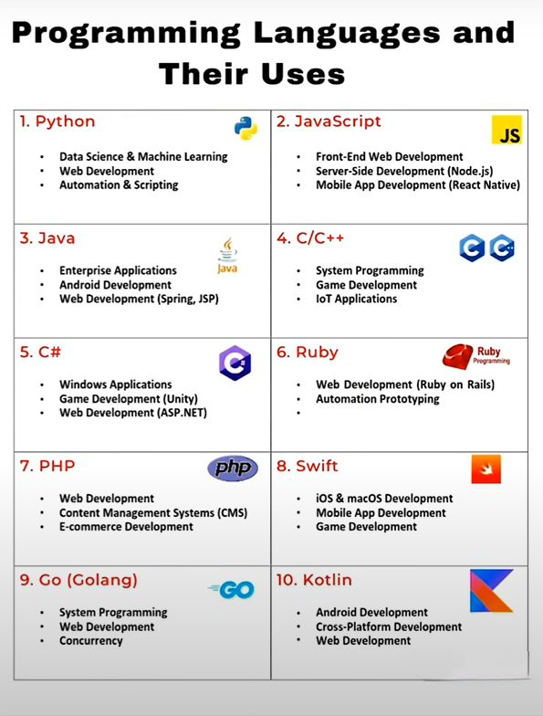
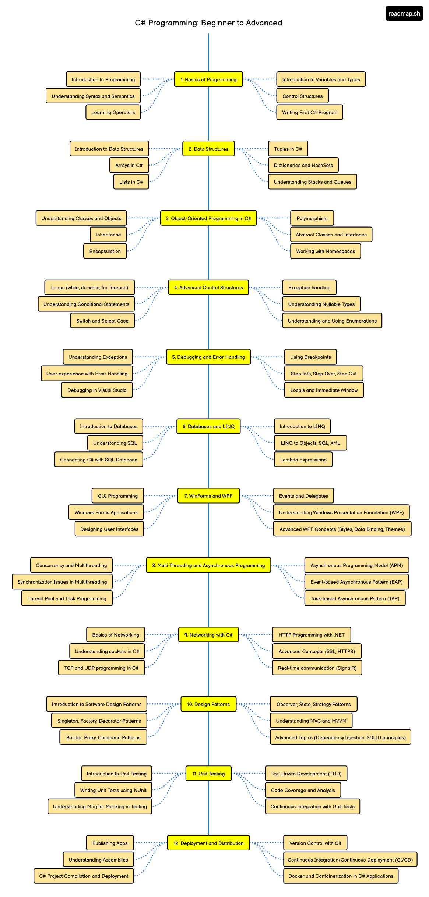
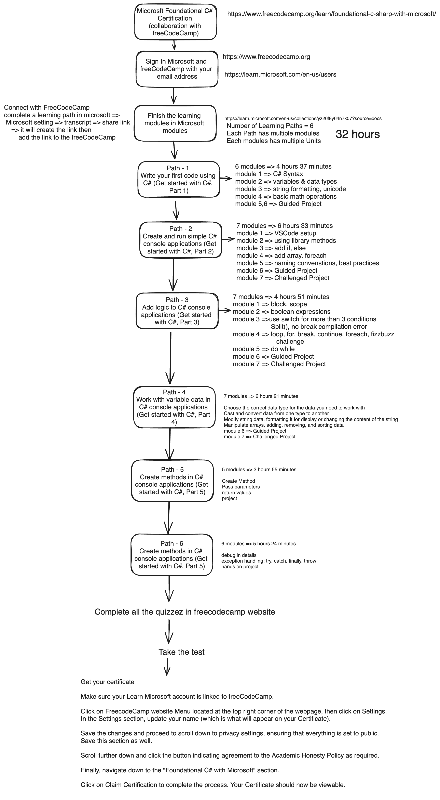
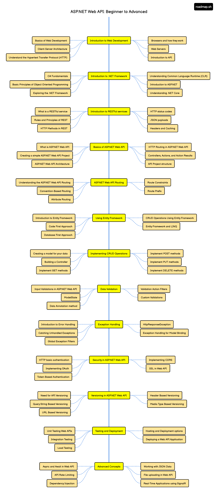
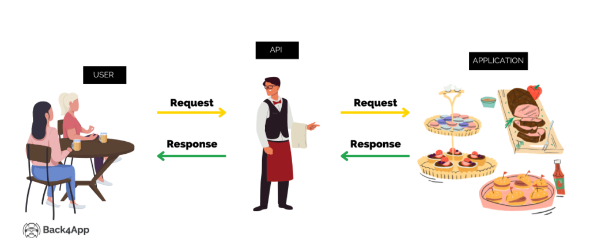
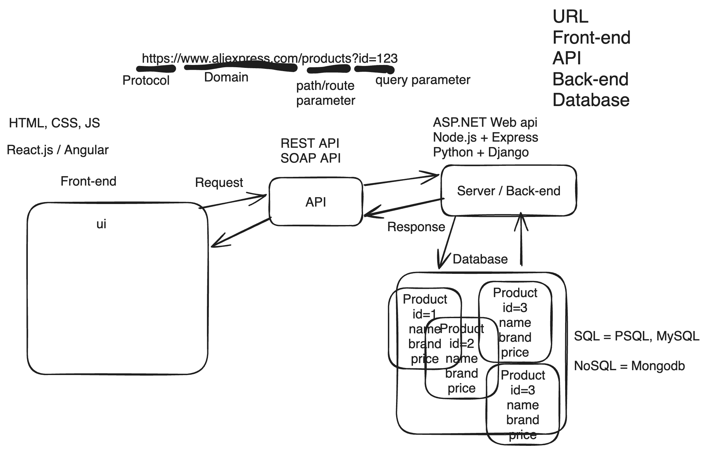
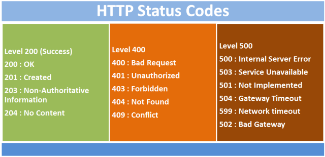
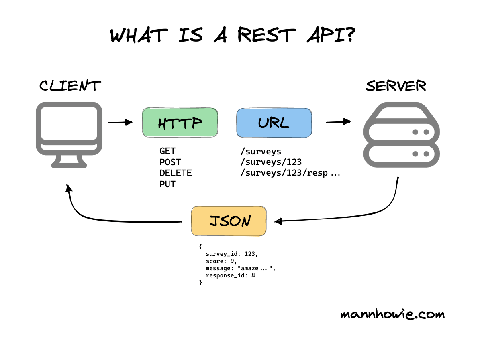
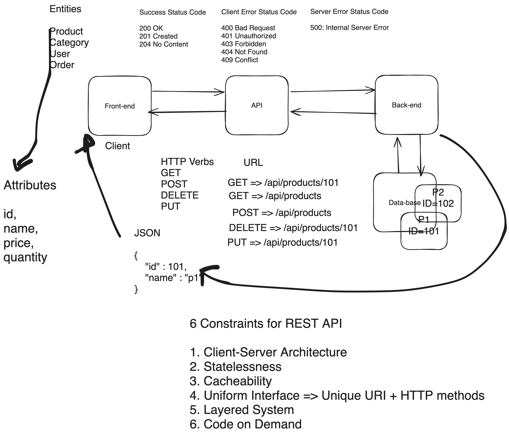
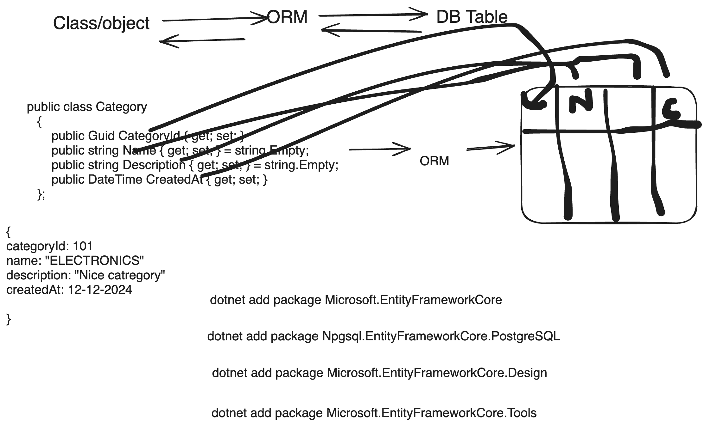

# C# and ASP.NET Documentation

## Table of Contents

1. [Basic C#]

   - [1. Intro to C#](#basic-11-introduction)
     - [Intro to C# language](#11-intro-to-c-sharp-language)
     - [Setting up the environment](#12-setting-up-the-environment)
     - [Create and Run First C# Program](#13-create--run-first-console-application)
     - [Comments and escape sequences](#14-comments-and-escape-sequences)
     - [Variables and data types](#15-variables-and-data-types)
     - [Formatting output](#16-formatting-output---string-concatenation--interpolation)
     - [User Input and Type Conversion](#17-user-input-and-type-conversion)
   - [2. Operators](#basic-12-operators)
     - [Arithmetic Operators](#arithmetic-operators)
     - [Assignment Operators](#assignment-operators)
     - [Relational Operators](#relational-operators)
     - [Logical Operators](#logical-operators)
     - [Bitwise Operators](#bitwise-operators)
     - [Unary Operators](#increment-and-decrement-operators)
   - [3. Control Statement](#basic-13-control-statement)
     - [Conditional Control Statement](#31-conditional-control-statement)
     - [Loop Control Statement](#32-loop-control-statement)
     - [FizzBuzz Challenge](#fizzbuzz-challenge)
   - [4. Methods](#basic-14-methods)
   - [5. Testing, Debugging and Exception Handling](#basic-15-testing-debugging-and-exception-handling)
   - [6. Array and String](#basic-16-array-and-string)
   - [7. Projects](#basic-17-project)
     - [Project 1: Simple Calculator](#71-project-simple-calculator-with-conditional-checks)
     - [Project 2: Basic Currency Converter](#72-project-basic-currency-converter)
     - [Project 3: FizzBuzz](#73-fizzbuzz-challenge)
     - [Project 4: Guessing Game](#74-number-guessing-game)
     - [Project 5: Students Grade Manager](#75-students-grade-manager)
     - [Project 6: String Reverse](#76-string-reverse-app)
     - [Project 7: Unit Converter](#77-unit-converter-app-project)
   - [8. MS Foundational Certification Exam](#basic-8-ms-foundational-certification-exam)

2. [Intermediate C#]

   - [1. OOP](#intermediate-21-oop)
     - [Class and Object](#classes-and-objects)
     - [Constructor](#constructor)
     - [readonly, static vs non-static member](#readonly-static-vs-non-static-member)
     - [Assignment for oop part-1](#assignment-for-oop-part-1)
     - [4 Pillars of OOP: Encapsulation](#4-pillars-of-oop-encapsulation)
     - [4 Pillars of OOP: Inheritance](#4-pillars-of-oop-inheritance)
     - [4 Pillars of OOP: Polymprphism](#4-pillars-of-oop-polymorphism)
     - [4 Pillars of OOP: Abstraction](#4-pillars-of-oop-abstracttion)
     - [Interface and Why Interface?](#interface-and-why-interface)
     - [Interface and Why Interface?](#interface-and-why-interface)
   - [Intermediate 2. Collections, Generics, LINQ](#intermediate-22-collections-generics-linq)

3. [Advanced C#]

4. [ASP.NET]
   - [ASP.NET and REST API without Database](#advanced-aspnet-and-rest-api)
   - [ASP.NET and REST API with Database (2024)](#5-aspnet-and-rest-api-with-database-2024)



## Basic 1.1: Introduction



### 1.1 Intro to C-sharp language

#### 1.1.1 Programming language

A language that Humans use to communicate with machines. Without computer programs, we wouldn't have smartphones, websites, or even exploration in outer space. Low-level, mid-level and high level language.

#### 1.1.2 What is C#? Why C#?

C# (pronounced "C sharp") is a modern, object-oriented programming language developed by Microsoft. It is designed for building a variety of applications on the Microsoft .NET platform. C# is widely used for developing desktop applications, web applications, mobile apps, cloud-based services, and game development.

Key features and aspects of C# include:

1. **Object-Oriented:** C# is an object-oriented programming (OOP) language, supporting concepts such as classes, objects, encapsulation, inheritance, and polymorphism.

2. **Managed Code:** C# code is typically compiled into an intermediate language called Common Intermediate Language (CIL), and it runs on the Common Language Runtime (CLR), which provides features like memory management (garbage collection), exception handling, and security.

3. **Type-Safe:** C# is statically typed, which means that the type of a variable must be declared before it can be used. This helps catch type-related errors at compile time.

4. **Syntax:** C# syntax is influenced by languages like C, C++, and Java. If you are familiar with these languages, you'll find many similarities in C# syntax. C++ and Visual Basics = C#

5. **Rich Standard Library:** C# comes with a comprehensive standard library, part of the .NET Framework or .NET Core, which provides functionality for tasks such as file I/O, networking, database access, and more.

6. **Integrated Development Environment (IDE):** Microsoft provides Visual Studio, a powerful IDE for C# development. Visual Studio offers features like code completion, debugging tools, and project management, making it a popular choice among C# developers.

7. **Cross-Platform Development:** With the introduction of .NET Core, C# is no longer limited to Windows development. .NET Core is a cross-platform, open-source framework that allows C# developers to build applications for Windows, Linux, and macOS.

8. **Language Features:** C# includes modern language features such as LINQ (Language-Integrated Query), async/await for asynchronous programming, properties, events, delegates, and more.

9. **Web Development:** C# is commonly used for web development, particularly in combination with ASP.NET, a framework for building web applications.

10. **Game Development:** C# is a primary language for game development using the Unity game engine. Unity enables developers to create games for various platforms, including desktop, mobile, and consoles.

- Summary
  - C# is a powerful OOP language developed by Micorsoft.
  - General Purpose: We can create Console Application, windows form application, mobile application, web application, desktop and game application (2D/3D).
  - we can built application on the Microsoft .NET platform.
  - Cross Platform Independent: Micorsoft .NET Core made sure C# is not more only for windows but for linux and MacOS well.
  - typed safe / statically typed language

#### 1.1.3 [.NET Framework & .NET Core](https://www.javatpoint.com/vb-net-dot-net-framework-introduction)


[!dot net framework](images/NET.png)


- [What is .NET?](https://learn.microsoft.com/en-us/training/modules/dotnet-introduction/2-what-is-dotnet)

  - The .NET and C# is not same thing. C# is a language where .NET is a software which give us CLR where we can run our application and use pre0defined linraries. Few major app models => web (asp.net core, asp.net core mvc), web client (blazor), desktop (winforms, .net for mac), mobile (.NET for android and .NET for iOS)
  - 2 main components: CLR (Common Language Runtime) take care of execution our app or running apps; .NET Framework class Library provides reusable code
  - NET Framework is a mature framework primarily used for Windows-based applications, while .NET Core is a modern, cross-platform framework optimized for cloud-native and containerized applications. With the release of .NET 5 (and later .NET 6), Microsoft unified the .NET platform, merging .NET Core and .NET Framework into a single, unified platform called .NET. This unified platform provides a consistent development experience across different platforms and environments.

  - .NET Ecosystem = Language (c#, f#, VB) + Runtime (CLR/ CORE CLR), Librariers (BCL Functions Base Class Libraries: System is an example)
    - CLR = JVM
    - Nuget package manager = npm

### 1.2 Setting up the environment

- step 1: install .NET Core; for mac using homebrew. `brew install --cask dotnet-sdk` and check the version `dotnet --version` `dotnet --help` for any command use `dotnet command --help`

- step 2: install IDE: Visual Studio is the popular one.

  - **VS Code (Visual Studio Code)**:

    - VS Code is a lightweight, open-source code editor developed by Microsoft.
    - It provides extensive support for various programming languages through extensions.
    - VS Code is highly customizable and has a vast ecosystem of extensions for additional features and functionalities.
    - VS Code is suitable for a wide range of development tasks, including web development, cloud development, and scripting.

  - **Visual Studio (VS)**:
    - Visual Studio is a full-featured Integrated Development Environment (IDE) developed by Microsoft.
    - All the tools are already installed for development purpose. It provides comprehensive tools and features for various types of software development, including desktop applications, web applications, mobile applications, and cloud services.
    - Visual Studio includes powerful debugging tools, code analysis, and testing capabilities.
    - Visual Studio has built-in support for multiple programming languages and platforms, including C#, C++, .NET, and more.
    - It offers extensive project and solution management features, making it suitable for large-scale enterprise development.

- step 3: some useful for .NET and c# extension

  When working with C# and .NET in Visual Studio Code on macOS, you'll want to install some extensions to enhance your development experience. To install these extensions, you can open Visual Studio Code, navigate to the Extensions view by clicking on the square icon on the sidebar or by pressing `Cmd + Shift + X`, and search for each extension by name. Then, click on the extension and select "Install".

  1. **C# for Visual Studio Code**: This official extension provides support for C# syntax highlighting, debugging, and IntelliSense. It's essential for C# development in Visual Studio Code.

     - [C# for Visual Studio Code](https://marketplace.visualstudio.com/items?itemName=ms-dotnettools.csharp)

  2. **.NET Core Test Explorer**: If you're writing unit tests with .NET Core, this extension allows you to run and debug your tests directly within Visual Studio Code.

     - [.NET Core Test Explorer](https://marketplace.visualstudio.com/items?itemName=formulahendry.dotnet-test-explorer)

  3. **NuGet Package Manager**: This extension allows you to manage NuGet packages directly within Visual Studio Code, making it easier to install, update, and remove packages.

     - [NuGet Package Manager](https://marketplace.visualstudio.com/items?itemName=jmrog.vscode-nuget-package-manager)

  4. **C# XML Documentation Comments**: This extension provides IntelliSense for XML documentation comments in C#, helping you write better-documented code.

     - [C# XML Documentation Comments](https://marketplace.visualstudio.com/items?itemName=k--kato.docomment)

  5. **C# Extensions**: This extension provides additional C# code snippets and tools to improve your productivity.

     - [C# Extensions](https://marketplace.visualstudio.com/items?itemName=jchannon.csharpextensions)

  6. **C# FixFormat**: This extension automatically formats your C# code according to configurable rules, ensuring consistent code style.

     - [C# FixFormat](https://marketplace.visualstudio.com/items?itemName=Leopotam.csharpfixformat)

  7. **Debugger for Unity**: If you're developing Unity games using C#, this extension allows you to debug Unity applications directly from Visual Studio Code.

     - [Debugger for Unity](https://marketplace.visualstudio.com/items?itemName=Unity.unity-debug)

  8. **Unity Code Snippets**: Another useful extension for Unity development, providing code snippets for common Unity-related tasks.

     - [Unity Code Snippets](https://marketplace.visualstudio.com/items?itemName=kleber-swf.unity-code-snippets)

  9. C# Dev kit - C# Dev Kit extension enhances VS Code's existing Workspaces with a new Solution Explorer view, providing a curated and structured view of your application for effortless, central project management. This lets you quickly add new projects or files to your solutions and easily build all or part of your solution.

- step 4: important commands: run `dotnet new list`
  Here are some important .NET CLI (Command Line Interface) commands used in .NET development:

      1. **dotnet new**: Creates a new project or file based on the specified template.
        - Example: `dotnet new console` creates a new console application.

      2. **dotnet restore**: Restores the dependencies and tools of a project.
        - Example: `dotnet restore` restores the NuGet packages for a project.

      3. **dotnet build**: Builds the project and its dependencies.
        - Example: `dotnet build` compiles the project into executable output.

      4. **dotnet run**: Builds and runs the project.
        - Example: `dotnet run` compiles and executes the project's entry point.

      5. **dotnet test**: Executes the tests in the project.
        - Example: `dotnet test` runs the unit tests in the project.

      6. **dotnet publish**: Publishes the application for deployment.
        - Example: `dotnet publish -c Release -o ./publish` publishes the application to the specified output directory in Release mode.

      7. **dotnet clean**: Cleans the output directory and intermediate build files.
        - Example: `dotnet clean` removes the build artifacts from the project directory.

      8. **dotnet add reference**: Adds a project-to-project (P2P) reference to the project file.
        - Example: `dotnet add reference ../path/to/project.csproj` adds a reference to another project.

      9. **dotnet ef**: Entity Framework Core command-line tools for database migrations and scaffolding.
        - Example: `dotnet ef migrations add InitialCreate` creates a new migration for the database.

      10. **dotnet tool install**: Installs the specified .NET Core CLI tool.
          - Example: `dotnet tool install --global dotnet-ef` installs the Entity Framework Core CLI tool globally.

### 1.3 Create & Run First Console Application

- run `dotnet new list` and explain all the templates
- then create a basic console application with `dotnet new console` or `dotnet new console -o FirstConsoleApp`
- discuss folder structure:
  - .csproj (configuraion of the project = kind of same as package.json; later on if we add any package it will keep the information of the packages that we install)
  - entry point is the .cs file
    - run the project: dotnet run (run once)
    - watch the output: dotnet watch (run after every changes you made)
    - test the project: dotnet test
    - add package to the project: dotnet add packageName
    - add library from [nuget.org](https://www.nuget.org/) - search http
  - When you build a .NET project, the compiler generates intermediate language (IL) code, which is then translated into native machine code by the Just-In-Time (JIT) compiler when the application runs. **The compiled binary files,** along with any necessary resource files, configuration files, and dependencies, are stored in the bin directory.
  - create a .gitignore file `bin/ obj/` push the code and get again after cloning by `dotnet run`
- **.NET Framework code execution process** 

  - .dll is the byte code or intermediate language
  - you wont see the binary code as the JIT (Just In Time) do not expose cause durinf the running process it will keep the binary code in the memory. JIT can create the binary code based the OS and it made the platform independent.

- Create your First Program

  ```c#
  // Program 1: Print your bio
  using System;

  public class Program
  {
      public static void Main(string[] args)
      {
         Console.WriteLine($"My name is Anisul Islam.");
         Console.WriteLine($"I am 34 Years old.");
         Console.WriteLine($"I am living in Finland");
      }
  }
  ```

  - Namespaces / Class: helps to separate code. `using System;` allows you to use Console.WriteLine method and other methods. Namespaces are optional. Instead of System.Console.WriteLine use Console.WriteLine method by use System. Use . operator to access the class or namespace members.

  - In C#, creating a class is mandatory for the program’s execution. Main method is the entry point or starting point of the program.

- Run the Program

  1. **Open Terminal in VSCode:**
     In VSCode, open a new terminal by clicking on "View" in the top menu and selecting "Terminal."

  2. **Build and Run:**
     In the terminal, run the following commands to build and run your C# program:

  ```bash
  dotnet build
  dotnet run
  ```

  This will build and execute your C# program. You should see the "Hello World" output in the terminal.

#### Assignment 1: Print your bio

```csharp
class Test
{
  public static void Main(string[] args)
  {
    Console.WriteLine("Name: Anisul Islam");
    Console.WriteLine("Age: 32");
    Console.WriteLine("Profession: Software developer");
  }
}
```

### 1.4 comments and escape sequences

- Why do you need comment?
  - To explain your code
  - To create a todo list
  - To avoid running some part of your code for debugging
  - single line comment -> `// this is a single line comment`
  - multi-line comments -> `/*   */`
- escape sequences: \n, \t, \r, \\, \", \'

  ```csharp
    // Program 2 : Comments and Escape Sequences
    string fullName = "Aniul\nIslam\nRubel";
    Console.WriteLine(fullName);
    Console.ReadKey();
  ```

- verbatim string: it allows linebreaks in strings. use @ symbol before double quotes.

  ```csharp
  Console.WriteLine(@"Hello!
  Welcome to the verbatim string");
  ```

### 1.5 Variables and data types

#### Data type


C# provides several built-in data types, which can be categorized into the following groups:

1. **Value Types**: (store data in stack memory)

   - **Integral Types**: Represent whole numbers without a fractional component.
     - `sbyte`: 8-bit signed integer (-128 to 127)
     - `byte`: 8-bit unsigned integer (0 to 255)
     - `short`: 16-bit signed integer (-32,768 to 32,767)
     - `ushort`: 16-bit unsigned integer (0 to 65,535)
     - `int`: 32-bit signed integer (-2,147,483,648 to 2,147,483,647)
     - `uint`: 32-bit unsigned integer (0 to 4,294,967,295)
     - `long`: 64-bit signed integer (-9,223,372,036,854,775,808 to 9,223,372,036,854,775,807)
     - `ulong`: 64-bit unsigned integer (0 to 18,446,744,073,709,551,615)
   - **Floating-Point Types**: Represent numbers with fractional parts.
     - `float`: 32-bit single-precision floating-point type
     - `double`: 64-bit double-precision floating-point type
     - `decimal`: 128-bit decimal type for financial and monetary calculations
   - **Other Value Types**:
     - `char`: 16-bit Unicode character
     - `bool`: Represents Boolean values (true or false)
     - struct : for small amount of data instead of class
     - enum
     - tuple : for stroing different realted data types in a single object
     - Nullable

2. **Reference Types**: (store data in heap memory)

   - **Class**: Defines a reference type.
   - **Interface**: Defines a contract for classes to implement.
   - **Delegate**: Defines a reference to a method.
   - **Array**: Represents a collection of elements.
   - **String**: Represents a sequence of characters.
   - **Object**: The base class for all other types.

3. **Pointer Types** (Unsafe Code):

   - Allow direct memory manipulation and are rarely used in typical C# programming.

4. **DateTime**
   - DateTime (8 bytes) - value range from 0:00:00 on 1/1/2001 to 23:59:59 on 12/31/9999

```csharp
// Program 3: Data types
using System;

class Program
{
    static void Main()
    {
        Console.WriteLine("Variables declared with different data types:");
        Console.WriteLine("sbyte: " + (-100));
        Console.WriteLine("byte: " + 200);
        Console.WriteLine("short: " + (-30000));
        Console.WriteLine("ushort: " + 60000);
        Console.WriteLine("int: " + (-2000000000));
        Console.WriteLine("uint: " + 4000000000U);
        Console.WriteLine("long: " + (-9000000000000000000L));
        Console.WriteLine("ulong: " + 18000000000000000000UL);
        Console.WriteLine("float: " + 3.14f);
        Console.WriteLine("double: " + 3.14159265359);
        Console.WriteLine("decimal: " + 123.45m);
        Console.WriteLine("char: " + 'A');
        Console.WriteLine("bool: " + true);
        Console.WriteLine("string: " + "Hello, world!");
        Console.WriteLine("object: " + 123);
    }
}
```

#### Data Types Range

```csharp

// sbyte num = 12;
// byte (1 byte), short(2 bytes), int(4 bytes), long(8 bytes)

// 1 byte = (0,1) = 256 (-128,-127, ...,0,1,...,127)
// 2 bytes = 16 bits = 65, (-32768 to 32767)
Console.WriteLine($"Signed Integral Types");

Console.WriteLine($"sbyte: {sbyte.MinValue} to {sbyte.MaxValue}");
Console.WriteLine($"short: {short.MinValue} to {short.MaxValue}");
Console.WriteLine($"int: {int.MinValue} to {int.MaxValue}");
Console.WriteLine($"long: {long.MinValue} to {long.MaxValue}");

Console.WriteLine($"\n\nUnSigned Integral Types");
Console.WriteLine($"byte: {byte.MinValue} to {byte.MaxValue}");
Console.WriteLine($"ushort: {ushort.MinValue} to {ushort.MaxValue}");
Console.WriteLine($"uint: {uint.MinValue} to {uint.MaxValue}");
Console.WriteLine($"ulong: {ulong.MinValue} to {ulong.MaxValue}");

// float, double, decimal
Console.WriteLine($"\n\nFloating Point Types");
Console.WriteLine($"float: {float.MinValue} to {float.MaxValue}"); // decimal point 6-9
Console.WriteLine($"double: {double.MinValue} to {double.MaxValue}"); // decimal point 15-17
Console.WriteLine($"decimal: {decimal.MinValue} to {decimal.MaxValue}"); // decimal point 28-29

```

#### which data types I should use?

**When in doubt, stick with the basics**
While you've looked at several considerations, as you're getting started, for simplicity's sake you should prefer a subset of basic data types, including:

- int for most whole numbers
- decimal for numbers representing money
- bool for true or false values
- string for alphanumeric value
- byte: working with encoded data that comes from other computer systems or using different caracter sets.
- double: working with geometric or scientific purposes. double is used frequently when bilding games involving motion.
  -System.DateTime for a specific date and time value.
- System.TimeSpan for a span of years / months / days / hours / minutes / seconds / milliseconds.

#### Variables

#### Naming conventions in Micorsoft ecosystem

1. **PascalCase**:

   - Class names: Used for naming classes and types. Example: `CustomerService`, `HttpRequest`.
   - Method names: Used for naming methods and functions. Example: `CalculateTotal`, `SendEmail`.
   - Property names: Used for naming properties of classes and objects. Example: `FirstName`, `TotalAmount`.

2. **camelCase**:

   - Variable names: Used for naming variables, parameters, and local variables. Example: `totalAmount`, `numberOfItems`.
   - Method parameter names: Used for naming parameters of methods and functions. Example: `firstName`, `orderId`.
   - undesrcore followed by camelCase for private instance.

3. **snake_case**:

   - File names: Used for naming files in some cases, particularly in web development. Example: `index.html`, `user_profile.css`.
   - Database identifiers: Used for naming database tables, columns, and stored procedures in some cases. Example: `user_profile`, `order_details`.

4. **Hungarian notation**:

   - Less commonly used in modern development but may still be found in legacy codebases. Example: `strFirstName` for a string variable holding a first name, `intAge` for an integer variable holding an age.

5. **Abbreviations**:

   - Used for common terms and concepts, especially in APIs and libraries. Example: `IO` for Input/Output, `HTTP` for Hypertext Transfer Protocol.

6. **Acronyms**:

   - Used for abbreviations and initialisms. Example: `HTML` for Hypertext Markup Language, `JSON` for JavaScript Object Notation.

7. **Namespaces and Assemblies**:

   - Namespaces and assemblies generally follow PascalCase and may include a reverse domain name. Example: `System.Collections`, `Microsoft.AspNetCore.Mvc`.

8. **Constants**:
   - Constants are typically named using PascalCase with all uppercase letters. Example: `MAX_VALUE`, `DEFAULT_TIMEOUT`.

#### Constant variables and multiple variables

- constant variables: const string universityName = "Leading University";
- string concatenation: "anisul" + "islam"
- multiple variables: int x,y,z; x=y=z=50;

```csharp
   // Program 4: Variables
   string fullName = "Anisul Islam";
   int age = 34;
   string countryName = "Finland";
   char bloodGroup = 'A';
   bool isRegistered = true;
   const string BIRTH_PLACE = "Bangladesh";

   Console.WriteLine(fullName);
   Console.WriteLine(age);
   Console.WriteLine(countryName);
   Console.WriteLine(bloodGroup);
   Console.WriteLine(isRegistered);
   Console.WriteLine(BIRTH_PLACE);
```

#### var vs int

Using `var` allows the compiler to determine the type of the loop variable automatically based on the context, which can make the code cleaner and more concise. It's especially useful when dealing with complex types or when the type name is long and repetitive.

#### Assignment 2: declare product data types and print variables


Here’s a simple assignment that covers variables, string interpolation, comments, and escape sequences in C#. This assignment is designed for beginners to help them understand these concepts.

---

### 1.6 Formatting output - String concatenation & interpolation

- we can use variable inside a string by using string interpolation!

  ```csharp
  // Program 5: string concatenation
  string fullName = "Anisul Islam";
  int age = 34;
  string countryName = "Finland";
  char bloodGroup = 'A';
  bool isRegistered = true;
  const string BIRTH_PLACE = "Bangladesh";

  Console.WriteLine("My name is " + fullName + ".");
  Console.WriteLine("I am " + age + " years old.");
  Console.WriteLine("I am living in " + countryName + ".");
  Console.WriteLine(countryName + " is a very beautiful country.");
  Console.WriteLine("At the age of " + age + " I enjoy teaching people programming.");
  Console.WriteLine("Blood Group " + bloodGroup);
  Console.WriteLine("You are registered in a football club: " + isRegistered);
  Console.WriteLine("Birth Place: " + BIRTH_PLACE);
  ```

  ```c sharp
    // Program 6: string interpolation
    string fullName = "Anisul Islam";
    int age = 34;
    string countryName = "Finland";
    char bloodGroup = 'A';
    bool isRegistered = true;
    const string BIRTH_PLACE = "Bangladesh";

    Console.WriteLine($"My name is {fullName}.");
    Console.WriteLine($"I am {age} Years old.");
    Console.WriteLine($"I am living in {countryName}");
    Console.WriteLine($"{countryName} is a very beautiful country.");
    Console.WriteLine($"At the age of {age} I enjoy teaching people programming");
    Console.WriteLine($"Bllod Group {bloodGroup}");
    Console.WriteLine($"You are register in a football club :  {isRegistered}");
    Console.WriteLine($"Birth Place: {BIRTH_PLACE}");
  ```

#### **Extra Assignment: Personal Introduction Program**

**Objective:** Create a C# program that uses variables, string interpolation, comments, and escape sequences to display a formatted introduction message.

**Instructions:**

1. **Declare Variables:**

   - Create variables to store the following information:
     - Your name (string)
     - Your age (int)
     - Your favorite hobby (string)
     - A favorite quote or saying (string)

2. **Use Comments:**

   - Add comments in your code to describe what each part of your code is doing.

3. **String Interpolation:**

   - Use string interpolation to create a sentence that introduces yourself, including your name, age, and favorite hobby.

4. **Escape Sequences:**

   - Include escape sequences in your favorite quote, like using `\"` for quotes inside the string, or `\n` for a new line.

5. **Display the Output:**
   - Print your introduction and the favorite quote using `Console.WriteLine`.

**Example Code:**

Here's what your code might look like:

```csharp
using System;

public class Program
{
    public static void Main()
    {
        // Declare variables
        string name = "Alice"; // Your name
        int age = 25; // Your age
        string hobby = "reading books"; // Your favorite hobby
        string favoriteQuote = "The only limit to our realization of tomorrow is our doubts of today.\n- Franklin D. Roosevelt"; // A favorite quote

        // String interpolation to create a personal introduction message
        string introduction = $"Hello, my name is {name}. I am {age} years old and I love {hobby}.";

        // Print the introduction message
        Console.WriteLine(introduction);

        // Print the favorite quote with escape sequences for new line
        Console.WriteLine($"My favorite quote is:\n\"{favoriteQuote}\"");
    }
}
```

**Expected Output:**

```
Hello, my name is Alice. I am 25 years old and I love reading books.
My favorite quote is:
"The only limit to our realization of tomorrow is our doubts of today.
- Franklin D. Roosevelt"
```

---

**Key Concepts Covered:**

- **Variables**: Storing data in variables like `name`, `age`, etc.
- **String Interpolation**: Using `$` to embed variables directly within strings.
- **Comments**: Describing what each line or section of code does.
- **Escape Sequences**: Using special characters to format strings, like `\n` for a new line and `\"` for including quotes.

### 1.7 User Input and Type Conversion

- Console.ReadLine() return a string,
- Console.Read() - Keep in mind that Console.Read() only reads a single character, so if you enter a string, it will only read the first character of that string. It returns an integer representing the Unicode value of the character read.

#### Type Conversion - Implicit, Explicit

In C#, there are several ways to convert data types. Here are some commonly used methods:

1. **Implicit Conversion**: This happens automatically by the compiler when there is no risk of data loss. For example, converting an integer to a double.

```csharp
int numInt = 10;
double numDouble = numInt; // Implicit conversion
```

2. **Explicit Conversion (Casting)**: This involves manually converting one type to another using type casting operators. Explicit conversion may result in data loss or exceptions if the data cannot be represented in the target type.

```csharp
double numDouble = 10.5;
int numInt = (int)numDouble; // Explicit conversion
```

3. Convert vs Parse vs TryParse

When deciding between `Convert`, `TryParse`, and `Parse` for converting user input in C#, each has its advantages and appropriate use cases:

##### **1. `TryParse`:**

- **Usage**: Safely tries to convert the input to the desired type without throwing exceptions if the conversion fails.
- **Advantages**:
  - **No Exceptions**: It does not throw an exception if the input is invalid; instead, it returns `false`.
  - **Safe for User Input**: Ideal for handling user input where errors are common.
  - **Output Variable**: Outputs the converted value directly using an `out` parameter.
- **When to Use**:
  - Best when dealing with user input or uncertain data.
  - When you want to avoid exception handling and gracefully handle invalid inputs.

**Example from your code:**

```csharp
int.TryParse(ageInput, out int age);
char.TryParse(bloodGroupInput, out char bloodGroup);
bool.TryParse(registerInput, out bool isRegistered);
```

##### **2. `Parse`:**

- **Usage**: Directly converts a string to the specified type but throws an exception if the conversion fails.
- **Advantages**:
  - **Straightforward**: Converts the string directly if you are certain the input is valid.
  - **Performance**: Slightly faster than `TryParse` because it does not include the overhead of returning `false`.
- **When to Use**:
  - Use when you are sure that the input is always valid.
  - Typically used when data is already validated or comes from a reliable source.

**Example:**

```csharp
int age = int.Parse(ageInput); // Throws an exception if ageInput is not a valid integer.
```

##### **3. `Convert`:**

- **Usage**: Converts various types to another type, handling `null` values and returning a default type value (like 0 for numbers).
- **Advantages**:
  - **Handles Nulls**: Does not throw an exception for `null` input, but instead converts to a default value (e.g., 0, false).
  - **Versatile**: Can convert between various types, not just strings to other types.
- **When to Use**:
  - When you need to handle `null` values gracefully without exceptions.
  - Suitable for converting multiple types, not just strings.

**Example:**

```csharp
int age = Convert.ToInt32(ageInput); // Converts null to 0 and invalid input throws an exception.
```

These are some of the common methods used for data type conversion in C#. Each method has its own use cases and should be chosen based on the specific requirements of the program.

```c#
// Program 7: How To Get User Input
Console.Write("Enter Your Name: ");
string? fullName = Console.ReadLine();

Console.Write("Enter Your Age: ");
string? ageInput = Console.ReadLine();
int.TryParse(ageInput, out int age);

Console.Write("Enter Your Country: ");
string? countryName = Console.ReadLine();

Console.Write("Enter Your Blood Group: ");
string? bloodGroupInput = Console.ReadLine();
char.TryParse(bloodGroupInput, out char bloodGroup);

Console.Write("Are you registered? true/false:  ");
string? registerInput = Console.ReadLine();
bool.TryParse(registerInput, out bool isRegistered);

const string BIRTH_PLACE = "Bangladesh";

Console.WriteLine($"My name is {fullName}.");
Console.WriteLine($"I am {age} Years old.");
Console.WriteLine($"I am living in {countryName}");
Console.WriteLine($"{countryName} is a very beautiful country.");
Console.WriteLine($"At the age of {age} I enjoy teaching people programming");
Console.WriteLine($"Bllod Group {bloodGroup}");
Console.WriteLine($"You are register in a football club :  {isRegistered}");
Console.WriteLine($"Birth Place: {BIRTH_PLACE}");
```

##### **Best Practice for Your Code:**

Given that user input can often be invalid, `TryParse` is the best option here because it:

- Does not throw exceptions, which simplifies error handling.
- Allows you to provide default values or messages when conversion fails without interrupting program flow.

Using `TryParse` ensures your application is user-friendly and robust when handling various types of input, making it the ideal choice for your scenario.

#### Assignment 3: take student input for gpa and isRegistered

### 1.8 checking data type of a variable

In C#, you can check the data type of a variable or object using various methods. Here are some common ways:

1. **Using the `typeof` Operator**:

   - The `typeof` operator returns a `Type` object representing the specified type.

````csharp
int number = 10;
Type type = typeof(int);
Console.WriteLine(type); // Output: System.Int32
  ```

2. **Using the `GetType` Method**:
  - The `GetType` method returns the runtime type of an instance.

```csharp
string text = "Hello";
Type type = text.GetType();
Console.WriteLine(type); // Output: System.String
````

3. **Using the `is` Operator**:

   - The `is` operator checks if an object is compatible with a given type and returns a Boolean result.

```csharp
object obj = "Hello";
if (obj is string)
{
    Console.WriteLine("Object is a string");
}
```

4. **Using the `as` Operator**:

   - The `as` operator performs a safe type conversion or casting and returns `null` if the conversion fails.

```csharp
object obj = "Hello";
string text = obj as string;
if (text != null)
{
    Console.WriteLine("Object is successfully converted to string");
}
```

5. **Using Pattern Matching (C# 7 and later)**:

   - Pattern matching allows you to test the type of an object and extract values from it in a single step.

```csharp
object obj = "Hello";
if (obj is string text)
{
    Console.WriteLine($"Object is a string: {text}");
}
```

## Basic 1.2: Operators

C# supports various operators that allow you to perform operations on variables and values. Here's a list of some common operators in C#:

### Arithmetic Operators

1. **Addition (`+`):**

   ```csharp
   int result = a + b;
   ```

2. **Subtraction (`-`):**

   ```csharp
   int result = a - b;
   ```

3. **Multiplication (`*`):**

   ```csharp
   int result = a * b;
   ```

4. **Division (`/`):**

   ```csharp
   int result = a / b;
   ```

5. **Modulus (`%`):**

   ```csharp
   int result = a % b;
   ```

- some arithmetic operators programs

  ```csharp
  // Program 8: basic calculator
  // Arithmetic Operators => + - / * %

  int num1 = 10;
  int num2 = 3;

  int sum = num1 + num2;
  Console.WriteLine($"{num1} + {num2} = {sum}");

  int sub = num1 - num2;
  Console.WriteLine($"{num1} - {num2} = {sub}");

  int mul = num1 * num2;
  Console.WriteLine($"{num1} * {num2} = {mul}");

  float div = (float)num1 / num2;
  Console.WriteLine($"{num1} / {num2} = {div:F2}");

  int rem = num1 % num2;
  Console.WriteLine($"{num1} % {num2} = {rem}");
  ```

  ```csharp
  // Program 9 : User Input and Calculator
  // Arithmetic Operators => + - / * %

  Console.Write($"Enter number 1 = ");
  int.TryParse(Console.ReadLine(), out int num1);

  Console.Write($"Enter number 2 = ");
  int.TryParse(Console.ReadLine(), out int num2);

  int sum = num1 + num2;
  Console.WriteLine($"{num1} + {num2} = {sum}");

  int sub = num1 - num2;
  Console.WriteLine($"{num1} - {num2} = {sub}");

  int mul = num1 *num2;
  Console.WriteLine($"{num1}* {num2} = {mul}");

  float div = (float)num1 / num2;
  Console.WriteLine($"{num1} / {num2} = {div:F2}");

  int rem = num1 % num2;
  Console.WriteLine($"{num1} % {num2} = {rem}");
  Console.Write($"Enter number 1 = ");
  int.TryParse(Console.ReadLine(), out int num1);

  Console.Write($"Enter number 2 = ");
  int.TryParse(Console.ReadLine(), out int num2);

  int sum = num1 + num2;
  Console.WriteLine($"{num1} + {num2} = {sum}");

  int sub = num1 - num2;
  Console.WriteLine($"{num1} - {num2} = {sub}");

  int mul = num1 *num2;
  Console.WriteLine($"{num1}* {num2} = {mul}");

  float div = (float)num1 / num2;
  Console.WriteLine($"{num1} / {num2} = {div:F2}");

  int rem = num1 % num2;
  Console.WriteLine($"{num1} % {num2} = {rem}");
  ```

  ```csharp
    // Program 10: Sum and average of 5 numbers
    // Arithmetic Operators => + - / * %

    // Area of triangle  = 1/2 *base* height
    // Area of circle  = 3.1416 *radius* radius

    // 1. Find out sum and average of 5 numbers

    // define 5 numbers
    int num1 = 10;
    int num2 = 20;
    int num3 = 5;
    int num4 = 15;
    int num5 = 2;

    // find the sum
    int sum = num1 + num2 + num3 + num4 + num5;

    // find the average
    float average = (float)sum / 5;

    Console.WriteLine($"The sum is {sum}");
    Console.WriteLine($"The average is {average:F2}");

  ```

  ```csharp
  // Program 10: Area of triagle
  using System;
  class Test
  {
    public static void Main(string[] args)
    {
      // triangle area = 0.5 * base * height
      double baseLength, height, triangleArea;

      Console.WriteLine("Triangle Area Calculator");

      Console.Write("Base = ");
      baseLength = Convert.ToDouble(Console.ReadLine());

      Console.Write("Height = ");
      height = Convert.ToDouble(Console.ReadLine());

      triangleArea = 0.5 * baseLength * height;
      Console.WriteLine($"Triangle Area = {triangleArea.ToString("F2")}");
    }
  }

  // Area of triangle
  Console.Write($"Enter Base: ");
  double.TryParse(Console.ReadLine(), out double baseValue);

  Console.Write($"Enter Height: ");
  double.TryParse(Console.ReadLine(), out double heightValue);

  double areaOfTriangle = 0.5 *baseValue* heightValue;
  Console.WriteLine($"Area of Triangle : {areaOfTriangle}");
  ```

  ```csharp
  // Program 11: Temperature converter
  // temperature conversion (celsius to fahrenheit conversion)
  using System;
  class Test
  {
    public static void Main(string[] args)
    {
      double fahrenheit, celsius;

      Console.Write("fahrenheit = ");
      fahrenheit = Convert.ToDouble(Console.ReadLine());

      celsius = (fahrenheit - 32) / 1.8;
      Console.WriteLine($"celsius = {celsius:F2} degrees");

    }
  }

  // OTHER WAY
  Console.Write($"Fahrenheit = ");

  bool isValidFarnValue = double.TryParse(Console.ReadLine(), out double farn);

  double celsius = (farn - 32) / 1.8;
  Console.WriteLine($"Celsius = {celsius:F3}");

  ```

#### Assignment 4: sum and average of 3 numbers

```csharp
using System;
class Test
{
  public static void Main(string[] args)
  {
    int number1, number2, number3, sum;
    double average;

    Console.Write("number1 = ");
    number1 = Convert.ToInt32(Console.ReadLine());

    Console.Write("number2 = ");
    number2 = Convert.ToInt32(Console.ReadLine());

    Console.Write("number3 = ");
    number3 = Convert.ToInt32(Console.ReadLine());

    sum = number1 + number2 + number3;
    Console.WriteLine($"sum = {sum}");

    average = (double)sum / 3;
    Console.WriteLine($"average = {average.ToString("F2")}");

  }
}

```

##### Assignment 5: area of circle

```csharp
using System;
class Test
{
  public static void Main(string[] args)
  {
    // circle area = 3.1416 * radius * radius
    double radius, circleArea;

    Console.WriteLine("Circle Area Calculator");

    Console.Write("radius = ");
    radius = Convert.ToDouble(Console.ReadLine());

    circleArea = Math.PI * radius * radius;
    Console.WriteLine($"Circle Area = {circleArea.ToString("F2")}");
  }
}
```

##### Assignment 6: temperature converter (fahrenheit to celsius conversion)

```csharp
using System;
class Test
{
  public static void Main(string[] args)
  {
    double fahrenheit, celsius;

    Console.Write("celsius = ");
    celsius = Convert.ToDouble(Console.ReadLine());

    fahrenheit = (1.8 * celsius) + 32;
    Console.WriteLine($"fahrenheit = {fahrenheit:F2} degrees");

  }
}
```

### Assignment Operators

1. **Assignment (`=`):**

   ```csharp
   int a = 10;
   ```

2. **Add and assign (`+=`):**

   ```csharp
   a += 5;  // equivalent to a = a + 5;
   ```

3. **Subtract and assign (`-=`):**

   ```csharp
   a -= 5;  // equivalent to a = a - 5;
   ```

4. **Multiply and assign (`*=`):**

   ```csharp
   a *= 2;  // equivalent to a = a * 2;
   ```

5. **Divide and assign (`/=`):**

   ```csharp
   a /= 2;  // equivalent to a = a / 2;
   ```

6. **Modulus and assign (`%=`):**

   ```csharp
   a %= 3;  // equivalent to a = a % 3;
   ```

```csharp
// Program 12
using System;
class Test
{
  public static void Main(string[] args)
  {
    int number = 20;

    number += 5; // number = number + 5
    Console.WriteLine($"{number}");

    number -= 5; // number = number - 5
    Console.WriteLine($"{number}");

    number *= 5; // number = number * 5
    Console.WriteLine($"{number}");

    number /= 5; // number = number / 5
    Console.WriteLine($"{number}");

    number %= 5; // number = number % 5
    Console.WriteLine($"{number}");

  }
}

```

### Relational Operators

1. **Equal to (`==`):**

   ```csharp
   if (a == b)
   ```

2. **Not equal to (`!=`):**

   ```csharp
   if (a != b)
   ```

3. **Greater than (`>`):**

   ```csharp
   if (a > b)
   ```

4. **Less than (`<`):**

   ```csharp
   if (a < b)
   ```

5. **Greater than or equal to (`>=`):**

   ```csharp
   if (a >= b)
   ```

6. **Less than or equal to (`<=`):**

   ```csharp
   if (a <= b)
   ```

### Logical Operators

1. **Logical AND (`&&`):**

   ```csharp
   if (condition1 && condition2)
   ```

2. **Logical OR (`||`):**

   ```csharp
   if (condition1 || condition2)
   ```

3. **Logical NOT (`!`):**

   ```csharp
   if (!condition)
   ```

### Bitwise Operators

In C#, bitwise operators perform operations at the bit level. These operators work with individual bits of integer types (`int`, `long`, `short`, `byte`, etc.). Here are the bitwise operators in C#:

1. **Bitwise AND (`&`):**

   - **Description:** Sets each bit to 1 if both bits are 1.
   - **Example:**

     ```csharp
     int result = 5 & 3;  // Binary: 101 & 011 = 001
     Console.WriteLine(result);  // Output: 1
     ```

2. **Bitwise OR (`|`):**

   - **Description:** Sets each bit to 1 if at least one of the corresponding bits is 1.
   - **Example:**

     ```csharp
     int result = 5 | 3;  // Binary: 101 | 011 = 111
     Console.WriteLine(result);  // Output: 7
     ```

3. **Bitwise XOR (`^`):**

   - **Description:** Sets each bit to 1 if only one of the corresponding bits is 1.
   - **Example:**

     ```csharp
     int result = 5 ^ 3;  // Binary: 101 ^ 011 = 110
     Console.WriteLine(result);  // Output: 6
     ```

4. **Bitwise NOT (`~`):**

   - **Description:** Inverts each bit.
   - **Example:**

     ```csharp
     int result = ~5;  // Binary: ~0101 = 1010
     Console.WriteLine(result);  // Output: -6
     ```

5. **Left Shift (`<<`):**

   - **Description:** Shifts the bits of a number to the left by a specified number of positions.
   - **Example:**

     ```csharp
     int result = 5 << 2;  // Binary: 101 << 2 = 10100
     Console.WriteLine(result);  // Output: 20
     ```

6. **Right Shift (`>>`):**

   - **Description:** Shifts the bits of a number to the right by a specified number of positions.
   - **Example:**

     ```csharp
     int result = 5 >> 1;  // Binary: 101 >> 1 = 10
     Console.WriteLine(result);  // Output: 2
     ```

Bitwise operators are commonly used in scenarios where individual bits represent flags or options, and you need to perform operations at a lower level than regular arithmetic operators.

### Increment and Decrement Operators

1. **Increment (`++`):**

   ```csharp
   a++;
   ```

2. **Decrement (`--`):**

   ```csharp
   a--;
   ```

### Conditional Operator (Ternary Operator)

```csharp
// Program 13
int result = (a > b) ? a : b;

// even/odd program
class Test
{
  public static void Main(string[] args)
  {
    Console.Write("Enter a number: ");
    int number = Convert.ToInt32(Console.ReadLine());

    string result = number % 2 == 0 ? "Even" : "Odd";
    Console.WriteLine($"{number} is an {result} number");
    Console.Read();
  }
}
```

This is a concise way to express an `if-else` statement.

## Basic 1.3: Control Statement

### 3.1 Conditional control statement

Control statements in C# are used to control the flow of execution in a program. They allow you to make decisions, loop through code, and execute different blocks of code based on certain conditions. Here are some of the main control statements in C#:

1. **if Statement:**

   - The `if` statement is used for conditional branching. It executes a block of code if a specified condition is true.

     ```csharp
     if (condition)
     {
         // Code to be executed if the condition is true
     }
     ```

2. **else Statement:**

   - The `else` statement is used with `if` to execute a block of code if the `if` condition is false.

     ```csharp
     if (condition)
     {
         // Code to be executed if the condition is true
     }
     else
     {
         // Code to be executed if the condition is false
     }
     ```

3. **else if Statement:**

   - The `else if` statement is used to specify a new condition to test if the previous `if` or `else if` conditions are false.

     ```csharp
     if (condition1)
     {
         // Code to be executed if condition1 is true
     }
     else if (condition2)
     {
         // Code to be executed if condition2 is true
     }
     else
     {
         // Code to be executed if all conditions are false
     }
     ```

     ````

     ```csharp
     // Program 14
     // Control Statement

     // Large number between 2 numbers
     int number1 = 15;
     int number2 = 15;

     if (number1 > number2)
     {
     Console.WriteLine($"Largest number is {number1}");
     }
     else if (number1 < number2)
     {
     Console.WriteLine($"Largest number is {number2}");
     }
     else
     {
     Console.WriteLine($"Both are equal numbers");

     }
     ````

   - nested if

   ```csharp

   // Program 15
   // Control Statement
   // Large number among 3 numbers
   int number1 = 45;
   int number2 = 55;
   int number3 = 35;

   if (number1 > number2)
   {
     if (number1 > number3)
     {
       Console.WriteLine($"Largest number is {number1}");
     }
   }
   else if (number2 > number1)
   {
     if (number2 > number3)
     {
       Console.WriteLine($"Largest number is {number2}");
     }
     else
     {
       Console.WriteLine($"Largest number is {number3}");
     }
   }
   else if (number3 > number1)
   {
     if (number3 > number2)
     {
       Console.WriteLine($"Largest number is {number3}");
     }
   }
   else
   {
     Console.WriteLine($"Equal numbers");

   }
   ```

4. **switch Statement:**

- 4 keywords to remember: switch, case, break and default. The `switch` statement is used to select one of many code blocks to be executed.

      ```csharp
      switch (variable)
      {
          case value1:
              // Code to be executed if variable equals value1
              break;
          case value2:
              // Code to be executed if variable equals value2
              break;
          // ... other cases ...
          default:
              // Code to be executed if none of the cases match
              break;
      }

      // multiple params
      using System;

        class Program
        {
            static void Main()
            {
                Console.WriteLine("Enter two numbers separated by a space:");
                string input = Console.ReadLine();
                string[] parts = input.Split();

                if (parts.Length != 2)
                {
                    Console.WriteLine("Invalid input format. Please enter two numbers separated by a space.");
                    return;
                }

                string firstParam = parts[0];
                string secondParam = parts[1];

                // Use tuple pattern matching with switch
                switch ((firstParam, secondParam))
                {
                    case ("1", "a"):
                        Console.WriteLine("First param is '1' and second param is 'a'.");
                        break;
                    case ("2", "b"):
                        Console.WriteLine("First param is '2' and second param is 'b'.");
                        break;
                    default:
                        Console.WriteLine("No matching case found.");
                        break;
                }
            }
        }

      ```

  - **shorthand switch**:

    In C#, starting from C# 8.0, you can use switch expressions as a shorthand method for simpler switch statements. Switch expressions allow you to perform pattern matching and return a value based on the matched pattern. Here's the syntax:

    ```csharp
    result = switch (variable)
    {
        pattern1 => expression1,
        pattern2 => expression2,
        ...
        _ => defaultExpression // Optional default case
    };
    ```

    Let's see an example of a switch statement converted to a switch expression:

    ```csharp
    // Switch statement
    int num = 3;
    string message;

    switch (num)
    {
        case 1:
            message = "One";
            break;
        case 2:
            message = "Two";
            break;
        default:
            message = "Other";
            break;
    }

    Console.WriteLine(message); // Output: Other
    ```

    Converted to a switch expression:

    ```csharp
    // Switch expression
    int num = 3;
    string message = num switch
    {
        1 => "One",
        2 => "Two",
        _ => "Other" // Default case
    };

    Console.WriteLine(message); // Output: Other
    ```

    ```csharp
      Console.Write($"Enter a letter from a-z: ");

      string input = Console.ReadLine().ToLower();

      if (string.IsNullOrEmpty(input) || input.Length != 1)
      {
        Console.WriteLine($"Invalid Input. Please enter a single character");
        return;
      }
      char letter = input[0];

      string result = letter switch
      {
        not (>= 'a' and <= 'z') => "Not a Letter",
        'a' or 'e' or 'i' or 'o' or 'u' => "Vowel",
        _ => "Consonant",
      };
      Console.WriteLine(result);

    ```

    In the switch expression:

    - The variable being evaluated (`num` in this case) is followed by the `switch` keyword.
    - Each case is written using the `=>` operator instead of the `case` keyword.
    - The `_` underscore pattern represents the default case, similar to the `default` keyword in switch statements.
    - The result of the matched expression is assigned directly to the `message` variable.

    Switch expressions provide a more concise and expressive way to handle simple switch statements. They are particularly useful when you want to assign a value based on different cases without the need for separate statements for each case.

  - swicth and type pattern: type pattern switching was introduced in C# 9.0. Here are some examples

  ```csharp
  public static string GetTypeWithoutPattern(object obj)
  {
      switch (obj)
      {
          case int:
              return "Integer";
          case string:
              return "String";
          case double:
              return "Double";
          default:
              return "Unknown Type";
      }
  }

  static void Main(string[] args)
  {
      object value = "Hello";
      Console.WriteLine(GetTypeWithoutPattern(value)); // Output: String
  }

  public static string GetTypeWithTypePattern(object obj)
  {
      return obj switch
      {
          int => "Integer",
          string => "String",
          double => "Double",
          _ => "Unknown Type"
      };
  }

  static void Main(string[] args)
  {
      object value = 10;
      Console.WriteLine(GetTypeWithTypePattern(value)); // Output: Integer
  }
  ```

  1. **Without Type Pattern (Traditional Approach)**:

  Suppose we have a method that processes different types of vehicles:

  ```csharp
  public static string ProcessVehicleWithoutPattern(object vehicle)
  {
      switch (vehicle)
      {
          case Car:
              return "Driving a car";
          case Bicycle:
              return "Riding a bicycle";
          case Truck:
              return "Driving a truck";
          default:
              return "Unknown vehicle type";
      }
  }

  // Define vehicle types
  public class Car { }
  public class Bicycle { }
  public class Truck { }

  static void Main(string[] args)
  {
      object myVehicle = new Car();
      Console.WriteLine(ProcessVehicleWithoutPattern(myVehicle)); // Output: Driving a car
  }
  ```

  2. **With Type Pattern (Using Modern Approach)**:

  Now, let's rewrite the same functionality using type patterns:

  ```csharp
  public static string ProcessVehicleWithTypePattern(object vehicle)
  {
      return vehicle switch
      {
          Car => "Driving a car",
          Bicycle => "Riding a bicycle",
          Truck => "Driving a truck",
          _ => "Unknown vehicle type"
      };
  }

  // Define vehicle types (same as above)

  static void Main(string[] args)
  {
      object myVehicle = new Bicycle();
      Console.WriteLine(ProcessVehicleWithTypePattern(myVehicle)); // Output: Riding a bicycle
  }
  ```

  In this example, the switch expression with type patterns provides a cleaner and more readable way to handle different vehicle types compared to the traditional approach without type patterns.

  - switch and condition together

  ```csharp
  // switch statement with condition without switch expression
  using System;

  class Program
  {
      static void Main()
      {
          Console.WriteLine("Enter a number between 1 and 10:");
          if (int.TryParse(Console.ReadLine(), out int number))
          {
              switch (number)
              {
                  case int n when n % 2 == 0:
                      Console.WriteLine("Even number.");
                      break;
                  case int n when n % 2 != 0:
                      Console.WriteLine("Odd number.");
                      break;
                  default:
                      Console.WriteLine("Number is out of range.");
                      break;
              }
          }
          else
          {
              Console.WriteLine("Invalid input. Please enter a valid number.");
          }
      }
  }


  // switch statement with condition with switch expression
  public class MyClass
  {
    public static void Main(string[] args)
    {
      Console.WriteLine("Enter a number between 1 to 10: ");

      if (int.TryParse(Console.ReadLine(), out int number))
      {
        string result = number switch
        {
          int num when num >= 1 && num <= 10 => num % 2 == 0 ? "Even Number" : "Odd Number",
          _ => "Number is out of Range"
        };
        Console.WriteLine($"{result}");
      }
      else
      {
        Console.WriteLine($"Invalid Input. Please enter a valid number");

      }

      Console.ReadKey();
    }

  }
  ```

  - switch and method

    ```csharp
      using System;

      class Program
      {
          static void Main()
          {
              Console.WriteLine("Calculator");

              Console.Write("Enter the first number: ");
              double num1 = GetValidNumber();

              Console.Write("Enter the second number: ");
              double num2 = GetValidNumber();

              Console.Write("Enter the operation (+, -, *, /): ");
              char operation = GetValidOperation();

              switch ((operation, num1, num2))
              {
                  case ('+', var a, var b):
                      Console.WriteLine($"{a} + {b} = {a + b}");
                      break;
                  case ('-', var a, var b):
                      Console.WriteLine($"{a} - {b} = {a - b}");
                      break;
                  case ('*', var a, var b):
                      Console.WriteLine($"{a} * {b} = {a * b}");
                      break;
                  case ('/', var a, var b) when b != 0:
                      Console.WriteLine($"{a} / {b} = {a / b}");
                      break;
                  case (_, _, _) when num2 == 0:
                      Console.WriteLine("Cannot divide by zero.");
                      break;
                  default:
                      Console.WriteLine("Invalid operation.");
                      break;
              }
          }

          static int GetValidNumber()
          {
            int number;
            // int.TryParse(Console.ReadLine(), out number)
            // The second parameter is an out parameter, which means it will be assigned the parsed int value if the parsing succeeds.
            while (!int.TryParse(Console.ReadLine(), out number))
            {
              Console.Write("Invalid input. Please enter a valid number: ");
            }
            return number;
          }

          static double GetValidNumber()
          {
              double number;
              while (!double.TryParse(Console.ReadLine(), out number))
              {
                  Console.Write("Invalid input. Please enter a valid number: ");
              }
              return number;
          }

          static char GetValidOperation()
          {
              char operation;
              while (!char.TryParse(Console.ReadLine(), out operation) || !IsValidOperation(operation))
              {
                  Console.Write("Invalid input. Please enter a valid operation (+, -, *, /): ");
              }
              return operation;
          }

          static bool IsValidOperation(char operation)
          {
              return operation == '+' || operation == '-' || operation == '*' || operation == '/';
          }
      }

    ```

#### Input Validation

- Length Check: Ensure the string is within a certain length range.
- Character Restrictions: Ensure the string contains only letters, digits, or specific characters.
- No Special Characters: Reject strings containing special characters (e.g., !@#$%^&\*()).
- No Numeric Only Strings: Reject strings that are purely numeric.
- Custom Regex Pattern: Apply a custom pattern to enforce specific formats (e.g., email format, no spaces).
- Type Checking with GetType(): Added basic type validation checks within each validation function to ensure inputs are handled as strings.
- Enhanced String Validation: Rejects strings that are purely numeric using the IsNumeric() function.
  Continues to validate against length, special characters, and non-empty conditions.
- IsNumeric() Function: Determines if a string is purely numeric by checking against multiple numeric types (int, float, double, decimal).

  ```csharp
  using System;
  using System.Text.RegularExpressions;

  public class InputValidationProgram
  {
      public static void Main()
      {
          // String Validation
          string validatedString = GetValidatedString();

          // Integer Validation
          int validatedInt = GetValidatedInt();

          // Float Validation
          float validatedFloat = GetValidatedFloat();

          // Double Validation
          double validatedDouble = GetValidatedDouble();

          // Display Validated Inputs
          Console.WriteLine("\nValidated Inputs:");
          Console.WriteLine("Validated String: " + validatedString);
          Console.WriteLine("Validated Integer: " + validatedInt);
          Console.WriteLine("Validated Float: " + validatedFloat);
          Console.WriteLine("Validated Double: " + validatedDouble);
      }

      // Function to get a validated string with enhanced checks
      private static string GetValidatedString()
      {
          string? input;
          bool isValid;

          do
          {
              Console.Write("Enter a valid string (no special characters, not empty, length 3-20, not purely numeric): ");
              input = Console.ReadLine();
              isValid = ValidateString(input);

              if (!isValid)
              {
                  Console.WriteLine("Invalid input. Ensure the string is not empty, contains no special characters, is not purely numeric, and has a length between 3 and 20 characters.");
              }
          } while (!isValid);

          return input!;
      }

      // Function to validate the string with multiple checks including type validation
      private static bool ValidateString(string? input)
      {
          // Check if the string is null, empty, or whitespace
          if (string.IsNullOrWhiteSpace(input))
          {
              return false;
          }

          // Check the length of the string (minimum 3 characters, maximum 20)
          if (input.Length < 3 || input.Length > 20)
          {
              return false;
          }

          // Check if the string contains only letters and numbers (no special characters)
          Regex regex = new Regex("^[a-zA-Z0-9]+$");
          if (!regex.IsMatch(input))
          {
              return false;
          }

          // Check if the string is purely numeric, using type checking
          if (IsNumeric(input))
          {
              return false;
          }

          return true;
      }

      // Function to check if a string is purely numeric
      private static bool IsNumeric(string input)
      {
          // Using TryParse to determine if input is numeric
          return int.TryParse(input, out _) || float.TryParse(input, out _) || double.TryParse(input, out _) || decimal.TryParse(input, out _);
      }

      // Function to get a validated integer
      private static int GetValidatedInt()
      {
          int result;
          string? input;
          bool isValid;

          do
          {
              Console.Write("Enter an integer: ");
              input = Console.ReadLine();

              // Check if the input is a valid integer
              isValid = int.TryParse(input, out result);

              if (!isValid || input!.GetType() != typeof(string))
              {
                  Console.WriteLine("Invalid input. Please enter a valid integer.");
              }
              else if (result < int.MinValue || result > int.MaxValue)
              {
                  Console.WriteLine($"Invalid input. The value must be between {int.MinValue} and {int.MaxValue}.");
                  isValid = false;
              }
          } while (!isValid);

          return result;
      }

      // Function to get a validated float
      private static float GetValidatedFloat()
      {
          float result;
          string? input;
          bool isValid;

          do
          {
              Console.Write("Enter a float (decimal value): ");
              input = Console.ReadLine();

              // Check if the input is a valid float
              isValid = float.TryParse(input, out result);

              if (!isValid || input!.GetType() != typeof(string))
              {
                  Console.WriteLine("Invalid input. Please enter a valid float.");
              }
              else if (result < float.MinValue || result > float.MaxValue)
              {
                  Console.WriteLine($"Invalid input. The value must be between {float.MinValue} and {float.MaxValue}.");
                  isValid = false;
              }
          } while (!isValid);

          return result;
      }

      // Function to get a validated double
      private static double GetValidatedDouble()
      {
          double result;
          string? input;
          bool isValid;

          do
          {
              Console.Write("Enter a double (decimal value): ");
              input = Console.ReadLine();

              // Check if the input is a valid double
              isValid = double.TryParse(input, out result);

              if (!isValid || input!.GetType() != typeof(string))
              {
                  Console.WriteLine("Invalid input. Please enter a valid double.");
              }
              else if (result < double.MinValue || result > double.MaxValue)
              {
                  Console.WriteLine($"Invalid input. The value must be between {double.MinValue} and {double.MaxValue}.");
                  isValid = false;
              }
          } while (!isValid);

          return result;
      }
  }
  ```

##### **Expected Output Example**

```
Enter a valid string (no special characters, not empty, length 3-20, not purely numeric): 123
Invalid input. Ensure the string is not empty, contains no special characters, is not purely numeric, and has a length between 3 and 20 characters.
Enter a valid string (no special characters, not empty, length 3-20, not purely numeric): User123
Enter an integer: abc
Invalid input. Please enter a valid integer.
Enter an integer: 50
Enter a float (decimal value): notafloat
Invalid input. Please enter a valid float.
Enter a float (decimal value): 3.14
Enter a double (decimal value): doublevalue
Invalid input. Please enter a valid double.
Enter a double (decimal value): 2.71828

Validated Inputs:
Validated String: User123
Validated Integer: 50
Validated Float: 3.14
Validated Double: 2.71828
```

#### program 1 positive, negative or zero

```csharp
   // program 1. positive, negative or zero
   using System;
   class Test
   {
   public static void Main(string[] args)
   {
      int number = 0;
      if (number > 0)
      {
         Console.WriteLine("Positive Number");
      }
      else if (number < 0)
      {
         Console.WriteLine("Negative Number");
      }
      else
      {
         Console.WriteLine("Zero");
      }
   }
   }
```

#### program 2: digit spelling program

```csharp
// program 2: digit spelling program
using System;
class Test
{
  public static void Main(string[] args)
  {
    // digit - 0-9
    // digit spelling program

    Console.Write("Enter any digit between 0 and 9: ");
    int digit = Convert.ToInt32(Console.ReadLine());

    if (digit == 0)
    {
      Console.WriteLine("Zero");
    }
    else if (digit == 1)
    {
      Console.WriteLine("One");
    }
    else if (digit == 2)
    {
      Console.WriteLine("Two");
    }
    else if (digit == 3)
    {
      Console.WriteLine("Three");
    }
    else if (digit == 4)
    {
      Console.WriteLine("Four");
    }
    else if (digit == 5)
    {
      Console.WriteLine("Five");
    }
    else if (digit == 6)
    {
      Console.WriteLine("Six");
    }
    else if (digit == 7)
    {
      Console.WriteLine("Seven");
    }
    else if (digit == 8)
    {
      Console.WriteLine("Eight");
    }
    else if (digit == 9)
    {
      Console.WriteLine("Nine");
    }
    else
    {
      Console.WriteLine("Not a valid digit.");
    }
  }
}
```

#### Assignment 7: Even/Odd numbers

```csharp
using System;
class Test
{
  public static void Main(string[] args)
  {
    int number;
    Console.Write("Enter a number: ");
    number = Convert.ToInt32(Console.ReadLine());

    if (number % 2 == 0)
    {
      Console.WriteLine($"{number} is Even");
    }
    else
    {
      Console.WriteLine($"{number} is Odd");
    }
  }
}


```

#### program 3: large number between 2 numbers

```csharp
using System;
class Test
{
  public static void Main(string[] args)
  {
    int number1, number2;

    Console.Write("number1: ");
    number1 = Convert.ToInt32(Console.ReadLine());

    Console.Write("number2: ");
    number2 = Convert.ToInt32(Console.ReadLine());

    if (number1 > number2)
    {
      Console.WriteLine($"{number1} is large number");
    }
    else if (number2 > number1)
    {
      Console.WriteLine($"{number2} is large number");
    }
    else
    {
      Console.WriteLine($"numbers are equal");
    }
  }
}


```

#### Assignment 8: Small number between 2 numbers

#### program 4: large number between 3 numbers

```csharp
using System;

class Program {
    static void Main() {
        Console.Write("Enter three numbers separated by spaces: ");
        string[] input = Console.ReadLine().Split(' ');

        int num1 = int.Parse(input[0]);
        int num2 = int.Parse(input[1]);
        int num3 = int.Parse(input[2]);

        if (num1 >= num2 && num1 >= num3) {
            Console.WriteLine($"{num1} is the largest.");
        } else if (num2 >= num1 && num2 >= num3) {
            Console.WriteLine($"{num2} is the largest.");
        } else {
            Console.WriteLine($"{num3} is the largest.");
        }
    }
}
```

#### program 5: leap year or not

```csharp
using System;

class Program {
    static void Main() {
        Console.Write("Enter a year: ");
        int year = int.Parse(Console.ReadLine());

        if ((year % 4 == 0 && year % 100 != 0) || (year % 400 == 0)) {
            Console.WriteLine($"{year} is a leap year.");
        } else {
            Console.WriteLine($"{year} is not a leap year.");
        }
    }
}
```

#### program 6: Capital or small letter

```csharp
using System;
class Test
{
  public static void Main(string[] args)
  {
    char letter;

    Console.Write("Enter any letter: ");
    letter = Convert.ToChar(Console.ReadLine());

    if (letter >= 'A' && letter <= 'Z')
    {
      Console.WriteLine($"{letter} is a capital letter");
    }
    else
    {
      Console.WriteLine($"{letter} is a small letter");
    }
  }
}

```

#### program 7: Vowel or consonant

```csharp
using System;
class Test
{
  public static void Main(string[] args)
  {
    char letter;

    Console.Write("Enter any letter: ");
    letter = Convert.ToChar(Console.ReadLine()); // A

    letter = char.ToLower(letter);

    if (letter == 'a' || letter == 'e' || letter == 'i' || letter == 'o' || letter == 'u')
    {
      Console.WriteLine($"{letter} is a Vowel");
    }
    else
    {
      Console.WriteLine($"{letter} is a consonant");
    }
  }
}


```

#### Assignment 9: Grade Calculator

```csharp

**Objective:** Create a simple program that calculates and displays the letter grade based on the percentage score entered by the user.

**Instructions:**

1. **Input:**
   - Prompt the user to enter their percentage score.
   - Validate the input to ensure it is a number between 0 and 100.

2. **Grade Calculation:**
   - Use if-else statements to determine the letter grade based on the following grading scale:
     - A: 90-100
     - B: 80-89
     - C: 70-79
     - D: 60-69
     - F: 0-59

3. **Output:**
   - Display the calculated letter grade to the user.

**Example Output:**
Enter your percentage score: 85
Your grade is: B


**Grading:**
- Correct calculation of letter grade: 70%
- Input validation: 20%
- Code structure, comments, and readability: 10%

**Additional Challenges:**
1. Allow the user to input their scores for multiple subjects and calculate the overall GPA.
2. Implement a switch statement instead of if-else for grade calculation.
3. Handle edge cases, such as negative scores or scores above 100, gracefully.

This assignment allows students to practice if-else statements, input validation, and basic program structure. They can also extend the functionality to make it more complex based on their skill level.
```

```csharp
// assignment solution
using System;

class Program
{
    static void Main()
    {
        Console.Write("Enter your percentage score: ");
        double percentage;

        if (double.TryParse(Console.ReadLine(), out percentage) && percentage >= 0 && percentage <= 100)
        {
            char grade;

            if (percentage >= 90)
            {
                grade = 'A';
            }
            else if (percentage >= 80)
            {
                grade = 'B';
            }
            else if (percentage >= 70)
            {
                grade = 'C';
            }
            else if (percentage >= 60)
            {
                grade = 'D';
            }
            else
            {
                grade = 'F';
            }

            Console.WriteLine($"Your grade is: {grade}");
        }
        else
        {
            Console.WriteLine("Invalid input. Please enter a valid percentage between 0 and 100.");
        }
    }
}

// solution with switch
using System;

class Program
{
    static void Main()
    {
        Console.Write("Enter your percentage score: ");
        double percentage;

        if (double.TryParse(Console.ReadLine(), out percentage) && percentage >= 0 && percentage <= 100)
        {
            char grade;

            switch ((int)percentage / 10)
            {
                case 10:
                case 9:
                    grade = 'A';
                    break;
                case 8:
                    grade = 'B';
                    break;
                case 7:
                    grade = 'C';
                    break;
                case 6:
                    grade = 'D';
                    break;
                default:
                    grade = 'F';
                    break;
            }

            Console.WriteLine($"Your grade is: {grade}");
        }
        else
        {
            Console.WriteLine("Invalid input. Please enter a valid percentage between 0 and 100.");
        }
    }
}


```

#### Program 8: switch digit spelling program

```csharp
using System;
class Test
{
  public static void Main(string[] args)
  {
    // switch, break, case, default

    int digit;
    Console.Write("Enter a digit: ");
    digit = Convert.ToInt32(Console.ReadLine());

    switch (digit)
    {
      case 0:
        Console.WriteLine("Zero");
        break;
      case 1:
        Console.WriteLine("One");
        break;
      case 2:
        Console.WriteLine("Two");
        break;
      case 3:
        Console.WriteLine("Three");
        break;
      case 4:
        Console.WriteLine("Four");
        break;
      case 5:
        Console.WriteLine("Five");
        break;
      case 6:
        Console.WriteLine("Six");
        break;
      case 7:
        Console.WriteLine("Seven");
        break;
      case 8:
        Console.WriteLine("Eight");
        break;
      case 9:
        Console.WriteLine("Nine");
        break;
      default:
        Console.WriteLine("Not a digit");
        break;
    }

  }
}

```

#### Program 9: switch vowel/consonant program

```csharp
using System;
class Test
{
  public static void Main(string[] args)
  {
    char input;
    Console.Write("Enter a single character: ");
    input = Convert.ToChar(Console.ReadLine());

    switch (Char.ToLower(input))
    {
      case 'a':
      case 'e':
      case 'i':
      case 'o':
      case 'u':
        Console.WriteLine($"{input} is a Vowel");
        break;
      default:
        if (Char.IsLetter(input))
        {
          Console.WriteLine($"{input} is a Consonant");
        }
        else
        {
          Console.WriteLine($"{input} is not a letter");
        }
        break;
    }

  }
}


```

#### Assignment 10: Weekdays/Weekend Program

```csharp
using System;
class Test
{
  public static void Main(string[] args)
  {
    Console.Write("Enter a day of the week : ");
    string day = Console.ReadLine();

    switch (day.ToLower())
    {
      case "monday":
      case "tuesday":
      case "wednesday":
      case "thursday":
      case "friday":
        Console.WriteLine("Weekday");
        break;
      case "saturday":
      case "sunday":
        Console.WriteLine("Weekend");
        break;
      default:
        Console.WriteLine("Invalid day entered");
        break;
    }

  }
}

```

#### project 1: small temperature converter project using switch

```csharp
// switch: temperature converter
using System;
class Test
{
  public static void Main(string[] args)
  {
    Console.WriteLine("Temperature Converter Started");
    Console.WriteLine("Choose 1. Fahrenheit to Celsisus");
    Console.WriteLine("Choose 2. Celsisus to Fahrenheit");

    int choice = Convert.ToInt32(Console.ReadLine());

    switch (choice)
    {
      case 1:
        Console.Write("Enter Fahrenheit temperature: ");
        double fahrenheit = Convert.ToDouble(Console.ReadLine());
        double celsisus = (fahrenheit - 32) / 1.8;
        Console.Write($"Temperature in Celsisus : {celsisus:F2} ");
        break;
      case 2:
        Console.Write("Enter Celsisus temperature: ");
        double cels = Convert.ToDouble(Console.ReadLine());
        double fahr = cels * 1.8 + 32;
        Console.Write($"Temperature in Fahrenheit : {fahr:F2} ");
        break;
      default:
        Console.WriteLine("Invalid Choice");
        break;
    }


  }
}
```

#### project 2: small calculator project using switch

```c
// switch: basic calculator
using System;
class Test
{
  public static void Main(string[] args)
  {
    int number1, number2;
    char operation;

    Console.Write("Enter an operation (+,-,*,/) : ");
    operation = Convert.ToChar(Console.ReadLine());

    Console.Write("Enter number1: ");
    number1 = Convert.ToInt32(Console.ReadLine());

    Console.Write("Enter number2: ");
    number2 = Convert.ToInt32(Console.ReadLine());

    switch (operation)
    {
      case '+':
        Console.WriteLine($"{number1} + {number2} = {number1 + number2}");
        break;
      case '-':
        Console.WriteLine($"{number1} - {number2} = {number1 - number2}");
        break;
      case '*':
        Console.WriteLine($"{number1} * {number2} = {number1 * number2}");
        break;
      case '/':
        if (number2 != 0)
        {
          Console.WriteLine($"{number1} / {number2} = {number1 / number2}");
        }
        else
        {
          Console.WriteLine("Can not divide by zero");

        }
        break;
      default:
        Console.WriteLine("Invalid operation");
        break;
    }

  }
}

```

#### Switch statement + Enum

```csharp
// day as a string => monday
// weekday or weekend

enum DayOfWeek
{
  Monday = 1,
  Tuesday,
  Wednesday,
  Thursday,
  Friday,
  Saturday,
  Sunday
}

class Test
{
  public static void Main(string[] args)
  {


    Console.Write($"Enter the day of the week (1-7), where 1=Monday and 7=Sunday: ");
    int input = Convert.ToInt32(Console.ReadLine());

    if (input < 0 || input > 7)
    {
      Console.WriteLine($"Inavlid Input. Please Enter the day of the week (1-7), where 1=Monday and 7=Sunday.");
      return;
    }

    DayOfWeek day = (DayOfWeek)input;


    switch (day)
    {
      case DayOfWeek.Monday:
      case DayOfWeek.Tuesday:
      case DayOfWeek.Wednesday:
      case DayOfWeek.Thursday:
      case DayOfWeek.Friday:
        Console.WriteLine($"Weekday");
        break;
      case DayOfWeek.Saturday:
      case DayOfWeek.Sunday:
        Console.WriteLine($"Weekend");
        break;
      default:
        Console.WriteLine($"Invalid day entered");
        break;
    }

  }
}
```

### 3.2 Loop control statement

1. **while Loop:**

   - The `while` loop is used to repeatedly execute a block of code as long as the specified condition is true.

     ```csharp
     while (condition)
     {
         // Code to be executed while the condition is true
     }
     ```

2. **do-while Loop:**

   - The `do-while` loop is similar to the `while` loop, but it ensures that the block of code is executed at least once.

     ```csharp
     do
     {
         // Code to be executed
     } while (condition);
     ```

3. **for Loop:**

   - The `for` loop is used to repeatedly execute a block of code a specific number of times.

     ```csharp
     for (initialization; condition; update)
     {
         // Code to be executed in each iteration
     }
     ```

4. **foreach Loop:**

   - The `foreach` loop is used to iterate over elements in a collection (e.g., arrays, lists).

     ```csharp
     foreach (var item in collection)
     {
         // Code to be executed for each item in the collection
     }
     ```

     In C#, the `foreach` loop does not directly provide access to the index of the elements being iterated over. However, you can achieve this by using the `IEnumerable<T>.Select()` extension method along with the `Enumerable.Range()` method to generate indices. Here's how you can do it:

     ```csharp
     using System;
     using System.Linq;

     class Program
     {
         static void Main()
         {
             int[] numbers = { 1, 2, 3, 4, 5 };

             // Using Select with Range to get indices
             foreach (var index in Enumerable.Range(0, numbers.Length))
             {
                 Console.WriteLine($"Index: {index}, Value: {numbers[index]}");
             }
         }
     }
     ```

     In this example, `Enumerable.Range(0, numbers.Length)` generates a sequence of numbers from 0 to `numbers.Length - 1`, which represents the indices of the array. Then, we use `Select` to iterate over these indices, and within the loop, we access both the index and the corresponding element from the array.

These control statements provide flexibility and help in creating more dynamic and responsive programs in C#.

#### Program 10: print from 1 to 100

#### Program 11: series

```csharp
using System;
class Test
{
  public static void Main(string[] args)
  {
    Console.Write("Enter the start number: ");
    int start = Convert.ToInt32(Console.ReadLine());

    Console.Write("Enter the last number: ");
    int end = Convert.ToInt32(Console.ReadLine());

    Console.Write("Enter the difference number: ");
    int diff = Convert.ToInt32(Console.ReadLine());

    for (int count = start; count <= end; count = count + diff)
    {
      Console.Write($"{count} ");
    }

  }
}

// 1 2 3 4 ... 100
// 1 3 5 7 ... 99
// 2 4 6 8 ... 100
// 2 5 8 11 ...

```

#### Program 12: sum of even/odd numbers

```csharp
using System;
class Test
{
  public static void Main(string[] args)
  {
    int sum = 0;
    for (int i = 1; i <= 10; i++)
    {
      if (i % 2 != 0)
      {
        sum = sum + i;
      }
    }
    Console.WriteLine($"Sum of odd numbers = {sum}");
  }
}
// 2+4+6+8+10=30
```

#### Program 13: Factorial

```csharp
using System;
class Test
{
  public static void Main(string[] args)
  {
    Console.Write("Enter a number : ");
    int number = Convert.ToInt32(Console.ReadLine());
    int fact = 1;
    for (int i = number; i >= 1; i--)
    {
      fact = fact * i;
    }
    Console.WriteLine($"Factorial({number}) = {fact}");
  }
}
// 5 = 5*4*3*2*1 = 120
// 4 = 4*3*2*1= 24
// 3 = 3*2*1 = 6
// 2 = 2*1 = 2
```

#### break and continue keyword

#### Nested loop

```csharp
using System;
class Test
{
  public static void Main(string[] args)
  {
    for (int i = 1; i <= 3; i++)
    {
      for (int j = 1; j <= 5; j++)
      {
        Console.WriteLine($"i={i}, j={j} : Bangladesh");
      }
    }
  }
}
// outer loop i=1 1<=3
// inner loop j=1 1<=5 Bangladesh
// inner loop j=2 2<=5 Bangladesh
// inner loop j=3 3<=5 Bangladesh
// inner loop j=4 4<=5 Bangladesh
// inner loop j=5 5<=5 Bangladesh
// inner loop j=6 6<=5

// outer loop i=2 2<=3
// inner loop j=1 1<=5 Bangladesh
// inner loop j=2 2<=5 Bangladesh
// inner loop j=3 3<=5 Bangladesh
// inner loop j=4 4<=5 Bangladesh
// inner loop j=5 5<=5 Bangladesh
// inner loop j=6 6<=5

// outer loop i=3 3<=3
// inner loop j=1 1<=5 Bangladesh
// inner loop j=2 2<=5 Bangladesh
// inner loop j=3 3<=5 Bangladesh
// inner loop j=4 4<=5 Bangladesh
// inner loop j=5 5<=5 Bangladesh
// inner loop j=6 6<=5

// outer loop i=4 4<=3

```

#### project 3: Multiplication table

```csharp
using System;
class Test
{
  public static void Main(string[] args)
  {
    Console.Write("Enter start number: ");
    int startNumber = Convert.ToInt32(Console.ReadLine());

    Console.Write("Enter end number: ");
    int endNumber = Convert.ToInt32(Console.ReadLine());

    for (int i = startNumber; i <= endNumber; i++)
    {
      for (int j = 1; j <= 10; j++)
      {
        Console.WriteLine($"{i} X {j} = {i * j}");
      }
      Console.WriteLine("--------------------");
    }

  }
}

// start number = 2
// end number = 8

// number = 5
// number X i = number*i
// 5 X 1 = 5
// 5 X 2 = 10
// ....
// 5 X 10 = 50
```

### 3.3 Input Validation part-2

```csharp
public class MyClass
{

  public static int CalculateSquare(int num)
  {
    return num * num;
  }
  public static void Main(string[] args)
  {
    // User Input -> num:5 (between 1-10); square
    // User Input - quit -> loop break
    while (true)
    {
      Console.WriteLine($"Enter a number from 1 to 10 or write quit to exit the app");

      string input = Console.ReadLine() ?? "";
      input = input.ToLower().Trim();
      if (input == "quit")
      {
        Console.WriteLine($"Thanks for using your app. Goodbye!!!");
        break;
      }

      if (!int.TryParse(input, out int number))
      {
        Console.WriteLine($"Enter a valid input. Please give a number");
        continue;
      }

      if (!(number >= 1 && number <= 10))
      {
        Console.WriteLine($"Not in a range of 1-10");
        continue;
      }

      int square = CalculateSquare(number);
      Console.WriteLine($"square of {number} = {square}");

    }
    Console.ReadKey();
  }

}
```

To check if an email address is valid in C#, you can use regular expressions (regex) to match the email against a pattern that defines a valid email format. C# provides the `System.Text.RegularExpressions` namespace, which includes the `Regex` class for this purpose.

#### Method 1: Using Regular Expressions (Regex)

Here's a simple way to validate an email address using regex:

#### Code Example

```csharp
using System;
using System.Text.RegularExpressions;

class Program
{
    static bool IsValidEmail(string email)
    {
        // Regular expression pattern for validating email
        string pattern = @"^[^@\s]+@[^@\s]+\.[^@\s]+$";
        Regex regex = new Regex(pattern, RegexOptions.IgnoreCase);
        return regex.IsMatch(email);
    }

    static void Main()
    {
        Console.Write("Enter an email address: ");
        string email = Console.ReadLine();

        if (IsValidEmail(email))
        {
            Console.WriteLine("The email address is valid.");
        }
        else
        {
            Console.WriteLine("The email address is invalid.");
        }
    }
}
```

#### Explanation

1. **Regular Expression Pattern:**

   - The pattern `^[^@\s]+@[^@\s]+\.[^@\s]+$` checks the following:
     - `^` and `$` mark the start and end of the string.
     - `[^@\s]+` matches one or more characters that are not `@` or whitespace.
     - `@` matches the literal `@` symbol.
     - `[^@\s]+` after `@` ensures one or more characters that are not `@` or whitespace.
     - `\.` matches the literal `.` symbol.
     - `[^@\s]+` after `.` ensures there is at least one character following the `.`.

2. **Regex Class:**

   - `Regex.IsMatch()` checks if the email string matches the provided pattern.

3. **User Input:**
   - The user is prompted to enter an email address, which is then validated using the `IsValidEmail` function.

#### Output

- **Input:** `"example@test.com"`

  - Output: `"The email address is valid."`

- **Input:** `"invalid-email"`
  - Output: `"The email address is invalid."`

#### Method 2: Using `System.Net.Mail` Namespace

If you want a more comprehensive check that considers more rules for email validation, you can use the `MailAddress` class from the `System.Net.Mail` namespace.

##### Code Example 1

```csharp
using System;
using System.Net.Mail;

class Program
{
    static bool IsValidEmail(string email)
    {
        try
        {
            var mailAddress = new MailAddress(email);
            return true;
        }
        catch (FormatException)
        {
            return false;
        }
    }

    static void Main()
    {
        Console.Write("Enter an email address: ");
        string email = Console.ReadLine();

        if (IsValidEmail(email))
        {
            Console.WriteLine("The email address is valid.");
        }
        else
        {
            Console.WriteLine("The email address is invalid.");
        }
    }
}
```

##### Explanation 2

1. **`MailAddress` Class:**

   - The constructor of the `MailAddress` class attempts to create a new `MailAddress` object using the provided email string. If the format is invalid, it throws a `FormatException`.

2. **Exception Handling:**

   - The `try-catch` block catches a `FormatException` if the email is invalid, returning `false`.

3. **User Input:**
   - The user inputs an email address, and the `IsValidEmail` function checks its validity.

##### Output 3

- **Input:** `"test@domain.com"`

  - Output: `"The email address is valid."`

- **Input:** `"invalidemail.com"`
  - Output: `"The email address is invalid."`

#### Conclusion

- **Method 1 (Regex):** Allows you to define your own custom pattern for validation, which can be tailored to specific needs.
- **Method 2 (MailAddress Class):** Provides a more comprehensive validation that considers the structure and format of email addresses according to standard email rules.

### FizzBuzz Challenge


```csharp
class FizzBuzzProject
{
  public static void FizzBuzz()
  {
    for (int number = 1; number < 101; number++)
    {

      if (number % 3 == 0 && number % 5 == 0)
      {
        Console.WriteLine($"{number} - FizzBuzz");
      }
      else if (number % 3 == 0)
      {
        Console.WriteLine($"{number} - Fizz");
      }
      else if (number % 5 == 0)
      {
        Console.WriteLine($"{number} - Buzz");
      }
      else
      {
        Console.WriteLine($"{number}");
      }
    }
  }
}
```

### 3.4 Final Assignment: Calculator program

- Basic Calculator with User Input, Operators, and Data Type Conversion in C#\*\*

**Objective:** This assignment will help you practice using various operators, handling user input, and performing data type conversions in C#. You will create a simple calculator that performs arithmetic operations based on user input.

#### **Instructions:**

1. **Create a C# Console Application.**

2. **Prompt the User for Input:**

   - Ask the user to enter two numbers.
   - Ask the user to choose an operation (`+`, `-`, `*`, `/`, `%`).

3. **Perform Data Type Conversion:**

   - Convert the user input from `string` to the appropriate data types (`int`, `double`).

4. **Use Operators to Perform Calculations:**

   - Based on the user’s choice, perform the corresponding arithmetic operation.
   - Handle division carefully to avoid division by zero.

5. **Display the Result:**

   - Show the user the result of the calculation.
   - Handle errors such as invalid input or unsupported operations gracefully.

6. **Optional Enhancements:**
   - Allow the user to perform another calculation or exit the program.
   - Display error messages for invalid inputs, such as non-numeric values or division by zero.

#### **Sample Code:**

```csharp
using System;

class BasicCalculator
{
    public static void Main()
    {
        Console.WriteLine("Welcome to the Basic Calculator!");

        // Loop to allow multiple calculations
        while (true)
        {
            try
            {
                // User input for the first number
                Console.Write("Enter the first number: ");
                string input1 = Console.ReadLine();
                double num1 = Convert.ToDouble(input1); // Convert string to double

                // User input for the second number
                Console.Write("Enter the second number: ");
                string input2 = Console.ReadLine();
                double num2 = Convert.ToDouble(input2); // Convert string to double

                // User input for the operation
                Console.Write("Choose an operation (+, -, *, /, %): ");
                string operation = Console.ReadLine();

                double result = 0;

                // Perform the calculation based on the chosen operation
                switch (operation)
                {
                    case "+":
                        result = num1 + num2; // Addition
                        break;
                    case "-":
                        result = num1 - num2; // Subtraction
                        break;
                    case "*":
                        result = num1 * num2; // Multiplication
                        break;
                    case "/":
                        if (num2 != 0)
                        {
                            result = num1 / num2; // Division
                        }
                        else
                        {
                            Console.WriteLine("Error: Division by zero is not allowed.");
                            continue;
                        }
                        break;
                    case "%":
                        result = num1 % num2; // Modulus
                        break;
                    default:
                        Console.WriteLine("Error: Unsupported operation.");
                        continue;
                }

                // Display the result
                Console.WriteLine($"Result: {num1} {operation} {num2} = {result}");
            }
            catch (FormatException)
            {
                Console.WriteLine("Error: Please enter a valid number.");
            }

            // Ask if the user wants to perform another calculation
            Console.Write("Do you want to perform another calculation? (yes/no): ");
            string choice = Console.ReadLine().ToLower();

            if (choice != "yes")
            {
                Console.WriteLine("Thank you for using the Basic Calculator! Goodbye.");
                break;
            }
        }
    }
}
```

#### **Key Concepts Covered:**

1. **Operators:**

   - Use of arithmetic operators (`+`, `-`, `*`, `/`, `%`) to perform calculations.

2. **Data Type Conversion:**

   - Converting user input from `string` to `double` using `Convert.ToDouble()`.

3. **User Input Handling:**

   - Using `Console.ReadLine()` to capture user input and handling invalid input with `try-catch` blocks.

4. **Conditional Logic:**

   - Using `switch` statements to perform different operations based on user input.

5. **Error Handling:**
   - Handling division by zero and invalid number inputs gracefully.

#### **Expected Output:**

```
Welcome to the Basic Calculator!
Enter the first number: 10
Enter the second number: 5
Choose an operation (+, -, *, /, %): *
Result: 10 * 5 = 50
Do you want to perform another calculation? (yes/no): no
Thank you for using the Basic Calculator! Goodbye.
```

## Basic 1.4: Methods

### Methods

- use capital letter for Method Name
- what to learn? - how to define a function - how to call a function - how to pass parameters to a function - how to return from a function

- Method: A method is a block of code created inside a class that performs a specific task or operation. It is a fundamental building block in any programming language and is defined within a class or a struct. Methods are used to encapsulate logic, promote code reusability, and organize code into manageable units.

```csharp
// AccessModifier ReturnType MethodName(ParameterType parameter1, ParameterType parameter2, ...)
// {
//     // Method body
//     // Code to perform the task
//     // Optionally, return a value of ReturnType
// }

public class MyClass
{
    // Example method without parameters and return type
    public void SimpleMethod()
    {
        // Method body
        Console.WriteLine("Hello from SimpleMethod!");
    }

    // Example method with parameters and return type
    public int Add(int a, int b)
    {
        // Method body
        int sum = a + b;
        return sum;
    }
}
```

### Assignment 11: create a calculator using function

**Calculator Project:**

**Requirements:**

1. Create a C# console application.
2. Define a `Calculator` class that contains methods for basic arithmetic operations (addition, subtraction, multiplication, division).
3. Implement a menu-driven interface that allows the user to choose an operation and input operands.
4. Perform the selected operation and display the result.

**Code Example:**

```csharp
using System;

class Calculator
{
    public int Add(int a, int b)
    {
        return a + b;
    }

    public int Subtract(int a, int b)
    {
        return a - b;
    }

    public int Multiply(int a, int b)
    {
        return a * b;
    }

    public double Divide(int a, int b)
    {
        if (b != 0)
        {
            return (double)a / b;
        }
        else
        {
            Console.WriteLine("Error: Cannot divide by zero.");
            return double.NaN;
        }
    }
}

class Program
{
    static void Main()
    {
        Calculator calculator = new Calculator();

        while (true)
        {
            Console.WriteLine("Simple Calculator");
            Console.WriteLine("1. Add");
            Console.WriteLine("2. Subtract");
            Console.WriteLine("3. Multiply");
            Console.WriteLine("4. Divide");
            Console.WriteLine("5. Exit");

            Console.Write("Choose an operation (1-5): ");
            string choice = Console.ReadLine();

            if (int.TryParse(choice, out int operation) && operation >= 1 && operation <= 5)
            {
                if (operation == 5)
                {
                    Console.WriteLine("Exiting the calculator. Goodbye!");
                    break;
                }

                Console.Write("Enter the first operand: ");
                int operand1 = int.Parse(Console.ReadLine());

                Console.Write("Enter the second operand: ");
                int operand2 = int.Parse(Console.ReadLine());

                int result = 0;

                switch (operation)
                {
                    case 1:
                        result = calculator.Add(operand1, operand2);
                        break;
                    case 2:
                        result = calculator.Subtract(operand1, operand2);
                        break;
                    case 3:
                        result = calculator.Multiply(operand1, operand2);
                        break;
                    case 4:
                        double divisionResult = calculator.Divide(operand1, operand2);
                        if (!double.IsNaN(divisionResult))
                        {
                            Console.WriteLine($"Result: {divisionResult}");
                        }
                        continue; // Skip displaying the result for division until the end
                }

                Console.WriteLine($"Result: {result}");
            }
            else
            {
                Console.WriteLine("Invalid choice. Please enter a number between 1 and 5.");
            }

            Console.WriteLine();
        }
    }
}
```

This simple calculator project allows students to practice creating a class with methods to perform different operations, handle user input, and implement a menu-driven interface.

### Assignment 12: create an area calculator - triangle, rectangle

## Basic 1.5: Testing, Debugging and Exception Handling

- Testing, debugging, and exception handling are all important tasks for software developers.
- Testing can be categorized into functional and nonfunctional testing, and developers are expected to perform some level of testing.
  - Functional testing - Unit testing - Integration testing - System testing - Acceptance testing
  - Nonfunctional testing - Security testing - Performance testing - Usability testing - Compatibility testing
- Code debugging is the process of isolating issues and identifying ways to fix them, and it's a developer responsibility.
- Exception handling is the process of managing errors that occur during runtime, and developers are responsible for handling exceptions by using "try" and "catch" statements in their code.

  ```csharp

  // Example 1
  string[] students = new string[] {"Sophia", "Nicolas", "Zahirah", "Jeong"};
  int studentCount = students.Length;
  Console.WriteLine("The final name is: " + students[studentCount]);

  // Example 2
  Console.Write("Enter a number: ");
  int num = Convert.ToInt32(Console.ReadLine());
  Console.WriteLine(num);
  ```

### Debugger

- The primary benefit of using a debugger is that you can watch your program running. You can follow program execution one line of code at a time. This approach minimizes the chance of guessing wrong.
- Code debugging is a crucial skill in the software development process that every developer learns.
- The best approach to debugging your applications is to use a debugger, not rereading your code five times or adding console.WriteLine() statements throughout your code.
- Debuggers enable you to pause your application, step through your code line-by-line, and observe the state of variables and function parameters.

- debug the following codes

  ```csharp
  /*
  This code uses a names array and corresponding methods to display
  greeting messages
  */

  string[] names = new string[] { "Sophia", "Andrew", "AllGreetings" };

  string messageText = "";

  foreach (string name in names)
  {
    if (name == "Sophia")
      messageText = SophiaMessage();
    else if (name == "Andrew")
      messageText = AndrewMessage();
    else if (name == "AllGreetings")
      messageText = SophiaMessage() + "\n\r" + AndrewMessage();

    Console.WriteLine(messageText + "\n\r");
  }

  bool pauseCode = true;
  while (pauseCode == true) ;

  static string SophiaMessage()
  {
    return "Hello, my name is Sophia.";
  }

  static string AndrewMessage()
  {
    return "Hi, my name is Andrew. Good to meet you.";
  }


  // another  example
  int x = 5;
  x = ChangeValue(x);
  Console.WriteLine(x);

  int ChangeValue(int value)
  {
      value = 10;
      return value;
  }
  ```

### Exception handling

in C# allows you to manage runtime errors gracefully by catching and handling exceptional conditions that might occur during program execution. This prevents your program from crashing and provides a mechanism to respond to errors in a controlled manner.

#### Common scenarios that require exception handling include

User input: Exceptions can occur when code processes user input. For example, exceptions occur when the input value is in the wrong format or out of range.

Data processing and computations: Exceptions can occur when code performs data calculations or conversions. For example, exceptions occur when code attempts to divide by zero, cast to an unsupported type, or assign a value that's out of range.

File input/output operations: Exceptions can occur when code reads from or writes to a file. For example, exceptions occur when the file doesn't exist, the program doesn't have permission to access the file, or the file is in use by another process.

Database operations: Exceptions can occur when code interacts with a database. For example, exceptions occur when the database connection is lost, a syntax error occurs in a SQL statement, or a constraint violation occurs.

Network communication: Exceptions can occur when code communicates over a network. For example, exceptions occur when the network connection is lost, a timeout occurs, or the remote server returns an error.

Other external resources: Exceptions can occur when code communicates with other external resources. Web Services, REST APIs, or third-party libraries, can throw exceptions for various reasons. For example, exceptions occur due to network connections issues, malformed data, etc.

Here's an overview of exception handling in C#:

1. **Try-Catch Block**: The basic structure for handling exceptions is the `try-catch` block. Code that might raise an exception is enclosed within the `try` block, and any potential exceptions are caught and handled in the `catch` block.

   ```csharp
   try
   {
       // Code that might throw an exception
   }
   catch (ExceptionType ex)
   {
       // Handle the exception
       // ex.Message
   }
   ```

2. **Exception Types**: You can catch specific types of exceptions by specifying the exception type in the `catch` block. This allows you to handle different types of exceptions differently.

   ```csharp
   try
   {
       // Code that might throw an exception
   }
   catch (DivideByZeroException ex)
   {
       // Handle divide by zero exception
   }
   catch (ArgumentException ex)
   {
       // Handle argument exception
   }
   catch (Exception ex) // Catch-all for other exceptions
   {
       // Handle other exceptions
   }
   ```

3. **Finally Block**: You can optionally include a `finally` block after the `catch` block. Code in the `finally` block is executed whether an exception occurs or not. This block is commonly used for cleanup tasks such as closing resources.

   ```csharp
   try
   {
       // Code that might throw an exception
   }
   catch (Exception ex)
   {
       // Handle the exception
   }
   finally
   {
       // Cleanup code
   }
   ```

   ```csharp
     try

       {
           // Step 1: code execution begins
           try
           {
               // Step 2: an exception occurs here
           }
           finally
           {
               // Step 4: the system executes the finally code block associated with the try statement where the exception occurred
           }

       }
       catch // Step 3: the system finds a catch clause that can handle the exception
       {
         // Step 5: the system transfers control to the first line of the catch code block
       }

   ```

4. **Throwing Exceptions**: You can explicitly throw exceptions using the `throw` keyword. This is useful for indicating errors or exceptional conditions within your code.

   ```csharp
   if (condition)
   {
       throw new Exception("An error occurred.");
   }
   ```

5. **Custom Exceptions**: You can define your own exception types by creating classes that derive from `Exception`. This allows you to create custom exception types tailored to your application's needs.

   ```csharp
   public class CustomException : Exception
   {
       public CustomException(string message) : base(message)
       {
       }
   }
   ```

6. **Exception Handling Best Practices**:

   - Catch specific exceptions rather than using a generic `catch (Exception ex)` block.
   - Provide meaningful error messages or log information when handling exceptions.
   - Use exception handling judiciously and avoid catching exceptions that you cannot handle properly.

#### Compiler-generated exceptions

The .NET runtime throws exceptions when basic operations fail. Here's a short list of runtime exceptions and their error conditions:

- ArrayTypeMismatchException: Thrown when an array can't store a given element because the actual type of the element is incompatible with the actual type of the array.
- DivideByZeroException: Thrown when an attempt is made to divide an integral value by zero.
- FormatException: Thrown when the format of an argument is invalid.
- IndexOutOfRangeException: Thrown when an attempt is made to index an array when the index is less than zero or outside the bounds of the array.
- InvalidCastException: Thrown when an explicit conversion from a base type to an interface or to a derived type fails at runtime.
- NullReferenceException: Thrown when an attempt is made to reference an object whose value is null.
- OverflowException: Thrown when an arithmetic operation in a checked context overflows.

#### Example 1

```csharp
using System;

class Program
{
    static void Main()
    {
        try
        {
            // 1. DivideByZeroException
            int number1 = 3000;
            int number2 = 0;
            Console.WriteLine(number1 / number2); // DivideByZeroException occurs

            // 2. FormatException
            // string input = "abc";
            // int number = int.Parse(input);
            // Console.WriteLine("Parsed number: " + number);
            int valueEntered;
            string userValue = "two";
            valueEntered = int.Parse(userValue); // FormatException occurs

            // 3. NullReferenceException
            string str = null;
            int length = str.Length;
            Console.WriteLine("Length: " + length);

            int[] values = null;
            for (int i = 0; i <= 9; i++)
                values[i] = i * 2;

            // 4. IndexOutOfRangeException.
            int[] numbers = { 1, 2, 3 };
            int value = numbers[5];
            Console.WriteLine("Value: " + value);

            int[] values1 = { 3, 6, 9, 12, 15, 18, 21 };
            int[] values2 = new int[6];
            values2[values1.Length - 1] = values1[values1.Length - 1]; // IndexOutOfRangeException occurs

            // 5. OverflowException
            int max = int.MaxValue;
            int overflowResult = checked(max + 1);
            Console.WriteLine("Overflow result: " + overflowResult);

            decimal x = 400;
            byte i;

            i = (byte)x; // OverflowException occurs
            Console.WriteLine(i);

            // 6. InvalidCastException
            object obj = "This is a string";
            int num = (int)obj; // InvalidCastException
        }
        catch (DivideByZeroException ex)
        {
            Console.WriteLine("Error: Attempted to divide by zero.");
        }
        catch (FormatException ex)
        {
            Console.WriteLine("Error: Invalid format. Cannot parse input as a number.");
        }
        catch (NullReferenceException ex)
        {
            Console.WriteLine("Error: Null reference encountered.");
        }
        catch (IndexOutOfRangeException ex)
        {
            Console.WriteLine("Error: Index out of range.");
        }
        catch (OverflowException ex)
        {
            Console.WriteLine("Error: Overflow occurred during arithmetic operation.");
        }
        catch (Exception ex) // Generic exception handler
        {
            Console.WriteLine("An unexpected error occurred: " + ex.Message);
        }
        finally
        {
            Console.WriteLine("This block always executes, whether an exception is thrown or not.");
        }
    }
}

```

#### Example 2

```csharp
// debug this
double float1 = 3000.0;
double float2 = 0.0;
int number1 = 3000;
int number2 = 0;

Console.WriteLine(float1 / float2);
Console.WriteLine(number1 / number2);
Console.WriteLine("Exit program");

// add try catch
try
{
  Process1();
}
catch
{
  Console.WriteLine("An exception has occurred");
}

Console.WriteLine("Exit program");

static void Process1()
{
  WriteMessage();
}

static void WriteMessage()
{
  double float1 = 3000.0;
  double float2 = 0.0;
  int number1 = 3000;
  int number2 = 0;

  Console.WriteLine(float1 / float2);
  Console.WriteLine(number1 / number2);
}

```

#### Example 3

```csharp
public class MyClass
{
  public static void Main(string[] args)
  {
    Console.WriteLine($"Welcome to the calculator App");
    try
    {
      int num1 = ReadIntegerInput("num1");
      int num2 = ReadIntegerInput("num2");

      if (num2 > 1000)
      {
        throw new ArgumentException("num2 can not be greater than 1000");
      }

      int result = num1 / num2;
      Console.WriteLine($"Result: {result}");
    }
    catch (Exception e)
    {
      Console.WriteLine($"An error occured: {e.Message}");
    }
    finally
    {
      Console.WriteLine($"Goodbye!!!");
    }

  }

  static int ReadIntegerInput(string prompt)
  {
    while (true)
    {

      Console.Write($"Enter {prompt} = ");
      string input = Console.ReadLine() ?? "";
      if (!int.TryParse(input, out int result) || string.IsNullOrEmpty(input))
      {
        Console.WriteLine($"Invalid Input! Please enter a valid integer.");
        continue;
      }
      return result;
    }
  }
}

```

#### **Difference Between Handling Errors with `if-else` and `try-catch` in C#**

Error handling is a crucial part of programming, and two common approaches in C# are using `if-else` statements and `try-catch` blocks. Both have their specific use cases, advantages, and limitations. Here's a detailed comparison of the two:

##### **1. `if-else` Error Handling**

**Description:**
`if-else` statements are used to handle expected or predictable errors by checking conditions before performing actions. They help validate inputs or state before proceeding with an operation.

**Example:**

```csharp
// Using if-else for input validation
int number;
string input = Console.ReadLine();

if (int.TryParse(input, out number))
{
    Console.WriteLine($"You entered: {number}");
}
else
{
    Console.WriteLine("Invalid input, please enter a number.");
}
```

**Advantages:**

- **Predictable Errors**: `if-else` is ideal for handling predictable scenarios, such as validating user input or checking if a file exists.
- **Performance**: `if-else` statements are generally more performant than `try-catch` because they avoid the overhead associated with exception handling.
- **Readability**: Clearly indicates the expected flow and validation checks, making code easier to understand.

**Disadvantages:**

- **Limited Scope**: Only handles errors that are predictable or can be anticipated with conditions.
- **Code Duplication**: When handling similar errors in multiple places, `if-else` can lead to repetitive code.

##### **2. `try-catch` Error Handling**

**Description:**
`try-catch` blocks are used to handle exceptions, which are errors that occur at runtime and are not necessarily predictable. They provide a mechanism to catch exceptions and take corrective action, such as logging errors or providing fallback solutions.

**Example:**

```csharp
// Using try-catch for handling runtime exceptions
try
{
    int number = int.Parse(Console.ReadLine());
    Console.WriteLine($"You entered: {number}");
}
catch (FormatException ex)
{
    Console.WriteLine("Invalid input, please enter a number.");
    // Optionally log the exception or take further action
}
```

**Advantages:**

- **Unpredictable Errors**: Handles unexpected or runtime errors, such as file not found, network errors, or invalid data formats.
- **Centralized Error Handling**: Allows for centralized exception handling, improving code organization and reducing error-handling clutter.
- **Control Flow**: Prevents the application from crashing by gracefully handling exceptions, maintaining control over program flow.

**Disadvantages:**

- **Performance Overhead**: Handling exceptions with `try-catch` is more resource-intensive compared to `if-else`. The performance cost comes from throwing and catching exceptions, which can be significant if misused.
- **Misuse for Control Flow**: Using `try-catch` for regular control flow (instead of actual error handling) is considered a bad practice, leading to inefficient and confusing code.

##### **When to Use `if-else` vs. `try-catch`**

1. **Use `if-else` When:**

   - The error can be predicted or validated easily (e.g., checking if input is valid).
   - You need to check a condition before proceeding (e.g., checking if a file exists).
   - Performance is a key concern, and you want to avoid the overhead of exception handling.

2. **Use `try-catch` When:**
   - The error is unpredictable or beyond your control (e.g., network errors, file I/O issues).
   - You need to handle errors that could crash the program.
   - You want to catch multiple types of exceptions and handle them differently.
   - Error handling needs to be centralized, such as in larger applications or services.

##### **Combined Use of `if-else` and `try-catch`**

In many scenarios, it's effective to use both `if-else` and `try-catch` together. For instance, you can use `if-else` for input validation and `try-catch` to handle runtime exceptions.

**Example Combining Both:**

```csharp
string input = Console.ReadLine();

if (int.TryParse(input, out int number))
{
    try
    {
        // Simulate some operation that might fail
        int result = 10 / number; // Risk of DivideByZeroException
        Console.WriteLine($"Result: {result}");
    }
    catch (DivideByZeroException)
    {
        Console.WriteLine("Error: Division by zero is not allowed.");
    }
}
else
{
    Console.WriteLine("Invalid input, please enter a valid number.");
}
```

##### **Summary**

- **`if-else`**: Best for predictable and manageable errors. It provides clarity and performance benefits but is limited to anticipated conditions.
- **`try-catch`**: Best for unexpected runtime errors and exceptions. It helps maintain program stability but comes with a performance cost if overused.

Choosing the right approach depends on the nature of the error you expect and the need to balance performance with error management robustness.

## Basic 1.6: Array and String

### Array

```csharp
// for vs foreach
class Test
{
  public static void Main(string[] args)
  {
    string[] names = new string[3];
    names[0] = "Anisul";
    names[1] = "Nusrat";
    names[2] = "Alex";

    string[] names = new string[3] { "Anisul", "Nusrat", "Alex" };

    string[] names = { "Anisul", "Nusrat", "Alex", "Sathi", "Bob" };

    for (int index = 0; index < names.Length; index++)
    {
      Console.WriteLine(names[index]);
    }

    foreach (string name in names)
    {
      Console.WriteLine(name);
    }

    // printing an array as string
    int[] numbers = {1,2,3,4,5};
    string arrayString = string.Join(",", numbers);
    Console.WriteLine($"{arrayString}");
  }
}

class Test
{
  public static void Main(string[] args)
  {
    string[] names = { "Anisul", "Nusrat", "Alex", "Sathi", "Bob" };

    foreach (string name in names)
    {
      Console.WriteLine(name);
    }
  }
}

class Test
{
  public static void Main(string[] args)
  {
    int[] numbers = { -10, 20, -30, 40, 50 };
    int sum = 0;
    foreach (int number in numbers)
    {
      sum = sum + number;
    }
    Console.WriteLine(sum);
  }
}

class Test
{
  public static void Main(string[] args)
  {
    int[] numbers = { -10, 20, -30, 40, 50, 0 };
    foreach (int number in numbers)
    {
      if (number > 0)
      {
        Console.WriteLine(number);
      }
    }
  }
}
```

- 2D Array

  A 2D array in C# is an array of arrays, meaning it's an array where each element is also an array. This creates a grid-like structure, where elements are accessed using two indices: one for the row and one for the column.

  A few real-life examples of 2D arrays:

  1. **Image Representation**: Images can be represented as 2D arrays of pixels. Each element of the array stores information about the color of the corresponding pixel.

  2. **Game Boards**: In games like Chess, Checkers, or Tic-Tac-Toe, the game board can be represented using a 2D array. Each element of the array represents a square on the board, and the value of the element indicates the state of that square (empty, occupied by a player's piece, etc.).

  3. **Spreadsheet Data**: Spreadsheets, like Excel, organize data into rows and columns. Each cell in a spreadsheet can be thought of as an element in a 2D array.

  4. **Maps**: Maps in computer graphics or geographical applications are often represented using 2D arrays. Each element of the array corresponds to a location on the map, and the value of the element represents attributes such as elevation, terrain type, or population density.

  5. **Matrix Operations**: Matrices in mathematics are commonly represented using 2D arrays. They are used in various applications, including computer graphics, physics simulations, and solving systems of linear equations.

  6. **Seating Arrangements**: In venues like theaters, stadiums, or classrooms, seating arrangements can be represented using a 2D array. Each element represents a seat, and the value indicates whether the seat is occupied or available.

  These are just a few examples of how 2D arrays are used in real-life scenarios. They are versatile data structures that find applications in many fields of computer science and beyond.

  Here's how you can declare, initialize, and work with 2D arrays in C#:

  **Declaration and Initialization:**

  ````csharp
  // example 1: declare,initialize, print a simple 2D Array
  public class MyClass
  {
    public static void Main(string[] args)
    {
      int[,] matrix = new int[2, 3];
      matrix[0, 0] = 1;
      matrix[0, 1] = 2;
      matrix[0, 2] = 3;

      matrix[1, 0] = 4;
      matrix[1, 1] = 5;
      matrix[1, 2] = 6;

      Console.Write($"{matrix[0, 0]} ");
      Console.Write($"{matrix[0, 1]} ");
      Console.Write($"{matrix[0, 2]} ");

      Console.WriteLine();
      Console.Write($"{matrix[1, 0]} ");
      Console.Write($"{matrix[1, 1]} ");
      Console.Write($"{matrix[1, 2]} ");

      Console.ReadKey();

    }

  }

  // example 2: declare and initailze a simple 2D Array
  public class MyClass
  {
    public static void Main(string[] args)
    {
      int[,] matrix = { { 1, 2, 3 }, { 4, 5, 6 } };

      Console.Write($"{matrix[0, 0]} ");
      Console.Write($"{matrix[0, 1]} ");
      Console.Write($"{matrix[0, 2]} ");

      Console.WriteLine();
      Console.Write($"{matrix[1, 0]} ");
      Console.Write($"{matrix[1, 1]} ");
      Console.Write($"{matrix[1, 2]} ");

      Console.ReadKey();

    }

  }

  // example 3: Iterating Over the Array with loop
  public class MyClass
  {
    public static void Main(string[] args)
    {
      int[,] matrix = { { 1, 2, 3 }, { 4, 5, 6 } };

      for (int row = 0; row < matrix.GetLength(0); row++)
      {
        for (int col = 0; col < matrix.GetLength(1); col++)
        {
          Console.Write($"{matrix[row, col]} ");
        }
        Console.WriteLine();
      }
      Console.ReadKey();
    }
  }


  **Initializing a Jagged Array (Array of Arrays):**

  Alternatively, you can use a jagged array, which is an array of arrays. It provides more flexibility as each row can have a different length.

  ```csharp
  // 1st version:
  /*
  1 2
  3 4 5
  6
  8 9 10 11
  */
  public class MyClass
  {
  public static void Main(string[] args)
  {
    int[][] jaggedArray = new int[4][];

    jaggedArray[0] = new int[] { 1, 2 };
    jaggedArray[1] = new int[] { 3, 4, 5 };
    jaggedArray[2] = new int[] { 6 };
    jaggedArray[3] = new int[] { 8, 9, 10, 11 };

    for (int row = 0; row < jaggedArray.Length; row++)
    {
      for (int col = 0; col < jaggedArray[row].Length; col++)
      {
        Console.Write($"{jaggedArray[row][col]} ");
      }
      Console.WriteLine();

    }


    Console.ReadKey();
  }
  }

  // 2nd version:
  /*
  1 2
  3 4 5
  6
  8 9 10 11
  */
  public class MyClass
  {
  public static void Main(string[] args)
  {
    int[][] jaggedArray = new int[][]
    {
      new int[] { 1, 2 },
      new int[] { 3, 4, 5 },
      new int[] { 6 },
      new int[] { 8, 9, 10, 11 }
    };

    for (int row = 0; row < jaggedArray.Length; row++)
    {
      for (int col = 0; col < jaggedArray[row].Length; col++)
      {
        Console.Write($"{jaggedArray[row][col]} ");
      }
      Console.WriteLine();

    }


    Console.ReadKey();
  }
  }

  // 3rd version
  /*
  1 2
  3 4 5
  6
  8 9 10 11
  */
  public class MyClass
  {
  public static void Main(string[] args)
  {
    int[][] jaggedArray = new int[][]
    {
      new int[] { 1, 2 },
      new int[] { 3, 4, 5 },
      new int[] { 6 },
      new int[] { 8, 9, 10, 11 }
    };

    foreach (var row in jaggedArray)
    {
      foreach (var item in row)
      {
        Console.Write($"{item} ");
      }
      Console.WriteLine();

    }


    Console.ReadKey();
  }
  }

  // 4th version
  /*
  1 2
  3 4 5
  6
  8 9 10 11
  */
  public class MyClass
  {
  public static void Main(string[] args)
  {
    int[][] jaggedArray =
    {
      new [] { 1, 2 },
      new [] { 3, 4, 5 },
      new [] { 6 },
      new [] { 8, 9, 10, 11 }
    };

    foreach (var row in jaggedArray)
    {
      foreach (var item in row)
      {
        Console.Write($"{item} ");
      }
      Console.WriteLine();

    }


    Console.ReadKey();
  }
  }

  // 5th version

  public class MyClass
  {
    public static void Main(string[] args)
    {
        int[][] jaggedArray = new int[4][];

        jaggedArray[0] = new int[] { 1 };
        jaggedArray[1] = new int[] { 2, 3 };
        jaggedArray[2] = new int[] { 4, 5, 6 };
        jaggedArray[3] = new int[] { 7, 8 };

        for (int row = 0; row < jaggedArray.Length; row++)
        {
            for (int col = 0; col < jaggedArray[row].Length; col++)
            {
                Console.Write($"{jaggedArray[row][col]} ");
            }
            Console.WriteLine();
        }
        Console.ReadKey();
    }
  }
  ````

  **Usage Considerations:**

  - Use a 2D array when you need a fixed-size grid with consistent row and column counts.
  - Use a jagged array when you need flexibility in row lengths or when the array elements represent different sizes of data.

- A challenage collected from Sololearn

```csharp
 class Program
    {
        static void Main(string[] args)
        {
            int day1Winner = Convert.ToInt32(Console.ReadLine());
            int day2Winner = Convert.ToInt32(Console.ReadLine());
            int day3Winner = Convert.ToInt32(Console.ReadLine());


            string[][] olympiad = new string[][]
            {
                //day 1 - 5 participants
                new string[] { "Jill Yan", "Bridgette Ramona", "Sree Sanda", "Jareth Charlene", "Carl Soner" },
                //day 2 - 7 participants
                new string[] { "Anna Hel", "Mariette Vedrana", "Fran Mayur", "Drake Hilmar", "Nikolay Brooks", "Eliana Vlatko", "Villem Mario" },
                //day 3 - 4 participants
                new string[] { "Hieremias Zavia", "Ziya Ollie", "Christoffel Casper", "Kristian Dana", }

            };
            //your code goes here
            Console.WriteLine(olympiad[0][day1Winner-1]);
            Console.WriteLine(olympiad[1][day2Winner-1]);
            Console.WriteLine(olympiad[2][day3Winner-1]);


        }
    }
```

#### User Input for Array

Certainly! Here's the modified code with exception handling added:

```csharp
class MyClass
{
  public static void Main(string[] args)
  {
    try
    {
      Console.Write($"How many elements you want: ");
      int size = ValidIntegerInput();


      // creating the array
      int[] numbers = new int[size];

      // array initialize
      int sum = 0;
      for (int i = 0; i < numbers.Length; i++)
      {
        Console.Write($"Enter element {i + 1}: ");
        int number = ValidIntegerInput();
        numbers[i] = number;
        sum += numbers[i];
      }

      // finding the max and minimum here
      int max = numbers[0];
      int min = numbers[0];
      for (int i = 1; i < numbers.Length; i++)
      {
        if (max < numbers[i])
        {
          max = numbers[i];
        }
        if (min > numbers[i])
        {
          min = numbers[i];
        }
      }

      double avg = (float)sum / numbers.Length;

      // printing max, min
      Console.WriteLine($"Maximum element of the array : {max}");
      Console.WriteLine($"Minimum element of the array : {min}");
      Console.WriteLine($"Sum of the array : {sum}");
      Console.WriteLine($"Average of the array : {avg:F2}");

    }

    catch (OutOfMemoryException)
    {
      Console.WriteLine($"Out of memory. Unable to create arrays with such large dimensions");
    }
    catch (Exception ex)
    {
      Console.WriteLine($"An error occured: {ex.Message}");
    }
  }

  public static int ValidIntegerInput()
  {
    while (true)
    {
      string input = Console.ReadLine() ?? "";
      if (int.TryParse(input, out int number))
      {
        return number;
      }
      else
      {
        Console.WriteLine($"Invalid Input! Please enter a valid integer.");
      }
    }
  }
}
```

This code now includes exception handling for various scenarios, such as when the user enters invalid input (e.g., non-integer values), when the input is too large or too small, or when there's not enough memory to create the arrays. The `finally` block ensures that the program waits for a key press before exiting, regardless of whether an exception occurred or not.

#### Array Properties and Methods

- array.Length and array.Rank Properties: the Length and Rank properties return the number of elements and the number of dimensions of the array. we can use dot operator to access Properties.

```csharp
using System;

class Program
{
    static void Main()
    {
        // Initializing an array
        int[] numbers = { 5, 3, 8, 4, 2 };

        // Length property: returns the number of elements in the array
        Console.WriteLine($"Length of the array: {numbers.Length}");

        // rank property: returns the dimensions the array
        Console.WriteLine($"Length of the array: {numbers.Rank}");

        Console.WriteLine(arr.Max());
        Console.WriteLine(arr.Min());
        Console.WriteLine(arr.Sum());

        // Indexer: accessing elements by index
        Console.WriteLine($"Element at index 2: {numbers[2]}");

        // Iterating through the array using a for loop
        Console.Write("Array elements: ");
        for (int i = 0; i < numbers.Length; i++)
        {
            Console.Write(numbers[i] + " ");
        }
        Console.WriteLine();

        // Array.Sort method: sorts the elements of the array
        Array.Sort(numbers);
        Console.Write("Sorted array: ");
        PrintArray(numbers);

        // Array.Reverse method: reverses the order of the elements in the array
        Array.Reverse(numbers);
        Console.Write("Reversed array: ");
        PrintArray(numbers);

        // Array.IndexOf method: returns the index of the specified value in the array
        int index = Array.IndexOf(numbers, 8);
        Console.WriteLine($"Index of value 8: {index}");

        // Array.Exists method: checks if the specified predicate is true for any element in the array
        bool exists = Array.Exists(numbers, x => x == 6);
        Console.WriteLine($"Does array contain value 6? {exists}");

        // Array.Copy method: copies a range of elements from one array to another
        int[] copy = new int[numbers.Length];
        Array.Copy(numbers, copy, numbers.Length);
        Console.Write("Copied array: ");
        PrintArray(copy);

        // Array.Clear method: sets a range of elements in the array to the specified value
        Array.Clear(numbers, 0, numbers.Length); // Clearing the original array
        Console.WriteLine("Original array after clearing:");
        PrintArray(numbers);
    }

    // Helper method to print array elements
    static void PrintArray(int[] arr)
    {
        foreach (var num in arr)
        {
            Console.Write(num + " ");
        }
        Console.WriteLine();
    }
}

```

#### Tic-Tac-Toe game

Sure, here's a basic console application in C# that uses a 2D array to represent a Tic-Tac-Toe game:

```csharp
using System;

class TicTacToe
{
    // 2D array to represent the game board
    private char[,] board;

    // Constructor to initialize the game board
    public TicTacToe()
    {
        board = new char[3, 3];
        InitializeBoard();
    }

    // Method to initialize the game board with empty cells
    private void InitializeBoard()
    {
        for (int row = 0; row < 3; row++)
        {
            for (int col = 0; col < 3; col++)
            {
                board[row, col] = '-';
            }
        }
    }

    // Method to display the current state of the game board
    private void DisplayBoard()
    {
        Console.WriteLine("  0 1 2");
        for (int row = 0; row < 3; row++)
        {
            Console.Write(row + " ");
            for (int col = 0; col < 3; col++)
            {
                Console.Write(board[row, col] + " ");
            }
            Console.WriteLine();
        }
    }

    // Method to check if a player has won
    private bool CheckWin(char player)
    {
        // Check rows and columns
        for (int i = 0; i < 3; i++)
        {
            if ((board[i, 0] == player && board[i, 1] == player && board[i, 2] == player) ||
                (board[0, i] == player && board[1, i] == player && board[2, i] == player))
            {
                return true;
            }
        }

        // Check diagonals
        if ((board[0, 0] == player && board[1, 1] == player && board[2, 2] == player) ||
            (board[0, 2] == player && board[1, 1] == player && board[2, 0] == player))
        {
            return true;
        }

        return false;
    }

    // Method to play the game
    public void PlayGame()
    {
        char currentPlayer = 'X';
        int moves = 0;

        Console.WriteLine("Welcome to Tic-Tac-Toe!");
        DisplayBoard();

        while (moves < 9)
        {
            Console.WriteLine($"Player {currentPlayer}'s turn");
            Console.Write("Enter row and column (e.g., '0 1'): ");
            string[] input = Console.ReadLine().Split(' ');
            int row = int.Parse(input[0]);
            int col = int.Parse(input[1]);

            if (row < 0 || row >= 3 || col < 0 || col >= 3 || board[row, col] != '-')
            {
                Console.WriteLine("Invalid move. Try again.");
                continue;
            }

            board[row, col] = currentPlayer;
            DisplayBoard();

            if (CheckWin(currentPlayer))
            {
                Console.WriteLine($"Player {currentPlayer} wins!");
                return;
            }

            currentPlayer = (currentPlayer == 'X') ? 'O' : 'X';
            moves++;
        }

        Console.WriteLine("It's a draw!");
    }
}

class Program
{
    static void Main(string[] args)
    {
        TicTacToe game = new TicTacToe();
        game.PlayGame();
    }
}
```

This code creates a basic Tic-Tac-Toe game where two players (X and O) take turns placing their marks on a 3x3 grid. The game checks for wins and draws after each move and displays the current state of the board.

### new: params example

The `params` keyword in C# allows you to specify a method parameter that takes a variable number of arguments of the specified type. Here's an example to demonstrate its usage:

```csharp
using System;

public class Program
{
    // Method that takes a variable number of integers as arguments
    public static int Sum(params int[] numbers)
    {
        int sum = 0;
        foreach (int num in numbers)
        {
            sum += num;
        }
        return sum;
    }

    public static void Main(string[] args)
    {
        // Calling the Sum method with different number of arguments
        int sum1 = Sum(1, 2, 3);           // Sum of 1, 2, and 3
        int sum2 = Sum(10, 20, 30, 40);    // Sum of 10, 20, 30, and 40
        int sum3 = Sum();                  // Sum of no numbers (0)

        // Displaying the results
        Console.WriteLine("Sum of 1, 2, and 3: " + sum1);
        Console.WriteLine("Sum of 10, 20, 30, and 40: " + sum2);
        Console.WriteLine("Sum of no numbers: " + sum3);
    }
}
```

In this example:

- The `Sum` method is defined with the `params` keyword, allowing it to accept a variable number of integers.
- Inside the method, the `numbers` parameter behaves like an array, even though you can pass arguments to it directly without explicitly creating an array.
- You can call the `Sum` method with different numbers of arguments, and the method will calculate the sum of all provided integers.
- If no arguments are provided, the sum will be zero.

Using `params` allows for cleaner and more flexible method calls when the number of arguments can vary.

### String

- string example

  ```csharp

  // Trim(), TrimStart(), TrimEnd()
  // Contains(), Equals()
  // ToLower(), ToUpper()
  // Replace(), Remove()
  // Substring()
  // IndexOf(), LastIndexOf()

  public class MyClass
    {
      public static void Main(string[] args)
      {
          string a = "some text";
      Console.WriteLine(a.Length);
      //Outputs 9

      Console.WriteLine(a.IndexOf('t'));
      //Outputs 5

        string text = "Hello everyone ! This is Anisul Islam";
        Console.WriteLine($"length of string: {text.Length}");
        Console.WriteLine($"O index from string: {text[0]}");

        var words = text.Split(" ");
        Console.WriteLine($"{string.Join(",", words)}");

        // foreach (var word in words)
        // {
        //   Console.WriteLine($"{word}");
        // }

        // string removeText = text.Remove(4);
        // Console.WriteLine($"removeText: {removeText}");

        bool isEmpty = string.IsNullOrEmpty(text);
        Console.WriteLine($"Is string empty or null? {isEmpty}");

        // string insertedText = text.Insert(0, "Hi !");
        // Console.WriteLine($"insertedText: {insertedText}");

        string replacedText = text.Replace("Hello everyone", "Hi");
        Console.WriteLine($"replacedText: {replacedText}");

        bool isAnisulExist = text.Contains("Anisul");
        Console.WriteLine($"isAnisulExist : {isAnisulExist}");

        string reveresedString = new string(text.Reverse().ToArray());
        Console.WriteLine($"ReveresedString: {reveresedString}");

        string upper = text.ToUpper();
        Console.WriteLine($"Upper string: {upper}");

        string lower = text.ToLower();
        Console.WriteLine($"Lower string: {lower}");

        string trimmedString = text.Trim(); // TrimStart(), TrimEnd()
        Console.WriteLine($"trimmedString: {trimmedString}");

        string substring = text.Substring(6);
        Console.WriteLine($"substring: {substring}");

        string substring2 = text.Substring(6, 5);
        Console.WriteLine($"substring2: {substring2}");

        string message = "hello there!";

        int first_h = message.IndexOf('h');
        int last_h = message.LastIndexOf('h');
      }
    }

  ```

- string formatting

```csharp
// c for formatting in local currency
decimal price = 123.45m;
int discount = 50;
Console.WriteLine($"Price: {price:C} (Save {discount:C})");


// N includes comma and make your code more readable
decimal measurement = 123456.78912m;
Console.WriteLine($"Measurement: {measurement:N} units");

decimal tax = .36785m;
Console.WriteLine($"Tax rate: {tax:P2}");

string first = "Hello";
string second = "World";
string result = string.Format("{0} {1}!", first, second);
Console.WriteLine(result);

Console.WriteLine(input.PadLeft(12, '-'));
Console.WriteLine(input.PadRight(12, '-'));
// ----Pad this (4 - on the left)
//  Pad this----

```

- password checking program

```csharp
namespace SoloLearn
{
    class Program
    {
        static void Main(string[] args)
        {
            string password = Console.ReadLine();
            char[] notAllowedSymbols = { '!', '#', '$', '%', '&', '(', ')', '*', ',', '+', '-' };

            //your code goes here
            foreach(var item in notAllowedSymbols){
                if(password.Contains(item)){
                    Console.WriteLine("Invalid");
                    break;
                }
            }

        }
    }
}
```

- string method and properties

  - Methods that add blank spaces for formatting purposes (PadLeft(), PadRight())

  - Methods that compare two strings or facilitate comparison (Trim(), TrimStart(), TrimEnd(), GetHashcode(), the Length property)

  - Methods that help you determine what's inside of a string, or even retrieve just a part of the string (Contains(), StartsWith(), EndsWith(), Substring())

  - Methods that change the content of the string by replacing, inserting, or removing parts (Replace(), Insert(), Remove())

  - Methods that turn a string into an array of strings or characters (Split(), ToCharArray())

  To reverse a string in C#, you can use the `Reverse` method from the `System.Linq` namespace along with `string.Concat` to concatenate the characters in reverse order. Here's how you can do it:

  ```csharp
  using System;
  using System.Linq;

  class Program
  {
      static void Main()
      {
          string str = "Hello, world!";
          string reversedStr = new string(str.Reverse().ToArray());

          Console.WriteLine("Original string: " + str);
          Console.WriteLine("Reversed string: " + reversedStr);
      }
  }
  ```

  Output:

  ```
  Original string: Hello, world!
  Reversed string: !dlrow ,olleH
  ```

- **string assignment**

Below is a C# code that counts the number of vowels, consonants, digits, special characters, white spaces, and words in a given string:

```csharp
using System;
using System.Linq;

class Program
{
    static void Main()
    {
        string input = "Hello 123 World!";

        // Count vowels, consonants, digits, special characters, white spaces, and words
        int vowelCount = input.Count(c => "aeiouAEIOU".Contains(c));
        int consonantCount = input.Count(c => char.IsLetter(c) && !"aeiouAEIOU".Contains(c));
        int digitCount = input.Count(char.IsDigit);
        int specialCharCount = input.Count(c => !char.IsLetterOrDigit(c) && !char.IsWhiteSpace(c));
        int whiteSpaceCount = input.Count(char.IsWhiteSpace);
        int wordCount = input.Split(new char[] { ' ', '\t' }, StringSplitOptions.RemoveEmptyEntries).Length;

        // Output the counts
        Console.WriteLine($"Number of vowels: {vowelCount}");
        Console.WriteLine($"Number of consonants: {consonantCount}");
        Console.WriteLine($"Number of digits: {digitCount}");
        Console.WriteLine($"Number of special characters: {specialCharCount}");
        Console.WriteLine($"Number of white spaces: {whiteSpaceCount}");
        Console.WriteLine($"Number of words: {wordCount}");
    }
}
```

This code initializes a string `input` and then calculates the counts of vowels, consonants, digits, special characters, white spaces, and words using LINQ queries and string manipulation methods.

Here's a brief explanation of each part of the code:

1. **Count Vowels**:

   - Uses `Count` method with a lambda expression to count characters that are vowels (both lowercase and uppercase).

2. **Count Consonants**:

   - Uses `Count` method with a lambda expression to count characters that are consonants (letters excluding vowels).

3. **Count Digits**:

   - Uses `Count` method with `char.IsDigit` predicate to count digits.

4. **Count Special Characters**:

   - Uses `Count` method with a lambda expression to count characters that are neither letters nor digits.

5. **Count White Spaces**:

   - Uses `Count` method with `char.IsWhiteSpace` predicate to count white space characters.

6. **Count Words**:
   - Splits the input string into words using `Split` method and then removes empty entries with `StringSplitOptions.RemoveEmptyEntries`.
   - Uses `Length` property to count the number of words.

## Basic 1.7: Project

### 7.1 Project: Simple Calculator with Conditional Checks\*\*


**Objective:**  
This extension of the previous project will help you practice using basic arithmetic operators with simple conditional checks (`if` statements). You will enhance the calculator to validate user input and handle division by zero errors gracefully.

#### **Project Description:**

The calculator will:

- Prompt the user to input two numbers.
- Check if the input numbers are valid and handle division by zero.
- Perform addition, subtraction, multiplication, and division on the numbers.
- Display the results of each operation.

#### **Instructions0:**

1. **Set Up the Project:**

   - Extend the previous C# Console Application.

2. **Implement Conditional Checks:**

   - Use `if` statements to validate input and handle division by zero.

3. **New Features:**
   - Check if the second number is zero before performing division to avoid runtime errors.

#### **Updated Sample Code:**

```csharp
using System;

class Program
{
    static void Main(string[] args)
    {
        // Step 1: Prompt the user to enter the first number
        Console.Write("Enter the first number: ");
        bool isValidNum1 = double.TryParse(Console.ReadLine(), out double num1);

        // Step 2: Prompt the user to enter the second number
        Console.Write("Enter the second number: ");
        bool isValidNum2 = double.TryParse(Console.ReadLine(), out double num2);

        // Step 3: Validate input using if statements
        if (!isValidNum1 || !isValidNum2)
        {
            Console.WriteLine("Invalid input. Please enter valid numeric values.");
        }
        else
        {
            // Step 4: Perform operations using arithmetic operators
            double sum = num1 + num2;            // Addition
            double difference = num1 - num2;     // Subtraction
            double product = num1 * num2;        // Multiplication

            // Step 5: Check for division by zero
            if (num2 != 0)
            {
                double quotient = num1 / num2;   // Division
                Console.WriteLine($"\nResults:");
                Console.WriteLine($"Addition: {num1} + {num2} = {sum}");
                Console.WriteLine($"Subtraction: {num1} - {num2} = {difference}");
                Console.WriteLine($"Multiplication: {num1} * {num2} = {product}");
                Console.WriteLine($"Division: {num1} / {num2} = {quotient}");
            }
            else
            {
                Console.WriteLine($"\nResults:");
                Console.WriteLine($"Addition: {num1} + {num2} = {sum}");
                Console.WriteLine($"Subtraction: {num1} - {num2} = {difference}");
                Console.WriteLine($"Multiplication: {num1} * {num2} = {product}");
                Console.WriteLine("Division: Cannot divide by zero.");
            }
        }
    }
}
```

#### **Expected Output0:**

When you run the program, it should look something like this:

```
Enter the first number: 10
Enter the second number: 0

Results:
Addition: 10 + 0 = 10
Subtraction: 10 - 0 = 10
Multiplication: 10 * 0 = 0
Division: Cannot divide by zero.
```

Or, if the inputs are valid:

```
Enter the first number: 10
Enter the second number: 5

Results:
Addition: 10 + 5 = 15
Subtraction: 10 - 5 = 5
Multiplication: 10 * 5 = 50
Division: 10 / 5 = 2
```

#### **Key Concepts Practiced:**

- **Arithmetic Operators**: `+`, `-`, `*`, `/`.
- **Conditional Logic**: Using `if` statements to validate input and handle errors.
- **Error Handling**: Managing division by zero scenarios gracefully.

This extension helps reinforce the use of conditional statements in combination with basic arithmetic operators, adding robustness to the code.

### 7.2 Project: Basic Currency Converter

**Objective:**  
This project will help you practice using arithmetic operators along with basic conditional checks (`if` statements). You will create a simple currency converter that performs conversions between different currencies based on user input and predefined conversion rates.

- **Project Description:**

The currency converter will:

- Prompt the user to input an amount in a specific currency.
- Prompt the user to select the target currency for conversion.
- Perform conversion using predefined conversion rates.
- Display the conversion result.

- **Instructions:**

1. **Set Up the Project:**

   - Create a new C# Console Application.

2. **Implement the Currency Converter:**

   - Use arithmetic operators (`*` for multiplication) to calculate conversions.
   - Use `if` statements to validate input and handle unsupported currencies.

3. **Currencies and Conversion Rates:**

   - Define fixed conversion rates for the following currencies:
     - USD to EUR: 0.85
     - EUR to USD: 1.18
     - USD to GBP: 0.75
     - GBP to USD: 1.33
     - EUR to GBP: 0.88
     - GBP to EUR: 1.14

4. **Restrictions:**
   - Use direct expressions and `if` statements for conversion.
   - Avoid using loops, functions, or complex control statements.

- **Sample Code:**

```csharp
using System;

class Program
{
    static void Main(string[] args)
    {
        // Step 1: Prompt the user to enter the amount
        Console.Write("Enter the amount you want to convert: ");
        bool isValidAmount = double.TryParse(Console.ReadLine(), out double amount);

        // Step 2: Validate the amount input
        if (!isValidAmount || amount <= 0)
        {
            Console.WriteLine("Invalid input. Please enter a positive numeric value.");
        }
        else
        {
            // Step 3: Prompt the user to select the conversion type
            Console.WriteLine("Available Conversions:");
            Console.WriteLine("1. USD to EUR");
            Console.WriteLine("2. EUR to USD");
            Console.WriteLine("3. USD to GBP");
            Console.WriteLine("4. GBP to USD");
            Console.WriteLine("5. EUR to GBP");
            Console.WriteLine("6. GBP to EUR");

            Console.Write("Select the conversion option (1-6): ");
            bool isValidOption = int.TryParse(Console.ReadLine(), out int option);

            // Step 4: Validate the selected option
            if (!isValidOption || option < 1 || option > 6)
            {
                Console.WriteLine("Invalid selection. Please choose a number between 1 and 6.");
            }
            else
            {
                // Step 5: Perform conversion based on selected option
                double convertedAmount = 0;

                if (option == 1) // USD to EUR
                {
                    convertedAmount = amount * 0.85;
                    Console.WriteLine($"{amount} USD is equivalent to {convertedAmount:F2} EUR");
                }
                if (option == 2) // EUR to USD
                {
                    convertedAmount = amount * 1.18;
                    Console.WriteLine($"{amount} EUR is equivalent to {convertedAmount:F2} USD");
                }
                if (option == 3) // USD to GBP
                {
                    convertedAmount = amount * 0.75;
                    Console.WriteLine($"{amount} USD is equivalent to {convertedAmount:F2} GBP");
                }
                if (option == 4) // GBP to USD
                {
                    convertedAmount = amount * 1.33;
                    Console.WriteLine($"{amount} GBP is equivalent to {convertedAmount:F2} USD");
                }
                if (option == 5) // EUR to GBP
                {
                    convertedAmount = amount * 0.88;
                    Console.WriteLine($"{amount} EUR is equivalent to {convertedAmount:F2} GBP");
                }
                if (option == 6) // GBP to EUR
                {
                    convertedAmount = amount * 1.14;
                    Console.WriteLine($"{amount} GBP is equivalent to {convertedAmount:F2} EUR");
                }
            }
        }
    }
}
```

- **Expected Output:**

When you run the program, it should look something like this:

```
Enter the amount you want to convert: 100
Available Conversions:
1. USD to EUR
2. EUR to USD
3. USD to GBP
4. GBP to USD
5. EUR to GBP
6. GBP to EUR
Select the conversion option (1-6): 1
100 USD is equivalent to 85.00 EUR
```

Or, if an invalid input is entered:

```
Enter the amount you want to convert: abc
Invalid input. Please enter a positive numeric value.
```

- **Key Concepts Practiced:**

- **Arithmetic Operators**: Using `*` for multiplication in currency conversion.
- **Conditional Logic**: Using `if` statements to validate input and perform specific conversions.
- **Input Validation**: Ensuring that user input is correct before performing calculations.

This simple project reinforces basic arithmetic and condition checks, making it perfect for students practicing foundational programming skills.

### 7.3 FizzBuzz Challenge

```csharp
class FizzBuzzProject
{
  public static void FizzBuzz()
  {
    for (int number = 1; number < 101; number++)
    {

      if (number % 3 == 0 && number % 5 == 0)
      {
        Console.WriteLine($"{number} - FizzBuzz");
      }
      else if (number % 3 == 0)
      {
        Console.WriteLine($"{number} - Fizz");
      }
      else if (number % 5 == 0)
      {
        Console.WriteLine($"{number} - Buzz");
      }
      else
      {
        Console.WriteLine($"{number}");
      }
    }
  }
}
```

### 7.4 Number Guessing Game

**Objective:**  
This project will help you practice using loops, `switch` statements, and generating random numbers in C#. You will create a simple number guessing game where the user tries to guess a randomly generated number within a specified range.

- **Project Description:**

  - Generate a random number between 1 and 100.
  - Prompt the user to guess the number.
  - Use a loop to allow the user multiple attempts.
  - Provide feedback on each guess (too high, too low, or correct).
  - Use a `switch` statement to handle different outcomes (correct guess, too high, too low).

- **Instructions:**

1. **Set Up the Project:**

   - Create a new C# Console Application.

2. **Implement the Number Guessing Game:**

   - Use `Random` class to generate a random number.
   - Use a `while` loop to keep the game running until the correct number is guessed.
   - Use a `switch` statement to evaluate the user’s guess.

3. **Game Flow:**
   - The game starts by generating a random number between 1 and 100.
   - The user is prompted to enter a guess.
   - The game provides feedback on whether the guess is too high, too low, or correct.
   - The game continues until the user guesses correctly.

- **Sample Code:**

```csharp
using System;

class Program
{
    static void Main(string[] args)
    {
        // Step 1: Generate a random number between 1 and 100
        Random random = new Random();
        int randomNumber = random.Next(1, 101); // Generates a number between 1 and 100
        int attempts = 0; // To count the number of attempts
        bool isCorrectGuess = false;

        Console.WriteLine("Welcome to the Number Guessing Game!");
        Console.WriteLine("I have selected a number between 1 and 100. Try to guess it!");

        // Step 2: Start the guessing loop
        while (!isCorrectGuess)
        {
            // Step 3: Prompt the user to enter a guess
            Console.Write("Enter your guess: ");
            string input = Console.ReadLine();
            bool isValidNumber = int.TryParse(input, out int userGuess);

            // Validate input
            if (!isValidNumber || userGuess < 1 || userGuess > 100)
            {
                Console.WriteLine("Please enter a valid number between 1 and 100.");
                continue;
            }

            attempts++; // Increment the attempt count

            // Step 4: Use switch statement to handle the guess
            switch (userGuess)
            {
                case var _ when userGuess < randomNumber:
                    Console.WriteLine("Too low! Try again.");
                    break;
                case var _ when userGuess > randomNumber:
                    Console.WriteLine("Too high! Try again.");
                    break;
                case var _ when userGuess == randomNumber:
                    Console.WriteLine($"Congratulations! You've guessed the correct number {randomNumber} in {attempts} attempts.");
                    isCorrectGuess = true;
                    break;
            }
        }

        Console.WriteLine("Thanks for playing the Number Guessing Game!");
    }
}
```

- **Expected Output:**

When you run the program, it will look something like this:

```
Welcome to the Number Guessing Game!
I have selected a number between 1 and 100. Try to guess it!
Enter your guess: 50
Too high! Try again.
Enter your guess: 25
Too low! Try again.
Enter your guess: 37
Congratulations! You've guessed the correct number 37 in 3 attempts.
Thanks for playing the Number Guessing Game!
```

- **Key Concepts Practiced:**

- **Loops (`while`)**: Used to repeatedly prompt the user for input until the correct guess is made.
- **Random Number Generation**: Using `Random` class to generate a number between 1 and 100.
- **Switch Statement**: Used to evaluate the user's guess and provide feedback.
- **Input Validation**: Ensuring the user's guess is within the valid range.

This project introduces students to basic control structures in C#, allowing them to practice handling user input, working with random numbers, and using conditional logic to create an interactive console application.

### 7.5 Students Grade Manager

Here's a simple project in C# that focuses on arrays. This project will help beginners understand how to work with arrays, including initializing, accessing, modifying, and iterating through them. The project will be a small application that manages a list of student grades, calculates the average grade, finds the highest and lowest grades, and displays the grades.

- **Objective:**

Create a C# console application that allows the user to:

1. Input grades for students.
2. Display all grades.
3. Calculate and display the average grade.
4. Find and display the highest and lowest grades.

- **Steps:**

1. Initialize an array to store student grades.
2. Allow the user to input grades into the array.
3. Display all grades entered.
4. Calculate the average grade.
5. Find the highest and lowest grades.

**C# Code:**

```csharp
using System;

class StudentGradesManager
{
    static void Main(string[] args)
    {
        // Step 1: Initialize an array to store grades.
        Console.Write("Enter the number of students: ");
        int numberOfStudents = Convert.ToInt32(Console.ReadLine());
        double[] grades = new double[numberOfStudents];

        // Step 2: Input grades for students.
        for (int i = 0; i < grades.Length; i++)
        {
            Console.Write($"Enter grade for student {i + 1}: ");
            grades[i] = Convert.ToDouble(Console.ReadLine());
        }

        // Step 3: Display all grades entered.
        Console.WriteLine("\nGrades entered:");
        foreach (double grade in grades)
        {
            Console.WriteLine(grade);
        }

        // Step 4: Calculate the average grade.
        double total = 0;
        foreach (double grade in grades)
        {
            total += grade;
        }
        double average = total / grades.Length;
        Console.WriteLine($"\nAverage grade: {average:F2}");

        // Step 5: Find the highest and lowest grades.
        double highest = grades[0];
        double lowest = grades[0];

        foreach (double grade in grades)
        {
            if (grade > highest)
            {
                highest = grade;
            }
            if (grade < lowest)
            {
                lowest = grade;
            }
        }

        Console.WriteLine($"Highest grade: {highest}");
        Console.WriteLine($"Lowest grade: {lowest}");
    }
}
```

- **Explanation of the Code:**

1. **Array Initialization:**

   - The program starts by asking the user how many students' grades they want to enter and initializes an array of that size.

2. **Input Grades:**

   - Using a `for` loop, the program prompts the user to input each student's grade, which is then stored in the array.

3. **Display Grades:**

   - A `foreach` loop iterates over the array to display each grade entered.

4. **Calculate Average Grade:**

   - The program calculates the total sum of grades using a `foreach` loop and then divides by the number of grades to find the average.

5. **Find Highest and Lowest Grades:**
   - The program initializes the highest and lowest grades with the first element of the array and then uses a `foreach` loop to find the actual highest and lowest grades.

- **Key Concepts Covered:**

- **Arrays**: Learn how to declare, initialize, and manipulate arrays.
- **Loops**: Use `for` and `foreach` loops to iterate through the array.
- **Basic Calculations**: Calculate sums, averages, and find the highest/lowest values.
- **User Input**: Accept input from the user and store it in an array.

- **Extensions for Further Learning:**

- Add validation to ensure the grades entered are within a valid range (e.g., 0-100).
- Extend the program to allow editing or deleting grades.
- Use methods to separate different functionalities like adding grades, calculating averages, etc.

This project is a great way to start learning about arrays and basic operations in C#.

### 7.6 String Reverse App

```csharp
  public class StringReverseProject
  {
    public void StringReverse()
    {
      string pangram = "The quick brown fox jumps over the lazy dog";

      // ehT kciuq nworb xof spmuj revo eht yzal god

      // Split(), ToCharArray(), Array.Reverse(), and String.Join()

      string[] words = pangram.Split(' ');
      string[] reversedWords = new string[words.Length];

      for (int i = 0; i < words.Length; i++)
      {
        char[] letters = words[i].ToCharArray();
        // letters = {'T', 'h', 'e'}
        Array.Reverse(letters); //  {'e', 'h', 'T'}
        reversedWords[i] = new string(letters);      // ehT
      }

      string result = String.Join(" ", reversedWords);
      Console.WriteLine($"{result}");

    }
  }
```

### 7.7 Unit Converter App Project

- [App GitHub Link Here](https://github.com/anisul-Islam/unit-converter-csharp)

#### Unit Converter Using Operators\*\*

**Objective:** This assignment will help you practice using operators and data type conversion in a real-life scenario. You will create a simple unit converter that allows users to convert between different units of measurement (e.g., kilometers to miles, Celsius to Fahrenheit) using arithmetic operators.

1. **Create a C# Console Application.**

2. **Implement Unit Conversion Calculations:**

   - Convert between kilometers and miles.
   - Convert between Celsius and Fahrenheit.
   - Convert between kilograms and pounds.

3. **Use Arithmetic Operators for Conversions:**

   - Use multiplication, division, and addition operators to perform the conversions.

4. **Prompt the User for Input:**

   - Ask the user to enter the value.

5. **Display the Conversion Result:**
   - Show the user the converted value.

```csharp
string? inputValue;
double value, convertedValue;

Console.WriteLine($"Welcome to the unit converter App");
Console.WriteLine($"\nAvailable Conversions:");

// Kilometers to Miles
Console.WriteLine($"1. Kilometers to Miles");
Console.Write($"Enter the value you want to convert: ");
inputValue = Console.ReadLine();
value = Convert.ToDouble(inputValue);
convertedValue = value * 0.621371;
Console.WriteLine($"{value} Kilometers = {convertedValue:F2} Miles");


// Miles to Kilometers
Console.WriteLine($"\n\n2. Miles to Kilometers");
Console.Write($"Enter the value you want to convert: ");
inputValue = Console.ReadLine();
value = Convert.ToDouble(inputValue);
convertedValue = value / 0.621371;
Console.WriteLine($"{value} Miles = {convertedValue:F2} Kilometers");


//Celsius to Fahrenheit
Console.WriteLine($"\n\n3. Celsius to Fahrenheit.");
Console.Write($"Enter the value you want to convert: ");
inputValue = Console.ReadLine();
value = Convert.ToDouble(inputValue);
convertedValue = (value * 1.8) + 32;
Console.WriteLine($"{value} Celsius = {convertedValue:F2} Fahrenheit");

// Fahrenheit to Celsius
Console.WriteLine($"\n\n4. Fahrenheit to Celsius");
Console.Write($"Enter the value you want to convert: ");
inputValue = Console.ReadLine();
value = Convert.ToDouble(inputValue);
convertedValue = (value - 32) / 1.8;
Console.WriteLine($"{value} Fahrenheit = {convertedValue:F2} Celsius");

// kilograms to pounds
Console.WriteLine($"\n\n5. kilograms to pounds");
Console.Write($"Enter the value you want to convert: ");
inputValue = Console.ReadLine();
value = Convert.ToDouble(inputValue);
convertedValue = value * 2.20462; // 1 kilogram = 2.20462 pounds
Console.WriteLine($"{value} kilograms = {convertedValue:F2} Pounds");

// Pounds to kilograms
Console.WriteLine($"\n\n6. Pounds to kilograms");
Console.Write($"Enter the value you want to convert: ");
inputValue = Console.ReadLine();
value = Convert.ToDouble(inputValue);
convertedValue = value / 2.20462; // 1 Pound = 0.453592 kilograms
Console.WriteLine($"{value} Pounds = {convertedValue:F2} kilograms");
```

#### Unit Converter with if-else

**Objective:** Make decision based on if-else in a program.

##### **Instructions 2:**

1. **Prompt the User for Input:**
   - Ask the user to enter the option and the type of conversion they want to perform. Then based on the option convert using if-else.

##### **Sample Code 2:**

Here's an implementation of the assignment:

```csharp
using System;

class UnitConverter
{
    public static void Main()
    {
        Console.WriteLine("Welcome to the Unit Converter!");

        // Prompt the user to enter the value and the type of conversion
        Console.WriteLine("\nAvailable Conversions:");
        Console.WriteLine("1. Kilometers to Miles");
        Console.WriteLine("2. Miles to Kilometers");
        Console.WriteLine("3. Celsius to Fahrenheit");
        Console.WriteLine("4. Fahrenheit to Celsius");
        Console.WriteLine("5. Kilograms to Pounds");
        Console.WriteLine("6. Pounds to Kilograms");

        Console.Write("\nEnter the number corresponding to the conversion you want to perform: ");
        string conversionType = Console.ReadLine();

        // Prompt the user to enter the value to convert
        Console.Write("Enter the value you want to convert: ");
        string inputValue = Console.ReadLine();

        // Convert the input value to double
        double value = Convert.ToDouble(inputValue);

        // Perform conversions using operators
        double convertedValue = 0;

        if (conversionType == "1") // Kilometers to Miles
        {
            convertedValue = value * 0.621371; // 1 kilometer = 0.621371 miles
            Console.WriteLine($"{value} kilometers is equal to {convertedValue} miles.");
        }
        else if (conversionType == "2") // Miles to Kilometers
        {
            convertedValue = value / 0.621371; // 1 mile = 1.60934 kilometers
            Console.WriteLine($"{value} miles is equal to {convertedValue} kilometers.");
        }
        else if (conversionType == "3") // Celsius to Fahrenheit
        {
            convertedValue = (value * 9 / 5) + 32; // Celsius to Fahrenheit formula
            Console.WriteLine($"{value} degrees Celsius is equal to {convertedValue} degrees Fahrenheit.");
        }
        else if (conversionType == "4") // Fahrenheit to Celsius
        {
            convertedValue = (value - 32) * 5 / 9; // Fahrenheit to Celsius formula
            Console.WriteLine($"{value} degrees Fahrenheit is equal to {convertedValue} degrees Celsius.");
        }
        else if (conversionType == "5") // Kilograms to Pounds
        {
            convertedValue = value * 2.20462; // 1 kilogram = 2.20462 pounds
            Console.WriteLine($"{value} kilograms is equal to {convertedValue} pounds.");
        }
        else if (conversionType == "6") // Pounds to Kilograms
        {
            convertedValue = value / 2.20462; // 1 pound = 0.453592 kilograms
            Console.WriteLine($"{value} pounds is equal to {convertedValue} kilograms.");
        }
        else
        {
            Console.WriteLine("Invalid selection. Please run the program again.");
        }
    }
}
```

##### **Expected Output 2:**

```
Welcome to the Unit Converter!

Available Conversions:
1. Kilometers to Miles
2. Miles to Kilometers
3. Celsius to Fahrenheit
4. Fahrenheit to Celsius
5. Kilograms to Pounds
6. Pounds to Kilograms

Enter the number corresponding to the conversion you want to perform: 1
Enter the value you want to convert: 10
10 kilometers is equal to 6.21371 miles.
```

#### Unit Converter with switch

**Objective:** How to use switch as an alternative of if-else.

##### **Instructions 3:**

1. **Prompt the User for Input:**
   - Ask the user to enter the value and the type of conversion they want to perform using switch.

##### **Sample Code 3:**

Here's an implementation of the assignment:

```csharp
string? inputValue;
double value, convertedValue;

Console.WriteLine($"Welcome to the unit converter App");
Console.WriteLine($"\nAvailable Conversions:");
Console.WriteLine($"1. Kilometers to Miles");
Console.WriteLine($"2. Miles to Kilometers");
Console.WriteLine($"3. Celsius to Fahrenheit.");
Console.WriteLine($"4. Fahrenheit to Celsius");
Console.WriteLine($"5. kilograms to pounds");
Console.WriteLine($"6. Pounds to kilograms");
int option = Convert.ToInt32(Console.ReadLine());

Console.Write($"Enter the value you want to convert: ");
inputValue = Console.ReadLine();
value = Convert.ToDouble(inputValue);

switch ((option, value))
{
  case (1, var valueFromUser):
    convertedValue = valueFromUser * 0.621371;
    Console.WriteLine($"{valueFromUser} Kilometers = {convertedValue:F2} Miles");
    break;
  case (2, var valueFromUser):
    // Miles to Kilometers
    convertedValue = valueFromUser / 0.621371;
    Console.WriteLine($"{valueFromUser} Miles = {convertedValue:F2} Kilometers");
    break;
  case (3, var valueFromUser):
    //Celsius to Fahrenheit
    convertedValue = (valueFromUser * 1.8) + 32;
    Console.WriteLine($"{valueFromUser} Celsius = {convertedValue:F2} Fahrenheit");
    break;
  case (4, var valueFromUser):
    // Fahrenheit to Celsius
    convertedValue = (valueFromUser - 32) / 1.8;
    Console.WriteLine($"{valueFromUser} Fahrenheit = {convertedValue:F2} Celsius");
    break;
  case (5, var valueFromUser):
    // kilograms to pounds
    convertedValue = valueFromUser * 2.20462; // 1 kilogram = 2.20462 pounds
    Console.WriteLine($"{valueFromUser} kilograms = {convertedValue:F2} Pounds");
    break;
  case (6, var valueFromUser):
    // Pounds to kilograms
    convertedValue = valueFromUser / 2.20462; // 1 Pound = 0.453592 kilograms
    Console.WriteLine($"{valueFromUser} Pounds = {convertedValue:F2} kilograms");
    break;
  default:
    Console.WriteLine($"Invalid Selection. Please run the program again."); break;

}
```

##### **Expected Output 3:**

```
Welcome to the Unit Converter!

Available Conversions:
1. Kilometers to Miles
2. Miles to Kilometers
3. Celsius to Fahrenheit
4. Fahrenheit to Celsius
5. Kilograms to Pounds
6. Pounds to Kilograms

Enter the number corresponding to the conversion you want to perform: 1
Enter the value you want to convert: 10
10 kilometers is equal to 6.21371 miles.
```

#### Unit Converter with Loop and Input Validation

**Objective:** How to use Loop for iteration and how to add validation.

##### **Instructions 4:**

1. **Add Input Validation:**
   - Ensure the user inputs are valid for each conversion scenario.
   - Display an error message if the input is invalid.
   - Take the user input until we have a valid value.

##### **Sample Code with Input Validation:**

```csharp
while (true)
{
  string? inputValue;
  double convertedValue;

  Console.WriteLine($"Welcome to the unit converter App");
  Console.WriteLine($"Available Conversions:");
  Console.WriteLine($"1. Kilometers to Miles");
  Console.WriteLine($"2. Miles to Kilometers");
  Console.WriteLine($"3. Celsius to Fahrenheit.");
  Console.WriteLine($"4. Fahrenheit to Celsius");
  Console.WriteLine($"5. kilograms to pounds");
  Console.WriteLine($"6. Pounds to kilograms");
  string optionInput = Console.ReadLine();
  bool isInt = int.TryParse(optionInput, out int option);

  if (!isInt)
  {
    Console.WriteLine($"Only numeric value is allowed. Please select from option 1-6\n");
    continue;
  }

  if (option < 1 || option > 6)
  {
    Console.WriteLine($"Invalid Selection. Please select from option 1-6\n");
    continue;
  }

  Console.Write($"Enter the value you want to convert: ");
  inputValue = Console.ReadLine();

  if (string.IsNullOrWhiteSpace(inputValue))
  {
    Console.WriteLine($"Input can not be empty. Please enter a valid numeric value");
    continue;
  }

  bool isValidValue = double.TryParse(inputValue, out double convertedValidValue);
  if (!isValidValue || convertedValidValue < 0)
  {
    Console.WriteLine($"Only numeric Positive value is allowed for the conversion.");
    continue;
  }

  if (convertedValidValue > double.MaxValue)
  {
    Console.WriteLine($"Warning: The value is too large and may not realistic.");
    continue;
  }

  switch ((option, convertedValidValue))
  {
    case (1, var valueFromUser):
      convertedValue = valueFromUser * 0.621371;
      Console.WriteLine($"{valueFromUser} Kilometers = {convertedValue:F2} Miles");
      break;
    case (2, var valueFromUser):
      // Miles to Kilometers
      convertedValue = valueFromUser / 0.621371;
      Console.WriteLine($"{valueFromUser} Miles = {convertedValue:F2} Kilometers");
      break;
    case (3, var valueFromUser):
      //Celsius to Fahrenheit
      convertedValue = (valueFromUser * 1.8) + 32;
      Console.WriteLine($"{valueFromUser} Celsius = {convertedValue:F2} Fahrenheit");
      break;
    case (4, var valueFromUser):
      // Fahrenheit to Celsius
      convertedValue = (valueFromUser - 32) / 1.8;
      Console.WriteLine($"{valueFromUser} Fahrenheit = {convertedValue:F2} Celsius");
      break;
    case (5, var valueFromUser):
      // kilograms to pounds
      convertedValue = valueFromUser * 2.20462; // 1 kilogram = 2.20462 pounds
      Console.WriteLine($"{valueFromUser} kilograms = {convertedValue:F2} Pounds");
      break;
    case (6, var valueFromUser):
      // Pounds to kilograms
      convertedValue = valueFromUser / 2.20462; // 1 Pound = 0.453592 kilograms
      Console.WriteLine($"{valueFromUser} Pounds = {convertedValue:F2} kilograms");
      break;
    default:
      Console.WriteLine($"Invalid Selection. Please run the program again."); break;
  }
  break;
}
```

#### Unit Converter with Functions

```csharp
class UnitConverterApp
{

  static void DisplayMenu()
  {
    Console.WriteLine($"Welcome to the unit converter App");
    Console.WriteLine($"Available Conversions:");
    Console.WriteLine($"1. Kilometers to Miles");
    Console.WriteLine($"2. Miles to Kilometers");
    Console.WriteLine($"3. Celsius to Fahrenheit.");
    Console.WriteLine($"4. Fahrenheit to Celsius");
    Console.WriteLine($"5. kilograms to pounds");
    Console.WriteLine($"6. Pounds to kilograms");
    Console.Write($"Please select an option from 1-6: ");
  }

  static bool IsValidOption(string? optionInput, out int option)
  {
    return int.TryParse(optionInput, out option) && option >= 1 && option <= 6;
  }

  static string GetInputValue()
  {
    Console.Write($"Enter the value you want to convert: ");
    return Console.ReadLine();
  }

  static bool IsValidInputValue(string? inputValue, out double convertedValidValue)
  {
    if (string.IsNullOrWhiteSpace(inputValue))
    {
      Console.WriteLine($"Input can not be empty. Please enter a valid numeric value");
      convertedValidValue = 0;
      return false;
    }

    bool isValidValue = double.TryParse(inputValue, out convertedValidValue);
    if (!isValidValue || convertedValidValue < 0)
    {
      return false;
    }

    if (convertedValidValue > double.MaxValue)
    {
      Console.WriteLine($"Warning: The value is too large and may not realistic.");
      return false;
    }
    return true;
  }

  // Conversion methods
  static double ConvertKilometersToMiles(double kilometers) => kilometers * 0.621371;
  static double ConvertMilesToKilometers(double miles) => miles / 0.621371;
  static double ConvertCelsiusToFahrenheit(double celsius) => (celsius * 1.8) + 32;
  static double ConvertFahrenheitToCelsius(double fahrenheit) => (fahrenheit - 32) / 1.8;
  static double ConvertKilogramsToPounds(double kilograms) => kilograms * 2.20462;
  static double ConvertPoundsToKilograms(double pounds) => pounds / 2.20462;

  static void PerformConversion(int option, double convertedValue)
  {
    switch ((option, convertedValue))
    {
      case (1, var valueFromUser):
        convertedValue = ConvertKilometersToMiles(valueFromUser);
        Console.WriteLine($"{valueFromUser} Kilometers = {convertedValue:F2} Miles");
        break;
      case (2, var valueFromUser):
        // Miles to Kilometers
        convertedValue = ConvertMilesToKilometers(valueFromUser);
        Console.WriteLine($"{valueFromUser} Miles = {convertedValue:F2} Kilometers");
        break;
      case (3, var valueFromUser):
        //Celsius to Fahrenheit
        convertedValue = ConvertCelsiusToFahrenheit(valueFromUser);
        Console.WriteLine($"{valueFromUser} Celsius = {convertedValue:F2} Fahrenheit");
        break;
      case (4, var valueFromUser):
        // Fahrenheit to Celsius
        convertedValue = ConvertFahrenheitToCelsius(valueFromUser);
        Console.WriteLine($"{valueFromUser} Fahrenheit = {convertedValue:F2} Celsius");
        break;
      case (5, var valueFromUser):
        // kilograms to pounds
        convertedValue = ConvertKilogramsToPounds(valueFromUser);
        Console.WriteLine($"{valueFromUser} kilograms = {convertedValue:F2} Pounds");
        break;
      case (6, var valueFromUser):
        // Pounds to kilograms
        convertedValue = ConvertPoundsToKilograms(valueFromUser);
        Console.WriteLine($"{valueFromUser} Pounds = {convertedValue:F2} kilograms");
        break;
      default:
        Console.WriteLine($"Invalid Selection. Please run the program again."); break;
    }

  }
  public static void Main(string[] args)
  {
    while (true)
    {
      DisplayMenu();

      string? optionInput = GetInputValue();

      if (!IsValidOption(optionInput, out int option))
      {
        Console.WriteLine($"Only numeric value is allowed. Please select from option 1-6\n");
        continue;
      }


      string? inputValue = GetInputValue();

      if (!IsValidInputValue(inputValue, out double convertedValue))
      {
        Console.WriteLine($"Input can not be empty. Please enter a valid numeric value");
        continue;
      }

      PerformConversion(option, convertedValue);
      break;
    }
  }
}
```

#### Unit Converter with Exception Handling

To further improve and simplify the code, we can make the following changes:

1. **Refactor Method Names**: Make the method names more intuitive and consistent.
2. **Refactor Menu and Input Methods**: Combine the input reading and validation steps to reduce redundancy.
3. **Exception Handling**: Adding exception handling is a good idea, especially when dealing with user inputs, file operations, or other scenarios where unexpected behavior can occur. It will help provide clear feedback when things go wrong and prevent the program from crashing.

##### **Improved Code with Exception Handling**

Here is the refactored and improved code with exception handling and some simplifications:

```csharp
using System;

class UnitConverterApp
{
    // Display the conversion menu
    static void DisplayMenu()
    {
        Console.WriteLine("Welcome to the Unit Converter App");
        Console.WriteLine("Available Conversions:");
        Console.WriteLine("1. Kilometers to Miles");
        Console.WriteLine("2. Miles to Kilometers");
        Console.WriteLine("3. Celsius to Fahrenheit");
        Console.WriteLine("4. Fahrenheit to Celsius");
        Console.WriteLine("5. Kilograms to Pounds");
        Console.WriteLine("6. Pounds to Kilograms");
        Console.Write("Please select an option from 1-6: ");
    }

    // Method to get and validate the option input from the user
    static bool TryGetOption(out int option)
    {
        string? input = Console.ReadLine();
        if (int.TryParse(input, out option) && option >= 1 && option <= 6)
        {
            return true;
        }

        Console.WriteLine("Only numeric values from 1 to 6 are allowed.\n");
        return false;
    }

    // Method to get and validate the value input for conversion
    static bool TryGetConversionValue(out double value)
    {
        Console.Write("Enter the value you want to convert: ");
        string? inputValue = Console.ReadLine();

        try
        {
            if (string.IsNullOrWhiteSpace(inputValue))
            {
                throw new ArgumentException("Input cannot be empty.");
            }

            if (!double.TryParse(inputValue, out value) || value < 0)
            {
                throw new ArgumentException("Only positive numeric values are allowed.");
            }

            if (value > double.MaxValue)
            {
                throw new ArgumentOutOfRangeException("The value is too large and may not be realistic.");
            }

            return true;
        }
        catch (ArgumentException ex)
        {
            Console.WriteLine($"Error: {ex.Message}");
        }
        catch (ArgumentOutOfRangeException ex)
        {
            Console.WriteLine($"Error: {ex.Message}");
        }

        value = 0;
        return false;
    }

    // Conversion methods
    static double ConvertKilometersToMiles(double kilometers) => kilometers * 0.621371;
    static double ConvertMilesToKilometers(double miles) => miles / 0.621371;
    static double ConvertCelsiusToFahrenheit(double celsius) => (celsius * 1.8) + 32;
    static double ConvertFahrenheitToCelsius(double fahrenheit) => (fahrenheit - 32) / 1.8;
    static double ConvertKilogramsToPounds(double kilograms) => kilograms * 2.20462;
    static double ConvertPoundsToKilograms(double pounds) => pounds / 2.20462;

    // Method to perform the selected conversion
    static void PerformConversion(int option, double value)
    {
        double convertedValue;
        switch (option)
        {
            case 1:
                convertedValue = ConvertKilometersToMiles(value);
                Console.WriteLine($"{value} Kilometers = {convertedValue:F2} Miles");
                break;
            case 2:
                convertedValue = ConvertMilesToKilometers(value);
                Console.WriteLine($"{value} Miles = {convertedValue:F2} Kilometers");
                break;
            case 3:
                convertedValue = ConvertCelsiusToFahrenheit(value);
                Console.WriteLine($"{value} Celsius = {convertedValue:F2} Fahrenheit");
                break;
            case 4:
                convertedValue = ConvertFahrenheitToCelsius(value);
                Console.WriteLine($"{value} Fahrenheit = {convertedValue:F2} Celsius");
                break;
            case 5:
                convertedValue = ConvertKilogramsToPounds(value);
                Console.WriteLine($"{value} Kilograms = {convertedValue:F2} Pounds");
                break;
            case 6:
                convertedValue = ConvertPoundsToKilograms(value);
                Console.WriteLine($"{value} Pounds = {convertedValue:F2} Kilograms");
                break;
            default:
                Console.WriteLine("Invalid Selection. Please run the program again.");
                break;
        }
    }

    public static void Main(string[] args)
    {
        while (true)
        {
            DisplayMenu();

            if (!TryGetOption(out int option))
            {
                continue;
            }

            if (!TryGetConversionValue(out double value))
            {
                continue;
            }

            PerformConversion(option, value);
            break; // Exit the loop after a successful conversion
        }
    }
}
```

## Basic 1.8: [MS Foundational Certification Exam](https://youtu.be/k6xeG29rGnk?si=5euyrUoMYT-v4_8h)




## Intermediate 2.1: OOP


### Classes and Objects

- class: A template from individual object is created. A class is a custom data type or blueprint. It defines the data and behavior for a type. We can have variables/field and methods in a class. we can use dot operator to assign value to a class member.

- object: An object is a instance of a class.

- writing a program without class and Main method?

In C#, when you run a simple console application with just a `Console.WriteLine()` statement like:

```csharp
Console.WriteLine($"Hello from Main class");
```

there is no visible `Main` method or class defined explicitly in the code snippet above, but under the hood, the C# compiler (starting from C# 9.0) provides a way to run code without explicitly defining a class and `Main` method using a feature called **top-level statements**.

#### **How Top-Level Statements Work**

1. **Implicit `Main` Method**:

   - The C# compiler automatically wraps your code inside a `Main` method, which serves as the entry point of the application.
   - This means you don't need to define `static void Main(string[] args)` explicitly in your code.

2. **Implicit Class Generation**:
   - The compiler also generates a hidden class behind the scenes that contains this `Main` method. You don't see this class in your code, but it's there when the code runs.

#### **What Happens Behind the Scenes?**

When you write:

```csharp
Console.WriteLine($"Hello from Main class");
```

The C# compiler treats it as if you had written:

```csharp
using System;

public class Program
{
    public static void Main(string[] args)
    {
        Console.WriteLine("Hello from Main class");
    }
}
```

- **`Program` Class**: The class name `Program` is often chosen by convention, but the exact class name is not directly visible or fixed—it’s generated by the compiler.
- **`Main` Method**: Acts as the entry point for your program, and it is automatically created if top-level statements are used.

#### **Benefits of Top-Level Statements**

- **Simplifies Code for Simple Programs**: Makes quick scripts or learning exercises easier to write without boilerplate code.
- **Perfect for Small Applications or Demos**: Great for simple tasks, tests, or examples where defining the structure would be overkill.
- You don't see the class or `Main` method when using top-level statements, but they exist behind the scenes, allowing your code to run smoothly.
- This feature is designed to simplify the writing of C# programs, especially for beginners, script-like code, or quick tasks.

- by default all class member is private.

  ```csharp
  // version 1
  class Person

  {
    public string? name; // field
    public int age; // field
  }

  class Program
  {
    public static void Main(string[] args)
    {
      Person p1 = new Person();
      Person p2 = new Person();
      Person p3 = new Person();

      p1.name = "Anisul Islam";
      p1.age = 34;
      Console.WriteLine($"Name: {p1.name}, Age: {p1.age}");

      p2.name = "Zannatul Islam Ayat";
      p2.age = 3;
      Console.WriteLine($"Name: {p2.name}, Age: {p2.age}");

      p3.name = "Ehasnul Islam";
      p3.age = 17;
      Console.WriteLine($"Name: {p3.name}, Age: {p3.age}");

    }
  }

  ```

- introduce method

  ```csharp
  // version 2
  class Person

  {
    public string? name; // field
    public int age; // field

    public void SetPersonValue(string name, int age)
    {
      this.name = name;
      this.age = age;
    }
    public void DisplayPersonInfo()
    {
      Console.WriteLine($"Name: {name}, Age: {age}");
    }
  }

  class Program
  {
    public static void Main(string[] args)
    {
      Person p1 = new Person();
      Person p2 = new Person();
      Person p3 = new Person();

      p1.SetPersonValue("Anisul Islam", 34);
      p1.DisplayPersonInfo();

      p2.SetPersonValue("Zannatul Islam", 3);
      p2.DisplayPersonInfo();

      p3.SetPersonValue("Lisa", 18);
      p3.DisplayPersonInfo();

    }
  }

  ```

### Constructor

- a special public method that has no return type and called automatically when the object is created.

```csharp
// version 3
class Person
{
  public string? name; // field
  public int age; // field

  public Person(string name, int age)
  {
    this.name = name;
    this.age = age;
  }

  public void SetPersonValue(string name, int age)
  {
    this.name = name;
    this.age = age;
  }
  public void DisplayPersonInfo()
  {
    Console.WriteLine($"Name: {name}, Age: {age}");
  }
}

class Program
{
  public static void Main(string[] args)
  {
    Person p1 = new Person("Anisul Islam", 34);
    Person p2 = new Person("Zannatul Islam", 3);
    Person p3 = new Person("Lisa", 18);

    p1.DisplayPersonInfo();
    p2.DisplayPersonInfo();
    p3.DisplayPersonInfo();

  }
}

```

- types of constructor

  ````csharp
  Sure, here's a complete code example demonstrating each type of constructor in C#:

  ```csharp
  using System;

  public class MyClass
  {
      // Default constructor
      public MyClass()
      {
          Console.WriteLine("Default constructor called.");
      }

      // Parameterized constructor
      public MyClass(string name, int age)
      {
          Name = name;
          Age = age;
          Console.WriteLine($"Parameterized constructor called with Name: {name}, Age: {age}.");
      }

      // Copy constructor
      public MyClass(MyClass other)
      {
          Name = other.Name;
          Age = other.Age;
          Console.WriteLine($"Copy constructor called with Name: {Name}, Age: {Age}.");
      }

      // Static data member
      public static int Count;

      // Static constructor
      static MyClass()
      {
          Count = 0;
          Console.WriteLine("Static constructor called.");
      }

      // Private constructor
      private MyClass(string message)
      {
          Console.WriteLine(message);
      }

      // Properties
      public string Name { get; set; }
      public int Age { get; set; }

      // Method to display information
      public void DisplayInfo()
      {
          Console.WriteLine($"Name: {Name}, Age: {Age}");
      }
  }

  class Program
  {
      static void Main(string[] args)
      {
          // Default constructor
          MyClass obj1 = new MyClass();

          // Parameterized constructor
          MyClass obj2 = new MyClass("John", 30);

          // Copy constructor
          MyClass obj3 = new MyClass(obj2);

          // Static constructor
          Console.WriteLine($"Count: {MyClass.Count}");

          // Private constructor
          // This line will cause a compile-time error because the constructor is private
          // MyClass obj4 = new MyClass("Private constructor called.");

          // Accessing properties and method
          obj2.DisplayInfo();
      }
  }
  ````

#### new: Destructor

In C#, a destructor is a special method in a class that is invoked automatically when an object is about to be destroyed or garbage collected. It is defined using the tilde (~) followed by the class name and doesn't take any parameters. Unlike constructors, destructors cannot be overloaded or explicitly called.

- why do we need destructor?
  Destructors are useful for releasing unmanaged resources held by an object before it is destroyed. Unmanaged resources are resources such as file handles, network connections, database connections, etc., that are not automatically managed by the garbage collector. By implementing a destructor, you can ensure that these resources are properly released when the object is no longer needed.

Here's an example of a destructor in C#:

```csharp
using System;

class MyClass
{
    ~MyClass()
    {
        Console.WriteLine("Destructor called. Object is being destroyed.");
    }
}

class Program
{
    static void Main()
    {
        // Creating an object of MyClass
        MyClass obj = new MyClass();

        // The destructor will be called automatically when the object is about to be destroyed or garbage collected
    }
}
```

In the above example, the `MyClass` defines a destructor using the `~` operator followed by the class name. The destructor simply writes a message to the console indicating that it is being called.

- Is it good practice?

  While destructors can be useful for managing unmanaged resources, they come with certain limitations and considerations:

  1. **Non-deterministic execution**: The exact time when a destructor is called is not guaranteed. It depends on the garbage collector's algorithm and may not happen immediately when the object goes out of scope. This can make it challenging to predict when resources will be released.

  2. **Performance impact**: Destructors can introduce overhead due to the need for finalization, which can impact performance, especially in high-performance applications.

  3. **IDisposable interface**: In many cases, it's recommended to implement the `IDisposable` interface along with a `Dispose` method for resource cleanup. This provides a more deterministic way to release resources and allows for explicit resource management.

  4. **Finalization queue**: Objects with destructors are put into a finalization queue, which adds additional overhead to garbage collection.

  Given these considerations, it's generally recommended to use the `IDisposable` interface and the `Dispose` pattern for resource cleanup in C#. Destructors should be used sparingly and only when dealing with unmanaged resources that cannot be managed by `Dispose`.

### readonly, static vs non-static member

- we can declare Method, Variable / Fields, Properties as static. This makes those members belong to the class itself, instead of belonging to individual objects. No matter how many objects of the class are created, there is only one copy of the static member.

```csharp
// static variable example
class Person
{
  public string name;
  static public int count = 0;
  public Person(string name)
  {
    this.name = name;
    count++;
  }
}

public class MyClass
{
  public static void Main(string[] args)
  {
    var p1 = new Person("Anisul Islam");
    var p2 = new Person("Anisul Islam");
    Console.WriteLine($"{Person.count}"); // static members can be accessed directly using the class name without an object.

    Console.ReadKey();
  }

}
```

- static method
- static constructor
- static Properties

  ```csharp
    CODE PLAYGROUND: C#

    class SomeClass {
      public static int X { get; set; }
      public static int Y { get; set; }

      static SomeClass() {
        X = 10;
        Y = 20;
      }
    }
  ```

- constant member is by default static `public const int ONE = 1;`

- static class: A static class can contain only static members. Some common used static classes: Math, Array, String, DateTime.

  - Math class

    The `Math` class in C# provides a set of static properties and methods for mathematical operations. Here are some of the commonly used properties and static methods of the `Math` class:

    1. **Properties**:

       - `E`: Represents the natural logarithmic base, e.
       - `PI`: Represents the ratio of the circumference of a circle to its diameter, π (pi).

    2. **Static Methods**:

       - `Abs`: Returns the absolute value of a specified number.
       - `Ceiling`: Returns the smallest integral value that is greater than or equal to the specified double-precision floating-point number.
       - `Floor`: Returns the largest integer less than or equal to the specified double-precision floating-point number.
       - `Max`: Returns the larger of two specified numbers.
       - `Min`: Returns the smaller of two specified numbers.
       - `Pow`: Returns a specified number raised to the specified power.
       - `Round`: Rounds a double-precision floating-point value to the nearest integer.
       - `Sqrt`: Returns the square root of a specified number.

    Here's a simple example demonstrating the usage of some properties and static methods of the `Math` class:

    ```csharp
    using System;

    class Program
    {
        static void Main()
        {
            // Properties
            Console.WriteLine($"Value of e: {Math.E}");
            Console.WriteLine($"Value of π (pi): {Math.PI}");

            // Static methods
            double number = -10.5;
            Console.WriteLine($"Absolute value of {number}: {Math.Abs(number)}");
            Console.WriteLine($"Ceiling of {number}: {Math.Ceiling(number)}");
            Console.WriteLine($"Floor of {number}: {Math.Floor(number)}");
            Console.WriteLine($"Square root of {Math.Abs(number)}: {Math.Sqrt(Math.Abs(number))}");
            Console.WriteLine($"2 raised to the power of 3: {Math.Pow(2, 3)}");
            Console.WriteLine($"Rounded value of {number}: {Math.Round(number)}");
            Console.WriteLine($"Maximum of 10 and 20: {Math.Max(10, 20)}");
            Console.WriteLine($"Minimum of 10 and 20: {Math.Min(10, 20)}");
        }
    }
    ```

    Output:

    ```
    Value of e: 2.718281828459045
    Value of π (pi): 3.141592653589793
    Absolute value of -10.5: 10.5
    Ceiling of -10.5: -10
    Floor of -10.5: -11
    Square root of 10.5: 3.24037034920393
    2 raised to the power of 3: 8
    Rounded value of -10.5: -10
    Maximum of 10 and 20: 20
    Minimum of 10 and 20: 10
    ```

    These properties and methods of the `Math` class provide convenient ways to perform various mathematical operations in C#.

  - Array static Class
  - String static Class
  - DateTime static Class

    ```csharp
      using System;

      class Program
      {
          static void Main()
          {
              // Get the current date and time
              DateTime now = DateTime.Now;
              Console.WriteLine("Current Date and Time: " + now);

              // Get the current date
              DateTime today = DateTime.Today;
              Console.WriteLine("Current Date: " + today);

              // Get the current time
              DateTime currentTime = DateTime.Now.TimeOfDay;
              Console.WriteLine("Current Time: " + currentTime);

              // Get the day of the week
              DayOfWeek dayOfWeek = DateTime.Today.DayOfWeek;
              Console.WriteLine("Day of the Week: " + dayOfWeek);

              // Parse a string to DateTime
              string dateString = "2023-01-15";
              DateTime parsedDate = DateTime.Parse(dateString);
              Console.WriteLine("Parsed Date: " + parsedDate);

              // Format DateTime to string
              string formattedDate = now.ToString("dd/MM/yyyy HH:mm:ss");
              Console.WriteLine("Formatted Date: " + formattedDate);

              // Adding days to a DateTime
              DateTime futureDate = now.AddDays(7);
              Console.WriteLine("Date 7 days from now: " + futureDate);

              // Subtracting days from a DateTime
              DateTime pastDate = now.AddDays(-7);
              Console.WriteLine("Date 7 days ago: " + pastDate);

              // Comparing dates
              DateTime date1 = new DateTime(2022, 12, 31);
              DateTime date2 = new DateTime(2023, 1, 1);
              int result = DateTime.Compare(date1, date2);
              Console.WriteLine("Comparison Result: " + result);

              // Check if a year is leap year
              int year = 2024;
              bool isLeapYear = DateTime.IsLeapYear(year);
              Console.WriteLine("Is " + year + " a leap year? " + isLeapYear);
          }
      }

    ```

In C#, `this` and `readonly` serve different purposes:

1. **`this` Keyword**:

   - `this` is a reference to the current instance of a class.
   - It can be used to access instance members (fields, properties, methods) of the current object within its scope.
   - It is often used to disambiguate between instance members and local variables or parameters with the same name.
   - `this` can also be used to pass the current object as an argument to other methods or constructors.

2. **`readonly` Keyword**:
   - `readonly` is a modifier that can be applied to fields in C#.
   - **It indicates that the field can only be assigned a value once, either during initialization or in a constructor, and cannot be modified thereafter. 2 ways to assign value for a readonly field - decalartion + constructor**
   - `readonly` fields can be initialized at the time of declaration or within the constructor of the class.
   - They provide a way to create immutable fields whose values cannot be changed after initialization.

Here's an example demonstrating the use of `this` keyword and `readonly` fields in a class:

```csharp
public class Student
{
  public readonly int age;

  public Student(int age)
  {
    this.age = age;
  }
}
public class MyClass
{
  public static void Main(string[] args)
  {
    Student s1 = new Student(30);
    Console.WriteLine($"{s1.age}");

  }
}
```

In this example:

- `readonlyField` is a readonly field of the `MyClass` class.
- The constructor of `MyClass` initializes the `readonlyField` using the `this` keyword.
- The `PrintFieldValue` method accesses the `readonlyField` using `this`.
- Once initialized, the value of `readonlyField` cannot be changed due to the `readonly` modifier.

### [Assignment for oop part-1](https://github.com/anisul-Islam/csharp-oop-practice-1/blob/main/README.md)

### Practice 1: Creating a Simple Student Management System with Validation\*\*

**Objective:** This assignment is designed to help you understand the concepts of classes, objects, constructors, methods, static members, and validation in C#. You will create a simple student management system that demonstrates these concepts while also incorporating validation for student data.

#### **Assignment Instructions:**

1. **Create a Class Named `Student`:**

   - Define the `Student` class with the following properties:
     - `Name` (string) - Name of the student.
     - `Age` (int) - Age of the student.
     - `Grade` (double) - Grade of the student.
   - Add validation to ensure:
     - The `Name` is not empty or null.
     - The `Age` is between 5 and 100.
     - The `Grade` is between 0.0 and 100.0.
   - Add a static member to keep track of the total number of students created.

2. **Create a Constructor for the `Student` Class:**

   - The constructor should take the student's name, age, and grade as parameters and initialize the properties accordingly after validation.
   - If validation fails, display an error message and do not increment the student count.
   - Increment the static member that tracks the number of students whenever a new valid student object is created.

3. **Create Methods in the `Student` Class:**

   - Add a method named `DisplayInfo` that prints the student's details in a formatted manner.
   - Add a static method named `DisplayTotalStudents` to display the total number of valid students created.

4. **Create an `App` Class with the Main Method:**

   - Create multiple student objects using the `Student` class.
   - Call the methods of each student object to display their details.
   - Use the static method to display the total number of valid students.

##### **Implementation Code:**

```csharp
using System;

public class Student
{
    // Properties of the Student class
    public string Name { get; private set; }
    public int Age { get; private set; }
    public double Grade { get; private set; }

    // Static member to keep track of the total number of valid students
    private static int totalStudents = 0;

    // Constructor with validation
    public Student(string name, int age, double grade)
    {
        if (ValidateName(name) && ValidateAge(age) && ValidateGrade(grade))
        {
            Name = name;
            Age = age;
            Grade = grade;
            totalStudents++; // Increment count only if validation passes
        }
        else
        {
            Console.WriteLine("Failed to create student due to invalid data.");
        }
    }

    // Method to display student information
    public void DisplayInfo()
    {
        if (Name != null) // Check to ensure the student was created successfully
        {
            Console.WriteLine($"Student Name: {Name}");
            Console.WriteLine($"Age: {Age}");
            Console.WriteLine($"Grade: {Grade}");
            Console.WriteLine("-----------------");
        }
    }

    // Static method to display the total number of valid students
    public static void DisplayTotalStudents()
    {
        Console.WriteLine($"Total number of valid students: {totalStudents}");
    }

    // Validation for Name
    private static bool ValidateName(string name)
    {
        if (string.IsNullOrWhiteSpace(name))
        {
            Console.WriteLine("Error: Name cannot be empty.");
            return false;
        }
        return true;
    }

    // Validation for Age
    private static bool ValidateAge(int age)
    {
        if (age < 5 || age > 100)
        {
            Console.WriteLine("Error: Age must be between 5 and 100.");
            return false;
        }
        return true;
    }

    // Validation for Grade
    private static bool ValidateGrade(double grade)
    {
        if (grade < 0.0 || grade > 100.0)
        {
            Console.WriteLine("Error: Grade must be between 0.0 and 100.0.");
            return false;
        }
        return true;
    }
}

public class App
{
    public static void Main(string[] args)
    {
        // Create student objects with validation
        Student student1 = new Student("Alice", 20, 85.5);
        Student student2 = new Student("Bob", 150, 90.0); // Invalid age
        Student student3 = new Student("", 19, 78.2); // Invalid name
        Student student4 = new Student("Charlie", 25, 101.0); // Invalid grade
        Student student5 = new Student("David", 22, 95.0); // Valid student

        // Display each student's details
        student1.DisplayInfo();
        student2.DisplayInfo();
        student3.DisplayInfo();
        student4.DisplayInfo();
        student5.DisplayInfo();

        // Display the total number of valid students
        Student.DisplayTotalStudents();
    }
}
```

##### **Explanation of the Code:**

1. **Validation Methods**:

   - `ValidateName`: Ensures the `Name` is not empty or null.
   - `ValidateAge`: Ensures the `Age` is between 5 and 100.
   - `ValidateGrade`: Ensures the `Grade` is between 0.0 and 100.0.

2. **Constructor Validation**:

   - The constructor uses the validation methods to ensure that each property is set correctly. If any validation fails, it outputs an error and does not increment the `totalStudents`.

3. **Static Members**:

   - The static `totalStudents` keeps track of the number of valid student objects created.

4. **Displaying Information**:
   - The `DisplayInfo` method only displays details if the student object was created successfully.

##### **Expected Output:**

```
Student Name: Alice
Age: 20
Grade: 85.5
-----------------
Error: Age must be between 5 and 100.
Failed to create student due to invalid data.
Error: Name cannot be empty.
Failed to create student due to invalid data.
Error: Grade must be between 0.0 and 100.0.
Failed to create student due to invalid data.
Student Name: David
Age: 22
Grade: 95
-----------------
Total number of valid students: 2
```

#### Practice 2: Building a Simple Bank Account System\*\*

**Objective:** This assignment will help you practice defining classes, creating objects, using constructors, properties, and methods in C#. You will create a simple bank account system that demonstrates these concepts.

##### **Assignment 2 Instructions:**

1. **Create a Class named `BankAccount`:**

   - Define the `BankAccount` class with the following properties:
     - `AccountHolder` (string) - The name of the account holder.
     - `AccountNumber` (string) - The account number (auto-generated or manually set).
     - `Balance` (double) - The current balance of the account (should only be modified within the class).

2. **Create a Constructor for the `BankAccount` Class:**

   - The constructor should take the account holder's name and initial deposit amount as parameters.
   - It should initialize the account holder's name, set an account number, and set the balance to the initial deposit amount.

3. **Create Methods in the `BankAccount` Class:**

   - `Deposit(double amount)`: A method to deposit money into the account. Increase the balance by the deposited amount.
   - `Withdraw(double amount)`: A method to withdraw money from the account. Decrease the balance if there are sufficient funds; otherwise, display an error message.
   - `DisplayAccountInfo()`: A method to display the account holder’s name, account number, and balance.

4. **Create an `App` Class with the `Main` Method:**
   - Create at least two `BankAccount` objects using the `BankAccount` class.
   - Use the methods to deposit and withdraw money from the accounts.
   - Display the account information for each account.

##### **Expected Output 2:**

```
Account 1 Information:
Account Holder: Alice Johnson
Account Number: ACC1000
Balance: $500.00

Account 2 Information:
Account Holder: Bob Smith
Account Number: ACC1001
Balance: $1,000.00

Performing transactions on Account 1...
Successfully deposited $200.00. New balance: $700.00
Successfully withdrew $100.00. New balance: $600.00

Performing transactions on Account 2...
Successfully deposited $300.00. New balance: $1,300.00
Invalid withdraw amount. Please ensure you have sufficient funds.

Updated Account 1 Information:
Account Holder: Alice Johnson
Account Number: ACC1000
Balance: $600.00

Updated Account 2 Information:
Account Holder: Bob Smith
Account Number: ACC1001
Balance: $1,300.00
```

##### **Concepts 2 Covered:**

1. **Class**: Definition of the `BankAccount` class.
2. **Object**: Creation of `BankAccount` objects (`account1`, `account2`).
3. **Constructor**: Initializes properties with provided values.
4. **Properties**: Public properties for account holder and private set for account number and balance.
5. **Methods**: `Deposit`, `Withdraw`, and `DisplayAccountInfo` to perform account operations.

This assignment provides a practical and engaging way for students to practice class, object creation, properties, methods, and constructors in C#.

### 4 Pillars of OOP: Encapsulation

- Encapsulate -> Encapsulation is the bundling of data and methods that operate on that data within a single unit, or class, and restricting access to some of the object's components. This helps in data hiding and keeps the internal state safe from unintended modifications.
- benefits of encapsulation
  - You can control access or modification of the data.
  - You can make the code more flexible and easy to change with new requirements.
  - Change one part of code without affecting other parts of code.
- Access modifiers: 6 access modifiers are public, private, protected, internal, protected internal, private internal. The public access modifier makes the member accessible from the outside of the class. The private access modifier makes members accessible only from within the class and hides them from the outside.


```csharp
public class MyClass
{
    public int PublicProperty { get; set; } // Accessible everywhere

    private int PrivateField; // Accessible only within the class

    protected int ProtectedField; // Accessible within the class and derived classes

    internal int InternalField; // Accessible within the same assembly

    protected internal int ProtectedInternalField; // Accessible within the same assembly or derived classes

    private protected int PrivateProtectedField; // Accessible within the same assembly or derived classes in the same assembly
}

```

```csharp
// version 5
class Person
{
  private string name;
  private int age;

  public void SetName(string name)
  {
    this.name = name;
  }
  public void SetAge(int age)
  {
    this.age = age;
  }
  public string GetName()
  {
    return name;
  }
  public int GetAge()
  {
    return age;
  }
}

public class MyClass
{
  public static void Main(string[] args)
  {
    var p1 = new Person();
    p1.SetName("Anisul Islam");
    Console.WriteLine($"{p1.GetName()}");

    Console.ReadKey();
  }

}
```

### Properties

- encapsulate members and give access them with Property a public member that will have accessor (get and set accessors)

- Properties in C# are special members of a class that provide a flexible mechanism to read, write, or compute the values of private fields. Properties are used to encapsulate data, allowing controlled access to the data fields of an object. They act like public data members but provide better control over how the data is accessed and modified.

- Key Features of Properties:

  - Encapsulation: Properties help in encapsulating fields, allowing controlled access.
  - Get and Set Accessors: Properties use get and set accessors to define how values are read from or written to a field.
    - get accessor: Returns the property value.
    - set accessor: Assigns a new value to the property.
  - Validation: You can add validation logic inside the set accessor to control how values are assigned.
  - Read-Only and Write-Only: You can create read-only properties (with only get) and write-only properties (with only set).

  ```csharp
  class Person

  {
    private string? name; // yes read, yes write
    private int age; // YES read, yes write
    public string? Name
    {
      get { return name; }
      set
      {
        if (string.IsNullOrWhiteSpace(value))
        {
          throw new ArgumentException("Name can not be empty or null");
        }
        name = value;
      }
    }
    public int Age
    {
      get { return age; }
      set
      {
        if (value < 0)
        {
          throw new ArgumentException("Age can not be negative");
        }
        age = value;
      }
    }

    // private double gpa;
    public double Gpa { get; set; }

    public Person(string? name, int age, double gpa)
    {
      Name = name;
      Age = age;
      Gpa = gpa;
      Console.WriteLine($"{gpa}");

    }

  }

  class Program
  {
    public static void Main(string[] args)
    {
      try
      {
        // Person person = new Person("Jordan", 32, 3.45);
        // Person person = new Person("Jordan", -32, 3.45);
        Person person = new Person("", -32, 3.45);
        Console.WriteLine($"{person.Name}");
        Console.WriteLine($"{person.Age}");
        Console.WriteLine($"{person.Gpa}");
      }
      catch (ArgumentException ex)
      {
        Console.WriteLine($"{ex.Message}");
      }

    }
  }

  ```

### OOP Practice 2: Building a Simple Bank Account System\*\*

**Objective:** This assignment will help you practice defining classes, creating objects, using constructors, properties, and methods in C#. You will create a simple bank account system that demonstrates these concepts.

#### **Assignment Instructions 2:**

1. **Create a Class named `BankAccount`:**

   - Define the `BankAccount` class with the following properties:
     - `AccountHolder` (string) - The name of the account holder.
     - `AccountNumber` (string) - The account number (auto-generated or manually set).
     - `Balance` (double) - The current balance of the account (should only be modified within the class).

2. **Create a Constructor for the `BankAccount` Class:**

   - The constructor should take the account holder's name and initial deposit amount as parameters.
   - It should initialize the account holder's name, set an account number, and set the balance to the initial deposit amount.

3. **Create Methods in the `BankAccount` Class:**

   - `Deposit(double amount)`: A method to deposit money into the account. Increase the balance by the deposited amount.
   - `Withdraw(double amount)`: A method to withdraw money from the account. Decrease the balance if there are sufficient funds; otherwise, display an error message.
   - `DisplayAccountInfo()`: A method to display the account holder’s name, account number, and balance.

4. **Create an `App` Class with the `Main` Method:**
   - Create at least two `BankAccount` objects using the `BankAccount` class.
   - Use the methods to deposit and withdraw money from the accounts.
   - Display the account information for each account.

##### **Expected Output2:**

```
Account 1 Information:
Account Holder: Alice Johnson
Account Number: ACC1000
Balance: $500.00

Account 2 Information:
Account Holder: Bob Smith
Account Number: ACC1001
Balance: $1,000.00

Performing transactions on Account 1...
Successfully deposited $200.00. New balance: $700.00
Successfully withdrew $100.00. New balance: $600.00

Performing transactions on Account 2...
Successfully deposited $300.00. New balance: $1,300.00
Invalid withdraw amount. Please ensure you have sufficient funds.

Updated Account 1 Information:
Account Holder: Alice Johnson
Account Number: ACC1000
Balance: $600.00

Updated Account 2 Information:
Account Holder: Bob Smith
Account Number: ACC1001
Balance: $1,300.00
```

##### **Concepts Covered 2:**

1. **Class**: Definition of the `BankAccount` class.
2. **Object**: Creation of `BankAccount` objects (`account1`, `account2`).
3. **Constructor**: Initializes properties with provided values.
4. **Properties**: Public properties for account holder and private set for account number and balance.
5. **Methods**: `Deposit`, `Withdraw`, and `DisplayAccountInfo` to perform account operations.

This assignment provides a practical and engaging way for students to practice class, object creation, properties, methods, and constructors in C#.

### how to create snippets

```json
{
 "Write Line with Interpolation": {
   "prefix": "writeLine",
   "scope": "csharp",
   "body": [
     "Console.WriteLine($\"${1:Hello Anisul}\");"
   ],
   "description": "Writes a line to the console with string interpolation."
 },

 "Read Line": {
   "prefix": "readLine",
   "scope": "csharp",
   "body": [
     "string ${1:line} = Console.ReadLine();"
   ],
   "description": "Read a line from the console."
 },

 "Get Number Input": {
   "prefix": "numberInput",
   "scope": "csharp",
   "body": [
     "int ${1:num1} = Convert.ToInt32(Console.ReadLine());"
   ],
   "description": "Read a number from the console."
 },

 "Constructor Declaration": {
        "prefix": "constructor",
    "scope": "csharp",
        "body": [
            "public ${1:ClassName}(${2:parameters})",
            "{",
            "\t$3",
            "}"
        ],
        "description": "Creates a constructor declaration."
  },

 "class with constructor": {
   "prefix": "classwithconstrcutor",
   "scope": "csharp",
   "body": [
     "public class ${1:ClassName}",
     "{",
     "\tpublic ${2:ClassName}()",
     "\t{",
     "\t\t$3",
     "\t}",
     "}"
   ],
   "description": "Creates a simple C# class named MyClass."
 },

 "Main Method" : {
  "prefix" : "psvm",
  "scope": "csharp",
  "body": [
   "public static void Main(string[] args)",
   "{",
   "\tConsole.WriteLine($\"${1:Hello Anisul}\");"
   "}",
  ],
 },

 "Property Declaration": {
   "prefix": "property",
   "scope": "csharp",
   "body": [
     "public ${1:string} ${2:PropertyName} { get; set; }"
   ],
   "description": "Creates a property declaration."
 },

 "Interface Declaration": {
        "prefix": "interface",
        "body": [
            "public interface ${1:InterfaceName}",
            "{",
            "\t$2",
            "}"
        ],
        "description": "Creates a basic interface structure."
  }
}

```

### new: shallow copy vs deep copy

[shallow copy and deep copy](image-6.png)

- Shallow copy vs deep copy is more relevant when dealing with complex data structure such as objects, arrays, lists etc
- A shallow copy creates a new object and then insert references to the original object elements. so changes made in the shallow copy affect the original object. In contrast, a deep copy creates a completely new object with copies of the original object's elements. changes made in a deep copy do not affect the original one.

```csharp

public class Test
{
  public static void Main(string[] args)
  {

    // swallow copy example - share the same reference so changing in one place will change others & will affect the original
    int[] originalArray = { 1, 2, 3, 4, 5 };
    int[] swallowCopy = originalArray;

    Console.WriteLine($"Original Array before modification: ");
    PrintArray(originalArray);

    Console.WriteLine($"Swallow Copy before modification: ");
    PrintArray(swallowCopy);

    swallowCopy[0] = 10;
    Console.WriteLine($"Original Array after modification: ");
    PrintArray(originalArray);

    Console.WriteLine($"Swallow Copy after modification: ");
    PrintArray(swallowCopy);

    // deep copy example
    int[] originalArray2 = { 1, 2, 3, 4, 5 };
    int[] deepCopy = new int[originalArray.Length];
    Array.Copy(originalArray2, deepCopy, originalArray2.Length);

    Console.WriteLine($"Original Array2 before modification: ");
    PrintArray(originalArray2);

    Console.WriteLine($"deep Copy before modification: ");
    PrintArray(deepCopy);

    deepCopy[0] = 10;
    Console.WriteLine($"Original Array2 after modification: ");
    PrintArray(originalArray2);

    Console.WriteLine($"deep Copy after modification: ");
    PrintArray(swallowCopy);
  }

  public static void PrintArray(int[] numbers)
  {
    foreach (var item in numbers)
    {
      Console.Write($"{item} ");
    }
    Console.WriteLine();
  }
}

```

#### new: Indexer

In C#, an indexer allows instances of a class or struct to be indexed just like arrays. It enables objects to be accessed using square bracket notation [], similar to how elements of an array are accessed. Indexers are typically used to provide a more natural and convenient way to access elements of a collection or container-like object. It can make the searching process much faster.

Here's a basic example to illustrate how an indexer works in C#:

```csharp
using System;

public class MyCollection
{
    private string[] items;

    // Constructor to initialize the collection
    public MyCollection(int size)
    {
        items = new string[size];
    }

    // Indexer declaration
    public string this[int index]
    {
        get
        {
            // Perform validation or additional logic if needed
            return items[index];
        }
        set
        {
            // Perform validation or additional logic if needed
            items[index] = value;
        }
    }
}

class Program
{
    static void Main(string[] args)
    {
        // Create an instance of MyCollection with size 5
        MyCollection collection = new MyCollection(5);

        // Assign values using indexer
        collection[0] = "First";
        collection[1] = "Second";
        collection[2] = "Third";

        // Retrieve values using indexer and print them
        Console.WriteLine(collection[0]); // Output: First
        Console.WriteLine(collection[1]); // Output: Second
        Console.WriteLine(collection[2]); // Output: Third
    }
}
```

In this example:

- We define a class `MyCollection` that contains a private array `items` to store strings.
- We define an indexer for the `MyCollection` class. This indexer allows us to access elements of the `items` array using square bracket notation. The `get` accessor retrieves the value at the specified index, and the `set` accessor assigns a value to the specified index.
- In the `Main` method, we create an instance of `MyCollection` with a size of 5.
- We assign values to the collection using the indexer (`collection[0] = "First";`).
- We retrieve and print values from the collection using the indexer (`Console.WriteLine(collection[0]);`).

##### more better example

Sure, let's create a more realistic example using an indexer in a `PersonCollection` class to store and retrieve `Person` objects by their unique identifier (ID). Each `Person` object will have an ID, name, and age.

```csharp
using System;
using System.Collections.Generic;

public class Person
{
    public int ID { get; set; }
    public string Name { get; set; }
    public int Age { get; set; }

    public Person(int id, string name, int age)
    {
        ID = id;
        Name = name;
        Age = age;
    }
}

public class PersonCollection
{
    private Dictionary<int, Person> people = new Dictionary<int, Person>();

    // Indexer declaration
    public Person this[int id]
    {
        get
        {
            // Check if the person with the specified ID exists
            if (people.ContainsKey(id))
                return people[id];
            else
                throw new KeyNotFoundException($"Person with ID {id} not found");
        }
        set
        {
            // Add or update the person with the specified ID
            people[id] = value;
        }
    }
}

class Program
{
    static void Main(string[] args)
    {
        PersonCollection collection = new PersonCollection();

        // Adding people to the collection
        collection[1] = new Person(1, "Alice", 25);
        collection[2] = new Person(2, "Bob", 30);
        collection[3] = new Person(3, "Charlie", 40);

        // Retrieving and printing person details
        Console.WriteLine("Person with ID 1:");
        PrintPersonDetails(collection[1]);

        Console.WriteLine("Person with ID 2:");
        PrintPersonDetails(collection[2]);

        // Attempting to access a non-existing person
        try
        {
            Console.WriteLine("Person with ID 5:");
            PrintPersonDetails(collection[5]);
        }
        catch (KeyNotFoundException ex)
        {
            Console.WriteLine(ex.Message);
        }
    }

    static void PrintPersonDetails(Person person)
    {
        Console.WriteLine($"ID: {person.ID}, Name: {person.Name}, Age: {person.Age}");
    }
}
```

In this example:

- We have a `Person` class representing individuals with properties such as ID, Name, and Age.
- We define a `PersonCollection` class that internally uses a `Dictionary<int, Person>` to store `Person` objects with their corresponding IDs as keys.
- The `PersonCollection` class provides an indexer that allows accessing `Person` objects by their ID.
- In the `Main` method, we add `Person` objects to the `PersonCollection` using the indexer.
- We then retrieve and print the details of specific people using their IDs.
- We demonstrate error handling by attempting to access a person with a non-existing ID, catching the `KeyNotFoundException`.

##### Another real life example

Let's consider a real-life scenario where we have a collection of `Product` objects representing items in an online store. We'll first implement some common methods for object collections without using an indexer, then we'll refactor the code to include an indexer.

Without Indexer:

```csharp
using System;
using System.Collections.Generic;
using System.Linq;

public class Product
{
    public int Id { get; set; }
    public string Name { get; set; }
    public double Price { get; set; }
    public int StockQuantity { get; set; }
}

public class ProductCatalog
{
    private List<Product> products = new List<Product>();

    public void AddProduct(Product product)
    {
        products.Add(product);
    }

    public void RemoveProduct(int id)
    {
        Product productToRemove = products.FirstOrDefault(p => p.Id == id);
        if (productToRemove != null)
        {
            products.Remove(productToRemove);
        }
    }

    public Product FindProductById(int id)
    {
        return products.FirstOrDefault(p => p.Id == id);
    }

    public List<Product> GetProductsInStock()
    {
        return products.Where(p => p.StockQuantity > 0).ToList();
    }

    public double GetTotalValueOfStock()
    {
        return products.Sum(p => p.Price * p.StockQuantity);
    }
}

class Program
{
    static void Main(string[] args)
    {
        ProductCatalog catalog = new ProductCatalog();

        // Adding products
        catalog.AddProduct(new Product { Id = 1, Name = "Laptop", Price = 1200, StockQuantity = 10 });
        catalog.AddProduct(new Product { Id = 2, Name = "Smartphone", Price = 800, StockQuantity = 15 });
        catalog.AddProduct(new Product { Id = 3, Name = "Tablet", Price = 500, StockQuantity = 5 });

        // Removing a product
        catalog.RemoveProduct(2);

        // Finding a product
        Product foundProduct = catalog.FindProductById(1);
        if (foundProduct != null)
        {
            Console.WriteLine($"Found Product: {foundProduct.Name}, Price: ${foundProduct.Price}, Stock Quantity: {foundProduct.StockQuantity}");
        }

        // Getting products in stock
        List<Product> productsInStock = catalog.GetProductsInStock();
        Console.WriteLine("Products in Stock:");
        foreach (var product in productsInStock)
        {
            Console.WriteLine($"Name: {product.Name}, Stock Quantity: {product.StockQuantity}");
        }

        // Calculating total value of stock
        double totalValue = catalog.GetTotalValueOfStock();
        Console.WriteLine($"Total Value of Stock: ${totalValue}");
    }
}
```

With Indexer:

```csharp
using System;
using System.Collections.Generic;
using System.Linq;

public class Product
{
    public int Id { get; set; }
    public string Name { get; set; }
    public double Price { get; set; }
    public int StockQuantity { get; set; }
}

public class ProductCatalog
{
    private List<Product> products = new List<Product>();

    // Indexer to access products by Id
    public Product this[int id]
    {
        get { return products.FirstOrDefault(p => p.Id == id); }
    }

    public void AddProduct(Product product)
    {
        products.Add(product);
    }

    public void RemoveProduct(int id)
    {
        Product productToRemove = products.FirstOrDefault(p => p.Id == id);
        if (productToRemove != null)
        {
            products.Remove(productToRemove);
        }
    }

    public List<Product> GetProductsInStock()
    {
        return products.Where(p => p.StockQuantity > 0).ToList();
    }

    public double GetTotalValueOfStock()
    {
        return products.Sum(p => p.Price * p.StockQuantity);
    }
}

class Program
{
    static void Main(string[] args)
    {
        ProductCatalog catalog = new ProductCatalog();

        // Adding products
        catalog.AddProduct(new Product { Id = 1, Name = "Laptop", Price = 1200, StockQuantity = 10 });
        catalog.AddProduct(new Product { Id = 2, Name = "Smartphone", Price = 800, StockQuantity = 15 });
        catalog.AddProduct(new Product { Id = 3, Name = "Tablet", Price = 500, StockQuantity = 5 });

        // Removing a product
        catalog.RemoveProduct(2);

        // Finding a product using indexer
        Product foundProduct = catalog[1];
        if (foundProduct != null)
        {
            Console.WriteLine($"Found Product: {foundProduct.Name}, Price: ${foundProduct.Price}, Stock Quantity: {foundProduct.StockQuantity}");
        }

        // Getting products in stock
        List<Product> productsInStock = catalog.GetProductsInStock();
        Console.WriteLine("Products in Stock:");
        foreach (var product in productsInStock)
        {
            Console.WriteLine($"Name: {product.Name}, Stock Quantity: {product.StockQuantity}");
        }

        // Calculating total value of stock
        double totalValue = catalog.GetTotalValueOfStock();
        Console.WriteLine($"Total Value of Stock: ${totalValue}");
    }
}
```

In both versions, we have a `ProductCatalog` class managing a collection of `Product` objects. The first version uses traditional methods to add, remove, and find products, while the second version introduces an indexer allowing direct access to products by their Id.

### 4 Pillars of OOP: Inheritance

Inheritance is a fundamental concept of Object-Oriented Programming (OOP) in C# that allows a class (called the derived or child class) to inherit the properties, methods, fields, and behaviors of another class (called the base or parent class). This concept models real-world relationships between objects and allows you to create hierarchical classifications.

Key Points about Inheritance:

- Inheritance promotes code reusability, allowing you to build upon existing classes without rewriting code.
- It establishes a parent-child relationship where the child class can extend or modify the functionality of the parent class.
- Inheritance supports the DRY principle (Don't Repeat Yourself) by reducing code duplication.

#### Inheritance Example 1

```csharp
class Person
{
  private string name;
  private int age;

  public string Name { get { return name; } set { name = value; } }

  public int Age { get { return age; } set { age = value; } }
  public Person(string name, int age)
  {
    Name = name;
    Age = age;
  }
  public void DisplayInfo1()
  {
    Console.WriteLine($"Name: {Name}");
    Console.WriteLine($"Age: {Age}");
  }
}

class Student : Person
{
  private string studentId;
  public string StudentId { get { return studentId; } set { studentId = value; } }

  public Student(string name, int age, string studentId) : base(name, age)
  {
    StudentId = studentId;
  }

  // Person: DisplayInfo
  public void DisplayInfo2()
  {
    base.DisplayInfo1();
    Console.WriteLine($"StudentId: {StudentId}");
  }
}

class Teacher : Person
{
  private string subject;
  public string Subject { get { return subject; } set { subject = value; } }

  public Teacher(string name, int age, string subject) : base(name, age)
  {
    Subject = subject;
  }

  // Person DisplayInfo()
  public void DisplayInfo3()
  {
    base.DisplayInfo1();
    Console.WriteLine($"Subject: {Subject}");
  }
}

class Program
{
  static void Main(string[] args)
  {
    Person person = new Person("Anisul Islam", 34);
    person.DisplayInfo1();

    Student student = new Student("Albert", 23, "1301");
    student.DisplayInfo2();

    Teacher teacher = new Teacher("Ayat", 32, "English");
    teacher.DisplayInfo3();
  }
}
```

#### Inheritance in Bank Example


- without inheritance

```csharp
public class SavingAccount
{
  private string _accountNumber;
  private double _balance;

  public SavingAccount(string accountNumber, double initialBalance)
  {
    this._accountNumber = accountNumber;
    this._balance = initialBalance;
  }
  public double GetBalance()
  {
    return _balance;
  }
  public void Deposit(double amount)
  {
    _balance += amount;
  }
  public void CalculateInterest(double interestRate)
  {
    double interest = GetBalance() * (interestRate / 100);
    Deposit(interest);
  }
}
public class CurrentAccount
{
  private string _accountNumber;
  private double _balance;

  public CurrentAccount(string accountNumber, double initialBalance)
  {
    this._accountNumber = accountNumber;
    this._balance = initialBalance;
  }
  public double GetBalance()
  {
    return _balance;
  }
  public void Deposit(double amount)
  {
    _balance += amount;
  }
}

class Test
{
  public static void Main(string[] args)
  {

    SavingAccount savingAccount = new SavingAccount("PA123", 5000);
    CurrentAccount currentAccount = new CurrentAccount("CA123", 3000);

    savingAccount.Deposit(1500);
    currentAccount.Deposit(2500);
    savingAccount.CalculateInterest(5);

    Console.WriteLine($"Saving Account Balance: " + savingAccount.GetBalance());
    Console.WriteLine($"Current Account Balance: " + currentAccount.GetBalance());

  }
}
```

- with inheritance
  .png)

```csharp
public class BankAccount
{
  private string _accountNumber;
  private double _balance;

  public BankAccount(string accountNumber, double initialBalance)
  {
    this._accountNumber = accountNumber;
    this._balance = initialBalance;
  }
  public double GetBalance()
  {
    return _balance;
  }

  public void Deposit(double amount)
  {
    _balance += amount;
  }
}
public class SavingAccount : BankAccount
{
  public SavingAccount(string accountNumber, double initialBalance) : base(accountNumber, initialBalance)
  { }

  public void CalculateInterest(double interestRate)
  {
    double interest = GetBalance() * (interestRate / 100);
    Deposit(interest);
  }
}
public class CurrentAccount : BankAccount
{
  public CurrentAccount(string accountNumber, double initialBalance) : base(accountNumber, initialBalance)
  { }
}

class Test
{
  public static void Main(string[] args)
  {

    SavingAccount savingAccount = new SavingAccount("PA123", 5000);
    CurrentAccount currentAccount = new CurrentAccount("CA123", 3000);

    savingAccount.Deposit(1500);
    currentAccount.Deposit(2500);
    savingAccount.CalculateInterest(5);


    Console.WriteLine($"Saving Account Balance: " + savingAccount.GetBalance());
    Console.WriteLine($"Current Account Balance: " + currentAccount.GetBalance());

  }
}
```

#### Types of Inheritance


In C#, inheritance is a fundamental concept of Object-Oriented Programming (OOP) that allows one class to inherit the properties, methods, and behaviors of another class. Inheritance promotes code reusability and hierarchical classification. Below are the types of inheritance in C#, along with brief explanations and examples:

1. **Single Inheritance**
2. **Multiple Inheritance (via Interfaces)**
3. **Multilevel Inheritance**
4. **Hierarchical Inheritance**
5. **Hybrid Inheritance**

##### **1. Single Inheritance**

**Definition**: Single inheritance occurs when a class inherits from one and only one base class. This is the simplest and most common form of inheritance.

**Example**:

```csharp
// Base class
class Animal
{
    public void Eat()
    {
        Console.WriteLine("Eating...");
    }
}

// Derived class
class Dog : Animal
{
    public void Bark()
    {
        Console.WriteLine("Barking...");
    }
}

class Program
{
    public static void Main()
    {
        Dog dog = new Dog();
        dog.Eat();  // Inherited from Animal
        dog.Bark(); // Specific to Dog
    }
}
```

**Explanation**: In this example, the `Dog` class inherits from the `Animal` class, allowing it to use the `Eat` method defined in `Animal`.

##### **2. Multiple Inheritance (via Interfaces)**

**Definition**: C# does not support multiple inheritance directly, meaning a class cannot inherit from more than one class. However, it can implement multiple interfaces, effectively achieving multiple inheritance.

**Example**:

```csharp
// Interface 1
interface IFly
{
    void Fly();
}

// Interface 2
interface ISwim
{
    void Swim();
}

// Class implementing multiple interfaces
class Duck : IFly, ISwim
{
    public void Fly()
    {
        Console.WriteLine("Flying...");
    }

    public void Swim()
    {
        Console.WriteLine("Swimming...");
    }
}

class Program
{
    public static void Main()
    {
        Duck duck = new Duck();
        duck.Fly();
        duck.Swim();
    }
}
```

**Explanation**: The `Duck` class implements both `IFly` and `ISwim` interfaces, allowing it to have methods from both without direct multiple class inheritance.

##### **3. Multilevel Inheritance**

**Definition**: Multilevel inheritance involves a class inheriting from another derived class, forming a chain of inheritance levels.

**Example**:

```csharp
// Base class
class Person
{
    public void Walk()
    {
        Console.WriteLine("Walking...");
    }
}

// Derived class inheriting from Person
class Employee : Person
{
    public void Work()
    {
        Console.WriteLine("Working...");
    }
}

// Further derived class inheriting from Employee
class Manager : Employee
{
    public void Manage()
    {
        Console.WriteLine("Managing...");
    }
}

class Program
{
    public static void Main()
    {
        Manager manager = new Manager();
        manager.Walk();  // Inherited from Person
        manager.Work();  // Inherited from Employee
        manager.Manage(); // Specific to Manager
    }
}
```

**Explanation**: The `Manager` class inherits from `Employee`, which in turn inherits from `Person`, forming a multilevel inheritance hierarchy.

##### **4. Hierarchical Inheritance**

**Definition**: Hierarchical inheritance occurs when multiple classes inherit from a single base class.

**Example**:

```csharp
// Base class
class Vehicle
{
    public void Start()
    {
        Console.WriteLine("Vehicle starting...");
    }
}

// Derived class 1
class Car : Vehicle
{
    public void Drive()
    {
        Console.WriteLine("Driving a car...");
    }
}

// Derived class 2
class Bike : Vehicle
{
    public void Ride()
    {
        Console.WriteLine("Riding a bike...");
    }
}

class Program
{
    public static void Main()
    {
        Car car = new Car();
        car.Start();
        car.Drive();

        Bike bike = new Bike();
        bike.Start();
        bike.Ride();
    }
}
```

**Explanation**: In this example, both `Car` and `Bike` classes inherit from the `Vehicle` class, making the inheritance hierarchical.

##### **5. Hybrid Inheritance**

**Definition**: Hybrid inheritance is a combination of two or more types of inheritance. However, C# does not directly support multiple inheritance with classes but can achieve hybrid inheritance through interfaces.

**Example**:

```csharp
// Base class
class Animal
{
    public void Eat()
    {
        Console.WriteLine("Eating...");
    }
}

// Interface
interface IRun
{
    void Run();
}

// Derived class implementing an interface and inheriting from a class
class Cat : Animal, IRun
{
    public void Meow()
    {
        Console.WriteLine("Meowing...");
    }

    public void Run()
    {
        Console.WriteLine("Running...");
    }
}

class Program
{
    public static void Main()
    {
        Cat cat = new Cat();
        cat.Eat();  // Inherited from Animal
        cat.Meow(); // Specific to Cat
        cat.Run();  // From IRun interface
    }
}
```

**Explanation**: The `Cat` class inherits from the `Animal` class and implements the `IRun` interface, demonstrating a hybrid of inheritance types.

##### **Summary of Inheritance Types:**

- **Single Inheritance**: One class inherits from another class.
- **Multiple Inheritance (via Interfaces)**: A class implements multiple interfaces (since direct multiple class inheritance is not supported).
- **Multilevel Inheritance**: A class is derived from another derived class, creating a chain.
- **Hierarchical Inheritance**: Multiple classes inherit from a single base class.
- **Hybrid Inheritance**: A combination of inheritance types, often using interfaces to achieve complex inheritance structures.

These types of inheritance help in designing flexible, reusable, and organized code in C#.

### 4 Pillars of OOP: Polymorphism

#### **Polymorphism in C#: An Overview**

Polymorphism is one of the core principles of Object-Oriented Programming (OOP) in C#. It allows objects of different classes to be treated as objects of a common base class, enabling a single function, method, or property to operate in multiple ways depending on the object that invokes it. The term "polymorphism" literally means "many forms."

#### **Types of Polymorphism in C#:**

1. **Compile-Time Polymorphism (Static Binding):**

   - Achieved through method overloading and operator overloading.
   - The decision about which method to call is made at compile time.

2. **Run-Time Polymorphism (Dynamic Binding):**
   - Achieved through method overriding.
   - The decision about which method to call is made at runtime, based on the actual object type.

#### **Why Use Polymorphism?**

1. **Flexibility and Extensibility**: Polymorphism allows you to design a more flexible and easily extendable system, enabling you to add new classes and behaviors with minimal changes to existing code.

2. **Code Reusability**: Polymorphism promotes code reuse by allowing a single method or property to work with different types of objects.

3. **Clean and Manageable Code**: It helps in managing code complexity by providing a clear interface for interacting with different objects.

#### **Example of Polymorphism in C#: Animal, Dog, and Cat**

This example will demonstrate both compile-time and run-time polymorphism in C#. We’ll use a base class `Animal` and derived classes `Dog` and `Cat` to illustrate polymorphism in action.

#### **1. Compile-Time Polymorphism: Method Overloading**

**Method overloading** allows multiple methods with the same name but different parameters within the same class.

```csharp
using System;

class Calculator
{
    // Method Overloading: Different signatures for the same method name
    public int Add(int a, int b)
    {
        return a + b;
    }

    public double Add(double a, double b)
    {
        return a + b;
    }

    public int Add(int a, int b, int c)
    {
        return a + b + c;
    }
}

class Program
{
    public static void Main()
    {
        Calculator calc = new Calculator();
        Console.WriteLine(calc.Add(5, 10));        // Calls Add(int, int)
        Console.WriteLine(calc.Add(5.5, 4.3));     // Calls Add(double, double)
        Console.WriteLine(calc.Add(1, 2, 3));      // Calls Add(int, int, int)
    }
}
```

**Expected Output:**

```
15
9.8
6
```

**Explanation**: This demonstrates compile-time polymorphism through method overloading, where the same method name is used with different parameter types or counts.

#### **2. Run-Time Polymorphism: Method Overriding**

**Method overriding** allows a derived class to provide a specific implementation of a method that is already defined in its base class.

#### **Example: Using Polymorphism with Animal, Dog, and Cat**

```csharp
using System;

// Base class representing an Animal
class Animal
{
    // Virtual method to allow overriding in derived classes
    public virtual void MakeSound()
    {
        Console.WriteLine("The animal makes a sound.");
    }
}

// Derived class representing a Dog
class Dog : Animal
{
    // Overriding the base class method
    public override void MakeSound()
    {
        Console.WriteLine("Woof! Woof!");
    }
}

// Derived class representing a Cat
class Cat : Animal
{
    // Overriding the base class method
    public override void MakeSound()
    {
        Console.WriteLine("Meow! Meow!");
    }
}

class Program
{
    public static void Main()
    {
        // Polymorphism: Using the base class reference to refer to derived class objects
        Animal myDog = new Dog();
        Animal myCat = new Cat();

        // Calls the overridden methods based on the object type
        myDog.MakeSound(); // Outputs: Woof! Woof!
        myCat.MakeSound(); // Outputs: Meow! Meow!

        // Demonstrating polymorphism with an array of Animals
        Animal[] animals = { new Dog(), new Cat(), new Animal() };
        foreach (Animal animal in animals)
        {
            animal.MakeSound(); // Calls the appropriate method based on the object's type
        }
    }
}
```

#### **Explanation of the Example:**

1. **Base Class (`Animal`)**:

   - The `MakeSound()` method is marked as `virtual`, allowing derived classes to override it.

2. **Derived Classes (`Dog` and `Cat`)**:

   - Both classes override the `MakeSound()` method to provide their specific behavior.

3. **Polymorphic Behavior**:
   - `Animal myDog = new Dog();` demonstrates polymorphism, where the base class reference (`Animal`) is used to refer to a derived class object (`Dog`).
   - The correct overridden method is called based on the actual object type, showcasing run-time polymorphism.

#### **Expected Output:**

```
Woof! Woof!
Meow! Meow!
Woof! Woof!
Meow! Meow!
The animal makes a sound.
```

#### **Key Benefits of Polymorphism:**

1. **Code Flexibility**: Polymorphism allows you to create flexible systems where new object types can be easily introduced without modifying existing code.

2. **Unified Interfaces**: It provides a unified way to interact with different object types, making the code simpler and cleaner.

3. **Extensibility**: With polymorphism, you can extend existing code by adding new derived classes, making the system adaptable and scalable.

4. **Reduced Complexity**: It simplifies complex systems by allowing common interfaces for different behaviors, improving code readability and maintenance.

Polymorphism is a powerful OOP feature that enhances the design of applications by allowing multiple forms of behaviors under a single interface, making codebases more flexible, maintainable, and scalable.

#### Polymorphism in Bank Example

```csharp
public class BankAccount
{
  private string _accountNumber;
  private double _balance;

  public BankAccount(string accountNumber, double initialBalance)
  {
    this._accountNumber = accountNumber;
    this._balance = initialBalance;
  }
  public double GetBalance()
  {
    return _balance;
  }
  public void Deposit(double amount)
  {
    _balance += amount;
  }
  public virtual void Withdraw(double amount)
  {
    if (_balance >= amount)
    {
      _balance -= amount;
    }
    else
    {
      Console.WriteLine("Insufficient funds.");
    }
  }
}
public class SavingAccount : BankAccount
{
  public SavingAccount(string accountNumber, double initialBalance) : base(accountNumber, initialBalance)
  { }

  public void CalculateInterest(double interestRate)
  {
    double interest = GetBalance() * (interestRate / 100);
    Deposit(interest);
  }

  public override void Withdraw(double amount)
  {
    Console.WriteLine("Withdraw from saving account is not possible.");
  }

}
public class CurrentAccount : BankAccount
{
  public CurrentAccount(string accountNumber, double initialBalance) : base(accountNumber, initialBalance)
  { }
  public override void Withdraw(double amount)
  {
    if (amount <= GetBalance() - 1000)
    {
      base.Withdraw(amount);
    }
    else
    {
      Console.WriteLine("Minimum balance not maintained.");
    }
  }
}
```

### 4 Pillars of OOP: Abstracttion

Abstraction is one of the four fundamental principles of Object-Oriented Programming (OOP) in C#. It is the concept of hiding the complex implementation details of a system and exposing only the essential features to the user. Abstraction allows developers to define the "what" without worrying about the "how."

#### Key Points of Abstraction

- Simplifies Complexity: By exposing only relevant data and hiding unnecessary details, abstraction simplifies the interface for interacting with objects, making code easier to use and understand.

- Enhances Maintainability: Abstraction helps in managing changes in the code since internal changes to the implementation do not affect the external interface.

- Supports Reusability: Abstract classes and interfaces promote code reusability by defining common methods and properties that can be implemented differently by derived classes.

- Focus on What to Do: Abstraction focuses on what an object does rather than how it does it, allowing different implementations to be used interchangeably.

#### How to Achieve Abstraction

- Abstract Classes: An abstract class cannot be instantiated and can contain abstract methods (without implementation) as well as concrete methods (with implementation). Derived classes must implement the abstract methods.

- Interfaces: An interface defines a contract that implementing classes must adhere to, specifying methods and properties without any implementation details. All methods in an interface are implicitly abstract.

#### Asbtraction in Bank Example

```csharp
public abstract class BankAccount
{
  private string _accountNumber;
  private double _balance;

  public BankAccount(string accountNumber, double initialBalance)
  {
    this._accountNumber = accountNumber;
    this._balance = initialBalance;
  }
  public double GetBalance()
  {
    return _balance;
  }
  public double SetBalance()
  {
    return _balance;
  }
  public void Deposit(double amount)
  {
    _balance += amount;
  }
  public virtual void Withdraw(double amount)
  {
    if (_balance >= amount)
    {
      _balance -= amount;
    }
    else
    {
      Console.WriteLine("Insufficient funds.");
    }
  }

  public abstract void Message();
}
public class SavingAccount : BankAccount
{
  public SavingAccount(string accountNumber, double initialBalance) : base(accountNumber, initialBalance)
  { }

  public void CalculateInterest(double interestRate)
  {
    double interest = GetBalance() * (interestRate / 100);
    Deposit(interest);
  }

  public override void Withdraw(double amount)
  {
    Console.WriteLine("Withdraw from saving account is not possible.");
  }
  public override void Message()
  {
    Console.WriteLine("Welcome to Saving Account.");
  }

}
public class CurrentAccount : BankAccount
{
  public CurrentAccount(string accountNumber, double initialBalance) : base(accountNumber, initialBalance)
  { }
  public override void Withdraw(double amount)
  {
    if (amount <= GetBalance() - 1000)
    {
      base.Withdraw(amount);
    }
    else
    {
      Console.WriteLine("Minimum balance not maintained.");
    }
  }

  public override void Message()
  {
    Console.WriteLine("Welcome to Current Account.");
  }
}
```

#### Assignment: Vehicle Management System Using the Four Pillars of OOP in C#\*\*

**Objective:** This assignment will help students practice the four main principles of Object-Oriented Programming (OOP) — **Encapsulation**, **Abstraction**, **Inheritance**, and **Polymorphism** — in C#. Students will create a simple Vehicle Management System that manages different types of vehicles (Car, Bike, Truck), demonstrating each pillar of OOP.

##### **Assignment Instructions**

1. **Create an Abstract Base Class (`Vehicle`)**:

   - This class will serve as the base class for all types of vehicles in the system.
   - Define the following properties: `Model`, `Year`, `FuelType`.
   - Include an abstract method `DisplayInfo()` that must be implemented by derived classes.
   - Include a method `Start()` that displays a start message.

2. **Create Derived Classes (`Car`, `Bike`, and `Truck`) Using Inheritance**:

   - **`Car` Class**:
     - Inherit from `Vehicle`.
     - Add a property `NumberOfDoors`.
     - Implement the `DisplayInfo()` method to display the car’s information.
   - **`Bike` Class**:
     - Inherit from `Vehicle`.
     - Add a property `HasCarrier`.
     - Implement the `DisplayInfo()` method to display the bike’s information.
   - **`Truck` Class**:
     - Inherit from `Vehicle`.
     - Add a property `LoadCapacity`.
     - Implement the `DisplayInfo()` method to display the truck’s information.

3. **Encapsulation**:

   - Use private fields and public properties to encapsulate data within classes.
   - Implement methods to manage specific behaviors of each vehicle type.

4. **Abstraction**:

   - Use abstract classes and methods to define common structure and behavior for all vehicles.
   - Define an interface `IServiceable` that contains methods like `Service()` which will be implemented by all derived classes.

5. **Polymorphism**:

   - Demonstrate polymorphism by creating a method that accepts `Vehicle` objects and calls the `DisplayInfo()` method.
   - Show how different vehicle types interact with the system through polymorphic behavior.

6. **Main Program**:
   - Create instances of `Car`, `Bike`, and `Truck`.
   - Demonstrate calling their methods, especially focusing on polymorphic behavior.

##### **Expected Output**

Your code should demonstrate the four pillars of OOP by showing how different vehicles interact with the system.

##### **Sample Code Structure:**

Here's a guide to help students get started with their implementation.

```csharp
using System;

// Abstract class demonstrating Abstraction
abstract class Vehicle
{
    // Encapsulation with private fields and public properties
    private string model;
    private int year;
    private string fuelType;

    public string Model
    {
        get { return model; }
        set { model = value; }
    }

    public int Year
    {
        get { return year; }
        set { year = value; }
    }

    public string FuelType
    {
        get { return fuelType; }
        set { fuelType = value; }
    }

    // Constructor
    public Vehicle(string model, int year, string fuelType)
    {
        this.model = model;
        this.year = year;
        this.fuelType = fuelType;
    }

    // Abstract method to be implemented by derived classes
    public abstract void DisplayInfo();

    // Non-abstract method demonstrating common functionality
    public void Start()
    {
        Console.WriteLine($"{model} is starting.");
    }
}

// Interface demonstrating Abstraction
interface IServiceable
{
    void Service();
}

// Derived class demonstrating Inheritance
class Car : Vehicle, IServiceable
{
    private int numberOfDoors;

    public int NumberOfDoors
    {
        get { return numberOfDoors; }
        set { numberOfDoors = value; }
    }

    // Constructor for Car class
    public Car(string model, int year, string fuelType, int numberOfDoors)
        : base(model, year, fuelType)
    {
        this.numberOfDoors = numberOfDoors;
    }

    // Implementing the abstract method
    public override void DisplayInfo()
    {
        Console.WriteLine($"Car Model: {Model}, Year: {Year}, Fuel Type: {FuelType}, Doors: {NumberOfDoors}");
    }

    // Implementing the Service method from IServiceable interface
    public void Service()
    {
        Console.WriteLine($"{Model} car is being serviced.");
    }
}

// Derived class demonstrating Inheritance
class Bike : Vehicle, IServiceable
{
    private bool hasCarrier;

    public bool HasCarrier
    {
        get { return hasCarrier; }
        set { hasCarrier = value; }
    }

    // Constructor for Bike class
    public Bike(string model, int year, string fuelType, bool hasCarrier)
        : base(model, year, fuelType)
    {
        this.hasCarrier = hasCarrier;
    }

    // Implementing the abstract method
    public override void DisplayInfo()
    {
        Console.WriteLine($"Bike Model: {Model}, Year: {Year}, Fuel Type: {FuelType}, Carrier: {(HasCarrier ? "Yes" : "No")}");
    }

    // Implementing the Service method from IServiceable interface
    public void Service()
    {
        Console.WriteLine($"{Model} bike is being serviced.");
    }
}

// Derived class demonstrating Inheritance
class Truck : Vehicle, IServiceable
{
    private double loadCapacity;

    public double LoadCapacity
    {
        get { return loadCapacity; }
        set { loadCapacity = value; }
    }

    // Constructor for Truck class
    public Truck(string model, int year, string fuelType, double loadCapacity)
        : base(model, year, fuelType)
    {
        this.loadCapacity = loadCapacity;
    }

    // Implementing the abstract method
    public override void DisplayInfo()
    {
        Console.WriteLine($"Truck Model: {Model}, Year: {Year}, Fuel Type: {FuelType}, Load Capacity: {LoadCapacity} tons");
    }

    // Implementing the Service method from IServiceable interface
    public void Service()
    {
        Console.WriteLine($"{Model} truck is being serviced.");
    }
}

// Main program demonstrating Polymorphism
class Program
{
    public static void Main()
    {
        // Create instances of Car, Bike, and Truck
        Vehicle myCar = new Car("Toyota Corolla", 2022, "Petrol", 4);
        Vehicle myBike = new Bike("Yamaha", 2020, "Petrol", true);
        Vehicle myTruck = new Truck("Volvo", 2021, "Diesel", 15.5);

        // Demonstrate polymorphism by calling methods on the abstract type
        myCar.Start();
        myCar.DisplayInfo();

        Console.WriteLine();

        myBike.Start();
        myBike.DisplayInfo();

        Console.WriteLine();

        myTruck.Start();
        myTruck.DisplayInfo();

        Console.WriteLine();

        // Using an array of Vehicle objects to demonstrate polymorphism
        Vehicle[] vehicles = { myCar, myBike, myTruck };
        foreach (Vehicle vehicle in vehicles)
        {
            vehicle.DisplayInfo();
            ((IServiceable)vehicle).Service(); // Casting to IServiceable to call Service method
        }
    }
}
```

##### **Key Concepts Demonstrated in the Assignment:**

1. **Encapsulation**:

   - Fields such as `model`, `year`, `fuelType`, `numberOfDoors`, `hasCarrier`, and `loadCapacity` are encapsulated within their respective classes.

2. **Abstraction**:

   - The `Vehicle` class is abstract, defining a contract for common behavior without specifying the implementation.
   - The `IServiceable` interface abstracts the service action that all vehicles must provide.

3. **Inheritance**:

   - `Car`, `Bike`, and `Truck` inherit from `Vehicle`, reusing base class functionality and adding specific features.

4. **Polymorphism**:
   - The overridden `DisplayInfo()` method demonstrates different outputs based on the object type (Car, Bike, Truck).
   - The `Start()` method shows shared behavior among all vehicles.

##### **Expected Output:**

```
Toyota Corolla is starting.
Car Model: Toyota Corolla, Year: 2022, Fuel Type: Petrol, Doors: 4

Yamaha is starting.
Bike Model: Yamaha, Year: 2020, Fuel Type: Petrol, Carrier: Yes

Volvo is starting.
Truck Model: Volvo, Year: 2021, Fuel Type: Diesel, Load Capacity: 15.5 tons

Car Model: Toyota Corolla, Year: 2022, Fuel Type: Petrol, Doors: 4
Toyota Corolla car is being serviced.
Bike Model: Yamaha, Year: 2020, Fuel Type: Petrol, Carrier: Yes
Yamaha bike is being serviced.
Truck Model: Volvo, Year: 2021, Fuel Type: Diesel, Load Capacity: 15.5 tons
Volvo truck is being serviced.
```

##### **Summary of the Assignment:**

This assignment helps students practice and understand the four pillars of OOP in C#:

- **Encapsulation** keeps data within classes secure and manageable.
- **Abstraction** hides complex implementation details while providing essential interfaces.
- **Inheritance** allows new classes to reuse and extend existing class functionality.
- **Polymorphism** enables flexible and dynamic method invocation based on object types.

This practical approach helps students learn how these OOP concepts work together in a cohesive and real-world application scenario.

### Interface and Why Interface?

```csharp
public interface IBanking
{
  double GetBalance();
  void Message();

  void Deposit(double amount);
  void Withdraw(double amount);
}
public class BankAccount : IBanking
{
  private string _accountNumber;
  private double _balance;

  public BankAccount(string accountNumber, double initialBalance)
  {
    this._accountNumber = accountNumber;
    this._balance = initialBalance;
  }
  public double GetBalance()
  {
    return _balance;
  }
  public double SetBalance()
  {
    return _balance;
  }
  public void Deposit(double amount)
  {
    _balance += amount;
  }
  public virtual void Withdraw(double amount)
  {
    if (_balance >= amount)
    {
      _balance -= amount;
    }
    else
    {
      Console.WriteLine("Insufficient funds.");
    }
  }
  public virtual void Message()
  {
    Console.WriteLine("Welcome to Saving Account.");
  }
}
public class SavingAccount : BankAccount
{
  public SavingAccount(string accountNumber, double initialBalance) : base(accountNumber, initialBalance)
  { }

  public void CalculateInterest(double interestRate)
  {
    double interest = GetBalance() * (interestRate / 100);
    Deposit(interest);
  }

  public override void Withdraw(double amount)
  {
    Console.WriteLine("Withdraw from saving account is not possible.");
  }
  public override void Message()
  {
    Console.WriteLine("Welcome to Saving Account.");
  }

}
public class CurrentAccount : BankAccount
{
  public CurrentAccount(string accountNumber, double initialBalance) : base(accountNumber, initialBalance)
  { }
  public override void Withdraw(double amount)
  {
    if (amount <= GetBalance() - 1000)
    {
      base.Withdraw(amount);
    }
    else
    {
      Console.WriteLine("Minimum balance not maintained.");
    }
  }

  public override void Message()
  {
    Console.WriteLine("Welcome to Current Account.");
  }
}
```

#### Why Interface?

- supports multilevel inheritance

```csharp

```

### Composition and dependency Injection

#### Composition Example

Composition involves creating a class that contains an instance of another class as one of its fields. Here's an example of composition without using dependency injection:

```csharp
// Example
using System;

// Engine class representing the engine of a car
public class Engine
{
    public void Start()
    {
        Console.WriteLine("Engine started.");
    }

    public void Stop()
    {
        Console.WriteLine("Engine stopped.");
    }
}

// Car class representing a car that contains an engine
public class Car
{
    private readonly Engine _engine;

    // Constructor to initialize the engine
    public Car()
    {
        _engine = new Engine();
    }

    // Method to start the car by starting its engine
    public void StartCar()
    {
        _engine.Start();
        Console.WriteLine("Car started.");
    }

    // Method to stop the car by stopping its engine
    public void StopCar()
    {
        _engine.Stop();
        Console.WriteLine("Car stopped.");
    }
}

// Main program to demonstrate composition
class Program
{
    static void Main(string[] args)
    {
        // Create an instance of Car
        var car = new Car();

        // Start the car
        car.StartCar();

        // Stop the car
        car.StopCar();
    }
}
```

In this example:

- The `Car` class contains an instance of the `Engine` class as a private field `_engine`.
- The `Car` class creates and initializes an `Engine` instance in its constructor.
- This is an example of composition, where the `Car` class is composed of an `Engine` instance.

#### Dependency Injection Example

Dependency injection involves passing dependencies to a class from the outside, rather than creating them within the class itself. Here's an example of dependency injection:

```csharp
// Example 1
using System;

// Engine class representing the engine of a car
public class Engine
{
    public void Start()
    {
        Console.WriteLine("Engine started.");
    }

    public void Stop()
    {
        Console.WriteLine("Engine stopped.");
    }
}

// Car class representing a car that depends on an engine
public class Car
{
    private readonly Engine _engine;

    // Constructor with dependency injection of Engine
    public Car(Engine engine)
    {
        _engine = engine;
    }

    // Method to start the car by starting its engine
    public void StartCar()
    {
        _engine.Start();
        Console.WriteLine("Car started.");
    }

    // Method to stop the car by stopping its engine
    public void StopCar()
    {
        _engine.Stop();
        Console.WriteLine("Car stopped.");
    }
}

// Main program to demonstrate dependency injection
class Program
{
    static void Main(string[] args)
    {
        // Create an instance of Engine
        var engine = new Engine();

        // Create an instance of Car by injecting the Engine dependency
        var car = new Car(engine);

        // Start the car
        car.StartCar();

        // Stop the car
        car.StopCar();
    }
}
```

In this example:

- The `Car` class depends on an `Engine` instance, which is injected into its constructor.
- The `Main` method creates an `Engine` instance and passes it to the `Car` constructor.
- This is an example of dependency injection, where the `Car` class depends on an `Engine` instance that is injected from the outside.

#### Composition offers several benefits in software development

1. **Code Reusability**: By composing objects together, you can reuse existing classes without inheritance. This promotes a more modular approach to building software, where individual components can be easily reused in different contexts.

2. **Flexibility and Modifiability**: Composition allows you to change the behavior of a class by changing the objects it is composed of. This is more flexible than inheritance, as it allows for dynamic changes at runtime without modifying the class itself.

3. **Encapsulation**: Composition promotes encapsulation by hiding the internal implementation details of composed objects. Clients only interact with the public interface of the composed class, reducing complexity and making the code easier to understand and maintain.

4. **Reduced Coupling**: Classes composed together are loosely coupled, meaning they depend on each other's interfaces rather than their implementations. This reduces dependencies and makes the code more maintainable and easier to test.

5. **Better Design for Has-A Relationships**: Composition is often a better choice than inheritance for modeling "has-a" relationships between objects. For example, a `Car` "has-a" `Engine`. Using composition to model such relationships leads to more intuitive and maintainable code.

6. **Avoidance of Diamond Problem**: Inheritance hierarchies can lead to the Diamond Problem, where ambiguity arises due to multiple inheritance paths. Composition avoids this problem altogether, as objects are composed together rather than inherited.

7. **Promotes Separation of Concerns**: Composition encourages breaking down complex systems into smaller, more manageable components. Each component has a single responsibility, promoting better organization and separation of concerns.

Overall, composition offers a more flexible, modular, and maintainable approach to designing software compared to inheritance. It encourages better design practices and leads to code that is easier to understand, modify, and extend over time.

#### Comparison: Composition vs Inheritance

- Flexibility: Composition offers greater flexibility than inheritance, as it allows for dynamic changes at runtime by modifying the objects that compose a class.
- Code Reusability: While both composition and inheritance promote code reusability, composition tends to offer more flexibility in terms of reusing objects in different contexts.
- Encapsulation: Composition often promotes encapsulation better than inheritance, as it allows the internal implementation details of composed objects to be hidden.
- Design Approach: Composition is often preferred over inheritance for modeling "has-a" relationships and building modular, loosely coupled systems. Inheritance is more suitable for modeling "is-a" relationships and creating class hierarchies with shared behaviors.

#### **Example 2: Computer Composition**

In this example, a `Computer` is composed of a `CPU`, `RAM`, and `HardDrive`. Each component is responsible for a specific task, and the `Computer` class coordinates these components.

```csharp
using System;

// CPU class representing the Central Processing Unit of a computer
public class CPU
{
    public void ProcessData()
    {
        Console.WriteLine("CPU is processing data...");
    }
}

// RAM class representing the Random Access Memory of a computer
public class RAM
{
    public void LoadData()
    {
        Console.WriteLine("RAM is loading data...");
    }
}

// HardDrive class representing the storage of a computer
public class HardDrive
{
    public void ReadData()
    {
        Console.WriteLine("HardDrive is reading data...");
    }
}

// Computer class representing a computer that contains a CPU, RAM, and HardDrive
public class Computer
{
    private readonly CPU _cpu;
    private readonly RAM _ram;
    private readonly HardDrive _hardDrive;

    // Constructor to initialize the components of the computer
    public Computer()
    {
        _cpu = new CPU();
        _ram = new RAM();
        _hardDrive = new HardDrive();
    }

    // Method to start the computer, coordinating the components
    public void Start()
    {
        Console.WriteLine("Starting the computer...");
        _hardDrive.ReadData();
        _ram.LoadData();
        _cpu.ProcessData();
        Console.WriteLine("Computer started successfully.");
    }

    // Method to shut down the computer
    public void Shutdown()
    {
        Console.WriteLine("Shutting down the computer...");
        Console.WriteLine("Computer shut down successfully.");
    }
}

// Main program to demonstrate composition
class Program
{
    static void Main(string[] args)
    {
        // Create an instance of Computer
        var computer = new Computer();

        // Start the computer
        computer.Start();

        // Shut down the computer
        computer.Shutdown();
    }
}
```

##### **Explanation of the Code 6:**

1. **Components (`CPU`, `RAM`, `HardDrive`)**:

   - Each component class (`CPU`, `RAM`, `HardDrive`) represents a distinct part of the computer.
   - They perform specific tasks, such as processing data, loading data, and reading data, which are essential for the computer to function.

2. **Composition in `Computer`**:

   - The `Computer` class composes the three components (`CPU`, `RAM`, `HardDrive`) using private fields.
   - This demonstrates composition because the `Computer` is not functional without these components, and these components do not make sense outside the context of a computer.

3. **Starting and Shutting Down**:
   - The `Start` method coordinates the interaction between the components to start the computer.
   - The `Shutdown` method stops the computer, demonstrating that the `Computer` manages its components as a single unit.

##### **Benefits of Using Composition in This Example:**

- **Encapsulation**: Each component's behavior is encapsulated within its own class, promoting separation of concerns.
- **Flexibility**: You can easily extend the `Computer` class with additional components or modify existing components without altering the `Computer` class itself.
- **Reusability**: Components like `CPU`, `RAM`, and `HardDrive` could be reused in other contexts or upgraded independently.

This example clearly demonstrates composition by showing how a `Computer` relies on its individual parts to function as a whole, providing a realistic yet simple scenario that highlights the benefits of this design principle.

### **Loosely Coupled vs. Strongly Coupled in Inheritance**

In object-oriented programming, coupling refers to the degree of direct dependency between classes or components. Understanding the difference between loosely coupled and strongly coupled systems is crucial, as it impacts the flexibility, maintainability, and reusability of your code. In the context of inheritance, coupling can determine how easy it is to change or extend your code.

#### **1. Strongly Coupled Inheritance**

**Definition:**

- Strongly coupled inheritance refers to a design where classes are highly dependent on each other, especially between a base class and its derived classes.
- Changes in the base class can have significant, often unintended, effects on derived classes because they are tightly bound to the base class’s implementation.

**Characteristics of Strong Coupling in Inheritance:**

- **High Dependency**: Derived classes rely heavily on the implementation details of the base class.
- **Difficult to Modify**: Changes in the base class can break the functionality of derived classes.
- **Low Flexibility**: Adding new features or modifying behavior often requires changing both the base and derived classes.
- **Code Reuse is Limited**: Code reuse is limited because the derived class cannot be easily detached from the base class's behavior.

**Example of Strongly Coupled Inheritance:**

```csharp
// Base class
public class Animal
{
    public void Eat()
    {
        Console.WriteLine("Animal is eating.");
    }

    public void Sleep()
    {
        Console.WriteLine("Animal is sleeping.");
    }
}

// Derived class with strong coupling
public class Dog : Animal
{
    public void Bark()
    {
        Console.WriteLine("Dog is barking.");
    }
}

// Main program
class Program
{
    static void Main(string[] args)
    {
        Dog dog = new Dog();
        dog.Eat();  // Inherited behavior
        dog.Sleep(); // Inherited behavior
        dog.Bark();  // Dog-specific behavior
    }
}
```

**Why is this Strongly Coupled?**

- The `Dog` class is tightly bound to the `Animal` class, directly inheriting methods like `Eat()` and `Sleep()`.
- If the `Animal` class changes (e.g., `Eat()` is modified), it directly impacts the behavior of `Dog`, making maintenance harder.

#### **2. Loosely Coupled Inheritance**

**Definition:**

- Loosely coupled inheritance refers to a design where derived classes are minimally dependent on the base class. The derived class uses interfaces, composition, or other techniques to minimize dependency on the base class’s implementation.
- This approach promotes flexibility and reduces the impact of changes in one class on another.

**Characteristics of Loose Coupling in Inheritance:**

- **Low Dependency**: Derived classes depend less on specific implementation details of the base class.
- **Easier to Modify and Extend**: Changes in the base class have minimal impact on derived classes.
- **High Flexibility**: Classes can be extended or modified without significant changes to dependent classes.
- **Better Code Reuse**: Code can be reused more effectively, as classes are not tightly bound to specific implementations.

**Example of Loosely Coupled Inheritance Using Interfaces and Composition:**

```csharp
// Interface defining the behavior
public interface IAnimalActions
{
    void Eat();
    void Sleep();
}

// Implementation of interface in a base class
public class Animal : IAnimalActions
{
    public void Eat()
    {
        Console.WriteLine("Animal is eating.");
    }

    public void Sleep()
    {
        Console.WriteLine("Animal is sleeping.");
    }
}

// Derived class using composition to use behaviors
public class Dog
{
    private readonly IAnimalActions _animalActions;

    // Constructor injects an implementation of IAnimalActions
    public Dog(IAnimalActions animalActions)
    {
        _animalActions = animalActions;
    }

    public void Bark()
    {
        Console.WriteLine("Dog is barking.");
    }

    public void PerformAnimalActions()
    {
        _animalActions.Eat();
        _animalActions.Sleep();
    }
}

// Main program
class Program
{
    static void Main(string[] args)
    {
        IAnimalActions animalActions = new Animal();
        Dog dog = new Dog(animalActions);

        dog.PerformAnimalActions();  // Using loosely coupled animal actions
        dog.Bark();  // Dog-specific behavior
    }
}
```

**Why is this Loosely Coupled?**

- The `Dog` class depends on the `IAnimalActions` interface rather than the specific `Animal` class implementation.
- If the implementation of `IAnimalActions` changes, the impact on the `Dog` class is minimized because it depends on the interface contract, not the specific implementation.
- This design allows you to switch out the `Animal` class for any other class implementing `IAnimalActions` without modifying the `Dog` class.

#### **Key Differences Between Loosely and Strongly Coupled Inheritance:**

1. **Dependency**:

   - **Strongly Coupled**: High dependency on the base class, leading to fragile code.
   - **Loosely Coupled**: Low dependency on implementation, promoting more stable and adaptable code.

2. **Flexibility**:

   - **Strongly Coupled**: Difficult to modify or extend without affecting dependent classes.
   - **Loosely Coupled**: Easier to modify, extend, and maintain due to minimal dependencies.

3. **Maintainability**:

   - **Strongly Coupled**: Changes in the base class can lead to unintended consequences in derived classes.
   - **Loosely Coupled**: Changes are isolated, reducing the impact on other parts of the codebase.

4. **Reusability**:
   - **Strongly Coupled**: Reuse is limited due to tight binding between classes.
   - **Loosely Coupled**: Promotes better reuse because classes are less dependent on each other.

#### **Conclusion**

Choosing between loose and strong coupling depends on the context and requirements of your application. However, aiming for loose coupling generally leads to more robust, flexible, and maintainable code, especially when working with inheritance and composition in object-oriented design.

### Design Pattern

#### **Composition and Dependency Injection: What They Do and Their Roles in Design Patterns**

**Composition** and **Dependency Injection** are key concepts in software design that promote flexibility, modularity, and maintainability in object-oriented programming. While they are not strictly design patterns themselves, they are closely related to and often used within design patterns to achieve specific design goals.

#### **1. Composition**

**What is Composition?**

- **Composition** is a design principle where a class is composed of one or more objects from other classes, rather than inheriting from them. It allows you to build complex types by combining simpler objects, enabling greater flexibility and reusability.
- It represents a "has-a" relationship (e.g., a `Car` has an `Engine`), unlike inheritance, which represents an "is-a" relationship (e.g., a `Dog` is an `Animal`).

**Example of Composition:**
In the example of a `Car` with an `Engine`, the `Car` class does not inherit from `Engine`. Instead, it uses an `Engine` object to perform specific functions, demonstrating composition.

```csharp
// Engine class
public class Engine
{
    public void Start() => Console.WriteLine("Engine started.");
}

// Car class composed of an Engine
public class Car
{
    private readonly Engine _engine;

    public Car()
    {
        _engine = new Engine();
    }

    public void StartCar()
    {
        _engine.Start();
        Console.WriteLine("Car started.");
    }
}

// Usage
var car = new Car();
car.StartCar();
```

**What Composition Achieves:**

- **Encapsulation**: Each class handles its specific functionality, making the system easier to understand and maintain.
- **Flexibility**: Changing or extending functionality is simpler since each component can be modified independently.
- **Reusability**: Components like `Engine` can be reused in different contexts without changing their code.

**Is Composition a Design Pattern?**

- **No**, composition itself is not a design pattern but a fundamental object-oriented principle. However, it is heavily used in various design patterns, such as the **Decorator**, **Strategy**, and **Adapter** patterns.

#### **2. Dependency Injection (DI)**

**What is Dependency Injection?**

- **Dependency Injection** is a design technique where an object receives (or is injected with) its dependencies from an external source rather than creating them internally. This helps decouple the class from the creation of its dependencies, enhancing testability, flexibility, and maintainability.
- DI is commonly used to provide an object with its dependencies via constructor injection, property injection, or method injection.

**Example of Dependency Injection:**
Here, a `Car` class receives an `Engine` via constructor injection rather than creating it internally, promoting loose coupling.

```csharp
// Engine interface
public interface IEngine
{
    void Start();
}

// Concrete Engine implementation
public class Engine : IEngine
{
    public void Start() => Console.WriteLine("Engine started.");
}

// Car class using Dependency Injection
public class Car
{
    private readonly IEngine _engine;

    // Constructor injection
    public Car(IEngine engine)
    {
        _engine = engine;
    }

    public void StartCar()
    {
        _engine.Start();
        Console.WriteLine("Car started.");
    }
}

// Usage
var engine = new Engine();
var car = new Car(engine); // Injecting the dependency
car.StartCar();
```

**What Dependency Injection Achieves:**

- **Loose Coupling**: The `Car` class does not depend on a specific `Engine` implementation; it depends on the `IEngine` interface, making it easy to switch implementations.
- **Testability**: Makes unit testing easier since you can inject mock dependencies during testing.
- **Scalability**: Simplifies scaling the application as dependencies are managed externally, often using DI containers.

#### **Comparison and Use in Design Patterns**

1. **Composition**:

   - Used in design patterns like **Decorator**, **Strategy**, **Composite**, and **Adapter**.
   - Emphasizes building complex objects by combining simpler ones.

2. **Dependency Injection**:
   - Used in patterns like **Service Locator** and **Factory**.
   - Focuses on how dependencies are provided to an object, rather than it creating them itself.

#### **Key Differences and Synergy**

- **Composition** deals with object structure, focusing on assembling objects to achieve complex functionality.
- **Dependency Injection** deals with object behavior and lifecycle management, focusing on how dependencies are managed and supplied.

Here are a few design patterns that are directly relevant to composition, each explained with an easy-to-understand example:

### **1. Decorator Pattern**

**Definition**:
The Decorator Pattern allows behavior to be added to individual objects, dynamically, without affecting the behavior of other objects from the same class. It involves wrapping a class with additional behavior, achieved through composition rather than inheritance.

**How It Uses Composition**:
The pattern composes objects to add new functionality by wrapping one object inside another, allowing you to extend behavior at runtime.

**Example**: Adding additional features to a coffee order.

```csharp
// Base interface for coffee
public interface ICoffee
{
    string GetDescription();
    double GetCost();
}

// Basic coffee implementation
public class SimpleCoffee : ICoffee
{
    public string GetDescription() => "Simple Coffee";
    public double GetCost() => 2.00;
}

// Decorator base class implementing the same interface
public abstract class CoffeeDecorator : ICoffee
{
    protected ICoffee _coffee;

    public CoffeeDecorator(ICoffee coffee)
    {
        _coffee = coffee;
    }

    public virtual string GetDescription() => _coffee.GetDescription();
    public virtual double GetCost() => _coffee.GetCost();
}

// Milk decorator adding milk to the coffee
public class MilkDecorator : CoffeeDecorator
{
    public MilkDecorator(ICoffee coffee) : base(coffee) { }

    public override string GetDescription() => _coffee.GetDescription() + ", Milk";
    public override double GetCost() => _coffee.GetCost() + 0.50;
}

// Sugar decorator adding sugar to the coffee
public class SugarDecorator : CoffeeDecorator
{
    public SugarDecorator(ICoffee coffee) : base(coffee) { }

    public override string GetDescription() => _coffee.GetDescription() + ", Sugar";
    public override double GetCost() => _coffee.GetCost() + 0.25;
}

// Main program demonstrating the Decorator pattern
class Program
{
    static void Main(string[] args)
    {
        ICoffee coffee = new SimpleCoffee();
        Console.WriteLine($"{coffee.GetDescription()} costs ${coffee.GetCost()}");

        // Adding milk to the coffee
        coffee = new MilkDecorator(coffee);
        Console.WriteLine($"{coffee.GetDescription()} costs ${coffee.GetCost()}");

        // Adding sugar to the coffee
        coffee = new SugarDecorator(coffee);
        Console.WriteLine($"{coffee.GetDescription()} costs ${coffee.GetCost()}");
    }
}
```

**Explanation**:

- **Composition** is used to wrap the coffee object with decorators (`MilkDecorator`, `SugarDecorator`), adding new behavior dynamically without modifying the original `SimpleCoffee` class.
- This pattern is ideal for adding optional features to objects at runtime.

### **2. Strategy Pattern**

**Definition**:
The Strategy Pattern defines a family of algorithms, encapsulates each one, and makes them interchangeable. It lets the algorithm vary independently from clients that use it, allowing different strategies (behaviors) to be composed into an object.

**How It Uses Composition**:
The client class (context) contains a reference to a strategy interface, allowing behavior to be composed at runtime based on which strategy is used.

**Example**: Sorting data using different strategies.

```csharp
// Strategy interface for sorting algorithms
public interface ISortingStrategy
{
    void Sort(List<int> list);
}

// Concrete strategy for Bubble Sort
public class BubbleSort : ISortingStrategy
{
    public void Sort(List<int> list)
    {
        Console.WriteLine("Sorting using Bubble Sort");
        // Bubble sort logic here
    }
}

// Concrete strategy for Quick Sort
public class QuickSort : ISortingStrategy
{
    public void Sort(List<int> list)
    {
        Console.WriteLine("Sorting using Quick Sort");
        // Quick sort logic here
    }
}

// Context class that uses a sorting strategy
public class Sorter
{
    private readonly ISortingStrategy _strategy;

    public Sorter(ISortingStrategy strategy)
    {
        _strategy = strategy;
    }

    public void Sort(List<int> list)
    {
        _strategy.Sort(list);
    }
}

// Main program demonstrating the Strategy pattern
class Program
{
    static void Main(string[] args)
    {
        List<int> numbers = new List<int> { 5, 3, 8, 1 };

        // Using Bubble Sort strategy
        Sorter sorter = new Sorter(new BubbleSort());
        sorter.Sort(numbers);

        // Switching to Quick Sort strategy
        sorter = new Sorter(new QuickSort());
        sorter.Sort(numbers);
    }
}
```

**Explanation**:

- **Composition** allows the `Sorter` class to delegate sorting behavior to the injected `ISortingStrategy`, making it easy to switch sorting algorithms without modifying the `Sorter` class.
- The Strategy pattern is highly compositional, as it relies on injecting different strategies into the context object.

### **3. Composite Pattern**

**Definition**:
The Composite Pattern allows you to build a tree-like structure of objects, where individual objects and compositions of objects are treated uniformly. It is often used for representing hierarchies of objects.

**How It Uses Composition**:
Composite pattern composes objects into tree structures, allowing individual objects and their compositions to be treated the same.

**Example**: A file system structure with files and folders.

```csharp
// Component interface for files and folders
public interface IFileSystemItem
{
    void Display(int depth);
}

// Leaf class representing a File
public class File : IFileSystemItem
{
    private readonly string _name;

    public File(string name)
    {
        _name = name;
    }

    public void Display(int depth)
    {
        Console.WriteLine(new string('-', depth) + _name);
    }
}

// Composite class representing a Folder
public class Folder : IFileSystemItem
{
    private readonly string _name;
    private readonly List<IFileSystemItem> _items = new List<IFileSystemItem>();

    public Folder(string name)
    {
        _name = name;
    }

    public void Add(IFileSystemItem item)
    {
        _items.Add(item);
    }

    public void Display(int depth)
    {
        Console.WriteLine(new string('-', depth) + _name);
        foreach (var item in _items)
        {
            item.Display(depth + 2);
        }
    }
}

// Main program demonstrating the Composite pattern
class Program
{
    static void Main(string[] args)
    {
        var root = new Folder("Root");

        var file1 = new File("File1.txt");
        var file2 = new File("File2.txt");

        var subFolder = new Folder("SubFolder");
        var file3 = new File("File3.txt");

        root.Add(file1);
        root.Add(file2);
        root.Add(subFolder);
        subFolder.Add(file3);

        root.Display(1);
    }
}
```

**Explanation**:

- **Composition** is used to create a recursive structure where `Folder` can contain both `File` and other `Folder` objects, building a tree-like hierarchy.
- The Composite pattern allows you to treat individual objects (`File`) and compositions of objects (`Folder`) uniformly, using composition to achieve a flexible design.

### **Summary4**

- **Decorator Pattern**: Adds new functionality to objects dynamically through composition without altering the object itself.
- **Strategy Pattern**: Encapsulates algorithms and allows dynamic switching of behavior via composition.
- **Composite Pattern**: Builds hierarchical structures of objects using composition, enabling uniform treatment of individual and composite objects.

These patterns showcase how composition can create flexible, extensible, and maintainable designs by combining objects rather than relying solely on inheritance.

### Reflection

Reflection in C# is a powerful feature that allows you to inspect and manipulate the metadata of types (classes, interfaces, structs, enums), members (fields, properties, methods, events), and assemblies at runtime. It provides the ability to dynamically query and interact with types, even if those types were not known at compile time. Reflection enables various advanced programming techniques, such as dependency injection, dynamic loading of assemblies, and creating extensible frameworks.

Here's an overview of how reflection works and some common use cases:

1. **Accessing Type Information:**
   Reflection allows you to obtain information about types, such as their name, namespace, base type, implemented interfaces, constructors, methods, properties, fields, and attributes. You can use the `Type` class to represent types and retrieve their metadata dynamically.

2. **Instantiating Objects Dynamically:**
   Reflection enables you to create instances of types dynamically, even if the types are not known at compile time. You can use the `Activator.CreateInstance` method to instantiate objects based on their type information obtained through reflection.

3. **Invoking Methods and Accessing Properties:**
   Reflection provides mechanisms for invoking methods and accessing properties and fields dynamically at runtime. You can use the `MethodInfo` class to represent methods and the `PropertyInfo` class to represent properties, allowing you to invoke methods and get/set property values dynamically.

4. **Dynamic Loading and Reloading of Assemblies:**
   Reflection allows you to load assemblies dynamically at runtime using the `Assembly.Load` method. This feature enables scenarios such as plugins and extensible applications, where you can load assemblies containing additional functionality without recompiling the main application.

5. **Attribute-Based Programming:**
   Reflection enables attribute-based programming, where you can define custom attributes and apply them to types, members, or assemblies. You can then use reflection to query types and members for the presence of specific attributes and take appropriate actions based on their presence.

6. **Serialization and Deserialization:**
   Reflection is commonly used in serialization and deserialization frameworks to inspect the structure of objects and map them to/from their serialized representation (e.g., JSON, XML). By reflecting on the properties and fields of objects, these frameworks can automatically serialize/deserialize them without requiring explicit configuration.

While reflection provides powerful capabilities, it should be used judiciously due to its performance overhead and potential for runtime errors if not handled correctly. Additionally, the use of reflection can make code harder to understand and maintain, so it's essential to weigh the benefits against the drawbacks in each specific scenario.

Sure, here's a simple code example demonstrating the use of reflection in C#:

```csharp
using System;
using System.Reflection;

public class MyClass
{
    public int MyProperty { get; set; }

    public void MyMethod(string message)
    {
        Console.WriteLine($"MyMethod invoked with message: {message}");
    }
}

class Program
{
    static void Main(string[] args)
    {
        // Get the type information of MyClass
        Type myClassType = typeof(MyClass);

        // Instantiate an object of MyClass dynamically
        var myObject = Activator.CreateInstance(myClassType);

        // Set the value of MyProperty using reflection
        PropertyInfo propertyInfo = myClassType.GetProperty("MyProperty");
        propertyInfo.SetValue(myObject, 42);

        // Get the value of MyProperty using reflection
        int propertyValue = (int)propertyInfo.GetValue(myObject);
        Console.WriteLine($"MyProperty value: {propertyValue}");

        // Invoke MyMethod dynamically with a parameter using reflection
        MethodInfo methodInfo = myClassType.GetMethod("MyMethod");
        object[] methodParams = { "Hello, Reflection!" };
        methodInfo.Invoke(myObject, methodParams);
    }
}
```

In this example:

1. We define a `MyClass` with a property `MyProperty` and a method `MyMethod`.
2. In the `Main` method, we use reflection to:
   - Get the `Type` object representing `MyClass`.
   - Dynamically instantiate an object of `MyClass`.
   - Get and set the value of the `MyProperty` property.
   - Invoke the `MyMethod` method dynamically with a parameter.

This example demonstrates how reflection allows us to inspect and manipulate the members of a type dynamically at runtime.

## Intermediate 2.2: Collections, Generics, LINQ

### struct, enum, tuple, dynamic, object, record, delegate (move them)

- **struct type**

  for simple data structure such as storing colors, pints, coordinates. similar to classes but they have differences in many aspectes.

  In C#, a structure (struct) is a value type data type that allows you to encapsulate related data members and behaviors. Similar to classes, structures can have fields, properties, methods, and constructors. However, there are some key differences between classes and structures:

  1. **Memory Allocation**:

     - Objects of classes are allocated memory on the heap, while instances of structures are allocated memory on the stack.
     - This difference in memory allocation can lead to performance benefits for structures, especially for small, frequently used data types.

  2. **Inheritance**:

     - Structures cannot inherit from other structures or classes.
     - They cannot serve as base types for other structures or classes.

  3. **Default Constructor**:

     - Structures always have an implicit default parameterless constructor, which initializes all fields to their default values.

  4. **Copy Semantics**:

     - When you pass a structure to a method or assign it to another variable, the entire structure is copied. This contrasts with classes, where only a reference to the object is copied.

  5. **Boxing and Unboxing**:

     - Structures are value types, and they do not require boxing and unboxing when used in certain contexts. This can improve performance in scenarios where boxing and unboxing are frequent.

  Here's a basic example of a structure in C#:

  ```csharp
  using System;

  public struct Point
  {
      // Fields
      public int X;
      public int Y;

      // Constructor
      public Point(int x, int y)
      {
          X = x;
          Y = y;
      }

      // Method
      public void Display()
      {
          Console.WriteLine($"Point coordinates: ({X}, {Y})");
      }
  }

  class Program
  {
      static void Main()
      {
          // Creating an instance of the Point structure
          Point point = new Point(10, 20);

          // Accessing fields and calling method
          Console.WriteLine($"X coordinate: {point.X}");
          Console.WriteLine($"Y coordinate: {point.Y}");
          point.Display();
      }
  }
  ```

  In this example, `Point` is a structure that represents a point in 2D space. It has two fields `X` and `Y`, a constructor to initialize these fields, and a method `Display()` to print the coordinates of the point.

- enum type

  - In C#, an enumeration (enum) is a distinct type consisting of a set of named constants called the enumerator list.
  - Enums are used to define a group of named integral constants.
  - Enums are commonly used in scenarios where you have a fixed set of related values that represent different states or options, such as days of the week, months, status codes, etc.
  - They help make code more readable and maintainable by giving meaningful names to constant values.

  Here's how you define and use enums in C#:

  ```csharp
  // Syntax
  enum TypeName
  {
      Constant1,
      Constant2,
      // Add more constants as needed
  }
  ```

  ```csharp
  // Example
  using System;

  public class Program
  {
      // Define an enum for days of the week
      enum Days
      {
          Sunday,
          Monday,
          Tuesday,
          Wednesday,
          Thursday,
          Friday,
          Saturday
      }

      public static void Main(string[] args)
      {
          // Assign a value from the enum
          Days today = Days.Friday;

          // Output the value of today
          Console.WriteLine("Today is: " + today);

          // Convert enum value to int
          int dayNumber = (int)today;
          Console.WriteLine("Day number: " + dayNumber);

          // Convert int to enum value
          Days anotherDay = (Days)2;
          Console.WriteLine("Another day is: " + anotherDay);
      }
  }
  ```

  ```text
  // Output
  Today is: Friday
  Day number: 5
  Another day is: Tuesday
  ```

  - Enums provide a way to define a set of named integral constants that can be assigned to variables.
  - In the example, we define an enum `Days` with constants for each day of the week.
  - We assign the `Friday` constant to a variable `today`, and then output its value.
  - Enums are strongly typed, and you can convert between enum values and their underlying integral types (usually `int`).
  - You can also convert integral values to enum values using type casting.

- **tuple type**

  A tuple in C# is a data structure that allows you to store a fixed-size collection of heterogeneous elements (i.e., elements of different data types) in a single object. Tuples provide a convenient way to group together related data without the need to define a custom class or structure explicitly.

  Here's a basic example of how to use tuples in C#:

  ```csharp
  using System;

  class Program
  {
      static void Main()
      {
          // Creating a tuple
          var person = Tuple.Create("John", 30, true);

          // Accessing tuple elements
          Console.WriteLine($"Name: {person.Item1}");
          Console.WriteLine($"Age: {person.Item2}");
          Console.WriteLine($"IsEmployed: {person.Item3}");

          // Updating tuple elements (not allowed, tuples are immutable)
          // person.Item1 = "Alice"; // This will result in a compile-time error

          // Deconstructing a tuple
          (string name, int age, bool isEmployed) = person;
          Console.WriteLine($"Name: {name}, Age: {age}, IsEmployed: {isEmployed}");
      }
  }
  ```

  In this example:

  - We create a tuple `person` containing three elements: a string representing the person's name, an integer representing their age, and a boolean indicating whether they are employed.
  - We access tuple elements using the `Item1`, `Item2`, and `Item3` properties of the tuple object.
  - We demonstrate how to deconstruct a tuple into individual variables using the C# deconstruction syntax `(string name, int age, bool isEmployed) = person`.

  Starting from C# 7.0, you can also use named tuples, which provide more expressive code by giving names to the elements of the tuple. Here's how you can use named tuples:

  ```csharp
  using System;

  class Program
  {
      static void Main()
      {
          // Creating a named tuple
          var person = (Name: "John", Age: 30, IsEmployed: true);

          // Accessing named tuple elements
          Console.WriteLine($"Name: {person.Name}");
          Console.WriteLine($"Age: {person.Age}");
          Console.WriteLine($"IsEmployed: {person.IsEmployed}");

          // Deconstructing a named tuple
          (string name, int age, bool isEmployed) = person;
          Console.WriteLine($"Name: {name}, Age: {age}, IsEmployed: {isEmployed}");
      }
  }
  ```

  In this example, we define a tuple with named elements `Name`, `Age`, and `IsEmployed`, making the code more readable and self-explanatory. We then access these named elements directly using their names.

- dynamic and object type
  In C#, both `dynamic` and `object` are used to handle situations where the type of an object is not known at compile time. However, they have different behaviors and use cases:

  1. **`dynamic`**:

     - The `dynamic` keyword is used to declare a type that can hold any type of value at runtime.
     - It defers type checking until runtime rather than compile time.
     - It allows you to perform operations on objects without explicit type casting.
     - It provides late binding, meaning method calls and property accesses are resolved at runtime.
     - Example:

       ```csharp
         using System;

         class Program
         {
             static void Main(string[] args)
             {
                 // Example using object type
                 object obj = 10;
                 Console.WriteLine($"Object value: {obj}"); // Output: Object value: 10

                 int intValue = (int)obj; // Explicit casting
                 Console.WriteLine($"Int value: {intValue}"); // Output: Int value: 10

                 // Example using dynamic type
                 dynamic dynamicVariable = 10;
                 Console.WriteLine($"Dynamic variable: {dynamicVariable}"); // Output: Dynamic variable: 10

                 dynamicVariable = "Hello";
                 Console.WriteLine($"Dynamic variable: {dynamicVariable}"); // Output: Dynamic variable: Hello

                 dynamicVariable = DateTime.Now;
                 Console.WriteLine($"Dynamic variable: {dynamicVariable}"); // Output: Dynamic variable: [current datetime]
             }
         }

       ```

  2. **`object`**:

     - The `object` type is a reference type that represents the base type of all other types in C#.
     - It can hold any type of value but requires explicit casting to access its members or convert it to another type.
     - It is a compile-time construct and doesn't provide late binding like `dynamic`.
     - It is typically used when you need to work with values of different types in a homogeneous collection or when the specific type is not known at compile time.

  In summary, `dynamic` is used for late binding and dynamic behavior at runtime, while `object` is used for static typing and type safety at compile time. Choose between them based on your specific requirements and whether you need dynamic or static typing in your code.

- record and a delegate type:

  1. **Record**: (use record / struct / class based on your need)
     Records are a feature introduced in C# 9.0 that provide a concise syntax for creating immutable data types. Records are primarily used for modeling data and are especially useful for DTOs (Data Transfer Objects), entities, and other types where immutability and equality are important.

  ```csharp
  using System;

  // Example of a record
  public record Person(string FirstName, string LastName, int Age);

  class Program
  {
      static void Main()
      {
          // Creating an instance of the record
          var person = new Person("John", "Doe", 30);

          // Accessing properties
          Console.WriteLine($"Name: {person.FirstName} {person.LastName}, Age: {person.Age}");
      }
  }
  ```

  In the above example:

  - We define a `Person` record with properties `FirstName`, `LastName`, and `Age`.
  - Records automatically generate a constructor, properties, `Equals()` method, `GetHashCode()` method, and `ToString()` method based on their members.
  - We create an instance of the `Person` record and access its properties.

    2. **Delegate**:
       Delegates are used to define references to methods. They are similar to function pointers in C++ or function types in other languages. Delegates are especially useful for implementing events, callbacks, and LINQ queries.

       ```csharp
       using System;

       // Example of a delegate
       public delegate void MyDelegate(string message);

       class Program
       {
           static void Main()
           {
               // Creating an instance of the delegate
               MyDelegate myDelegate = DisplayMessage;

               // Invoking the delegate
               myDelegate("Hello, delegates!");

               // Multicast delegate
               myDelegate += DisplayAnotherMessage;
               myDelegate("Hello again!");
           }

           static void DisplayMessage(string message)
           {
               Console.WriteLine($"Message: {message}");
           }

           static void DisplayAnotherMessage(string message)
           {
               Console.WriteLine($"Another message: {message}");
           }
       }
       ```

       In the above example:

       - We define a delegate `MyDelegate` that points to methods accepting a `string` parameter and returning `void`.
       - We create an instance of the delegate and assign it to a method `DisplayMessage`.
       - We invoke the delegate, which in turn invokes the `DisplayMessage` method.
       - We demonstrate a multicast delegate by adding another method to the delegate invocation list using `+=`. When the delegate is invoked, both methods are called in the order they were added.

       These examples showcase the usage of records for immutable data types and delegates for method references and event handling in C#.

#### Class vs Struct vs Record

Key Differences:

- Classes are reference types with full support for inheritance and customization, while structs and records are value types with limited or no inheritance capabilities.
- Structs are primarily used for small, single-value data types and are passed by value, while records provide a concise syntax for defining immutable data types with value semantics.
- Records automatically generate boilerplate code for immutability and value equality, reducing developer overhead and potential sources of errors.
  In summary, choose the appropriate type (class, struct, or record) based on the specific requirements of your application, considering factors such as mutability, inheritance, memory usage, and performance.

Sure, let's create an example to demonstrate the differences between classes, structs, and records.

**Example**:

Suppose we want to define a data type to represent a 2D point with X and Y coordinates. We'll create implementations using a class, a struct, and a record to showcase their differences.

1. **Class Implementation**:

   ```csharp
   public class PointClass
   {
       public int X { get; set; }
       public int Y { get; set; }

       public PointClass(int x, int y)
       {
           X = x;
           Y = y;
       }
   }
   ```

2. **Struct Implementation**:

   ```csharp
   public struct PointStruct
   {
       public int X { get; }
       public int Y { get; }

       public PointStruct(int x, int y)
       {
           X = x;
           Y = y;
       }
   }
   ```

3. **Record Implementation**:

   ```csharp
   public record PointRecord(int X, int Y);
   ```

Now, let's demonstrate the differences by creating instances of each type and modifying them:

```csharp
class Program
{
    static void Main(string[] args)
    {
        // Creating instances
        var classPoint = new PointClass(10, 20);
        var structPoint = new PointStruct(30, 40);
        var recordPoint = new PointRecord(50, 60);

        // Modifying values
        classPoint.X = 100; // Allowed because classes are mutable
        // structPoint.X = 200; // Error: Cannot modify readonly members in structs
        // recordPoint.X = 300; // Error: Records are immutable

        // Displaying values
        Console.WriteLine($"Class Point: ({classPoint.X}, {classPoint.Y})");
        Console.WriteLine($"Struct Point: ({structPoint.X}, {structPoint.Y})");
        Console.WriteLine($"Record Point: ({recordPoint.X}, {recordPoint.Y})");
    }
}
```

**Output**:

```
Class Point: (100, 20)
Struct Point: (30, 40)
Record Point: (50, 60)
```

**Explanation**:

- We can modify the `X` and `Y` properties of the `PointClass` instance because classes are mutable.
- In the `PointStruct` instance, we cannot modify the `X` and `Y` properties directly because structs are immutable. Attempting to do so will result in a compilation error.
- Similarly, the `PointRecord` instance is also immutable, so we cannot modify its properties directly. Any attempt to do so will result in a compilation error.

#### More on Record

Records are a feature introduced in C# 9.0 that provide a concise syntax for creating immutable data types. Records are primarily used for modeling data and are especially useful for DTOs (Data Transfer Objects), entities, and other types where immutability and equality are important.

    ```csharp
    using System;

    // Example of a record
    public record Person(string FirstName, string LastName, int Age);

    class Program
    {
        static void Main()
        {
            // Creating an instance of the record
            var person = new Person("John", "Doe", 30);

            // Accessing properties
            Console.WriteLine($"Name: {person.FirstName} {person.LastName}, Age: {person.Age}");
        }
    }
    ```

### Generics

In C#, generics provide a way to define classes, interfaces, and methods with placeholder types. These placeholder types can be specified when using the generic type, allowing you to create reusable, type-safe code. Generics enable you to create classes, structures, interfaces, and methods that operate on data types without specifying the data types in advance.

Here's a basic example to illustrate generics:

```csharp
using System;

// Define a generic class Box<T> that can hold any type of value
public class Box<T>
{
    private T data;

    // Constructor to initialize the data
    public Box(T data)
    {
        this.data = data;
    }

    // Method to get the stored data
    public T GetData()
    {
        return data;
    }
}

class Program
{
    static void Main(string[] args)
    {
        // Create an instance of Box<int> to store an integer
        Box<int> intBox = new Box<int>(10);
        Console.WriteLine($"Data in intBox: {intBox.GetData()}");

        // Create an instance of Box<string> to store a string
        Box<string> stringBox = new Box<string>("Hello, World!");
        Console.WriteLine($"Data in stringBox: {stringBox.GetData()}");

        // Create an instance of Box<double> to store a double
        Box<double> doubleBox = new Box<double>(3.14);
        Console.WriteLine($"Data in doubleBox: {doubleBox.GetData()}");
    }
}
```

In this example:

- We define a generic class `Box<T>` with a placeholder type `T`.
- The class has a private field `data` of type `T`.
- The constructor initializes the `data` field with the provided value.
- The `GetData()` method returns the stored data.
- In the `Main` method, we create instances of `Box<T>` with different types (`int`, `string`, and `double`), and store values of those types in the boxes.
- We then retrieve and print the stored values using the `GetData()` method.

Generics provide flexibility and type safety by allowing you to write code that operates on different data types without sacrificing performance or type checking. They are extensively used in collections (e.g., `List<T>`, `Dictionary<TKey, TValue>`) and other data structures and algorithms in C#.

#### Generic constratint

Sure, let's simplify the example. Here's a basic example of a generic class with a constraint that ensures the type parameter implements the `IComparable<T>` interface:

```csharp
using System;

public class MyClass<T> where T : IComparable<T>
{
    public T Max(T a, T b)
    {
        // Compare a and b using the CompareTo method
        return a.CompareTo(b) > 0 ? a : b;
    }
}

class Program
{
    static void Main(string[] args)
    {
        MyClass<int> intClass = new MyClass<int>();
        int maxInt = intClass.Max(5, 10);
        Console.WriteLine("Max integer: " + maxInt);

        MyClass<string> stringClass = new MyClass<string>();
        string maxString = stringClass.Max("apple", "banana");
        Console.WriteLine("Max string: " + maxString);
    }
}
```

In this example:

- We define a generic class `MyClass<T>` with a method `Max` that takes two parameters of type `T`.
- The type parameter `T` is constrained using `where T : IComparable<T>`, which means that `T` must implement the `IComparable<T>` interface. This ensures that we can use the `CompareTo` method to compare objects of type `T`.
- We create instances of `MyClass<int>` and `MyClass<string>` and call the `Max` method with integers and strings respectively.
- The `Max` method then compares the two parameters using the `CompareTo` method and returns the maximum value.

This example demonstrates how generic constraints can ensure that the types used with a generic class meet certain requirements, providing type safety and enabling the use of specific methods or properties.

- one more example

```csharp
using System;

public class MyClass<T> where T : IComparable<T>
{
    public T Max(T[] arr)
    {
        if (arr == null || arr.Length == 0)
            throw new ArgumentException("The array is null or empty.");

        T max = arr[0];
        foreach (var item in arr)
        {
            if (item.CompareTo(max) > 0)
                max = item;
        }
        return max;
    }
}

class Program
{
    static void Main(string[] args)
    {
        int[] intArray = { 3, 7, 2, 9, 1 };
        double[] doubleArray = { 3.5, 2.1, 4.7, 1.9 };

        MyClass<int> intClass = new MyClass<int>();
        MyClass<double> doubleClass = new MyClass<double>();

        Console.WriteLine("Maximum value in intArray: " + intClass.Max(intArray));
        Console.WriteLine("Maximum value in doubleArray: " + doubleClass.Max(doubleArray));
    }
}
```

In this example:

- We define a generic class `MyClass<T>` with a method `Max` that finds the maximum value in an array of type `T`.
- The type parameter `T` is constrained using `where T : IComparable<T>`, which means that `T` must implement the `IComparable<T>` interface. This ensures that we can use the `CompareTo` method to compare elements of type `T`.
- We create instances of `MyClass<int>` and `MyClass<double>` and call the `Max` method with arrays of `int` and `double` respectively.
- The `Max` method then finds and returns the maximum value in each array.

This is just one example of how you can use generic constraints to ensure type safety and provide flexibility in your code.

### Collection

In C#, collections are used to store and manipulate groups of related objects. There are various collection classes available in the .NET framework that provide different functionalities and performance characteristics. Here are some commonly used collection classes, along with their important properties and methods:

#### 1. `List<T>`

Both **lists** and **arrays** are used to store collections of data in C#, but they have key differences in terms of functionality, flexibility, and usage. Here’s a detailed comparison of **List** and **Array** in C#:

##### **1. List vs. Array: Overview**

- **Array**: A fixed-size collection of elements of the same type. Arrays are part of the base `System` namespace.
- **List**: A dynamic-size collection that can grow and shrink as needed. Lists are part of the `System.Collections.Generic` namespace.

###### **2. Key Differences Between List and Array**

| Feature               | Array                                         | List                                               |
| --------------------- | --------------------------------------------- | -------------------------------------------------- |
| **Size**              | Fixed size; must specify size at creation     | Dynamic size; grows and shrinks automatically      |
| **Namespace**         | `System`                                      | `System.Collections.Generic`                       |
| **Initialization**    | Must specify size or initialize with elements | No size required, initialized as an empty list     |
| **Performance**       | Faster for simple, fixed-size collections     | Slightly slower due to dynamic resizing            |
| **Flexibility**       | Less flexible; can't change size              | More flexible; can add, remove, or modify elements |
| **Memory Efficiency** | More memory-efficient for fixed data          | May allocate more memory than needed temporarily   |
| **Access Time**       | Constant time access (`O(1)`)                 | Constant time access (`O(1)`)                      |
| **Methods Available** | Limited methods (`Length`, `Sort`, etc.)      | Rich methods (`Add`, `Remove`, `Insert`, `Sort`)   |
| **Type Safety**       | Strongly typed                                | Strongly typed (generic)                           |
| **Ease of Use**       | Basic, straightforward                        | More user-friendly with utility methods            |
| **Use Case**          | Best for fixed-size collections               | Best for collections where size changes frequently |

###### **3. Examples**

###### **Array Example**

```csharp
using System;

class Program
{
    static void Main()
    {
        // Array declaration and initialization
        int[] numbers = new int[5]; // Fixed size of 5
        numbers[0] = 10;
        numbers[1] = 20;
        numbers[2] = 30;

        // Accessing array elements
        Console.WriteLine("Array Elements:");
        for (int i = 0; i < numbers.Length; i++)
        {
            Console.WriteLine(numbers[i]);
        }

        // Changing an element
        numbers[0] = 100;
        Console.WriteLine($"Modified first element: {numbers[0]}");
    }
}
```

###### **List Example**

```csharp
using System;
using System.Collections.Generic;

class Program
{
    static void Main()
    {
        // List declaration and initialization
        List<int> numbers = new List<int>(); // Dynamic size
        numbers.Add(10);
        numbers.Add(20);
        numbers.Add(30);

        // Accessing list elements
        Console.WriteLine("List Elements:");
        foreach (int number in numbers)
        {
            Console.WriteLine(number);
        }

        // Adding and removing elements
        numbers.Add(40);
        numbers.Remove(20);

        // Changing an element
        numbers[0] = 100;
        Console.WriteLine($"Modified first element: {numbers[0]}");
    }
}
```

###### **4. When to Use Arrays vs. Lists**

- **Use Arrays When**:

  - You know the number of elements in advance, and it won't change.
  - Performance is critical, and you need a minimal overhead collection.
  - You need multidimensional data (e.g., matrices).

- **Use Lists When**:
  - You need a collection that can grow or shrink dynamically.
  - You want to use built-in methods like `Add`, `Remove`, `Insert`, etc.
  - You prefer higher-level abstractions and don’t want to manage array sizes manually.

###### **5. Advantages and Disadvantages**

###### **Arrays:**

**Advantages**:

- Fast access due to contiguous memory allocation.
- Memory-efficient for fixed-size collections.

**Disadvantages**:

- Fixed size; cannot be resized once created.
- Limited built-in methods.

###### **Lists:**

**Advantages**:

- Dynamic size; easy to add or remove elements.
- Rich set of utility methods for managing data.

**Disadvantages**:

- Slightly slower than arrays due to internal resizing.
- May allocate more memory temporarily during resizing operations.

###### **Summary**

- **Arrays** are best for simple, fixed-size data structures where performance and memory efficiency are crucial.
- **Lists** are more flexible and user-friendly, suitable for most dynamic data manipulation tasks due to their extensive built-in methods and dynamic sizing capabilities.

###### List properties and methods

- **Properties**:

  - `Count`: Gets the number of elements contained in the list.
  - `Capacity`: Gets or sets the total number of elements the internal data structure can hold without resizing.

- **Methods**:
  - `Add(T item)`: Adds an object to the end of the list.
  - `Remove(T item)`: Removes the first occurrence of the specified object from the list.
  - `Contains(T item)`: Determines whether the list contains a specific value.
  - `Sort()`: Sorts the elements in the list.

#### Example

```csharp
List<int> numbers = new List<int>();
numbers.Add(10);
numbers.Add(20);
numbers.Remove(10);
Console.WriteLine(numbers.Contains(20)); // Output: True
```

#### new: List Operations

Here are examples of common list operations in C# using the `List<T>` class:

1. **Initialization:**

   ```csharp
   List<int> numbers = new List<int>(); // Initialize an empty list
   List<string> names = new List<string> { "Alice", "Bob", "Charlie" }; // Initialize a list with elements
   ```

2. **Adding Elements:**

   ```csharp
   numbers.Add(10); // Add a single element to the end of the list
   numbers.AddRange(new int[] { 20, 30, 40 }); // Add multiple elements to the end of the list
   ```

3. **Accessing Elements:**

   ```csharp
   int firstNumber = numbers[0]; // Access the first element
   ```

4. **Inserting Elements:**

   ```csharp
   numbers.Insert(1, 15); // Insert an element at a specific index
   ```

5. **Removing Elements:**

   ```csharp
   numbers.Remove(20); // Remove the first occurrence of a specific element
   numbers.RemoveAt(2); // Remove the element at a specific index
   numbers.RemoveRange(1, 2); // Remove a range of elements starting from a specific index
   numbers.Clear(); // Remove all elements from the list
   ```

6. **Checking Existence:**

   ```csharp
   bool containsBob = names.Contains("Bob"); // Check if a specific element exists in the list
   ```

7. **Sorting:**

   ```csharp
   numbers.Sort(); // Sort the elements of the list in ascending order
   names.Sort(); // Sort the elements of the list in alphabetical order
   ```

8. **Counting Elements:**

   ```csharp
   int count = numbers.Count; // Get the number of elements in the list
   ```

9. **Iterating Over Elements:**

   ```csharp
   foreach (int number in numbers)
   {
       Console.WriteLine(number);
   }
   ```

10. **Converting to Array:**

    ```csharp
    int[] numbersArray = numbers.ToArray(); // Convert the list to an array
    ```

These are just some of the common operations that can be performed with lists in C#. The `List<T>` class provides many more methods and properties for various list manipulations and operations.

#### 2. `Dictionary<TKey, TValue>`

- **Properties**:

  - `Count`: Gets the number of key/value pairs contained in the dictionary.

- **Methods**:
  - `Add(TKey key, TValue value)`: Adds the specified key and value to the dictionary.
  - `Remove(TKey key)`: Removes the value with the specified key from the dictionary.
  - `ContainsKey(TKey key)`: Determines whether the dictionary contains the specified key.

#### Example

```csharp
Dictionary<string, int> ages = new Dictionary<string, int>();
ages.Add("John", 30);
ages.Add("Alice", 25);
ages.Remove("John");
Console.WriteLine(ages.ContainsKey("Alice")); // Output: True
```

#### 3. `Queue<T>`

- **Properties**:

  - `Count`: Gets the number of elements contained in the queue.

- **Methods**:
  - `Enqueue(T item)`: Adds an object to the end of the queue.
  - `Dequeue()`: Removes and returns the object at the beginning of the queue.
  - `Peek()`: Returns the object at the beginning of the queue without removing it.

#### Example

```csharp
Queue<string> names = new Queue<string>();
names.Enqueue("John");
names.Enqueue("Alice");
names.Dequeue();
Console.WriteLine(names.Peek()); // Output: Alice
```

#### 4. `Stack<T>`

- **Properties**:

  - `Count`: Gets the number of elements contained in the stack.

- **Methods**:
  - `Push(T item)`: Adds an object to the top of the stack.
  - `Pop()`: Removes and returns the object at the top of the stack.
  - `Peek()`: Returns the object at the top of the stack without removing it.

#### Example

```csharp
Stack<int> numbers = new Stack<int>();
numbers.Push(10);
numbers.Push(20);
numbers.Pop();
Console.WriteLine(numbers.Peek()); // Output: 10
```

#### Some generic classes for collection

let's go through each of the mentioned generic classes and provide a brief explanation along with an example for each:

1. **`List<T>`**: A dynamic array that stores elements of a specified type.

   Example:

   ```csharp
   using System;
   using System.Collections.Generic;

   class Program
   {
       static void Main(string[] args)
       {
           // Creating a list of integers
           List<int> numbers = new List<int>();

           // Adding elements to the list
           numbers.Add(1);
           numbers.Add(2);
           numbers.Add(3);

           // Accessing elements by index
           Console.WriteLine("Elements in the list:");
           foreach (int num in numbers)
           {
               Console.WriteLine(num);
           }
       }
   }
   ```

2. **`Dictionary<TKey, TValue>`**: A collection of key/value pairs where keys are unique.

   Example:

   ```csharp
   using System;
   using System.Collections.Generic;

   class Program
   {
       static void Main(string[] args)
       {
           // Creating a dictionary of string keys and int values
           Dictionary<string, int> ages = new Dictionary<string, int>();

           // Adding key-value pairs to the dictionary
           ages["Alice"] = 30;
           ages["Bob"] = 35;
           ages["Charlie"] = 40;

           // Accessing values by key
           Console.WriteLine("Ages:");
           foreach (var pair in ages)
           {
               Console.WriteLine($"{pair.Key}: {pair.Value}");
           }
       }
   }
   ```

3. **`Queue<T>`**: Represents a first-in, first-out (FIFO) collection of objects.

   Example:

   ```csharp
   using System;
   using System.Collections.Generic;

   class Program
   {
       static void Main(string[] args)
       {
           // Creating a queue of strings
           Queue<string> names = new Queue<string>();

           // Enqueue elements to the queue
           names.Enqueue("Alice");
           names.Enqueue("Bob");
           names.Enqueue("Charlie");

           // Dequeue elements from the queue
           Console.WriteLine("Dequeueing elements:");
           while (names.Count > 0)
           {
               Console.WriteLine(names.Dequeue());
           }
       }
   }
   ```

4. **`Stack<T>`**: Represents a last-in, first-out (LIFO) collection of objects.

   Example:

   ```csharp
   using System;
   using System.Collections.Generic;

   class Program
   {
       static void Main(string[] args)
       {
           // Creating a stack of integers
           Stack<int> numbers = new Stack<int>();

           // Push elements onto the stack
           numbers.Push(1);
           numbers.Push(2);
           numbers.Push(3);

           // Pop elements from the stack
           Console.WriteLine("Popping elements:");
           while (numbers.Count > 0)
           {
               Console.WriteLine(numbers.Pop());
           }
       }
   }
   ```

5. **`HashSet<T>`**: Represents a set of unique elements.

   Example:

   ```csharp
   using System;
   using System.Collections.Generic;

   class Program
   {
       static void Main(string[] args)
       {
           // Creating a hash set of integers
           HashSet<int> numbers = new HashSet<int>();

           // Adding elements to the hash set
           numbers.Add(1);
           numbers.Add(2);
           numbers.Add(3);

           // Adding duplicate elements (which will be ignored)
           numbers.Add(2);

           // Iterating over the hash set
           Console.WriteLine("Elements in the hash set:");
           foreach (int num in numbers)
           {
               Console.WriteLine(num);
           }
       }
   }
   ```

### new: Random Number Generator

```csharp
using System.Globalization;

public delegate void MyDelegate(string message);
public class MyClass
{

  public static void Main(string[] args)
  {
    Random random = new Random();
    int randomNumber = random.Next(1, 100);
    Console.WriteLine($"{randomNumber}");
  }

}
```

### new: LINQ operations

#### 1. Filtering with `Where` Operator

**The `Where` method is used to filter elements from a sequence based on a specified condition.** It returns a sequences of character or empty sequence which is iterable. In the example below, `numbers.Where(n => n % 2 == 0)` filters the `numbers` array to select only the even numbers. The lambda expression `n => n % 2 == 0` specifies the condition for filtering, where only elements that satisfy the condition (i.e., divisible by 2 with remainder 0) are included in the result.

- Example 1: Filtering numbers with Where

  ```csharp
  using System;
  using System.Linq;

  class Program
  {
      static void Main(string[] args)
      {
          int[] numbers = { 1, 2, 3, 4, 5, 6, 7, 8, 9, 10 };

          var evenNumbers = numbers.Where(n => n % 2 == 0); // returns a sequences of character or empty sequence

          // Check if there are any even numbers
          if (evenNumbers.Any())
          {
              // Output the count of even numbers
              Console.WriteLine("Count of even numbers: " + evenNumbers.Count());

              // Output the elements in the evenNumbers sequence
              Console.WriteLine("Even numbers:");
              foreach (var num in evenNumbers)
              {
                  Console.WriteLine(num);
              }
          }
          else
          {
              Console.WriteLine("No even numbers found.");
          }
      }
  }
  ```

- Example 2: Filtering words by length

  ```csharp
  public class MyClass
  {
    public static void Main(string[] args)
    {
      List<int> numbers = new List<int> { 1, 2, 3, 5, 7 };
      List<string> words = new List<string> { "apple", "orange", "banana", "kiwi" };
      var longWords = words.Where(word => word.Length > 4);

      Console.WriteLine($"Count of longWords: " + longWords.Count());

      if (longWords.Any())
      {
        Console.WriteLine($"Long words: ");
        foreach (var item in longWords)
        {
          Console.Write($"{item} ");
        }
        Console.WriteLine();

      }
      else
      {
        Console.WriteLine($"No longWords found");
      }

    }
  }

  // Filteration with Where
  ```

- Example 3: Filtering Objects with Where

  ```csharp
  class Student
  {
    public string? Name { get; set; }
    public int Score { get; set; }
  }

  public class MyClass
  {
    public static void Main(string[] args)
    {

      List<Student> students = new List<Student>
      {
        new Student {Name = "Alice", Score = 75},
        new Student {Name = "Bob", Score = 95},
        new Student {Name = "Marley", Score = 80},
        new Student {Name = "Anisul", Score = 90},
        new Student {Name = "Alia", Score = 65},
      };
      var studentsWithScoreMoreThan80 = students.Where(student => student.Score > 80);

      Console.WriteLine($"Count of studentsWithScoreMoreThan80: " + studentsWithScoreMoreThan80.Count());

      if (studentsWithScoreMoreThan80.Any())
      {
        Console.WriteLine($"studentsWithScoreMoreThan80: ");
        foreach (var item in studentsWithScoreMoreThan80)
        {
          Console.WriteLine($"{item.Name} {item.Score} ");
        }
        Console.WriteLine();
      }
      else
      {
        Console.WriteLine($"No studentsWithScoreMoreThan80 found");
      }

    }
  }

  // Filteration with Where
  ```

  ```csharp
  // new problem
  public record Person(string Name, int Age);

  class Program
  {
    public static List<Person> GetData()
    {
      return new List<Person>() {
        new Person("Robin", 23),
        new("Anisul Islam", 34),
        new("Taiyba", 19),
        new("Lut", 18),
        };
    }
    public static void Main(string[] args)
    {
      List<Person> persons = GetData();

      var personsGreaterThan30 = persons.Where(x => x.Age > 30);

      Print(personsGreaterThan30);
    }

    public static void Print(IEnumerable<Person> persons)
    {
      Console.WriteLine($"Printing Data: ");

      foreach (var person in persons)
      {
        Console.WriteLine($"Name: {person.Name},Age: {person.Age}");
      }

      Console.WriteLine($"-----------------");

    }
  }
  ```

### 2. Projection with `Select` and `SelectMany` Operator

**The `Select` method is used to transform each element of a sequence into a new form.** **SelectMany Operator flatten all collections into one**

- example 1: Select and SelectMany Operator

  ```csharp
  using System;
  using System.Linq;

  class Program
  {
      static void Main(string[] args)
      {
          int[] numbers = { 1, 2, 3, 4, 5 };

          // Use the Select operator to square each number
          var squaredNumbers = numbers.Select(num => num * num);

          // Output the squared numbers
          foreach (var squaredNum in squaredNumbers)
          {
              Console.WriteLine(squaredNum);
          }
      }
  }
  ```

  ```csharp
  // SelectMany
  public class MyClass

  {
    public static void Main(string[] args)
    {

      List<List<int>> nestedLists = new List<List<int>>
      {
        new List<int> {1,2,3},
        new List<int> {4,5},
        new List<int> {6,7,8},
        new List<int> {9},
      };

      var flattedList = nestedLists.SelectMany(list => list);

      foreach (var item in flattedList)
      {
        Console.Write($"{item} ");
      }

    }
  }

  // LINQ: Projection with Select and SelectMany Operator
  ```

- example 2: Selecting strings and converting to uppercase. In the example below, `fruits.Select(fruit => fruit.ToUpper())` transforms each fruit in the `fruits` array to uppercase using the `ToUpper` method. The lambda expression `fruit => fruit.ToUpper()` defines the transformation to be applied to each element.

  ```csharp
  using System;
  using System.Linq;

  class Program
  {
      static void Main(string[] args)
      {
          string[] fruits = { "apple", "banana", "orange", "kiwi", "grape" };

          var upperCaseFruits = fruits.Select(fruit => fruit.ToUpper());

          foreach (var fruit in upperCaseFruits)
          {
              Console.WriteLine(fruit);
          }
      }
  }
  ```

  ```csharp
  // new problem
  public record Person(string Name, int Age);

  class Program
  {
    public static List<Person> GetData()
    {
      return new List<Person>() {
        new Person("Robin", 23),
        new("Anisul Islam", 34),
        new("Taiyba", 19),
        new("Lut", 18),
        };
    }
    public static void Main(string[] args)
    {
      List<Person> persons = GetData();

      var personsGreaterThan30 = persons.Where(x => x.Age > 30).Select(p => p with { Name = p.Name.ToUpper() }).ToList();

      Print(personsGreaterThan30);
    }

    public static void Print(IEnumerable<Person> persons)
    {
      Console.WriteLine($"Printing Data: ");

      foreach (var person in persons)
      {
        Console.WriteLine($"Name: {person.Name},Age: {person.Age}");
      }

      Console.WriteLine($"-----------------");

    }
  }

  ```

- example 3: Selecting Properties from Objects

  ```csharp
  public class Person
  {
    public string? Name { get; set; }
    public int Age { get; set; }

  }
  public class MyClass
  {
    public static void Main(string[] args)
    {

      List<Person> people = new List<Person>
    {
      new Person {Name = "Anisul", Age = 34},
      new Person {Name = "Bob", Age = 33},
      new Person {Name = "Nusrat Jahan", Age = 21},
    };

      var names = people.Select(person => person.Name);
      foreach (var item in names)
      {
        Console.Write($"{item} ");

      }
    }
  }

  // LINQ: Projection with Select and SelectMany Operator
  ```

- example 4: Selecting Multiple Properties from Objects

  ```csharp
    public class Person

    {
      public string? Name { get; set; }
      public int Age { get; set; }
      public string? BloodGroup { get; set; }

    }
    public class MyClass
    {
      public static void Main(string[] args)
      {

        List<Person> people = new List<Person>
      {
        new Person {Name = "Anisul", Age = 34, BloodGroup = "A+"},
        new Person {Name = "Bob", Age = 33, BloodGroup = "B+"},
        new Person {Name = "Nusrat Jahan", Age = 21, BloodGroup = "B-"},
      };

        var names = people.Select(person => (person.Name, person.BloodGroup));
        foreach (var item in names)
        {
          Console.WriteLine($"{item.Name} {item.BloodGroup} ");

        }
      }
    }

    // New
    public record Person(string Name, int Age, string bloodGroup);

    class Program
    {
      public static List<Person> GetData()
      {
        return new List<Person>() {
          new Person("Robin", 23, "A+"),
          new("Anisul Islam", 34, "A-"),
          new("Taiyba", 19, "B"),
          new("Lut", 18, "O"),
          };
      }
      public static void Main(string[] args)
      {
        List<Person> persons = GetData();

        // filter the people greater than age 30
        // filter age greater then 30 and transform to uppercase
        // select people's name and bloodGroup only
        var personsInfo = persons.Select(p => (p.Name, p.bloodGroup));

        foreach (var (Name, BloodGroup) in personsInfo)
        {
          Console.WriteLine($"Name: {Name}, Blood Group: {BloodGroup}");
        }


        // Print(personsInfo);
      }

      public static void Print(IEnumerable<Person> persons)
      {
        Console.WriteLine($"Printing Data: ");

        foreach (var person in persons)
        {
          Console.WriteLine($"Name: {person.Name},Age: {person.Age}");
        }

        Console.WriteLine($"-----------------");

      }
    }
  ```

### 3. Ordering with `OrderBy`, `OrderByDescending`, `ThenBy`, `Reverse`

- OrderBy and OrderByDescending Operator

  The `OrderBy` operator is used to sort elements of a sequence in ascending order based on a specified key. It returns a new sequence with the elements sorted according to the specified ordering.

  - Example: Sorting Integers\*\*

  ```csharp
  using System;
  using System.Linq;

  class Program
  {
      static void Main(string[] args)
      {
          int[] numbers = { 5, 2, 8, 3, 1 };

          // Use the OrderBy operator to sort numbers in ascending order
          var sortedNumbers = numbers.OrderBy(num => num);
          var sortedNumbers = numbers.OrderByDescending(num => num);

          // Output the sorted numbers
          foreach (var num in sortedNumbers)
          {
              Console.WriteLine(num);
          }
      }
  }

  // Example 2
  public class Person

  {
    public string? Name { get; set; }
    public int Age { get; set; }
  }
  public class MyClass
  {
    public static void Main(string[] args)
    {
      List<Person> people = new List<Person>
      {
        new Person {Name = "Anisul Islam", Age = 30},
        new Person {Name = "Nusrat Jahan", Age = 21},
        new Person {Name = "Sweety", Age = 30},
      };

      var sortedPeople = people.OrderBy(person => person.Age);

      foreach (var item in sortedPeople)
      {
        Console.WriteLine($"{item.Name} {item.Age} ");
      }

    }
  }

  // LINQ: OrderBy, OrderByDescending, ThenBy for sorting
  ```

In this example, the `OrderBy` operator is used to sort the `numbers` array in ascending order. The lambda expression `num => num` specifies the key used for sorting, which is the number itself. The resulting sequence `sortedNumbers` contains the elements of the `numbers` array sorted in ascending order.

- ThenBy Operator

  The `ThenBy` operator is used to perform a secondary sort on the elements of a sequence that have already been sorted by a primary key. It is typically used after `OrderBy` to specify additional sorting criteria.

  **Example: Sorting Objects by Multiple Properties**

  ```csharp
  using System;
  using System.Linq;
  using System.Collections.Generic;

  class Person
  {
      public string Name { get; set; }
      public int Age { get; set; }
  }

  class Program
  {
      static void Main(string[] args)
      {
          List<Person> people = new List<Person>
          {
              new Person { Name = "Alice", Age = 30 },
              new Person { Name = "Bob", Age = 25 },
              new Person { Name = "Alice", Age = 20 }
          };

          // Use the OrderBy and ThenBy operators to sort people by name and then by age
          var sortedPeople = people.OrderBy(person => person.Name).ThenBy(person => person.Age);

          // Output the sorted people
          foreach (var person in sortedPeople)
          {
              Console.WriteLine($"Name: {person.Name}, Age: {person.Age}");
          }
      }
  }
  ```

  In this example, the `OrderBy` operator is used to sort the `people` list by the `Name` property in ascending order. The `ThenBy` operator is then used to perform a secondary sort by the `Age` property within each group of people with the same name. The resulting sequence `sortedPeople` contains the `Person` objects sorted first by name and then by age.

  - Another example

  ```csharp
    public record Person(string Name, int Age, string bloodGroup);

    class Program
    {
      public static List<Person> GetData()
      {
        return new List<Person>() {
          new Person("Robin", 23, "A+"),
          new("Anisul Islam", 34, "A-"),
          new("Taiyba", 19, "B"),
          new("Lut", 18, "O"),
          };
      }
      public static void Main(string[] args)
      {
        List<Person> persons = GetData();

        // filter the people greater than age 30
        // filter age greater then 30 and transform to uppercase
        // select people's name and bloodGroup only
        // OrderBy Age
        // OrderBy Name and then Age

        var orderByNameAndAge = persons.OrderBy(p => p.Name).ThenBy(p => p.Age).ToList();


        Print(orderByNameAndAge);
      }

      public static void Print(IEnumerable<Person> persons)
      {
        Console.WriteLine($"Printing Data: ");

        foreach (var person in persons)
        {
          Console.WriteLine($"Name: {person.Name},Age: {person.Age}");
        }

        Console.WriteLine($"-----------------");

      }
    }
  ```

- Reverse Operator

The `Reverse` operator is used to reverse the order of elements in a sequence. It returns a new sequence with the elements in reverse order.

**Example: Reversing a Sequence**

```csharp
using System;
using System.Linq;

class Program
{
    static void Main(string[] args)
    {
        int[] numbers = { 1, 2, 3, 4, 5 };

        // Use the Reverse operator to reverse the sequence of numbers
        var reversedNumbers = numbers.Reverse();

        // Output the reversed numbers
        foreach (var num in reversedNumbers)
        {
            Console.WriteLine(num);
        }
    }
}
```

In this example, the `Reverse` operator is used to reverse the sequence of `numbers`. The resulting sequence `reversedNumbers` contains the elements of the `numbers` array in reverse order.

### 4. Qunatifier with `All`, `Any`, `Contains`

In LINQ, quantifiers are used to determine whether certain conditions are true for all elements, any element, or if a sequence contains a specific element. There are three main quantifier operators: `All`, `Any`, and `Contains`. These quantifier operators and methods provide powerful tools for checking conditions on sequences in LINQ queries.

#### 1. `All` Operator

The `All` operator checks if all elements in a sequence satisfy a specified condition.

- Example: Suppose we have a list of numbers, and we want to check if all numbers are greater than 0.

  ```csharp
  using System;
  using System.Linq;

  class Program
  {
      static void Main(string[] args)
      {
          int[] numbers = { 1, 2, 3, 4, 5 };

          bool allGreaterThanZero = numbers.All(num => num > 0);

          Console.WriteLine("All numbers greater than 0: " + allGreaterThanZero);
      }
  }
  ```

  In this example, the `All` operator checks if all elements in the `numbers` array are greater than 0. Since this condition is true for all elements, the output will be `True`.

#### 2. `Any` Operator

The `Any` operator checks if any elements in a sequence satisfy a specified condition.

- Example: Suppose we have a list of numbers, and we want to check if any number is negative.

  ```csharp
  using System;
  using System.Linq;

  class Program
  {
      static void Main(string[] args)
      {
          int[] numbers = { 1, 2, -3, 4, 5 };

          bool anyNegative = numbers.Any(num => num < 0);

          Console.WriteLine("Any negative number: " + anyNegative);
      }
  }
  ```

  In this example, the `Any` operator checks if any element in the `numbers` array is less than 0. Since there is at least one negative number (-3), the output will be `True`.

#### 3. `Contains` Method

The `Contains` method checks if a sequence contains a specific element.

- Example: Suppose we have a list of strings, and we want to check if it contains a specific string.

  ```csharp
  using System;
  using System.Linq;

  class Program
  {
      static void Main(string[] args)
      {
          string[] fruits = { "apple", "banana", "orange", "kiwi" };

          bool containsBanana = fruits.Contains("banana");

          Console.WriteLine("Contains 'banana': " + containsBanana);
      }
  }
  ```

  In this example, the `Contains` method checks if the `fruits` array contains the string "banana". Since "banana" is present in the array, the output will be `True`.

  ```csharp
      public record Person(string Name, int Age, string bloodGroup);

    class Program
    {
      public static List<Person> GetData()
      {
        return new List<Person>() {
          new Person("Robin", 23, "A+"),
          new("Anisul Islam", 34, "A-"),
          new("Taiyba", 19, "B"),
          new("Lut", 18, "O"),
          };
      }
      public static void Main(string[] args)
      {
        List<Person> persons = GetData();

        // filter the people greater than age 30
        // filter age greater then 30 and transform to uppercase
        // select people's name and bloodGroup only
        // OrderBy Age
        // OrderBy Name and then Age
        // All the persons are adult?
        // one person is adult?
        // do we have a person called Anisul?

        var adult = persons.Where(p => p.Name.Contains("Anisul", StringComparison.OrdinalIgnoreCase));

        Console.WriteLine($"{adult}");


        // Print(orderByNameAndAge);
      }

      public static void Print(IEnumerable<Person> persons)
      {
        Console.WriteLine($"Printing Data: ");

        foreach (var person in persons)
        {
          Console.WriteLine($"Name: {person.Name},Age: {person.Age}");
        }

        Console.WriteLine($"-----------------");

      }
    }
  ```

#### A best example for all of them

```csharp
using System;
using System.Linq;
using System.Collections.Generic;

class Person
{
    public string Name { get; set; }
    public int Age { get; set; }
}

class Program
{
    static void Main(string[] args)
    {
        List<Person> people = new List<Person>
        {
            new Person { Name = "Alice", Age = 25 },
            new Person { Name = "Bob", Age = 30 },
            new Person { Name = "Charlie", Age = 35 },
            new Person { Name = "David", Age = 20 }
        };

        // Check if all people are adults (age >= 18)
        bool allAdults = people.All(person => person.Age >= 18);
        Console.WriteLine("Are all people adults? " + allAdults);

        // Check if any person is a teenager (age < 20)
        bool anyTeenager = people.Any(person => person.Age < 20);
        Console.WriteLine("Is there any teenager? " + anyTeenager);

        // Check if the collection contains a person named "Charlie"
        bool containsCharlie = people.Select(person => person.Name).Contains("Charlie");
        Console.WriteLine("Does the collection contain 'Charlie'? " + containsCharlie);
    }
}

```

### 5. Aggregation with `Sum`, `Count`, `Average`

Aggregation in the context of LINQ refers to operations that compute a single value from a collection of elements. These operations summarize or combine multiple elements into a single result. Common aggregation operations include calculating the sum, count, average, minimum, and maximum values of the elements in a collection.

Here are some common aggregation methods in LINQ:

1. **Sum**: Computes the sum of all elements in a collection.
2. **Count**: Counts the number of elements in a collection.
3. **Average**: Computes the average of all elements in a collection.
4. **Min**: Finds the minimum value in a collection.
5. **Max**: Finds the maximum value in a collection.

Aggregation operations are useful for deriving meaningful information from data sets. For example, you might use aggregation to calculate the total sales revenue, the average temperature, or the highest score in a list of scores.

In LINQ, aggregation methods are typically called on sequences of elements, such as arrays, lists, or query results. They return a single value that represents the result of the aggregation operation applied to the elements in the sequence.

- `Sum`: Calculates the sum of all elements in a sequence.
- `Count`: Counts the number of elements in a sequence.
- `Average`: Calculates the average of all elements in a sequence.

In the example below, `numbers.Sum()`, `numbers.Count()`, and `numbers.Average()` calculate the sum, count, and average of the elements in the `numbers` array, respectively.

```csharp
using System;
using System.Linq;

class Program
{
    static void Main(string[] args)
    {
      int[] numbers = { 1, 2, 3, 4, 5, 6 };
      int sum = numbers.Sum();
      int max = numbers.Max();
      int min = numbers.Min();
      int count = numbers.Count();
      double average = numbers.Average();

      Console.WriteLine($"sum = {sum}");
      Console.WriteLine($"Average = {average}");
      Console.WriteLine($"Max = {max}");
      Console.WriteLine($"Min = {min}");
      Console.WriteLine($"count = {count}");
    }
}
```

### 6. Generation with `Range`, `Repeat`, `Empty`

`Range`, `Repeat`, and `Empty` are static methods provided by the `Enumerable` class in LINQ. They are used to create sequences of elements based on different criteria. Let's explain each of them:

#### 1. Range

The `Range` method generates a sequence of consecutive integers within a specified range.

- Syntax

  ```csharp
  IEnumerable<int> Range(int start, int count)
  ```

  - `start`: The starting value of the sequence.
  - `count`: The number of sequential integers to generate.

- Examples

  ```csharp
  var numbers = Enumerable.Range(1, 5);
  // Generates: 1, 2, 3, 4, 5
  ```

  Suppose you need to generate a sequence of dates representing the days of a particular month. You can use `Range` to generate a sequence of integers representing the days, and then map each integer to a corresponding date in the month.

  ```csharp
    var year = 2022;
    var month = 3; // March
    var daysInMonth = DateTime.DaysInMonth(year, month);

    var datesOfMonth = Enumerable.Range(1, daysInMonth)
        .Select(day => new DateTime(year, month, day));

    foreach (var date in datesOfMonth)
    {
      Console.WriteLine(date.ToShortDateString());
    }
  ```

  In this example, `Enumerable.Range(1, daysInMonth)` generates a sequence of integers representing the days of the month (from 1 to the number of days in the month), and then `Select` is used to map each integer to a `DateTime` object representing the corresponding date in the month.

#### 2. Repeat

The `Repeat` method generates a sequence that contains one repeated value.

- Syntax

```csharp
IEnumerable<TResult> Repeat<TResult>(TResult element, int count)
```

- `element`: The value to repeat.
- `count`: The number of times to repeat the value.

- Example

```csharp
var repeatedValues = Enumerable.Repeat("Hello", 3);
// Generates: "Hello", "Hello", "Hello"
```

Suppose you need to create a list of default values for a specific field in a database. You can use `Repeat` to generate a sequence of default values.

```csharp
var defaultValue = "Unknown";
var numberOfRecords = 10;

var defaultValues = Enumerable.Repeat(defaultValue, numberOfRecords);

foreach (var value in defaultValues)
{
    Console.WriteLine(value);
}
```

In this example, `Enumerable.Repeat(defaultValue, numberOfRecords)` generates a sequence containing the default value repeated `numberOfRecords` times.

#### 3. Empty

The `Empty` method generates an empty sequence.

- Syntax

```csharp
IEnumerable<TResult> Empty<TResult>()
```

- Example

```csharp
var emptySequence = Enumerable.Empty<int>();
// Generates an empty sequence
```

Suppose you need to perform a LINQ operation that should return an empty sequence under certain conditions. You can use `Empty` to provide an empty sequence as a placeholder.

```csharp
var condition = false;

var result = condition ? Enumerable.Range(1, 10) : Enumerable.Empty<int>();

foreach (var item in result)
{
    Console.WriteLine(item);
}
```

In this example, if the `condition` is false, `Enumerable.Empty<int>()` provides an empty sequence, otherwise, `Enumerable.Range(1, 10)` generates a sequence of integers from 1 to 10. This is useful for handling scenarios where an empty sequence is expected as a result.

### 7. Set with `Distinct`, `Union`, `Intersection` and `Except`

These set operations provide powerful tools for manipulating collections in LINQ queries, allowing you to easily filter, combine, and compare elements from different collections.

#### 1. Distinct

The `Distinct` method is used to return distinct elements from a collection, removing duplicates.

**Example:**

```csharp
var numbers = new List<int> { 1, 2, 3, 1, 4, 2, 5 };
var distinctNumbers = numbers.Distinct();

Console.WriteLine("Distinct numbers:");
foreach (var number in distinctNumbers)
{
    Console.WriteLine(number);
}
```

**Output:**

```
Distinct numbers:
1
2
3
4
5
```

#### 2. Union

The `Union` method is used to combine two collections and return distinct elements from both collections.

**Example:**

```csharp
var numbers1 = new List<int> { 1, 2, 3 };
var numbers2 = new List<int> { 3, 4, 5 };
var unionNumbers = numbers1.Union(numbers2);

Console.WriteLine("Union of numbers:");
foreach (var number in unionNumbers)
{
    Console.WriteLine(number);
}
```

**Output:**

```
Union of numbers:
1
2
3
4
5
```

#### 3. Intersect

The `Intersect` method is used to return the common elements between two collections.

**Example:**

```csharp
var numbers1 = new List<int> { 1, 2, 3, 4 };
var numbers2 = new List<int> { 3, 4, 5, 6 };
var commonNumbers = numbers1.Intersect(numbers2);

Console.WriteLine("Common numbers:");
foreach (var number in commonNumbers)
{
    Console.WriteLine(number);
}
```

**Output:**

```
Common numbers:
3
4
```

#### 4. Except

The `Except` method is used to return the elements from the first collection that are not present in the second collection.

**Example:**

```csharp
var numbers1 = new List<int> { 1, 2, 3, 4 };
var numbers2 = new List<int> { 3, 4, 5, 6 };
var difference = numbers1.Except(numbers2);

Console.WriteLine("Difference in numbers1:");
foreach (var number in difference)
{
    Console.WriteLine(number);
}
```

**Output:**

```
Difference in numbers1:
1
2
```

### 8. Element with `First`, `Last`, `ElementAt` and `Except`

These LINQ methods are used to retrieve elements from a collection based on specific criteria or positions. However, it's important to note that `First` and `Last` methods throw an exception if no element satisfies the condition, while `ElementAt` returns the default value for the element type if the index is out of range.

#### 1. First

The `First` method returns the first element of a sequence that satisfies a specified condition. If no such element is found, it throws an exception.

**Example:**

```csharp
var numbers = new List<int> { 1, 2, 3, 4, 5 };
var firstEvenNumber = numbers.First(num => num % 2 == 0);

Console.WriteLine("First even number: " + firstEvenNumber);
```

**Output:**

```
First even number: 2
```

#### 2. Last

The `Last` method returns the last element of a sequence that satisfies a specified condition. If no such element is found, it throws an exception.

**Example:**

```csharp
var numbers = new List<int> { 1, 2, 3, 4, 5 };
var lastOddNumber = numbers.Last(num => num % 2 != 0);

Console.WriteLine("Last odd number: " + lastOddNumber);
```

**Output:**

```
Last odd number: 5
```

#### 3. ElementAt

The `ElementAt` method returns the element at a specified index in a sequence.

**Example:**

```csharp
var numbers = new List<int> { 10, 20, 30, 40, 50 };
var elementAtIndex2 = numbers.ElementAt(2);

Console.WriteLine("Element at index 2: " + elementAtIndex2);
```

**Output:**

```
Element at index 2: 30
```

### 9. Grouping with `GroupBy`

The `GroupBy` method in LINQ is used to group elements of a sequence based on a key. It returns a collection of `IGrouping<TKey, TElement>` objects, where each `IGrouping` object represents a unique key and contains a sequence of elements that share the same key. This allows us to easily organize and analyze data based on common attributes or keys.

- Syntax

  ```csharp
  IEnumerable<IGrouping<TKey, TSource>> GroupBy<TSource, TKey>(
      this IEnumerable<TSource> source,
      Func<TSource, TKey> keySelector
  );
  ```

  - `source`: The input sequence of elements.
  - `keySelector`: A function that projects each element of the sequence into a new form used as the group key.

- Example 1: Suppose we have a list of `Person` objects and we want to group them by their `Age`.

  ```csharp
  class Person
  {
      public string Name { get; set; }
      public int Age { get; set; }
  }

  class Program
  {
      static void Main(string[] args)
      {
          List<Person> people = new List<Person>
          {
              new Person { Name = "Alice", Age = 25 },
              new Person { Name = "Bob", Age = 30 },
              new Person { Name = "Charlie", Age = 25 },
              new Person { Name = "David", Age = 30 }
          };

          var groupedByAge = people.GroupBy(person => person.Age);

          foreach (var group in groupedByAge)
          {
              Console.WriteLine($"People with age {group.Key}:");
              foreach (var person in group)
              {
                  Console.WriteLine($"- {person.Name}");
              }
              Console.WriteLine();
          }
      }
  }

  ```

  - Output

    ```
    People with age 25:
    - Alice
    - Charlie

    People with age 30:
    - Bob
    - David
    ```

  - In this example:

    - We use the `GroupBy` method to group `Person` objects by their `Age`.
    - The `keySelector` function (`person => person.Age`) projects each `Person` object to its `Age`.
    - We iterate over the groups and print the age along with the names of people in each group.

- Example 2: where we have a list of Product objects, and we want to group them by their Category.

  ```csharp
    class Product

    {
        public string Name { get; set; }
        public string Category { get; set; }
        public double Price { get; set; }
    }

    class Program
    {
        static void Main(string[] args)
        {
            List<Product> products = new List<Product>
            {
                new Product { Name = "Laptop", Category = "Electronics", Price = 1200 },
                new Product { Name = "Smartphone", Category = "Electronics", Price = 800 },
                new Product { Name = "Headphones", Category = "Electronics", Price = 100 },
                new Product { Name = "Shirt", Category = "Clothing", Price = 30 },
                new Product { Name = "Jeans", Category = "Clothing", Price = 50 },
                new Product { Name = "Sneakers", Category = "Footwear", Price = 80 }
            };

            var groupedByCategory = products.GroupBy(product => product.Category);

            foreach (var group in groupedByCategory)
            {
                Console.WriteLine($"Products in category '{group.Key}':");
                foreach (var product in group)
                {
                    Console.WriteLine($"- {product.Name} (${product.Price})");
                }
                Console.WriteLine();
            }
        }
    }
  ```

### 10. joining with `Join` and `GroupJoin`

`Join` and `GroupJoin` are two LINQ methods used for joining two sequences based on a common key. Let's explain each of them:

#### Join

The `Join` method combines two sequences based on matching keys from both sequences. It performs an inner join operation, meaning that it returns only the elements where there is a match between the keys in both sequences.

- Syntax

  ```csharp
  IEnumerable<TResult> Join<TOuter, TInner, TKey, TResult>(
      IEnumerable<TOuter> outer,
      IEnumerable<TInner> inner,
      Func<TOuter, TKey> outerKeySelector,
      Func<TInner, TKey> innerKeySelector,
      Func<TOuter, TInner, TResult> resultSelector
  );
  ```

  - `outer`: The first sequence to join.
  - `inner`: The second sequence to join.
  - `outerKeySelector`: A function to extract the join key from each element of the first sequence.
  - `innerKeySelector`: A function to extract the join key from each element of the second sequence.
  - `resultSelector`: A function to create a result element from an outer element and its corresponding inner element.

#### GroupJoin

The `GroupJoin` method performs a group join operation between two sequences. It joins elements from the first sequence with groups from the second sequence based on a common key. Unlike `Join`, it preserves elements from the first sequence even if there are no matches in the second sequence.

- Syntax

  ```csharp
  IEnumerable<TResult> GroupJoin<TOuter, TInner, TKey, TResult>(
      IEnumerable<TOuter> outer,
      IEnumerable<TInner> inner,
      Func<TOuter, TKey> outerKeySelector,
      Func<TInner, TKey> innerKeySelector,
      Func<TOuter, IEnumerable<TInner>, TResult> resultSelector
  );
  ```

  - `outer`: The first sequence to join.
  - `inner`: The second sequence to join.
  - `outerKeySelector`: A function to extract the join key from each element of the first sequence.
  - `innerKeySelector`: A function to extract the join key from each element of the second sequence.
  - `resultSelector`: A function to create a result element from an outer element and a sequence of corresponding inner elements.

- Example

  ```csharp
    using System;

    using System.Collections.Generic;
    using System.Linq;

    class Student
    {
        public int Id { get; set; }
        public string Name { get; set; }
    }

    class Course
    {
        public int StudentId { get; set; }
        public string CourseName { get; set; }
    }

    class Program
    {
        static void Main(string[] args)
        {
            // Sample data
            var students = new List<Student>
            {
                new Student { Id = 1, Name = "Alice" },
                new Student { Id = 2, Name = "Bob" },
                new Student { Id = 3, Name = "Charlie" }
            };

            var courses = new List<Course>
            {
                new Course { StudentId = 1, CourseName = "Math" },
                new Course { StudentId = 1, CourseName = "Physics" },
                new Course { StudentId = 2, CourseName = "History" },
                new Course { StudentId = 3, CourseName = "Chemistry" },
                new Course { StudentId = 3, CourseName = "Biology" }
            };

            // Join: Get courses for each student
            var coursesByStudent = students
                .Join(courses, // Join students with courses
                    student => student.Id, // Select student ID as the join key
                    course => course.StudentId, // Select student ID from courses as the join key
                    (student, course) => new { student.Name, course.CourseName }); // Select result

            Console.WriteLine("Courses by student (Join):");
            foreach (var item in coursesByStudent)
            {
                Console.WriteLine($"Student: {item.Name}, Course: {item.CourseName}");
            }

            Console.WriteLine();

            // GroupJoin: Get courses for each student (including students with no courses)
            var coursesByStudentGrouped = students
                .GroupJoin(courses, // GroupJoin students with courses
                    student => student.Id, // Select student ID as the join key
                    course => course.StudentId, // Select student ID from courses as the join key
                    (student, courseGroup) => new { student.Name, Courses = courseGroup.Select(c => c.CourseName) }); // Select result

            Console.WriteLine("Courses by student (GroupJoin):");
            foreach (var item in coursesByStudentGrouped)
            {
                Console.WriteLine($"Student: {item.Name}, Courses: {string.Join(", ", item.Courses)}");
            }
        }
    }
  ```

### 11. Partitioning with `Skip`, `Take`, `SkipWhile`, `TakeWhile`

```csharp
var numbers = new List<int> { 1, 2, 3, 4, 5, 6, 7, 8, 9, 10 };

var skippedNumbers = numbers.Skip(3); // Skip the first 3 elements
var takenNumbers = numbers.Take(5); // Take the first 5 elements
var skippedWhileNumbers = numbers.SkipWhile(num => num < 5); // Skip elements until the condition is false
var takenWhileNumbers = numbers.TakeWhile(num => num < 6); // Take elements while the condition is true

Console.WriteLine("Skipped numbers:");
Console.WriteLine(string.Join(", ", skippedNumbers));

Console.WriteLine("Taken numbers:");
Console.WriteLine(string.Join(", ", takenNumbers));

Console.WriteLine("Skipped while numbers:");
Console.WriteLine(string.Join(", ", skippedWhileNumbers));

Console.WriteLine("Taken while numbers:");
Console.WriteLine(string.Join(", ", takenWhileNumbers));

// Skipped numbers: 4, 5, 6, 7, 8, 9, 10
// Taken numbers: 1, 2, 3, 4, 5
// Skipped while numbers: 5, 6, 7, 8, 9, 10
// Taken while numbers: 1, 2, 3, 4, 5
```

- pagination example

```csharp
using System;
using System.Collections.Generic;
using System.Linq;

public class Product
{
    public int Id { get; set; }
    public string Name { get; set; }
    public decimal Price { get; set; }
    // Other properties...
}

class Program
{
    static void Main(string[] args)
    {
        // Sample list of products
        List<Product> products = GetSampleProducts();

        // Pagination parameters
        int pageSize = 5;
        int pageNumber = 1; // Display first page

        // Retrieve products for the specified page
        var productsForPage = GetProductsForPage(products, pageNumber, pageSize);

        // Display products for the page
        Console.WriteLine($"Page {pageNumber}:");
        foreach (var product in productsForPage)
        {
            Console.WriteLine($"{product.Id}: {product.Name} - ${product.Price}");
        }
    }

    static List<Product> GetSampleProducts()
    {
        // Sample list of products
        return new List<Product>
        {
            new Product { Id = 1, Name = "Laptop", Price = 999.99m },
            new Product { Id = 2, Name = "Smartphone", Price = 599.99m },
            new Product { Id = 3, Name = "Headphones", Price = 99.99m },
            new Product { Id = 4, Name = "Tablet", Price = 299.99m },
            new Product { Id = 5, Name = "Smartwatch", Price = 199.99m },
            new Product { Id = 6, Name = "Camera", Price = 499.99m },
            new Product { Id = 7, Name = "Printer", Price = 199.99m },
            new Product { Id = 8, Name = "Monitor", Price = 299.99m },
            new Product { Id = 9, Name = "Keyboard", Price = 49.99m },
            new Product { Id = 10, Name = "Mouse", Price = 29.99m },
            new Product { Id = 11, Name = "Speakers", Price = 79.99m },
            // Add more products...
        };
    }

    static IEnumerable<Product> GetProductsForPage(List<Product> products, int pageNumber, int pageSize)
    {
        // Calculate the number of items to skip
        int itemsToSkip = (pageNumber - 1) * pageSize;

        // Retrieve products for the specified page
        return products.Skip(itemsToSkip).Take(pageSize);
    }
}

```

### 12. Conversion with `ToArray` and `AsQueryable`

The `ToArray` and `AsQueryable` methods are both used in LINQ queries to convert sequences into different types. In summary, `ToArray` is used to immediately convert a sequence into an array, while `AsQueryable` is used to defer the execution of the query and work with `IQueryable<T>` interface, especially in scenarios involving LINQ to SQL or LINQ to Entities. Let's discuss each method and provide examples:

1. **ToArray**:

   - The `ToArray` method is used to convert a sequence into an array.
   - It forces immediate execution of the query and returns an array containing all elements of the sequence.
   - It is useful when you need to work with an array, which provides random access to elements.
   - Once the array is created, it is not connected to the original sequence, so changes to the original sequence won't affect the array.
   - Example:

   ```csharp
   using System;
   using System.Linq;

   class Program
   {
       static void Main(string[] args)
       {
           int[] numbers = { 1, 2, 3, 4, 5 };
           int[] array = numbers.ToArray();

           foreach (int num in array)
           {
               Console.WriteLine(num);
           }
       }
   }
   ```

2. **AsQueryable**:

   - The `AsQueryable` method is used to convert a sequence into an `IQueryable<T>` interface.
   - It doesn't execute the query immediately; instead, it allows deferred execution of the query.
   - It is useful when you need to apply additional query operators that are only available in LINQ to SQL or LINQ to Entities.
   - It is typically used when working with Entity Framework or other ORM frameworks.
   - Example:

   ```csharp
   using System;
   using System.Linq;

   class Program
   {
       static void Main(string[] args)
       {
           int[] numbers = { 1, 2, 3, 4, 5 };
           IQueryable<int> queryable = numbers.AsQueryable();

           var query = queryable.Where(n => n % 2 == 0);

           foreach (int num in query)
           {
               Console.WriteLine(num);
           }
       }
   }
   ```

### 13. Deferred vs Immediate Execution

Deferred execution and immediate execution are two different execution strategies used in LINQ queries to process data. In summary, deferred execution delays the execution of a LINQ query until its result is enumerated, while immediate execution forces the execution of a query and materializes its result immediately. Both execution strategies have their use cases and advantages, depending on the scenario and requirements of your application. Let's understand each one:

1. **Deferred Execution / Lazy Loading**:

   - Deferred execution means that the execution of a LINQ query is delayed until the query result is actually enumerated or iterated over.
   - When you define a LINQ query using query operators (such as `Where`, `Select`, `OrderBy`, etc.), the query is not executed immediately. Instead, it creates an expression tree representing the query.
   - The query is executed only when you iterate over the query result, such as by using a `foreach` loop, calling `ToList`, `ToArray`, or any other method that triggers enumeration.
   - Deferred execution allows for more flexibility and optimization because the query can be modified or extended before execution.
   - It is the default behavior for LINQ queries in .NET.
   - It is used for large data set or where you need to modify the query later on.
   - Example:

   ```csharp
   var query = students.Where(s => s.Age > 18).OrderBy(s => s.LastName);
   // Query is not executed yet

   foreach (var student in query)
   {
       Console.WriteLine($"{student.FirstName} {student.LastName}");
   }
   // Query is executed when iterating over the result
   ```

2. **Immediate Execution / Eager Loading**:

   - Immediate execution means that the execution of a LINQ query occurs immediately after it is defined, and the query result is materialized right away.
   - Methods like `ToList`, `ToArray`, `First`, `Single`, `Count`, etc., trigger immediate execution because they need to return a concrete result.
   - Immediate execution is useful when you need to materialize the query result for further processing or when you want to force execution and retrieve the data eagerly.
   - Once executed, the result is stored in memory, and subsequent operations are performed on the materialized collection, not on the original data source.
   - It is used for small data set or where you do not need to modify the query later on.
   - Example:

   ```csharp
   var query = students.Where(s => s.Age > 18).OrderBy(s => s.LastName).ToList();
   // Query is executed immediately and result is stored in a List

   foreach (var student in query)
   {
       Console.WriteLine($"{student.FirstName} {student.LastName}");
   }
   // Iterating over the result stored in the List
   ```

## Intermediate 2.3: Asynchronous Programming

- Asynchronous programming in C# allows you to execute tasks concurrently, enabling more efficient use of system resources and improving responsiveness in applications. Asynchronous programming is especially useful when dealing with I/O-bound operations such as reading from files, making network requests, or accessing databases, where waiting for the operation to complete would cause blocking.

- Example 1

```csharp
// Synchronous VS Asynchornous programming
// Main Thread
// version 1
class Program
{
  public static void Main(string[] args)
  {
    Console.WriteLine("Task 1 is started");
    Console.WriteLine("Task 1 is completed");
    Console.WriteLine("Task 2: Fetch User Data is started");
    Console.WriteLine("Task 2: Fetch User Data is completed");
    Console.WriteLine("Task 3: Fetch Order data is started");
    Console.WriteLine("Task 3: Fetch Order data is completed");
    Console.WriteLine("Task 4 is started");
    Console.WriteLine("Task 4 is completed");
  }
}
// version 2
class Program
{
  public static void Task2()
  {
    Console.WriteLine("Task 2: Fetch User Data is started");
    Console.WriteLine("Task 2: Fetch User Data is completed");
  }
  public static void Task3()
  {
    Console.WriteLine("Task 3: Fetch Order data is started");
    Console.WriteLine("Task 3: Fetch Order data is completed");
  }
  public static void Main(string[] args)
  {
    Console.WriteLine("Task 1 is started");
    Console.WriteLine("Task 1 is completed");

    Task2();
    Task3();

    Console.WriteLine("Task 4 is started");
    Console.WriteLine("Task 4 is completed");
  }
}

// version 3: taking time
class Program
{
  public static void Task2()
  {
    Console.WriteLine("Task 2: Fetch User Data is started");
    Thread.Sleep(3000);
    Console.WriteLine("Task 2: Fetch User Data is completed");
  }
  public static void Task3()
  {
    Console.WriteLine("Task 3: Fetch Order data is started");
    Thread.Sleep(1000);
    Console.WriteLine("Task 3: Fetch Order data is completed");
  }
  public static void Main(string[] args)
  {
    Console.WriteLine("Task 1 is started");
    Console.WriteLine("Task 1 is completed");

    Task2();
    Task3();

    Console.WriteLine("Task 4 is started");
    Console.WriteLine("Task 4 is completed");
  }
}

// version 4
class Program
{
  public static void Task2()
  {
    Console.WriteLine("Task 2: Fetch User Data is started");
    Thread.Sleep(3000);
    Console.WriteLine("Task 2: Fetch User Data is completed");
  }
  public static void Task3()
  {
    Console.WriteLine("Task 3: Fetch Order data is started");
    Thread.Sleep(1000);
    Console.WriteLine("Task 3: Fetch Order data is completed");
  }
  public static async Task Main(string[] args)
  {
    Console.WriteLine("Task 1 is started");
    Console.WriteLine("Task 1 is completed");

    // Run Task2 and Task3 in parallel
    Task task2 = Task.Run(() => Task2());
    Task task3 = Task.Run(() => Task3());

    Console.WriteLine("Task 4 is started");
    Console.WriteLine("Task 4 is completed");

    // Wait for Task2 and Task3 to complete
    await Task.WhenAll(task2, task3);
  }
}

// version 5
class Program
{
  public static async Task Task2()
  {
    Console.WriteLine("Task 2: Fetch User Data is started");
    await Task.Delay(3000);
    Console.WriteLine("Task 2: Fetch User Data is completed");
  }
  public static async Task Task3()
  {
    Console.WriteLine("Task 3: Fetch Order data is started");
    await Task.Delay(1000);
    Console.WriteLine("Task 3: Fetch Order data is completed");
  }
  public static async Task Main(string[] args)
  {
    Console.WriteLine("Task 1 is started");
    Console.WriteLine("Task 1 is completed");

    // Run Task2 and Task3 in parallel
    Task task2 = Task.Run(() => Task2());
    Task task3 = Task.Run(() => Task3());

    Console.WriteLine("Task 4 is started");
    Console.WriteLine("Task 4 is completed");

    // Wait for Task2 and Task3 to complete
    await Task.WhenAll(task2, task3);
  }
}

// version 5
class Program
{
  public static async Task Task2()
  {
    Console.WriteLine("Task 2: Fetch User Data is started");
    await Task.Delay(3000);
    Console.WriteLine("Task 2: Fetch User Data is completed");
  }
  public static async Task Task3()
  {
    Console.WriteLine("Task 3: Fetch Order data is started");
    await Task.Delay(1000);
    Console.WriteLine("Task 3: Fetch Order data is completed");
  }
  public static async Task Main(string[] args)
  {
    Console.WriteLine("Task 1 is started");
    Console.WriteLine("Task 1 is completed");

    // Run Task2 and Task3 in parallel
    await Task2();
    await Task3();

    Console.WriteLine("Task 4 is started");
    Console.WriteLine("Task 4 is completed");

  }
}

// fetch data example
using System;
using System.Net.Http;
using System.Threading.Tasks;

class Program
{
  static async Task Main(string[] args)
  {
    await DownloadAndProcessDataAsync();
    Console.WriteLine("Data processing completed.");
  }


  static async Task DownloadAndProcessDataAsync()
  {
    using var httpClient = new HttpClient();
    var response = await httpClient.GetStringAsync("https://jsonplaceholder.typicode.com/posts/1");
    Console.WriteLine(response);
  }

}

// Another data fetching example
using System;
using System.Net.Http;
using System.Net.Http.Json;
using System.Threading.Tasks;

// Define a class that matches the structure of the JSON data
public class Todo
{
    public int UserId { get; set; }
    public int Id { get; set; }
    public string Title { get; set; }
    public bool Completed { get; set; }
}

class Program
{
    // Fetch and display data as a structured object
    public static async Task FetchData()
    {
        using var httpRequest = new HttpClient();

        // Fetch and deserialize the JSON data into a Todo object
        var todo = await httpRequest.GetFromJsonAsync<Todo>("https://jsonplaceholder.typicode.com/todos/1");

        // Display the fetched data
        if (todo != null)
        {
            Console.WriteLine($"UserId: {todo.UserId}");
            Console.WriteLine($"Id: {todo.Id}");
            Console.WriteLine($"Title: {todo.Title}");
            Console.WriteLine($"Completed: {todo.Completed}");
        }
        else
        {
            Console.WriteLine("Failed to fetch the data.");
        }
    }

    public static async Task Main(string[] args)
    {
        Console.WriteLine("Task 1 is started");
        Console.WriteLine("Task 1 is Completed");

        // Fetch JSON data asynchronously
        await FetchData();

        Console.WriteLine("Task 4 is started");
        Console.WriteLine("Task 4 is completed");
    }
}

```

- **Task vs Thread:** While both are used for concurrent and parallel programming, tasks provide a higher-level abstraction for asynchronous operations and simplify error handling and composition. On the other hand, threads offer more low-level control but require manual management of synchronization.

```csharp
public class MyClass
{
  public static void Main(string[] args)
  {
    // create a thread and specify the method to execute
    Thread thread = new Thread(CountNumbers);
    thread.Start();

    // continue with the main thread
    for (int count = 0; count < 10; count++)
    {
      Console.WriteLine($"Inside Main Thread : {count}");
      Thread.Sleep(500);
    }

    // wait for the thread to complete
    thread.Join();

    Console.WriteLine($"Thread execution is done");
  }

  public static void CountNumbers()
  {
    for (int count = 0; count < 10; count++)
    {
      Console.WriteLine($"Inside the Second Thread : {count}");
      Thread.Sleep(1000);
    }
  }
}

// guranteed: both threads run in parallel
// Not guranteed: their order of running
// if you run it different times you might get different result
```

```csharp

using System.ComponentModel;

public class MyClass
{
  public static async Task Main(string[] args)
  {
    // create a task and specify the async method to execute
    Task task = CountNumbers();

    // continue with the main thread
    for (int count = 0; count < 10; count++)
    {
      Console.WriteLine($"Inside Main Thread : {count}");
      await Task.Delay(500);
    }

    // wait for the task to complete
    await task;

    Console.WriteLine($"Task execution is done");
  }

  public static async Task CountNumbers()
  {
    for (int count = 0; count < 10; count++)
    {
      Console.WriteLine($"Inside the Second Task : {count}");
      await Task.Delay(1000);
    }
  }
}

// guranteed: both threads run in parallel
// Not guranteed: their order of running
// if you run it different times you might get different result

// thread orders of execution is determined by OS
// tasks orders of execution is determined by task scheduler

// task : usage of async await
// task: better error handling

// thread is less abstracted and more manual setup
// task is more abstracted and less manual setup

```

```csharp
using System;
using System.Net.Http;
using System.Threading.Tasks;

class Program
{
    static async Task Main(string[] args)
    {
        // Call the asynchronous method to download and process data
        await DownloadAndProcessDataAsync();

        // Print a message indicating that data processing is completed
        Console.WriteLine("Data processing completed.");
    }


  static async Task DownloadAndProcessDataAsync()
  {
      // Create an instance of HttpClient
     // var httpClient = new HttpClient();

      // You can create an instance of HttpClient without using the using statement. The using statement is used to ensure that the HttpClient instance is properly disposed of after it's no longer needed, particularly when dealing with resources that need to be cleaned up, such as network connections.
      // Create an instance of HttpClient using the using statement
      using var httpClient = new HttpClient();

      // Send an asynchronous GET request to the specified URI and retrieve the response content as a string
      var responseTask = httpClient.GetStringAsync("https://jsonplaceholder.typicode.com/posts/1");

      // Wait for the response task to complete and get the response content
      string responseData = await responseTask;

      // Process the downloaded data asynchronously
      Console.WriteLine("Downloaded data:");
      Console.WriteLine(responseData);
  }

}
```

- assignment last part

```csharp
 public Dictionary<string, List<Item>> GroupByDate()
    {
        DateTime currentDate = DateTime.Now;
        DateTime threeMonthsAgo = currentDate.AddMonths(-3);

        var newItems = items.Where(i => i.CreatedDate >= threeMonthsAgo)
                            .GroupBy(i => "New Arrival")
                            .ToDictionary(g => g.Key, g => g.ToList());

        var oldItems = items.Where(i => i.CreatedDate < threeMonthsAgo)
                            .GroupBy(i => "Old")
                            .ToDictionary(g => g.Key, g => g.ToList());

        return new Dictionary<string, List<Item>>()
        {
            { "New Arrival", newItems["New Arrival"] },
            { "Old", oldItems["Old"] }
        };
    }
```

## Intermediate 2.4: File I/0, operator overloading and ref

Working with files in C# involves various operations such as reading from and writing to files, creating, deleting, and manipulating files and directories. These are some of the basic file operations in C#. Depending on your requirements, you can perform more advanced file operations using additional classes and methods available in the `System.IO` namespace. Here's an overview of common file operations in C#:

1. **Reading from a File**:

   - Use the `StreamReader` class to read text from a file.
   - Example:

   ```csharp
   using System;
   using System.IO;

   class Program
   {
       static void Main(string[] args)
       {
           string filePath = "example.txt";
           using (StreamReader reader = new StreamReader(filePath))
           {
               string line;
               while ((line = reader.ReadLine()) != null)
               {
                   Console.WriteLine(line);
               }
           }
       }
   }
   ```

2. **Writing to a File**:

   - Use the `StreamWriter` class to write text to a file.
   - Example:

   ```csharp
   using System.IO;

   class Program
   {
       static void Main(string[] args)
       {
           string filePath = "output.txt";
           using (StreamWriter writer = new StreamWriter(filePath))
           {
               writer.WriteLine("Hello, world!");
           }
       }
   }
   ```

3. **Checking if a File Exists**:

   - Use the `File.Exists` method to check if a file exists.
   - Example:

   ```csharp
   using System;
   using System.IO;

   class Program
   {
       static void Main(string[] args)
       {
           string filePath = "example.txt";
           if (File.Exists(filePath))
           {
               Console.WriteLine("File exists.");
           }
           else
           {
               Console.WriteLine("File does not exist.");
           }
       }
   }
   ```

4. **Creating a File**:

   - Use the `File.Create` method to create a new file.
   - Example:

   ```csharp
   using System.IO;

   class Program
   {
       static void Main(string[] args)
       {
           string filePath = "newfile.txt";
           File.Create(filePath).Close();
       }
   }
   ```

5. **Deleting a File**:

   - Use the `File.Delete` method to delete a file.
   - Example:

   ```csharp
   using System.IO;

   class Program
   {
       static void Main(string[] args)
       {
           string filePath = "fileToDelete.txt";
           File.Delete(filePath);
       }
   }
   ```

6. **Working with Directories**:

   - Use the `Directory` class to create, delete, move, and enumerate directories.
   - Example:

   ```csharp
   using System.IO;

   class Program
   {
       static void Main(string[] args)
       {
           string directoryPath = "newDirectory";
           Directory.CreateDirectory(directoryPath);
       }
   }
   ```

### new: A project for CRUD with Files

Certainly! Here's a more comprehensive example of a simple Products CRUD (Create, Read, Update, Delete) application using files for data storage. In this example, we'll implement functionalities to add, view, update, and delete products from a file-based database:

```csharp
  using System;
  using System.Collections.Generic;
  using System.IO;
  using System.Linq;

  class Product
  {
      public int Id { get; set; }
      public string Name { get; set; }
      public decimal Price { get; set; }
  }

  class Program
  {
      private const string filePath = "products.txt";

      static void Main(string[] args)
      {
          while (true)
          {
              Console.WriteLine("1. Add Product");
              Console.WriteLine("2. View Products");
              Console.WriteLine("3. Update Product");
              Console.WriteLine("4. Delete Product");
              Console.WriteLine("5. Exit");

              Console.Write("Enter your choice: ");
              int choice = Convert.ToInt32(Console.ReadLine());

              switch (choice)
              {
                  case 1:
                      AddProduct();
                      break;
                  case 2:
                      ViewProducts();
                      break;
                  case 3:
                      UpdateProduct();
                      break;
                  case 4:
                      DeleteProduct();
                      break;
                  case 5:
                      Environment.Exit(0);
                      break;
                  default:
                      Console.WriteLine("Invalid choice! Please try again.");
                      break;
              }
          }
      }

      static void AddProduct()
      {
          Console.Write("Enter product name: ");
          string name = Console.ReadLine();

          Console.Write("Enter product price: ");
          decimal price = Convert.ToDecimal(Console.ReadLine());

          int id = GetNextProductId();

          Product product = new Product { Id = id, Name = name, Price = price };
          WriteToFile(product);

          Console.WriteLine("Product added successfully!");
      }

      static void ViewProducts()
      {
          List<Product> products = ReadFromFile();
          Console.WriteLine("ID\tName\t\tPrice");
          foreach (var product in products)
          {
              Console.WriteLine($"{product.Id}\t{product.Name}\t\t{product.Price}");
          }
      }

      static void UpdateProduct()
      {
          Console.Write("Enter product ID to update: ");
          int id = Convert.ToInt32(Console.ReadLine());

          List<Product> products = ReadFromFile();
          Product productToUpdate = products.FirstOrDefault(p => p.Id == id);

          if (productToUpdate != null)
          {
              Console.Write("Enter new product name: ");
              productToUpdate.Name = Console.ReadLine();

              Console.Write("Enter new product price: ");
              productToUpdate.Price = Convert.ToDecimal(Console.ReadLine());

              WriteAllToFile(products);
              Console.WriteLine("Product updated successfully!");
          }
          else
          {
              Console.WriteLine("Product not found!");
          }
      }

      static void DeleteProduct()
      {
          Console.Write("Enter product ID to delete: ");
          int id = Convert.ToInt32(Console.ReadLine());

          List<Product> products = ReadFromFile();
          Product productToDelete = products.FirstOrDefault(p => p.Id == id);

          if (productToDelete != null)
          {
              products.Remove(productToDelete);
              WriteAllToFile(products);
              Console.WriteLine("Product deleted successfully!");
          }
          else
          {
              Console.WriteLine("Product not found!");
          }
      }

      static int GetNextProductId()
      {
          List<Product> products = ReadFromFile();
          return products.Count > 0 ? products.Max(p => p.Id) + 1 : 1;
      }

      static List<Product> ReadFromFile()
      {
          List<Product> products = new List<Product>();
          if (File.Exists(filePath))
          {
              using (StreamReader reader = new StreamReader(filePath))
              {
                  string line;
                  while ((line = reader.ReadLine()) != null)
                  {
                      string[] parts = line.Split(',');
                      products.Add(new Product { Id = Convert.ToInt32(parts[0]), Name = parts[1], Price = Convert.ToDecimal(parts[2]) });
                  }
              }
          }
          return products;
      }

      static void WriteToFile(Product product)
      {
          using (StreamWriter writer = new StreamWriter(filePath, true))
          {
              writer.WriteLine($"{product.Id},{product.Name},{product.Price}");
          }
      }

      static void WriteAllToFile(List<Product> products)
      {
          File.WriteAllText(filePath, string.Empty); // Clear file
          using (StreamWriter writer = new StreamWriter(filePath, true))
          {
              foreach (var product in products)
              {
                  writer.WriteLine($"{product.Id},{product.Name},{product.Price}");
              }
          }
      }
  }
```

In this example:

- We define a `Product` class to represent each product with properties like `Id`, `Name`, and `Price`.
- We implement CRUD operations (`AddProduct`, `ViewProducts`, `UpdateProduct`, `DeleteProduct`) to manage products.
- Products are stored in a text file (`products.txt`) in a comma-separated format (CSV).
- We use file I/O operations to read from and write to the file.
- Each product record in the file is represented as a comma-separated line with `Id`, `Name`, and `Price`.

You can run this program to manage products through a simple command-line interface.

### new: Operator Overloading and ref

```csharp
  class Box {
    public int Height { get; set; }
    public int Width { get; set; }
    public Box(int h, int w) {
      Height = h;
      Width = w;
    }
    public static Box operator+(Box a, Box b) {
      int h = a.Height + b.Height;
      int w = a.Width + b.Width;
      Box res = new Box(h, w);
      return res;
    }
  }
  static void Main(string[] args) {
    Box b1 = new Box(14, 3);
    Box b2 = new Box(5, 7);
    Box b3 = b1 + b2;

    Console.WriteLine(b3.Height);
    Console.WriteLine(b3.Width);
  }
```

### ref keyword

```csharp
class Test1
{
  public static void Main(string[] args)
  {
    int number = 10;
    Console.WriteLine($"Before calling the method: {number}");
    ModifyNumber(ref number);
    Console.WriteLine($"After calling the method: {number}");
  }

  static void ModifyNumber(ref int num)
  {
    num += 5;
  }
}
```

## ASP.NET and REST API

Table of Contents

- [0. ASP.NET roadmap](#0-aspnet-roadmap)
- [1. Basics of ASP.NET Core](#1-basics-of-aspnet-core)
  - [.NET Framework VS .NET Core](#net-framework-vs-net-core)
  - [Setting up the environment](#setting-up-the-environment)
- [2. Introduction to Web API](#1-basics-of-aspnet-core)
  - [REST API principles and HTTP methods](#rest-api-principles-and-http-methods)
  - [URL? best practices when naming URL](#url-best-practices-when-naming-url)
  - [HTTP Methods, Status Codes, Idempotence and Safety](#http-methods-status-code-idempotence-and-safety)
  - [Create, understand and run a simple web API](#create-understand-and-run-a-simple-web-api)
  - [Test API Endpints](#testing-api-endpoints)
  - [HTTP Response types](#http-response-types)
  - [Minimal Vs Non-Minimal API](#minimal-api-vs-non-minimal-api)
  - [Simple Category CRUD Operations](#simple-category-crud-api)
- [3. Model Binding, Validation, Centralized Response and MVC Architecture](#3-model-binding-validation-centralized-response-and-mvc-architecture)
  - [Passing data to methods via route, query string, and request body](#model-binding-passing-data-to-methods-via-route-query-string-and-request-body)
  - [Route Constraint](#concept--route-constraint)
  - [MVC Architecture](#concept--mvc-architecture)
  - [Models VS Data Transfer Objects (DTOs)](#concept--models-vs-data-transfer-objects-dtos)
- [4. Dependency Injection and Services](#4-dependency-injectionservices)
  - [Dependency Injection and why it's important](#dependency-injection-and-why-its-important)
  - [Repository Pattern](#repository-pattern)
  - [AutoMapper DI](#automapper)
- [5. Working with Databases (Entity Framework Core) and Asynchronous](#5-working-with-databases-entity-framework-core-and-asynchronous)
  - [Introduction to Entity Framework Core](#introduction-to-entity-framework-core)
  - [Context, Migrations, Database connection](#context-migrations-database-connection)
  - [Asynchornous and CRUD Categories](#asynchronous-and-crud-of-categories)
  - [Pagination, Searching, Sorting](#pagination-searching-sorting)
- [6. lala]()

### 0. ASP.NET Roadmap



---

### **1. Basics of ASP.NET Core**

Before diving into Web API development, you should understand the fundamentals of ASP.NET Core, which is the framework used to build modern web applications and APIs.

- **Key Topics**:
  - [x] What is ASP.NET Core and its benefits.
  - [x] Set up your development environment: Install Visual Studio/Visual Studio Code, .NET SDK, necessary extensions => C#, C# Dev Kit, C# Extensions, C# Snippets, Nuget Package manager

#### .NET Framework VS .NET Core


- The .NET and C# is not same thing. C# is a language where .NET is a software which give us CLR where we can run our application and use predefined linraries. Few major app models => web (asp.net core, asp.net core mvc), web client (blazor), desktop (winforms, .net for mac), mobile (.NET for android and .NET for iOS)
- 2 main components: CLR (Common Language Runtime) take care of execution our app or running apps; .NET Framework class Library provides reusable code.
- NET Framework is a mature framework primarily used for Windows-based applications, while .NET Core is a modern, cross-platform framework optimized for cloud-native and containerized applications. With the release of .NET 5 (and later .NET 6), Microsoft unified the .NET platform, merging .NET Core and .NET Framework into a single, unified platform called .NET. This unified platform provides a consistent development experience across different platforms and environments.

- .NET Ecosystem = Language (c#, f#, VB) + Runtime (CLR/ CORE CLR), Librariers (BCL Functions Base Class Libraries: System is an example)
  - CLR = JVM
  - Nuget package manager = npm

#### Setting up the environment

- step 0: check with the command `dotnet`, `dotnet --list-sdks`, `dotnet --list-runtimes`
- step 1: install .NET Core; for mac using homebrew. `brew install --cask dotnet-sdk` and check the version `dotnet --version` `dotnet --help` for any command use `dotnet command --help`

- step 2: install IDE: Visual Studio is the popular one.

  - **VS Code (Visual Studio Code)**:

    - VS Code is a lightweight, open-source code editor developed by Microsoft.
    - It provides extensive support for various programming languages through extensions.
    - VS Code is highly customizable and has a vast ecosystem of extensions for additional features and functionalities.
    - VS Code is suitable for a wide range of development tasks, including web development, cloud development, and scripting.

  - **Visual Studio (VS)**:
    - Visual Studio is a full-featured Integrated Development Environment (IDE) developed by Microsoft.
    - All the tools are already installed for development purpose. It provides comprehensive tools and features for various types of software development, including desktop applications, web applications, mobile applications, and cloud services.
    - Visual Studio includes powerful debugging tools, code analysis, and testing capabilities.
    - Visual Studio has built-in support for multiple programming languages and platforms, including C#, C++, .NET, and more.
    - It offers extensive project and solution management features, making it suitable for large-scale enterprise development.

- step 3: some useful for .NET and c# extension

  When working with C# and .NET in Visual Studio Code on macOS, you'll want to install some extensions to enhance your development experience. To install these extensions, you can open Visual Studio Code, navigate to the Extensions view by clicking on the square icon on the sidebar or by pressing `Cmd + Shift + X`, and search for each extension by name. Then, click on the extension and select "Install".

  1. C# Dev kit - C# Dev Kit extension enhances VS Code's existing Workspaces with a new Solution Explorer view, providing a curated and structured view of your application for effortless, central project management. This lets you quickly add new projects or files to your solutions and easily build all or part of your solution.

  2. **C# for Visual Studio Code**: This official extension provides support for C# syntax highlighting, debugging, and IntelliSense. It's essential for C# development in Visual Studio Code.

     - [C# for Visual Studio Code](https://marketplace.visualstudio.com/items?itemName=ms-dotnettools.csharp)

  3. **.NET Core Test Explorer**: If you're writing unit tests with .NET Core, this extension allows you to run and debug your tests directly within Visual Studio Code.

     - [.NET Core Test Explorer](https://marketplace.visualstudio.com/items?itemName=formulahendry.dotnet-test-explorer)

  4. **NuGet Package Manager**: This extension allows you to manage NuGet packages directly within Visual Studio Code, making it easier to install, update, and remove packages.

     - [NuGet Package Manager](https://marketplace.visualstudio.com/items?itemName=jmrog.vscode-nuget-package-manager)

- step 4: important commands: run `dotnet new list`
  Here are some important .NET CLI (Command Line Interface) commands used in .NET development:

      1. **dotnet new**: Creates a new project or file based on the specified template.
        - Example: `dotnet new console` creates a new console application. `dotnew new webapi` creates a new web api

      2. **dotnet restore**: Restores the dependencies and tools of a project.
        - Example: `dotnet restore` restores the NuGet packages for a project.

      3. **dotnet build**: Builds the project and its dependencies.
        - Example: `dotnet build` compiles the project into executable output.

      4. **dotnet run**: Builds and runs the project.
        - Example: `dotnet run` compiles and executes the project's entry point.

      5. **dotnet test**: Executes the tests in the project.
        - Example: `dotnet test` runs the unit tests in the project.

      6. **dotnet publish**: Publishes the application for deployment.
        - Example: `dotnet publish -c Release -o ./publish` publishes the application to the specified output directory in Release mode.

      7. **dotnet clean**: Cleans the output directory and intermediate build files.
        - Example: `dotnet clean` removes the build artifacts from the project directory.

      8. **dotnet ef**: Entity Framework Core command-line tools for database migrations and scaffolding.
        - Example: `dotnet ef migrations add InitialCreate` creates a new migration for the database.

      9. **dotnet tool install**: Installs the specified .NET Core CLI tool.
          - Example: `dotnet tool install --global dotnet-ef` installs the Entity Framework Core CLI tool globally.

#### Uninstall the previous SDK for mac

- List Installed .NET SDKs: `dotnet --list-sdks`
- Remove the Specific SDK Version: `sudo rm -rf /usr/local/share/dotnet/x64/sdk/7.0.100`
- install the new one

---

### **2. Introduction to Web API**

Understand what Web APIs are and how ASP.NET Core allows you to build them. Learn how to create and define API endpoints and handle HTTP requests in your Web API.

- [x] REST principles and HTTP methods (GET, POST, PUT, DELETE).
- [x] What is a Web API and how it works in the ASP.NET Core ecosystem.
- [x] Create a simple Web API project in ASP.NET Core.
- [x] Build a basic controller with a couple of endpoints (`GET /hello`, `POST /hello`).
- [x] Testing API => Postman, ThunderClient, REST client, Swagger API Doc
- [x] HTTP methods: `GET`, `POST`, `PUT`, `DELETE`.
- [x] Types of API Responses
- [x] Returning responses: JSON data, status codes (`Ok`, `BadRequest`, `NotFound`).
- [x] Simple Category CRUD API (Create, Read, Update, Delete) operations.

#### REST API principles and HTTP methods

- What is API? Why do we need API?





- HTTP Status code



- Types of API





##### **SOAP vs. REST: Understanding the Differences**

SOAP (Simple Object Access Protocol) and REST (Representational State Transfer) are two popular web service communication protocols. While both are used for enabling communication between applications over the internet, they have significant differences in terms of structure, design, and use cases.

1. **Protocol**:

   - SOAP is a protocol that defines a strict set of rules for message structure and communication between web services.

2. **Message Format**:

   - SOAP uses XML exclusively for message formatting, making it rigid and verbose.

3. **Transport Protocols**:

   - SOAP can use a variety of transport protocols, including HTTP, SMTP, TCP, and more, though HTTP is the most common.

4. **Standards and Security**:

   - SOAP follows a rigid set of standards, including WS-Security for security, WS-ReliableMessaging for reliable message delivery, and WS-AtomicTransaction for transaction management.

5. **Statefulness**:

   - SOAP can be stateful or stateless. It supports complex operations like transactions and sessions.

6. **Error Handling**:

   - SOAP has built-in error handling through its `fault` element, providing structured information about errors.

7. **Use Cases**:

   - Suitable for enterprise-level applications that require high security, reliability, and complex transactions (e.g., banking, finance).

8. **Example Structure**:

   ```xml
   <soapenv:Envelope xmlns:soapenv="http://schemas.xmlsoap.org/soap/envelope/" xmlns:exa="http://example.com">
       <soapenv:Header/>
       <soapenv:Body>
           <exa:GetProductRequest>
               <exa:ProductId>123</exa:ProductId>
           </exa:GetProductRequest>
       </soapenv:Body>
   </soapenv:Envelope>
   ```

REST (Representational State Transfer)

1. **Architectural Style**:

   - REST is not a protocol but an architectural style that uses HTTP requests to perform CRUD (Create, Read, Update, Delete) operations.

2. **Message Format**:

   - REST can use various data formats, including JSON, XML, HTML, and plain text, with JSON being the most common due to its lightweight nature.

3. **Transport Protocols**:

   - REST uses HTTP/HTTPS protocols exclusively for communication.

4. **Standards and Security**:

   - REST does not enforce specific standards; it relies on HTTP status codes for error handling and can use OAuth, JWT, or HTTPS for security.

5. **Statelessness**:

   - REST is stateless, meaning each request is independent, and no client context is stored on the server between requests.

6. **Error Handling**:

   - REST uses HTTP status codes to indicate errors (e.g., 404 for not found, 500 for server error).

7. **Use Cases**:

   - Ideal for web applications, microservices, and public APIs where performance, scalability, and ease of integration are important.

8. **Example Structure**:

   ```http
   GET /products/123 HTTP/1.1
   Host: api.example.com
   Accept: application/json
   ```

###### REST 6 Constraints

REST (Representational State Transfer) is an architectural style for designing networked applications. It relies on a stateless, client-server communication model and emphasizes the use of standard HTTP methods and status codes. REST APIs adhere to a set of constraints that define their architectural properties. These constraints, defined by Roy Fielding in his doctoral dissertation, help ensure that RESTful APIs are scalable, reliable, and maintainable. Let's explore these constraints with examples:

1. **Client-Server Architecture**:

   - Constraint: Separation of concerns between client and server.
   - Example: A web application (client) communicates with a server through HTTP requests. The client is responsible for presenting data to the user, while the server is responsible for processing requests and managing resources.

2. **Statelessness**:

   - Constraint: Each request from a client must contain all the information necessary for the server to fulfill the request. The server does not store any client state between requests.
   - Example: In a RESTful API, authentication tokens are sent with each request to authenticate the client. The server does not maintain session state for individual clients.

3. **Cacheability**:

   - Constraint: Responses from the server must explicitly indicate whether they can be cached by clients or not.
   - Example: The server includes cache-control headers in its HTTP responses to specify caching behavior. Clients can cache responses for a certain period to reduce the need for repeated requests.

4. **Uniform Interface**:

   - Constraint: The interface between client and server must be uniform, simplifying the architecture and promoting scalability.
   - Example:
     - Resource Identification: Each resource in the API is identified by a unique URI (Uniform Resource Identifier).
     - Resource Manipulation: Clients interact with resources through standard HTTP methods like GET, POST, PUT, DELETE.
     - Self-Descriptive Messages: Responses include metadata (e.g., content type, cache directives) to describe how to process the payload.
     - Hypermedia as the Engine of Application State (HATEOAS): Responses contain hyperlinks that allow clients to navigate the API dynamically.

5. **Layered System**:

   - Constraint: The architecture must support a hierarchical layered system, allowing intermediaries (e.g., proxies, gateways) to be inserted between clients and servers without affecting the overall behavior.
   - Example: A client sends a request to a load balancer, which forwards the request to one of several identical server instances. The load balancer acts as an intermediary, distributing incoming requests among the servers.

6. **Code on Demand (Optional)**:
   - Constraint: Servers can provide executable code (e.g., JavaScript) to clients for extended functionality, but it is optional.
   - Example: A web server may send client-side scripts (e.g., JavaScript functions) to a web browser as part of an HTML response. The browser can execute these scripts to enhance user interactivity.

These constraints ensure that RESTful APIs are scalable, reliable, and maintainable. By adhering to these principles, developers can design APIs that are easily understood, interoperable, and adaptable to changing requirements.

###### Key Differences Between SOAP and REST

| Feature             | SOAP                                    | REST                                    |
| ------------------- | --------------------------------------- | --------------------------------------- |
| Protocol            | Strict protocol                         | Architectural style                     |
| Message Format      | XML only                                | JSON, XML, HTML, plain text             |
| Transport Protocols | HTTP, SMTP, TCP, etc.                   | HTTP/HTTPS                              |
| Standards           | WS-Security, WS-ReliableMessaging, etc. | HTTP status codes, OAuth, JWT           |
| Statefulness        | Stateful or stateless                   | Stateless                               |
| Error Handling      | SOAP Faults                             | HTTP status codes                       |
| Performance         | Slower due to XML and overhead          | Faster due to JSON and simplicity       |
| Use Cases           | Enterprise, secure, complex operations  | Web, mobile, public APIs, microservices |

###### **Choosing Between SOAP and REST**

- **Use SOAP** if you need:

  - High security and built-in standards.
  - Support for complex transactions and messaging.
  - Enterprise-level operations with strict contracts.

- **Use REST** if you need:
  - Scalability and flexibility.
  - Lightweight and fast communication.
  - Integration with web, mobile, and public APIs.

REST is generally preferred for modern web services due to its simplicity, speed, and ease of use, while SOAP remains valuable for specific enterprise scenarios requiring high security and reliability.

##### URL? best practices when naming URL

1. **URL:** `https://www.amazon.com/gp/product/B07H1DWFLG/ref=s9_acsd_hps_bw_c_x_3_w?pf_rd_m=ATVPDKIKX0DER&pf_rd_s=merchandised-search-4&pf_rd_r=EK5R9ET1VB7E0M6X23T3&pf_rd_t=101&pf_rd_p=5f6a5c92-95cb-486c-aa05-69e0e2efeb50&pf_rd_i=15240825011`

   - **Scheme:** `https`
   - **Authority:** `www.amazon.com`
   - **Path:** `/gp/product/B07H1DWFLG/ref=s9_acsd_hps_bw_c_x_3_w`
   - **Query Parameters:** `pf_rd_m=ATVPDKIKX0DER&pf_rd_s=merchandised-search-4&pf_rd_r=EK5R9ET1VB7E0M6X23T3&pf_rd_t=101&pf_rd_p=5f6a5c92-95cb-486c-aa05-69e0e2efeb50&pf_rd_i=15240825011`
   - **Fragment Identifier:** None

2. **URL:** `https://www.example.com/blog/post?id=123#comments`
   - **Scheme:** `https`
   - **Authority:** `www.example.com`
   - **Path:** `/blog/post`
   - **Query Parameters:** `id=123`
   - **Fragment Identifier:** `comments`

Best Practices for URL Naming:

1. **Use Descriptive Names:**

   - **Good Example:** `/products` - Clearly indicates that this endpoint deals with products.
   - **Bad Example:** `/data` - Vague and unclear.

2. **Use Plural Nouns for Collections:**

   - **Good Example:** `/users`, `/products` - Represents collections of resources.
   - **Bad Example:** `/user`, `/product` - Singular form is less intuitive for collections.

3. **Use Singular Nouns for Specific Resources:**

   - **Good Example:** `/user/{userId}`, `/product/{productId}` - Represents individual instances of resources.
   - **Bad Example:** `/users/{userId}`, `/products/{productId}` - Confusing plural form for specific resources.

4. **Use Hyphens for Readability:**

   - **Good Example:** `/product-categories`, `/order-items` - Improves readability.
   - **Bad Example:** `/productcategories`, `/orderitems` - Less readable and harder to parse.

5. **Avoid Hard-Coding IDs:**

   - **Good Example:** `/users/{username}` - Uses a meaningful identifier instead of a database ID.
   - **Bad Example:** `/users/{userId}` - Exposes internal implementation details.

6. **Versioning:**

   - **Good Example:** `/v1/products`, `/v2/products` - Includes version number for backward compatibility.
   - **Bad Example:** `/products/v1`, `/products?version=1` - Less standardized and harder to manage.

7. **Use Consistent Naming Conventions:**

   - **Good Example:** `/customers`, `/orders`, `/payments` - Consistent use of nouns for resources.
   - **Bad Example:** `/customer`, `/order`, `/pay` - Inconsistent naming convention.

8. **Limit URL Depth:**

   - **Good Example:** `/users/{userId}/orders` - Concise and avoids excessive nesting.
   - **Bad Example:** `/users/{userId}/orders/{orderId}/items` - Excessive nesting increases complexity.

9. **Avoid Verbs in URL Paths:**

   - **Good Example:** `POST /products` - Uses HTTP methods for actions instead of verbs in URL.
   - **Bad Example:** `/createProduct`, `/deleteOrder` - Verb usage makes URLs less RESTful.

10. **Use Subresources for Relationships:**

- **Good Example:** `/users/{userId}/orders`, `/products/{productId}/reviews` - Represents relationships between resources.
- **Bad Example:** `/userOrders`, `/productReviews` - Less intuitive and violates REST principles.

By following these best practices, API designers can create URL structures that are intuitive, consistent, and easy to understand, improving the developer experience and usability of the API.

##### HTTP Methods, Status Code, Idempotence and Safety

- HTTP Status code


HTTP methods, also known as HTTP verbs, define the actions that can be performed on resources in a RESTful web service. Each method serves a specific purpose and helps to standardize how clients interact with servers. Below are the common types of HTTP methods:

###### **1. GET**

- **Purpose**: Retrieves data from the server.
- **Characteristics**:
  - **Read-only**: Does not modify data.
  - **Idempotent**: Multiple identical requests yield the same result.
  - **Safe**: Has no side effects (i.e., does not change the state of the resource).
- **Common Use Case**: Fetching a list of resources or a specific resource.
- **Example**:

  ```http
  GET /products/123 HTTP/1.1
  ```

###### **2. POST**

- **Purpose**: Sends data to the server to create a new resource.
- **Characteristics**:
  - **Non-idempotent**: Multiple identical requests can result in multiple resources being created.
  - **Not Safe**: Changes the state of the resource.
- **Common Use Case**: Creating new entries, such as a new user or a new order.
- **Example**:

  ```http
  POST /products HTTP/1.1
  Content-Type: application/json

  {
    "name": "New Product",
    "price": 49.99
  }
  ```

###### **3. PUT**

- **Purpose**: Updates an existing resource or creates a resource if it does not exist.
- **Characteristics**:
  - **Idempotent**: Repeated requests with the same data will have the same effect.
  - **Not Safe**: Changes the state of the resource.
- **Common Use Case**: Updating existing resources or creating resources at a known location.
- **Example**:

  ```http
  PUT /products/123 HTTP/1.1
  Content-Type: application/json

  {
    "name": "Updated Product",
    "price": 59.99
  }
  ```

###### **4. PATCH**

- **Purpose**: Partially updates an existing resource.
- **Characteristics**:
  - **Idempotent**: Applying the same patch request multiple times results in the same outcome.
  - **Not Safe**: Changes the state of the resource.
- **Common Use Case**: Making partial updates to resources, such as updating only one field.
- **Example**:

  ```http
  PATCH /products/123 HTTP/1.1
  Content-Type: application/json

  {
    "price": 39.99
  }
  ```

###### **5. DELETE**

- **Purpose**: Deletes a specified resource.
- **Characteristics**:
  - **Idempotent**: Repeated requests to delete the same resource will have the same effect.
  - **Not Safe**: Changes the state of the resource by removing it.
- **Common Use Case**: Removing resources, such as deleting a user or a product.
- **Example**:

  ```http
  DELETE /products/123 HTTP/1.1
  ```

###### **6. OPTIONS**

- **Purpose**: Describes the communication options available for a resource or server.
- **Characteristics**:
  - **Safe and Idempotent**: Does not modify resources.
- **Common Use Case**: Checking allowed methods on a resource, often used in CORS (Cross-Origin Resource Sharing) scenarios.
- **Example**:

  ```http
  OPTIONS /products HTTP/1.1
  ```

###### **7. HEAD**

- **Purpose**: Similar to GET but retrieves only the headers of a response without the body.
- **Characteristics**:
  - **Idempotent and Safe**: Does not modify the resource.
- **Common Use Case**: Checking if a resource exists or verifying its status without fetching the entire content.
- **Example**:

  ```http
  HEAD /products/123 HTTP/1.1
  ```

###### **Summary of HTTP Verbs**

- **GET**: Retrieve data.
- **POST**: Create new data.
- **PUT**: Update or create data.
- **PATCH**: Partially update data.
- **DELETE**: Remove data.
- **OPTIONS**: Discover allowed operations.
- **HEAD**: Retrieve headers only.
- **TRACE**: Debugging and diagnostics.
- **CONNECT**: Establish a network connection.

These methods allow RESTful APIs to manage resources effectively, each serving a distinct role in the lifecycle of web resources.

#### Create, understand and run a simple web API

- Create and run a web api
  - make sure you have dev kit extension to create and run asp.net app
  - list all the .NET templates => dontnet new --list
  - Create an app => dotnet new webapi -o ecommerce-api
  - how to run with terminal. go to root directory -> `dotnet run`
  - auto sever restart `dotnet watch`
  - stop opening the window everytime after running the app: Go to Properties folder => profiles => launchBrowser : false
  - add .gitignore file. A [sample](https://github.com/anisul-Islam/dotnet-gitignore/blob/main/README.md) is here.
- Project Folder structure
  - check .csproj file -> where we will add all dependencies mostly
  - appsettings.json vs appsettings.Development.json -> mainly for configuration
  - launchSettings.json - profiles configuration for only local development not for production development
  - obj file is the intermediate
  - bin is the executeable

```csharp
var builder = WebApplication.CreateBuilder(args);

// Add services to the container.
// Learn more about configuring Swagger/OpenAPI at https://aka.ms/aspnetcore/swashbuckle
builder.Services.AddEndpointsApiExplorer();
builder.Services.AddSwaggerGen();

var app = builder.Build();

// Configure the HTTP request pipeline.
if (app.Environment.IsDevelopment())
{
    app.UseSwagger();
    app.UseSwaggerUI();
}

app.UseHttpsRedirection();


app.MapGet("/", () =>
{
    return "Api is working fine.";
})
.WithOpenApi();

app.Run();

```

---

#### Build a basic controller with a couple of endpoints

    ```csharp
    var builder = WebApplication.CreateBuilder(args);

    var app = builder.Build();

    app.UseHttpsRedirection();

    app.MapGet("/", () =>
    {
        return "Api is working fine.";
    })
    .WithOpenApi();

    app.MapGet("/hello", () =>
    {
        return "GET Hello";
    });
    app.MapPost("/hello", () =>
    {
        return "POST Hello";
    });
    app.MapPut("/hello", () =>
    {
        return "PUT Hello";
    });
    app.MapDelete("/hello", () =>
    {
        return "Delete Hello";
    });

    app.Run();

    ```

#### Testing API Endpoints

- always test after implementing a simple thing.
- You can use postman or VScode extensions such as Thunder client, REST Client or even swagger
- I have installed REST client vscode extension and gonna try the following command in the file that ends with .http. In your case URL might be different.

  ```http
  // api.http
  GET http://localhost:{Port_Number}
  ```

##### testing with Swagger and Dependencies

- `Swashbuckle.AspNetCore` Provides tools to generate Swagger documentation for your API.

  - Install Command:

    ```bash
    dotnet add package Microsoft.AspNetCore.OpenApi --version 8.0.0
    dotnet add package Swashbuckle.AspNetCore --version 6.2.3
    ```

    ```csharp
    var builder = WebApplication.CreateBuilder(args);

    builder.Services.AddEndpointsApiExplorer();
    builder.Services.AddSwaggerGen();

    var app = builder.Build();

    if (app.Environment.IsDevelopment())
    {
      app.UseSwagger();
      app.UseSwaggerUI();
    }

    app.UseHttpsRedirection();

    app.MapGet("/", () =>
    {
      return "Api is working fine";
    });

    app.MapGet("/hello", () =>
    {
      return "Get Method: Hello";
    });

    app.MapPost("/hello", () =>
    {
      return "POST Method: Hello";
    });

    app.MapPut("/hello", () =>
    {
      return "PUT Method: Hello";
    });

    app.MapDelete("/hello", () =>
    {
      return "Delete Method: Hello";
    });

    app.Run();
    ```

#### HTTP Response types

```csharp
var builder = WebApplication.CreateBuilder(args);

var app = builder.Build();

// plain text/string response
app.MapGet("/string", () => "api is running");


// json response
var response = new { message = "This is a json object", success = true };
app.MapGet("/json", () =>
{
    return response;
});

// anonymous object response
app.MapGet("/anonymous", () =>
{
    var anonymousObject = new { Name = "Anisul Islam", Age = 34 };
    return Results.Ok(anonymousObject);
});

// Custom DTO response
app.MapGet("/user", () =>
{
    var user = new UserDto(Guid.NewGuid(), "John Doe", 30);
    return Results.Ok(user);
});

// List of objects
app.MapGet("/users", () =>
{
    var users = new List<UserDto>(){
        new UserDto(Guid.NewGuid(), "Anisul Islam",34),
        new UserDto(Guid.NewGuid(), "Bob Marley",24)
    };
    return Results.Ok(users);

});

// HTML response
app.MapGet("/html", () => Results.Content("<h1>Hello, World!</h1>", "text/html"));

// File response
app.MapGet("/file", () =>
{
    var filePath = "path/to/your/file.txt";
    return Results.File(filePath);
});

// Error response with Problem Details
app.MapGet("/error", () =>
{
    return Results.Problem("An error occurred.", statusCode: 500, title: "Internal Server Error");
});

app.Run();

public record UserDto(Guid Id, string Name, int Age);
```

#### Minimal API VS Non-Minimal API

In ASP.NET Core, **Minimal APIs** and **Non-Minimal APIs (i.e., traditional MVC or Web API)** are two different approaches for building web applications or APIs. The choice between the two depends on factors like simplicity, performance, flexibility, and the complexity of the project. Here’s a breakdown of the key differences:

##### 1. **Minimal API:**

A **Minimal API** is a lightweight approach introduced in .NET 6, designed to make building simple APIs easier and faster. It allows you to create an API with minimal setup and code, without the need for the entire MVC or Web API framework structure (like controllers, views, etc.). You define endpoints directly in the `Program.cs` file or using similar, concise code structures.

###### Key Features

- **Fewer Files**: Minimal APIs consolidate routes, configurations, and business logic into fewer files (often a single file like `Program.cs`).
- **Less Ceremony**: No need for controllers or separate route attributes. Routes are defined inline.
- **No Need for Dependency on Controllers or MVC**: No need for attributes like `[ApiController]`, `[Route]`, or complex routing configuration.
- **Faster Startup**: Since there’s less framework overhead, minimal APIs tend to be faster to start.
- **Great for Small Applications**: Ideal for small apps, microservices, or APIs with a limited number of endpoints.

###### Example of a Minimal API

```csharp
var builder = WebApplication.CreateBuilder(args);
var app = builder.Build();

// Define an endpoint directly in Program.cs
app.MapGet("/hello", () => "Hello World!");

app.MapPost("/create", (Product newProduct) =>
{
    // Simulate saving product and return response
    return Results.Created($"/create/{newProduct.Id}", newProduct);
});

app.Run();
```

###### When to Use Minimal API

- You’re building small, lightweight APIs or microservices.
- You want to minimize project complexity and speed up development.
- You don't need the full functionality of MVC (e.g., no views, razor pages, etc.).
- You prioritize performance and simplicity.

---

##### 2. **Non-Minimal API (Traditional MVC or Web API):**

A **Non-Minimal API** refers to the traditional approach of using the ASP.NET Core MVC or Web API framework. In this model, APIs are structured with controllers, actions, attributes, and route mappings. It provides a lot of built-in features and flexibility to build complex applications.

Key Features:

- **Controllers and Actions**: APIs are built using controllers and actions. Each controller manages a group of endpoints.
- **Attributes for Routing**: Routes are typically defined using attributes like `[HttpGet]`, `[HttpPost]`, `[Route]`, etc.
- **Middleware**: Full MVC stack with support for middleware, filters, etc.
- **Model Binding**: Strong support for model binding, data annotations, and validations.
- **More Configuration**: Offers more flexibility and customization, like custom filters, middlewares, and complex routing setups.
- **Great for Large Applications**: Ideal for large, complex applications that need structure, separation of concerns, and robust configuration options.

###### Example of a Non-Minimal API

```csharp
// In the Program.cs
var builder = WebApplication.CreateBuilder(args);
builder.Services.AddControllers();
var app = builder.Build();
app.UseRouting();
app.MapControllers(); // Maps controller actions
app.Run();

// ProductController.cs
[ApiController]
[Route("api/[controller]")]
public class ProductController : ControllerBase
{
    [HttpGet("{id}")]
    public ActionResult<Product> GetProduct(int id)
    {
        var product = GetProductById(id); // Assume this is a method to retrieve the product.
        if (product == null) return NotFound();
        return Ok(product);
    }

    [HttpPost]
    public IActionResult CreateProduct([FromBody] Product newProduct)
    {
        // Create the product and return a response
        return CreatedAtAction(nameof(GetProduct), new { id = newProduct.Id }, newProduct);
    }
}
```

###### When to Use Non-Minimal API

- You’re building larger, more complex applications where structure and separation of concerns are critical.
- You need features like Model Binding, Filters, Dependency Injection, and Middleware.
- You prefer using controllers and want to leverage the full MVC framework.
- You need to work with views, Razor Pages, or need advanced routing mechanisms.

---

###### **Comparison Table:**

| Feature                  | Minimal API                            | Non-Minimal API (Traditional MVC or Web API)    |
| ------------------------ | -------------------------------------- | ----------------------------------------------- |
| **Structure**            | Single file (e.g., `Program.cs`)       | Separate files for controllers, views, etc.     |
| **Route Definition**     | Inline route definition                | Routes defined via attributes or routing config |
| **Ease of Use**          | Easier for small apps, microservices   | More configuration and structure                |
| **Startup Time**         | Faster due to fewer dependencies       | Slightly slower startup                         |
| **Use of Controllers**   | No controllers, defined inline         | Uses controllers and actions                    |
| **Flexibility**          | Limited, best for simpler applications | Very flexible, ideal for complex applications   |
| **Dependency Injection** | Supported                              | Supported                                       |
| **Suitable for**         | Small, simple APIs, microservices      | Large applications with complex requirements    |
| **MVC Features**         | Not available                          | Full MVC features (Model Binding, Views, etc.)  |
| **Customization**        | Limited                                | Highly customizable                             |

##### **Conclusion:**

- **Minimal APIs** are perfect when you need a fast, simple, and high-performance solution for small to medium-scale APIs or microservices.
- **Non-Minimal APIs (MVC/Web API)** are better suited for large, enterprise-scale applications that require more structure, flexibility, and a full MVC framework for complex business logic.

Each approach has its place, and choosing between them depends on the size, scope, and complexity of the application you're building.

---

#### Simple Category CRUD API

- here is some example JSON data for creating categories:

Example 1: Electronics Category

```json
{
  "name": "Electronics",
  "description": "Devices and gadgets including phones, laptops, and other electronic equipment"
}
```

Example 2: Clothing Category

```json
{
  "name": "Clothing",
  "description": "Apparel including shirts, pants, dresses, and more"
}
```

Example 3: Books Category

```json
{
  "name": "Books",
  "description": "Various genres of books including fiction, non-fiction, educational, and more"
}
```

Example 4: Home & Kitchen Category

```json
{
  "name": "Home & Kitchen",
  "description": "Items for home improvement, kitchen tools, and appliances"
}
```

Example 5: Sports & Outdoors Category

```json
{
  "name": "Sports & Outdoors",
  "slug": "sports-outdoors",
  "description": "Equipment and gear for sports and outdoor activities"
}
```

- code for category CRUD

  ```csharp
  var builder = WebApplication.CreateBuilder(args);

  builder.Services.AddEndpointsApiExplorer();
  builder.Services.AddSwaggerGen();

  var app = builder.Build();

  if (app.Environment.IsDevelopment())
  {
    app.UseSwagger();
    app.UseSwaggerUI();
  }

  app.UseHttpsRedirection();

  List<Category> categories = new List<Category>();

  app.MapGet("/", () => "Api is working fine");

  // GET : /api/categories => Read  Categories
  app.MapGet("/api/categories", () =>
  {
    return Results.Ok(categories);
  });

  // POST : /api/categories => Create a Category
  app.MapPost("/api/categories", () =>
  {
    var newCategory = new Category
    {
      CategoryId = Guid.Parse("6953d581-1c31-4896-9dc0-3f8bbbf20abc"),
      Name = "Electronics",
      Description = "Devices and gadgets including phones, laptops, and other electronic equipment",
      CreatedAt = DateTime.UtcNow,
    };
    categories.Add(newCategory);
    return Results.Created($"/api/categories/{newCategory.CategoryId}", newCategory);
  });

  // DELETE : /api/categories => Delete a Category
  app.MapDelete("/api/categories", () =>
  {
    var foundCategory = categories.FirstOrDefault(category => category.CategoryId == Guid.Parse("6953d581-1c31-4896-9dc0-3f8bbbf20abb"));
    if (foundCategory == null)
    {
      return Results.NotFound("Category with this id does not exist");
    }
    categories.Remove(foundCategory);
    return Results.NoContent();
  });

  // PUT : /api/categories => Update a Category
  app.MapPut("/api/categories", () =>
  {
    var foundCategory = categories.FirstOrDefault(category => category.CategoryId == Guid.Parse("6953d581-1c31-4896-9dc0-3f8bbbf20abc"));
    if (foundCategory == null)
    {
      return Results.NotFound("Category with this id does not exist");
    }
    foundCategory.Name = "Smart Phone";
    foundCategory.Description = "smart phone is a nice category";
    return Results.NoContent();
  });


  app.Run();

  public record Category
  {
    public Guid CategoryId { get; set; }
    public string? Name { get; set; }
    public string? Description { get; set; }
    public DateTime CreatedAt { get; set; }

  };

  // CRUD
  // Create => Create a Category => POST : /api/categories
  // Read => Read a Category => GET : /api/categories
  // Update => Update a Category => PUT : /api/categories
  // Delete => Deelete a Category => Delete : /api/categories
  ```

- testing the endpoints

  ```http

  GET http://localhost:5160

  ###

  GET http://localhost:5160/api/categories

  ###

  POST http://localhost:5160/api/categories

  ###

  PUT http://localhost:5160/api/categories

  ###

  DELETE http://localhost:5160/api/categories
  ```

### **3. Model Binding, Validation, Centralized Response and MVC Architecture**

Understand how data is passed to and from API endpoints with Controller and how to validate the incoming data.

- **Key Topics**:

  - [x] Model binding: Passing data to methods via route, query string, and request body.
  - [x] Route Constraint
  - [x] Input validation and custom validation.
  - [x] Routing: Attribute routing, conventional routing.
  - [x] MVC => Model, Controllers and actions in ASP.NET Core.
  - [x] Models vs DTOs
  - [x] Model validation using data annotations (e.g., `[Required]`, `[Range]`).
  - [x] URL Naming Best practices

- **What to Do**:
  - Create models (e.g., `Catgory`), use data annotations for validation.
  - Implement input validation and return appropriate error responses when validation fails.

#### Model binding: Passing data to methods via route, query string, and request body

- Route parameters

  - Single Route parameters `// GET => /api/products/{id} => Get a product by id`
  - multiple route parameters `// GET => /api/products/{id}/{category} => Get a product by id and category`

- Query Parameter `/api/products?searchValue=something&pageNumber=1`

```csharp
  using Microsoft.AspNetCore.Mvc;

  var builder = WebApplication.CreateBuilder(args);

  builder.Services.AddEndpointsApiExplorer();
  builder.Services.AddSwaggerGen();

  var app = builder.Build();

  if (app.Environment.IsDevelopment())
  {
    app.UseSwagger();
    app.UseSwaggerUI();
  }

  app.UseHttpsRedirection();

  List<Category> categories = new List<Category>();

  app.MapGet("/", () => "Api is working fine");

  // GET : /api/categories => Read  Categories
  app.MapGet("/api/categories", ([FromQuery] string searchValue = "") =>
  {

    if (!string.IsNullOrEmpty(searchValue))
    {
      var searchedCategories = categories.Where(c => c.Name.Contains(searchValue, StringComparison.OrdinalIgnoreCase)).ToList();
      return Results.Ok(searchedCategories);
    }

    return Results.Ok(categories);
  });

  // POST : /api/categories => Create a Category
  app.MapPost("/api/categories", ([FromBody] Category categoryData) =>
  {
    // Console.WriteLine($"{categoryData}");

    var newCategory = new Category
    {
      CategoryId = Guid.NewGuid(),
      Name = categoryData.Name,
      Description = categoryData.Description,
      CreatedAt = DateTime.UtcNow,
    };
    categories.Add(newCategory);
    return Results.Created($"/api/categories/{newCategory.CategoryId}", newCategory);

  });

  // DELETE : /api/categories/{categoryId} => Delete a Category
  app.MapDelete("/api/categories/{categoryId}", (Guid categoryId) =>
  {
    var foundCategory = categories.FirstOrDefault(category => category.CategoryId == categoryId);
    if (foundCategory == null)
    {
      return Results.NotFound("Category with this id does not exist");
    }
    categories.Remove(foundCategory);
    return Results.NoContent();
  });

  // PUT : /api/categories/{categoryId} => Update a Category
  app.MapPut("/api/categories/{categoryId}", (Guid categoryId, [FromBody] Category categoryData) =>
  {
    var foundCategory = categories.FirstOrDefault(category => category.CategoryId == categoryId);
    if (foundCategory == null)
    {
      return Results.NotFound("Category with this id does not exist");
    }
    foundCategory.Name = categoryData.Name;
    foundCategory.Description = categoryData.Description;
    return Results.NoContent();
  });


  app.Run();

  public record Category
  {
    public Guid CategoryId { get; set; }
    public string Name { get; set; }
    public string? Description { get; set; }
    public DateTime CreatedAt { get; set; }

  };

  // CRUD
  // Create => Create a Category => POST : /api/categories
  // Read => Read a Category => GET : /api/categories
  // Update => Update a Category => PUT : /api/categories
  // Delete => Deelete a Category => Delete : /api/categories
```

#### test the endpoints for products (move for products)

```http
 POST http://localhost:5079/api/products
 Content-Type: application/json

{
      "name": "Wireless Mouse",
      "price": 19.99,
      "description": "Ergonomic wireless mouse with adjustable DPI settings."
  },
  {
      "name": "Bluetooth Headphones",
      "price": 59.99,
      "description": "Noise-cancelling over-ear Bluetooth headphones with 20 hours of battery life."
  },
  {
      "name": "USB-C Charging Cable",
      "price": 9.99,
      "description": "Fast charging USB-C cable, 6 feet long, compatible with most devices."
  },
  {
      "name": "Smartwatch",
      "price": 199.99,
      "description": "Feature-rich smartwatch with heart rate monitoring and GPS tracking."
  },
  {
      "name": "Portable External Hard Drive",
      "price": 79.99,
      "description": "1TB portable external hard drive with USB 3.0 connectivity."
  }

```

#### Concept => Route Constraint

- {param:int}, {param:bool}, {param:decimal}, {param:guid}, {param:datetime}, {param:alpha}, {param:minlength(x)}, {param:maxlength(x)}, {param:length(x)}, {param:length(x,y)}, {param:range(x,y)}

- Route constraints are a powerful feature in ASP.NET Core that allows you to limit and validate the types of values that can be passed as route parameters. They provide a way to ensure that requests meet certain criteria before processing, helping to reduce errors and improve the user experience.

Here are some common route constraints examples:

##### **Common Route Constraints**

| Constraint             | Description                                                          | Example                                                                           |
| ---------------------- | -------------------------------------------------------------------- | --------------------------------------------------------------------------------- |
| `{param:int}`          | Restricts the route parameter to an integer                          | `/api/products/{id:int}`                                                          |
| `{param:bool}`         | Restricts the route parameter to a boolean value                     | `/api/status/{active:bool}`                                                       |
| `{param:guid}`         | Restricts the route parameter to a GUID                              | `/api/products/{id:guid}`                                                         |
| `{param:datetime}`     | Restricts the route parameter to a `DateTime` value                  | `/api/events/{date:datetime}`                                                     |
| `{param:decimal}`      | Restricts the route parameter to a decimal value                     | `/api/products/{price:decimal}`                                                   |
| `{param:alpha}`        | Restricts the route parameter to alphabetical characters             | `/api/products/{name:alpha}`                                                      |
| `{param:minlength(x)}` | Ensures that the string parameter is at least x characters           | `/api/users/{name:minlength(3)}`                                                  |
| `{param:maxlength(x)}` | Ensures that the string parameter is at most x characters            | `/api/users/{name:maxlength(10)}`                                                 |
| `{param:length(x)}`    | Restricts the parameter length to exactly x characters               | `/api/users/{code:length(5)}`                                                     |
| `{param:length(x,y)}`  | Restricts the parameter length to a range between x and y characters | `/api/users/{name:length(3,10)}`                                                  |
| `{param:range(x,y)}`   | Ensures that the parameter value falls within the specified range    | `/api/products/{price:range(10,100)}`                                             |
| `{param:regex(...)}`   | Ensures that the parameter matches a regex pattern                   | `/api/users/{email:regex(^\\w+([-+.']\\w+)*@\\w+([-.]\\w+)*\\.\\w+([-.]\\w+)*$)}` |

##### **Examples of Route Constraints**

###### 1. **Integer Route Constraint**

Restrict a route parameter to accept only integers:

```csharp
app.MapGet("/api/categories/{id:int}", (int id) =>
{
    return $"Category with ID {id}";
});
```

- URL: `/api/categories/5` (valid)
- URL: `/api/categories/test` (invalid, returns a 404)

###### 2. **GUID Route Constraint**

Restrict a route parameter to accept only GUIDs:

```csharp
app.MapGet("/api/categories/{id:guid}", (Guid id) =>
{
    return $"Product with ID {id}";
});
```

- URL: `/api/categories/8f2f4ca5-0c1e-4b2c-9d1f-23121dabe75b` (valid)
- URL: `/api/categories/123` (invalid, returns a 404)

###### 3. **DateTime Route Constraint**

Restrict a route parameter to accept only DateTime values:

```csharp
app.MapGet("/api/events/{date:datetime}", (DateTime date) =>
{
    return $"Event on {date.ToShortDateString()}";
});
```

- URL: `/api/events/2024-10-01` (valid)
- URL: `/api/events/not-a-date` (invalid, returns a 404)

###### 4. **Decimal Route Constraint**

Restrict a route parameter to accept only decimal values:

```csharp
app.MapGet("/api/categories/{price:decimal}", (decimal price) =>
{
    return $"Product with price {price}";
});
```

- URL: `/api/categories/10.99` (valid)
- URL: `/api/categories/ten` (invalid, returns a 404)

###### 5. **Alphabetic Route Constraint**

Restrict a route parameter to accept only alphabetic characters:

```csharp
app.MapGet("/api/categories/{name:alpha}", (string name) =>
{
    return $"Product name: {name}";
});
```

- URL: `/api/categories/laptop` (valid)
- URL: `/api/categories/1234` (invalid, returns a 404)

###### 6. **MinLength and MaxLength Route Constraints**

Restrict the length of a route parameter:

```csharp
// Minimum length of 3 characters
app.MapGet("/api/users/{username:minlength(3)}", (string username) =>
{
    return $"User: {username}";
});

// Maximum length of 10 characters
app.MapGet("/api/users/{username:maxlength(10)}", (string username) =>
{
    return $"User: {username}";
});
```

- URL: `/api/users/john` (valid)
- URL: `/api/users/jo` (invalid, returns a 404 due to minlength constraint)

###### 7. **Range Route Constraint**

Restrict the route parameter to fall within a certain range:

```csharp
app.MapGet("/api/products/{price:range(10, 100)}", (int price) =>
{
    return $"Product with price in range: {price}";
});
```

- URL: `/api/products/50` (valid)
- URL: `/api/products/5` (invalid, returns a 404 due to out-of-range value)

###### 8. **Regex Route Constraint**

Use a regular expression to validate the route parameter:

```csharp
app.MapGet("/api/users/{email:regex(^\\w+([-+.']\\w+)*@\\w+([-.]\\w+)*\\.\\w+([-.]\\w+)*$)}", (string email) =>
{
    return $"User with email: {email}";
});
```

- URL: `/api/users/test@example.com` (valid)
- URL: `/api/users/invalid-email` (invalid, returns a 404 due to regex constraint)

###### Combining Multiple Constraints

You can combine multiple constraints in the same route:

```csharp
app.MapGet("/api/products/{id:int}/{price:decimal}", (int id, decimal price) =>
{
    return $"Product with ID {id} and Price {price}";
});
```

- URL: `/api/products/5/19.99` (valid)
- URL: `/api/products/abc/19.99` (invalid, returns a 404 due to invalid ID)
- URL: `/api/products/5/abc` (invalid, returns a 404 due to invalid price)

###### Add Route constraint to Category

#### Add Basic Input Validation

```csharp
using Microsoft.AspNetCore.Mvc;

var builder = WebApplication.CreateBuilder(args);

builder.Services.AddEndpointsApiExplorer();
builder.Services.AddSwaggerGen();

var app = builder.Build();

if (app.Environment.IsDevelopment())
{
  app.UseSwagger();
  app.UseSwaggerUI();
}

app.UseHttpsRedirection();

List<Category> categories = new List<Category>();

app.MapGet("/", () => "Api is working fine");

// GET : /api/categories => Read  Categories
app.MapGet("/api/categories", ([FromQuery] string searchValue = "") =>
{

  if (!string.IsNullOrEmpty(searchValue))
  {
    var searchedCategories = categories.Where(c => c.Name.Contains(searchValue, StringComparison.OrdinalIgnoreCase)).ToList();
    return Results.Ok(searchedCategories);
  }

  return Results.Ok(categories);
});

// POST : /api/categories => Create a Category
app.MapPost("/api/categories", ([FromBody] Category categoryData) =>
{
  // Console.WriteLine($"{categoryData}");

  if (string.IsNullOrEmpty(categoryData.Name))
  {
    return Results.BadRequest("Category Name is required and can not be empty");
  }
  if (categoryData.Name.Length > 2)
  {
    return Results.BadRequest("Category name must be atleast 2 characters long");
  }

  var newCategory = new Category
  {
    CategoryId = Guid.NewGuid(),
    Name = categoryData.Name,
    Description = categoryData.Description,
    CreatedAt = DateTime.UtcNow,
  };
  categories.Add(newCategory);
  return Results.Created($"/api/categories/{newCategory.CategoryId}", newCategory);

});

// DELETE : /api/categories/{categoryId} => Delete a Category
app.MapDelete("/api/categories/{categoryId:guid}", (Guid categoryId) =>
{
  var foundCategory = categories.FirstOrDefault(category => category.CategoryId == categoryId);
  if (foundCategory == null)
  {
    return Results.NotFound("Category with this id does not exist");
  }
  categories.Remove(foundCategory);
  return Results.NoContent();
});

// PUT : /api/categories/{categoryId} => Update a Category
app.MapPut("/api/categories/{categoryId:guid}", (Guid categoryId, [FromBody] Category categoryData) =>
{
  if (categoryData == null)
  {
    return Results.BadRequest("Category data is missing");
  }

  var foundCategory = categories.FirstOrDefault(category => category.CategoryId == categoryId);
  if (foundCategory == null)
  {
    return Results.NotFound("Category with this id does not exist");
  }

  if (!string.IsNullOrEmpty(categoryData.Name))
  {
    if (categoryData.Name.Length >= 2)
    {
      foundCategory.Name = categoryData.Name;
    }
    else
    {
      return Results.BadRequest("Category name must be atleast 2 characters long");
    }
  }

  if (!string.IsNullOrWhiteSpace(categoryData.Description))
  {
    foundCategory.Description = categoryData.Description;
  }

  return Results.NoContent();
});


app.Run();

public record Category
{
  public Guid CategoryId { get; set; }
  public string Name { get; set; }
  public string Description { get; set; } = string.Empty;
  public DateTime CreatedAt { get; set; }

};

// CRUD
// Create => Create a Category => POST : /api/categories
// Read => Read a Category => GET : /api/categories
// Update => Update a Category => PUT : /api/categories
// Delete => Deelete a Category => Delete : /api/categories
```

#### Concept => MVC Architecture

The MVC (Model-View-Controller) pattern is a design pattern used in ASP.NET for developing web applications. It separates an application into three interconnected components, each with its distinct responsibilities. This separation of concerns allows for a more maintainable, scalable, and testable codebase.

- Benefits of the MVC Pattern:
  - Separation of concerns: Keeps the data (Model), UI (View), and application logic (Controller) separate, making the application easier to maintain.
  - Testability: Each component can be tested independently.
  - Scalability: The application can grow without becoming overly complex because responsibilities are divided among different components.

##### MVC Architecture in Category

- Create Models/Category.cs

  ```csharp
    using System;
    using System.Collections.Generic;
    using System.Linq;
    using System.Threading.Tasks;

    namespace asp_net_ecommerce_web_api.Models
    {
        public class Category
        {
            public Guid CategoryId { get; set; }
            public string Name { get; set; }
            public string Description { get; set; } = string.Empty;
            public DateTime CreatedAt { get; set; }
        };
    }
  ```

- Create Controllers/CategoryController.cs

  ```csharp
  using System;
  using System.Collections.Generic;
  using System.Linq;
  using System.Threading.Tasks;
  using asp_net_ecommerce_web_api.Models;
  using Microsoft.AspNetCore.Mvc;

  namespace asp_net_ecommerce_web_api.Controllers
  {
      [ApiController]
      [Route("api/categories/")]
      public class CategoryController : ControllerBase
      {


          private static List<Category> categories = new List<Category>();

          // GET: /api/categories => Read categories
          [HttpGet]
          public IActionResult GetCategories([FromQuery] string searchValue = "")
          {
              if (!string.IsNullOrEmpty(searchValue))
              {
                  var searchedCategories = categories.Where(c => c.Name.Contains(searchValue, StringComparison.OrdinalIgnoreCase)).ToList();
                  return Ok(searchedCategories);
              }

              return Ok(categories);
          }

          // POST: /api/categories => Create a category
          [HttpPost]
          public IActionResult CreateCategory([FromBody] Category categoryData)
          {
              // Console.WriteLine($"{categoryData}");

              if (string.IsNullOrEmpty(categoryData.Name))
              {
                  return BadRequest("Category Name is required and can not be empty");
              }
              if (categoryData.Name.Length < 2)
              {
                  return BadRequest("Category name must be atleast 2 characters long");
              }

              var newCategory = new Category
              {
                  CategoryId = Guid.NewGuid(),
                  Name = categoryData.Name,
                  Description = categoryData.Description,
                  CreatedAt = DateTime.UtcNow,
              };
              categories.Add(newCategory);
              return Created($"/api/categories/{newCategory.CategoryId}", newCategory);
          }

          // PUT: /api/categories/{categoryId} => Update a category
          [HttpPut("{categoryId:guid}")]
          public IActionResult UpdateCategoryById(Guid categoryId, [FromBody] Category categoryData)
          {
              if (categoryData == null)
              {
                  return BadRequest("Category data is missing");
              }

              var foundCategory = categories.FirstOrDefault(category => category.CategoryId == categoryId);
              if (foundCategory == null)
              {
                  return NotFound("Category with this id does not exist");
              }

              if (!string.IsNullOrEmpty(categoryData.Name))
              {
                  if (categoryData.Name.Length >= 2)
                  {
                      foundCategory.Name = categoryData.Name;
                  }
                  else
                  {
                      return BadRequest("Category name must be atleast 2 characters long");
                  }
              }

              if (!string.IsNullOrWhiteSpace(categoryData.Description))
              {
                  foundCategory.Description = categoryData.Description;
              }

              return NoContent();
          }

          // DELETE: /api/categories/{categoryId} => Delete a category by Id
          [HttpDelete("{categoryId:guid}")]
          public IActionResult DeleteCategoryById(Guid categoryId)
          {
              var foundCategory = categories.FirstOrDefault(category => category.CategoryId == categoryId);
              if (foundCategory == null)
              {
                  return NotFound("Category with this id does not exist");
              }
              categories.Remove(foundCategory);
              return NoContent();
          }
      }
  }
  ```

- Register and map the controller

  ```csharp
  using Microsoft.AspNetCore.Mvc;

  var builder = WebApplication.CreateBuilder(args);


  // Add services to the controller
  builder.Services.AddControllers();
  builder.Services.AddEndpointsApiExplorer();
  builder.Services.AddSwaggerGen();

  var app = builder.Build();

  if (app.Environment.IsDevelopment())
  {
    app.UseSwagger();
    app.UseSwaggerUI();
  }

  app.UseHttpsRedirection();


  app.MapGet("/", () => "Api is working fine");

  app.MapControllers(); // Map Controller
  app.Run();
  ```

#### Concept => Models VS Data Transfer Objects (DTOs)

In software development, particularly in the context of **ASP.NET Core** and **C#**, the terms **Model** and **DTO (Data Transfer Object)** are commonly used but can sometimes cause confusion. Both play crucial roles in application architecture but serve different purposes.

---

- **What is a Model?**

A **Model** represents the data and behavior of the business domain in your application. It is a class that contains both data (properties) and methods (business logic) that operate on that data.

**Characteristics of Models:**

- **Domain Representation:** Models are designed to represent real-world entities and concepts within the application's domain (e.g., User, Product, Order).
- **Business Logic:** They can contain validation, calculations, and other business logic relevant to the entity.
- **Persistence:** Models are often closely tied to the database schema and are used by Object-Relational Mapping (ORM) tools like Entity Framework Core to map to database tables.
- **Stateful Objects:** Models maintain the state of the application data.

- **Example of a Model:**

```csharp
using System;
using System.Collections.Generic;
using System.Linq;
using System.Threading.Tasks;

namespace asp_net_ecommerce_web_api.Models
{
    public class Category
    {
        public Guid CategoryId { get; set; }
        public string Name { get; set; }
        public string Description { get; set; } = string.Empty;
        public DateTime CreatedAt { get; set; }
    };
}
```

- **Properties:** Represent columns in the database.
- **Data Annotations:** Used for validation and database schema definition.
- **Navigation Properties:** Define relationships with other models.

---

- **What is a Data Transfer Object (DTO)?**

A **Data Transfer Object (DTO)** is a simple object that is used to transfer data between different layers of an application or between applications (e.g., between server and client in a web API). DTOs are shaped specifically for the data exchange needs and often do not contain any business logic.

- **Characteristics of DTOs:**

- **Data Carrier:** DTOs are used to carry data with no behavior (methods).
- **Decoupling:** They decouple the internal representation of data (Models) from the external representation (e.g., API contracts).
- **Security and Performance:** By exposing only the necessary data, DTOs help improve security (prevent over-posting) and performance (reduce payload size).
- **Flattened Structures:** DTOs can flatten complex object graphs, making data consumption easier on the client side.
- **Validation:** DTOs can include validation attributes to ensure the integrity of incoming or outgoing data.

- **Example of a DTO:**

```csharp
public class CategoryCreateDTO
{
    [Required] // Validation for incoming data
    [MaxLength(100)]
    public string Name { get; set; }

    public string Description { get; set; }
}

```

- **Selective Properties:** Includes only the properties needed for the operation.
- **No Business Logic:** Contains no methods or behaviors.

---

##### **Key Differences Between Models and DTOs**

| Aspect             | Model                                                                                       | DTO                                                                                           |
| ------------------ | ------------------------------------------------------------------------------------------- | --------------------------------------------------------------------------------------------- |
| **Purpose**        | Represents domain entities with data and behavior (business logic).                         | Used for transferring data between layers or services without business logic.                 |
| **Usage**          | Used by the application's internal logic and ORM for data persistence.                      | Used to send and receive data through APIs or between application layers.                     |
| **Contains**       | Properties, methods, validation logic, and sometimes relationships (navigation properties). | Only properties necessary for data transfer, minimal or no methods, usually no relationships. |
| **Relation to DB** | Often tightly coupled with the database schema (especially when using ORM like EF Core).    | Independent of the database schema; focuses on what needs to be exposed externally.           |
| **Security**       | Exposing models directly can lead to over-posting and security vulnerabilities.             | DTOs help prevent over-posting by exposing only specific properties.                          |
| **Performance**    | May include unnecessary data when sent over the network.                                    | Optimized for network transfer with only required data, reducing payload size.                |
| **Validation**     | Can include complex validation and business rules.                                          | Typically includes validation for data integrity during transfer.                             |

---

###### **Why Use DTOs Instead of Models Directly?**

- **1. Security**

  - **Over-Posting Attacks:** Exposing your models directly can allow clients to set properties they shouldn't, potentially leading to security issues.
  - **Example of Over-Posting:**

    Suppose your `Product` model has an `IsAdminApproved` property that should only be set internally:

    ```csharp
    public class Product
    {
        public int Id { get; set; }
        public string Name { get; set; }
        public bool IsAdminApproved { get; set; }
        // Other properties...
    }
    ```

    If you accept `Product` directly in your API controller, a malicious user could set `IsAdminApproved` to `true` in their request.

  - **Solution:** Using a `ProductDto` that doesn't include `IsAdminApproved` prevents the client from setting it.

- **2. Separation of Concerns**

  - **Decoupling Layers:** DTOs decouple your API contract from your data model, allowing you to change one without affecting the other.
  - **Flexibility:** You can have different DTOs for different operations (e.g., `ProductCreateDto`, `ProductUpdateDto`, `ProductReadDto`).

- **3. Performance Optimization**

  - **Reduced Payload:** By including only necessary fields, you minimize the amount of data sent over the network.
  - **Serialization Efficiency:** Smaller objects serialize and deserialize faster.

- **4. Control Over Data Shape**

  - **Flattening Complex Models:** DTOs can transform complex models into simpler structures suitable for clients.
  - **Data Transformation:** You can compute and include additional properties relevant to the client.

---

###### **When to Use Models and DTOs**

- **Use Models When:**

  - Interacting with the database through your data access layer.
  - Implementing business logic and validation rules that are internal to the application.
  - Managing state and relationships within your domain.

- **Use DTOs When:**

  - Exposing data through APIs to clients (e.g., web, mobile applications).
  - Receiving data from clients while ensuring only the necessary data is processed.
  - Integrating with external services or systems where data contracts are defined separately.

---

###### **Common Practices**

- **Separate Folders:**

  Organize your project by placing Models and DTOs in separate folders.

  ```
  - Models/
    - Product.cs
    - Order.cs
  - DTOs/
    - ProductDto.cs
    - ProductCreateDto.cs
    - OrderDto.cs
  ```

- **Different DTOs for Different Operations:**

  Create specific DTOs tailored for creating, updating, or reading data.

  ```csharp
  public class ProductCreateDto
  {
      [Required]
      [MaxLength(100)]
      public string Name { get; set; }

      public decimal Price { get; set; }
  }

  public class ProductReadDto
  {
      public int Id { get; set; }
      public string Name { get; set; }
      public decimal Price { get; set; }
  }
  ```

- **Versioning:**

  DTOs help with API versioning. You can evolve your API without impacting the internal models.

---

###### **Summary of Model vs DTOs**

- **Models** represent the internal state and business logic of your application and are often closely tied to your database schema.
- **DTOs** are simplified objects used to transfer data between layers or over the network, exposing only what is necessary and protecting the internal structure of your models.
- Using DTOs enhances security, performance, and maintainability by preventing over-posting attacks, reducing payload sizes, and decoupling your API contracts from internal implementations.
- Separating your Models and DTOs is a best practice that leads to a more secure, maintainable, and scalable application architecture.

##### Create Model and DTO's to Category API

```csharp
//Models/Category
using System;
using System.Collections.Generic;
using System.Linq;
using System.Threading.Tasks;

namespace asp_net_ecommerce_web_api.Models
{
    public class Category
    {
        public Guid CategoryId { get; set; }
        public string Name { get; set; } = string.Empty;
        public string Description { get; set; } = string.Empty;
        public DateTime CreatedAt { get; set; }
    };
}

// DTOs/CategoryCreateDto
using System;
using System.Collections.Generic;
using System.Linq;
using System.Threading.Tasks;

namespace asp_net_ecommerce_web_api.DTOs
{
    public class CategoryCreateDto
    {
        public string Name { get; set; }
        public string Description { get; set; } = string.Empty;
    }
}

// DTOs/CategoryUpdateDto
using System;
using System.Collections.Generic;
using System.Linq;
using System.Threading.Tasks;

namespace asp_net_ecommerce_web_api.DTOs
{
    public class CategoryUpdateDto
    {
        public string Name { get; set; }
        public string Description { get; set; } = string.Empty;
    }
}

// DTOs/CategoryReadDto
using System;
using System.Collections.Generic;
using System.Linq;
using System.Threading.Tasks;

namespace asp_net_ecommerce_web_api.DTOs
{
    public class CategoryReadDto
    {
        public Guid CategoryId { get; set; }
        public string Name { get; set; }
        public string Description { get; set; } = string.Empty;
        public DateTime CreatedAt { get; set; }
    }
}

// Changes in CategoryController.cs
using System;
using System.Collections.Generic;
using System.Linq;
using System.Threading.Tasks;
using asp_net_ecommerce_web_api.DTOs;
using asp_net_ecommerce_web_api.Models;
using Microsoft.AspNetCore.Mvc;

namespace asp_net_ecommerce_web_api.Controllers
{
    [ApiController]
    [Route("api/categories/")]
    public class CategoryController : ControllerBase
    {


        private static List<Category> categories = new List<Category>();

        // GET: /api/categories => Read categories
        [HttpGet]
        public IActionResult GetCategories([FromQuery] string searchValue = "")
        {
            // if (!string.IsNullOrEmpty(searchValue))
            // {
            //     var searchedCategories = categories.Where(c => c.Name.Contains(searchValue, StringComparison.OrdinalIgnoreCase)).ToList();
            //     return Ok(searchedCategories);
            // }

            var categoryList = categories.Select(c => new CategoryReadDto
            {
                CategoryId = c.CategoryId,
                Name = c.Name,
                Description = c.Description,
                CreatedAt = c.CreatedAt
            }).ToList();

            return Ok(categoryList);
        }

        // POST: /api/categories => Create a category
        [HttpPost]
        public IActionResult CreateCategory([FromBody] CategoryCreateDto categoryData)
        {

            if (string.IsNullOrEmpty(categoryData.Name))
            {
                return BadRequest("Category Name is required and can not be empty");
            }
            if (categoryData.Name.Length < 2)
            {
                return BadRequest("Category name must be atleast 2 characters long");
            }

            var newCategory = new Category
            {
                CategoryId = Guid.NewGuid(),
                Name = categoryData.Name,
                Description = categoryData.Description,
                CreatedAt = DateTime.UtcNow,
            };
            categories.Add(newCategory);

            var categoryReadDto = new CategoryReadDto
            {
                CategoryId = newCategory.CategoryId,
                Name = newCategory.Name,
                Description = newCategory.Description,
                CreatedAt = newCategory.CreatedAt,
            };

            return Created($"/api/categories/{newCategory.CategoryId}", categoryReadDto);
        }

        // PUT: /api/categories/{categoryId} => Update a category
        [HttpPut("{categoryId:guid}")]
        public IActionResult UpdateCategoryById(Guid categoryId, [FromBody] CategoryUpdateDto categoryData)
        {
            if (categoryData == null)
            {
                return BadRequest("Category data is missing");
            }

            var foundCategory = categories.FirstOrDefault(category => category.CategoryId == categoryId);
            if (foundCategory == null)
            {
                return NotFound("Category with this id does not exist");
            }

            if (!string.IsNullOrEmpty(categoryData.Name))
            {
                if (categoryData.Name.Length >= 2)
                {
                    foundCategory.Name = categoryData.Name;
                }
                else
                {
                    return BadRequest("Category name must be atleast 2 characters long");
                }
            }

            if (!string.IsNullOrWhiteSpace(categoryData.Description))
            {
                foundCategory.Description = categoryData.Description;
            }

            return NoContent();
        }

        // DELETE: /api/categories/{categoryId} => Delete a category by Id
        [HttpDelete("{categoryId:guid}")]
        public IActionResult DeleteCategoryById(Guid categoryId)
        {
            var foundCategory = categories.FirstOrDefault(category => category.CategoryId == categoryId);
            if (foundCategory == null)
            {
                return NotFound("Category with this id does not exist");
            }
            categories.Remove(foundCategory);
            return NoContent();
        }
    }
}
```

#### Concept => Data Annotations (build in or client side validation)

[Later on we will add Fluent API (server side validation)]

- 2 steps to follow

  - Add data annotations rules in DTOs
  - Validate the rules locally or globally

    ```csharp
      // In your controller actions:
        [HttpPost("register")]
        public async Task<IActionResult> Register([FromBody] UserInputDto dto)
        {
            if (!ModelState.IsValid)
            {
                return BadRequest(ModelState);
            }

            // Proceed with registration
        }
    ```

  - disable the automatic model validation response in Program.cs file

    ```csharp
      builder.Services.AddControllers()

      .ConfigureApiBehaviorOptions(options =>
      {
        options.SuppressModelStateInvalidFilter = true; // Disable automatic model validation response
      });
    ```

1. **[Required]**: Ensures the field is not null or empty.

   ```csharp
   [Required(ErrorMessage = "Field is required")]
   public string Name { get; set; }
   ```

2. **[StringLength]**: Defines the minimum and maximum length for a string property.

   ```csharp
   [StringLength(100, MinimumLength = 2, ErrorMessage = "Name must be between 2 and 100 characters long.")]
   public string Name { get; set; }
   ```

3. **[Range]**: Restricts a numeric or date value to a specified range.

   ```csharp
   [Range(1, 100, ErrorMessage = "Value must be between 1 and 100.")]
   public int Quantity { get; set; }
   ```

4. **[RegularExpression]**: Validates a property with a regular expression.

   ```csharp
   [RegularExpression(@"^[a-zA-Z''-'\s]{1,40}$", ErrorMessage = "Invalid characters.")]
   public string Name { get; set; }
   ```

5. **[EmailAddress]**: Ensures the property is a valid email address.

   ```csharp
   [EmailAddress(ErrorMessage = "Invalid Email Address")]
   public string Email { get; set; }
   ```

6. **[Phone]**: Ensures the property is a valid phone number.

   ```csharp
   [Phone(ErrorMessage = "Invalid Phone Number")]
   public string PhoneNumber { get; set; }
   ```

7. **[Url]**: Ensures the property is a valid URL.

   ```csharp
   [Url(ErrorMessage = "Invalid URL")]
   public string Website { get; set; }
   ```

8. **[Compare]**: Compares two properties for equality. Useful for confirming passwords.

   ```csharp
   [Compare("Password", ErrorMessage = "The password and confirmation password do not match.")]
   public string ConfirmPassword { get; set; }
   ```

9. **[CreditCard]**: Validates a credit card number.

   ```csharp
   [CreditCard(ErrorMessage = "Invalid credit card number.")]
   public string CreditCardNumber { get; set; }
   ```

10. **[DataType]**: Specifies the type of data (e.g., `Date`, `Time`, `Currency`), which can affect rendering in views and how the data is validated.

    ```csharp
    [DataType(DataType.Date)]
    public DateTime BirthDate { get; set; }
    ```

11. **[MaxLength]**: Specifies the maximum length of a string or array type.

    ```csharp
    [MaxLength(50, ErrorMessage = "Name cannot exceed 50 characters.")]
    public string Name { get; set; }
    ```

12. **[MinLength]**: Specifies the minimum length of a string or array type.

    ```csharp
    [MinLength(3, ErrorMessage = "Name must be at least 3 characters long.")]
    public string Name { get; set; }
    ```

13. **[Timestamp]**: Marks a property as representing a database timestamp, typically used for concurrency control.

    ```csharp
    [Timestamp]
    public byte[] RowVersion { get; set; }
    ```

14. **[DisplayName]**: Provides a display name for a property, often used in UI scaffolding or forms.

    ```csharp
    [DisplayName("Full Name")]
    public string Name { get; set; }
    ```

15. **[Key]**: Specifies the primary key of the entity (explicitly, if not following conventions).

    ```csharp
    [Key]
    public Guid CategoryId { get; set; }
    ```

16. **[ScaffoldColumn(false)]**: Hides a property from being scaffolded (e.g., in forms or views).

    ```csharp
    [ScaffoldColumn(false)]
    public DateTime CreatedAt { get; set; }
    ```

17. **[JsonIgnore]**: This isn't strictly a data annotation, but you might find it useful to prevent a property from being serialized when returning data through JSON.

    ```csharp
    [JsonIgnore]
    public string InternalData { get; set; }
    ```

18. **[BindNever]**: Prevents a property from being bound by the model binding system, typically used to protect properties you don't want users to be able to modify via input.

    ```csharp
    [BindNever]
    public Guid CategoryId { get; set; }
    ```

19. **[Display]**: Used to customize how properties are displayed, either in validation messages or in the UI.

    ```csharp
    [Display(Name = "Category Name")]
    public string Name { get; set; }
    ```

20. **[ConcurrencyCheck]**: Specifies that the property should be used for concurrency checking in database operations.

    ```csharp
    [ConcurrencyCheck]
    public DateTime UpdatedAt { get; set; }
    ```

- Example `Category` Model with Data Annotations

Here's how you can apply various data annotations to the `Category` model:

```csharp
using System;
using System.ComponentModel.DataAnnotations;
using System.ComponentModel.DataAnnotations.Schema;

namespace asp_net_ecommerce_web_api.Models
{
    public class Category
    {
        [Key]  // Primary Key
        public Guid CategoryId { get; set; }

        [Required(ErrorMessage = "Category name is required.")]
        [StringLength(100, MinimumLength = 2, ErrorMessage = "Category name must be between 2 and 100 characters.")]
        public string Name { get; set; }

        [StringLength(500, ErrorMessage = "Category description cannot exceed 500 characters.")]
        public string Description { get; set; } = string.Empty;

        [DataType(DataType.Date)]
        [Display(Name = "Creation Date")]
        public DateTime CreatedAt { get; set; } = DateTime.UtcNow;

        [ConcurrencyCheck]
        public DateTime UpdatedAt { get; set; }

        // Additional fields could have more specific validations, such as below.
        [Url(ErrorMessage = "Invalid URL for the image link.")]
        public string ImageUrl { get; set; }

        [Range(1, 100, ErrorMessage = "Display order must be between 1 and 100.")]
        public int DisplayOrder { get; set; }
    }
}
```

- Explanation of Applied Data Annotations

1. **[Key]**: Marks `CategoryId` as the primary key.
2. **[Required]**: Ensures `Name` is mandatory.
3. **[StringLength]**: Limits the length of `Name` and `Description`. `Name` must be between 2 and 100 characters, and `Description` can be up to 500 characters long.
4. **[DataType]**: Marks `CreatedAt` as a date to ensure it’s handled correctly (e.g., in forms or the UI).
5. **[Display]**: Provides a more readable label for `CreatedAt` ("Creation Date").
6. **[ConcurrencyCheck]**: Ensures `UpdatedAt` is checked for concurrency, helping to prevent overwriting issues if multiple users edit the same resource.
7. **[Url]**: Ensures `ImageUrl` is a valid URL.
8. **[Range]**: Validates that the `DisplayOrder` is between 1 and 100.

##### Add data annotations to Category DTO's

```csharp
using System;
using System.Collections.Generic;
using System.ComponentModel.DataAnnotations;
using System.Linq;
using System.Threading.Tasks;

namespace asp_net_ecommerce_web_api.DTOs
{
    public class CategoryCreateDto
    {
        [Required(ErrorMessage = "Category name is required")]
        [StringLength(100, MinimumLength = 2, ErrorMessage = "Category name must be between 2 and 100 characters")]
        public string Name { get; set; } = string.Empty; // even though we added required compiler is not sure: Explicitly non-nullable

        [StringLength(500, MinimumLength = 2, ErrorMessage = "Category description must be between 2 and 500 characters")]
        public string Description { get; set; } = string.Empty; // even though we added required compiler is not sure: Explicitly non-nullable
    }
}


using System;
using System.Collections.Generic;
using System.ComponentModel.DataAnnotations;
using System.Linq;
using System.Threading.Tasks;

namespace asp_net_ecommerce_web_api.DTOs
{
    public class CategoryUpdateDto
    {
        [StringLength(100, MinimumLength = 2, ErrorMessage = "Category name must be between 2 and 100 characters")]
        public string Name { get; set; } = string.Empty; // even though we added required compiler is not sure: Explicitly non-nullable

         [StringLength(500, MinimumLength = 2, ErrorMessage = "Category description must be between 2 and 500 characters")]
        public string Description { get; set; } = string.Empty; // even though we added required compiler is not sure: Explicitly non-nullable
    }
}

using System;
using System.Collections.Generic;
using System.ComponentModel.DataAnnotations;
using System.Linq;
using System.Threading.Tasks;

namespace asp_net_ecommerce_web_api.DTOs
{
    public class CategoryReadDto
    {
        public Guid CategoryId { get; set; }
        public string Name { get; set; } = string.Empty;
        public string Description { get; set; } = string.Empty;
        public DateTime CreatedAt { get; set; }
    }
}
```

##### Handle validation error 2 ways

When handling **model validation** in ASP.NET Core, you have two main options for where to handle validation errors:

1. **Globally** in the `Program.cs` or `Startup.cs` file (via `ApiBehaviorOptions`).
2. **Locally** in each controller action (using `ModelState.IsValid` checks).

Let’s discuss the pros and cons of each approach, and which scenarios might favor one over the other.

1. **Global Model Validation Handling (via `ApiBehaviorOptions`)**

Pros

- **Centralized Validation Handling**: Validation logic is handled in one place, reducing boilerplate code in each controller.
- **Consistency**: Ensures all validation errors across the application are handled in the same way, with uniform error structures.
- **Cleaner Controllers**: Your controllers stay clean and focused on business logic since validation is already handled globally.
- **Less Code Duplication**: You don't need to repeat the `ModelState.IsValid` check in every action, reducing repetitive code.

Cons

- **Less Flexibility**: If you need different validation behavior for specific actions or endpoints, it can be more difficult to customize at the global level.
- **Generic Error Handling**: The global handler applies the same response structure to all endpoints. If certain endpoints need customized validation error messages or structures, you’ll need additional customization at the global level.

When to Use

- **Most Applications**: When you want consistent validation error handling across all your controllers and actions, handling validation globally is often the best choice.
- **API-First Design**: For applications where the API is designed to be consumed by external clients, consistent error responses improve the client-side development experience.

Example

```csharp
builder.Services.Configure<ApiBehaviorOptions>(options =>
{
    options.InvalidModelStateResponseFactory = context =>
    {
        var errors = context.ModelState
            .Where(e => e.Value.Errors.Count > 0)
            .Select(e => new
            {
                Field = e.Key,
                Errors = e.Value.Errors.Select(x => x.ErrorMessage).ToArray()
            });
        // if you wish to resturn errors in string
        // var errorString = string.Join("; ", errors.Select(e => $"{e.Field}: {string.Join(", ", e.Errors)}"));

        return new BadRequestObjectResult(new
        {
            Message = "Validation Failed",
            Errors = errors
        });
    };
});
```

2. **Local Model Validation Handling (Controller-Level)**

Pros

- **Flexibility**: You can customize the validation handling per controller action. For example, you may want to provide different error messages or structure depending on the action (e.g., different validation error responses for creating vs. updating a resource).
- **Fine-Grained Control**: You can control exactly what happens when validation fails. This is useful if you need to log validation errors, return specific error codes, or handle errors in more complex ways.
- **Conditional Validation**: If certain validation rules only apply in specific scenarios (e.g., validation for a specific role or permission level), handling validation locally can give you more control.

Cons

- **Repetition**: You need to add `if (!ModelState.IsValid)` checks in every controller action that receives user input. This can lead to duplicated code across the application.
- **Inconsistency**: If multiple developers work on the project, handling validation locally can result in inconsistent validation error responses unless well-documented practices are enforced.

When to Use

- **Specialized APIs**: When you have different validation requirements for different controllers or actions (e.g., different error structures or additional logging/processing), handling validation locally can give you the flexibility needed.
- **Complex Business Logic**: If the validation logic is highly coupled to business rules that vary between actions, handling validation locally ensures that the logic is specific to the use case.

Example

```csharp
[HttpPost]
public IActionResult CreateCategory([FromBody] CategoryCreateDTO categoryCreateDto)
{
    if (!ModelState.IsValid)
    {
        var errors = ModelState
            .Where(e => e.Value.Errors.Count > 0)
            .Select(e => new
            {
                Field = e.Key,
                Errors = e.Value.Errors.Select(x => x.ErrorMessage).ToArray()
            });

        return BadRequest(new
        {
            Message = "Validation Failed",
            Errors = errors
        });
    }

    // Continue with business logic if validation is successful
    // ...
}
```

3. **Hybrid Approach (Global by Default, Local When Necessary)**

In many cases, it can make sense to use **both approaches**:

- **Global Handling** for most standard validation errors to reduce boilerplate code.
- **Local Handling** in specific scenarios where you need customized validation logic.

Example Use Case

- Global validation might be sufficient for most simple create or update operations.
- For a specific `PUT` endpoint, you might want to log validation failures and return a different response, so you handle validation locally in that action.

###### Recommendation

**Use Global Validation Handling (via `ApiBehaviorOptions`) as the default approach**:

- It’s more efficient and reduces repetitive code in controllers.
- Most applications benefit from consistent error handling across all endpoints.

**Use Local Validation Handling sparingly**, when you need:

- Custom error handling for specific endpoints.
- More control over the validation process (e.g., additional logging or business-specific error responses).

---

#### (Move it) Concept: Data Validation With Data Annotation vs Fluent API

Data Annotations and Fluent API are both used in Entity Framework Core (EF Core) to configure entity classes and their properties, but they work differently in terms of how they handle validation, configuration, and exception handling.

##### 1. **Data Annotations:**

- **Purpose:** Data Annotations are declarative, attribute-based configurations applied directly to your model classes and properties. They provide a simple way to apply rules and validations.
- **How it works:** Data Annotations are placed directly on the properties of the entity class. They handle validation before the database interaction, and if the data doesn't meet the criteria, an exception will be raised when saving the changes to the database.
- **Example:**

  ```csharp
  public class User

  {
     [Required]
     [EmailAddress]
     [StringLength(100)]
     [Column(TypeName = "varchar(100)")]
     public string Email { get; set; }
  }
  ```

- **Exception Handling in Data Annotations:**

  - **Where:** Validation is done before changes are sent to the database (client-side). If an entity violates a rule, `ValidationException` will be raised before interacting with the database, and no database query will be executed.
  - **Exception Example:**

    ```csharp
     var user = new User { Email = "not-an-email"};
     _context.Users.Add(user);
     try
     {
         _context.SaveChanges();
     }
     catch (ValidationException ex)
     {
         Console.WriteLine(ex.Message); // Handles Data Annotation validation failure
     }
    ```

- **Advantages:**

  - Easier to use, especially for simple validations like `Required`, `StringLength`, `Range`, etc.
  - Validation occurs at the model level, simplifying form validations.

- **Disadvantages:**
  - Limited flexibility for more complex configurations.
  - Harder to reuse across different contexts and databases.

##### 2. **Fluent API:**

- **Purpose:** Fluent API is a more flexible and comprehensive way to configure EF Core models. It's ideal for more complex configurations that cannot be handled by Data Annotations.
- **How it works:** Fluent API is defined in the `OnModelCreating` method of the `DbContext` class, providing a more granular control over how entities are mapped to the database schema.
- **Example:**

  ```csharp
     protected override void OnModelCreating(ModelBuilder modelBuilder)

     {
         modelBuilder.Entity<User>(entity =>
         {
             // Configuring the Email property using Fluent API
             entity.Property(e => e.Email)
                 .IsRequired() // Equivalent to [Required]
                 .HasMaxLength(100) // Equivalent to [StringLength(100)]
                 .HasColumnType("varchar(100)") // Equivalent to [Column(TypeName = "varchar(100)")]
                 .HasAnnotation("EmailAddress", true); // Email validation, this can be custom and part of validation logic.
         });
     }
  ```

- **Exception Handling in Fluent API:**

  - **Where:** Fluent API configurations are enforced when EF Core interacts with the database (server-side). Unlike Data Annotations, these configurations apply at the database level, and exceptions such as `DbUpdateException` will be thrown during `SaveChanges()` when the rules are violated.
  - **Exception Example:**

    ```csharp
    try
    {
        _context.SaveChanges();
    }
    catch (DbUpdateException ex)
    {
        Console.WriteLine(ex.Message); // Handles Fluent API rule violations (like duplicate key, etc.)
    }
    ```

- **Advantages:**

  - More flexible and powerful for handling complex relationships, unique constraints, table splitting, and other advanced configurations.
  - Fluent API configurations are centralized in one place (inside `OnModelCreating`), making it easier to manage changes across the entire application.

- **Disadvantages:**
  - More verbose than Data Annotations for simple cases.
  - May require more understanding of EF Core internals to handle complex scenarios.

##### **Key Differences:**

| **Aspect**                 | **Data Annotations**                                                   | **Fluent API**                                                    |
| -------------------------- | ---------------------------------------------------------------------- | ----------------------------------------------------------------- |
| **Configuration Location** | Applied directly to the model properties using attributes.             | Configured centrally inside `OnModelCreating` in `DbContext`.     |
| **Complexity**             | Simple to use for basic configurations and validations.                | Suitable for complex configurations and relationships.            |
| **Scope of Application**   | Works at the **model** level and applies rules at **compile time**.    | Works at the **database** level and applies rules at **runtime**. |
| **Exception Handling**     | Throws `ValidationException` before interacting with the database.     | Throws `DbUpdateException` when saving to the database.           |
| **Flexibility**            | Limited in terms of complex configurations (e.g., unique constraints). | Full flexibility to define more advanced configurations.          |
| **Validation Location**    | Mostly client-side, before interaction with the database.              | Mostly server-side, enforced during database operations.          |

##### **Which One to Use?**

- **Data Annotations** are better for simpler models where basic validation and configuration are enough.
- **Fluent API** should be used for more complex scenarios, such as defining relationships, composite keys, or when dealing with custom database behaviors.

**Best Practice:** In a large project, you can combine both methods. Use **Data Annotations** for simpler, model-specific rules and use **Fluent API** for advanced configurations that require more control or aren't possible with Data Annotations alone.

#### Centralized API response

- create the centralized api response for success and error

```csharp
using System;
using System.Collections.Generic;
using System.Linq;
using System.Threading.Tasks;

namespace asp_net_ecommerce_web_api.Controllers
{
    public class ApiResponse<T>
    {
        public bool Success { get; set; }
        public string Message { get; set; } = string.Empty;
        public T? Data { get; set; }
        public List<string>? Errors { get; set; }

        public int StatusCode { get; set; }

        public DateTime TimeStamp { get; set; }


        private ApiResponse(bool success, string message, T? data, List<string>? errors, int statusCode)
        {
            Success = success;
            Message = message;
            Data = data;
            Errors = errors;
            StatusCode = statusCode;
            TimeStamp = DateTime.UtcNow;
        }

        // static method for creating a successful response
        public static ApiResponse<T> SuccessResponse(T? data, int statusCode, string message = "")
        {
            return new ApiResponse<T>(true, message, data, null, statusCode);
        }

        // static method for creating an error response
        public static ApiResponse<T> ErrorResponse(List<string> errors, int statusCode, string message = "")
        {
            return new ApiResponse<T>(false, message, default(T), errors, statusCode);
        }


    }
}
```

- Use the centralized api response in controller

```csharp
using System;
using System.Collections.Generic;
using System.Linq;
using System.Threading.Tasks;
using asp_net_ecommerce_web_api.DTOs;
using asp_net_ecommerce_web_api.Models;
using Microsoft.AspNetCore.Mvc;

namespace asp_net_ecommerce_web_api.Controllers
{
    [ApiController]
    [Route("api/categories/")]
    public class CategoryController : ControllerBase
    {


        private static List<Category> categories = new List<Category>();

        // GET: /api/categories => Read categories
        [HttpGet]
        public IActionResult GetCategories()
        {
            var categoryList = categories.Select(c => new CategoryReadDto
            {
                CategoryId = c.CategoryId,
                Name = c.Name,
                Description = c.Description,
                CreatedAt = c.CreatedAt
            }).ToList();

            return Ok(ApiResponse<List<CategoryReadDto>>.SuccessResponse(categoryList, 200, "Catgeories returned successfully"));
        }

        // POST: /api/categories => Create a category
        [HttpPost]
        public IActionResult CreateCategory([FromBody] CategoryCreateDto categoryData)
        {
            var newCategory = new Category
            {
                CategoryId = Guid.NewGuid(),
                Name = categoryData.Name,
                Description = categoryData.Description,
                CreatedAt = DateTime.UtcNow,
            };

            categories.Add(newCategory);

            var categoryReadDto = new CategoryReadDto
            {
                CategoryId = newCategory.CategoryId,
                Name = newCategory.Name,
                Description = newCategory.Description,
                CreatedAt = newCategory.CreatedAt,
            };

            return Created($"/api/categories/{newCategory.CategoryId}", ApiResponse<CategoryReadDto>.SuccessResponse(categoryReadDto, 201, "Catgeory created successfully"));
        }

        // PUT: /api/categories/{categoryId} => Update a category
        [HttpPut("{categoryId:guid}")]
        public IActionResult UpdateCategoryById(Guid categoryId, [FromBody] CategoryUpdateDto categoryData)
        {
            var foundCategory = categories.FirstOrDefault(category => category.CategoryId == categoryId);
            if (foundCategory == null)
            {
                return NotFound(ApiResponse<object>.ErrorResponse(new List<string> { "Category with this ID does not exist" }, 404, "Validation failed"));
            }

            foundCategory.Name = categoryData.Name;
            foundCategory.Description = categoryData.Description;

            return Ok(ApiResponse<object>.SuccessResponse(null, 204, "Catgeory Updated successfully"));
        }

        // DELETE: /api/categories/{categoryId} => Delete a category by Id
        [HttpDelete("{categoryId:guid}")]
        public IActionResult DeleteCategoryById(Guid categoryId)
        {
            var foundCategory = categories.FirstOrDefault(category => category.CategoryId == categoryId);
            if (foundCategory == null)
            {
                return NotFound(ApiResponse<object>.ErrorResponse(new List<string> { "Category with this ID does not exist" }, 404, "Validation failed"));
            }
            categories.Remove(foundCategory);
            return Ok(ApiResponse<object>.SuccessResponse(null, 204, "Category deleted successfully"));
        }
    }
}
```

- Use the centralized api error response in global client error / model state handler in Program.cs

```csharp
using asp_net_ecommerce_web_api.Controllers;
using Microsoft.AspNetCore.Mvc;

var builder = WebApplication.CreateBuilder(args);


// Add services to the controller
builder.Services.AddControllers();

builder.Services.Configure<ApiBehaviorOptions>(options =>
{
  options.InvalidModelStateResponseFactory = context =>
  {
    var errors = context.ModelState
                    .Where(e => e.Value != null && e.Value.Errors.Count > 0)
                    .SelectMany(e => e.Value?.Errors != null ? e.Value.Errors.Select(x => x.ErrorMessage) : new List<string>()).ToList();
    return new BadRequestObjectResult(ApiResponse<object>.ErrorResponse(errors, 400, "Validation failed"));
  };
});

builder.Services.AddEndpointsApiExplorer();
builder.Services.AddSwaggerGen();

var app = builder.Build();

if (app.Environment.IsDevelopment())
{
  app.UseSwagger();
  app.UseSwaggerUI();
}

app.UseHttpsRedirection();


app.MapGet("/", () => "Api is working fine");

app.MapControllers();
app.Run();
```

#### GET => api/categories/{categoryId} => Get a category by Id

```csharp
 // GET: /api/categories => Read categories
  [HttpGet]
  public IActionResult GetCategories()
  {
      var categoryList = categories.Select(c => new CategoryReadDto
      {
          CategoryId = c.CategoryId,
          Name = c.Name,
          Description = c.Description,
          CreatedAt = c.CreatedAt
      }).ToList();

      return Ok(ApiResponse<List<CategoryReadDto>>.SuccessResponse(categoryList, 200, "Catgeories returned successfully"));
  }
```

### **4. Dependency Injection,Services**

Learn how to use dependency injection to structure your API in a maintainable and testable way.

- **Key Topics**:
  - [x] What is dependency injection and why it's important.
  - [x] Services and repository patterns.
  - [x] Regism.cs`.
  - [x] Repository Pattern
  - [x] AutoMapper

---

#### Dependency Injection and why it's important

**Dependency Injection (DI)** is a design pattern in software development that allows a class to receive its dependencies from an external source rather than creating them itself. In essence, it’s a way to achieve _Inversion of Control (IoC)_, where the control of managing dependencies is transferred from the class to an external mechanism, often referred to as a _DI container_.

##### How Dependency Injection Works

In Dependency Injection, dependencies (e.g., services, repositories, or other classes that a class needs) are provided to a class by a higher-level component. This is typically done through:

1. **Constructor Injection**: Dependencies are passed via the class constructor.
2. **Property Injection**: Dependencies are set through public properties.
3. **Method Injection**: Dependencies are provided as parameters to a specific method that the class needs.

##### Example of Dependency Injection

Suppose you have a `ProductService` that needs a `ProductRepository` to function. Without DI, the `ProductService` would create an instance of `ProductRepository` within itself, like this:

```csharp
public class ProductService
{
    private readonly ProductRepository _productRepository;

    public ProductService()
    {
        _productRepository = new ProductRepository(); // Direct dependency
    }
}
```

With DI, the `ProductRepository` would be injected into `ProductService` from outside, allowing flexibility:

```csharp
public class ProductService
{
    private readonly IProductRepository _productRepository;

    // Constructor injection
    public ProductService(IProductRepository productRepository)
    {
        _productRepository = productRepository;
    }
}
```

##### Why Dependency Injection is Important

###### 1. **Decoupling**

- **Benefit**: DI reduces the direct dependencies between classes. Since classes don’t need to know the concrete implementation of their dependencies, they depend only on abstractions (e.g., interfaces).
- **Result**: This makes code more modular and easier to maintain and test, especially in large applications.

###### 2. **Easier Testing and Mocking**

- **Benefit**: DI allows for injecting mock or fake dependencies during testing, making unit testing simpler and isolated.
- **Result**: Classes can be tested independently by providing mock implementations of dependencies, resulting in more reliable and maintainable tests.

###### 3. **Increased Flexibility and Configurability**

- **Benefit**: DI allows dependencies to be easily swapped out. For instance, in production, a class can use a real database, while in testing, it can use an in-memory database.
- **Result**: This flexibility allows different configurations without changing the core business logic.

###### 4. **Better Code Reusability**

- **Benefit**: With DI, you can design reusable components that can work with any implementation that matches the required contract (interface).
- **Result**: Code that is more versatile and easily adaptable to different scenarios.

###### 5. **Improved Maintainability**

- **Benefit**: Since dependencies are managed in a central place (often a DI container), you can easily change implementations or modify configurations without altering the dependent classes.
- **Result**: This leads to code that is easier to maintain and extend.

Dependency Injection is essential for building scalable, testable, and maintainable applications. It promotes clean code principles and is widely used in frameworks like ASP.NET Core, Spring (Java), and Angular (JavaScript/TypeScript), which provide built-in support for DI. By following DI, you can build applications that are modular, flexible, and aligned with best practices in software development.

#### Category Service and controller now

- create the CategoryService inside the Services/CategoryService.cs

  ```csharp
  using System;
  using System.Collections.Generic;
  using System.Linq;
  using System.Threading.Tasks;
  using asp_net_ecommerce_web_api.DTOs;
  using asp_net_ecommerce_web_api.Models;

  namespace asp_net_ecommerce_web_api.Services
  {
      public class CategoryService
      {
          private static readonly List<Category> _categories = new List<Category>();

          public List<CategoryReadDto> GetAllCategories()
          {
              return _categories.Select(c => new CategoryReadDto
              {
                  CategoryId = c.CategoryId,
                  Name = c.Name,
                  Description = c.Description,
                  CreatedAt = c.CreatedAt
              }).ToList();
          }

          public CategoryReadDto? GetCategoryById(Guid categoryId)
          {
              var foundCategory = _categories.FirstOrDefault(c => c.CategoryId == categoryId);

              if (foundCategory == null)
              {
                  return null;
              }
              return new CategoryReadDto
              {
                  CategoryId = foundCategory.CategoryId,
                  Name = foundCategory.Name,
                  Description = foundCategory.Description,
                  CreatedAt = foundCategory.CreatedAt
              };

          }

          public CategoryReadDto CreateCategory(CategoryCreateDto categoryData)
          {
              var newCategory = new Category
              {
                  CategoryId = Guid.NewGuid(),
                  Name = categoryData.Name,
                  Description = categoryData.Description,
                  CreatedAt = DateTime.UtcNow,
              };

              _categories.Add(newCategory);

              return new CategoryReadDto
              {
                  CategoryId = newCategory.CategoryId,
                  Name = newCategory.Name,
                  Description = newCategory.Description,
                  CreatedAt = newCategory.CreatedAt,
              };
          }

          public CategoryReadDto? UpdateCategoryById(Guid categoryId, CategoryUpdateDto categoryData)
          {
              var foundCategory = _categories.FirstOrDefault(category => category.CategoryId == categoryId);
              if (foundCategory == null)
              {
                  return null;
              }

              foundCategory.Name = categoryData.Name;
              foundCategory.Description = categoryData.Description;

              return new CategoryReadDto
              {
                  CategoryId = foundCategory.CategoryId,
                  Name = foundCategory.Name,
                  Description = foundCategory.Description,
                  CreatedAt = foundCategory.CreatedAt,
              };
          }

          public bool DeleteCategoryById(Guid categoryId)
          {
              var foundCategory = _categories.FirstOrDefault(category => category.CategoryId == categoryId);
              if (foundCategory == null)
              {
                  return false;
              }

              _categories.Remove(foundCategory);
              return true;
          }

      }
  }
  ```

- adjust the CategoryController.cs

  ```csharp
  using System;
  using System.Collections.Generic;
  using System.Linq;
  using System.Threading.Tasks;
  using Microsoft.AspNetCore.Mvc;

  using asp_net_ecommerce_web_api.DTOs;
  using asp_net_ecommerce_web_api.Models;
  using asp_net_ecommerce_web_api.Services;

  namespace asp_net_ecommerce_web_api.Controllers
  {
      [ApiController]
      [Route("v1/api/categories/")]
      public class CategoryController : ControllerBase
      {
          private CategoryService _categoryService;

          public CategoryController(CategoryService categoryService)
          {
              _categoryService = categoryService;
          }

          // GET: /api/categories => Read categories
          [HttpGet]
          public IActionResult GetCategories()
          {
              var categoryList = _categoryService.GetAllCategories();
              return Ok(ApiResponse<List<CategoryReadDto>>.SuccessResponse(categoryList, 200, "Catgeories returned successfully"));
          }

          // GET: /api/categories/{categoryId} => Read a category by Id
          [HttpGet("{categoryId:guid}")]
          public IActionResult GetCategoryById(Guid categoryId)
          {
              var category = _categoryService.GetCategoryById(categoryId);
              if (category == null)
              {
                  return NotFound(ApiResponse<object>.ErrorResponse(new List<string> { "Category with this ID does not exist" }, 404, "Validation failed"));
              }
              return Ok(ApiResponse<CategoryReadDto>.SuccessResponse(category, 200, "Catgeory is returned successfully"));
          }

          // POST: /api/categories => Create a category
          // [HttpPost]
          public IActionResult CreateCategory([FromBody] CategoryCreateDto categoryData)
          {

              var categoryReadDto = _categoryService.CreateCategory(categoryData);
              return Created(nameof(GetCategoryById), ApiResponse<CategoryReadDto>.SuccessResponse(categoryReadDto, 201, "Catgeory created successfully"));
          }

          // PUT: /api/categories/{categoryId} => Update a category
          [HttpPut("{categoryId:guid}")]
          public IActionResult UpdateCategoryById(Guid categoryId, [FromBody] CategoryUpdateDto categoryData)
          {
              var updateCategory = _categoryService.UpdateCategoryById(categoryId, categoryData);
              if (updateCategory == null)
              {
                  return NotFound(ApiResponse<object>.ErrorResponse(new List<string> { "Category with this ID does not exist" }, 404, "Validation failed"));
              }
              return Ok(ApiResponse<CategoryReadDto>.SuccessResponse(updateCategory, 200, "Catgeory Updated successfully"));
          }

          // DELETE: /api/categories/{categoryId} => Delete a category by Id
          [HttpDelete("{categoryId:guid}")]
          public IActionResult DeleteCategoryById(Guid categoryId)
          {
              var foundCategory = _categoryService.DeleteCategoryById(categoryId);
              if (!foundCategory)
              {
                  return NotFound(ApiResponse<object>.ErrorResponse(new List<string> { "Category with this ID does not exist" }, 404, "Validation failed"));
              }
              return Ok(ApiResponse<object>.SuccessResponse(null, 204, "Category deleted successfully"));
          }

      }
  }

  // 1. Descriptive name
  // 2. plurals
  // 3. plurals/{singlularNoun} => /categories/{categoryId}
  // 4. use hypens for multiple words for improving the readability => /product-categories
  // 5. versioning
  // 6. avoid verbs in url path /createCategory => POST  /categories


  //? GET /api/categories => Request => Controller => Services => Controller => Response
  ```

- add the service to Program.cs file `builder.Services.AddSingleton<CategoryService>();`

#### Repository Pattern

The Repository Pattern is a design pattern that acts as an intermediary between the data access layer and the business logic layer of an application. The repository pattern abstracts data storage and retrieval, enabling the business layer to access data through repository interfaces without needing to know the underlying data sources (e.g., database, API, or in-memory data).

- create the Interface or Registry

```csharp
// Interfaces/ICategoryService
using System;
using System.Collections.Generic;
using System.Linq;
using System.Threading.Tasks;
using asp_net_ecommerce_web_api.DTOs;

namespace asp_net_ecommerce_web_api.Interfaces
{
    public interface ICategoryService
    {
        List<CategoryReadDto> GetAllCategories();
        CategoryReadDto? GetCategoryById(Guid categoryId);
        CategoryReadDto CreateCategory(CategoryCreateDto categoryData);
        CategoryReadDto? UpdateCategoryById(Guid categoryId, CategoryUpdateDto categoryData);
        bool DeleteCategoryById(Guid categoryId);
    }
}

// Changes in CategoryService
  public class CategoryService : ICategoryService
{
}

// Changes in CategoryController
public class CategoryController : ControllerBase
{
    private ICategoryService _categoryService;

    public CategoryController(ICategoryService categoryService)
    {
        _categoryService = categoryService;
    }
}
```

- finally register the interface service to Program.cs

```csharp
// Register the ICategoryService and CategoryService for dependency injection
builder.Services.AddScoped<ICategoryService, CategoryService>();
```

#### AutoMapper

- AutoMapper is a popular library in .NET that helps simplify the process of transferring data between objects, particularly between data models and data transfer objects (DTOs) in applications. can utilize the IMapper interface to map data models to DTOs and vice versa, simplifying data transformation and reducing boilerplate code.

- Without AutoMapper: You need to manually assign each property from the entity to the DTO. This can be error-prone and cumbersome, especially with complex objects.

Benfits of AutoMapper

1. Reduction of Boilerplate Code
   AutoMapper reduces the amount of manual mapping code you need to write. Without AutoMapper, you would typically write code to map properties from one object to another explicitly. This can be tedious and error-prone, especially with complex objects. AutoMapper automates this by mapping properties based on convention, which can significantly clean up your codebase.

2. Ease of Maintenance
   When your data model changes, maintaining manual mappings can be cumbersome. AutoMapper helps centralize the mapping logic, making it easier to manage and update. Changes in the data model require changes in the mapping configuration rather than throughout the code where data transformations occur.

3. Consistency
   AutoMapper encourages consistency in how mappings are handled across an application. By defining mappings in one place, you ensure that the same mapping logic is applied everywhere in the application, reducing the risk of inconsistencies in data handling and manipulation.

4. Customization and Flexibility
   Although AutoMapper works well with convention-based mapping, it also provides extensive options for customization. You can define custom conversion rules, handle complex type conversions, and conditionally map properties. This flexibility makes it suitable for a wide range of scenarios from simple to complex.

5. Improved Productivity
   Developers can focus more on the business logic rather than the details of converting between object types. AutoMapper handles the mundane task of copying data from one object to another, which can speed up development time and reduce bugs related to data transformation.

6. Integration with LINQ
   AutoMapper integrates well with LINQ, allowing for projections directly from database queries to DTOs. This can optimize performance by avoiding the need to retrieve all columns from the database or load entire entity graphs when only a subset is needed.

7. Support for Nested Objects
   AutoMapper can automatically handle nested objects and collections, which can be complex to map manually. It knows how to traverse these structures and map corresponding elements from source to destination.

```csharp
// Step 1: Install AutoMapper
dotnet add package AutoMapper.Extensions.Microsoft.DependencyInjection


// Step 2: Setup AutoMapper
builder.Services.AddAutoMapper(typeof(Program));

// Step 3: Define Mapping Profile
// Create a class to define the mapping configurations.
// Profiles/CategoryProfile.cs
using asp_net_ecommerce_web_api.DTOs;
using asp_net_ecommerce_web_api.Models;
using AutoMapper;

namespace asp_net_ecommerce_web_api.Profiles
{
    public class Categoryprofile : Profile
    {
        public Categoryprofile()
        {
            CreateMap<Category, CategoryReadDto>();
            CreateMap<CategoryCreateDto, Category>();
            CreateMap<CategoryUpdateDto, Category>();
        }
    }
}


// Step 4: Refactor API to Use AutoMapper:
// Inside the service
using asp_net_ecommerce_web_api.DTOs;
using asp_net_ecommerce_web_api.Interfaces;
using asp_net_ecommerce_web_api.Models;
using AutoMapper;

namespace asp_net_ecommerce_web_api.Services
{
    public class CategoryService : ICategoryService
    {
        private static readonly List<Category> _categories = new List<Category>();
        private readonly IMapper _mapper;

        public CategoryService(IMapper mapper)
        {
            _mapper = mapper;
        }

        // Model <=> DTO

        public List<CategoryReadDto> GetAllCategories()
        {
            return _mapper.Map<List<CategoryReadDto>>(_categories);
        }

        public CategoryReadDto? GetCategoryById(Guid categoryId)
        {
            var foundCategory = _categories.FirstOrDefault(c => c.CategoryId == categoryId);
            return foundCategory == null ? null : _mapper.Map<CategoryReadDto>(foundCategory);
        }

        public CategoryReadDto CreateCategory(CategoryCreateDto categoryData)
        {
            var newCategory = _mapper.Map<Category>(categoryData);
            newCategory.CategoryId = Guid.NewGuid();
            newCategory.Description = categoryData.Description;
            _categories.Add(newCategory);
            return _mapper.Map<CategoryReadDto>(newCategory);
        }

        public CategoryReadDto? UpdateCategoryById(Guid categoryId, CategoryUpdateDto categoryData)
        {
            var foundCategory = _categories.FirstOrDefault(category => category.CategoryId == categoryId);
            if (foundCategory == null)
            {
                return null;
            }
            // CategoryUpdateDto => Category
            _mapper.Map(categoryData, foundCategory);
            return _mapper.Map<CategoryReadDto>(foundCategory);
        }

        public bool DeleteCategoryById(Guid categoryId)
        {
            var foundCategory = _categories.FirstOrDefault(category => category.CategoryId == categoryId);
            if (foundCategory == null)
            {
                return false;
            }

            _categories.Remove(foundCategory);
            return true;
        }

    }
}
```

### **5. Working with Databases (Entity Framework Core) and Asynchronous**

Learn how to connect your API to a database using Entity Framework Core.

- [x] Introduction to Entity Framework Core.
- [x] Dependencies/packages for Database Connectivity and EF Core
- [x] Setting up a database context.
- [x] Dependencies for Database Connectivity and EF Core
- [x] Migrations: Creating and applying database migrations.
- [x] Asynchronous Programming
- [x] Performing CRUD operations with Entity Framework Core.
- [x] Pagination, Searching, Sorting
- **What to Do**:
  - Create a `DbContext` and connect your Web API to a local or cloud database.
  - Perform basic CRUD operations on the database using Entity Framework Core.
  - Implement database migrations to keep your schema in sync.
  - Introduction to async/await in C#.
  - Implementing asynchronous controllers and services.

#### Introduction to Entity Framework Core



##### EFCore

- Entity Framework Core (EF Core) is a modern, open-source, object-relational mapping (ORM) framework for .NET applications, developed by Microsoft.
- It allows developers to interact with databases using .NET objects and eliminates the need to write most of the raw SQL queries.
- EF Core enables developers to work with databases using C# classes (referred to as entities), and it handles the conversion of the data between the database and the application automatically.
- install the efcore package for .NET 7 `dotnet add package Microsoft.EntityFrameworkCore --version 7.0.0`
- install the package `dotnet add package Npgsql.EntityFrameworkCore.PostgreSQL --version 7.0.0`

##### What is an Entity?

In the context of databases and Entity Framework Core (EF Core), an entity refers to a class that represents a table in a database. Each instance of the entity class corresponds to a row in the table, and the properties of the entity represent the columns of the table.

##### Alternative of EFCore

Apart from **Entity Framework Core (EF Core)**, there are several other ways to connect to a database in .NET applications. Some of these methods provide more control and flexibility over database operations. Below are some common alternatives to EF Core for database connectivity in .NET:

###### 1. **ADO.NET (ActiveX Data Objects)**

- **ADO.NET** is a low-level, foundational data access technology for .NET. It provides a set of classes for accessing databases, executing SQL queries, and retrieving results. ADO.NET offers full control over database operations and is often used when developers need high performance or more direct control over SQL execution.

  **Example:**

  ```csharp
  using (SqlConnection connection = new SqlConnection("YourConnectionString"))
  {
      SqlCommand command = new SqlCommand("SELECT * FROM Products", connection);
      connection.Open();
      SqlDataReader reader = command.ExecuteReader();
      while (reader.Read())
      {
          Console.WriteLine($"{reader["Name"]} - {reader["Price"]}");
      }
  }
  ```

  **Advantages:**

- Full control over SQL and database operations.
- Lightweight and high-performance for large-scale operations.

  **Disadvantages:**

- Requires manual handling of SQL queries, parameters, and result sets.
- Higher risk of SQL injection if not handled properly.

###### 2. **Dapper**

- **Dapper** is a popular micro ORM (Object-Relational Mapper) that simplifies data access by mapping objects to database tables, similar to EF Core, but with less abstraction. Dapper is lightweight and faster than EF Core because it doesn't do as much under the hood.

  **Example:**

  ```csharp
  using (var connection = new SqlConnection("YourConnectionString"))
  {
      var products = connection.Query<Product>("SELECT * FROM Products").ToList();
      foreach (var product in products)
      {
          Console.WriteLine($"{product.Name} - {product.Price}");
      }
  }
  ```

  **Advantages:**

- Lightweight and fast compared to full ORMs like EF Core.
- Simple to use and integrate with existing SQL queries.
- Less overhead, making it ideal for performance-sensitive applications.

  **Disadvantages:**

- Lacks some advanced features like change tracking and migrations found in EF Core.
- Requires more manual SQL compared to EF Core.

###### 3. **NHibernate**

- **NHibernate** is a full-featured ORM for .NET, similar to EF Core. It provides rich functionality for mapping objects to database tables, but it tends to be more complex than EF Core.

  **Example:**

  ```csharp
  using (ISession session = sessionFactory.OpenSession())
  {
      using (ITransaction transaction = session.BeginTransaction())
      {
          var products = session.Query<Product>().ToList();
          foreach (var product in products)
          {
              Console.WriteLine($"{product.Name} - {product.Price}");
          }
          transaction.Commit();
      }
  }
  ```

  **Advantages:**

- Highly customizable and powerful ORM.
- Supports advanced mapping features, caching, and lazy loading.

  **Disadvantages:**

- Complex to set up and use compared to simpler tools like Dapper or ADO.NET.
- Slower performance than micro ORMs like Dapper.

###### 4. **LINQ to SQL**

- **LINQ to SQL** is an ORM that was introduced in .NET 3.5. It provides a way to map classes to SQL Server tables using LINQ queries, but it's limited to SQL Server. LINQ to SQL is simpler than EF Core but also more limited in functionality.

  **Example:**

  ```csharp
  using (var db = new DataContext("YourConnectionString"))
  {
      var products = db.GetTable<Product>().ToList();
      foreach (var product in products)
      {
          Console.WriteLine($"{product.Name} - {product.Price}");
      }
  }
  ```

  **Advantages:**

- Simple and easy-to-use ORM.
- Integrates well with LINQ queries.

  **Disadvantages:**

- Limited to SQL Server.
- Not as feature-rich as EF Core or NHibernate.

###### 5. **Micro ORMs (e.g., PetaPoco, ServiceStack.OrmLite)**

- Micro ORMs are lightweight data access libraries that provide object mapping without the overhead of full ORMs like EF Core or NHibernate. They are designed to provide basic functionality (CRUD operations) without compromising performance.

  **PetaPoco Example:**

  ```csharp
  using (var db = new Database("YourConnectionString"))
  {
      var products = db.Query<Product>("SELECT * FROM Products").ToList();
      foreach (var product in products)
      {
          Console.WriteLine($"{product.Name} - {product.Price}");
      }
  }
  ```

  **Advantages:**

- Lightweight and fast.
- Less complex than full ORMs.

  **Disadvantages:**

- Fewer features than full ORMs (no change tracking, migrations, etc.).

###### 6. **Raw SQL Queries**

- You can execute raw SQL queries directly in .NET without using any ORM. This gives full control over the database but requires manual query building, parameterization, and result mapping.

  **Example:**

  ```csharp
  using (SqlConnection connection = new SqlConnection("YourConnectionString"))
  {
      SqlCommand command = new SqlCommand("SELECT * FROM Products WHERE Price > @price", connection);
      command.Parameters.AddWithValue("@price", 100);
      connection.Open();
      SqlDataReader reader = command.ExecuteReader();
      while (reader.Read())
      {
          Console.WriteLine($"{reader["Name"]} - {reader["Price"]}");
      }
  }
  ```

  **Advantages:**

- Full control over SQL queries and database operations.
- No abstraction, making it ideal for complex queries.

  **Disadvantages:**

- Higher risk of errors and security issues (e.g., SQL injection) if not handled correctly.
- Manual mapping of results to objects.

#### Dependencies for Database Connectivity and EF Core

Here are all the installation commands you might need for the setup:

```bash
dotnet add package Npgsql.EntityFrameworkCore.PostgreSQL
dotnet add package Microsoft.EntityFrameworkCore.Design
dotnet add package Microsoft.EntityFrameworkCore.Tools
dotnet tool install --global dotnet-ef

dotnet add package Microsoft.AspNetCore.OData --version 8.0.0-preview3
dotnet add package Microsoft.AspNetCore.Mvc.NewtonsoftJson --version 6.0.0-preview.6.21355.2
dotnet add package Swashbuckle.AspNetCore --version 6.2.3
```

1. **`Npgsql.EntityFrameworkCore.PostgreSQL`**:

   - Provides PostgreSQL database provider for EF Core, enabling you to interact with PostgreSQL databases.
   - Install Command:

     ```bash
     dotnet add package Npgsql.EntityFrameworkCore.PostgreSQL
     ```

2. **`Microsoft.EntityFrameworkCore.Design`**:

   - Required for design-time tools such as `dotnet ef` commands (migrations, scaffolding).
   - Install Command:

     ```bash
     dotnet add package Microsoft.EntityFrameworkCore.Design
     ```

3. **`Microsoft.EntityFrameworkCore.Tools`**:

   - Provides command-line tools for EF Core commands (e.g., migrations).
   - Install Command:

     ```bash
     dotnet add package Microsoft.EntityFrameworkCore.Tools
     ```

4. **`Microsoft.Extensions.Configuration`** (already included in ASP.NET Core projects):

   - This library is used for loading configurations from `appsettings.json`, environment variables, etc., which is needed for database connection strings.
   - Usually, you don’t need to explicitly install it, but if needed:

     ```bash
     dotnet add package Microsoft.Extensions.Configuration
     ```

#### Dependencies for API and Swagger Support

5. **`Swashbuckle.AspNetCore`**:

   - Provides tools to generate Swagger documentation for your API.
   - Install Command:

     ```bash
     dotnet add package Swashbuckle.AspNetCore --version 6.2.3
     ```

6. **`Microsoft.AspNetCore.OData`**:

   - Adds support for OData in ASP.NET Core Web APIs.
   - Install Command:

     ```bash
     dotnet add package Microsoft.AspNetCore.OData --version 8.0.0-preview3
     ```

7. **`Microsoft.AspNetCore.Mvc.NewtonsoftJson`**:

   - Adds support for using Newtonsoft.Json in ASP.NET Core for JSON serialization and deserialization.
   - Install Command:

     ```bash
     dotnet add package Microsoft.AspNetCore.Mvc.NewtonsoftJson --version 6.0.0-preview.6.21355.2
     ```

#### Additional Dependencies (if required)

8. **`dotnet-ef` (tool)**:

   - Command-line tool used to create migrations, update the database schema, and scaffold models.
   - Install Command:

     ```bash
     dotnet tool install --global dotnet-ef
     ```

#### Context, Migrations, Database connection

##### Concept: What is DbContext?

- What is Context? Why do we need Context?

  In Entity Framework Core (EF Core), a DbContext is a crucial component because it acts as a bridge between your application and the database. It represents a session with the database and is used to query and save data. Creating a DbContext is necessary for several reasons:

  1. Managing Database Connections:
     The DbContext manages the connection to the database. It opens and closes the connection as needed when querying or saving data. You don't have to manually handle database connections in your code, as the DbContext does it for you, making the process simpler and less error-prone.

  2. Mapping Entities to Database Tables (Object Relational Mapper = ORM):
     The DbContext allows you to define how your C# classes (entities) map to database tables, columns, and relationships. This mapping is essential because Entity Framework Core is an Object-Relational Mapper (ORM), which means it converts C# objects into database records and vice versa.

##### Create the DbContext

```csharp
// EFCore/AppDbContext.cs
  using System;
  using System.Collections.Generic;
  using System.Linq;
  using System.Threading.Tasks;
  using Microsoft.EntityFrameworkCore;

  public class AppDbContext : DbContext
  {
      public AppDbContext(DbContextOptions<AppDbContext> options) : base(options) { }
  }
```

##### Configure the Database

```csharp
// appsettings.json
 "ConnectionStrings": {
    "DefaultConnection": "Server=localhost;Port=5432;Database=full-ecommerce-db;Username=postgres;Password=new_password;"
  }

// inside the Startup file / Program.cs
builder.Services.AddDbContext<AppDbContext>(options =>
            options.UseNpgsql(builder.Configuration.GetConnectionString("DefaultConnection")));
```

##### Migration scripts

- Install Entity Framework Core Tools: Ensure that you have installed the Entity Framework Core Tools globally. You can do this by running the following command: dotnet tool install --global dotnet-ef

```shell
# Generate the migration
dotnet ef migrations add InitialCreate

# Run the Migration and Update the Database:
dotnet ef database update;

# if you wish to undo this action use
dotnet ef migrations remove
```

Here's a list of commonly used Entity Framework Core migration commands:

1. **Adding a Migration**: Create a new migration based on the changes to your model.

   ```
   dotnet ef migrations add <NameOfMigration>
   ```

   Replace `<NameOfMigration>` with a descriptive name for your migration.

2. **Applying Migrations**: Update the database to apply pending migrations.

   ```
   dotnet ef database update
   ```

3. **Reverting Migrations**: Rollback the last applied migration.

   ```
   dotnet ef migrations remove
   ```

4. **Applying Migrations to a Specific Version**: Update the database to a specific migration.

   ```
   dotnet ef database update <TargetMigration>
   ```

   Replace `<TargetMigration>` with the name of the migration you want to update to.

5. **Generating a Script**: Generate a SQL script for a migration without applying it to the database.

   ```
   dotnet ef migrations script
   ```

6. **Applying Migrations for a Specific Environment**: Update the database for a specific environment (e.g., Development, Staging, Production).

   ```
   dotnet ef database update --environment <EnvironmentName>
   ```

7. **Applying Migrations for a Specific DbContext**: Update the database for a specific DbContext.

   ```
   dotnet ef database update --context <DbContextName>
   ```

8. **Applying Migrations for a Specific Project**: Update the database for a specific project within a solution.

   ```
   dotnet ef database update --project <ProjectName>
   ```

9. **Generating a Migration for a Specific DbContext**: Create a migration for a specific DbContext.

   ```
   dotnet ef migrations add <NameOfMigration> --context <DbContextName>
   ```

10. **Generating a Migration for a Specific Project**: Create a migration for a specific project within a solution.

```
dotnet ef migrations add <NameOfMigration> --project <ProjectName>
```

##### Add UUID

- you can setup it in pgadmin or in the terminal `CREATE EXTENSION IF NOT EXISTS "uuid-ossp";`

#### Asynchronous and CRUD of Categories

- Few methods for CRUD

```shell
For Primary Key Lookup: Use FindAsync – it’s more efficient.
For Other Conditions or Complex Queries: Use FirstOrDefaultAsync or other LINQ methods as appropriate.

Find all data => context.TableName.ToListAsync()
Find data => context.TableName.FindAsync(identidier);
Save data => context.TableName.AddAsync(newData); context.TableName.SaveChangesAsync();
Remove data => context.TableName.Remove(dataToBeDeleted); context.TableName.SaveChangesAsync();
Update data => context.TableName.Update(data); context.TableName.SaveChangesAsync();
```

```csharp
// change in interface
using System;
using System.Collections.Generic;
using System.Linq;
using System.Threading.Tasks;
using asp_net_ecommerce_web_api.DTOs;

namespace asp_net_ecommerce_web_api.Interfaces
{
    public interface ICategoryService
    {
        Task<List<CategoryReadDto>> GetAllCategories();
        Task<CategoryReadDto?> GetCategoryById(Guid categoryId);
        Task<CategoryReadDto> CreateCategory(CategoryCreateDto categoryData);
        Task<CategoryReadDto?> UpdateCategoryById(Guid categoryId, CategoryUpdateDto categoryData);
        Task<bool> DeleteCategoryById(Guid categoryId);
    }
}

// change in service
using asp_net_ecommerce_web_api.data;
using asp_net_ecommerce_web_api.DTOs;
using asp_net_ecommerce_web_api.Interfaces;
using asp_net_ecommerce_web_api.Models;
using AutoMapper;
using Microsoft.EntityFrameworkCore;

namespace asp_net_ecommerce_web_api.Services
{
    public class CategoryService : ICategoryService
    {
        private readonly AppDbContext _appDbContext;
        private readonly IMapper _mapper;

        public CategoryService(AppDbContext appDbContext, IMapper mapper)
        {
            _appDbContext = appDbContext;
            _mapper = mapper;
        }

        public async Task<List<CategoryReadDto>> GetAllCategories()
        {
            var categories = await _appDbContext.Categories.ToListAsync();
            return _mapper.Map<List<CategoryReadDto>>(categories);
        }

        public async Task<CategoryReadDto?> GetCategoryById(Guid categoryId)
        {
            var foundCategory = await _appDbContext.Categories.FindAsync(categoryId);
            return foundCategory == null ? null : _mapper.Map<CategoryReadDto>(foundCategory);
        }

        public async Task<CategoryReadDto> CreateCategory(CategoryCreateDto categoryData)
        {
            var newCategory = _mapper.Map<Category>(categoryData);
            newCategory.CategoryId = Guid.NewGuid();
            newCategory.Description = categoryData.Description;
            await _appDbContext.Categories.AddAsync(newCategory);
            await _appDbContext.SaveChangesAsync();
            return _mapper.Map<CategoryReadDto>(newCategory);
        }

        public async Task<CategoryReadDto?> UpdateCategoryById(Guid categoryId, CategoryUpdateDto categoryData)
        {
            var foundCategory = await _appDbContext.Categories.FindAsync(categoryId);
            if (foundCategory == null)
            {
                return null;
            }
            // CategoryUpdateDto => Category
            _mapper.Map(categoryData, foundCategory);

            _appDbContext.Categories.Update(foundCategory);
            await _appDbContext.SaveChangesAsync();
            return _mapper.Map<CategoryReadDto>(foundCategory);
        }

        public async Task<bool> DeleteCategoryById(Guid categoryId)
        {
            var foundCategory = await _appDbContext.Categories.FindAsync(categoryId);
            if (foundCategory == null)
            {
                return false;
            }

            _appDbContext.Categories.Remove(foundCategory);
            await _appDbContext.SaveChangesAsync();
            return true;
        }

    }
}

// change in controller
using System;
using System.Collections.Generic;
using System.Linq;
using System.Threading.Tasks;
using Microsoft.AspNetCore.Mvc;

using asp_net_ecommerce_web_api.DTOs;
using asp_net_ecommerce_web_api.Models;
using asp_net_ecommerce_web_api.Services;
using asp_net_ecommerce_web_api.Interfaces;

namespace asp_net_ecommerce_web_api.Controllers
{
    [ApiController]
    [Route("v1/api/categories/")]
    public class CategoryController : ControllerBase
    {
        private ICategoryService _categoryService;

        public CategoryController(ICategoryService categoryService)
        {
            _categoryService = categoryService;
        }

        // GET: /api/categories => Read categories
        [HttpGet]
        public async Task<IActionResult> GetCategories()
        {
            var categoryList = await _categoryService.GetAllCategories();
            return Ok(ApiResponse<List<CategoryReadDto>>.SuccessResponse(categoryList, 200, "Catgeories returned successfully"));
        }

        // GET: /api/categories/{categoryId} => Read a category by Id
        [HttpGet("{categoryId:guid}")]
        public async Task<IActionResult> GetCategoryById(Guid categoryId)
        {
            var category = await _categoryService.GetCategoryById(categoryId);
            if (category == null)
            {
                return NotFound(ApiResponse<object>.ErrorResponse(new List<string> { "Category with this ID does not exist" }, 404, "Validation failed"));
            }
            return Ok(ApiResponse<CategoryReadDto>.SuccessResponse(category, 200, "Catgeory is returned successfully"));
        }

        // POST: /api/categories => Create a category
        [HttpPost]
        public async Task<IActionResult> CreateCategory([FromBody] CategoryCreateDto categoryData)
        {

            var categoryReadDto = await _categoryService.CreateCategory(categoryData);
            return Created(nameof(GetCategoryById), ApiResponse<CategoryReadDto>.SuccessResponse(categoryReadDto, 201, "Catgeory created successfully"));
        }

        // PUT: /api/categories/{categoryId} => Update a category
        [HttpPut("{categoryId:guid}")]
        public async Task<IActionResult> UpdateCategoryById(Guid categoryId, [FromBody] CategoryUpdateDto categoryData)
        {
            var updateCategory = await _categoryService.UpdateCategoryById(categoryId, categoryData);
            if (updateCategory == null)
            {
                return NotFound(ApiResponse<object>.ErrorResponse(new List<string> { "Category with this ID does not exist" }, 404, "Validation failed"));
            }
            return Ok(ApiResponse<CategoryReadDto>.SuccessResponse(updateCategory, 200, "Catgeory Updated successfully"));
        }

        // DELETE: /api/categories/{categoryId} => Delete a category by Id
        [HttpDelete("{categoryId:guid}")]
        public async Task<IActionResult> DeleteCategoryById(Guid categoryId)
        {
            var foundCategory = await _categoryService.DeleteCategoryById(categoryId);
            if (!foundCategory)
            {
                return NotFound(ApiResponse<object>.ErrorResponse(new List<string> { "Category with this ID does not exist" }, 404, "Validation failed"));
            }
            return Ok(ApiResponse<object>.SuccessResponse(null, 204, "Category deleted successfully"));
        }

    }
}

```

- here is some example JSON data for creating categories:

Example 1: Electronics Category

```json
{
  "name": "Electronics",
  "description": "Devices and gadgets including phones, laptops, and other electronic equipment"
}
```

Example 2: Clothing Category

```json
{
  "name": "Clothing",
  "description": "Apparel including shirts, pants, dresses, and more"
}
```

Example 3: Books Category

```json
{
  "name": "Books",
  "description": "Various genres of books including fiction, non-fiction, educational, and more"
}
```

Example 4: Home & Kitchen Category

```json
{
  "name": "Home & Kitchen",
  "slug": "home-kitchen",
  "description": "Items for home improvement, kitchen tools, and appliances"
}
```

Example 5: Sports & Outdoors Category

```json
{
  "name": "Sports & Outdoors",
  "slug": "sports-outdoors",
  "description": "Equipment and gear for sports and outdoor activities"
}
```

##### Best practice: `FirstOrDefault` or `Find` ?

Both `FirstOrDefault` and `Find` are commonly used methods in Entity Framework Core (EF Core) to retrieve an entity from the database, but they differ in their behavior and usage. Let's explore both, along with their pros and cons, to determine which is "better" based on your use case.

###### 1. **`FirstOrDefault`**

- **Definition**:
  `FirstOrDefault` is an LINQ extension method that can be used on any `IQueryable` (including DbSets in EF Core) to return the **first element** of a collection that matches a specified condition or the **default value** (e.g., `null` for reference types) if no elements match.

  ```csharp
  var category = await _appDbContext.Categories.FirstOrDefaultAsync(c => c.CategoryId == categoryId);
  ```

- **Pros**:

  - Flexible: You can specify **any condition** you want to filter by. It's suitable when you need more complex queries.
  - **Asynchronous**: EF Core provides an asynchronous version (`FirstOrDefaultAsync`), which allows you to avoid blocking the thread while querying the database.
  - **Queryable**: Since it's a LINQ extension, it works on `IQueryable`, meaning the query is executed on the database, and not in memory.

- **Cons**:

  - If no record matches the condition, it will return `null` (for reference types), so you need to handle the case of a missing record.
  - Can be slightly slower than `Find` when you have a primary key lookup, because `FirstOrDefault` translates to a SQL `SELECT` with a `WHERE` condition.

- **When to Use**:
  - When you need to filter records based on conditions other than the primary key.
  - When you need to query more than just a single field (e.g., `c.Name == "CategoryName"` or `c.CreatedAt >= someDate`).

##### 2. **`Find`**

- **Definition**:
  `Find` is a method specifically designed to find an entity by its **primary key**. It works differently from `FirstOrDefault` in that it is optimized for **lookup by primary key** and can be **slightly faster** in that case.

  ```csharp
  var category = await _appDbContext.Categories.FindAsync(categoryId);
  ```

- **Pros**:

  - **Optimized for primary key lookups**: `Find` uses the primary key (and any foreign keys) directly to perform a quick lookup, which is generally faster than a custom `FirstOrDefault` query, especially with indexes on primary key columns.
  - It **returns the entity** directly (no need to check for `null` unless the entity doesn't exist).
  - **Asynchronous**: EF Core provides an asynchronous version (`FindAsync`), which is beneficial for non-blocking database queries.

- **Cons**:

  - **Limited to primary key**: You can only use `Find` with the entity’s primary key. If you need to filter by other properties or conditions, `Find` won't work.
  - **Not suitable for complex queries**: If you're looking for something based on a non-primary key field (like `CategoryName` or `Description`), you'll need to use `FirstOrDefault` or another LINQ method.

- **When to Use**:
  - **Always use `Find`** when you need to query by the **primary key** (e.g., `categoryId` is the primary key in the `Categories` table).
  - It's faster and more efficient for primary key lookups compared to `FirstOrDefault`.

###### **Comparison:**

| Feature             | `FirstOrDefault`                                                 | `Find`                                   |
| ------------------- | ---------------------------------------------------------------- | ---------------------------------------- |
| **Use Case**        | Works with any condition/filter, can be used for complex queries | Optimized for primary key lookups        |
| **Performance**     | Can be slower (due to more general query processing)             | Typically faster for primary key lookups |
| **Conditions**      | Can be used with any field or condition                          | Only works with primary key              |
| **Null Handling**   | Returns `null` if no record is found                             | Returns `null` if no record is found     |
| **Async Support**   | `FirstOrDefaultAsync` available                                  | `FindAsync` available                    |
| **Recommended For** | Complex queries, non-primary key lookups                         | Primary key lookups                      |

###### **Which One Should You Use?**

- **Use `Find`** when you know you're querying by the primary key (e.g., `CategoryId` in your case). It’s more efficient and optimized for this purpose.
- **Use `FirstOrDefault`** when you need to perform more general queries, such as filtering by non-primary key fields, or when you have more complex conditions (like checking `CategoryName` or other fields).

###### Final Recommendation:

- **For Primary Key Lookup**: Use `FindAsync` – it’s more efficient.
- **For Other Conditions or Complex Queries**: Use `FirstOrDefaultAsync` or other LINQ methods as appropriate.

#### Pagination, Searching, Sorting

##### Pagination

```csharp
// create the format for paginated result
using System;
using System.Collections.Generic;
using System.Linq;
using System.Threading.Tasks;

namespace asp_net_ecommerce_web_api.Controllers
{
    public class PaginatedResult<T>
    {
        public IEnumerable<T> Items { get; set; } = new List<T>();
        public int TotalCount { get; set; }
        public int PageNumber { get; set; }
        public int PageSize { get; set; }
        public int TotalPages => (int)Math.Ceiling((double)TotalCount / PageSize);
    }
}

// Receive the queries and modify the controller
[HttpGet]
public async Task<IActionResult> GetCategories([FromQuery] int pageNumber = 1, [FromQuery] int pageSize = 6)
{
    var categoryList = await _categoryService.GetAllCategories(pageNumber, pageSize);
    return Ok(ApiResponse<PaginatedResult<CategoryReadDto>>.SuccessResponse(categoryList, 200, "Catgeories returned successfully"));
}

// modify the Interface
using System;
using System.Collections.Generic;
using System.Linq;
using System.Threading.Tasks;
using asp_net_ecommerce_web_api.Controllers;
using asp_net_ecommerce_web_api.DTOs;

namespace asp_net_ecommerce_web_api.Interfaces
{
    public interface ICategoryService
    {
        Task<PaginatedResult<CategoryReadDto>> GetAllCategories(int pageNumber, int pageSize);
        Task<CategoryReadDto?> GetCategoryById(Guid categoryId);
        Task<CategoryReadDto> CreateCategory(CategoryCreateDto categoryData);
        Task<CategoryReadDto?> UpdateCategoryById(Guid categoryId, CategoryUpdateDto categoryData);
        Task<bool> DeleteCategoryById(Guid categoryId);
    }
}

// modify the service
 public async Task<PaginatedResult<CategoryReadDto>> GetAllCategories(int pageNumber, int pageSize)
  {
      IQueryable<Category> query = _appDbContext.Categories;

      // get total count
      var totalCount = await query.CountAsync();

      // pagination , pageNumber = 3, pageSize = 5
      // 20 categories
      // Skip((pageNumber-1)*pageSize).Take(pageSize)
      var items = await query.Skip((pageNumber - 1) * pageSize).Take(pageSize).ToListAsync();

      var results = _mapper.Map<List<CategoryReadDto>>(items);

      return new PaginatedResult<CategoryReadDto>
      {
          Items = results,
          TotalCount = totalCount,
          PageNumber = pageNumber,
          PageSize = pageSize
      };
  }
```

##### Searching

```csharp
// receive the query parameter, pass to service and update the intreface
 // GET: /api/categories?pageNumber=2&&pageSize=5 => Read categories
  [HttpGet]
  public async Task<IActionResult> GetCategories([FromQuery] int pageNumber = 1, [FromQuery] int pageSize = 6, [FromQuery] string? search = null)
  {
      var categoryList = await _categoryService.GetAllCategories(pageNumber, pageSize, search);
      return Ok(ApiResponse<PaginatedResult<CategoryReadDto>>.SuccessResponse(categoryList, 200, "Catgeories returned successfully"));
  }

// interface
 Task<PaginatedResult<CategoryReadDto>> GetAllCategories(int pageNumber, int pageSize, string? search = null);

 if (!string.IsNullOrWhiteSpace(search.ToLower()))
  {
      query = query.Where(c => c.Name.ToLower().Contains(search) || c.Description.ToLower().Contains(search));
  }

// more efficient, scaleable and faster process
// search by name or description
if (!string.IsNullOrWhiteSpace(search))
{
    var formattedSearch = $"%{search.Trim()}%";
    query = query.Where(c =>
    EF.Functions.ILike(c.Name, formattedSearch) || EF.Functions.ILike(c.Description, formattedSearch));
}
```

##### Best Practice: Sorting with Enum

```csharp
// receive the query parameter, pass to service and update the intreface
 // GET: /api/categories?pageNumber=2&&pageSize=5 => Read categories
  [HttpGet]
  public async Task<IActionResult> GetCategories([FromQuery] int pageNumber = 1, [FromQuery] int pageSize = 6, [FromQuery] string? search = null, [FromQuery] string? sortOrder = null)
  {
      var categoryList = await _categoryService.GetAllCategories(pageNumber, pageSize, search, sortOrder);
      return Ok(ApiResponse<PaginatedResult<CategoryReadDto>>.SuccessResponse(categoryList, 200, "Catgeories returned successfully"));
  }

  // interface
using System;
using System.Collections.Generic;
using System.Linq;
using System.Threading.Tasks;
using asp_net_ecommerce_web_api.Controllers;
using asp_net_ecommerce_web_api.DTOs;

namespace asp_net_ecommerce_web_api.Interfaces
{
    public interface ICategoryService
    {
        Task<PaginatedResult<CategoryReadDto>> GetAllCategories(int pageNumber, int pageSize, string? search = null, string? sortOrder = null);
        Task<CategoryReadDto?> GetCategoryById(Guid categoryId);
        Task<CategoryReadDto> CreateCategory(CategoryCreateDto categoryData);
        Task<CategoryReadDto?> UpdateCategoryById(Guid categoryId, CategoryUpdateDto categoryData);
        Task<bool> DeleteCategoryById(Guid categoryId);
    }
}

// Enums/SortOrder.cs
namespace asp_net_ecommerce_web_api.Enums
{
    public enum SortOrder
    {
        NameAsc,
        NameDesc,
        CreatedAtAsc,
        CreatedAtDesc
    }
}

// service
public async Task<PaginatedResult<CategoryReadDto>> GetAllCategories(int pageNumber, int pageSize, string? search = null, string? sortOrder = null)
  {
      IQueryable<Category> query = _appDbContext.Categories;

      // search by name or description
      if (!string.IsNullOrWhiteSpace(search))
      {
          var formattedSearch = $"%{search.Trim()}%";
          query = query.Where(c =>
          EF.Functions.ILike(c.Name, formattedSearch) || EF.Functions.ILike(c.Description, formattedSearch));
      }

      // Sorting
      if (string.IsNullOrWhiteSpace(sortOrder))
      {
          query = query.OrderBy(c => c.Name);
      }
      else
      {
          var formattedSortOrder = sortOrder.Trim().ToLower();
          if (Enum.TryParse<SortOrder>(formattedSortOrder, true, out var parsedSortOrder))
          {
              query = parsedSortOrder switch
              {
                  SortOrder.NameAsc => query.OrderBy(c => c.Name),
                  SortOrder.NameDesc => query.OrderByDescending(c => c.Name),
                  SortOrder.CreatedAtAsc => query.OrderBy(c => c.CreatedAt),
                  SortOrder.CreatedAtDesc => query.OrderByDescending(c => c.CreatedAt),
                  _ => query.OrderBy(c => c.Name), // Default sorting for invalid sortOrder
              };
          }
      }

      // get total count
      var totalCount = await query.CountAsync();

      // pagination , pageNumber = 3, pageSize = 5
      // 20 categories
      // Skip((pageNumber-1)*pageSize).Take(pageSize)
      var items = await query.Skip((pageNumber - 1) * pageSize).Take(pageSize).ToListAsync();

      var results = _mapper.Map<List<CategoryReadDto>>(items);

      return new PaginatedResult<CategoryReadDto>
      {
          Items = results,
          TotalCount = totalCount,
          PageNumber = pageNumber,
          PageSize = pageSize
      };
  }
```

#### Best practice: Create a helper class for query parameters

- create a Helpers/QueryParameters.cs

```csharp
using System;
using System.Collections.Generic;
using System.Linq;
using System.Threading.Tasks;

namespace asp_net_ecommerce_web_api.Helpers
{
    public class QueryParameters
    {
        private const int MaxPageSize = 50;
        // [FromQuery] int pageNumber = 1, [FromQuery] int pageSize = 6, [FromQuery] string? search = null, [FromQuery] string? sortOrder = null
        public int PageNumber { get; set; } = 1;
        public int PageSize { get; set; } = 6;
        public string? Search { get; set; }
        public string? SortOrder { get; set; }

        public QueryParameters Validate()
        {
            if (PageNumber < 1)
            {
                PageNumber = 1;
            }
            if (PageSize < 1)
            {
                PageSize = 6;
            }
            if (PageSize > MaxPageSize)
            {
                PageSize = MaxPageSize;
            }
            return this;
        }

    }
}
```

- modify the controller, interface and service

```csharp
 // GET: /api/categories?pageNumber=2&&pageSize=5 => Read categories
  [HttpGet]
  public async Task<IActionResult> GetCategories([FromQuery] QueryParameters queryParameters)
  {
      // validate the query parameters
      queryParameters.Validate();

      var categoryList = await _categoryService.GetAllCategories(queryParameters);
      return Ok(ApiResponse<PaginatedResult<CategoryReadDto>>.SuccessResponse(categoryList, 200, "Catgeories returned successfully"));
  }

// interface
using System;
using System.Collections.Generic;
using System.Linq;
using System.Threading.Tasks;
using asp_net_ecommerce_web_api.Controllers;
using asp_net_ecommerce_web_api.DTOs;
using asp_net_ecommerce_web_api.Helpers;

namespace asp_net_ecommerce_web_api.Interfaces
{
    public interface ICategoryService
    {
        Task<PaginatedResult<CategoryReadDto>> GetAllCategories(QueryParameters queryParameters);
        Task<CategoryReadDto?> GetCategoryById(Guid categoryId);
        Task<CategoryReadDto> CreateCategory(CategoryCreateDto categoryData);
        Task<CategoryReadDto?> UpdateCategoryById(Guid categoryId, CategoryUpdateDto categoryData);
        Task<bool> DeleteCategoryById(Guid categoryId);
    }
}

// service
  public async Task<PaginatedResult<CategoryReadDto>> GetAllCategories(QueryParameters queryParameters)
{
    // Decompose the queryParameters into local variables
    var pageNumber = queryParameters.PageNumber;
    var pageSize = queryParameters.PageSize;
    var search = queryParameters.Search;
    var sortOrder = queryParameters.SortOrder;

    IQueryable<Category> query = _appDbContext.Categories;

    // search by name or description
    if (!string.IsNullOrWhiteSpace(search))
    {
        var formattedSearch = $"%{search.Trim()}%";
        query = query.Where(c =>
        EF.Functions.ILike(c.Name, formattedSearch) || EF.Functions.ILike(c.Description, formattedSearch));
    }

    // Sorting
    if (string.IsNullOrWhiteSpace(sortOrder))
    {
        query = query.OrderBy(c => c.Name);
    }
    else
    {
        var formattedSortOrder = sortOrder.Trim().ToLower();
        if (Enum.TryParse<SortOrder>(formattedSortOrder, true, out var parsedSortOrder))
        {
            query = parsedSortOrder switch
            {
                SortOrder.NameAsc => query.OrderBy(c => c.Name),
                SortOrder.NameDesc => query.OrderByDescending(c => c.Name),
                SortOrder.CreatedAtAsc => query.OrderBy(c => c.CreatedAt),
                SortOrder.CreatedAtDesc => query.OrderByDescending(c => c.CreatedAt),
                _ => query.OrderBy(c => c.Name), // Default sorting for invalid sortOrder
            };
        }
    }

    // get total count
    var totalCount = await query.CountAsync();

    // pagination
    var items = await query.Skip((pageNumber - 1) * pageSize).Take(pageSize).ToListAsync();

    var results = _mapper.Map<List<CategoryReadDto>>(items);

    return new PaginatedResult<CategoryReadDto>
    {
        Items = results,
        TotalCount = totalCount,
        PageNumber = pageNumber,
        PageSize = pageSize
    };
}
```

#### Best practice: default values for Entity

- keep the service layer clean

- Entity Framework Core supports default values for properties using data annotations or fluent API. However, this won't work for Guid and DateTime because they require a runtime-generated value. Default values can be applied to properties like string or int but not to Guid or DateTime.

```csharp

// Do not use this method
public class Category
{
    public Guid CategoryId { get; set; } = Guid.NewGuid();  // Can’t use this for GUID or DateTime directly
    public string Name { get; set; } = string.Empty;
    public string Description { get; set; } = string.Empty;
    public DateTime CreatedAt { get; set; } = DateTime.UtcNow;  // Can’t use this for DateTime
}
// But this method doesn't work for Guid and DateTime, as EF won't assign new GUIDs or timestamps at runtime unless it's done in the service or DbContext.
```

```csharp
// use this
using System;

namespace asp_net_ecommerce_web_api.Models
{
    public class Category
    {
        public Guid CategoryId { get; set; }
        public string Name { get; set; } = string.Empty;
        public string Description { get; set; } = string.Empty;
        public DateTime CreatedAt { get; set; }

        // Constructor to automatically set CategoryId and CreatedAt
        public Category()
        {
            CategoryId = Guid.NewGuid();      // Automatically generate a new GUID for the CategoryId
            CreatedAt = DateTime.UtcNow;      // Automatically set the CreatedAt to the current UTC time
        }
    }
}

public async Task<CategoryReadDto> CreateCategory(CategoryCreateDto categoryData)
{
    var newCategory = _mapper.Map<Category>(categoryData);  // Automatically gets CategoryId and CreatedAt
    await _appDbContext.Categories.AddAsync(newCategory);
    await _appDbContext.SaveChangesAsync();
    return _mapper.Map<CategoryReadDto>(newCategory);
}

```

- Constructor Logic: The constructor of the Category entity now handles the generation of CategoryId and CreatedAt. This way, every time a new Category instance is created, these properties are automatically populated.

- Removed Logic from Service: The CreateCategory method in your service no longer needs to manually set the CategoryId or CreatedAt values. The service simply creates the entity, and those values are automatically handled by the Category class itself.

- Separation of Concerns: The Category class now takes care of its own internal logic (like ID generation and timestamps), which keeps the service layer focused on business logic (e.g., mapping DTOs and interacting with the database).

- Consistency: Every time you create a Category, it will have the correct CategoryId and CreatedAt values without needing to duplicate logic in your services.

---

### **6. Middleware, Error Handling and Logging**

Handle exceptions and log important information for better troubleshooting and debugging.

- **Key Topics**:
  - [] consoling in ASP.NET
  - [] Using `try-catch` blocks within controllers.
  - [] Middleware
  - [] Types of Middleware: Logging Middleware, Exception, CORS middleware
  - [] Global exception handling in ASP.NET Core.
  - [] Logging with ASP.NET Core's built-in logging mechanisms.
- **What to Do**:
  - Set up global exception handling middleware.
  - Use logging in your API (e.g., log errors, requests, and responses).
  - Customize error responses for your API.

#### Console the data

```csharp
// https://www.nuget.org/packages/newtonsoft.json
Console.WriteLine("Received categories: " + JsonConvert.SerializeObject(categoriesDto));
```

#### Exception Handling

#### Middleware

#### Types of Middleware

---

### **7. Authentication and Authorization**

Secure your Web API by implementing authentication and authorization.

- **Key Topics**:
  - Authentication vs. authorization.
  - Implementing JWT (JSON Web Token) authentication.
  - Role-based and claims-based authorization in ASP.NET Core.
- **What to Do**:
  - Secure your API endpoints using JWT authentication.
  - Protect routes using `[Authorize]` attributes and set up role-based permissions.

---

### **8. Documentation with Swagger**

Automatically generate API documentation to make it easier for developers to use your API.

- **Key Topics**:
  - Introduction to Swagger/OpenAPI.
  - Setting up Swagger in an ASP.NET Core Web API.
- **What to Do**:
  - Install and configure Swagger for your API.
  - Generate API documentation and try out the endpoints via the Swagger UI.

---

### **9. Testing Your API**

Learn how to test your Web API using unit tests and integration tests.

- **Key Topics**:
  - Unit testing with xUnit or NUnit.
  - Mocking dependencies (e.g., services) using Moq.
  - Writing integration tests for API endpoints.
- **What to Do**:
  - Write unit tests for controllers and services.
  - Use a testing tool like Postman or REST Client to manually test API endpoints.
  - Write integration tests to validate that your API works as expected.

---

### **10. Versioning Your API**

As your API evolves, it’s important to learn how to version your API to maintain backward compatibility.

- **Key Topics**:
  - API versioning strategies (URL versioning, query string versioning).
  - Using ASP.NET Core API versioning package.
- **What to Do**:
  - Implement API versioning using the `Microsoft.AspNetCore.Mvc.Versioning` package.
  - Create different versions of your API endpoints and maintain compatibility.

---

### **11. Caching and Performance Optimization**

Learn how to improve the performance of your API by implementing caching.

- **Key Topics**:
  - Caching strategies (in-memory caching, distributed caching).
  - Response caching in ASP.NET Core.
- **What to Do**:
  - Implement in-memory caching to store frequently requested data.
  - Add response caching to reduce the load on your API.

---

### **12. Adding Security to web api**

When securing an ASP.NET Web API, there are several strategies and best practices to consider to ensure that your API is protected from common vulnerabilities. Below are some of the most important security techniques you can implement:

#### 1. **Authentication**

Authentication ensures that only authenticated users can access your API. There are several methods of implementing authentication:

##### a. **JWT (JSON Web Tokens) Authentication**

JWT is a popular method for API authentication. It involves generating a token on the server when the user logs in, and the client sends this token with every subsequent request.

- **Install the required packages**:

  ```bash
  dotnet add package Microsoft.AspNetCore.Authentication.JwtBearer
  ```

- **Configure JWT authentication in `Startup.cs` or `Program.cs`**:

  ```csharp
  public void ConfigureServices(IServiceCollection services)
  {
      services.AddAuthentication(JwtBearerDefaults.AuthenticationScheme)
              .AddJwtBearer(options =>
              {
                  options.Authority = "https://your-identity-provider";
                  options.Audience = "api1";
              });

      services.AddAuthorization();
  }
  ```

- **Apply authentication middleware**:
  ```csharp
  public void Configure(IApplicationBuilder app)
  {
      app.UseAuthentication();
      app.UseAuthorization();
  }
  ```

##### b. **OAuth 2.0 Authentication**

OAuth 2.0 is a protocol used for authorization. It enables third-party applications to access a user's resources without sharing credentials.

- **Implement OAuth2 with IdentityServer4 or external providers like Google, Facebook, etc.**

#### 2. **Authorization**

Authorization determines whether an authenticated user has permission to perform a specific action on a resource. You can implement it with roles or claims.

##### a. **Role-Based Authorization**

You can use role-based access control (RBAC) to restrict access to API endpoints based on the user's role.

```csharp
[Authorize(Roles = "Admin")]
public IActionResult AdminAction()
{
    return Ok("Only admin users can access this.");
}
```

##### b. **Claims-Based Authorization**

Claims are key-value pairs that represent user-specific information (e.g., email, age, etc.). You can use them to fine-tune authorization.

```csharp
[Authorize(Policy = "RequireEmail")]
public IActionResult GetSecretData()
{
    return Ok("You have access to this secret data.");
}
```

Define the policy in `Startup.cs`:

```csharp
public void ConfigureServices(IServiceCollection services)
{
    services.AddAuthorization(options =>
    {
        options.AddPolicy("RequireEmail", policy => policy.RequireClaim("email"));
    });
}
```

#### 3. **CORS (Cross-Origin Resource Sharing)**

CORS is a security feature implemented by browsers to prevent malicious websites from making unauthorized API requests to a different domain.

- **Enable CORS in `Startup.cs` or `Program.cs`**:

  ```csharp
  public void ConfigureServices(IServiceCollection services)
  {
      services.AddCors(options =>
      {
          options.AddPolicy("AllowSpecificOrigin",
              builder => builder.WithOrigins("https://your-frontend-url.com")
                                .AllowAnyMethod()
                                .AllowAnyHeader());
      });
  }

  public void Configure(IApplicationBuilder app)
  {
      app.UseCors("AllowSpecificOrigin");
  }
  ```

#### 4. **Input Validation and Data Protection**

It’s essential to validate user input and protect sensitive data to prevent security vulnerabilities like SQL injection and cross-site scripting (XSS).

##### a. **Model Validation**

Ensure that all user inputs are validated before processing. Use Data Annotations to validate models.

```csharp
public class Product
{
    [Required]
    public string Name { get; set; }

    [Range(0, double.MaxValue)]
    public decimal Price { get; set; }
}
```

##### b. **SQL Injection Prevention**

Always use parameterized queries or ORM frameworks (like Entity Framework) that handle SQL injection automatically.

Example with Entity Framework:

```csharp
var product = dbContext.Products.FirstOrDefault(p => p.Name == name);
```

##### c. **XSS Prevention**

Make sure any data rendered into views (e.g., HTML pages) is properly sanitized to prevent malicious scripts from running.

In API responses, ensure that HTML/JS is not being injected.

#### 5. **HTTPS (SSL/TLS)**

Use HTTPS to ensure that data is transmitted securely over the network. This is critical to prevent attackers from eavesdropping on sensitive data, like passwords and tokens.

- **Configure HTTPS in `Program.cs`**:

  ```csharp
  public static IHostBuilder CreateHostBuilder(string[] args) =>
      Host.CreateDefaultBuilder(args)
          .ConfigureWebHostDefaults(webBuilder =>
          {
              webBuilder.UseStartup<Startup>()
                        .UseUrls("https://localhost:5001");
          });
  ```

- **Redirect HTTP to HTTPS**:
  ```csharp
  public void Configure(IApplicationBuilder app)
  {
      app.UseHttpsRedirection();
  }
  ```

#### 6. **Rate Limiting**

To prevent abuse and DoS (Denial of Service) attacks, implement rate limiting for your API.

- **Use a library like `AspNetCoreRateLimit`** to configure rate limiting.

  Install the package:

  ```bash
  dotnet add package AspNetCoreRateLimit
  ```

- **Configure Rate Limiting** in `Startup.cs`:

  ```csharp
  public void ConfigureServices(IServiceCollection services)
  {
      services.AddInMemoryRateLimiting();
      services.AddHttpContextAccessor();
      services.Configure<IpRateLimitOptions>(options =>
      {
          options.EnableEndpointRateLimiting = true;
          options.StackBlockedRequests = false;
          options.Limiters.Add(new IpRateLimitPolicy
          {
              Endpoint = "*",
              Period = "1h",
              Limit = 100
          });
      });
  }

  public void Configure(IApplicationBuilder app)
  {
      app.UseIpRateLimiting();
  }
  ```

#### 7. **Logging and Monitoring**

Implement logging and monitoring to keep track of malicious activities and errors.

- **Use Serilog, NLog, or built-in logging** in ASP.NET Core.

  ```csharp
  public void ConfigureServices(IServiceCollection services)
  {
      services.AddLogging(builder =>
          builder.AddSerilog()
                 .AddConsole());
  }
  ```

- **Log sensitive data** securely, and ensure logging only contains necessary information.

#### 8. **Error Handling**

Avoid revealing stack traces or sensitive information in error responses. Use custom error handling middleware to catch errors and return safe messages.

```csharp
public void Configure(IApplicationBuilder app)
{
    app.UseExceptionHandler("/Home/Error");
    app.UseStatusCodePagesWithReExecute("/Home/Error", "?statusCode={0}");
}
```

#### 9. **API Keys/Secrets Management**

Never hard-code sensitive information like API keys or database credentials in your codebase. Use a secure secrets management system such as:

- **Azure Key Vault**
- **AWS Secrets Manager**
- **Environment variables** for local development

#### 10. **Session Management**

If you are using session-based authentication (less common in APIs), ensure that sessions are handled securely.

- Use **short-lived sessions** or tokens to limit the impact of session hijacking.
- Implement session expiration and invalidation mechanisms.

---

#### Conclusion

Securing your ASP.NET Web API involves multiple layers of protection. By implementing strong authentication, authorization, data protection, rate limiting, HTTPS, and proper error handling, you can significantly reduce the attack surface of your API. Always stay updated with the latest security practices and be vigilant about potential vulnerabilities.

### **13. Deployment and Hosting**

Learn how to deploy your Web API to a cloud service or server.

- **Key Topics**:
  - Deploying ASP.NET Core Web API to Azure, AWS, or a local server.
  - Setting up CI/CD pipelines using GitHub Actions, Azure DevOps, etc.
- **What to Do**:
  - Deploy your API to a cloud provider like Azure or AWS.
  - Set up a continuous integration/continuous deployment (CI/CD) pipeline.

---

### **14. Advanced Topics (Optional)**

Once you’re comfortable with the basics, explore advanced topics like:

- Rate limiting for APIs.
- Handling long-running tasks with background services (e.g., `IHostedService`).
- GraphQL for APIs.

---

## Front-end setup for ecommerce in 2024

To create a React application that includes a router, a basic layout with a navbar and footer, and pages for displaying all products and product details using Material-UI (MUI), you can follow these steps:

### Step 1: Set Up the React Application

1. **Create a new React app**:

   ```bash
   npx create-react-app product-app
   cd product-app
   ```

2. **Install Material-UI and React Router**:
   ```bash
   npm install @mui/material @emotion/react @emotion/styled react-router-dom
   ```

### Step 2: Create the Basic Layout

1. **Create the folder structure**:

   ```
   src/components
   src/layout
   src/pages
   src/routes
   src/services
   src/context
   src/hooks
   ```

2. create 4 components: Navbar, Main, Footer, Layout

3. **Navbar Component** (`src/components/Navbar.js`):

   ```jsx
   import React from 'react';
   import { AppBar, Toolbar, Typography, Button } from '@mui/material';
   import { Link } from 'react-router-dom';

   const Navbar = () => {
     return (
       <AppBar position="static">
         <Toolbar>
           <Typography variant="h6" style={{ flexGrow: 1 }}>
             Product App
           </Typography>
           <Button color="inherit" component={Link} to="/">
             Home
           </Button>
           <Button color="inherit" component={Link} to="/about">
             About
           </Button>
         </Toolbar>
       </AppBar>
     );
   };

   export default Navbar;
   ```

4. **Footer Component** (`src/components/Footer.js`):

   ```jsx
   import React from 'react';
   import { Box, Container, Link, Typography } from '@mui/material';
   import Grid from '@mui/material/Grid2';

   const Footer = () => {
     return (
       <Box sx={{ bgcolor: 'primary.main', color: 'white', py: 4, mt: 4 }}>
         <Container maxWidth="lg">
           <Grid container spacing={4}>
             {/* About Us Section */}
             <Grid size={{ xs: 12, md: 6, lg: 4 }}>
               <Typography variant="h6" gutterBottom>
                 About Us
               </Typography>
               <Typography variant="body2">
                 We are a leading e-commerce platform, dedicated to providing
                 quality products and excellent customer service. Our mission is
                 to make online shopping easy and enjoyable for everyone.
               </Typography>
             </Grid>

             {/* Contact Section */}
             <Grid size={{ xs: 12, md: 6, lg: 4 }}>
               <Typography variant="h6" gutterBottom>
                 Contact Us
               </Typography>
               <Typography variant="body2">
                 Email: support@yourcompany.com
               </Typography>
               <Typography variant="body2">Phone: +1 (123) 456-7890</Typography>
               <Typography variant="body2">
                 Address: 1234 E-commerce St, Shopsville, CA
               </Typography>
             </Grid>

             {/* Social Media Links Section */}
             <Grid size={{ xs: 12, md: 6, lg: 4 }}>
               <Typography variant="h6" gutterBottom>
                 Follow Us
               </Typography>
               <Box>
                 <Link
                   href="https://facebook.com"
                   color="inherit"
                   underline="hover"
                   target="_blank"
                   rel="noopener"
                   sx={{ pr: 2 }}
                 >
                   Facebook
                 </Link>
                 <Link
                   href="https://twitter.com"
                   color="inherit"
                   underline="hover"
                   target="_blank"
                   rel="noopener"
                   sx={{ pr: 2 }}
                 >
                   Twitter
                 </Link>
                 <Link
                   href="https://instagram.com"
                   color="inherit"
                   underline="hover"
                   target="_blank"
                   rel="noopener"
                 >
                   Instagram
                 </Link>
               </Box>
             </Grid>
           </Grid>

           {/* Copyright */}
           <Box sx={{ textAlign: 'center', mt: 3 }}>
             <Typography variant="body2" color="textSecondary">
               {'© '}
               Your Company {new Date().getFullYear()} | All rights reserved.
             </Typography>
           </Box>
         </Container>
       </Box>
     );
   };

   export default Footer;
   ```

### Step 3: Create few Pages and setup routing

- Home Page, About Page inside src/pages folder

- create routes and load in App.jsx

```jsx
// routes/index.jsx
import React from 'react';
import { createBrowserRouter, RouterProvider } from 'react-router-dom';

import Home from '../pages/Home';
import Layout from '../layout/Layout';
import About from '../pages/About';

const Routes = () => {
  const router = createBrowserRouter([
    {
      path: '/',
      element: <Layout />,
      children: [
        {
          path: '/',
          element: <Home />,
        },
        {
          path: '/about',
          element: <About />,
        },
      ],
    },
  ]);

  return <RouterProvider router={router} />;
};

export default Routes;
```

### Step 4: About Page

```jsx
import React from 'react';
import { Container, Typography, Box, Avatar, Paper } from '@mui/material';
import { List, ListItem, ListItemIcon } from '@mui/material';
import { styled } from '@mui/system';
import { CheckCircle } from '@mui/icons-material';
import Grid from '@mui/material/Grid2';

const About = () => {
  return (
    <Container maxWidth="lg" sx={{ mt: 5 }}>
      <Typography variant="h3" gutterBottom align="center" color="primary">
        About Us
      </Typography>
      <Typography variant="h5" paragraph align="center" color="textSecondary">
        Welcome to our e-commerce platform, where we connect you with the best
        products for all your needs. Our mission is to provide quality products
        at affordable prices while delivering an exceptional shopping
        experience.
      </Typography>

      {/* Team Section */}
      <Typography variant="h4" gutterBottom align="center" color="primary">
        Meet Our Team
      </Typography>
      <Grid container spacing={4} justifyContent="center">
        <Grid size={{ xs: 12, md: 6, lg: 3 }}>
          <Paper elevation={3} sx={{ padding: 3, textAlign: 'center' }}>
            <Avatar
              alt="Team Member"
              src="https://randomuser.me/api/portraits/men/1.jpg"
              sx={{ width: 100, height: 100, margin: '0 auto' }}
            />
            <Typography variant="h6" mt={2}>
              John Doe
            </Typography>
            <Typography variant="body2" color="textSecondary">
              Founder & CEO
            </Typography>
          </Paper>
        </Grid>

        <Grid size={{ xs: 12, md: 6, lg: 3 }}>
          <Paper elevation={3} sx={{ padding: 3, textAlign: 'center' }}>
            <Avatar
              alt="Team Member"
              src="https://randomuser.me/api/portraits/women/2.jpg"
              sx={{ width: 100, height: 100, margin: '0 auto' }}
            />
            <Typography variant="h6" mt={2}>
              Jane Smith
            </Typography>
            <Typography variant="body2" color="textSecondary">
              Head of Marketing
            </Typography>
          </Paper>
        </Grid>

        <Grid size={{ xs: 12, md: 6, lg: 3 }}>
          <Paper elevation={3} sx={{ padding: 3, textAlign: 'center' }}>
            <Avatar
              alt="Team Member"
              src="https://randomuser.me/api/portraits/men/2.jpg"
              sx={{ width: 100, height: 100, margin: '0 auto' }}
            />
            <Typography variant="h6" mt={2}>
              Robert Lee
            </Typography>
            <Typography variant="body2" color="textSecondary">
              Chief Technology Officer
            </Typography>
          </Paper>
        </Grid>

        {/* Mission & Values Section */}
        <Box sx={{ mt: 5, textAlign: 'center' }}>
          <Typography variant="h4" gutterBottom color="primary">
            Our Mission & Values
          </Typography>

          <Typography variant="h6" paragraph color="textSecondary">
            At [Company Name], we are dedicated to providing the best shopping
            experience through our commitment to the following core values:
          </Typography>

          {/* Mission and Values List */}
          <Grid container spacing={4} justifyContent="center">
            <Grid size={{ xs: 12, md: 6, lg: 3 }}>
              <Paper
                elevation={3}
                sx={{ p: 4, textAlign: 'center', borderRadius: 2 }}
              >
                <Typography variant="h6" color="primary" gutterBottom>
                  Quality Products
                </Typography>
                <Typography variant="body2" color="textSecondary" paragraph>
                  We ensure that every product we sell meets the highest
                  standards of quality and craftsmanship.
                </Typography>
              </Paper>
            </Grid>

            <Grid size={{ xs: 12, md: 6, lg: 3 }}>
              <Paper
                elevation={3}
                sx={{ p: 4, textAlign: 'center', borderRadius: 2 }}
              >
                <Typography variant="h6" color="primary" gutterBottom>
                  Global Shipping
                </Typography>
                <Typography variant="body2" color="textSecondary" paragraph>
                  Our efficient global shipping network allows us to deliver
                  products quickly and reliably.
                </Typography>
              </Paper>
            </Grid>

            <Grid size={{ xs: 12, md: 6, lg: 3 }}>
              <Paper
                elevation={3}
                sx={{ p: 4, textAlign: 'center', borderRadius: 2 }}
              >
                <Typography variant="h6" color="primary" gutterBottom>
                  Customer-Centric
                </Typography>
                <Typography variant="body2" color="textSecondary" paragraph>
                  We focus on delivering an exceptional customer experience,
                  ensuring satisfaction with every purchase.
                </Typography>
              </Paper>
            </Grid>

            <Grid size={{ xs: 12, md: 6, lg: 3 }}>
              <Paper
                elevation={3}
                sx={{ p: 4, textAlign: 'center', borderRadius: 2 }}
              >
                <Typography variant="h6" color="primary" gutterBottom>
                  Innovation
                </Typography>
                <Typography variant="body2" color="textSecondary" paragraph>
                  We constantly innovate to improve our products, services, and
                  the overall shopping experience.
                </Typography>
              </Paper>
            </Grid>
          </Grid>

          {/* Core Values List with Icons */}
          <Typography variant="h6" color="primary" sx={{ mt: 5 }} gutterBottom>
            Our Core Values
          </Typography>

          <List sx={{ maxWidth: 600, margin: '0 auto' }}>
            <ListItem>
              <ListItemIcon sx={{ color: 'primary.main' }}>
                <CheckCircle />
              </ListItemIcon>
              <Typography variant="body1" color="textSecondary">
                Offering high-quality products at competitive prices.
              </Typography>
            </ListItem>

            <ListItem>
              <ListItemIcon sx={{ color: 'primary.main' }}>
                <CheckCircle />
              </ListItemIcon>
              <Typography variant="body1" color="textSecondary">
                Ensuring fast, reliable shipping to all locations.
              </Typography>
            </ListItem>

            <ListItem>
              <ListItemIcon sx={{ color: 'primary.main' }}>
                <CheckCircle />
              </ListItemIcon>
              <Typography variant="body1" color="textSecondary">
                Striving for innovation in every aspect of our business.
              </Typography>
            </ListItem>

            <ListItem>
              <ListItemIcon sx={{ color: 'primary.main' }}>
                <CheckCircle />
              </ListItemIcon>
              <Typography variant="body1" color="textSecondary">
                Building long-term relationships based on trust and
                transparency.
              </Typography>
            </ListItem>
          </List>
        </Box>
      </Grid>
    </Container>
  );
};

export default About;
```

### Step 5: get products from backend

- test your api always first

#### Step 1: Create the Product Context

1. **Create the context file**: Create a new folder named `context` in your `src` directory and add a file named `ProductContext.js`.

   ```
   src/
   ├── context/
   │   ├── ProductContext.js
       ├── ProductProvider.js
   ```

2. **Set up the context** (`src/context/ProductContext.js`):

   ```jsx
   // context/ProductContext.js
   import { createContext } from 'react';

   export const ProductContext = createContext();
   ```

   ```jsx
   // context/ProductProvider.js
   import React, {
     createContext,
     useContext,
     useEffect,
     useState,
   } from 'react';
   import axios from 'axios';

   export const ProductProvider = ({ children }) => {
     const [products, setProducts] = useState([]);
     const [loading, setLoading] = useState(true);
     const [error, setError] = useState(null);

     useEffect(() => {
       const fetchProducts = async () => {
         setLoading(true);
         setError(null);
         try {
           const response = await axios.get(`/api/products`,
           <!-- {
             params: { pageNumber, pageSize, search: searchValue },
           } -->
           );
           setProducts(response.data.items); // Assuming the API returns an object with an `items` array
         } catch (err) {
           setError(err.message);
         } finally {
           setLoading(false);
         }
       };

       fetchProducts();
     }, [pageNumber, searchValue]);

     return (
       <ProductContext.Provider
         value={{
           products,
           loading,
           error
         }}
       >
         {children}
       </ProductContext.Provider>
     );
   };
   ```

#### Step 3: Wrap Your Application with the Provider

1. **Modify `src/index.js`**:

   ```jsx
   import React from 'react';
   import ReactDOM from 'react-dom';
   import App from './App';
   import { ProductProvider } from './context/ProductContext';

   ReactDOM.render(
     <React.StrictMode>
       <ProductProvider>
         <App />
       </ProductProvider>
     </React.StrictMode>,
     document.getElementById('root')
   );
   ```

#### Step 4: test the context: are you getting the data?

### Step 5: Create services for api call and setup .env

```js
// services/productService.js
import axios from 'axios';

const baseURL = 'http://localhost:5021/api/products';

// baseURL?pageNumber=1&pageSize=10&search=lala&sortOrder=name_asc

export const getAllProducts = async (
  pageNumber = 1,
  pageSize = 5,
  searchValue = '',
  sortOrder = 'name_asc'
) => {
  const params = new URLSearchParams();
  const response = await axios.get(`${baseURL}?${params.toString()}`);
  return response.data;
};

export const getProductById = async (id) => {
  console.log(`${baseURL}/${id}`);
  const response = await axios.get(`${baseURL}/${id}`);
  return response.data;
};
```

### Step 6: Home Page: Load products

```jsx
import React from 'react';
import { Container, Box } from '@mui/material';
import Grid from '@mui/material/Grid2';

import Products from '../components/products/Products';

const Home = () => {
  return (
    <Container>
      {/* <Typography variant="h4" gutterBottom align="center">
        Products
      </Typography> */}

      {/* Products List */}
      <Products />

    </Container>
  );
};

export default Home;

// Components/Products.jsx
import React from 'react';
import { Typography } from '@mui/material';
import Grid from '@mui/material/Grid2';

import Product from './Product';
import useProduct from '../../hooks/useProduct';

const Products = () => {
  const { products, isLoading, error } = useProduct(); // Use the custom hook

  if (isLoading) {
    return <Typography variant="h2">Loading Products...</Typography>;
  }
  if (error) {
    return <Typography variant="h2">{error}</Typography>;
  }

  return (
    <Grid container spacing={2}>
      {products.map((product) => (
        <Grid size={{ xs: 12, sm: 6, md: 4 }} key={product.productId}>
          <Product product={product} />
        </Grid>
      ))}
    </Grid>
  );
};

export default Products;

// Components/Product.jsx
import {
  Button,
  Card,
  CardContent,
  CardMedia,
  Typography,
} from '@mui/material';
import PropTypes from 'prop-types';
import React from 'react';
import { Link } from 'react-router-dom';

const Product = ({ product }) => {
  return (
    <Card sx={{ display: 'flex', flexDirection: 'column', height: '100%' }}>
      {/* Product Image */}
      <CardMedia
        component="img"
        height="180"
        image={product.image || 'https://via.placeholder.com/150'}
        alt={product.name}
        sx={{ objectFit: 'cover' }}
      />

      <CardContent
        sx={{ display: 'flex', flexDirection: 'column', flexGrow: 1 }}
      >
        {/* Product Name */}
        <Typography
          variant="h6"
          component="div"
          gutterBottom
          color="primary"
          fontWeight="bold"
        >
          {product.name}
        </Typography>

        {/* Product Description */}
        <Typography variant="body2" color="text.secondary" sx={{ mb: 1 }}>
          {product.description?.length > 60
            ? `${product.description.slice(0, 60)}...`
            : product.description}
        </Typography>

        {/* Product Price */}
        <Typography
          variant="subtitle1"
          color="text.primary"
          fontWeight="medium"
        >
          Price: ${product.price.toFixed(2)}
        </Typography>

        {/* Product Quantity */}
        <Typography variant="subtitle2" color="text.secondary" sx={{ mb: 2 }}>
          Quantity: {product.quantity}
        </Typography>
      </CardContent>
    </Card>
  );
};

Product.propTypes = {
  product: PropTypes.shape({
    productId: PropTypes.string.isRequired,
    name: PropTypes.string.isRequired,
    description: PropTypes.string,
    price: PropTypes.number.isRequired,
    quantity: PropTypes.number.isRequired,
    image: PropTypes.string,
  }).isRequired,
};

export default Product;
```

### Step 7: Create a custom hook for the context

```jsx
// hooks/useProduct
import { useContext } from 'react';
import { ProductContext } from '../context/ProductContext';

const useProduct = () => {
  const context = useContext(ProductContext);

  if (!context) {
    throw new Error('useProduct must be used within a ProductProvider');
  }

  return context;
};

export default useProduct;
```

- now use it

```jsx
import React from 'react';
import { Grid2, Typography } from '@mui/material';

import Product from './Product';
import useProduct from '../../hooks/useProduct';

const Products = () => {
  const { products, isLoading, error } = useProduct(); // Use the custom hook
};

export default Products;
```

### Step 8: Add Loader component and add to Home page when loading or error

```jsx
// src/components/Loader.js
import React from 'react';
import { Box, Typography } from '@mui/material';
import ClipLoader from 'react-spinners/ClipLoader';
import PropTypes from 'prop-types';

const Loader = ({ message = 'Loading...', size = 50 }) => {
  return (
    <Box
      display="flex"
      flexDirection="column"
      alignItems="center"
      justifyContent="center"
      minHeight="50vh"
    >
      <ClipLoader
        color="#1976d2"
        size={size}
        aria-label="Loading Spinner"
        data-testid="loader"
      />
      <Typography variant="body1" color="textSecondary" mt={2}>
        {message}
      </Typography>
    </Box>
  );
};

Loader.propTypes = {
  message: PropTypes.string,
  size: PropTypes.number,
};

export default Loader;

// Products.js
import React from 'react';
import { Typography } from '@mui/material';
import Grid from '@mui/material/Grid2';

import Product from './Product';
import useProduct from '../../hooks/useProduct';
import Loader from '../Loader';

const Products = () => {
  const { products, isLoading, error } = useProduct(); // Use the custom hook

  if (isLoading) {
    return <Loader message="Loading products, please wait..." />;
  }

  if (error) {
    return (
      <Loader message="Failed to load products. Please try again." size={70} />
    );
  }
  return (
    <Grid container spacing={2}>
      {products.map((product) => (
        <Grid size={{ xs: 12, sm: 6, md: 4 }} key={product.productId}>
          <Product product={product} />
        </Grid>
      ))}
    </Grid>
  );
};

export default Products;
```

### Step 9: dynamic routing

1. create a product details page => pages/ProductDetails.jsx

2. setup the dynamic routing

   ```jsx
   import React from 'react';
   import { createBrowserRouter, RouterProvider } from 'react-router-dom';

   import Home from '../pages/Home';
   import Layout from '../layout/Layout';
   import About from '../pages/About';
   import ProductDetails from '../pages/ProductDetails';

   const Routes = () => {
     const router = createBrowserRouter([
       {
         path: '/',
         element: <Layout />,
         children: [
           {
             path: '/',
             element: <Home />,
           },
           {
             path: '/about',
             element: <About />,
           },
           {
             path: '/products/:id',
             element: <ProductDetails />,
           },
         ],
       },
     ]);

     return <RouterProvider router={router} />;
   };

   export default Routes;
   ```

3. get the param id

   ```jsx
   import React from 'react';
   import { Container, Typography } from '@mui/material';
   import { useParams } from 'react-router-dom';

   const ProductDetails = () => {
     const { id } = useParams();

     // In a real application, you would fetch the product details based on the ID
     return (
       <Container>
         <Typography variant="h4" gutterBottom>
           Product Details for Product ID: {id}
         </Typography>
         {/* Here you would render the actual product details */}
       </Container>
     );
   };

   export default ProductDetails;
   ```

### Step 10: create service and Product details page

- test your api always first

```js
//services/productService.js
import axios from 'axios';

const baseURL = 'http://localhost:5021/api/products';

export const getProductById = async (id) => {
  console.log(`${baseURL}/${id}`);
  const response = await axios.get(`${baseURL}/${id}`);
  return response.data;
};
```

```jsx
import React, { useEffect, useState } from 'react';
import { useParams } from 'react-router-dom';
import {
  Container,
  Typography,
  Card,
  CardMedia,
  CardContent,
  Grid,
  Divider,
} from '@mui/material';

import Loader from '../components/Loader';
import { getProductById } from '../services/productService';

const ProductDetails = () => {
  const { id } = useParams();

  const [product, setProduct] = useState(null);
  const [isLoading, setIsLoading] = useState(true);
  const [error, setError] = useState(null);

  const fetchProduct = async (id) => {
    try {
      const response = await getProductById(id);
      setProduct(response.data);
    } catch (error) {
      setError('Failed to fetch product details.');
    } finally {
      setIsLoading(false);
    }
  };

  useEffect(() => {
    fetchProduct(id);
  }, [id]);

  if (isLoading) {
    return <Loader message="Loading products, please wait..." />;
  }

  if (error) {
    return (
      <Loader message="Failed to load products. Please try again." size={70} />
    );
  }

  // Destructure product properties
  const {
    name,
    description,
    image,
    price,
    quantity,
    shipping,
    sold,
    createdAt,
  } = product || {};

  return (
    <Container maxWidth="md" style={{ marginTop: '20px' }}>
      <Card>
        {image && (
          <CardMedia
            component="img"
            height="400"
            image={image} // Assumes 'image' is a valid image URL
            alt={name}
          />
        )}
        <CardContent>
          <Typography variant="h4" gutterBottom>
            {name}
          </Typography>
          <Typography variant="body1" color="textSecondary" gutterBottom>
            {description}
          </Typography>

          <Divider style={{ margin: '20px 0' }} />

          <Grid container spacing={2}>
            <Grid item xs={6}>
              <Typography variant="h6">Price:</Typography>
              <Typography variant="body1">${price.toFixed(2)}</Typography>
            </Grid>
            <Grid item xs={6}>
              <Typography variant="h6">Quantity Available:</Typography>
              <Typography variant="body1">{quantity}</Typography>
            </Grid>
            <Grid item xs={6}>
              <Typography variant="h6">Shipping Cost:</Typography>
              <Typography variant="body1">${shipping.toFixed(2)}</Typography>
            </Grid>
            <Grid item xs={6}>
              <Typography variant="h6">Items Sold:</Typography>
              <Typography variant="body1">{sold}</Typography>
            </Grid>
            <Grid item xs={12}>
              <Typography variant="h6">Created At:</Typography>
              <Typography variant="body1">
                {new Date(createdAt).toLocaleDateString()}{' '}
                {new Date(createdAt).toLocaleTimeString()}
              </Typography>
            </Grid>
          </Grid>
        </CardContent>
      </Card>
    </Container>
  );
};

export default ProductDetails;
```

### Step 11: Add Pagination

- test your api always first

```jsx
// change in ProductProvider
import React, { useEffect, useState } from 'react';
import PropTypes from 'prop-types';

import { getAllProducts } from '../services/productService';
import { ProductContext } from './ProductContext';

export const ProductProvider = ({ children }) => {
  const [products, setProducts] = useState([]);
  const [isLoading, setIsLoading] = useState(false);
  const [error, setError] = useState(null);

  const [pageNumber, setPageNumber] = useState(1);
  const [totalPages, setTotalPages] = useState(1);
  const [pageSize, setPageSize] = useState(5);

  const fetchData = async (pageNumber, pageSize) => {
    setIsLoading(true);
    try {
      const response = await getAllProducts(
        pageNumber,
        pageSize,
      );
      setProducts(response.data.items);
      setTotalPages(response.data.totalPages);
    } catch (error) {
      setError(error.message);
    } finally {
      setIsLoading(false);
    }
  };

  useEffect(() => {
    fetchData(pageNumber, pageSize);
  }, [pageNumber, pageSize]);

  return (
    <ProductContext.Provider
      value={{
        products,
        isLoading,
        error,

        pageNumber,
        setPageNumber,
        pageSize,
        setPageSize,
        totalPages,
      }}
    >
      {children}
    </ProductContext.Provider>
  );
};

ProductProvider.propTypes = {
  children: PropTypes.node,
};

// change in service for api call
import axios from 'axios';

const baseURL = 'http://localhost:5021/api/products';

// baseURL?pageNumber=1&pageSize=10&search=lala&sortOrder=name_asc

export const getAllProducts = async (
  pageNumber = 1,
  pageSize = 5,
  searchValue = '',
  sortOrder = 'name_asc'
) => {
  const params = new URLSearchParams();

  params.append('pageNumber', pageNumber);
  params.append('pageSize', pageSize);

//   if (searchValue) {
//     params.append('search', searchValue);
//   }

//   if (sortOrder) {
//     params.append('sortOrder', sortOrder);
//   }
  const response = await axios.get(`${baseURL}?${params.toString()}`);
  return response.data;
};


// create a pagination component
import React from 'react';
import { Box, Pagination } from '@mui/material';

import useProduct from '../hooks/useProduct';

const PaginationComp = () => {
  const { pageNumber, setPageNumber, totalPages } = useProduct();

  const handlePageChange = (value) => {
    setPageNumber(value);
  };

  return (
    <Box sx={{ display: 'flex', justifyContent: 'center', marginTop: 3 }}>
      <Pagination
        count={totalPages}
        page={pageNumber}
        onChange={handlePageChange}
        variant="outlined"
        shape="rounded"
      />
    </Box>
  );
};

export default PaginationComp;

// use this in the Home.jsx
import React from 'react';
import { Container, Box } from '@mui/material';
import Grid from '@mui/material/Grid2';

import Products from '../components/products/Products';
import PaginationComp from '../components/PaginationComp';

const Home = () => {
  return (
    <Container>
      {/* <Typography variant="h4" gutterBottom align="center">
        Products
      </Typography> */}

      {/* Products List */}
      <Products />

      {/* Pagination */}
      <Box sx={{ display: 'flex', justifyContent: 'center', mt: 4 }}>
        <PaginationComp />
      </Box>
    </Container>
  );
};

export default Home;
```

### Step 12: Add Searching

- test your api always first

1. Start your backend server and ensure that it can respond to the product requests appropriately.
2. Start your React app with:
   ```bash
   npm start
   ```
3. You should now be able to search for products and paginate through them. The requests to the backend will be made when the `pageNumber` or `searchValue` changes.

```jsx
// change in provider
import React, { useEffect, useState } from 'react';
import PropTypes from 'prop-types';

import { getAllProducts } from '../services/productService';
import { ProductContext } from './ProductContext';

export const ProductProvider = ({ children }) => {
  const [products, setProducts] = useState([]);
  const [isLoading, setIsLoading] = useState(false);
  const [error, setError] = useState(null);
  const [searchValue, setSearchValue] = useState('');
  const [pageNumber, setPageNumber] = useState(1);
  const [totalPages, setTotalPages] = useState(1);
  const [pageSize, setPageSize] = useState(5);
  const [sortOrder, setSortOrder] = useState('name_asc');

  const fetchData = async (searchValue, pageNumber, pageSize, sortOrder) => {
    setIsLoading(true);
    try {
      const response = await getAllProducts(
        pageNumber,
        pageSize,
        searchValue,
        sortOrder
      );
      setProducts(response.data.items);
      setTotalPages(response.data.totalPages);
    } catch (error) {
      setError(error.message);
    } finally {
      setIsLoading(false);
    }
  };

  useEffect(() => {
    fetchData(searchValue, pageNumber, pageSize, sortOrder);
  }, [searchValue, pageNumber, pageSize, sortOrder]);

  return (
    <ProductContext.Provider
      value={{
        products,
        isLoading,
        error,
        searchValue,
        setSearchValue,
        pageNumber,
        setPageNumber,
        pageSize,
        setPageSize,
        sortOrder,
        setSortOrder,
        totalPages,
      }}
    >
      {children}
    </ProductContext.Provider>
  );
};

ProductProvider.propTypes = {
  children: PropTypes.node,
};

// change in service
import axios from 'axios';

const baseURL = 'http://localhost:5021/api/products';

// baseURL?pageNumber=1&pageSize=10&search=lala&sortOrder=name_asc

export const getAllProducts = async (
  pageNumber = 1,
  pageSize = 5,
  searchValue = '',
  sortOrder = 'name_asc'
) => {
  const params = new URLSearchParams();

  params.append('pageNumber', pageNumber);
  params.append('pageSize', pageSize);

  if (searchValue) {
    params.append('search', searchValue);
  }

  if (sortOrder) {
    params.append('sortOrder', sortOrder);
  }
  const response = await axios.get(`${baseURL}?${params.toString()}`);
  return response.data;
};

export const getProductById = async (id) => {
  console.log(`${baseURL}/${id}`);
  const response = await axios.get(`${baseURL}/${id}`);
  return response.data;
};

// create a search component
import React from 'react';
import { TextField } from '@mui/material';

import useProduct from '../hooks/useProduct';

const SearchInput = () => {
  const { setSearchValue } = useProduct();
  const handleSearchChange = (event) => {
    setSearchValue(event.target.value);
  };
  return (
    <TextField
      label="Search Products"
      variant="outlined"
      fullWidth
      //  value={searchValue}
      onChange={handleSearchChange}
      margin="normal"
    />
  );
};

export default SearchInput;


// add it to home component
import React from 'react';
import { Container, Box } from '@mui/material';
import Grid from '@mui/material/Grid2';

import Products from '../components/products/Products';
import SearchInput from '../components/SearchInput';
import PaginationComp from '../components/PaginationComp';
import SortProduct from '../components/SortProduct';

const Home = () => {
  return (
    <Container>
      {/* <Typography variant="h4" gutterBottom align="center">
        Products
      </Typography> */}

      {/* Search and Sort Row */}
      <Box sx={{ mb: 4 }}>
        <Grid
          container
          spacing={2}
          justifyContent="space-between"
          alignItems="center"
        >
          <Grid size={{ xs: 12, md: 6 }}>
            <SearchInput />
          </Grid>
          <Grid size={{ xs: 12, md: 6 }}>
            <SortProduct />
          </Grid>
        </Grid>
      </Box>

      {/* Products List */}
      <Products />

      {/* Pagination */}
      <Box sx={{ display: 'flex', justifyContent: 'center', mt: 4 }}>
        <PaginationComp />
      </Box>
    </Container>
  );
};

export default Home;

```

### Step 13: add sort option

- test your api always first
- add to the context and provide

```jsx
// change in provider
import React, { useEffect, useState } from 'react';
import PropTypes from 'prop-types';

import { getAllProducts } from '../services/productService';
import { ProductContext } from './ProductContext';

export const ProductProvider = ({ children }) => {
  const [products, setProducts] = useState([]);
  const [isLoading, setIsLoading] = useState(false);
  const [error, setError] = useState(null);
  const [searchValue, setSearchValue] = useState('');
  const [pageNumber, setPageNumber] = useState(1);
  const [totalPages, setTotalPages] = useState(1);
  const [pageSize, setPageSize] = useState(5);
  const [sortOrder, setSortOrder] = useState('name_asc');

  const fetchData = async (searchValue, pageNumber, pageSize, sortOrder) => {
    setIsLoading(true);
    try {
      const response = await getAllProducts(
        pageNumber,
        pageSize,
        searchValue,
        sortOrder
      );
      setProducts(response.data.items);
      setTotalPages(response.data.totalPages);
    } catch (error) {
      setError(error.message);
    } finally {
      setIsLoading(false);
    }
  };

  useEffect(() => {
    fetchData(searchValue, pageNumber, pageSize, sortOrder);
  }, [searchValue, pageNumber, pageSize, sortOrder]);

  return (
    <ProductContext.Provider
      value={{
        products,
        isLoading,
        error,
        searchValue,
        setSearchValue,
        pageNumber,
        setPageNumber,
        pageSize,
        setPageSize,
        sortOrder,
        setSortOrder,
        totalPages,
      }}
    >
      {children}
    </ProductContext.Provider>
  );
};

ProductProvider.propTypes = {
  children: PropTypes.node,
};

// change in service
import axios from 'axios';

const baseURL = 'http://localhost:5021/api/products';

// baseURL?pageNumber=1&pageSize=10&search=lala&sortOrder=name_asc

export const getAllProducts = async (
  pageNumber = 1,
  pageSize = 5,
  searchValue = '',
  sortOrder = 'name_asc'
) => {
  const params = new URLSearchParams();

  params.append('pageNumber', pageNumber);
  params.append('pageSize', pageSize);

  if (searchValue) {
    params.append('search', searchValue);
  }

  if (sortOrder) {
    params.append('sortOrder', sortOrder);
  }
  const response = await axios.get(`${baseURL}?${params.toString()}`);
  return response.data;
};

export const getProductById = async (id) => {
  console.log(`${baseURL}/${id}`);
  const response = await axios.get(`${baseURL}/${id}`);
  return response.data;
};

// create a sort component
import React from 'react';
import { FormControl, InputLabel, MenuItem, Select } from '@mui/material';

import useProduct from '../hooks/useProduct';

const SortProduct = () => {
  const { sortOrder, setSortOrder } = useProduct();

  const handleSortChange = (event) => {
    setSortOrder(event.target.value);
  };

  return (
    <div>
      <FormControl fullWidth margin="normal">
        <InputLabel id="sort-label">Sort By</InputLabel>
        <Select
          labelId="sort-label"
          value={sortOrder}
          label="Sort By"
          onChange={handleSortChange}
        >
          <MenuItem value="name_asc">Name (A-Z)</MenuItem>
          <MenuItem value="name_desc">Name (Z-A)</MenuItem>
          <MenuItem value="price_asc">Price (Low to High)</MenuItem>
          <MenuItem value="price_desc">Price (High to Low)</MenuItem>
          <MenuItem value="date_asc">Date (Oldest First)</MenuItem>
          <MenuItem value="date_desc">Date (Newest First)</MenuItem>
        </Select>
      </FormControl>
    </div>
  );
};

export default SortProduct;

// add it to home component
import React from 'react';
import { Container, Box } from '@mui/material';
import Grid from '@mui/material/Grid2';

import Products from '../components/products/Products';
import SearchInput from '../components/SearchInput';
import PaginationComp from '../components/PaginationComp';
import SortProduct from '../components/SortProduct';

const Home = () => {
  return (
    <Container>
      {/* <Typography variant="h4" gutterBottom align="center">
        Products
      </Typography> */}

      {/* Search and Sort Row */}
      <Box sx={{ mb: 4 }}>
        <Grid
          container
          spacing={2}
          justifyContent="space-between"
          alignItems="center"
        >
          <Grid size={{ xs: 12, md: 6 }}>
            <SearchInput />
          </Grid>
          <Grid size={{ xs: 12, md: 6 }}>
            <SortProduct />
          </Grid>
        </Grid>
      </Box>

      {/* Products List */}
      <Products />

      {/* Pagination */}
      <Box sx={{ display: 'flex', justifyContent: 'center', mt: 4 }}>
        <PaginationComp />
      </Box>
    </Container>
  );
};

export default Home;
```

### Step 12: Cart functionality

- add, remove, update quantity and clear all items from cart
- state and loaclstorage sync together

To implement an Add to Cart functionality, you'll need to handle the following:

1. create the Cart component and setup the route and navbar
2. Cart Context: Create a context to manage the cart state.
3. Add Item to Cart: Add a function that will allow items to be added to the cart from the product page.
4. Cart Component: Display the cart items.
5. Update UI: Update the button to reflect the "Add to Cart" action and show feedback.

- step 1: create the Cart component and setup the route and navbar

  ```jsx
  // inside the route
  {
      path: '/cart',
      element: <Cart />,
  },

  // inside the navbar
  <Button color="inherit" component={Link} to="/cart">
      Cart
  </Button>
  ```

- step 2: Cart Context: Create a context to manage the cart state.

  ```jsx
  // context/CartContext.js
  import { createContext } from 'react';

  export const CartContext = createContext();
  ```

- create the provider

  ```jsx
  // context/cart/CartProvider
  import React, { useEffect, useState } from 'react';
  import PropTypes from 'prop-types';

  import { CartContext } from './CartContext';

  export const CartProvider = ({ children }) => {
    // Load the cart from localStorage if available, otherwise initialize it as an empty array
    const loadCartFromLocalStorage = () => {
      const cartData = localStorage.getItem('cart');
      return cartData ? JSON.parse(cartData) : [];
    };

    const [cart, setCart] = useState(loadCartFromLocalStorage);

    // Function to save the cart to localStorage
    const saveCartToLocalStorage = (cartItems) => {
      localStorage.setItem('cart', JSON.stringify(cartItems));
    };

    const addToCart = (product) => {
      setCart((prevCart) => {
        const existingProductIndex = prevCart.findIndex(
          (item) => item.productId === product.productId
        );
        let updatedCart;

        if (existingProductIndex >= 0) {
          // If the product already exists, update quantity
          updatedCart = [...prevCart];
          updatedCart[existingProductIndex].quantity += 1;
        } else {
          // Add new product to cart
          updatedCart = [...prevCart, { ...product, quantity: 1 }];
        }

        saveCartToLocalStorage(updatedCart); // Save the updated cart to localStorage
        return updatedCart;
      });
    };

    const removeFromCart = (productId) => {
      setCart((prevCart) => {
        const updatedCart = prevCart.filter(
          (item) => item.productId !== productId
        );
        saveCartToLocalStorage(updatedCart); // Save the updated cart to localStorage
        return updatedCart;
      });
    };

    const clearCart = () => {
      setCart([]);
      localStorage.removeItem('cart'); // Remove the cart from localStorage
    };

    const updateQuantity = (productId, quantity) => {
      setCart((prevCart) => {
        const updatedCart = prevCart.map((item) => {
          if (item.productId === productId) {
            return { ...item, quantity: Math.max(1, quantity) }; // Ensure quantity is at least 1
          }
          return item;
        });

        saveCartToLocalStorage(updatedCart); // Save the updated cart to localStorage
        return updatedCart;
      });
    };

    // Synchronize cart with localStorage whenever it changes
    useEffect(() => {
      saveCartToLocalStorage(cart);
    }, [cart]);

    return (
      <CartContext.Provider
        value={{ cart, addToCart, removeFromCart, clearCart, updateQuantity }}
      >
        {children}
      </CartContext.Provider>
    );
  };

  CartProvider.propTypes = {
    children: PropTypes.node,
  };
  ```

- create a custom hook

  ```jsx
  // hooks/useCart.js
  import { useContext } from 'react';

  import { CartContext } from '../context/CartContext';

  const useCart = () => {
    const context = useContext(CartContext);

    if (!context) {
      throw new Error('useCart must be used within a CartProvider');
    }

    return context;
  };

  export default useCart;
  ```

- step 3: add addToCart button in Product.jsx

  ```jsx
  import {
    Button,
    Card,
    CardContent,
    CardMedia,
    Typography,
  } from '@mui/material';
  import PropTypes from 'prop-types';
  import React from 'react';
  import { Link } from 'react-router-dom';
  import useCart from '../../hooks/useCart';

  const Product = ({ product }) => {
    const { addToCart } = useCart();
    return (
      <Card sx={{ display: 'flex', flexDirection: 'column', height: '100%' }}>
        {/* Product Image */}
        <CardMedia
          component="img"
          height="180"
          image={product.image || 'https://via.placeholder.com/150'}
          alt={product.name}
          sx={{ objectFit: 'cover' }}
        />

        <CardContent
          sx={{ display: 'flex', flexDirection: 'column', flexGrow: 1 }}
        >
          {/* Product Name */}
          <Typography
            variant="h6"
            component="div"
            gutterBottom
            color="primary"
            fontWeight="bold"
          >
            {product.name}
          </Typography>

          {/* Product Description */}
          <Typography variant="body2" color="text.secondary" sx={{ mb: 1 }}>
            {product.description?.length > 60
              ? `${product.description.slice(0, 60)}...`
              : product.description}
          </Typography>

          {/* Product Price */}
          <Typography
            variant="subtitle1"
            color="text.primary"
            fontWeight="medium"
          >
            Price: ${product.price.toFixed(2)}
          </Typography>

          {/* Product Quantity */}
          <Typography variant="subtitle2" color="text.secondary" sx={{ mb: 2 }}>
            Quantity: {product.quantity}
          </Typography>

          {/* Show Details Button */}
          <Button
            component={Link}
            to={`/products/${product.productId}`}
            variant="contained"
            color="primary"
            fullWidth
            sx={{ marginTop: 'auto' }} // Push the button to the bottom
          >
            Show Details
          </Button>

          <Button
            // component={Link}
            // to={`/products/${product.productId}`}
            variant="contained"
            color="secondary"
            fullWidth
            sx={{ marginTop: '16px' }} // Push the button to the bottom
            onClick={() => addToCart(product)}
          >
            Add To Cart
          </Button>
        </CardContent>
      </Card>
    );
  };

  Product.propTypes = {
    product: PropTypes.shape({
      productId: PropTypes.string.isRequired,
      name: PropTypes.string.isRequired,
      description: PropTypes.string,
      price: PropTypes.number.isRequired,
      quantity: PropTypes.number.isRequired,
      image: PropTypes.string,
    }).isRequired,
  };

  export default Product;
  ```

- step 4: work on the cart page now

  ```jsx
  import React, { useState } from 'react';
  import {
    Button,
    Card,
    CardContent,
    Typography,
    CardMedia,
    Box,
    TextField,
    IconButton,
    Divider,
  } from '@mui/material';
  import { Add, Remove, Delete } from '@mui/icons-material';
  import Grid from '@mui/material/Grid2';

  import useCart from '../../hooks/useCart';

  const Cart = () => {
    const { cart, removeFromCart, clearCart, updateQuantity } = useCart();

    // Track address state
    const [address, setAddress] = useState('');
    const [addressEditing, setAddressEditing] = useState(false);

    // Calculate total price
    const totalPrice = cart.reduce(
      (total, item) => total + item.price * item.quantity,
      0
    );

    const handleAddressChange = (e) => {
      setAddress(e.target.value);
    };

    const handleAddressUpdate = () => {
      setAddressEditing(false);
    };

    const increaseQuantity = (productId) => {
      const item = cart.find((item) => item.productId === productId);
      if (item) {
        updateQuantity(productId, item.quantity + 1);
      }
    };

    const decreaseQuantity = (productId) => {
      const item = cart.find((item) => item.productId === productId);
      if (item && item.quantity > 1) {
        updateQuantity(productId, item.quantity - 1);
      }
    };

    return (
      <Box padding={3}>
        <Typography variant="h4" gutterBottom>
          Your Cart
        </Typography>

        <Grid container spacing={4}>
          {/* Left Column: Cart Items */}
          <Grid size={{ xs: 12, md: 8 }}>
            {cart.length === 0 ? (
              <Typography variant="h6">Your cart is empty</Typography>
            ) : (
              <>
                {/* Clear Cart Button at the top */}
                <Button
                  variant="contained"
                  color="primary"
                  onClick={clearCart}
                  sx={{ marginBottom: 2 }}
                >
                  Clear Cart
                </Button>

                {cart.map((item) => (
                  <Card
                    sx={{ display: 'flex', marginBottom: 2, padding: 2 }}
                    key={item.productId}
                  >
                    <CardMedia
                      component="img"
                      sx={{
                        width: 120,
                        height: 120,
                        objectFit: 'cover',
                        borderRadius: 1,
                      }}
                      image={item.image} // assuming `item.image` contains the image URL
                      alt={item.name}
                    />
                    <CardContent
                      sx={{
                        display: 'flex',
                        flexDirection: 'column',
                        justifyContent: 'space-between',
                        paddingLeft: 2,
                        flex: 1,
                      }}
                    >
                      <Typography variant="h6" sx={{ fontWeight: 'bold' }}>
                        {item.name}
                      </Typography>
                      <Typography variant="body2">
                        Price: ${item.price.toFixed(2)}
                      </Typography>
                      {/* Quantity Control */}
                      <Box
                        sx={{
                          display: 'flex',
                          alignItems: 'center',
                          marginTop: 1,
                        }}
                      >
                        <IconButton
                          onClick={() => decreaseQuantity(item.productId)}
                          color="primary"
                          size="small"
                        >
                          <Remove />
                        </IconButton>
                        <Typography variant="body2" sx={{ margin: '0 8px' }}>
                          Quantity: {item.quantity}
                        </Typography>
                        <IconButton
                          onClick={() => increaseQuantity(item.productId)}
                          color="primary"
                          size="small"
                        >
                          <Add />
                        </IconButton>
                      </Box>
                      {/* Remove Button with Icon */}
                      <IconButton
                        variant="contained"
                        color="error"
                        onClick={() => removeFromCart(item.productId)}
                        sx={{ marginTop: 2, alignSelf: 'flex-start' }}
                      >
                        <Delete />
                      </IconButton>
                    </CardContent>
                  </Card>
                ))}
              </>
            )}
          </Grid>

          {/* Right Column: Summary and Address */}
          <Grid size={{ xs: 12, md: 4 }}>
            {cart.length > 0 && (
              <Box
                sx={{ padding: 2, border: '1px solid #ddd', borderRadius: 1 }}
              >
                <Typography variant="h6" sx={{ fontWeight: 'bold', mb: 2 }}>
                  Order Summary
                </Typography>
                <Divider sx={{ mb: 2 }} />
                <Typography variant="body1" sx={{ fontWeight: 'bold' }}>
                  Total Price: ${totalPrice.toFixed(2)}
                </Typography>
                <Button
                  variant="contained"
                  color="success"
                  fullWidth
                  sx={{ marginTop: 2 }}
                >
                  Proceed to Payment
                </Button>

                {/* Address Update Section */}
                <Box sx={{ marginTop: 4 }}>
                  <Typography variant="h6" sx={{ fontWeight: 'bold' }}>
                    Shipping Address
                  </Typography>
                  {addressEditing ? (
                    <Box sx={{ marginTop: 2 }}>
                      <TextField
                        fullWidth
                        label="Enter your address"
                        value={address}
                        onChange={handleAddressChange}
                        variant="outlined"
                        sx={{ marginBottom: 2 }}
                      />
                      <Button
                        variant="contained"
                        color="primary"
                        onClick={handleAddressUpdate}
                      >
                        Update Address
                      </Button>
                    </Box>
                  ) : (
                    <Box sx={{ marginTop: 2 }}>
                      <Typography variant="body1">
                        {address || 'No address provided yet'}
                      </Typography>
                      <Button
                        variant="outlined"
                        color="primary"
                        sx={{ marginTop: 1 }}
                        onClick={() => setAddressEditing(true)}
                      >
                        Edit Address
                      </Button>
                    </Box>
                  )}
                </Box>
              </Box>
            )}
          </Grid>
        </Grid>
      </Box>
    );
  };

  export default Cart;
  ```

- step 5: create a CartIcon component

```jsx
import React from 'react';
import { Badge, IconButton } from '@mui/material';
import ShoppingCartIcon from '@mui/icons-material/ShoppingCart';

import useCart from '../../hooks/useCart';

const CartIcon = () => {
  const { cart } = useCart();

  // Get the total number of items in the cart
  const itemCount = cart.reduce((total, item) => total + item.quantity, 0);

  return (
    <IconButton aria-label="cart">
      <Badge badgeContent={itemCount} color="error">
        <ShoppingCartIcon />
      </Badge>
    </IconButton>
  );
};

export default CartIcon;
```

### Step 13: AddToCart functionality in Product Details page

```jsx
import React, { useEffect, useState } from 'react';
import { useParams } from 'react-router-dom';
import {
  Container,
  Typography,
  Card,
  CardMedia,
  CardContent,
  Divider,
  Button,
} from '@mui/material';
import Grid from '@mui/material/Grid2';

import Loader from '../components/Loader';
import { getProductById } from '../services/productService';
import useCart from '../hooks/useCart';

const ProductDetails = () => {
  const { id } = useParams();
  const { addToCart } = useCart();

  const [product, setProduct] = useState(null);
  const [isLoading, setIsLoading] = useState(true);
  const [error, setError] = useState(null);

  const fetchProduct = async (id) => {
    try {
      const response = await getProductById(id);
      setProduct(response.data);
    } catch (error) {
      setError('Failed to fetch product details.');
    } finally {
      setIsLoading(false);
    }
  };

  useEffect(() => {
    fetchProduct(id);
  }, [id]);

  if (isLoading) {
    return <Loader message="Loading products, please wait..." />;
  }

  if (error) {
    return (
      <Loader message="Failed to load products. Please try again." size={70} />
    );
  }

  // Destructure product properties
  const {
    name,
    description,
    image,
    price,
    quantity,
    shipping,
    sold,
    createdAt,
  } = product || {};

  return (
    <Container maxWidth="md" style={{ marginTop: '20px' }}>
      <Card>
        {image && (
          <CardMedia
            component="img"
            height="400"
            image={image} // Assumes 'image' is a valid image URL
            alt={name}
          />
        )}
        <CardContent>
          <Typography variant="h4" gutterBottom>
            {name}
          </Typography>
          <Typography variant="body1" color="textSecondary" gutterBottom>
            {description}
          </Typography>

          <Divider style={{ margin: '20px 0' }} />

          <Grid container spacing={2}>
            <Grid size={{ xs: 6 }}>
              <Typography variant="h6">Price:</Typography>
              <Typography variant="body1">${price.toFixed(2)}</Typography>
            </Grid>
            <Grid size={{ xs: 6 }}>
              <Typography variant="h6">Quantity Available:</Typography>
              <Typography variant="body1">{quantity}</Typography>
            </Grid>
            <Grid size={{ xs: 6 }}>
              <Typography variant="h6">Shipping Cost:</Typography>
              <Typography variant="body1">${shipping.toFixed(2)}</Typography>
            </Grid>
            <Grid size={{ xs: 6 }}>
              <Typography variant="h6">Items Sold:</Typography>
              <Typography variant="body1">{sold}</Typography>
            </Grid>
            <Grid size={{ xs: 12 }}>
              <Typography variant="h6">Created At:</Typography>
              <Typography variant="body1">
                {new Date(createdAt).toLocaleDateString()}{' '}
                {new Date(createdAt).toLocaleTimeString()}
              </Typography>
            </Grid>
          </Grid>

          <Button
            // component={Link}
            // to={`/products/${product.productId}`}
            variant="contained"
            color="secondary"
            fullWidth
            sx={{ marginTop: '16px' }} // Push the button to the bottom
            onClick={() => addToCart(product)}
          >
            Add To Cart
          </Button>
        </CardContent>
      </Card>
    </Container>
  );
};

export default ProductDetails;
```

### Step 14: Disable addToCart button inside ProductDetails.jsx and Product.jsx if the product is already inside the cart

```jsx
import React, { useEffect, useState } from 'react';
import { useParams } from 'react-router-dom';
import {
  Container,
  Typography,
  Card,
  CardMedia,
  CardContent,
  Divider,
  Button,
} from '@mui/material';
import Grid from '@mui/material/Grid2';

import Loader from '../components/Loader';
import { getProductById } from '../services/productService';
import useCart from '../hooks/useCart';

const ProductDetails = () => {
  const { id } = useParams();
  const { cart, addToCart } = useCart(); // Get cart data and addToCart function

  const [product, setProduct] = useState(null);
  const [isLoading, setIsLoading] = useState(true);
  const [error, setError] = useState(null);

  const fetchProduct = async (id) => {
    try {
      const response = await getProductById(id);
      setProduct(response.data);
    } catch (error) {
      setError('Failed to fetch product details.');
    } finally {
      setIsLoading(false);
    }
  };

  useEffect(() => {
    fetchProduct(id);
  }, [id]);

  if (isLoading) {
    return <Loader message="Loading products, please wait..." />;
  }

  if (error) {
    return (
      <Loader message="Failed to load products. Please try again." size={70} />
    );
  }

  // Check if the product is already in the cart
  const isInCart = cart.some((item) => item.productId === product.productId);

  // Destructure product properties
  const {
    name,
    description,
    image,
    price,
    quantity,
    shipping,
    sold,
    createdAt,
  } = product || {};

  return (
    <Container maxWidth="md" style={{ marginTop: '20px' }}>
      <Card>
        {image && (
          <CardMedia
            component="img"
            height="400"
            image={image} // Assumes 'image' is a valid image URL
            alt={name}
          />
        )}
        <CardContent>
          <Typography variant="h4" gutterBottom>
            {name}
          </Typography>
          <Typography variant="body1" color="textSecondary" gutterBottom>
            {description}
          </Typography>

          <Divider style={{ margin: '20px 0' }} />

          <Grid container spacing={2}>
            <Grid size={{ xs: 6 }}>
              <Typography variant="h6">Price:</Typography>
              <Typography variant="body1">${price.toFixed(2)}</Typography>
            </Grid>
            <Grid size={{ xs: 6 }}>
              <Typography variant="h6">Quantity Available:</Typography>
              <Typography variant="body1">{quantity}</Typography>
            </Grid>
            <Grid size={{ xs: 6 }}>
              <Typography variant="h6">Shipping Cost:</Typography>
              <Typography variant="body1">${shipping.toFixed(2)}</Typography>
            </Grid>
            <Grid size={{ xs: 6 }}>
              <Typography variant="h6">Items Sold:</Typography>
              <Typography variant="body1">{sold}</Typography>
            </Grid>
            <Grid size={{ xs: 12 }}>
              <Typography variant="h6">Created At:</Typography>
              <Typography variant="body1">
                {new Date(createdAt).toLocaleDateString()}{' '}
                {new Date(createdAt).toLocaleTimeString()}
              </Typography>
            </Grid>
          </Grid>

          <Button
            variant="contained"
            color="secondary"
            fullWidth
            sx={{ marginTop: '16px' }} // Push the button to the bottom
            onClick={() => addToCart(product)}
            disabled={isInCart} // Disable if product is in cart
          >
            {isInCart ? 'Already in Cart' : 'Add To Cart'}
          </Button>
        </CardContent>
      </Card>
    </Container>
  );
};

export default ProductDetails;
```

```jsx
import {
  Button,
  Card,
  CardContent,
  CardMedia,
  Typography,
} from '@mui/material';
import PropTypes from 'prop-types';
import React from 'react';
import { Link } from 'react-router-dom';
import useCart from '../../hooks/useCart';

const Product = ({ product }) => {
  const { cart, addToCart } = useCart();

  // Check if the product is already in the cart
  const isInCart = cart.some((item) => item.productId === product.productId);

  return (
    <Card sx={{ display: 'flex', flexDirection: 'column', height: '100%' }}>
      {/* Product Image */}
      <CardMedia
        component="img"
        height="180"
        image={product.image || 'https://via.placeholder.com/150'}
        alt={product.name}
        sx={{ objectFit: 'cover' }}
      />

      <CardContent
        sx={{ display: 'flex', flexDirection: 'column', flexGrow: 1 }}
      >
        {/* Product Name */}
        <Typography
          variant="h6"
          component="div"
          gutterBottom
          color="primary"
          fontWeight="bold"
        >
          {product.name}
        </Typography>

        {/* Product Description */}
        <Typography variant="body2" color="text.secondary" sx={{ mb: 1 }}>
          {product.description?.length > 60
            ? `${product.description.slice(0, 60)}...`
            : product.description}
        </Typography>

        {/* Product Price */}
        <Typography
          variant="subtitle1"
          color="text.primary"
          fontWeight="medium"
        >
          Price: ${product.price.toFixed(2)}
        </Typography>

        {/* Product Quantity */}
        <Typography variant="subtitle2" color="text.secondary" sx={{ mb: 2 }}>
          Quantity: {product.quantity}
        </Typography>

        {/* Show Details Button */}
        <Button
          component={Link}
          to={`/products/${product.productId}`}
          variant="contained"
          color="primary"
          fullWidth
          sx={{ marginTop: 'auto' }} // Push the button to the bottom
        >
          Show Details
        </Button>

        {/* Add To Cart Button */}
        <Button
          variant="contained"
          color="secondary"
          fullWidth
          sx={{ marginTop: '16px' }}
          onClick={() => addToCart(product)}
          disabled={isInCart} // Disable button if product is in cart
        >
          {isInCart ? 'Already in Cart' : 'Add To Cart'}
        </Button>
      </CardContent>
    </Card>
  );
};

Product.propTypes = {
  product: PropTypes.shape({
    productId: PropTypes.string.isRequired,
    name: PropTypes.string.isRequired,
    description: PropTypes.string,
    price: PropTypes.number.isRequired,
    quantity: PropTypes.number.isRequired,
    image: PropTypes.string,
  }).isRequired,
};

export default Product;
```

### Step 15: show payment option modal using braintree

```jsx
import React, { useEffect, useRef } from 'react';
import dropin from 'braintree-web-drop-in';
import { Button, Box, Typography } from '@mui/material';

const BraintreePayment = ({ clientToken, onPaymentSuccess, onClose }) => {
  const dropinInstance = useRef(null);

  useEffect(() => {
    if (clientToken) {
      dropin.create(
        {
          authorization: clientToken,
          container: '#braintree-dropin-container',
        },
        (error, instance) => {
          if (error) console.error(error);
          else dropinInstance.current = instance;
        }
      );
    }
    return () => {
      // Clean up Braintree instance on unmount
      if (dropinInstance.current) dropinInstance.current.teardown();
    };
  }, [clientToken]);

  const handlePayment = () => {
    if (dropinInstance.current) {
      dropinInstance.current.requestPaymentMethod((error, payload) => {
        if (error) console.error(error);
        else onPaymentSuccess(payload); // Pass the payload to parent handler
      });
    }
  };

  return (
    <Box sx={{ p: 3 }}>
      <Typography variant="h5">Payment</Typography>
      <div id="braintree-dropin-container" style={{ marginBottom: '16px' }}></div>
      <Button variant="contained" color="primary" onClick={handlePayment}>
        Pay Now
      </Button>
      <Button variant="outlined" color="secondary" onClick={onClose} sx={{ mt: 2 }}>
        Cancel
      </Button>
    </Box>
  );
};

export default BraintreePayment;


import React, { useState } from 'react';
import {
  Box,
  Typography,
  Button,
  Modal,
} from '@mui/material';
import BraintreePayment from '../components/BraintreePayment';
import useCart from '../../hooks/useCart';

const Cart = () => {
  const { cart, clearCart } = useCart();
  const [isPaymentOpen, setIsPaymentOpen] = useState(false);
  const [clientToken, setClientToken] = useState(null); // You need to get this token from your server

  const fetchClientToken = async () => {
    try {
      // Assuming you have an endpoint on your server that provides a client token
      const response = await fetch('/api/braintree/client-token');
      const data = await response.json();
      setClientToken(data.clientToken);
    } catch (error) {
      console.error('Failed to fetch client token:', error);
    }
  };

  const handleProceedToPayment = async () => {
    await fetchClientToken(); // Fetch the client token before opening the modal
    setIsPaymentOpen(true);
  };

  const handlePaymentSuccess = (payload) => {
    console.log('Payment successful:', payload);
    clearCart(); // Clear cart after successful payment
    setIsPaymentOpen(false);
  };

  const handleClose = () => {
    setIsPaymentOpen(false);
  };

  return (
    <Box padding={3}>
      <Typography variant="h4" gutterBottom>
        Your Cart
      </Typography>
      {/* Cart items list here */}

      {/* Proceed to Payment Button */}
      {cart.length > 0 && (
        <Button
          variant="contained"
          color="success"
          sx={{ marginTop: 2 }}
          onClick={handleProceedToPayment}
        >
          Proceed to Payment
        </Button>
      )}

      {/* Payment Modal */}
      <Modal open={isPaymentOpen} onClose={handleClose}>
        <Box sx={{
          position: 'absolute',
          top: '50%',
          left: '50%',
          transform: 'translate(-50%, -50%)',
          bgcolor: 'background.paper',
          p: 4,
          borderRadius: 2,
          boxShadow: 24,
          maxWidth: 500,
          width: '100%'
        }}>
          {clientToken ? (
            <BraintreePayment
              clientToken={clientToken}
              onPaymentSuccess={handlePaymentSuccess}
              onClose={handleClose}
            />
          ) : (
            <Typography>Loading payment options...</Typography>
          )}
        </Box>
      </Modal>
    </Box>
  );
};

export default Cart;
```

### Step 16: Sign up page

### Step 17: Sign in page

### Step 18: Dashboard setup and route protection

### Step 19: User Dashboard Functionality

- show profile
- show orders

### Step 20: Admin Dashboard Functionality

- show profile
- show products
- show categories
- show users
- show orders

## A completed Ecommerece CRUD API

- **Entities**: `User`, `Profile`, `Category`, `Product`, `Order`
- **Relationships**:
  - **One-to-One** between `User` and `Profile`
  - **One-to-Many** between `Category` and `Product`
  - **Many-to-Many** between `Order` and `Product` via `OrderProduct`
- **Best Practices**:
  - Use of **DTOs** (Data Transfer Objects)
  - Use of **AutoMapper** for object mapping
  - Centralized **API Response Model**
  - **Exception Handling Middleware** for meaningful error responses
  - Separation of concerns with **Service Layer** and **Repository Pattern**

---

### **Table of Contents**

1. [Project Setup](#1-project-setup)
2. [Models](#2-models)
   - User and Profile (One-to-One)
   - Category and Product (One-to-Many)
   - Order and OrderProduct (Many-to-Many)
3. [Data Transfer Objects (DTOs)](#data-transfer-objects-dtos)
4. [DbContext Configuration](#dbcontext-configuration)
5. [Mapping Profiles](#mapping-profiles)
6. [API Response Model](#api-response-model)
7. [Exception Handling Middleware](#exception-handling-middleware)
8. [Services and Interfaces](#services-and-interfaces)
9. [Controllers](#controllers)
10. [Startup Configuration](#startup-configuration)
11. [Sample JSON Requests and Responses](#sample-json-requests-and-responses)
12. [Running the Application](#running-the-application)
13. [Conclusion](#conclusion)

---

### **1. Project Setup**

- **Create a new ASP.NET Core Web API project**.

  ```bash
  dotnet new webapi -n EcommerceApi
  ```

- **Add necessary packages** via NuGet Package Manager or CLI:

  ```bash
  dotnet add package Microsoft.EntityFrameworkCore
  dotnet add package Microsoft.EntityFrameworkCore.SqlServer
  dotnet add package AutoMapper.Extensions.Microsoft.DependencyInjection
  dotnet add package Swashbuckle.AspNetCore
  dotnet add package BCrypt.Net-Next
  ```

---

### **2. Models**

#### **User and Profile (One-to-One Relationship)**

##### **Models/User.cs**

```csharp
using System;

namespace EcommerceApi.Models
{
    public class User
    {
        public Guid UserId { get; set; }
        public string UserName { get; set; } = string.Empty;
        public string Email { get; set; } = string.Empty;
        public string Password { get; set; } = string.Empty;

        // One-to-One relationship with Profile
        public Profile Profile { get; set; }
    }
}
```

##### **Models/Profile.cs**

```csharp
using System;

namespace EcommerceApi.Models
{
    public class Profile
    {
        public Guid ProfileId { get; set; }
        public string FirstName { get; set; } = string.Empty;
        public string LastName { get; set; } = string.Empty;
        public string Address { get; set; } = string.Empty;

        // Foreign key to User
        public Guid UserId { get; set; }
        public User User { get; set; }
    }
}
```

#### **Category and Product (One-to-Many Relationship)**

##### **Models/Category.cs**

```csharp
using System;
using System.Collections.Generic;

namespace EcommerceApi.Models
{
    public class Category
    {
        public Guid CategoryId { get; set; }
        public string Name { get; set; } = string.Empty;

        // One-to-Many relationship with Product
        public ICollection<Product> Products { get; set; } = new List<Product>();
    }
}
```

##### **Models/Product.cs**

```csharp
using System;
using System.Collections.Generic;

namespace EcommerceApi.Models
{
    public class Product
    {
        public Guid ProductId { get; set; }
        public string Name { get; set; } = string.Empty;
        public decimal Price { get; set; }
        public int StockQuantity { get; set; }

        // Foreign key to Category
        public Guid CategoryId { get; set; }
        public Category Category { get; set; }

        // Many-to-Many relationship with Order via OrderProduct
        public ICollection<OrderProduct> OrderProducts { get; set; } = new List<OrderProduct>();
    }
}
```

#### **Order and OrderProduct (Many-to-Many Relationship)**

##### **Models/Order.cs**

```csharp
using System;
using System.Collections.Generic;

namespace EcommerceApi.Models
{
    public class Order
    {
        public Guid OrderId { get; set; }
        public DateTime OrderDate { get; set; } = DateTime.UtcNow;

        // Foreign key to User
        public Guid UserId { get; set; }
        public User User { get; set; }

        public OrderStatus Status { get; set; } = OrderStatus.Pending;

        // Many-to-Many relationship with Product via OrderProduct
        public ICollection<OrderProduct> OrderProducts { get; set; } = new List<OrderProduct>();
    }
}
```

##### **Models/OrderProduct.cs**

```csharp
using System;

namespace EcommerceApi.Models
{
    public class OrderProduct
    {
        // Composite key (OrderId, ProductId)
        public Guid OrderId { get; set; }
        public Order Order { get; set; }

        public Guid ProductId { get; set; }
        public Product Product { get; set; }

        // Additional fields
        public int Quantity { get; set; }
        public decimal Price { get; set; }
    }
}
```

##### **Models/OrderStatus.cs (Enum)**

```csharp
namespace EcommerceApi.Models
{
    public enum OrderStatus
    {
        Pending = 0,
        Confirmed = 1,
        Shipped = 2,
        Delivered = 3,
        Cancelled = 4
    }
}
```

---

### **3. Data Transfer Objects (DTOs)**

#### **User and Profile DTOs**

##### **DTOs/UserDto.cs**

```csharp
using System;

namespace EcommerceApi.DTOs
{
    public class UserDto
    {
        public Guid UserId { get; set; }
        public string UserName { get; set; }
        public string Email { get; set; }
        public ProfileDto Profile { get; set; }
    }
}
```

##### **DTOs/CreateUserDto.cs**

```csharp
using System.ComponentModel.DataAnnotations;

namespace EcommerceApi.DTOs
{
    public class CreateUserDto
    {
        [Required]
        public string UserName { get; set; } = string.Empty;

        [Required]
        [EmailAddress]
        public string Email { get; set; } = string.Empty;

        [Required]
        [MinLength(6)]
        public string Password { get; set; } = string.Empty;

        [Required]
        public CreateProfileDto Profile { get; set; }
    }
}
```

##### **DTOs/ProfileDto.cs**

```csharp
using System;

namespace EcommerceApi.DTOs
{
    public class ProfileDto
    {
        public Guid ProfileId { get; set; }
        public string FirstName { get; set; }
        public string LastName { get; set; }
        public string Address { get; set; }
    }
}
```

##### **DTOs/CreateProfileDto.cs**

```csharp
using System.ComponentModel.DataAnnotations;

namespace EcommerceApi.DTOs
{
    public class CreateProfileDto
    {
        [Required]
        public string FirstName { get; set; } = string.Empty;

        [Required]
        public string LastName { get; set; } = string.Empty;

        public string Address { get; set; } = string.Empty;
    }
}
```

#### **Category DTOs**

#### **DTOs/CategoryDto.cs**

```csharp
using System;

namespace EcommerceApi.DTOs
{
    public class CategoryDto
    {
        public Guid CategoryId { get; set; }
        public string Name { get; set; }
    }
}
```

#### **DTOs/CreateCategoryDto.cs**

```csharp
using System.ComponentModel.DataAnnotations;

namespace EcommerceApi.DTOs
{
    public class CreateCategoryDto
    {
        [Required]
        public string Name { get; set; } = string.Empty;
    }
}
```

#### **Product DTOs**

#### **DTOs/ProductDto.cs**

```csharp
using System;

namespace EcommerceApi.DTOs
{
    public class ProductDto
    {
        public Guid ProductId { get; set; }
        public string Name { get; set; }
        public decimal Price { get; set; }

        public int StockQuantity { get; set; }

        public Guid CategoryId { get; set; }
        public string CategoryName { get; set; }
    }
}
```

#### **DTOs/CreateProductDto.cs**

```csharp
using System;
using System.ComponentModel.DataAnnotations;

namespace EcommerceApi.DTOs
{
    public class CreateProductDto
    {
        [Required]
        public string Name { get; set; } = string.Empty;

        [Required]
        public decimal Price { get; set; }

        [Required]
        public int StockQuantity { get; set; }

        [Required]
        public Guid CategoryId { get; set; }
    }
}
```

#### **Order and OrderProduct DTOs**

#### **DTOs/OrderDto.cs**

```csharp
using System;
using System.Collections.Generic;

namespace EcommerceApi.DTOs
{
    public class OrderDto
    {
        public Guid OrderId { get; set; }
        public DateTime OrderDate { get; set; }
        public OrderStatus Status { get; set; }

        public UserDto User { get; set; }
        public List<OrderProductDto> OrderProducts { get; set; } = new List<OrderProductDto>();
    }
}
```

##### **DTOs/CreateOrderDto.cs**

```csharp
using System;
using System.Collections.Generic;
using System.ComponentModel.DataAnnotations;

namespace EcommerceApi.DTOs
{
    public class CreateOrderDto
    {
        [Required]
        public Guid UserId { get; set; }

        public List<CreateOrderProductDto> OrderProducts { get; set; } = new List<CreateOrderProductDto>();

        public OrderStatus Status { get; set; } = OrderStatus.Pending;
    }
}
```

##### **DTOs/OrderProductDto.cs**

```csharp
using System;

namespace EcommerceApi.DTOs
{
    public class OrderProductDto
    {
        public Guid ProductId { get; set; }
        public ProductDto Product { get; set; }

        public int Quantity { get; set; }
        public decimal Price { get; set; }
    }
}
```

##### **DTOs/CreateOrderProductDto.cs**

```csharp
using System;
using System.ComponentModel.DataAnnotations;

namespace EcommerceApi.DTOs
{
    public class CreateOrderProductDto
    {
        [Required]
        public Guid ProductId { get; set; }

        [Required]
        public int Quantity { get; set; }

        [Required]
        public decimal Price { get; set; }
    }
}
```

---

### **4. DbContext Configuration**

#### **Data/AppDbContext.cs**

```csharp
using EcommerceApi.Models;
using Microsoft.EntityFrameworkCore;

namespace EcommerceApi.Data
{
    public class AppDbContext : DbContext
    {
        public AppDbContext(DbContextOptions<AppDbContext> options)
            : base(options)
        { }

        public DbSet<User> Users { get; set; }
        public DbSet<Profile> Profiles { get; set; }
        public DbSet<Category> Categories { get; set; }
        public DbSet<Product> Products { get; set; }
        public DbSet<Order> Orders { get; set; }
        public DbSet<OrderProduct> OrderProducts { get; set; }

        protected override void OnModelCreating(ModelBuilder modelBuilder)
        {
            // One-to-One relationship between User and Profile
            modelBuilder.Entity<User>()
                .HasOne(u => u.Profile)
                .WithOne(p => p.User)
                .HasForeignKey<Profile>(p => p.UserId);

            // One-to-Many relationship between Category and Product
            modelBuilder.Entity<Category>()
                .HasMany(c => c.Products)
                .WithOne(p => p.Category)
                .HasForeignKey(p => p.CategoryId);

            // Many-to-Many relationship between Order and Product via OrderProduct
            modelBuilder.Entity<OrderProduct>()
                .HasKey(op => new { op.OrderId, op.ProductId });

            modelBuilder.Entity<OrderProduct>()
                .HasOne(op => op.Order)
                .WithMany(o => o.OrderProducts)
                .HasForeignKey(op => op.OrderId);

            modelBuilder.Entity<OrderProduct>()
                .HasOne(op => op.Product)
                .WithMany(p => p.OrderProducts)
                .HasForeignKey(op => op.ProductId);
        }
    }
}
```

---

### **5. Mapping Profiles**

#### **Mappings/MappingProfile.cs**

```csharp
using AutoMapper;
using EcommerceApi.DTOs;
using EcommerceApi.Models;

namespace EcommerceApi.Mappings
{
    public class MappingProfile : Profile
    {
        public MappingProfile()
        {
            // User and Profile
            CreateMap<User, UserDto>();
            CreateMap<CreateUserDto, User>();
            CreateMap<Profile, ProfileDto>();
            CreateMap<CreateProfileDto, Profile>();

            // Category
            CreateMap<Category, CategoryDto>();
            CreateMap<CreateCategoryDto, Category>();

            // Product
            CreateMap<Product, ProductDto>()
                .ForMember(dest => dest.CategoryName, opt => opt.MapFrom(src => src.Category.Name));
            CreateMap<CreateProductDto, Product>();

            // Order and OrderProduct
            CreateMap<Order, OrderDto>();
            CreateMap<CreateOrderDto, Order>();
            CreateMap<OrderProduct, OrderProductDto>();
            CreateMap<CreateOrderProductDto, OrderProduct>();
        }
    }
}
```

---

### **6. API Response Model**

#### **Models/ApiResponse.cs**

```csharp
namespace EcommerceApi.Models
{
    public class ApiResponse<T>
    {
        public bool Success { get; set; }         // Indicates if the operation was successful
        public string Message { get; set; }       // A message providing more details
        public T Data { get; set; }               // The actual data returned
    }
}
```

---

### **7. Exception Handling Middleware**

#### **Middleware/ExceptionMiddleware.cs**

```csharp
using Microsoft.AspNetCore.Http;
using Newtonsoft.Json;
using System;
using System.Net;
using System.Threading.Tasks;
using EcommerceApi.Models;
using System.Linq;
using Microsoft.AspNetCore.Mvc.ModelBinding;
using System.Collections.Generic;

namespace EcommerceApi.Middleware
{
    public class ExceptionMiddleware
    {
        private readonly RequestDelegate _next;

        public ExceptionMiddleware(RequestDelegate next)
        {
            _next = next;
        }

        public async Task InvokeAsync(HttpContext httpContext)
        {
            try
            {
                await _next(httpContext);
            }
            catch (Exception ex)
            {
                await HandleExceptionAsync(httpContext, ex);
            }
        }

        private static Task HandleExceptionAsync(HttpContext context, Exception exception)
        {
            context.Response.ContentType = "application/json";
            ApiResponse<object> response;
            int statusCode;

            switch (exception)
            {
                case NotFoundException _:
                    statusCode = (int)HttpStatusCode.NotFound;
                    response = new ApiResponse<object>
                    {
                        Success = false,
                        Message = exception.Message,
                        Data = null
                    };
                    break;

                case ValidationException ve:
                    statusCode = (int)HttpStatusCode.BadRequest;
                    response = new ApiResponse<object>
                    {
                        Success = false,
                        Message = ve.Message,
                        Data = ve.Errors
                    };
                    break;

                default:
                    statusCode = (int)HttpStatusCode.InternalServerError;
                    response = new ApiResponse<object>
                    {
                        Success = false,
                        Message = "An unexpected error occurred.",
                        Data = null
                    };
                    break;
            }

            context.Response.StatusCode = statusCode;
            return context.Response.WriteAsync(JsonConvert.SerializeObject(response));
        }
    }
}
```

#### **Exceptions/NotFoundException.cs**

```csharp
using System;

namespace EcommerceApi.Exceptions
{
    public class NotFoundException : Exception
    {
        public NotFoundException(string message) : base(message) { }
    }
}
```

#### **Exceptions/ValidationException.cs**

```csharp
using System;
using System.Collections.Generic;

namespace EcommerceApi.Exceptions
{
    public class ValidationException : Exception
    {
        public IDictionary<string, string[]> Errors { get; }

        public ValidationException(IDictionary<string, string[]> errors)
            : base("One or more validation errors occurred.")
        {
            Errors = errors;
        }
    }
}
```

---

### **8. Services and Interfaces**

#### **User Service**

##### **Services/Interfaces/IUserService.cs**

```csharp
using System;
using System.Threading.Tasks;
using EcommerceApi.DTOs;

namespace EcommerceApi.Services.Interfaces
{
    public interface IUserService
    {
        Task<UserDto> CreateUserAsync(CreateUserDto newUserDto);
        Task<UserDto> GetUserByIdAsync(Guid userId);
    }
}
```

##### **Services/UserService.cs**

```csharp
using System;
using System.Threading.Tasks;
using AutoMapper;
using EcommerceApi.Data;
using EcommerceApi.DTOs;
using EcommerceApi.Exceptions;
using EcommerceApi.Models;
using EcommerceApi.Services.Interfaces;
using Microsoft.EntityFrameworkCore;

namespace EcommerceApi.Services
{
    public class UserService : IUserService
    {
        private readonly AppDbContext _context;
        private readonly IMapper _mapper;

        public UserService(AppDbContext context, IMapper mapper)
        {
            _context = context;
            _mapper = mapper;
        }

        public async Task<UserDto> CreateUserAsync(CreateUserDto newUserDto)
        {
            var user = _mapper.Map<User>(newUserDto);
            user.Password = BCrypt.Net.BCrypt.HashPassword(newUserDto.Password);

            await _context.Users.AddAsync(user);
            await _context.SaveChangesAsync();

            return _mapper.Map<UserDto>(user);
        }

        public async Task<UserDto> GetUserByIdAsync(Guid userId)
        {
            var user = await _context.Users
                .Include(u => u.Profile)
                .FirstOrDefaultAsync(u => u.UserId == userId);

            if (user == null)
                throw new NotFoundException("User not found.");

            return _mapper.Map<UserDto>(user);
        }
    }
}
```

#### **Category Service**

##### **Services/Interfaces/ICategoryService.cs**

```csharp
using System;
using System.Threading.Tasks;
using EcommerceApi.DTOs;

namespace EcommerceApi.Services.Interfaces
{
    public interface ICategoryService
    {
        Task<CategoryDto> CreateCategoryAsync(CreateCategoryDto newCategoryDto);
        Task<CategoryDto> GetCategoryByIdAsync(Guid categoryId);
    }
}
```

##### **Services/CategoryService.cs**

```csharp
using System;
using System.Threading.Tasks;
using AutoMapper;
using EcommerceApi.Data;
using EcommerceApi.DTOs;
using EcommerceApi.Exceptions;
using EcommerceApi.Models;
using EcommerceApi.Services.Interfaces;
using Microsoft.EntityFrameworkCore;

namespace EcommerceApi.Services
{
    public class CategoryService : ICategoryService
    {
        private readonly AppDbContext _context;
        private readonly IMapper _mapper;

        public CategoryService(AppDbContext context, IMapper mapper)
        {
            _context = context;
            _mapper = mapper;
        }

        public async Task<CategoryDto> CreateCategoryAsync(CreateCategoryDto newCategoryDto)
        {
            var category = _mapper.Map<Category>(newCategoryDto);
            await _context.Categories.AddAsync(category);
            await _context.SaveChangesAsync();

            return _mapper.Map<CategoryDto>(category);
        }

        public async Task<CategoryDto> GetCategoryByIdAsync(Guid categoryId)
        {
            var category = await _context.Categories
                .Include(c => c.Products)
                .FirstOrDefaultAsync(c => c.CategoryId == categoryId);

            if (category == null)
                throw new NotFoundException("Category not found.");

            return _mapper.Map<CategoryDto>(category);
        }
    }
}
```

#### **Product Service**

##### **Services/Interfaces/IProductService.cs**

```csharp
using System;
using System.Threading.Tasks;
using EcommerceApi.DTOs;

namespace EcommerceApi.Services.Interfaces
{
    public interface IProductService
    {
        Task<ProductDto> CreateProductAsync(CreateProductDto newProductDto);
        Task<ProductDto> GetProductByIdAsync(Guid productId);
    }
}
```

##### **Services/ProductService.cs**

```csharp
using System;
using System.Threading.Tasks;
using AutoMapper;
using EcommerceApi.Data;
using EcommerceApi.DTOs;
using EcommerceApi.Exceptions;
using EcommerceApi.Models;
using EcommerceApi.Services.Interfaces;
using Microsoft.EntityFrameworkCore;

namespace EcommerceApi.Services
{
    public class ProductService : IProductService
    {
        private readonly AppDbContext _context;
        private readonly IMapper _mapper;

        public ProductService(AppDbContext context, IMapper mapper)
        {
            _context = context;
            _mapper = mapper;
        }

        public async Task<ProductDto> CreateProductAsync(CreateProductDto newProductDto)
        {
            var product = _mapper.Map<Product>(newProductDto);
            await _context.Products.AddAsync(product);
            await _context.SaveChangesAsync();

            return _mapper.Map<ProductDto>(product);
        }

        public async Task<ProductDto> GetProductByIdAsync(Guid productId)
        {
            var product = await _context.Products
                .Include(p => p.Category)
                .FirstOrDefaultAsync(p => p.ProductId == productId);

            if (product == null)
                throw new NotFoundException("Product not found.");

            return _mapper.Map<ProductDto>(product);
        }
    }
}
```

#### **Order Service**

##### **Services/Interfaces/IOrderService.cs**

```csharp
using System;
using System.Threading.Tasks;
using EcommerceApi.DTOs;

namespace EcommerceApi.Services.Interfaces
{
    public interface IOrderService
    {
        Task<OrderDto> CreateOrderAsync(CreateOrderDto newOrderDto);
        Task<OrderDto> GetOrderByIdAsync(Guid orderId);
    }
}
```

##### **Services/OrderService.cs**

```csharp
using System;
using System.Threading.Tasks;
using AutoMapper;
using EcommerceApi.Data;
using EcommerceApi.DTOs;
using EcommerceApi.Exceptions;
using EcommerceApi.Models;
using EcommerceApi.Services.Interfaces;
using Microsoft.EntityFrameworkCore;

namespace EcommerceApi.Services
{
    public class OrderService : IOrderService
    {
        private readonly AppDbContext _context;
        private readonly IMapper _mapper;

        public OrderService(AppDbContext context, IMapper mapper)
        {
            _context = context;
            _mapper = mapper;
        }

        public async Task<OrderDto> CreateOrderAsync(CreateOrderDto newOrderDto)
        {
            var order = _mapper.Map<Order>(newOrderDto);
            order.OrderDate = DateTime.UtcNow;

            await _context.Orders.AddAsync(order);
            await _context.SaveChangesAsync();

            return await GetOrderByIdAsync(order.OrderId);
        }

        public async Task<OrderDto> GetOrderByIdAsync(Guid orderId)
        {
            var order = await _context.Orders
                .Include(o => o.User)
                .Include(o => o.OrderProducts)
                    .ThenInclude(op => op.Product)
                        .ThenInclude(p => p.Category)
                .FirstOrDefaultAsync(o => o.OrderId == orderId);

            if (order == null)
                throw new NotFoundException("Order not found.");

            return _mapper.Map<OrderDto>(order);
        }
    }
}
```

---

### **9. Controllers**

#### **UsersController.cs**

```csharp
using System;
using System.Linq;
using System.Threading.Tasks;
using EcommerceApi.DTOs;
using EcommerceApi.Exceptions;
using EcommerceApi.Models;
using EcommerceApi.Services.Interfaces;
using Microsoft.AspNetCore.Mvc;

namespace EcommerceApi.Controllers
{
    [ApiController]
    [Route("api/[controller]")]
    public class UsersController : ControllerBase
    {
        private readonly IUserService _userService;

        public UsersController(IUserService userService)
        {
            _userService = userService;
        }

        // POST: api/users
        [HttpPost]
        public async Task<IActionResult> CreateUser(CreateUserDto newUserDto)
        {
            if (!ModelState.IsValid)
            {
                throw new ValidationException(ModelState.ToDictionary(
                    kvp => kvp.Key,
                    kvp => kvp.Value.Errors.Select(e => e.ErrorMessage).ToArray()));
            }

            var user = await _userService.CreateUserAsync(newUserDto);

            var response = new ApiResponse<UserDto>
            {
                Success = true,
                Message = "User created successfully.",
                Data = user
            };

            return CreatedAtAction(nameof(GetUserById), new { id = user.UserId }, response);
        }

        // GET: api/users/{id}
        [HttpGet("{id}")]
        public async Task<IActionResult> GetUserById(Guid id)
        {
            var user = await _userService.GetUserByIdAsync(id);

            var response = new ApiResponse<UserDto>
            {
                Success = true,
                Message = "User retrieved successfully.",
                Data = user
            };

            return Ok(response);
        }
    }
}
```

#### **CategoriesController.cs**

```csharp
using System;
using System.Linq;
using System.Threading.Tasks;
using EcommerceApi.DTOs;
using EcommerceApi.Exceptions;
using EcommerceApi.Models;
using EcommerceApi.Services.Interfaces;
using Microsoft.AspNetCore.Mvc;

namespace EcommerceApi.Controllers
{
    [ApiController]
    [Route("api/[controller]")]
    public class CategoriesController : ControllerBase
    {
        private readonly ICategoryService _categoryService;

        public CategoriesController(ICategoryService categoryService)
        {
            _categoryService = categoryService;
        }

        // POST: api/categories
        [HttpPost]
        public async Task<IActionResult> CreateCategory(CreateCategoryDto newCategoryDto)
        {
            if (!ModelState.IsValid)
            {
                throw new ValidationException(ModelState.ToDictionary(
                    kvp => kvp.Key,
                    kvp => kvp.Value.Errors.Select(e => e.ErrorMessage).ToArray()));
            }

            var category = await _categoryService.CreateCategoryAsync(newCategoryDto);

            var response = new ApiResponse<CategoryDto>
            {
                Success = true,
                Message = "Category created successfully.",
                Data = category
            };

            return CreatedAtAction(nameof(GetCategoryById), new { id = category.CategoryId }, response);
        }

        // GET: api/categories/{id}
        [HttpGet("{id}")]
        public async Task<IActionResult> GetCategoryById(Guid id)
        {
            var category = await _categoryService.GetCategoryByIdAsync(id);

            var response = new ApiResponse<CategoryDto>
            {
                Success = true,
                Message = "Category retrieved successfully.",
                Data = category
            };

            return Ok(response);
        }
    }
}
```

#### **ProductsController.cs**

```csharp
using System;
using System.Linq;
using System.Threading.Tasks;
using EcommerceApi.DTOs;
using EcommerceApi.Exceptions;
using EcommerceApi.Models;
using EcommerceApi.Services.Interfaces;
using Microsoft.AspNetCore.Mvc;

namespace EcommerceApi.Controllers
{
    [ApiController]
    [Route("api/[controller]")]
    public class ProductsController : ControllerBase
    {
        private readonly IProductService _productService;

        public ProductsController(IProductService productService)
        {
            _productService = productService;
        }

        // POST: api/products
        [HttpPost]
        public async Task<IActionResult> CreateProduct(CreateProductDto newProductDto)
        {
            if (!ModelState.IsValid)
            {
                throw new ValidationException(ModelState.ToDictionary(
                    kvp => kvp.Key,
                    kvp => kvp.Value.Errors.Select(e => e.ErrorMessage).ToArray()));
            }

            var product = await _productService.CreateProductAsync(newProductDto);

            var response = new ApiResponse<ProductDto>
            {
                Success = true,
                Message = "Product created successfully.",
                Data = product
            };

            return CreatedAtAction(nameof(GetProductById), new { id = product.ProductId }, response);
        }

        // GET: api/products/{id}
        [HttpGet("{id}")]
        public async Task<IActionResult> GetProductById(Guid id)
        {
            var product = await _productService.GetProductByIdAsync(id);

            var response = new ApiResponse<ProductDto>
            {
                Success = true,
                Message = "Product retrieved successfully.",
                Data = product
            };

            return Ok(response);
        }
    }
}
```

#### **OrdersController.cs**

```csharp
using System;
using System.Linq;
using System.Threading.Tasks;
using EcommerceApi.DTOs;
using EcommerceApi.Exceptions;
using EcommerceApi.Models;
using EcommerceApi.Services.Interfaces;
using Microsoft.AspNetCore.Mvc;

namespace EcommerceApi.Controllers
{
    [ApiController]
    [Route("api/[controller]")]
    public class OrdersController : ControllerBase
    {
        private readonly IOrderService _orderService;

        public OrdersController(IOrderService orderService)
        {
            _orderService = orderService;
        }

        // POST: api/orders
        [HttpPost]
        public async Task<IActionResult> CreateOrder(CreateOrderDto newOrderDto)
        {
            if (!ModelState.IsValid)
            {
                throw new ValidationException(ModelState.ToDictionary(
                    kvp => kvp.Key,
                    kvp => kvp.Value.Errors.Select(e => e.ErrorMessage).ToArray()));
            }

            var order = await _orderService.CreateOrderAsync(newOrderDto);

            var response = new ApiResponse<OrderDto>
            {
                Success = true,
                Message = "Order created successfully.",
                Data = order
            };

            return CreatedAtAction(nameof(GetOrderById), new { id = order.OrderId }, response);
        }

        // GET: api/orders/{id}
        [HttpGet("{id}")]
        public async Task<IActionResult> GetOrderById(Guid id)
        {
            var order = await _orderService.GetOrderByIdAsync(id);

            var response = new ApiResponse<OrderDto>
            {
                Success = true,
                Message = "Order retrieved successfully.",
                Data = order
            };

            return Ok(response);
        }
    }
}
```

---

### **10. Startup Configuration**

#### **Startup.cs**

```csharp
using AutoMapper;
using EcommerceApi.Data;
using EcommerceApi.Mappings;
using EcommerceApi.Middleware;
using EcommerceApi.Services;
using EcommerceApi.Services.Interfaces;
using Microsoft.AspNetCore.Builder;
using Microsoft.AspNetCore.Hosting;
using Microsoft.EntityFrameworkCore;
using Microsoft.Extensions.DependencyInjection;
using Microsoft.Extensions.Hosting;
using Microsoft.OpenApi.Models;

namespace EcommerceApi
{
    public class Startup
    {
        public void ConfigureServices(IServiceCollection services)
        {
            // Configure DbContext with SQL Server
            services.AddDbContext<AppDbContext>(options =>
                options.UseSqlServer("YourConnectionStringHere"));

            // AutoMapper Configuration
            services.AddAutoMapper(typeof(MappingProfile));

            // Dependency Injection for Services
            services.AddScoped<IUserService, UserService>();
            services.AddScoped<ICategoryService, CategoryService>();
            services.AddScoped<IProductService, ProductService>();
            services.AddScoped<IOrderService, OrderService>();

            // Controllers with NewtonsoftJson to handle reference loops
            services.AddControllers()
                .AddNewtonsoftJson(options =>
                    options.SerializerSettings.ReferenceLoopHandling = Newtonsoft.Json.ReferenceLoopHandling.Ignore);

            // Swagger Configuration
            services.AddSwaggerGen(c =>
            {
                c.SwaggerDoc("v1", new OpenApiInfo { Title = "Ecommerce API", Version = "v1" });
            });
        }

        public void Configure(IApplicationBuilder app, IWebHostEnvironment env)
        {
            // Exception Handling Middleware
            app.UseMiddleware<ExceptionMiddleware>();

            app.UseRouting();

            app.UseEndpoints(endpoints =>
            {
                endpoints.MapControllers();
            });

            // Enable Swagger
            app.UseSwagger();
            app.UseSwaggerUI(c => { c.SwaggerEndpoint("/swagger/v1/swagger.json", "Ecommerce API V1"); });
        }
    }
}
```

---

### **11. Sample JSON Requests and Responses**

#### **Create User Request**

```json
POST /api/users

{
    "userName": "janedoe",
    "email": "jane@example.com",
    "password": "Password123!",
    "profile": {
        "firstName": "Jane",
        "lastName": "Doe",
        "address": "123 Main St"
    }
}
```

#### **Create User Response**

```json
{
  "success": true,
  "message": "User created successfully.",
  "data": {
    "userId": "GUID",
    "userName": "janedoe",
    "email": "jane@example.com",
    "profile": {
      "profileId": "GUID",
      "firstName": "Jane",
      "lastName": "Doe",
      "address": "123 Main St"
    }
  }
}
```

#### **Create Product Request**

```json
POST /api/products

{
    "name": "Smartphone",
    "price": 699.99,
    "stockQuantity": 50,
    "categoryId": "GUID of Electronics Category"
}
```

#### **Create Order Request**

```json
POST /api/orders

{
    "userId": "GUID of User",
    "orderProducts": [
        {
            "productId": "GUID of Smartphone",
            "quantity": 2,
            "price": 699.99
        }
    ],
    "status": "Confirmed"
}
```

---

### **12. Running the Application**

1. **Apply Migrations and Update Database**

   ```bash
   dotnet ef migrations add InitialCreate
   dotnet ef database update
   ```

2. **Run the Application**

   ```bash
   dotnet run
   ```

3. **Access Swagger UI**

   Navigate to `http://localhost:{PORT}/swagger` to access the Swagger UI and test the API endpoints.

---

### **13. Conclusion**

You've now built a fully functional eCommerce CRUD API with:

- Proper **entity relationships** (One-to-One, One-to-Many, Many-to-Many)
- Use of **DTOs** and **AutoMapper** for data transfer and mapping
- Centralized **API response model** for consistent responses
- **Exception handling middleware** for meaningful error messages
- **Service layer** with **interfaces** for business logic
- **Controllers** that are clean and follow best practices
- **Swagger** for API documentation and testing

Feel free to expand upon this foundation by adding features such as authentication, authorization, pagination, sorting, filtering, and more robust validation.

---

**Note**: Replace `"YourConnectionStringHere"` in `Startup.cs` with your actual database connection string. Also, ensure all namespaces are correctly referenced in each file.

## Authorization and Authentication using JWT

0. [Higher level concept](#higher-level-idea)
1. [Project Setup](#1-project-setup1)
2. [Install Necessary Packages](#2-install-necessary-packages1)
3. [Create the User Model](#3-create-the-user-model)
4. [Set Up the Database Context](#4-set-up-the-database-context)
5. [Add JWT Settings to `appsettings.json`](#5-add-jwt-settings-to-appsettingsjson)
6. [Configure Services in `Startup.cs` (`Program.cs` for .NET 6+)](#6-configure-services-in-startupcs-programcs-for-net-6)
7. [Implement the Authentication Controller](#7-implement-the-authentication-controller)
8. [Protecting API Endpoints](#8-protecting-api-endpoints)
9. [Testing the API](#9-testing-the-api)
10. [Conclusion](#10-conclusion)

---

### Higher Level Idea

### **1. Microsoft.AspNetCore.Authentication.JwtBearer**

#### **Purpose:**

This package provides the middleware necessary to enable JWT bearer authentication in your ASP.NET Core application. It integrates with the ASP.NET Core authentication system to validate incoming JWT tokens and establish the user's identity based on the token's claims.

#### **Key Features:**

- **Authentication Middleware:** Adds JWT bearer authentication capabilities to your ASP.NET Core pipeline.
- **Token Validation:** Automatically validates JWT tokens included in the `Authorization` header of incoming HTTP requests.
- **Configuration Options:** Allows you to configure token validation parameters, such as issuer, audience, signing key, token lifetime, etc.

#### **How It Works in Your Application:**

By adding this package and configuring it in your `Startup.cs` or `Program.cs` file, your application can:

- **Authenticate Requests:** Validate JWT tokens sent by clients in the `Authorization: Bearer {token}` header.
- **Authorize Access:** Protect API endpoints by applying the `[Authorize]` attribute, restricting access to authenticated users.
- **Handle Authentication Events:** Customize authentication behavior through events like `OnAuthenticationFailed`, `OnTokenValidated`, etc.

#### **Example Configuration:**

```csharp
services.AddAuthentication(options =>
{
    options.DefaultAuthenticateScheme = JwtBearerDefaults.AuthenticationScheme;
    options.DefaultChallengeScheme = JwtBearerDefaults.AuthenticationScheme;
})
.AddJwtBearer(options =>
{
    options.TokenValidationParameters = new TokenValidationParameters
    {
        ValidateIssuer = true,
        ValidateAudience = true,
        ValidateLifetime = true,
        ValidIssuer = "YourIssuer",
        ValidAudience = "YourAudience",
        IssuerSigningKey = new SymmetricSecurityKey(Encoding.UTF8.GetBytes("YourSecretKey"))
    };
});
```

---

### **2. System.IdentityModel.Tokens.Jwt**

#### **Purpose of this package:**

This package provides classes and methods for creating, reading, and validating JWT tokens. It contains the core functionality required to work with JWTs, including handling token serialization and deserialization, signing and validating tokens, and managing token claims.

#### **Key Features of this package:**

- **Token Creation:** Allows you to programmatically create JWT tokens by defining claims and signing credentials.
- **Token Reading and Validation:** Provides classes to read tokens from strings and validate their authenticity and integrity.
- **Support for Security Algorithms:** Supports various signing algorithms like HMAC, RSA, etc., for token signing and validation.
- **Claims Management:** Enables you to work with claims-based identities, adding or retrieving claims from tokens.

#### **How It Works in Your Application with this package:**

In your authentication controller or service, you use this package to:

- **Generate JWT Tokens:** Create tokens when users successfully authenticate (e.g., during login).
- **Sign Tokens:** Ensure tokens are securely signed using a secret key or certificate.
- **Set Token Claims:** Include user-specific information (claims) in the token payload, such as user ID, email, roles, etc.
- **Validate Tokens (If Needed):** While the middleware handles validation, you might use this package directly for custom validation scenarios.

#### **Example of Generating a JWT Token:**

```csharp
private string GenerateJwtToken(User user)
{
    var tokenHandler = new JwtSecurityTokenHandler();
    var key = Encoding.UTF8.GetBytes("YourSecretKey");

    var claims = new[]
    {
        new Claim(JwtRegisteredClaimNames.Sub, user.UserId.ToString()),
        new Claim(JwtRegisteredClaimNames.Email, user.Email),
        new Claim("username", user.Username),
        new Claim(JwtRegisteredClaimNames.Jti, Guid.NewGuid().ToString())
    };

    var tokenDescriptor = new SecurityTokenDescriptor
    {
        Subject = new ClaimsIdentity(claims),
        Expires = DateTime.UtcNow.AddHours(1),
        SigningCredentials = new SigningCredentials(new SymmetricSecurityKey(key), SecurityAlgorithms.HmacSha256Signature),
        Issuer = "YourIssuer",
        Audience = "YourAudience"
    };

    var token = tokenHandler.CreateToken(tokenDescriptor);
    return tokenHandler.WriteToken(token);
}
```

---

### **Summary of these packages**

- **Microsoft.AspNetCore.Authentication.JwtBearer**:

  - Integrates JWT authentication into the ASP.NET Core middleware pipeline.
  - Handles the validation of JWT tokens in incoming HTTP requests.
  - Enables you to protect API endpoints using the `[Authorize]` attribute.

- **System.IdentityModel.Tokens.Jwt**:
  - Provides the functionality to create and manage JWT tokens.
  - Used to generate tokens upon user authentication (e.g., login).
  - Allows you to define token claims and signing credentials.

---

### **Why Both Packages Are Needed**

- **Token Creation (System.IdentityModel.Tokens.Jwt)**:

  - You need to create and sign JWT tokens when users authenticate.
  - This package provides the tools to construct tokens with the necessary claims and signatures.

- **Token Consumption (Microsoft.AspNetCore.Authentication.JwtBearer)**:
  - Your API needs to validate and authenticate tokens included in incoming requests.
  - This middleware automates the process of token extraction, validation, and setting the user's identity in the application context.

---

### **1. Project Setup1**

1. **Create a new ASP.NET Core Web API project**: here -n means name

   ```bash
   dotnet new webapi -n UserApiWithJwt
   ```

2. **Navigate to the project directory**:

   ```bash
   cd UserApiWithJwt
   ```

---

### **2. Install Necessary Packages1**

Install the packages via the .NET CLI:

```bash
dotnet add package Microsoft.EntityFrameworkCore
dotnet add package Npgsql.EntityFrameworkCore.PostgreSQL
dotnet add package Microsoft.EntityFrameworkCore.Design
dotnet tool install --global dotnet-ef

dotnet add package Swashbuckle.AspNetCore
dotnet add package Microsoft.AspNetCore.Mvc.NewtonsoftJson

dotnet add package Microsoft.AspNetCore.Authentication.JwtBearer
dotnet add package System.IdentityModel.Tokens.Jwt
dotnet add package BCrypt.Net-Next
```

- Why Both Packages Are Needed?

- Token Creation (System.IdentityModel.Tokens.Jwt):
  You need to create and sign JWT tokens when users authenticate.
  This package provides the tools to construct tokens with the necessary claims and signatures.

- Token Consumption (Microsoft.AspNetCore.Authentication.JwtBearer):

Your API needs to validate and authenticate tokens included in incoming requests.
This middleware automates the process of token extraction, validation, and setting the user's identity in the application context.

---

### **3. Create the User Model 1**

Create a `Models` folder and add the `User` class.

#### **Models/User.cs 1**

```csharp
using System;
using System.ComponentModel.DataAnnotations;

namespace UserApiWithJwt.Models
{
    public class User
    {
        [Key]
        public Guid UserId { get; set; }

        [Required]
        [MaxLength(50)]
        public string Username { get; set; } = string.Empty;

        [Required]
        [MaxLength(100)]
        public string Email { get; set; } = string.Empty;

        [Required]
        public string PasswordHash { get; set; } = string.Empty;
    }
}
```

---

### **4. Set Up the Database Context**

Create a `Data` folder and add the `AppDbContext` class.

#### **create Data/AppDbContext.cs**

```csharp
using Microsoft.EntityFrameworkCore;
using UserApiWithJwt.Models;

namespace UserApiWithJwt.Data
{
    public class AppDbContext : DbContext
    {
        public AppDbContext(DbContextOptions<AppDbContext> options)
            : base(options)
        { }

        public DbSet<User> Users { get; set; }
    }
}
```

---

### **5. Add JWT Settings to `appsettings.json`**

In the `appsettings.json` file, add a section for JWT settings:

```json
{
  "Logging": {
    "LogLevel": {
      "Default": "Information",
      "Microsoft.AspNetCore": "Warning"
    }
  },
  "AllowedHosts": "*",
  "JwtSettings": {
    "SecretKey": "YourVerySecureSecretKeyHere",
    "Issuer": "YourAppName",
    "Audience": "YourAppName"
  },
  "ConnectionStrings": {
    "DefaultConnection": "Server=localhost;Port=5432;Database=jwt_validation;Username=postgres;"
  }
}
```

- **Note**: Replace `"YourVerySecureSecretKeyHere"` with a strong secret key. For production, store this securely (e.g., in environment variables or Azure Key Vault).

---

### **6. Configure Services in `Startup.cs` (`Program.cs` for .NET 6+)**

#### **For .NET 6 and Later (`Program.cs`):**

Modify the `Program.cs` file as follows:

```csharp
using Microsoft.AspNetCore.Authentication.JwtBearer;
using Microsoft.EntityFrameworkCore;
using Microsoft.IdentityModel.Tokens;
using System.Text;
using UserApiWithJwt.Data;

var builder = WebApplication.CreateBuilder(args);

// Add services to the container.

builder.Services.AddControllers();

// Configure Entity Framework and SQL Server
builder.Services.AddDbContext<AppDbContext>(options =>
            options.UseNpgsql(builder.Configuration.GetConnectionString("DefaultConnection")));

// Configure JWT Authentication
var jwtSettings = builder.Configuration.GetSection("JwtSettings");
var secretKey = jwtSettings["SecretKey"];

builder.Services.AddAuthentication(options =>
{
    options.DefaultAuthenticateScheme = JwtBearerDefaults.AuthenticationScheme;
    options.DefaultChallengeScheme = JwtBearerDefaults.AuthenticationScheme;
})
.AddJwtBearer(options =>
{
    options.RequireHttpsMetadata = false; // Set to true in production
    options.SaveToken = true;
    options.TokenValidationParameters = new TokenValidationParameters
    {
        ValidateIssuer = true,
        ValidateAudience = true,
        ValidIssuer = jwtSettings["Issuer"],
        ValidAudience = jwtSettings["Audience"],
        IssuerSigningKey = new SymmetricSecurityKey(Encoding.UTF8.GetBytes(secretKey))
    };
});

var app = builder.Build();

// Configure the HTTP request pipeline.

app.UseHttpsRedirection();

app.UseAuthentication(); // Add this line
app.UseAuthorization();

app.MapControllers();

app.Run();
```

### **7. Implement the Authentication Controller**

#### **Services/AuthService.cs**

```csharp

```

#### **Controllers/AuthController.cs**

```csharp
using Microsoft.AspNetCore.Mvc;
using Microsoft.EntityFrameworkCore;
using Microsoft.IdentityModel.Tokens;
using System.IdentityModel.Tokens.Jwt;
using System.Security.Claims;
using System.Text;
using UserApiWithJwt.Data;
using UserApiWithJwt.Models;

namespace UserApiWithJwt.Controllers
{
    [ApiController]
    [Route("api/[controller]")]
    public class AuthController : ControllerBase
    {
        private readonly AppDbContext _context;
        private readonly IConfiguration _configuration;

        public AuthController(AppDbContext context, IConfiguration configuration)
        {
            _context = context;
            _configuration = configuration;
        }

        // POST: api/auth/register
        [HttpPost("register")]
        public async Task<IActionResult> Register(UserRegisterDto dto)
        {
            // Check if the user already exists
            if (await _context.Users.AnyAsync(u => u.Email == dto.Email))
            {
                return BadRequest("User with this email already exists.");
            }

            // Create user
            var user = new User
            {
                UserId = Guid.NewGuid(),
                Username = dto.Username,
                Email = dto.Email,
                PasswordHash = BCrypt.Net.BCrypt.HashPassword(dto.Password)
            };

            _context.Users.Add(user);
            await _context.SaveChangesAsync();

            return Ok("User registered successfully.");
        }

        // POST: api/auth/login
        [HttpPost("login")]
        public async Task<IActionResult> Login(UserLoginDto dto)
        {
            var user = await _context.Users.FirstOrDefaultAsync(u => u.Email == dto.Email);
            if (user == null || !BCrypt.Net.BCrypt.Verify(dto.Password, user.PasswordHash))
            {
                return Unauthorized("Invalid email or password.");
            }

            var token = GenerateJwtToken(user);

            return Ok(new { Token = token });
        }

        // Generate JWT Token
        private string GenerateJwtToken(User user)
        {
            var jwtSettings = _configuration.GetSection("JwtSettings");
            var secretKey = jwtSettings["SecretKey"];

            var tokenHandler = new JwtSecurityTokenHandler();
            var key = Encoding.UTF8.GetBytes(secretKey);

            var claims = new[]
            {
                new Claim(JwtRegisteredClaimNames.Sub, user.UserId.ToString()),
                new Claim(JwtRegisteredClaimNames.Email, user.Email),
                new Claim("username", user.Username),
                new Claim(JwtRegisteredClaimNames.Jti, Guid.NewGuid().ToString())
            };

            var tokenDescriptor = new SecurityTokenDescriptor
            {
                Subject = new ClaimsIdentity(claims),
                Expires = DateTime.UtcNow.AddHours(1), // Token expiration time
                Issuer = jwtSettings["Issuer"],
                Audience = jwtSettings["Audience"],
                SigningCredentials = new SigningCredentials(new SymmetricSecurityKey(key), SecurityAlgorithms.HmacSha256Signature)
            };

            var token = tokenHandler.CreateToken(tokenDescriptor);

            return tokenHandler.WriteToken(token);
        }
    }
}
```

#### **Create DTOs for User Registration and Login**

Create a `Models/Dtos` folder and add DTO classes.

#### **Models/Dtos/UserRegisterDto.cs**

```csharp
using System.ComponentModel.DataAnnotations;

namespace UserApiWithJwt.Models.Dtos
{
    public class UserRegisterDto
    {
        [Required]
        [MaxLength(50)]
        public string Username { get; set; } = string.Empty;

        [Required]
        [EmailAddress]
        [MaxLength(100)]
        public string Email { get; set; } = string.Empty;

        [Required]
        [MinLength(6)]
        public string Password { get; set; } = string.Empty;
    }
}
```

#### **Models/Dtos/UserLoginDto.cs**

```csharp
using System.ComponentModel.DataAnnotations;

namespace UserApiWithJwt.Models.Dtos
{
    public class UserLoginDto
    {
        [Required]
        [EmailAddress]
        [MaxLength(100)]
        public string Email { get; set; } = string.Empty;

        [Required]
        public string Password { get; set; } = string.Empty;
    }
}
```

---

### **8. Protecting API Endpoints**

Create a simple `UserController` to demonstrate protected endpoints.

#### **Controllers/UserController.cs**

```csharp
using Microsoft.AspNetCore.Authorization;
using Microsoft.AspNetCore.Mvc;

namespace UserApiWithJwt.Controllers
{
    [ApiController]
    [Route("api/[controller]")]
    [Authorize] // Protect all endpoints in this controller
    public class UserController : ControllerBase
    {
        // GET: api/user/profile
        [HttpGet("profile")]
        public IActionResult GetUserProfile()
        {
            var userId = User.FindFirst("sub")?.Value;
            var email = User.FindFirst("email")?.Value;
            var username = User.FindFirst("username")?.Value;

            return Ok(new
            {
                UserId = userId,
                Email = email,
                Username = username
            });
        }
    }
}
```

---

### **9. Testing the API**

#### **Apply Migrations and Update Database**

1. **Add Migrations**:

   ```bash
   dotnet ef migrations add InitialCreate
   ```

2. **Update Database**:

   ```bash
   dotnet ef database update
   ```

#### **Test the API Using Postman or Similar Tool**

##### **1. Register a New User**

- **Endpoint**: `POST https://localhost:{PORT}/api/auth/register`
- **Body**:

  ```json
  {
    "username": "johndoe",
    "email": "johndoe@example.com",
    "password": "Password123!"
  }
  ```

- **Expected Response**:

  ```json
  "User registered successfully."
  ```

##### **2. Log In to Obtain a JWT Token**

- **Endpoint**: `POST https://localhost:{PORT}/api/auth/login`
- **Body**:

  ```json
  {
    "email": "johndoe@example.com",
    "password": "Password123!"
  }
  ```

- **Expected Response**:

  ```json
  {
    "token": "eyJhbGciOiJIUzI1NiIsInR..."
  }
  ```

##### **3. Access Protected Endpoint**

- **Endpoint**: `GET https://localhost:{PORT}/api/user/profile`
- **Headers**:

  ```
  Authorization: Bearer {token}
  ```

  Replace `{token}` with the JWT token received from the login response.

- **Expected Response**:

  ```json
  {
    "userId": "GUID",
    "email": "johndoe@example.com",
    "username": "johndoe"
  }
  ```

---

### **10. Conclusion**

You've successfully built a simple User API that includes JWT token authentication. This setup allows users to register, log in, and access protected endpoints using JWT tokens.

### **Key Takeaways:**

- **User Registration and Login**: Users can create accounts and log in securely.
- **Password Hashing**: User passwords are hashed using BCrypt before storing them in the database.
- **JWT Authentication**: Secure endpoints using JWT tokens, which include user claims.
- **Protected Endpoints**: Use the `[Authorize]` attribute to protect API endpoints.

### **Next Steps:**

- **Implement Refresh Tokens**: For better security and user experience.
- **Add Role-Based Authorization**: Implement user roles (e.g., Admin, User) and protect endpoints accordingly.
- **Improve Error Handling**: Implement global exception handling and more detailed error responses.
- **Secure Secret Keys**: Store secret keys securely using environment variables or secret management tools.

**Note**: Always follow best security practices when handling user data and authentication mechanisms.

---
